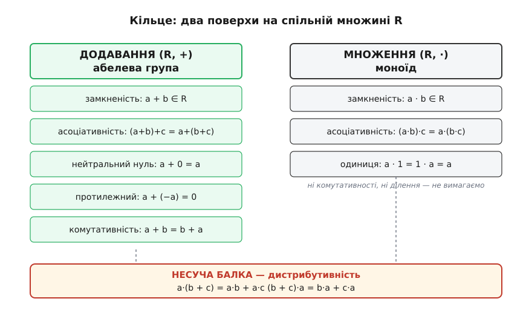
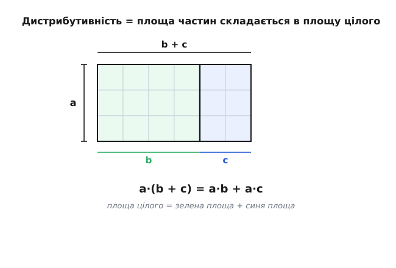
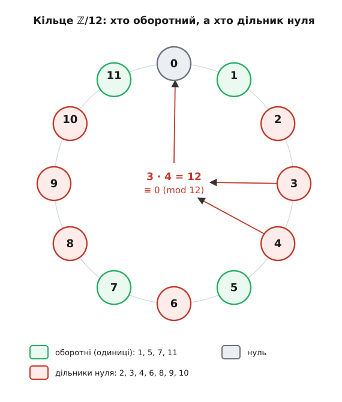
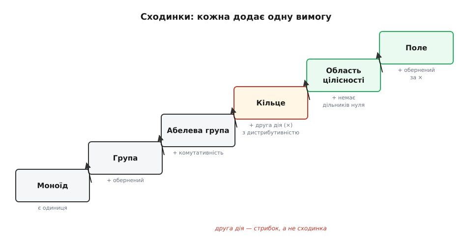

# Кільця: додавання й множення в одній структурі

<preknowlist>
- [Множина](root:math-logic/set-theory) — що таке множина, елемент і належність: кільце будують як множину, на якій задано дві дії.
- [Модульна арифметика](root:math-number-theory/modular-arithmetic) — лишки за модулем n і «годинникове» додавання та множення: це наскрізний приклад скінченного кільця в усій статті.
- [Групи](root:math-algebra/group-theory) — група, абелева (комутативна) група, нейтральний і обернений елемент: додавання в кільці — це рівно абелева група, і половину означення ви вже знатимете.
</preknowlist>

Ціле число, звичайний дріб, лишок за модулем 12 на циферблаті годинника, многочлен, навіть квадратна матриця — речі різні на вигляд, а поводяться напрочуд однаково. У кожній із них можна **додавати** й **множити**, і щоразу справджуються ті самі кілька законів: сума не залежить від порядку доданків, множення розкривається на суму, нуль нічого не змінює, від будь-якого числа можна відняти будь-яке. Коли в школі доводять, що «мінус на мінус дає плюс», це роблять для цілих; те саме доводять окремо для многочленів, окремо для матриць — і щоразу спираються рівно на ту саму жменю правил. Природно спитати: а що, як назвати цей спільний кістяк **один раз** і довести все потрібне теж один раз — так, щоб висновок автоматично накрив і цілі, і многочлени, і матриці, і лишки на годиннику?

Саме це й робить поняття **кільця** (англ. *ring*, від нім. *Zahlring* — «числове кільце»). Кільце — не нова екзотична конструкція, а ім'я для того **мінімального** набору правил, за яких «місце, де додають і множать» поводиться передбачувано. Уся стаття — про два питання: які саме закони треба вимагати (і чому ні більше, ні менше), і що з них випливає **задарма**, тобто в кожному кільці одночасно. А те, чому структуру назвали саме «кільцем» і як означення визрівало десятиліттями — від цілих чисел Дедекінда до аксіом Емми Нетер, — окрема, цілком реальна історія: [як народилося поняття кільця](root:math-algebra/rings/hist-ring-birth.md).

### Одну дію ми абстрагувати вже вміємо

Почнімо з половини, яка простіша, бо вона добре відома. Візьмімо на цілих числах саме тільки **додавання** й придивімося, які його властивості ми насправді використовуємо. Сума двох цілих — знову ціле (з множини не випадаємо). Дужки можна переставляти: (a + b) + c = a + (b + c). Є особливе число 0, що нічого не змінює: a + 0 = a. У кожного числа є **протилежне** −a, яке повертає до нуля: a + (−a) = 0 — саме тому можливе віднімання, бо відняти означає додати протилежне. І нарешті порядок доданків байдужий: a + b = b + a.

Множину з однією дією, що має ці властивості (замкненість, асоціативність, нейтральний елемент і оберненість), називають **групою** (а коли дія ще й переставна — **абелевою**, тобто комутативною, групою). Цілі числа за додаванням — це абелева група, і будь-яку властивість, доведену «для абелевих груп узагалі», не треба переводити окремо на цілі: вона вже про них. Це і є смак абстракції в мініатюрі. Але арифметика — це **дві** дії, а не одна; і найцікавіше починається там, де вони зустрічаються.

> 🔧 **Навіщо це.** Розділивши арифметику на «структуру додавання» й «структуру множення», ми отримуємо мову, якою можна коротко сказати, чого саме бракує конкретному об'єкту. «Тут немає ділення» перекладається як «множення не утворює групи»; «тут переповнення заганяє суму по колу» — як «це кільце лишків». Замість переліку дивних поведінок — точний діагноз, якого правила бракує.

### Дві дії, і вони не чужі одна одній

Якби додавання й множення просто співіснували на одній множині, не зважаючи одне на одного, нічого цікавого не було б: дві окремі структури, що ділять спільні елементи. Уся сила арифметики в тому, що дії **пов'язані** — множення «поважає» додавання. Ось цей зв'язок:

```
a·(b + c) = a·b + a·c
```

Розкрити дужки — означає домножити на кожен доданок і скласти. Це закон **дистрибутивності** (лат. *distribuere* — розподіляти; звідси й українське «розподільний закон»). Він не є ані властивістю самого додавання, ані властивістю самого множення — він **про їхню взаємодію**, і саме він перетворює дві розрізнені дії на єдину арифметику. Тримаймо цю думку в голові: коли нижче ми складатимемо означення кільця, дистрибутивність буде не «ще одним пунктом у списку», а тим містком, заради якого весь список і будують.

### Що саме вимагають від кільця

Тепер зберімо означення — не як формальний список, а виводячи кожну вимогу з того, що ми хочемо зберегти. **Кільцем** називають множину R із двома діями, `+` і `·`, підпорядкованими трьом блокам умов.

**Перший блок — додавання поводиться ідеально.** Ми хочемо вільно додавати й віднімати, тож вимагаємо від `+` усього, що мали цілі числа: (R, +) — абелева група. Розпишімо, бо кожна вимога тут працює:

```
замкненість:      a + b ∈ R
асоціативність:   (a + b) + c = a + (b + c)
нейтральний 0:    a + 0 = a
протилежний:      a + (−a) = 0
комутативність:   a + b = b + a
```

Чому ми вимагаємо від додавання так багато, аж до комутативності? Бо саме на додаванні тримається можливість **віднімати** — а без віднімання не буде ні «перенести доданок в інший бік рівняння», ні тих коротких доведень, заради яких усе й затівається. Це фундамент, на ньому не економлять.

**Другий блок — множення поводиться скромніше.** Від `·` вимагаємо помітно менше: лише щоб добуток не випадав з R (замкненість) і щоб дужки можна було переставляти (асоціативність). Часто додають і третю умову — існування **одиниці** 1, нейтрального для множення (a·1 = a); множину з асоціативною дією та нейтральним елементом називають **моноїдом** (гр. *mónos* — один). Тоді множення в кільці — це моноїд.

```
замкненість:      a·b ∈ R
асоціативність:   (a·b)·c = a·(b·c)
одиниця 1:        a·1 = 1·a = a
```

А чому від множення вимагають **менше**, ніж від додавання, — без комутативності, без оберненості? Бо інакше з-під означення випали б найважливіші приклади. Квадратні [матриці](root:math-algebra/matrices-as-operations) множаться некомутативно: A·B здебільшого не дорівнює B·A — і ми точно хочемо, щоб матриці були кільцем. Цілі числа не мають оберненого за множенням (½ — уже не ціле число) — і їх ми теж не викидаємо. Тому в множення просять лише те, що є всюди; усе понад це стане **додатковою** властивістю окремих кілець, а не загальним законом.

> Домовленість про одиницю трохи різниться в різних авторів. Панівна домовленість сучасної алгебри вимагає 1 за означенням; структуру, у якій усе те саме, але одиниці немає, тоді виокремлюють словом **«ринг»** (англ. *rng* — «ring» без літери «i», без *identity*). У цій статті кільце має одиницю, і про це варто знати, зустрівши в іншому джерелі трохи інший договір.

**Третій блок — місток.** І нарешті дистрибутивність, що зшиває обидві дії — з обох боків, бо множення ми не оголосили переставним:

```
a·(b + c) = a·b + a·c
(b + c)·a = b·a + c·a
```

Ось і все означення. Придивімося до його будови: ліворуч — «поверх додавання» (повноцінна абелева група), праворуч — скромніший «поверх множення» (моноїд), а між ними — балка дистрибутивності, що робить їх однією спорудою, а не двома сусідніми.


*Кільце як двоповерхова споруда на спільній множині R. Ліве крило (зелене) — додавання: повна абелева група, тут можна вільно віднімати. Праве крило — множення: лише асоціативність і одиниця, ні комутативності, ні ділення не гарантовано. Несуча балка між крилами — дистрибутивність; приберіть її, і додавання з множенням стануть двома чужими діями на одній множині, а не арифметикою.*

### Чому саме дистрибутивність — а не якийсь інший місток

Легко прийняти дистрибутивність як даність зі школи, тож варто побачити, **чому** саме вона природна, а не випадково обрана. Уявімо прямокутну сітку з клітинок: a рядків, а в кожному рядку b + c клітинок, поділених на ліву частину (b) і праву (c). Скільки всього клітинок? Можна порахувати цілий прямокутник заввишки a й завширшки (b + c) — це a·(b + c). А можна порахувати ліву частину (a·b) і праву (a·c) окремо й скласти. Клітинки ті самі, тож два підрахунки зобов'язані збігтися:


*Геометричний корінь дистрибутивності. Один прямокутник a·(b+c) розрізано вертикаллю на a·b і a·c. Кількість клітинок не залежить від того, рахуємо ми цілий прямокутник чи дві половини й додаємо — тому a·(b+c) = a·b + a·c. Дистрибутивність не постулат зі стелі, а те, що «площа частин складається в площу цілого».*

Ця картинка — не доведення для абстрактного кільця (там немає ні клітинок, ні площ), а **джерело інтуїції**: дистрибутивність кодує сумісність двох дій так само, як площа сумісна з розрізанням. В означенні кільця ми беремо цю сумісність за аксіому — і саме з неї, як з'ясується, ллються всі «очевидні» шкільні факти, які насправді потребують обґрунтування.

### Що випливає задарма

Тепер винагорода за акуратність. Ми **не** вносили в аксіоми ні того, що «нуль, помножений на будь-що, дає нуль», ні того, що «мінус на мінус — плюс». І все ж обидва факти правдиві в **кожному** кільці — вони випливають із самих аксіом, головно з дистрибутивності. Покажімо перший, бо доведення коротке й показове.

**Твердження: у будь-якому кільці a·0 = 0.** Ключ — записати нуль як 0 + 0 (він же нейтральний для додавання) і розкрити дужки:

```
a·0 = a·(0 + 0)      нуль — нейтральний: 0 = 0 + 0
    = a·0 + a·0      дистрибутивність
```

Отже a·0 = a·0 + a·0. Ліворуч стоїть a·0, праворуч — те саме плюс іще одне a·0. Тепер згадаймо, що (R, +) — **група**: до обох боків можна додати протилежне до a·0, тобто відняти a·0. Ліворуч лишається 0, праворуч — a·0:

```
0 = a·0
```

Зверніть увагу, де саме спрацювала кожна аксіома: дистрибутивність дала розклад, а групова природа додавання дозволила «скоротити» a·0. Приберіть будь-яку з половин — і твердження не доведеться. Так само з дистрибутивності випливає, що (−a)·b = −(a·b), а звідси й (−a)·(−b) = a·b: те саме «мінус на мінус — плюс», але тепер це **теорема**, чинна для цілих, для многочленів, для матриць і для лишків одночасно. Повний ланцюжок цих виведень — уся елементарна «арифметика знаків», що падає з трьох блоків аксіом, — розписаний окремо: [елементарні наслідки аксіом кільця](root:math-algebra/rings/math-consequences.md).

### Звіринець кілець: та сама рама, різні мешканці

Аксіоми навмисне ощадливі, тому під них підпадає строката компанія об'єктів. Пройдімося нею — і водночас познайомимося з властивостями, яких **немає** в загальному означенні, а тому вони й розрізняють кільця між собою.

**Комутативні й ні.** У цілих a·b = b·a — таке кільце звуть **комутативним**. У кільці квадратних матриць це вже не так, і саме тому матриці — навчальний приклад некомутативного кільця: порядок множників змінює результат. Уся «шкільна» алгебра живе в комутативних кільцях, тож легко забути, що комутативність множення — розкіш, а не закон.

**Зі скінченної жмені елементів.** Кільцю не конче бути нескінченним. Візьмімо лишки за модулем n — [числа на годиннику](root:math-number-theory/modular-arithmetic), де після n−1 знову йде 0. Додавання й множення там — звичайні, тільки результат щоразу беруть за модулем n. Легко перевірити всі аксіоми, тож ℤ/nℤ (читають «зет по модулю n») — повноцінне скінченне кільце. І саме на ньому найяскравіше видно те, чого в цілих не буває.

**Дільники нуля — несподіванка модульної арифметики.** У цілих числах добуток двох ненульових ніколи не дорівнює нулю: якщо a·b = 0, то принаймні один із множників — нуль. У ℤ/12 це вже неправда:

**Приклад: два ненульові множники з нульовим добутком у ℤ/12.**

```
3 · 4 = 12
12 ≡ 0  (mod 12)   бо 12 = 1·12 + 0
отже у ℤ/12:  3 · 4 = 0,   хоча  3 ≠ 0  і  4 ≠ 0
```

Такі 3 і 4 називають **дільниками нуля** (англ. *zero divisors*). Їхня поява — не патологія, а прямий наслідок того, що ми пустили числа по колу: 3 і 4 «складаються» в модуль 12 і тому анулюються. Кільце, у якому дільників нуля **немає** (і яке комутативне з одиницею), звуть [областю цілісності](root:math-algebra/integral-domain) — там добуток нульовий лише коли нульовий котрийсь множник, і тому в ній, як і серед цілих, можна скорочувати рівність a·c = b·c до a = b. Цілі числа — область цілісності; ℤ/12 — ні; а ℤ/p для простого p — знову так.

**Оборотні елементи.** Інша розрізнювальна властивість — чи має елемент **обернений за множенням**, тобто такий x, що a·x = 1. Серед цілих обернені мають лише 1 і −1 (більше ні для кого немає цілого дробу). У ℤ/n оборотними виявляються рівно ті лишки, що **взаємно прості** з n — не мають з ним спільного дільника, крім одиниці. Причина в тому, що рівняння a·x ≡ 1 (mod n) розв'язне тоді й лише тоді, коли [найбільший спільний дільник](root:math-number-theory/gcd-euclidean) a і n дорівнює 1 (це наслідок співвідношення Безу). Оборотні елементи звуть **одиницями** кільця (англ. *units*). У ℤ/12 їх чотири: 1, 5, 7, 11 — саме ті, що не ділять 12 спільно ні на що. Решта ненульових (2, 3, 4, 6, 8, 9, 10) — дільники нуля. Кожен ненульовий елемент скінченного комутативного кільця — або одиниця, або дільник нуля; третього не дано. Усе це — оборотні, дільники нуля, повну таблицю множення — найпростіше не лише довести, а й побачити в дії, зібравши ℤ/n як окремий числовий тип у коді з перевантаженими «+» і «·»: [кільце ℤ/n у коді](root:math-algebra/rings/proj-modular-ring.md).


*Кільце ℤ/12 на циферблаті. Зелені позиції — оборотні елементи (взаємно прості з 12): 1, 5, 7, 11; кожен має обернений за множенням. Червоні — дільники нуля: помножені на щось ненульове, вони можуть дати 0 (стрілка показує 3·4 = 12 ≡ 0). Нуль стоїть окремо. Що більше в n власних дільників, то менше зелених позицій — і то «дірявіше» множення.*

**Поля — верхівка.** Найщедріше кільце те, у якому оборотний **кожен** ненульовий елемент, тобто ділити можна на будь-що, крім нуля. Комутативне кільце з такою властивістю звуть [полем](root:math-algebra/field). Раціональні, дійсні й комплексні числа — поля; цілі — ні (ділення виводить за межі). А ℤ/n є полем **точно тоді**, коли n — [просте число](root:math-number-theory/prime-numbers): тоді кожен ненульовий лишок взаємно простий з n, отже оборотний, і дільників нуля немає. Візьміть складене n — і зразу з'являться дільники нуля, як 3·4 у ℤ/12, а поле розсиплеться. Ці **скінченні поля** ℤ/p (і їхні розширення) — не абстрактна екзотика: на них стоять [коди Галуа](root:math-algebra/finite-fields), якими рахують [CRC](root:math-algebra/crc-polynomials) та виправляють помилки в пам'яті й на дисках. Чому «ℤ/p — поле саме для простого p», з повним розбором оборотних і дільників нуля, розписано окремо: [структура кільця ℤ/nℤ](root:math-algebra/rings/math-znz-structure.md).

### Сходинки: від найскромнішого до найщедрішого

Помітно, що всі ці об'єкти вишиковуються в один ряд, де кожен наступний **додає одну вимогу** до попереднього. Це і є найкоротша карта місцевості.


*Сходинки абстрактних структур. Уздовж нижнього ряду — одна дія: моноїд (є одиниця) → група (є обернений) → абелева група (дія переставна). Кільце — стрибок угору: до абелевої групи за додаванням прищеплюють другу дію, множення, зшите дистрибутивністю. Далі знову по одній вимозі: область цілісності забороняє дільники нуля, поле дає обернений кожному ненульовому. Що вище, то менше об'єктів на сходинці, але то більше з них можна вичавити.*

Ця драбина пояснює, навіщо взагалі стільки назв. Кожна сходинка — це набір теорем, що тримаються рівно на її вимогах: доведене «для будь-якого кільця» справджується й для полів (вони теж кільця), але не навпаки. Тому, беручись за задачу, математик питає не «що це за об'єкт», а «на якій він сходинці» — і одразу знає, який інструментарій уже гарантовано працює.

### Ідеали: як із кільця роблять інше кільце

Лишається пояснити одну річ, яку ми весь час мовчки використовували: **звідки** береться ℤ/n. Виявляється, це окремий випадок загального прийому. У кільці цілих виберімо всі кратні дванадцяти — 0, ±12, ±24, … Ця підмножина замкнена не лише щодо додавання, а й «поглинає» множення: кратне дванадцяти, помножене на будь-яке ціле, лишається кратним дванадцяти. Підмножину з такою властивістю поглинання звуть **ідеалом** (нім. *Ideal*, від «ідеальних чисел» Куммера). Оголосивши всі елементи одного ідеалу «нулем» — тобто ототожнивши числа, що різняться на кратне 12, — ми й отримуємо ℤ/12. Ідеал у теорії кілець грає ту саму роль, що нормальна підгрупа в теорії груп: це рівно те, за чим можна **факторизувати**, склеївши кільце в менше кільце. Уся глибша будова кілець — розклад на прості множники, ділення з остачею, зв'язок з геометрією — говорить мовою ідеалів; тут же досить знати, що [ідеали й фактор-кільця](root:math-algebra/ideal) — це механізм, яким одне кільце перетворюють на інше, і що знайома модульна арифметика — його найпростіший плід.

### Навіщо це насправді

Абстракція виправдовує себе лише тим, що економить працю в конкретному, тож назвімо конкретне. Кільце ℤ/2³² — це те, як рахує **процесор**: беззнакове ціле переповнюється й іде по колу рівно за модулем 2³², тому арифметика фіксованої ширини (і хитрощі на кшталт [доповняльного коду](root:math-number-theory/twos-complement-algebra)) — це буквально дії в скінченному кільці лишків — не «баг», а точна структура. Кільце многочленів над полем GF(2) — це те, як влаштовані [CRC](root:math-algebra/crc-polynomials) та завадостійкі коди: біти читають як коефіцієнти, а ділення з остачею відбувається в [кільці многочленів](root:math-algebra/polynomial-rings). На арифметиці кілець лишків і скінченних полів стоїть уся сучасна криптографія з відкритим ключем.

І над усім цим — головний виграш, той самий, з якого ми починали. Теорема, доведена з аксіом кільця, — це **одна** теорема одразу про всі кільця: доводячи, що в області цілісності працює однозначний розклад на множники, ми водночас доводимо це для цілих чисел, для многочленів і для цілих Ґаусса a + b·i. Один ланцюжок міркувань — багато світів, у яких він істинний. Заради цього й варто було виокремити спільний кістяк додавання й множення та дати йому ім'я.
