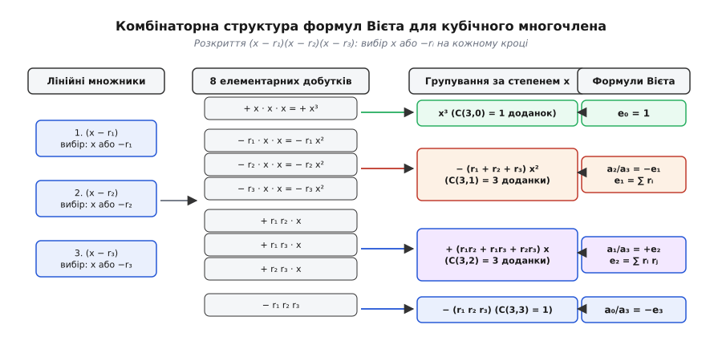
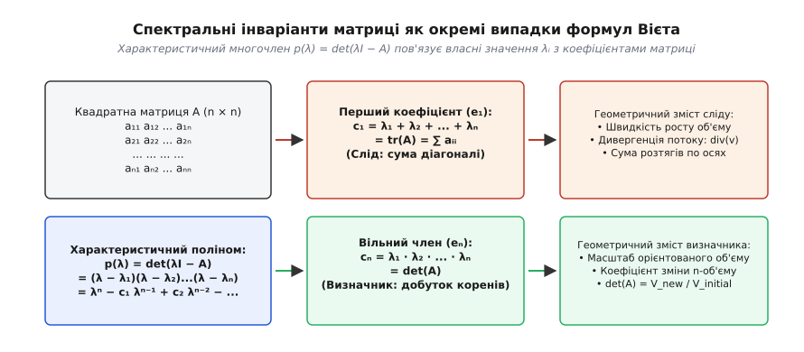
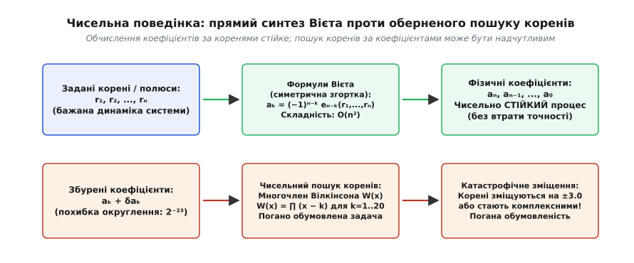

# Теорема Вієта

<preknowlist>
- [Поліноми](root:math-algebra/polynomials) — поняття алгебраїчного многочлена, його степеня, коренів та розкладу на лінійні множники.
- [Власні вектори та власні значення](root:math-algebra/eigenvalues) — характеристичний поліном, визначник і слід квадратної матриці.
- [Кільця многочленів](root:math-algebra/polynomial-rings) — кільцева структура многочленів, теорема Безу та алгебраїчна замкненість полів.
</preknowlist>

Коли інженер проєктує цифровий фільтр низьких частот для обробки аудіосигналу або налаштовує систему автоматичної стабілізації польоту безпілотного літального апарата, перед ним постає класична задача розміщення полюсів (pole placement). Щоб система реагувала на команди швидко, не зривалася в неконтрольований автоколивальний резонанс і плавно гасила зовнішні збурення, усі полюси її передавальної функції мають розташовуватися в строго визначених точках комплексної площини. Проте фізичний мікроконтролер чи аналогова електронна схема не можуть керувати окремими абстрактними полюсами безпосередньо. Вони оперують виключно реальними числовими коефіцієнтами: коефіцієнтами підсилення у контурах зворотного зв'язку, номіналами резисторів та конденсаторів або ваговими множниками різницевого рівняння в пам'яті сигнального процесора.

Виникає фундаментальна розбіжність між двома взаємно оберненими задачами:
1. **Пряма задача (аналіз динаміки):** Задано конкретні числові коефіцієнти системи — знайти її полюси (корені знаменника передавальної функції). Для систем п'ятого і вищих порядків ця задача не має універсального розв'язку у вигляді скінченних аналітичних формул у радикалах за теоремою Абеля — Руффіні, а чисельне знаходження коренів вимагає ітераційних наближень і супроводжується накопиченням похибок округлення.
2. **Обернена задача (синтез та керування):** Інженер заздалегідь знає бажане розташування полюсів — необхідно знайти точні коефіцієнти рівняння, які реалізують саме цю динаміку.

Теорема Вієта є точним аналітичним мостом, який пов'язує мікросвіт індивідуальних коренів (полюсів, резонансних частот, власних значень операторів) із макросвітом інтегральних коефіцієнтів рівняння. Вона доводить, що кожен коефіцієнт многочлена є базовою симетричною комбінацією його коренів, і дозволяє виконувати синтез систем миттєво та з абсолютною точністю.

## 1. Від розкладу на множники до розкриття дужок: походження симетрії

Щоб побачити внутрішній механізм теореми Вієта, відмовимося на мить від готових формул і простежимо, як утворюється алгебраїчний многочлен у процесі звичайного послідовного перемноження найпростіших лінійних двочленів.

Візьмімо довільний многочлен степеня `n` від однієї змінної, яку позначимо літерою `x`. Нехай значення многочлена позначається як `P(x)`. Припустимо, що нам відомі всі `n` коренів цього многочлена — тобто такі комплексні або дійсні числа, при підстановці яких замість `x` многочлен перетворюється на нуль: `P(r) = 0`. Позначимо ці корені як `r₁, r₂, ..., rₙ` (де літера `r` походить від латинського *radix* або англійського *root* — «корінь»).

За наслідком з теореми Безу та основною теоремою алгебри будь-який многочлен степеня `n` зі старшим коефіцієнтом, рівним одиниці (приведений многочлен), тотожно розкладається на добуток `n` лінійних множників:

```
P(x) = (x − r₁) · (x − r₂) · (x − r₃) · ... · (x − rₙ)
```

Що відбувається, коли ми починаємо перемножувати ці дужки між собою за звичайними законами алгебри?

За дистрибутивним законом (законом розподільності множення відносно додавання) розкриття добутку кількох дужок означає, що ми повинні сформувати суму всіх можливих добутків, утворюваних вибором **рівно одного доданка з кожної дужки**. З кожної окремої дужки `(x − rᵢ)` ми маємо рівно два взаємовиключні варіанти вибору: ми можемо взяти або змінну `x`, або від'ємний корінь `−rᵢ`.

### Квадратичний випадок: два корені та геометрія параболи

Розглянемо найпростіший нетривіальний випадок для многочлена другого степеня (`n = 2`), який має два корені `r₁` та `r₂`:

```
P(x) = (x − r₁) · (x − r₂)
```

Розкриємо дужки крок за кроком:
```
P(x) = x · x + x · (−r₂) + (−r₁) · x + (−r₁) · (−r₂)      [почленне множення]
     = x² − r₂ x − r₁ x + r₁ r₂                            [спрощення знаків]
     = x² − (r₁ + r₂) x + (r₁ r₂)                          [групування доданків при x]
```

Порівняємо отриманий вираз із канонічним записом квадратного тричлена `x² + p x + q = 0` (де коефіцієнт при старшому степені `x²` дорівнює одиниці):
- Коефіцієнт `p` при першому степені `x` дорівнює сумі коренів, узятій з протилежним знаком: `p = −(r₁ + r₂)`.
- Вільний член `q` (коефіцієнт при `x⁰`) дорівнює добутку коренів зі знаком плюс: `q = r₁ · r₂`.

Звідси негайно випливають класичні формули Вієта для квадратного рівняння:

```
r₁ + r₂ = −p
r₁ · r₂ = q
```

Ці дві прості рівності несуть глибокий геометричний зміст для графіка квадратичної функції — параболи `y = x² + px + q`:
1. **Вершина параболи та вісь симетрії:** Координата вершини параболи за віссю абсцис дорівнює `x_v = −p / 2 = (r₁ + r₂) / 2`. Тобто вісь симетрії параболи завжди проходить точно через середнє арифметичне її коренів.
2. **Дискримінант як геометрична відстань:** Класичний дискримінант квадратного тричлена `D = p² − 4q` після підстановки формул Вієта набуває кришталево чистого змісту:
```
D = (−(r₁ + r₂))² − 4(r₁ r₂)
  = r₁² + 2 r₁ r₂ + r₂² − 4 r₁ r₂   [розкриття квадрата суми]
  = r₁² − 2 r₁ r₂ + r₂²             [зведення подібних доданків]
  = (r₁ − r₂)²                      [згортання квадрата різниці]
```
Дискримінант квадратного рівняння є нічим іншим, як **квадратом відстані між його коренями на числовій осі**. Якщо корені збігаються (`r₁ = r₂`), відстань між ними дорівнює нулю, і дискримінант зануляється (`D = 0`). Якщо корені дійсні й різні, квадрат дійсної відстані строго додатний (`D > 0`). Якщо ж корені комплексно-спряжені `r₁, r₂ = u ± iv`, то `(r₁ − r₂)² = (2iv)² = −4v² < 0`, що безпосередньо пояснює від'ємність дискримінанта.

### Кубічний випадок: три корені та центр мас

Розглянемо многочлен третього степеня (`n = 3`), який утворюється перемноженням трьох дужок із коренями `r₁, r₂, r₃`:

```
P(x) = (x − r₁) · (x − r₂) · (x − r₃)
```

Оскільки кожна з трьох дужок надає один із двох варіантів (`x` або `−rᵢ`), повне розкриття виразу породжує дерево з `2³ = 8` елементарних доданків:

```
P(x) = x · x · x                                      [з усіх 3 дужок обрано x]
     + x · x · (−r₃) + x · (−r₂) · x + (−r₁) · x · x   [з 2 дужок обрано x, з 1 дужки — корінь]
     + x · (−r₂) · (−r₃) + (−r₁) · x · (−r₃) + (−r₁) · (−r₂) · x  [з 1 дужки обрано x, з 2 дужок — корені]
     + (−r₁) · (−r₂) · (−r₃)                          [з усіх 3 дужок обрано корені]
```

Згрупуємо всі подібні доданки за однаковими степенями змінної `x`:

```
P(x) = x³
     − (r₁ + r₂ + r₃) · x²
     + (r₁ r₂ + r₁ r₃ + r₂ r₃) · x
     − (r₁ r₂ r₃)
```


*Комбінаторна структура формул Вієта при розкритті кубічного многочлена. Кожен рівень відповідає вибору змінної x або кореня −rᵢ. Отримані 8 доданків групуються за степенем x у 4 коефіцієнти Вієта з чергуванням знаків.*

У кубічному виразі проявляються закономірності:
1. Коефіцієнт при `x²` містить суму всіх поодиноких коренів: `r₁ + r₂ + r₃`. Оскільки кожен корінь було взято зі знаком мінус один раз, цей коефіцієнт має знак мінус: `−(r₁ + r₂ + r₃)`.
   Геометрично точка перегину кубічної параболи `x_{inf} = (r₁ + r₂ + r₃) / 3` є центром мас (барицентром) трикутника коренів на комплексній площині.
2. Коефіцієнт при `x¹` містить суму всіх можливих попарних добутків коренів: `r₁ r₂ + r₁ r₃ + r₂ r₃`. Добуток двох від'ємних чисел `(−rᵢ) · (−rⱼ)` дає додатний знак `(−1)² = +1`, тому перед цією сумою стоїть знак плюс.
3. Вільний член містить повний добуток усіх трьох коренів: `r₁ r₂ r₃`. Добуток трьох від'ємних чисел має знак `(−1)³ = −1`, тому перед вільним членом стоїть знак мінус.

Історичний шлях цього відкриття — від таємного дешифрування іспанських королівських кодів Франсуа Вієтом у 1589 році до подолання бар'єра від'ємних чисел Альбером Жираром і Рене Декартом — детально викладено в історичному нарисі: [історія Франсуа Вієта та народження буквеної алгебри](root:math-algebra/vieta-formulas/hist-vieta-algebra.md).

## 2. Елементарні симетричні многочлени e_k: мова перестановок

Зверніть увагу на вирішальну алгебраїчну властивість отриманих коефіцієнтів: у кожному з них усі корені `r₁, r₂, ..., rₙ` мають абсолютно однакові права.

Якщо ми візьмемо вираз для суми попарних добутків трьох коренів `r₁ r₂ + r₁ r₃ + r₂ r₃` і поміняємо місцями, наприклад, перший корінь `r₁` та другий корінь `r₂`, сам вираз перетвориться на `r₂ r₁ + r₂ r₃ + r₁ r₃`. За комутативним законом додавання та множення чисел цей новий вираз тотожно дорівнює вихідному. Жодна перестановка індексів коренів не здатна змінити числове значення коефіцієнта.

Такі алгебраїчні вирази називають **симетричними многочленами**.

Введемо фундаментальні позначення для базових симетричних блоків, з яких будується вся поліноміальна алгебра. Нехай задано `n` змінних `r₁, r₂, ..., rₙ`. Елементарні симетричні многочлени позначаються літерою `e` з нижнім індексом `k` (де літера `e` походить від французького *élémentaire* або англійського *elementary*):

```
e₀(r₁, ..., rₙ) = 1
e₁(r₁, ..., rₙ) = r₁ + r₂ + ... + rₙ = ∑ᵢ rᵢ
e₂(r₁, ..., rₙ) = ∑_{1 ≤ i < j ≤ n} rᵢ rⱼ
e₃(r₁, ..., rₙ) = ∑_{1 ≤ i < j < k ≤ n} rᵢ rⱼ rₖ
...
eₖ(r₁, ..., rₙ) = ∑_{1 ≤ i₁ < i₂ < ... < iₖ ≤ n} r_{i₁} r_{i₂} ... r_{iₖ}
...
eₙ(r₁, ..., rₙ) = r₁ r₂ ... rₙ
```

Загальне число доданків у виразі для `eₖ` дорівнює кількості способів обрати `k` різних елементів із загальної множини з `n` доступних елементів без урахування порядку їх слідування. Це комбінаторне число сполучень `C(n, k)` (біноміальний коефіцієнт):

```
C(n, k) = n! / (k! · (n − k)!)
```

Наприклад, для многочлена четвертого степеня (`n = 4`):
- `e₁` містить `C(4, 1) = 4` доданки (сума окремих коренів).
- `e₂` містить `C(4, 2) = 6` доданків (сума попарних добутків: `r₁r₂ + r₁r₃ + r₁r₄ + r₂r₃ + r₂r₄ + r₃r₄`).
- `e₃` містить `C(4, 3) = 4` доданки (сума добутків по три корені: `r₁r₂r₃ + r₁r₂r₄ + r₁r₃r₄ + r₂r₃r₄`).
- `e₄` містить `C(4, 4) = 1` доданок (повний добуток чотирьох коренів: `r₁r₂r₃r₄`).

### Основна теорема про симетричні многочлени

Значення елементарних симетричних многочленів `eₖ` виходить далеко за межі простого скорочення запису.

> **Фундаментальна теорема про симетричні многочлени (теорема Гаусса):** Будь-який симетричний многочлен від `n` змінних з раціональними (або дійсними) коефіцієнтами можна однозначно виразити у вигляді многочлена від елементарних симетричних многочленів `e₁, e₂, ..., eₙ`.

У сучасній абстрактній алгебрі та теорії Галуа цей результат інтерпретують через інваріанти симетричної групи `Sₙ`. Якщо поле `K` розширюється приєднанням усіх коренів многочлена до поля розкладу `L = K(r₁, ..., rₙ)`, то група Галуа многочлена діє на корені як підгрупа перестановок `Sₙ`. Елементарні симетричні многочлени `eₖ` є нерухомими точками (інваріантами) відносно всіх перестановок групи `Sₙ`, а отже, вони строго лежать у базовому полі коефіцієнтів `K`, навіть якщо самі корені `rᵢ` є ірраціональними або комплексними величинами.

Це твердження має колосальний практичний наслідок: **будь-яку характеристику системи, яка не залежить від нумерації її коренів (наприклад, суму квадратів коренів, відстані між резонансами, дискримінант або слід степеня матриці), можна обчислити суто через коефіцієнти рівняння за скінченну кількість дій, не знаходячи самих коренів!**

## 3. Загальне формулювання теореми Вієта для степеня n

Тепер ми готові сформулювати та строго довести теорему Вієта для загального многочлена довільного натурального степеня `n`.

Нехай задано алгебраїчний многочлен `P(x)` степеня `n` у канонічному розгорнутому вигляді:

```
P(x) = aₙ xⁿ + aₙ₋₁ xⁿ⁻¹ + aₙ₋₂ xⁿ⁻² + ... + a₁ x + a₀
```

де коефіцієнти `aₙ, aₙ₋₁, ..., a₀` — задані комплексні або дійсні числа, причому старший коефіцієнт `aₙ ≠ 0`.

Якщо числа `r₁, r₂, ..., rₙ` є коренями цього многочлена (з урахуванням їхньої алгебраїчної кратності), то коефіцієнти многочлена пов'язані з коренями наступною системою рівностей:

```
aₙ₋₁ / aₙ = −e₁(r₁, ..., rₙ) = −(r₁ + r₂ + ... + rₙ)
aₙ₋₂ / aₙ = +e₂(r₁, ..., rₙ) = +(r₁ r₂ + r₁ r₃ + ... + rₙ₋₁ rₙ)
aₙ₋₃ / aₙ = −e₃(r₁, ..., rₙ) = −(r₁ r₂ r₃ + ... + rₙ₋₂ rₙ₋₁ rₙ)
...
aₙ₋ₖ / aₙ = (−1)ᵏ · eₖ(r₁, ..., rₙ)
...
a₀ / aₙ   = (−1)ⁿ · eₙ(r₁, ..., rₙ) = (−1)ⁿ · (r₁ r₂ ... rₙ)
```

У компактній формі формули Вієта записують єдиним виразом для довільного індексу `k` від `1` до `n`:

```
aₙ₋ₖ / aₙ = (−1)ᵏ · ∑_{1 ≤ i₁ < i₂ < ... < iₖ ≤ n} r_{i₁} r_{i₂} ... r_{iₖ}
```

### Покрокове аналітичне доведення

Доведемо теорему Вієта методом прирівнювання коефіцієнтів при однакових степенях змінної `x`.

1. За теоремою про розклад многочлена на лінійні множники многочлен `P(x)` можна подати як добуток:
```
P(x) = aₙ · (x − r₁) · (x − r₂) · ... · (x − rₙ)
```
Поділимо обидві частини рівності на ненульовий старший коефіцієнт `aₙ`:
```
P(x) / aₙ = (x − r₁) · (x − r₂) · ... · (x − rₙ)
```

2. Розкриємо добуток `n` дужок у правій частині за дистрибутивним законом. Щоб знайти коефіцієнт при довільному степені `xⁿ⁻ᵏ` (де `0 ≤ k ≤ n`), ми повинні підрахувати внесок усіх доданків, які утворюються вибором змінної `x` із точно `n − k` дужок та відповідних коренів `−rᵢ` із решти `k` дужок.

3. Кожен такий доданок має вигляд:
```
xⁿ⁻ᵏ · (−r_{i₁}) · (−r_{i₂}) · ... · (−r_{iₖ}) = (−1)ᵏ · (r_{i₁} r_{i₂} ... r_{iₖ}) · xⁿ⁻ᵏ
```

4. Додаючи всі можливі комбінації вибору `k` дужок із `n` доступних, отримуємо повний коефіцієнт при `xⁿ⁻ᵏ`:
```
(−1)ᵏ · [ ∑_{1 ≤ i₁ < ... < iₖ ≤ n} r_{i₁} ... r_{iₖ} ] · xⁿ⁻ᵏ = (−1)ᵏ · eₖ(r₁, ..., rₙ) · xⁿ⁻ᵏ
```

5. З іншого боку, прямий почленний поділ вихідного розгорнутого многочлена на `aₙ` дає:
```
P(x) / aₙ = xⁿ + (aₙ₋₁ / aₙ) xⁿ⁻¹ + (aₙ₋₂ / aₙ) xⁿ⁻² + ... + (aₙ₋ₖ / aₙ) xⁿ⁻ᵏ + ... + (a₀ / aₙ)
```

6. Оскільки два многочлени тотожно рівні для всіх значень `x` тоді й лише тоді, коли їхні відповідні коефіцієнти при однакових степенях `x` збігаються, прирівнюємо коефіцієнти при кожному `xⁿ⁻ᵏ`:
```
aₙ₋ₖ / aₙ = (−1)ᵏ · eₖ(r₁, ..., rₙ)
```
Теорему повністю доведено.

Множник `(−1)ᵏ` відповідає за суворе чергування знаків коефіцієнтів:
- При непарних `k` (перший коефіцієнт `aₙ₋₁`, третій `aₙ₋₃` тощо) знак міняється на протилежний: `(−1)¹ = −1`, `(−1)³ = −1`.
- При парних `k` (другий коефіцієнт `aₙ₋₂`, четвертий `aₙ₋₄` тощо) знак залишається додатним: `(−1)² = +1`, `(−1)⁴ = +1`.

## 4. Спектральна теорія матриць: слід і визначник як окремі випадки теореми Вієта

Найглибший фізичний та геометричний прояв формул Вієта відкривається в лінійній алгебрі при аналізі власних коливань, деформацій простору та спектрів лінійних операторів.

Нехай задано довільну квадратну матрицю `A` розміру `n × n` з дійсними або комплексними елементами:

```
    ┌                           ┐
    │  a₁₁   a₁₂   ...   a₁ₙ    │
    │  a₂₁   a₂₂   ...   a₂ₙ    │
A = │  ...   ...   ...   ...    │
    │  aₙ₁   aₙ₂   ...   aₙₙ    │
    └                           ┘
```

Власні значення матриці `A` (числа `λ₁, λ₂, ..., λₙ`, які визначають головні осі розтягу та власні частоти системи) є коренями **характеристичного полінома** матриці, що задається через визначник:

```
p(λ) = det(λ I − A) = 0
```

де `I` — одинична матриця розміру `n × n`, а символ `λ` (грецька літера «лямбда») позначає скалярну змінну.

Розкриємо характеристичний визначник `det(λ I − A)` за поліноміальною структурою:

```
p(λ) = λⁿ − c₁ λⁿ⁻¹ + c₂ λⁿ⁻² − c₃ λⁿ⁻³ + ... + (−1)ⁿ cₙ
```

За теоремою Вієта коренями характеристичного полінома `p(λ) = 0` є в точності власні значення матриці `λ₁, λ₂, ..., λₙ`. Звідси випливає фундаментальний спектральний зв'язок:

```
c₁ = λ₁ + λ₂ + ... + λₙ = e₁(λ₁, ..., λₙ)
c₂ = ∑_{i < j} λᵢ λⱼ   = e₂(λ₁, ..., λₙ)
...
cₙ = λ₁ · λ₂ · ... · λₙ = eₙ(λ₁, ..., λₙ)
```


*Зв'язок формул Вієта з інваріантами матриці. Перший коефіцієнт Вієта e₁ характеристичного многочлена тотожно дорівнює сліду матриці tr(A), а старший коефіцієнт eₙ — її визначнику det(A).*

Порівнюючи коефіцієнти характеристичного многочлена з елементами самої матриці `A`, отримуємо два наріжні закони спектральної теорії:

### 1. Слід матриці дорівнює сумі власних значень

Перший коефіцієнт `c₁` у розкладі визначника `det(λ I − A)` утворюється перемноженням діагональних елементів `(λ − a₁₁)(λ − a₂₂)...(λ − aₙₙ)` і дорівнює сумі всіх елементів головної діагоналі матриці. Ця величина називається **слідом матриці** (англ. *trace*, позначається `tr(A)` або `Sp(A)` від німецького *Spur*):

```
tr(A) = a₁₁ + a₂₂ + ... + aₙₙ = ∑ᵢ₌₁ⁿ aᵢᵢ
```

За теоремою Вієта:

```
tr(A) = λ₁ + λ₂ + ... + λₙ
```

**Слід будь-якої квадратної матриці завжди строго дорівнює сумі її власних значень.**

Геометричний зміст сліду: у гідродинаміці та теорії поля слід тензора швидкостей деформації задає **дивергенцію векторного поля** (`div v`) — миттєву швидкість відносного розширення або стиснення об'єму середовища під дією потоку.

### 2. Визначник матриці дорівнює добутку власних значень

Вільний член характеристичного многочлена отримується при підстановці `λ = 0`:

```
p(0) = det(0 · I − A) = det(−A) = (−1)ⁿ det(A)
```

З іншого боку, за формулами Вієта вільний член дорівнює `(−1)ⁿ eₙ = (−1)ⁿ (λ₁ · λ₂ · ... · λₙ)`. Прирівнюючи обидва вирази, маємо:

```
det(A) = λ₁ · λ₂ · ... · λₙ
```

**Визначник будь-якої квадратної матриці дорівнює повному добутку всіх її власних значень.**

Геометричний зміст визначника: величина `det(A)` показує коефіцієнт масштабування орієнтованого `n`-вимірного об'єму під час лінійного перетворення простору матрицею `A`. Якщо хоча б одне власне значення дорівнює нулю (`λᵢ = 0`), визначник перетворюється на нуль (`det(A) = 0`), простір «сплющується» у меншу розмірність, а матриця втрачає оберненість (стає виродженою).

Усі проміжні коефіцієнти `cₖ` характеристичного многочлена за теоремою Вієта дорівнюють сумам усіх головних діагональних мінорів порядку `k` матриці `A`.

## 5. Комплексно-спряжені пари коренів та дійсність коефіцієнтів

У практичних інженерних системах коефіцієнти передавальних функцій `aₖ` завжди є дійсними числами, тоді як корені (полюси) дуже часто є суто комплексними числами `r = u + iv` (де `i = √−1` — уявна одиниця, а `u` і `v` — дійсні числа).

Чому коефіцієнти многочлена залишаються строго дійсними, коли його корені містять уявну частину?

За фундаментальною властивістю поліномів із дійсними коефіцієнтами комплексні корені завжди виникають строго взаємними **комплексно-спряженими парами**: якщо число `r₁ = u + iv` є коренем многочлена, то спряжене число `r₂ = u − iv` обов'язково також є його коренем.

Простежимо дію формул Вієта на такій парі коренів:

1. **Сума коренів (перший коефіцієнт Вієта):**
```
e₁ = r₁ + r₂ = (u + iv) + (u − iv) = 2u
```
Уявні частини `+iv` та `−iv` взаємно знищуються, залишаючи суто дійсне число `2u ∈ ℝ`.

2. **Добуток коренів (другий коефіцієнт Вієта):**
```
e₂ = r₁ · r₂ = (u + iv) · (u − iv) = u² − (iv)² = u² − i² v² = u² + v²
```
Оскільки `i² = −1`, результат `u² + v²` є строго додатним дійсним числом, що дорівнює квадрату модуля комплексного кореня `|r₁|²`.

Перемножуючи відповідні дужки `(x − r₁)(x − r₂) = x² − 2u x + (u² + v²)`, ми отримуємо незвідний квадратний тричлен із виключно дійсними коефіцієнтами. Це пояснює, чому будь-який многочлен із дійсними коефіцієнтами завжди розкладається на добуток дійсних лінійних множників `(x − r)` та дійсних квадратних тричленів `(x² + px + q)`.

## 6. Зв'язок коренів похідної з коренями многочлена: теорема Гауса — Люка

Розглянемо зв'язок між формулами Вієта для вихідного многочлена `P(x)` та формулами Вієта для його похідної `P'(x)`.

Нехай приведений многочлен `P(x) = xⁿ − e₁ xⁿ⁻¹ + e₂ xⁿ⁻² − ...` має корені `r₁, r₂, ..., rₙ`. Знайдемо його похідну:

```
P'(x) = n xⁿ⁻¹ − (n − 1) e₁ xⁿ⁻² + (n − 2) e₂ xⁿ⁻³ − ...
```

Поділивши похідну на її старший коефіцієнт `n`, отримуємо приведений многочлен степеня `n − 1`:

```
P'(x) / n = xⁿ⁻¹ − ((n − 1) / n) e₁ xⁿ⁻² + ((n − 2) / n) e₂ xⁿ⁻³ − ...
```

Нехай числа `r'₁, r'₂, ..., r'_{n-1}` є коренями похідної `P'(x) = 0` (критичними точками многочлена). За теоремою Вієта для многочлена похідної сума її коренів дорівнює:

```
r'₁ + r'₂ + ... + r'_{n-1} = ((n − 1) / n) e₁ = ((n − 1) / n) · (r₁ + r₂ + ... + rₙ)
```

Поділимо обидві частини рівності на кількість коренів похідної `n − 1`:

```
(1 / (n − 1)) · ∑ⱼ₌₁ⁿ⁻¹ r'ⱼ = (1 / n) · ∑ᵢ₌₁ⁿ rᵢ
```

Це дивовижний інваріант: **середнє арифметичне коренів похідної многочлена в точності дорівнює середньому арифметичному коренів самого многочлена!**

Геометрично на комплексній площині це означає, що **барицентр (центр тяжіння)** множини нулів многочлена зберігається при взятті довільної кількості похідних. Більше того, за класичною **теоремою Гауса — Люка** всі корені похідної `P'(x)` завжди лежать строго всередині опуклої оболонки коренів вихідного многочлена `P(x)` на комплексній площині.

## 7. Дискримінант кубічного многочлена як симетричний інваріант

У загальному випадку дискримінант многочлена степеня `n` визначається як добуток квадратів різниць між усіма можливими парами його коренів:

```
Δ = aₙ²ⁿ⁻² · ∏_{1 ≤ i < j ≤ n} (rᵢ − rⱼ)²
```

Оскільки вираз `∏ (rᵢ − rⱼ)²` не змінюється при будь-якій перестановці коренів, він є симетричним многочленом від `r₁, ..., rₙ`, а отже, за фундаментальною теоремою Гаусса, точно виражається через коефіцієнти Вієта `e₁, ..., eₙ`.

Для кубічного многочлена `P(x) = (x − r₁)(x − r₂)(x − r₃)` дискримінант містить три множники:

```
Δ = (r₁ − r₂)² · (r₁ − r₃)² · (r₂ − r₃)²
```

Проаналізуємо знак `Δ` для многочлена з дійсними коефіцієнтами:
1. **Три попарно різні дійсні корені:** Усі різниці `rᵢ − rⱼ` є ненульовими дійсними числами. Квадрат кожного дійсного числа строго додатний, тому добуток трьох додатних квадратів дає `Δ > 0`.
2. **Наявність кратного кореня (наприклад, `r₁ = r₂`):** Перша різниця зануляється `r₁ − r₂ = 0`, що дає `Δ = 0`.
3. **Один дійсний корінь `r₁ = u` та пара комплексно-спряжених коренів `r₂, r₃ = v ± iw`:**
   - Квадрат різниці комплексно-спряжених коренів: `(r₂ − r₃)² = (2iw)² = −4w² < 0` (строго від'ємне число!).
   - Добуток двох інших множників: `(r₁ − r₂)² · (r₁ − r₃)² = [(u − v − iw)(u − v + iw)]² = [(u − v)² + w²]² > 0` (строго додатне число).
   - Множення додатного числа на від'ємне дає `Δ < 0`.

Формули Вієта дають вичерпне пояснення правила: кубічне рівняння має три дійсні корені тоді й лише тоді, коли його дискримінант додатний (`Δ > 0`), і має комплексну пару коренів тоді й лише тоді, коли `Δ < 0`.

## 8. Розібраний приклад многочлена 4-го степеня з парною симетрією

Розглянемо многочлен четвертого степеня (`n = 4`), корені якого розташовані симетрично відносно початку координат:

```
r₁ = 1,   r₂ = −1,   r₃ = 2,   r₄ = −2
```

Обчислимо всі елементарні симетричні многочлени `e₁, e₂, e₃, e₄` за формулами Вієта:

**1. Перший симетричний многочлен (e₁):**
```
e₁ = r₁ + r₂ + r₃ + r₄
   = 1 + (−1) + 2 + (−2) = 0   [підстановка коренів та взаємне скорочення]
```

**2. Другий симетричний многочлен (e₂):**
Сума всіх `C(4, 2) = 6` попарних добутків:
```
e₂ = r₁r₂ + r₁r₃ + r₁r₄ + r₂r₃ + r₂r₄ + r₃r₄
   = 1·(−1) + 1·2 + 1·(−2) + (−1)·2 + (−1)·(−2) + 2·(−2)   [підстановка числових значень]
   = −1 + 2 − 2 − 2 + 2 − 4 = −5                            [попарне множення та підсумовування]
```

**3. Третій симетричний многочлен (e₃):**
Сума всіх `C(4, 3) = 4` добутків по три корені:
```
e₃ = r₁r₂r₃ + r₁r₂r₄ + r₁r₃r₄ + r₂r₃r₄
   = 1·(−1)·2 + 1·(−1)·(−2) + 1·2·(−2) + (−1)·2·(−2)   [підстановка числових значень]
   = −2 + 2 − 4 + 4 = 0                                 [потрійне множення та взаємне скорочення]
```

**4. Четвертий симетричний многочлен (e₄):**
Повний добуток усіх чотирьох коренів:
```
e₄ = r₁ r₂ r₃ r₄ = 1 · (−1) · 2 · (−2) = 4
```

Складемо многочлен за формулами Вієта:
```
P(x) = x⁴ − e₁ x³ + e₂ x² − e₃ x + e₄
     = x⁴ − 0·x³ + (−5)·x² − 0·x + 4   [підстановка обчислених коефіцієнтів e_k]
     = x⁴ − 5x² + 4                    [спрощення та усунення нульових доданків]
```

Перевіримо результат прямим перемноженням біквадратних дужок:
```
P(x) = (x − 1)(x + 1) · (x − 2)(x + 2)
     = (x² − 1) · (x² − 4)              [згортання різниць квадратів]
     = x⁴ − 4x² − x² + 4                [дистрибутивне множення дужок]
     = x⁴ − 5x² + 4                     [зведення подібних доданків]
```

Збіг абсолютно точний. Цей приклад наочно демонструє важливе правило: **якщо множина коренів многочлена є симетричною відносно нуля (для кожного кореня `r` існує корінь `−r`), усі непарні коефіцієнти Вієта `e₁, e₃, e₅, ...` строго дорівнюють нулю, і многочлен стає суто парною функцією.**

## 9. Суми степенів Ньютона (s_k) та тотожності Ньютона — Жирара

У теоретичній фізиці, теорії графів, математичній статистиці та аналізі даних часто виникає задача обчислити суму однакових степенів коренів:

```
sₖ = r₁ᵏ + r₂ᵏ + r₃ᵏ + ... + rₙᵏ = ∑ᵢ₌₁ⁿ rᵢᵏ
```

Наприклад:
- У статистиці `s₁` задає середнє арифметичне (перший момент), `s₂` визначає дисперсію та середньоквадратичне відхилення, `s₃` — коефіцієнт асиметрії, `s₄` — ексцес (гостровершинність) розподілу.
- У теорії графів за спектральною теоремою величина `sₖ = tr(Aᵏ)` дорівнює кількості замкнених маршрутів довжини `k` у графі.
- У механіці суми степенів визначають моменти інерції тіла відносно координатних осей.

Як знайти суми степенів `sₖ`, якщо корені `rᵢ` невідомі, а задано лише коефіцієнти рівняння `e₁, e₂, ..., eₙ`?

Пряме розкриття дужок на кшталт `(r₁ + r₂ + ... + rₙ)⁴` для великих степенів є комбінаторно важким. Зв'язок між сумами степенів `sₖ` та елементарними многочленами `eₖ` встановлюють **тотожності Ньютона — Жирара**:

```
s₁ − e₁ = 0                                       →  s₁ = e₁
s₂ − e₁ s₁ + 2 e₂ = 0                             →  s₂ = e₁ s₁ − 2 e₂
s₃ − e₁ s₂ + e₂ s₁ − 3 e₃ = 0                     →  s₃ = e₁ s₂ − e₂ s₁ + 3 e₃
s₄ − e₁ s₃ + e₂ s₂ − e₃ s₁ + 4 e₄ = 0             →  s₄ = e₁ s₃ − e₂ s₂ + e₃ s₁ − 4 e₄
...
sₖ − e₁ sₖ₋₁ + e₂ sₖ₋₂ − ... + (−1)ᵏ k eₖ = 0    (для k ≤ n)
```

Для вищих степенів `k > n` члени `eₖ` зануляються, і рекурентність набуває спрощеного вигляду порядку `n`:

```
sₖ − e₁ sₖ₋₁ + e₂ sₖ₋₂ − ... + (−1)ⁿ eₙ sₖ₋ₙ = 0  (для k > n)
```

Повне аналітичне виведення цих співвідношень через логарифмічну похідну многочлена, розклад у формальні степеневі ряди, теорію контурних інтегралів Коші та формулу Варінга представлено в окремій математичній вставці: [виведення тотожностей Ньютона — Жирара](root:math-algebra/vieta-formulas/math-newton-identities.md).

## 10. Розв'язання нелінійних систем симетричних рівнянь

Одне з найефективніших практичних застосувань теореми Вієта — аналітичне розв'язання систем нелінійних рівнянь високих степенів.

### Покроковий приклад системи 3-го порядку

Розв'яжемо систему трьох нелінійних рівнянь відносно змінних `x, y, z`:

```
x + y + z = 6
x² + y² + z² = 14
x³ + y³ + z³ = 36
```

Якщо намагатися розв'язувати цю систему методом підстановки (виражаючи `z = 6 − x − y` і підставляючи в друге та третє рівняння), ми отримаємо громіздке рівняння четвертого або шостого степеня від двох змінних із перехресними членами.

Застосуємо теорему Вієта та формули Ньютона:

**Крок 1: Ідентифікація сум степенів**
Ліві частини системи є сумами степенів невідомих величин `x, y, z`:
- `s₁ = x + y + z = 6`
- `s₂ = x² + y² + z² = 14`
- `s₃ = x³ + y³ + z³ = 36`

**Крок 2: Обчислення елементарних симетричних многочленів**
За тотожностями Ньютона знаходимо коефіцієнти Вієта:
1. `e₁ = s₁ = 6`
2. `e₂ = (e₁ s₁ − s₂) / 2 = (6 · 6 − 14) / 2 = (36 − 14) / 2 = 22 / 2 = 11`
3. `e₃ = (e₁ s₂ − e₂ s₁ + s₃) / 3 = (6 · 14 − 11 · 6 + 36) / 3 = (84 − 66 + 36) / 3 = 54 / 3 = 18 / 3 = 6`

Отримуємо:
- `e₁ = x + y + z = 6`
- `e₂ = xy + xz + yz = 11`
- `e₃ = xyz = 6`

**Крок 3: Складання та розв'язання допоміжного рівняння**
За теоремою Вієта невідомі числа `x, y, z` є коренями кубічного рівняння від допоміжної змінної `t`:

```
t³ − e₁ t² + e₂ t − e₃ = 0
t³ − 6t² + 11t − 6 = 0
```

Розкладемо цей кубічний многочлен на лінійні множники:
```
t³ − 6t² + 11t − 6 = (t − 1) · (t − 2) · (t − 3) = 0
```

Коренями допоміжного рівняння є числа:
```
t₁ = 1,   t₂ = 2,   t₃ = 3
```

**Крок 4: Формування множини розв'язків**
Оскільки система є абсолютно симетричною відносно будь-якої перестановки змінних `x, y, z`, розв'язком є будь-яка перестановка знайденої трійки чисел `{1, 2, 3}`.

Система має рівно `3! = 6` точних розв'язків у тривимірному просторі `(x, y, z)`:
1. `(1, 2, 3)`
2. `(1, 3, 2)`
3. `(2, 1, 3)`
4. `(2, 3, 1)`
5. `(3, 1, 2)`
6. `(3, 2, 1)`

Задача розв'язана точно, у кілька рядків, без розкриття дужок і без ітерацій.

Програмну реалізацію алгоритму розв'язання симетричних систем на мовах C та C++ з аналізом складності та векторизацією представлено у практичному модулі: [алгоритм розв'язання симетричних систем і синтезу поліномів](root:math-algebra/vieta-formulas/proj-symmetric-solver.md).

## 11. Аналіз стійкості динамічних систем за коефіцієнтами Вієта

У теорії автоматичного керування та диференціальних рівняннях стійкість лінійної неперервної динамічної системи (наприклад, контуру стабілізації літака чи системи керування промисловим роботом) визначається положенням коренів її характеристичного рівняння:

```
aₙ sⁿ + aₙ₋₁ sⁿ⁻¹ + ... + a₁ s + a₀ = 0
```

Система є асимптотично стійкою за Ляпуновим тоді й лише тоді, коли всі її корені лежать у лівій комплексній півплощині: `Re(rᵢ) < 0` (всі дійсні частини коренів є строго від'ємними).

Формули Вієта дають негайну необхідну умову стійкості:
1. Оскільки всі корені мають від'ємні дійсні частини, сума коренів `∑ rᵢ` обов'язково є від'ємною величиною. За формулами Вієта `aₙ₋₁ / aₙ = −∑ rᵢ > 0`.
2. Повний добуток `∏ rᵢ` для системи з `n` стійких коренів (розбитих на дійсні від'ємні числа та пари комплексно-спряжених чисел із додатною нормою) має знак `(−1)ⁿ`. За формулами Вієта `a₀ / aₙ = (−1)ⁿ ∏ rᵢ > 0`.
3. Застосовуючи формули Вієта до всіх елементарних симетричних многочленів, отримуємо **правило знаків Стодоли**: **для стійкості системи необхідно, щоб усі коефіцієнти характеристичного многочлена `aₙ, aₙ₋₁, ..., a₀` мали строго однаковий знак (були строго додатними за умови `aₙ > 0`).**

Якщо серед коефіцієнтів многочлена є нульовий або від'ємний член, інженер без жодних додаткових розрахунків одразу знає: система нестабільна, і її ввімкнення призведе до аварійного розгону автоколивань.

Для повної перевірки стійкості коефіцієнти Вієта організовують у спеціальну матрицю Гурвіца, головні мінори якої за формулами Вієта визначають знаки дійсних частин коренів.

## 12. Чисельна чутливість та явище Вілкінсона

Попри бездоганну аналітичну точність теореми Вієта, при її практичному використанні в обчислювальній математиці виникає асиметрія між двома напрямками розрахунку:

```
Прямий напрямок (корені → коефіцієнти):   ЧИСЕЛЬНО СТІЙКИЙ
Зворотний напрямок (коефіцієнти → корені): ЧИСЕЛЬНО НЕСТІЙКИЙ (погано обумовлений)
```


*Порівняння прямої та оберненої задач. Перехід від коренів до коефіцієнтів за формулами Вієта є стійким, тоді як зворотний пошук коренів за коефіцієнтами може бути катастрофічно нестійким через явище Вілкінсона.*

### Поліном Вілкінсона (James H. Wilkinson, 1963)

У 1963 році видатний британський математик Джеймс Вілкінсон продемонстрував класичний приклад надчутливості поліноміальних коренів. Розглянемо многочлен двадцятого степеня з цілими коренями від 1 до 20:

```
W(x) = (x − 1) · (x − 2) · (x − 3) · ... · (x − 20)
     = x²⁰ − 210 x¹⁹ + ... + 2432902008176640000
```

Якщо змінити коефіцієнт при `x¹⁹` (який дорівнює `−210`) на мізерну величину `2⁻²³ ≈ 1.19 · 10⁻⁷` (що відповідає похибці всього в одному молодшому біті мантиси числа з плаваючою комою):

```
W̃(x) = W(x) − 2⁻²³ · x¹⁹
```

то поведінка коренів змінюється катастрофічно:
- Корені `x = 10` та `x = 11` стикаються і перетворюються на комплексно-спряжену пару `10.86 ± 1.44i`.
- Корені `x = 15` та `x = 16` зміщуються на кілька цілих одиниць і стають парою `15.73 ± 2.65i`.
- Корені зміщуються на відстань, яка у мільйони разів перевищує величину початкового збурення коефіцієнта!

Цей ефект обумовлений тим, що число обумовленості задачі знаходження коренів за коефіцієнтами многочлена пропорційне `1 / |P'(rᵢ)|`. Для згрупованих коренів похідна стає дуже малою, що багаторазово підсилює будь-яку похибку округлення коефіцієнтів.

### Інженерний висновок

1. **Для прямої задачі (синтез фільтрів, генерація коефіцієнтів за заданими полюсами):** Формули Вієта є ідеальним, швидким і стійким інструментом.
2. **Для оберненої задачі (знаходження коренів многочлена степеня `n > 5` за його коефіцієнтами):** Замість прямого розв'язання поліноміальних рівнянь слід будувати супутню матрицю Фробеніуса `C(P)` та знаходити її власні значення через чисельно стійкий `QR`-алгоритм, або каскадувати фільтри на секції другого порядку (Biquad SOS).
