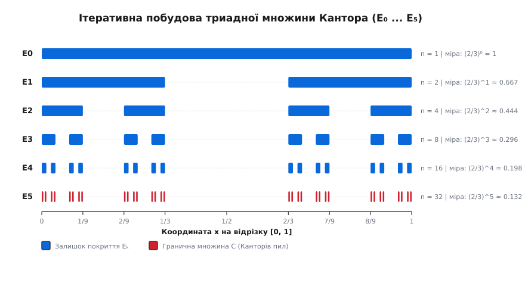
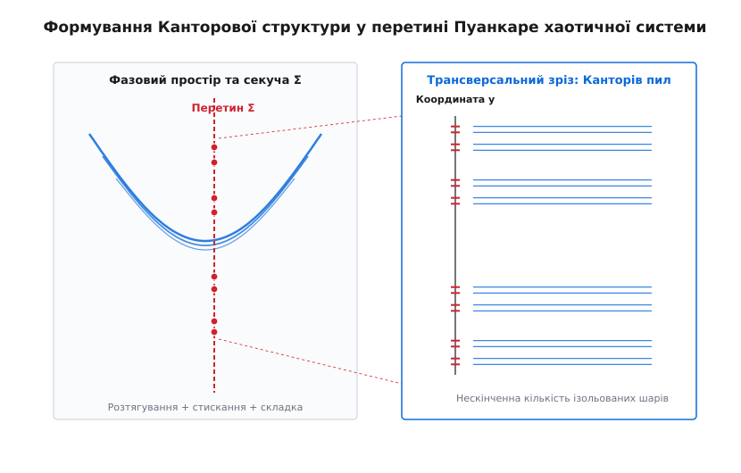
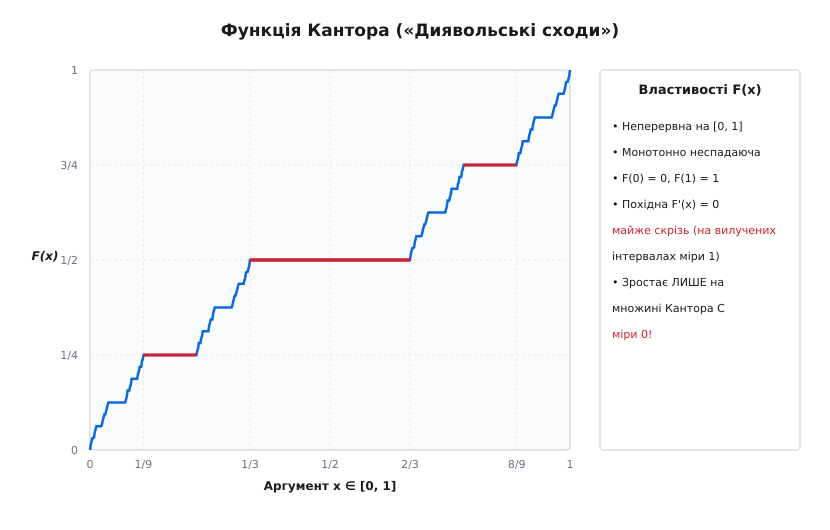

# Множина Кантора

<preknowlist>
- [Детермінований хаос](root:math-analysis/deterministic-chaos) — концепція нелінійної чутливості до початкових умов та формація дивних атракторів у дисипативних системах.
- [Фазовий портрет](root:math-analysis/phase-portrait) — геометричне представлення станів механічної системи у координатах позиція-імпульс.
- [Відображення Ено](root:math-analysis/henon-map) — двовимірна дискретна система зі стисканням та згином фазового аркуша.
</preknowlist>

У класичній гамільтоновій механіці збереження фазового об'єму за теоремою Ліувілля гарантує, що траєкторія замкненої системи гладко розгортається на інваріантних торах. Дивергенція векторного поля швидкостей у фазовому просторі дорівнює нулю `div(f) = 0`, що означає абсолютне збереження будь-якої початкової фазової області. Проте будь-яка реальна фізико-механічна система — від коливань маятника під дією в'язкого тертя та періодичного збудження до руху небесних тіл у середовищі з дисипацією — є дисипативною. У таких системах дивергенція є від'ємною `div(f) < 0`, через що початковий фазовий об'єм експоненційно стискається зі швидкістю `exp(-γ·t)`.

Якби це дисипативне стискання відбувалося рівномірно й без нелінійного зсуву, усі початкові стани системи неминуче осідали б на тривіальну точкову рівновагу або гладкий одномірний граничний цикл. Однак у нелінійних механічних системах стискання уздовж стійких напрямків супроводжується локальним експоненційним розтягуванням уздовж нестійких напрямків із показниками Ляпунова `λ₁ > 0`. Оскільки фазовий простір фізичної системи є обмеженим енергетичними бар'єрами, розтягнута траєкторія не може уходити на нескінченність. Система змушена згинати, витягувати та накладати фазовий аркуш сам на себе нескінченну кількість разів.

Якщо розрізати таку складну багатошарову структуру секучою площиною Пуанкаре, неперервна траєкторія залишить на ній не гладку криву і не скінченний набір точок, а нескінченний пасмовий узор із паралельних шарів. У будь-якому, навіть найменшому околі будь-якої точки цього перетину виявляється нескінченна кількість нових тонших шарів, розділених порожнечами. Отриманий геометричний об'єкт — **множина Кантора** (англ. *Cantor set*) — слугує фундаментальним канонічним архетипом фрактальної мікроструктури фазового простору нелінійного хаосу.

## 1. Механізм дисипативного складання та поява фрактального розрізу

Виникнення множини Кантора у фізичній механіці безпосередньо випливає з топологічного механізму підкови Смейла. Розглянемо вимушений осцилятор із згасанням, рівняння руху якого задається у вигляді:

```
d²x / dt² + γ·(dx / dt) - x + x³ = F·cos(ω·t)
```

Трьохвимірний фазовий простір `(x, v, t)` під дією дисипативного терма `γ·v` стискає об'єм елементарної області. Щоб візуалізувати внутрішню геометрію руху, зафіксуємо секучу площину Пуанкаре `Σ`, що відповідає стробоскопічним зрізам фазового стану через кожен період зовнішньої сили `T = 2π / ω`.

Розглянемо квадратний елемент фазової площини `S = [0, 1] × [0, 1]`, що задає множину початкових станів механічної системи. За один період `T` дисипація стискає цей квадрат по вертикальній осі в `b` разів (де `b < 0.5`), а нелінійне підсилення розтягує його по горизонтальній осі в `a` разів (де `a > 2`). Наступним кроком нелінійне перетворення згинає витягнуту смугу у формі U-подібної підкови та накладає її назад на вихідну область `S`.

У результаті першої ітерації усередині початкового квадрата залишаються лише дві горизонтальні смуги шириною `b`. Механічний стан системи, що залишається усередині квадрата протягом двох періодів, повинен лежати на перетині цих нових смуг. Повторення цього геометричного перетворення `k` разів згортає кожну смугу на дві вужчі, утворюючи `2ᵏ` горизонтальних шарів товщиною `bᵏ`.

Яскравим реальним прикладом такої механічної системи є **магнітний маятник**, що здійснює коливання у полі трьох симетрично розташованих постійних магнітів. За наявності згасання та періодичної сили збудження маятник хаотично притягується то до одного, то до іншого магнітного полюса. Якщо виміряти координати точки перетину траєкторії маятника стробоскопічним плоскорізом Пуанкаре через кожен період збудження, отриманий розріз показує трикомпонентний дивний атрактор, трансверсальна мікроструктура якого складається з нескінченних шарів Канторової триадного вилучення.

Аналогічно у знаменитій моделі конвекції Лоренца тривимірний потік фазової рідини `(x, y, z)` після розрізання площиною `z = r - 1` дає двовимірне відображення повернення. Суцільні криві атрактора Лоренца у трансверсальному напрямку виявляються не суцільним об'ємом, а нескінченним пасмом Канторового пилу з дробовою вимірністю `d ≈ 2.06` для всього тривимірного атрактора та `d_sec ≈ 0.06` для трансверсального розрізу.

Границя нескінченної послідовності вкладених стиснутих смуг у напрямку стійкого маніфольду утворює топологічний добуток відрізка на множину Кантора:

```
A = [0, 1] × C
```

де `C` — класична триадна множина Кантора. Будь-яка траєкторія, що рухається вздовж нестійкого маніфольду, неперервно блукає вздовж осі `[0, 1]`, але при перетині стійкого маніфольду вона впирається у виключно дискретну, ніде не щільну структуру `C`.

Аналітичний опис цього процесу спирається на аналіз трансверсальних гомоклінічних перетинів. Якщо стійкий маніфольд `Wˢ(p)` та нестійкий маніфольд `Wᵘ(p)` сідлової нерухомої точки `p` перетинаються у декількох точках під ненульовим кутом, теорема Смейла–Биркова стверджує: у будь-якому околі гомоклінічної точки існує нескінченна кількість періодичних та хаотичних траєкторій, а інваріантна множина системних точок є топологічно еквівалентною Канторовому пилу.

Фізична інтерпретація цього механізму полягає у тому, що дисипація безперервно відбирає фазовий об'єм, змушуючи системи групуватися біля граничного атрактора, тоді як локальна нестійкість розштовхує траєкторії. Ця двояка дія створює нескінченну ієрархію складок, кожен шар якої у розрізі дає точку множини Кантора.

Експоненціальне розходження двох близьких фазових траєкторій вимірюється старшим показником Ляпунова. Якщо початкова відстань між точками становить `Δx(0)`, то на `n`-й ітерації відстань росте як `Δx(n) = Δx(0) · exp(λ₁ · n)`. На множині Кантора показник Ляпунова є додатним `λ₁ = ln 3 > 0` для розтягуючого відображення, що строго доводить наявність детермінованого хаосу.

Детальніше розібрати [історію відкриття множини Кантора](root:math-analysis/cantor-set/hist-cantor-set.md) можна у відповідній історичній вставці.

## 2. Геометрична побудова триадної множини Кантора

Геометричний алгоритм побудови класичної триадної множини Кантора розгортається на замкненому одиничному інтервалі `E₀ = [0, 1]`. На кожному кроці `k = 1, 2, 3, ...` з кожного замкненого відрізка поточного покриття вилучається його відкрита середня третина.


*Послідовне вилучення середніх третин E₀ ... E₅ на одиничному відрізку [0, 1]. Отримана гранична множина C містить незліченну кількість ізольованих точок із загальною мірою Лебега 0.*

Розглянемо покроковий процес вилучення інтервалів:

1. **Нульовий рівень `E₀`:** вихідний замкнений інтервал `[0, 1]`. Кількість відрізків дорівнює `N₀ = 1`, довжина кожного відрізка `L₀ = 1`.
2. **Перший рівень `E₁`:** вилучаємо відкриту середню третину `(1/3, 2/3)`. Залишається об'єднання двох замкнених інтервалів:
   ```
   E₁ = [0, 1/3] ∪ [2/3, 1]
   ```
   Кількість відрізків `N₁ = 2`, довжина кожного `L₁ = 1/3`. Загальна довжина залишку дорівнює `2/3`.
3. **Другий рівень `E₂`:** вилучаємо середні третини з обох залишків: `(1/9, 2/9)` та `(7/9, 8/9)`. Залишається об'єднання чотирьох інтервалів:
   ```
   E₂ = [0, 1/9] ∪ [2/9, 1/3] ∪ [2/3, 7/9] ∪ [8/9, 1]
   ```
   Кількість відрізків `N₂ = 4`, довжина кожного `L₂ = 1/9`. Загальна довжина залишку дорівнює `4/9 = (2/3)²`.
4. **Рівень `k`:** множина `Eₖ` складається з `Nₖ = 2ᵏ` замкнених інтервалів довжиною `Lₖ = 3⁻ᵏ`.

Формально множину `Eₖ` можна записати як об'єднання `2ᵏ` замкнених інтервалів:

```
Eₖ = ⋃_{j=1}^{2ᵏ} I_{k, j}
```

Гранична множина Кантора `C` визначається як нескінченний перетин усіх збережених покриттів `Eₖ`:

```
C = ⋂_{k=0}^{∞} Eₖ
```

Оскільки кожна множина `Eₖ` є замкненою та обмеженою (компактною) у євклідовому просторі `ℝ`, за теоремою Кантора про вкладені компакти граничний перетин `C` є непорожнім компактним простором.

Розрахуємо сумарну довжину (міру Лебега) всіх вилучених відрізків. На першому кроці вилучається 1 інтервал довжиною `1/3`, на другому — 2 інтервали довжиною `1/9`, на `k`-му кроці — `2ᵏ⁻¹` інтервалів довжиною `3⁻ᵏ`. Сума нескінченного геометричного ряду вилучених інтервалів складає:

```
S = 1/3 + 2/9 + 4/27 + ... + 2ᵏ⁻¹ / 3ᵏ + ...
  = ∑_{k=1}^{∞} (2ᵏ⁻¹ / 3ᵏ)             [запис суми геометричного ряду]
  = (1/3) · ∑_{k=0}^{∞} (2/3)ᵏ          [винесення множника 1/3 за дужки]
  = (1/3) / (1 - 2/3)                   [сума нескінченно спадної прогресії: a / (1 - q)]
  = 1                                   [обчислення: (1/3) / (1/3) = 1]
```

Оскільки сумарна довжина вилучених інтервалів строго дорівнює `1`, міра Лебега граничної множини Кантора `C` дорівнює нулю:

```
μ(C) = μ(E₀) - S = 1 - 1 = 0
```

Це перший фундаментальний парадокс: з точки зору класичної міри та довжини, множина Кантора не займає жодного об'єму чи довжини на числовій осі. Вона здається математично «порожньою», але насправді містить нескінченне різноманіття точок.

Доповнення множини Кантора `U = [0, 1] \ C` є об'єднанням відкритої, ніде не щільної множини вилучених інтервалів. Оскільки сумарна міра `U` дорівнює 1, відкрита множина `U` є всюди щільною у `[0, 1]`. Множина Кантора `C` є ніде не щільною (англ. *nowhere dense*): її замикання має порожню нутрощ `int(cl(C)) = ∅`.

Крім того, множина Кантора є досконалою (англ. *perfect set*): вона є замкненою і кожен її елемент є граничною точкою (у ній немає ніде жодної ізольованої точки у топологічному сенсі). Це означає, що навколо будь-якої точки `x ∈ C` на довільно малій відстані `ε > 0` лежить нескінченна кількість інших точок множини Кантора.

Приклад ілюструє побудову для конкретних числових значень. Якщо розглянути точку `x = 1/4`, її потрійний розклад має вигляд `0.020202...₃`. Оскільки він не містить цифри `1`, точка `1/4` строго належить множині Кантора, хоча не є кінцевою точкою жодного з вилучених інтервалів. Це демонструє, що `C` містить не лише граничні кінці відрізків `1/3, 2/3, 1/9, 2/9`, а й безліч інших незліченних точок.

## 3. Потрійне розкладання та потужність континууму

Для повного аналізу внутрішньої структури множини Кантора використаємо потрійну (троїчну) систему числення. Будь-яке дійсне число `x` із відрізка `[0, 1]` можна розкласти в нескінченний ряд за степенями `3⁻ⁱ`:

```
x = ∑_{i=1}^{∞} a[i] · 3⁻ⁱ = 0.a[1]a[2]a[3]... (в базі 3)
```

де цифри `a[i] ∈ {0, 1, 2}`.

Перше вилучення інтервалу `(1/3, 2/3)` при побудові `E₁` відповідає вилученню всіх чисел, у потрійному розкладі яких перша цифра після коми обов'язково дорівнює `1` (`x = 0.1...₃`). Крайні точки `1/3 = 0.1000...₃ = 0.0222...₃` та `2/3 = 0.2000...₃` мають два варіанти запису, один із яких не містить одиниць.

На другому кроці вилучення інтервалів `(1/9, 2/9)` та `(7/9, 8/9)` відповідає вилученню чисел, чий потрійний розклад вимагає цифри `1` на другій позиції (`x = 0.01...₃` або `x = 0.21...₃`).

Узагальнюючи це правило на всі кроки `k → ∞`, отримуємо точний алгебраїчний критерій належності точки до множини Кантора:

```
C = { x ∈ [0, 1] | x = ∑_{i=1}^{∞} a[i] · 3⁻ⁱ,  де a[i] ∈ {0, 2} для всіх i ∈ ℕ }
```

Множина Кантора складається з тих і тільки тих точок одиничного відрізка, які можна записати у потрійній системі числення без використання цифри `1`.

Цей факт дозволяє побудувати пряму бієкцію між множиною Кантора `C` та всім суцільним неперервним відрізком `[0, 1]`. Задамо відображення `f: C → [0, 1]`, яке замінює кожну цифру `2` у потрійному розкладі точки `x ∈ C` на цифру `1` і тлумачить отриману послідовність як двійковий розклад числа `y ∈ [0, 1]`:

```
f( ∑_{i=1}^{∞} a[i] · 3⁻ⁱ ) = ∑_{i=1}^{∞} (a[i] / 2) · 2⁻ⁱ
```

Оскільки кожна послідовність із нулів та одиниць `(a[i] / 2) ∈ {0, 1}` кодує певне дійсне число у двійковій системі числення, це відображення сюр'єктивно накриває весь відрізок `[0, 1]`. Отже, потужність множини Кантора дорівнює потужності континууму:

```
|C| = 2^{ℵ₀} = |ℝ|
```

Застосовуючи [діагональний аргумент Кантора](root:math-logic/cantor-diagonal), можна безпосередньо довести, що жодна зліченна послідовність точок `x₁, x₂, x₃, ...` не здатна вичерпати елементи множини `C`. Припускаючи існування зліченного переліку, ми завжди можемо побудувати потрійне число, яке відрізняється від `n`-го елемента списку у `n`-й цифрі (вибираючи між 0 та 2), що гарантує існування елемента Кантора за межами списку.

Це другий фундаментальний парадокс: хоча множина Кантора має міру нуль (нульову довжину), вона містить стільки ж точок, скільки увесь неперервний одиничний відрізок чи вся дійснісна числова пряма. Вона є незліченною множиною ізольованих точок, яка не містить жодного цілісного відрізка додатної довжини. Щоб переконатися у математичній строгості цих тверджень, вивчіть [строгий математичний вивід фрактальної вимірності та нульової міри](root:math-analysis/cantor-set/math-cantor-properties.md).

## 4. Фрактальна вимірність Хаусдорфа та самоподібність

Топологічна вимірність множини Кантора дорівнює нулю (`dₜ = 0`), оскільки вона є абсолютно незв'язною. Однак класична топологічна вимірність не здатна вловити складну геометричну щільність упакування точок Кантора.

Для вимірювання таких нерегулярних об'єктів Фелікс Хаусдорф запропонував концепцію дробової вимірності. Зауважимо, що триадна множина Кантора має точну геометрію **самоподібності** (англ. *self-similarity*). Вона складається з двох зменшених копій самої себе, стиснутих у 3 рази та зсунутих уздовж осі:

```
C = (C / 3) ∪ (2/3 + C / 3)
```

Якщо геометричний об'єкт складається з `N` копій самого себе, кожна з яких масштабована з коефіцієнтом `r < 1`, його вимірність Хаусдорфа–Безиковича `d` визначається зі співвідношення самоподібності:

```
N · rᵈ = 1
```

Логарифмуючи обидві частини рівняння, отримуємо формулу для самоподібної вимірності:

```
d = ln(N) / ln(1 / r)
```

Підставляючи параметри триадної множини Кантора (`N = 2` копії, коефіцієнт стискання `r = 1/3`):

```
d = ln(2) / ln(3) ≈ 0.63092975...
```

Вимірність Хаусдорфа триадної множини Кантора є дробовим числом `d ≈ 0.6309`. Вона лежить строго між вимірністю точкового ізольованого вузла (`d = 0`) та вимірністю суцільної неперервної лінії (`d = 1`).

Крім вимірності Хаусдорфа, у чисельному фізичному експерименті часто обчислюють ємкісну вимірність (англ. *box-counting dimension*). Якщо накрити множину `C` сіткою осередків розміром `ε = 3⁻ᵏ`, мінімальна кількість осередків, що містять хоча б одну точку Кантора, дорівнює `N(ε) = 2ᵏ`. Границя відношення підтверджує результат:

```
d_B = lim_{ε → 0} [ ln N(ε) / ln(1 / ε) ]
    = lim_{k → ∞} [ ln(2ᵏ) / ln(3ᵏ) ]
    = ln(2) / ln(3) ≈ 0.6309
```

Для більш глибокого аналізу складності хаотичних атракторів використовують спектр узагальнених розмірностей Реньї `D_q` (де `q ∈ ℝ`). Для триадної однорідної множини Кантора всі розмірності Реньї є рівними між собою `D₀ = D₁ = D₂ = ln 2 / ln 3`. Проте для фізичних хаотичних атракторів стискання у фазовому просторі є неоднорідним. Це призводить до того, що `D_q` монотонно спадає зі зростанням `q`, формуючи мультифрактальний спектр `f(α)`.

Топологічна ентропія символічного зсуву Бернуллі на множині Кантора обчислюється за кількістю допустимих слів довжини `k`: `N(k) = 2ᵏ`. Вона становить:

```
h_top = lim_{k → ∞} [ (1/k) · ln N(k) ] = ln 2 ≈ 0.693147
```

Додатне значення топологічної ентропії вказує на експоненційне зростання кількості розрізнюваних траєкторій, що підтверджує хаотичну природу вимішування.

Узагальнена множина Кантора виникає тоді, коли на кожному кроці вилучається середня частка `α ∈ (0, 1)`. При цьому залишаються `N = 2` відрізки довжиною `r = (1 - α) / 2`. Вимірність Хаусдорфа такої узагальненої множини дорівнює:

```
d(α) = ln(2) / ln( 2 / (1 - α) )
```

Змінюючи частку вилучення `α` від 0 до 1, можна плавно керувати фрактальною вимірністю системи від 1 до 0. Якщо ж ліва та права копії стискаються з різними коефіцієнтами `r₁ ≠ r₂`, вимірність `d` визначається як розв'язок трансцендентного рівняння:

```
r₁ᵈ + r₂ᵈ = 1
```

Такий мультифрактальний розподіл характерний для нерівномірно стиснутих фазових атракторів.

Окремо слід виділити так звані **жирні множини Кантора** (англ. *Fat Cantor sets*), або множини Сміта–Вольтерри–Кантора. Якщо на кроці `k` вилучати серединну частку довжиною `1 / 4ᵏ`, сумарна міра вилучень становитиме:

```
S_fat = ∑_{k=1}^{∞} 2ᵏ⁻¹ / 4ᵏ = (1/4) / (1 - 1/2) = 1/2
```

Гранична множина `K_{SVC}` зберігає дробову фрактальну структуру та нульову топологічну вимірність, але має додатну міру Лебега `μ(K_{SVC}) = 1/2`. У гідродинаміці та механіці суцільних середовищ жирні множини Кантора описують області дисипації турбулентної енергії та геометрію пасем турбулентного змішування (паперове складання Пастернака–Обухова).

## 5. Прояви Канторових структур у фізичній механіці

Множина Кантора не є умоглядною математичною абстракцією. Вона виникає як неминучий геометро-динамічний каркас у різноманітних фізичних і механічних системах.


*Трансверсальний перетин неперервного фазового потоку секучою площиною Пуанкаре. Багаторазове розтягування, стискання та складання фазового аркуша у підкову Смейла породжує фрактальну структуру ізольованих шарів.*

### Каскад подвоєння періоду та межа Фейгенбаума

Розглянемо вимушені нелінійні коливання осцилятора Дуффінга чи маятника під дією зовнішньої періодичної сили. Збільшення амплітуди збудження запускає каскад подвоєння періоду коливань. У фазовому просторі стійкий граничний цикл послідовно розщеплюється на 2, 4, 8, 16 ... мультіпетлевих траєкторій.

У критичній точці переходу до хаосу (на параметрі Фейгенбаума `μ_∞`) кількість петель траєкторії прямує до нескінченності. Точки перетину цієї траєкторії із секучою площиною Пуанкаре утворюють атрактор Фейгенбаума. Цей атрактор є множиною Кантора з універсальною фрактальною вимірністю:

```
d_F ≈ 0.538045...
```

У цій точці механічна система демонструє універсальну масштабну інваріантність, контрольовану константами Фейгенбаума `δ ≈ 4.6692` та `α ≈ 2.5029`: мікроструктура коливань на малих часових інтервалах точно копіює макроструктуру повільних ансамблів.

### Підкова Смейла та топологічне вимішування

Динаміка систем із підковою Смейла описується інваріантною множиною `I = ⋂_{n=-∞}^{∞} fⁿ(S)`. Кожній траєкторії точки з цієї множини можна поставити у відповідність двосторонню двійкову послідовність символів `...s[-2] s[-1] s[0] . s[1] s[2] ...`.

Дія оператора еволюції `f` у фазовому просторі строго еквівалентна операції зсуву Бернуллі (англ. *shift map*) у просторі символів:

```
σ(s)[n] = s[n+1]
```

Оскільки простір двосторонніх нескінченних двійкових послідовностей гомеоморфний добутку двох множин Кантора `C × C`, топологічне вимішування хаотичних траєкторій виявляється строго зафіксованим у геометрії Канторового пилу.

### Хаотичне розсіювання у механічних системах

У механіці трьох тіл або при русі зарядженої частинки у збуреному магнітному полі часто спостерігається феномен хаотичного розсіювання (англ. *chaotic scattering*). Частинка влітає у зону взаємодії, здійснює складну серію блукань між потенціальними бар'єрами та вилітає на нескінченність.

Множина початкових умов (позицій та імпульсів), для яких час перебування частинки у зоні взаємодії є нескінченним (траєкторії захоплення), утворює двовимірний Канторів пил у чотиривимірному фазовому просторі. Ця множина має структуру `C × C` з вимірністю:

```
d_scatter = 2 · (ln 2 / ln 3) ≈ 1.2618
```

Наявність цієї Канторової сітки призводить до того, що асимптотичний кут вильоту частинки надзвичайно чутливо залежить від початкового прицільного параметра: будь-яка зміна початкового стану на величину `10⁻¹²` змінює напрямок розсіювання на протилежний.

### Фрактальні межі басейнів притягання (Fractal Basin Boundaries)

Якщо механічна система має декілька стійких станів рівноваги (наприклад, дисипативний маятник із двома магнітними атракторами), фазовий простір розбивається на басейни притягання (англ. *basins of attraction*). Залежно від того, у якому басейні стартує початкова точка `(x(0), v(0))`, система осідає на один із двох атракторів.

У нелінійних дисипативних системах межа між цими басейнами часто не є гладкою лінією. Вона є фрактальною кривою, трансверсальний розріз якої є множиною Кантора. Це створює ефект принципової непередбачуваності розрахунку: у будь-якому околі початкового стану, що лежить поблизу межі, знаходяться точки, які ведуть до обох конкуруючих атракторів.

### Знищення КАМ-торів та Канторів пил у майже-інтегровних гамільтонових системах

Теорема Колмогорова–Арнольда–Мозера (КАМ) стверджує, що при малому гамільтоновому збуренні більшість інваріантних торів консервативної механічної системи зберігаються, лише злегка деформуючись. Проте між збереженими торами виникають області хаотичного руху у формі шарів Чирикова.

При збільшенні сили збудження (руйнування торів за критерієм перекриття резонансів Чирикова) збережені інваріантні тори утворюють у просторі дій (акцій) ніде не щільну множину Канторової структури. Траєкторії можуть просочуватися крізь дірки у цих зниклих торах — процес, відомий як дифузія Арнольда. Збережені інваріантні поверхні утворюють фрактальну структуру, яку у математичній фізиці називають «канторі» (англ. *cantori*).

Ударні механічні системи, такі як осцилятор із жорстким обмежувачем або куля на вібраційній платформам (англ. *bouncing ball*), демонструють неперервні злами фазових траєкторій при кожному ударі. Оскільки розриви фазової швидкості перетворюють фазовий потік на негладке відображення, граничні інваріантні множини станів перетворення ударів мають форму Канторових розрізів із високою щільністю шарів.

## 6. Диявольські сходи та фізичні фазові переходи

З множиною Кантора тісно пов'язана одна з найдивовижніших математичних конструкцій — **функція Кантора** (англ. *Cantor function*), яку також називають «Диявольські сходи» (англ. *Devil's staircase*).


*Графік неперервної монотонної функції Кантора F(x). Вона залишається строго постійною на всіх вилучених відкритих інтервалах, досягаючи локальної похідної F'(x) = 0 майже скрізь.*

Функція `F: [0, 1] → [0, 1]` будується як границя послідовності монотонних функцій:

1. На вилученому інтервалі `(1/3, 2/3)` функція покладається рівною `F(x) = 1/2`.
2. На інтервалах `(1/9, 2/9)` та `(7/9, 8/9)` функція набуває значень `1/4` та `3/4` відповідно.
3. На `k`-му кроці на кожному з `2ᵏ⁻¹` вилучених інтервалів функція приймає постійні проміжні значення вигляду `m / 2ᵏ`.

Гранична функція `F(x)` має неймовірні фізико-математичні властивості:

- Вона є неперервною на всьому відрізку `[0, 1]`.
- Вона є монотонно неспадаючою: `F(1) = 1`, `F(0) = 0`.
- Її похідна дорівнює нулю `F'(x) = 0` **майже скрізь** — на всіх вилучених інтервалах, сумарна міра яких дорівнює 1.
- Вона зростає від 0 до 1 **виключно** на множині Кантора `C`, яка має міру нуль!

Розглянемо практичний чисельний розрахунок функції Кантора `F(0.4)`. Число `0.4` у потрійній системі числення має вигляд `0.10120...₃`. Оскільки перша потрійна цифра дорівнює `1`, точка `0.4` належить вилученому інтервалу першого рівня `(1/3, 2/3)`. Алгоритм негайно повертає значення плато `F(0.4) = 1/2 = 0.5`. Для точки `x = 0.1` потрійний розклад дорівнює `0.00212...₃`. Перші дві цифри дорівнюють 0, а третя — 1, що дає значення плато `F(0.1) = 1/8 = 0.125`.

У физиці суцільного середовища та нелінійній механіці диявольські сходи описують феномен **запирання частоти** (англ. *mode-locking*) у зв'язаних осциляторах та язиках Арнольда. Якщо будувати графік числа обертання (відношення внутрішньої частоти осцилятора до частоти зовнішнього збудження) як функцію частоти збудження, то графік утворює фрактальні диявольські сходи. Система «застрягає» на раціональних співвідношеннях частот `p / q` на смугах скінченної ширини (плато сходів), а перехід між раціональними резонансами відбувається через Канторову множину непідпорядкованих частот.

Аналогічно у фізиці твердого тіла (модель Френкеля–Конторової для дислокацій у кристалічному ґратку) фазовий перехід між сумірною та несумірною структурами описується диявольськими сходами параметрів ґратки. Під дією зовнішньої сили періодичний ланцюжок частинок переходить зі стану зачеплення (де періоди збігаються) у стан вільного ковзання через Канторову множину нескоординованих конфігурацій (фазовий перехід Обрі).

Неповні диявольські сходи виникають тоді, коли сума плато резонансних зачеплень менша за 1, і між ними зберігаються проміжки нерегулярного хаотичного ковзання. Повнота диявольських сходів вимірюється сумарною мірою плато: якщо сума довжин горизонтальних смуг становить 1, сходи називаються повними.

У квантовій механіці та фізиці конденсованого стану диявольські сходи визначають спектр енергетичних рівнів електрона у двовимірній ґратці у перпендикулярному магнітному полі — так звану метелика Гофштадтера (англ. *Hofstadter's butterfly*). Границя дозволених та заборонених енергетичних зон у залежності від магнітного потоку має форму Канторової множини.

## 7. Чисельні алгоритми та обмеження обчислювальної точності

Чисельне моделювання та аналіз Канторових множин на комп'ютері вимагають врахування обмежень розрядності машинної арифметики.

При прямій побудові множини Кантора на глибину `k` кількість інтервалів зростає як `2ᵏ`, а їхня довжина зменшується як `3⁻ᵏ`. Використання стандартного типу плаваючої коми подвійної точності `double` (IEEE 754, 53 біти мантиси) обмежує максимальну глибину розпізнавання:

```
3⁻ᵏ > 2⁻⁵³  ⇒  k · ln(3) < 53 · ln(2)  ⇒  k ≤ 33
```

На рівнях `k > 33` чисельна дискретизація зливає сусідні інтервали через втрату значущих розрядів.

Для чисельної перевірки належності точки `x ∈ [0, 1]` до триадної множини Кантора використовується ітеративний алгоритм перевірки потрійних цифр без збереження всього дерева інтервалів:

```
x₀ = x
FOR i = 1 TO k DO:
    digit = FLOOR(3 · x_{i-1})
    IF digit == 1 THEN RETURN FALSE (точка у вилученому інтервалі)
    IF digit == 2 THEN xᵢ = 3 · x_{i-1} - 2
    ELSE xᵢ = 3 · x_{i-1}
END FOR
RETURN TRUE
```

Цей алгоритм має часову складність `O(k)` та просторову складність `O(1)`, що дозволяє ефективно сканувати мільйони точок фазового простору при розрахунку фрактальної вимірності методом покриття сіткою (англ. *box-counting method*).

Обчислення фрактальної вимірності за допомогою покриття осередками сітки виконується шляхом логарифмічної регресії. Будується серія розбиттів із кроками `ε_j = 2⁻ʲ`. Для кожного кроку підраховується кількість осередків `N(ε_j)`, які містять принаймні одну точку обчисленого атрактора. Кутовий коефіцієнт нахилу прямої у подвійних логарифмічних координатах задає оцінку вимірності:

```
ln N(ε) = d_B · ln(1 / ε) + Const
```

Відхилення числового нахилу від теоретичного значення `ln 2 / ln 3` слугує мірою накопичення чисельних похибок дисипативного інтегрування. Застосування алгоритмів лінійної апроксимації на кроках `ε ∈ [10⁻⁵, 10⁻¹]` забезпечує стійку оцінку вимірності з точністю до чотирьох значущих десяткових цифр.

При аналізі реальних експериментальних даних вимірювання механічних осциляторів (наприклад, даних акселерометрів при вібрації авіаційних конструкцій чи вимірювань турбулентного тиску) обчислення вимірності Канторових розрізів дозволяє чітко відрізнити детермінований хаос від випадкового білого шуму: для хаосу вимірність насичується на дробовому значенні `d_B < 1`, тоді як для шуму вона зростає пропорційно розрядності сітки `d_B → ∞`. Цей метод слугує фундаментальним діагностичним критерієм нелінійної віброакустики.

Детальний [чисельний алгоритм генерації та дослідження Канторових множин](root:math-analysis/cantor-set/proj-cantor-generator.md) реалізовано у відповідному програмному проекті. Професійні специфікації та типізацію викликів можна переглянути у статті [довідник інтерфейсів програмного модуля](root:math-analysis/cantor-set/api-cantor-lib.md).
