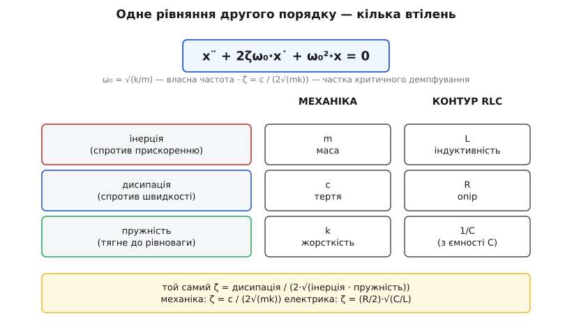
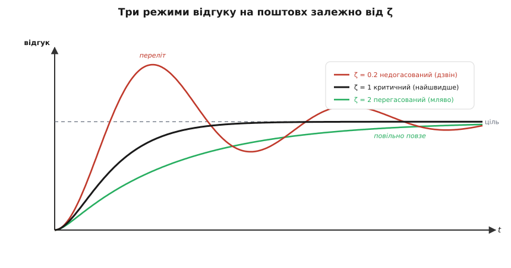
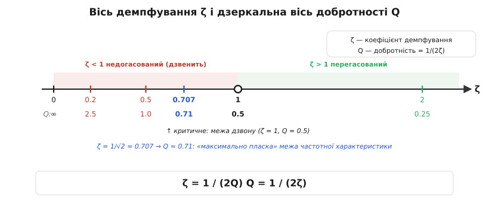

# Коефіцієнт демпфування ζ

<preknowlist>
- [Похідна](topic:math-analysis/derivative) — миттєва швидкість зміни величини; x˙ — швидкість, x¨ — прискорення.
- [Лінійні однорідні ОДУ 2-го порядку](topic:math-analysis/homogeneous-ode) — розв'язок пробою x = e^(st) і характеристичне рівняння з його коренями.
- [Формула Ейлера](topic:math-analysis/euler-formula) — e^(jθ) = cos θ + j·sin θ; комплексний корінь читається як згасальне коливання.
</preknowlist>

Смикніть одну коливальну систему — і вона задзвенить, повільно згасаючи багато періодів. Смикніть іншу, схожу на неї за будовою, — і вона без жодного коливання мляво сповзе назад у спокій. Що вирішує, дзвенітиме система чи просто тихо повернеться в рівновагу? Не її «пружність» і не її «маса» — вони лише задають частоту, на якій вона хотіла б гойдатися. Вирішує **сила, з якою втрати гасять рух**. І геть усю цю поведінку стискає одне-єдине безрозмірне число — **коефіцієнт демпфування** ζ (грецька літера «дзета»; від англ. *damping* — «гасіння»). Це стаття не про якусь одну систему, а про число, що керує всіма ними одразу.

### Чому стільки різних систем слухаються одного рівняння

Візьміть будь-що, що вміє коливатися: маса на пружині, вантаж на гілці, стрілка приладу, заряд у контурі, кермо авто після ями. Придивіться, чому воно взагалі гойдається, і скрізь побачите три однакові дійові особи.

Перша — **інерція**: щось опирається зміні швидкості (маса опирається прискоренню). Друга — **повертальна сила**: коли систему відхилили від рівноваги, її тягне назад, і то сильніше, чим далі відхилили. Поблизу точки спокою будь-яка гладка повертальна сила майже точно пропорційна відхиленню — це перший, лінійний член її розкладу, тож для малих коливань вона завжди виглядає як «пружина». Третя — **дисипація**: тертя, опір, в'язкість, — щось, що з'їдає енергію і завжди діє проти руху, тобто пропорційно швидкості.

Запишімо баланс цих трьох сил. Нехай x — відхилення від рівноваги. Інерція дає член з прискоренням x¨, дисипація — з швидкістю x˙, повертальна сила — з самим x:

```
m·x¨ + c·x˙ + k·x = 0
```

Тут m — інерція, c — коефіцієнт тертя, k — жорсткість повертальної сили. Це рівняння вільних коливань із загасанням, і воно однакове **для всіх** перелічених систем — вони різняться лише тим, що фізично підставити під m, c, k. Саме тому одна математика накриває маятник, ресору й електричний контур: у кожного своя «маса», своє «тертя», своя «пружина», але форма рівняння спільна.


*Абстрактна трійця «інерція · дисипація · пружність» отримує конкретне тіло в кожному домені: у механіці — m, c, k; у [коливальному контурі](topic:hw-analog/lc-resonance) — L, R, 1/C. Форма рівняння й коефіцієнт ζ ті самі — міняються лише підписи.*

Тепер прибираємо все зайве. Поділимо рівняння на m і дамо двом отриманим сполукам їхні природні імена. Величина √(k/m) має розмірність частоти — це **власна частота** ω₀, з якою система гойдалася б, якби тертя не було зовсім. А коефіцієнт біля x˙ згрупуємо в один безрозмірний множник ζ так:

```
x¨ + 2ζω₀·x˙ + ω₀²·x = 0        де   ω₀ = √(k/m),   ζ = c / (2√(mk))
```

Це **канонічна форма** коливальної системи другого порядку. Два числа — ω₀ і ζ — задають її поведінку **повністю**: ω₀ каже, як швидко вона гойдається, а ζ — наскільки сильно її гасять. Уся конкретика (кілограми, ньютони, оми) сховалась усередину цих двох чисел. Чому саме така химерна група c/(2√(mk)) — стане ясно за хвилину: множник 2 стоїть там не випадково, а рівно так, щоб межа між «дзвенить» і «не дзвенить» лягла точно на ζ = 1.

### Звідки беруться три режими: корені характеристичного рівняння

Щоб побачити, що робить ζ, треба розв'язати рівняння. Пробуємо розв'язок виду x = e^(st): [будь-яка лінійна однорідна ОДУ](topic:math-analysis/homogeneous-ode) його приймає, бо експонента під похідною не міняє форми — лише витягує множник s. Підставляємо, скорочуємо спільний e^(st) і лишається просте алгебричне рівняння на s:

```
s² + 2ζω₀·s + ω₀² = 0
```

Це **характеристичне рівняння**. Уся доля системи — у його двох коренях, і ні в чому більше:

```
s = ω₀·(−ζ ± √(ζ² − 1))
```

Тепер придивіться, де сидить уся драма: під квадратним коренем, у виразі **ζ² − 1**. Його знак — а він міняється рівно при ζ = 1 — перемикає всю якісну поведінку системи. Ось три випадки.

**ζ < 1 (підкореневий вираз від'ємний).** Корінь із від'ємного — уявний: √(ζ²−1) = j·√(1−ζ²). Корені стають комплексними, у парі:

```
s = −ζω₀ ± j·ω_d,        ω_d = ω₀·√(1 − ζ²)
```

Що це означає для руху? [Формула Ейлера](topic:math-analysis/euler-formula) перекладає комплексний показник у коливання: e^(st) = e^(−ζω₀·t)·(cos ω_d·t ± j·sin ω_d·t). Дійсна частина кореня, −ζω₀, керує **згасанням** — це швидкість, з якою тане обгортка e^(−ζω₀t); уявна частина ω_d — це **частота дзвону**. Виходить згасальна синусоїда: система коливається, але амплітуда щоперіоду меншає. Це **недогасований** режим.

**ζ = 1 (підкореневий вираз нуль).** Обидва корені зливаються в один подвійний дійсний: s = −ω₀. Коливання зникає — уявної частини більше немає, лишилась гола згасальна експонента (з поправкою на подвійний корінь, e^(−ω₀t) множиться ще й на t). Це **критичний** режим — рівно та межа, де система щойно перестала дзвеніти.

**ζ > 1 (підкореневий вираз додатний).** Корінь дійсний, і виходять **два різні** від'ємні дійсні корені s₁, s₂. Рух — сума двох згасальних експонент, без сліду коливання. Це **перегасований** режим.

Ось де сходяться нитки: **три режими — це просто три знаки одного дискримінанта ζ²−1.** І тепер видно, навіщо в означенні ζ той множник 2. Дискримінант квадратного рівняння s²+2ζω₀s+ω₀² — це (2ζω₀)² − 4ω₀² = 4ω₀²(ζ²−1); він занулюється точно при ζ = 1. Двійку в c/(2√(mk)) підібрано саме так, щоб критична межа лягла на кругле ζ = 1, а не на якесь незручне число. Означення підігнали під те, що ми хочемо читати з першого погляду.

### Три режими: як система вертається в спокій

Найнаочніше ζ видно, коли систему «смикнути» — різко зсунути ціль — і дивитися на її [крокову відповідь](topic:math-analysis/step-response): як вона доповзає до нового положення. Три знаки дискримінанта дають три якісно різні картини.


*Відгук на ступінчастий поштовх. **Недогасований** (ζ = 0.2, червоний) перелітає ціль і дзвенить навколо неї, поступово згасаючи. **Критичний** (ζ = 1, чорний) найшвидше дістається цілі без жодного перельоту. **Перегасований** (ζ = 2, зелений) підповзає мляво, теж без перельоту, але помітно повільніше за критичний.*

- **Недогасований** (англ. *underdamped*, ζ < 1): система перестрибує ціль, відкочується, знову перестрибує — **дзвенить**, аж поки коливання згасне. Малі втрати — довгий дзвін.
- **Критичний** (англ. *critically damped*, ζ = 1): рівно та межа, де коливання щойно зникли. Система дістається цілі **найшвидше з можливого** і не перелітає.
- **Перегасований** (англ. *overdamped*, ζ > 1): втрати такі великі, що система **ліниво підповзає** до цілі, навіть не намагаючись коливнутися, — і повільніше за критичний режим.

Живий образ — маятник у різних середовищах. У повітрі він гойдається довго, ледь гаснучи: недогасований режим. У густому меді він не гойднеться жодного разу, а мляво сповзе до дна: перегасований. І є рівно та в'язкість, за якої він доходить до дна найшвидше й без єдиного перельоту, — критична.

Звідси пастка для інтуїції: «найбільше демпфування» — **не** означає «найшвидше». Перегасована система (скажімо, ζ = 2) дістається цілі **повільніше** за критичну (ζ = 1), бо надлишок «тертя» гальмує сам рух до рівноваги — система в'язне. Найшвидше без перельоту — точно на межі, ζ = 1, ані більше, ані менше. У цьому й уся цінність критичного режиму.

### ζ як частка критичного демпфування

Тепер прочитаймо саму формулу ζ = c/(2√(mk)) — вона каже більше, ніж здається. Знаменник 2√(mk) — це не абстракція, а конкретна величина тертя: **критичне демпфування** c_c, рівно те, за якого система переходить межу ζ = 1.

```
c_c = 2√(mk)           (те тертя, за якого ζ = 1)
ζ   = c / c_c          (наскільки поточне тертя близьке до критичного)
```

Ось у чому суть: ζ — це **не** «скільки тертя в ньютон-секундах», а «**яка частка** від критичного». Тому воно й безрозмірне, і тому воно однакове для контуру, маятника й ресори: кожен має свій критичний рівень c_c у своїх одиницях, а ζ міряє відстань до цього рівня в спільній, безрозмірній шкалі. ζ = 0.5 означає «половина критичного тертя» — байдуже, йдеться про грами й ньютони чи про оми й фаради. Це і робить ζ спільною мовою всіх коливальних систем.

Читається формула теж прозоро: більше тертя c — більше ζ (сильніше гасять, логічно); більша інерція m або жорсткість k — менше ζ, бо важча «маса» й тугіша «пружина» тримають коливання наполегливіше, і те саме тертя гасить їх слабше.

### Частота дзвону просідає з демпфуванням

Демпфування лишає слід не лише в амплітуді, а й у самій частоті дзвону. Недогасована система коливається не точно на власній ω₀, а трохи нижче — на тій ω_d, що вигулькнула з уявної частини кореня:

```
ω_d = ω₀·√(1 − ζ²)
```

За малого ζ (ледь демпфована система) корінь майже дорівнює одиниці — дзвін іде практично на власній частоті ω₀. Але ближче до критичної межі множник √(1−ζ²) сповзає до нуля: система коливається все повільніше, аж поки на ζ = 1 період не стає нескінченним і коливання зовсім зникає. Тобто демпфування не лише гасить амплітуду з часом, а й **притягує вниз** частоту дзвону — до самого нуля на межі. Це та сама межа ζ = 1, побачена з іншого боку: там, де дискримінант занулюється, і ω_d занулюється.

**Приклад (яке демпфування критичне?).** Механічний давач: маса m = 5 г = 0.005 кг на пружині k = 2000 Н/м. Спершу знайдемо власну частоту й критичне тертя:

```
ω₀  = √(k/m) = √(2000 / 0.005) = √400000 = 632 рад/с
c_c = 2√(mk) = 2·√(0.005 · 2000) = 2·√10 = 6.32 Н·с/м
```

c_c — те тертя, за якого давач повертається в нуль найшвидше без жодного перельоту. Якщо реальний демпфер дає лише c = 1.6 Н·с/м:

```
ζ = c / c_c = 1.6 / 6.32 = 0.25
```

ζ = 0.25 < 1 — недогасований: давач перелетить ціль і кілька разів гойднеться, перш ніж заспокоїтись. Дзвенітиме він на

```
ω_d = ω₀·√(1 − ζ²) = 632·√(1 − 0.0625) = 632·0.968 = 612 рад/с
```

трохи нижче власних 632 рад/с. Щоб прибрати дзвін, тертя треба підняти до c_c ≈ 6.3 — учетверо. Одне безрозмірне число одразу сказало і режим, і що з ним робити.

### Добротність: те саме число навиворіт

У тієї самої «дзвінкості» два імені. Теорія коливань і керування міряють її демпфуванням ζ — «наскільки сильно гасять»; радіотехніка й акустика звикли до [добротності Q](topic:ph-waves/q-factor) — «наскільки добре система тримає коливання». Це **те саме число, побачене з двох боків**, і зв'язок між ними — просте дзеркало:

```
ζ = 1 / (2Q)          Q = 1 / (2ζ)
```


*ζ = 1/(2Q): висока добротність (гострий резонанс, довгий дзвін) — це мале демпфування, і навпаки. Межа ζ = 1 (критичне) відповідає Q = 0.5: нижче неї система вже не коливається. Особлива точка ζ = 1/√2 ≈ 0.707 (Q ≈ 0.71) — «максимально пласка» межа частотної характеристики.*

Тож гостра система з Q = 100 має мізерне ζ = 0.005 (ледь демпфована — дзвенить сотні циклів), а м'яка з Q = 0.5 сидить рівно на критичній межі ζ = 1 (не дзвенить узагалі). «Висока Q» і «мале ζ» — синоніми, бо це буквально обернені одне одному через двійку. Сходяться й межі: Q = 0.5 ↔ ζ = 1 — той самий кордон, нижче якого коливань уже нема, лише названий з двох боків.

> 🔧 **Навіщо це.** ζ — головна ручка налаштування скрізь, де щось «дзвенить» після поштовху. У системі керування чи приводі ζ = 1 дає найшвидший вихід на режим зовсім без перельоту, а трохи менше (ζ ≈ 0.7) — трохи швидше, ціною близько 5% перельоту; звідси й популярність ζ ≈ 0.7 як стандартної мети налаштування. Проєктуючи згладжувальний фільтр, цілять у ту саму ζ ≈ 0.7: вище — реакція млявіє, нижче — на власній частоті стирчить горб, що підсилює завади. Побачивши «дзвін» після стрибка на осцилографі чи в лозі датчика, ви дивитеся просто на замале ζ.

### Де це оживає

ζ і три режими — це місток від власних коливань до **перехідних процесів** усюди, де щось гойдається й гасне. Одна й та сама трійця «інерція · дисипація · пружність» вбирається в різні костюми:

- **Електричний контур.** Послідовний RLC-контур пише те саме рівняння: інерцію грає індуктивність L, тертя — опір R, пружність — обернена ємність 1/C. Коефіцієнт демпфування виходить ζ = (R/2)·√(C/L), а власна частота — ω₀ = 1/√(LC), тобто [частота LC-резонансу](topic:hw-analog/lc-resonance). Гострий радіоконтур — це недогасований режим із крихітним ζ; він задає й форму «коліна» [частотної характеристики](topic:hw-analog/frequency-response) фільтра.
- **Механічні підвіси.** Амортизатор авто навмисне тримають майже критичним (ζ трохи менше 1), щоб після ями кузов не гойдався, а плавно осів. Той самий ζ вирішує, чи переживе [чутливий давач тряску](topic:hw-sensing/imu-vibration-isolation): його елемент навмисне демпфують, щоб він не дзвенів на власному резонансі від вібрації.
- **Системи керування.** У налаштуванні регулятора (як-от ПІД) ζ замкненого контуру — головний важіль між «швидко, але з перельотом» і «повільно, зате спокійно». Критичне демпфування — найшвидший відгук без перельоту; трохи менше — швидше ціною невеликого перельоту; більше — повільна, зате гарантовано неколивальна реакція.

Один коефіцієнт — для електричних контурів, автомобільних амортизаторів, стрілкових приладів, сейсмографів і контурів керування: скрізь, де щось коливається й гасне, ζ каже, у якому з трьох світів воно живе і як близько до межі між ними.
