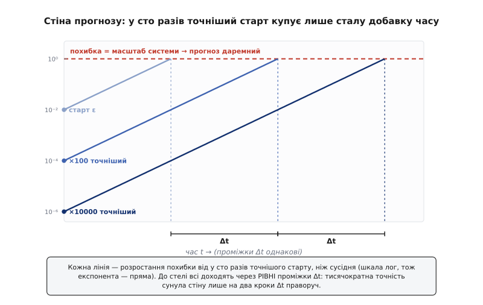

# Детермінований хаос

<preknowlist>
- [Другий закон Ньютона](root:ph-mechanics/newtons-second-law) — закон разом із теперішнім станом (положення + швидкість) однозначно визначає весь подальший рух; це і є детермінізм.
- [Похідна](root:math-analysis/derivative) — миттєва швидкість зміни величини; тут ідеться про те, як швидко росте відстань між двома близькими рухами.
</preknowlist>

Ньютон подарував світові годинниковий механізм. Задай точний стан системи цієї миті — усі положення й швидкості — і [закон руху](root:ph-mechanics/newtons-second-law) перемеле його на весь майбутній рух, мить за миттю, без найменшої двозначності. П'єр-Симон Лаплас загострив цю думку до краю: розум, який знав би точне положення й швидкість кожної частинки, читав би все прийдешнє так само ясно, як і минуле. Майбутнє тоді не таємниця, а лічба.

І все ж синоптик не зазирає далі як на два тижні, а подвійний маятник, відпущений двічі майже однаково, за кілька гойдань вимахує зовсім різні візерунки. Заковика не в тому, що нам бракує закону: закон у нас точний. Стіну ставить щось глибше — і саме вона зветься **детермінованим хаосом** (детермінований, від лат. determinare — визначати, обмежувати; хаос, гр. cháos — первісна безодня, зяяння): рух, наперед визначений своїм законом до останньої коми і водночас непередбачуваний назавжди.

Щоб намацати цю стіну, згадаймо, чого Лапласів розум насправді потребує — **точного** стану. Але кожен вимір неточний: термометр, лінійка, датчик дають число з похибкою, хай і мізерною. Тому старт ми знаємо не як точку, а як крихітну хмарку можливих станів завширшки ε навколо виміряного значення. І вся доля прогнозу впирається в одне питання: що закон робить із цією похибкою з плином часу?

Порівняймо дві копії системи, що вирушають поряд — на відстані ε одна від одної. У сумирній системі — маятник із тертям, планета на орбіті — ця відстань лишається близько ε або й тане: близькі старти дають близькі долі, і прогноз тримається. У хаотичній системі відстань між копіями **росте**, і не рівномірно, а вибухово — **експоненційно**:

```
δ(t) ≈ ε · e^(λ·t),   λ > 0
```

Показник λ додатний, тож розрив подвоюється за кожен однаковий проміжок часу: спершу непомітний, він через десяток подвоєнь дотягується до розміру всієї системи. Тоді дві копії, що стартували майже злитими, стоять уже так далеко одна від одної, як дві навмання взяті, — і прогноз обертається на ніщо. Оцю жадібну чутливість до найдрібнішої відмінності початку називають **чутливістю до початкових умов**. Найдивніше, що для неї не потрібні ні планети, ні маятники: та сама чутливість зринає вже в однорядковому рівнянні, яке можна ітерувати олівцем, — [логістичному відображенні](root:math-analysis/deterministic-chaos/proj-logistic-map.md), де два майже однакові старти розходяться до цілковитої несхожості за три десятки кроків.


*Дві копії того самого детермінованого закону, пущені з майже однакового старту (різниця тисячна). Спершу їхні шляхи не відрізнити на око; та відстань між ними (нижня панель, логарифмічна шкала) увесь цей час невпинно росте по прямій — тобто множиться щокроку. Щойно вона дотягується до розміру системи, криві розходяться остаточно, і від збігу старту не лишається сліду. Момент цього зриву й є межею прогнозу.*

Тепер цю чутливість можна зважити числом. Швидкість подвоєння розриву задає [показник Ляпунова](root:math-analysis/lyapunov-stability) λ, а час, за який похибка ε розростається до масштабу системи L, читається просто з формули розриву:

**Скільки триває прогноз, коли похибка подвоюється десь за півтори доби (λ ≈ 0.5 /добу), старт відомий на ε = 0.001 частки, а зрив настає на масштабі L = 1**
```
T ≈ (1/λ) · ln(L/ε)
T ≈ (1/0.5) · ln(1 / 0.001)
T ≈ 2 · ln(1000)
T ≈ 2 · 6.9 ≈ 13.8 доби
```
Уся сила ховається в логарифмі. Щоб подовжити прогноз удвічі, точність старту треба не подвоїти, а піднести до квадрата — зменшити ε у тисячі разів. Покращуй вимір у сто разів — і вигадаєш лише сталу добавку часу, ту саму щоразу. Ось чому [Едвард Лоренц](root:math-analysis/deterministic-chaos/hist-chaos-birth.md), натрапивши 1961 року на цей ефект у комп'ютерній моделі погоди (він округлив одне число з .506127 до .506 — і дістав зовсім інший прогноз), згодом назвав його **ефектом метелика**: помах крил, надто дрібний, щоб його зміряти, здатен переписати далеку погоду — не тому, що метелик могутній, а тому, що закон роздуває будь-яку дрібницю.


*Чому точніший вимір майже не рятує. Кожна пряма — зростання похибки від стократ точнішого старту, ніж у сусідньої (шкала логарифмічна, тож експонента виходить прямою). Хоч крайня права стартує в десять тисяч разів точніше за ліву, до стелі, за якою прогноз втрачає сенс, усі три доходять через **рівні** проміжки. Стократне вкладання в точність купує щоразу ту саму скромну добавку часу — не більше.*

Лишається головне «чому»: звідки в детермінованого закону береться це вічне розбігання? Саме лише розтягування розігнало б усе в нескінченність — та реальний рух замкнений: енергія скінченна, траєкторія не покидає обмеженої області. Отже, закон мусить робити дві речі поспіль — **розтягувати** сусідні стани нарізно й **складати** розтягнутий аркуш назад в область, знову і знову. Це той самий рух, яким пекар вимішує тісто: розкачати вдвічі довше, скласти навпіл, повторити. Дві порошинки борошна, що лежали поруч, розганяються цим замішуванням усе далі, а саме тісто лишається того самого розміру.


*Механізм хаосу — «розтягнути й скласти», рух замішування тіста. Клаптик сусідніх станів закон щокроку витягує у вдвічі довшу смугу (розтягування розводить близькі точки нарізно) і загинає назад у ту саму область (складання не дає системі втекти в нескінченність). Дві точки, що починали поряд, це замішування невпинно розганяє — а вся фігура лишається обмеженою. Повторене без кінця, воно й породжує хаос.*

Аналогія з тістом ламається в одному місці, і злам цей повчальний: траєкторії детермінованого закону ніколи не перетинаються — крізь кожен стан проходить рівно один шлях, бо закон у ньому однозначний. Тому складання не збиває аркуші в кашу, а вкладає їх один в один нескінченно тонкими шарами; фігура, на яку намотується рух, виходить нескінченно шаруватою — **дивний атрактор** (лат. attrahere — притягувати), той тонкий фрактальний згорток, що його [малює вже найпростіше рівняння хаосу](root:math-analysis/jerk-equation-chaos). І ще одне: складати вміє тільки **нелінійний** закон. Прямий, лінійний закон здатен лише розтягувати чи стискати все рівномірно — зігнути й завернути аркуш він не може, тож без нелінійності хаосу не буває.

> 🔧 **Навіщо це.** Стіна прогнозу — не привід опустити руки, а вказівка, що саме рахувати. Раз єдине число-передбачення живе недовго, синоптики запускають рух не з однієї точки, а з цілої хмари трохи різних стартів і дивляться на **розкид** усього жмутка — так народжується чесний імовірнісний прогноз («40 % дощу») замість оманливо точного одного числа. З тієї ж причини рух планет неможливо розписати наперед далі як на десятки мільйонів років, а хаотичні електронні схеми навмисне ставлять як дешеве джерело справжнього, невідтворного шуму.

Тут криється тонкість, без якої назву легко перекрутити. Хаос — це **не** випадковість. Пусти систему двічі з точнісінько того самого стану — дістанеш точнісінько той самий рух, відтворний до останньої цифри. Кубиків тут немає, нічого не кидають. Уся непередбачуваність народжується із зустрічі двох речей: нашого скінченно точного знання старту й експоненційного роздування цієї неточності законом. Непевність не в русі — вона в нас; тому обидва слова в назві правдиві заразом: рух **детермінований** і водночас **хаотичний**.

І це не хвороба якихось вигадливих систем, а радше загальне правило. Три тіла, що тяжіють одне до одного (перший, хто наштовхнувся на хаос саме тут, був [Анрі Пуанкаре](root:math-analysis/deterministic-chaos/hist-chaos-birth.md)), подвійний маятник, крапля з крана, що збивається з рівного ритму, цівка диму, яка зривається в турбулентність, погода, Сонячна система на масштабі сотень мільйонів років — усі хаотичні. Рівний, передбачуваний рух — маятник, орбіта двох тіл — насправді рідкісний виняток; щойно закон стає нелінійним і має де розгорнутися (а для неперервного руху це означає [щонайменше три виміри стану](root:math-analysis/jerk-equation-chaos)), хаос стає звичаєм, а не дивом.

Годинниковий механізм Лапласа обіцяв прозоре майбутнє. Детермінований хаос показує, що механізм може бути бездоганним — і все ж ховати своє прийдешнє: не через брак закону, а тому, що прочитати теперішнє **досить** точно, аби той закон допоміг, назавжди понад людську спромогу.
