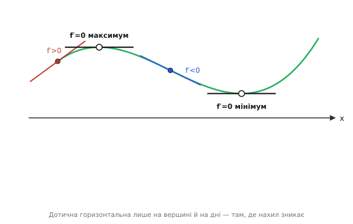
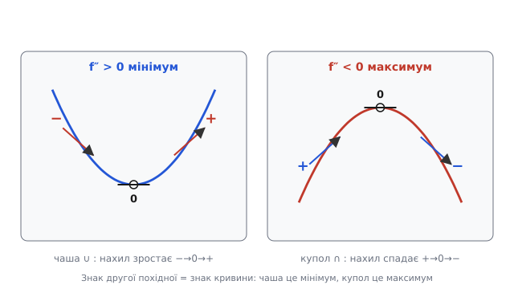

# Екстремуми: де функція досягає найбільшого й найменшого

Майже кожна інженерна задача врешті зводиться до одного питання: де **найкраще**? Яку напругу подати на транзистор, щоб віддати в навантаження найбільшу потужність. Який опір поставити, щоб втрати були найменшими. На якій частоті підсилювач працює на піку. Коли перемкнути ключ, щоб витратити найменше енергії. Слово «найкраще» щоразу означає одне й те саме — **максимум** чогось корисного або **мінімум** чогось шкідливого. А максимум і мінімум разом мають спільну назву: екстремуми (лат. *extremum* — найдальша точка, край).

Питання здавалося б практичне, та за ним стоїть напрочуд проста математична картина. І ключ до неї — одне спостереження про **нахил** функції у тій точці, де вона досягає вершини чи дна. Побачивши це спостереження один раз, ви розв'язуватимете задачі на «найкраще» майже механічно — прирівнюванням до нуля.

## Чому на вершині нахил дорівнює нулю

Уявіть пагорб і кульку, що котиться його схилом. Поки схил нахилений, кулька котиться — ліворуч чи праворуч, але котиться. Зупиниться вона лише там, де під нею **рівно**: на самій вершині або на дні улоговини. Це не випадковість, а суть справи. Доки є нахил, є й куди рухатися «вгору» чи «вниз»; там, де руху вже немає, нахил мусить зникнути.

Перекладімо це на мову функцій. Нахил кривої в точці — це [похідна](topic:math-analysis/derivative): f′(x) каже, наскільки круто функція росте чи спадає саме тут. Якщо f′(x) > 0, крива йде вгору; рушивши трохи праворуч, ми піднімемося ще вище — отже, **тут не максимум** (вище ще є куди). Якщо f′(x) < 0, крива йде вниз; піднятися можна, ступивши ліворуч — отже, **і це не максимум**. Залишається єдина можливість: у точці максимуму нахил не може бути ні додатним, ні від'ємним.

```
f′(x) > 0  → праворуч вище → не пік
f′(x) < 0  → ліворуч вище  → не пік
залишається тільки f′(x) = 0
```

Звідси висновок, який ми не оголошуємо готовим, а вивели на очах: **у точці гладкого максимуму чи мінімуму похідна дорівнює нулю**. Геометрично це означає, що дотична (лат. *tangens* — той, що торкається) до кривої в такій точці **горизонтальна** — лежить рівно, без нахилу. Кулька на ній не котиться.


*На зростанні дотична дивиться вгору (f′>0), на спаданні — вниз (f′<0). Рівно горизонтальною вона стає лише у двох точках — на вершині й на дні, де f′=0. Це й робить нульову похідну ознакою екстремуму.*

Тут таїться важлива тонкість, без якої міркування неповне. Нуль похідної — необхідна умова, але **не достатня**. Кулька зупиняється і на сідловині — пологому майданчику посеред схилу, який не є ні вершиною, ні дном. Класичний приклад — функція x³ у точці x=0: похідна 3x² там дорівнює нулю, дотична горизонтальна, а проте ні максимуму, ні мінімуму немає — крива лише на мить «приляже» і йде далі вгору. Тому рівняння f′(x) = 0 дає нам **кандидатів**, а не відповідь. Які з них справді екстремуми — вирішує наступний крок.

Точки, де f′(x) = 0 (а також де похідної не існує — про них згодом), називають **критичними** (гр. *kritikos* — здатний розрізняти). Уся стратегія пошуку найбільшого й найменшого тепер ясна: знайти критичні точки, тоді розібратися, що в кожній відбувається.

> 🔧 **Навіщо це.** Уся інженерна оптимізація стоїть на цьому одному рівнянні. Хочете найбільшу потужність, найменший опір, найкоротший час, найвищий ККД — складаєте формулу величини, берете похідну, прирівнюєте до нуля. Розв'язки — це режими, де система працює на межі можливого. Без похідної довелося б наосліп перебирати тисячі варіантів; із нею оптимум знаходять однією рівністю.

## Тест першої похідної: за зміною знаку

Найпрямолінійніший спосіб розпізнати критичну точку — подивитися, що похідна робить **обабіч** неї. Адже знак f′ каже, куди йде функція, а екстремум — це саме точка, де напрямок руху змінюється.

Уявімо, що ми йдемо вздовж осі x зліва направо й стежимо за знаком похідної:

- Зліва **f′ > 0** (функція росла), справа **f′ < 0** (почала спадати) — отже, у критичній точці вона перестала рости й повернула вниз. Це **максимум**: вершина, з якої в обидва боки нижче.
- Зліва **f′ < 0** (спадала), справа **f′ > 0** (почала рости) — функція досягла дна й повернула вгору. Це **мінімум**.
- Знак **не змінився** (був «+» і лишився «+», або «−» і «−») — функція лише пригальмувала, але напрямку не змінила. Це **не екстремум**, а та сама сідловина, як у x³.

```
зліва +  →  справа −   ⟹   МАКСИМУМ  (зросла, тоді спала)
зліва −  →  справа +   ⟹   МІНІМУМ   (спала, тоді зросла)
знак не змінився       ⟹   не екстремум (перегин/сідло)
```

Цей тест нічим не обмежений: він працює навіть там, де другий критерій безсилий, і навіть у точках, де похідна не існує (про них трохи далі). Платня за надійність — треба обчислити знак похідної у двох пробних точках обабіч критичної, а це більше роботи, ніж одна підстановка.

Розгляньмо на числах. Нехай f(x) = x² − 4x + 7 — звичайна парабола віттю вгору. Похідна:

```
f′(x) = 2x − 4
2x − 4 = 0
x = 2          ← єдина критична точка
```

Перевіримо знак обабіч x=2. Зліва візьмемо x=1: f′(1) = 2·1 − 4 = −2 (від'ємно, спадає). Справа візьмемо x=3: f′(3) = 2·3 − 4 = +2 (додатно, росте). Знак змінився з «−» на «+» — отже, x=2 це **мінімум**. Значення в ньому: f(2) = 4 − 8 + 7 = 3. Дно параболи лежить у точці (2, 3) — і жодного перебору не знадобилося.

## Тест другої похідної: за кривиною

Часто швидше глянути не на саму похідну обабіч, а на те, **як вона змінюється** в самій критичній точці. Цю зміну вимірює [друга похідна](topic:math-analysis/derivative) f″(x) — похідна від похідної, тобто швидкість зміни нахилу. А швидкість зміни нахилу — це і є **кривина**: вгнута крива (як чаша) чи вигнута (як купол).

Міркуймо від першопричини. У точці мінімуму крива схожа на дно чаші: ліворуч від неї нахил був від'ємний, праворуч стає додатним — отже, нахил **зростає**, проходячи через нуль. А зростання нахилу означає f″ > 0. У точці максимуму навпаки: купол, нахил спадає з додатного через нуль у від'ємний — отже, f″ < 0.

```
f′(x) = 0  і  f″(x) > 0   ⟹   МІНІМУМ   (чаша: нахил зростає)
f′(x) = 0  і  f″(x) < 0   ⟹   МАКСИМУМ  (купол: нахил спадає)
f′(x) = 0  і  f″(x) = 0   ⟹   тест мовчить — повертайся до першого
```

Знак другої похідної — це знак кривини, і він прямо каже, в який бік «дивиться» крива. Запам'ятати легко: усмішка ∪ — це f″ > 0 і мінімум; похмурий рот ∩ — f″ < 0 і максимум.


*У мінімумі крива вгнута вгору (f″>0), нахил зростає від «−» через 0 до «+». У максимумі вгнута вниз (f″<0), нахил спадає. Коли f″=0, кривина не визначає тип — потрібен тест першої похідної.*

Повернімося до тієї ж параболи f(x) = x² − 4x + 7 і перевіримо новим способом. Перша похідна f′(x) = 2x − 4 дала критичну точку x=2. Друга:

```
f″(x) = (2x − 4)′ = 2
f″(2) = 2 > 0        ⟹   мінімум
```

Одна підстановка — і відповідь та сама, що дав довший тест першої похідної: x=2 це мінімум. Ось чому другий критерій люблять: де він спрацьовує, він найшвидший. Його слабке місце — випадок f″ = 0: тоді кривина нульова, тест нічого не каже (саме так у x³, де f″(0) = 0), і доводиться повертатися до знаку першої похідної.

> 🔧 **Навіщо це.** Тест другої похідної — робочий інструмент пошуку оптимуму в коді й розрахунках. Склали функцію вартості (похибка, втрати, час), знайшли f′=0, перевірили знак f″ — і знаєте напевно, мінімум це чи максимум, не малюючи графіка. У числовій оптимізації (метод Ньютона, наприклад) друга похідна ще й підказує, наскільки великий крок робити до оптимуму.

## Локальні й глобальні: вершина пагорба чи найвища гора

Нуль похідної ловить точки, де функція найбільша чи найменша лише **порівняно з сусідами**. Така точка — **локальний** екстремум (лат. *locus* — місце): вершина саме цього пагорба, вище за все довкола, але не конче найвища в усьому краєвиді. За сусіднім хребтом може стояти гора вища. Найвища ж точка **на всьому проміжку** — це **глобальний** (гр. через лат. *globus* — куля, тут «загальний») екстремум: справжній рекорд, з яким ніщо інше не зрівняється.

Різниця не схоластична, а практична до болю. Прирівнявши похідну до нуля, ви знаходите **всі локальні** екстремуми. Та інженеру зазвичай потрібен **глобальний** — абсолютно найбільша потужність, абсолютно найменша похибка. Алгоритм оптимізації, що сповзе в локальний мінімум і зупиниться, видасть розв'язок, який лише здається найкращим, а насправді поступається іншому, до якого не дотягнувся.

Звідки ж береться глобальний екстремум? З двох можливих місць, і обидва треба перевірити:

```
кандидати на глобальний екстремум на проміжку [a, b]:
  1) усі критичні точки всередині (де f′ = 0 або f′ не існує)
  2) самі кінці проміжку — a і b
```

Кінці легко проґавити, а дарма: функція цілком може досягати найбільшого значення саме на краю — там, де її ще не «розвернула» жодна критична точка. Уявіть прямий схил без жодної вершини: найвища точка — там, де схил обривається, тобто на кінці. Тому надійний рецепт простий: зберіть значення функції в усіх критичних точках і на обох кінцях, тоді просто оберіть найбільше з них (глобальний максимум) і найменше (глобальний мінімум). Перебирати весь проміжок не треба — досить цього короткого списку підозрюваних.

Окремо варто пам'ятати про точки, **де похідної взагалі немає**, — їх теж зараховують до критичних. У «зламі» графіка, як у функції |x| при x=0, дотичної не існує (зліва нахил −1, справа +1), а проте там сидить найгостріший мінімум. Гладкі правила його не зловлять, бо f′ там не визначена; такі кутові точки треба додати в список кандидатів окремо, поглянувши на функцію очима.

## Де це працює: три задачі на «найкраще»

Абстракція «прирівняй похідну до нуля» оживає аж тоді, коли бачиш, як одна й та сама дія розв'язує задачі з геть різних галузей. Три приклади нижче показують увесь діапазон — від чистого мінімуму похибки до фізики передавання енергії.

**Узгодження потужності.** Джерело з внутрішнім опором r живить навантаження R. Скільки потужності дістанеться навантаженню залежить від R, і питання класичне: яке R забере найбільше? Потужність у навантаженні (струм I = E/(r+R), потужність P = I²·R):

```
            E² · R
P(R) = ───────────────
          (r + R)²
```

Це функція від R з піком десь усередині: при R=0 потужність нульова (немає на чому виділятися), при R→∞ теж нульова (струм завмер). Десь між ними — максимум. Знайдемо його, прирівнявши dP/dR до нуля; похідна частки після спрощення обертається на нуль рівно тоді, коли:

```
dP/dR = 0   ⟹   r + R = 2R   ⟹   R = r
```

Результат напрочуд чистий: **навантаження забирає найбільшу потужність, коли його опір дорівнює внутрішньому опору джерела**. Це теорема про узгодження потужності, і вона — пряме дитя умови f′=0. Друга похідна в цій точці від'ємна (потужність обабіч менша), тож це справді максимум, а не мінімум.

**Мінімум похибки — підгонка під дані.** Є хмара виміряних точок, крізь яку треба провести найкращу пряму. «Найкраща» означає, що сумарне відхилення точок від прямої — найменше. Беруть суму квадратів відхилень (квадрат, щоб додатні й від'ємні промахи не гасили одне одного) і шукають параметри прямої, за яких ця сума **мінімальна**:

```
S(k, b) = Σ (yᵢ − k·xᵢ − b)²   →   шукаємо мінімум по k і b
```

Мінімум суми — там, де її похідні по k і по b дорівнюють нулю. Ці дві умови дають систему двох лінійних рівнянь, з якої k і b (а отже й сама пряма) знаходяться однозначно. Уся [метода найменших квадратів](topic:math-probability/least-squares) — фундамент обробки вимірів — це задача на мінімум, розв'язана прирівнюванням похідних до нуля. Те саме рівняння f′=0, лише для функції двох змінних.

**Пік амплітудно-частотної характеристики.** Багато систем — від коливального контуру до механічного резонатора — мають відгук, що залежить від частоти ω і десь сягає піку (резонанс). Щоб знайти резонансну частоту, складають амплітуду відгуку як функцію ω і шукають її максимум — знов-таки прирівнюванням похідної до нуля. Коли в такій формулі трапляється sin чи cos, у гру входить [похідна синуса](topic:math-analysis/sine-derivative): (sin x)′ = cos x. Скажімо, потужність, що залежить від кута керування як P(φ) = P₀·sin φ, має похідну P₀·cos φ; вона дорівнює нулю при cos φ = 0, тобто φ = 90°, — і саме там потужність максимальна. Тригонометрія й пошук екстремуму працюють пліч-о-пліч.

Спільна нитка всіх трьох — і сотень інших — одна. Тільки-но з'являється слово «оптимальний», «найбільший», «найменший», математична відповідь починається з похідної, прирівняної до нуля. Знак другої похідної (або зміна знаку першої) відрізняє максимум від мінімуму, а перевірка кінців і кутових точок ловить глобальний рекорд. Це і є мова оптимізації — стисла, точна й та сама в будь-якій галузі.

## Знайти оптимум у прошивці: реальний C

**Умова.** Мікроконтролер керує нагрівачем через широтно-імпульсну модуляцію (заповнення від 0 до 100). Для кожного значення заповнення відома похибка регулювання — наскільки температура відхиляється від бажаної. Треба знайти заповнення, за якого похибка **найменша**, маючи лише саму функцію похибки, без формули її похідної.

Аналітично взяти похідну ми не можемо — функція задана кодом, не формулою. Зате критичну точку легко зловити **чисельно**: похідну наближають [скінченною різницею](topic:math-analysis/derivative), і шукають, де вона змінює знак із «−» на «+» — за тестом першої похідної це і є мінімум.

```
f′(x) ≈ (f(x+h) − f(x−h)) / (2·h)      ← центральна різниця, наближення похідної
```

Знак цієї величини каже те саме, що знак справжньої похідної: поки вона від'ємна — спускаємося до дна, щойно стала додатною — дно позаду.

```c
/* Шукає заповнення ШІМ [0..100] з найменшою похибкою регулювання.
   cost(x) — задана функція похибки (вимірювана або модельна). */
typedef float (*cost_fn)(float duty);

float find_min_duty(cost_fn cost, float lo, float hi)
{
    const float h    = 0.5f;    /* крок для скінченної різниці */
    const float step = 1.0f;    /* крок проходу по діапазону   */
    float best_x = lo;
    float best_y = cost(lo);    /* кінець lo — теж кандидат на мінімум */

    for (float x = lo + step; x <= hi - step; x += step) {
        /* наближена похідна — центральна різниця */
        float slope = (cost(x + h) - cost(x - h)) / (2.0f * h);

        /* критична точка: похідна майже нуль і кривина «чаша» */
        if (slope > -1e-3f && slope < 1e-3f) {
            float y = cost(x);
            if (y < best_y) { best_y = y; best_x = x; }
        }
    }

    float y_hi = cost(hi);      /* другий кінець — теж кандидат  */
    if (y_hi < best_y) { best_y = y_hi; best_x = hi; }

    return best_x;              /* заповнення з найменшою похибкою */
}
```

**Розбір на числах.** Нехай похибка поводиться як cost(x) = (x − 40)² (мінімум очевидно при x=40, перевіримо, що код його знайде). Біля x=40, з кроком h=0.5:

```
slope = (cost(40.5) − cost(39.5)) / (2·0.5)
      = ((0.5)²  −  (−0.5)²) / 1.0
      = (0.25 − 0.25) / 1.0
      = 0.0            ← похідна ~0 ⟹ критична точка, тут і дно
```

У точці x=40 наближена похідна обертається на нуль — код позначає її як кандидата, а оскільки похибка там найменша (0), саме її й повертає. Зверніть увагу: обидва кінці діапазону теж перевірено окремо — без цього код проґавив би випадок, коли мінімум сидить на самому краю, де похідна так і не змінила знак.

**Підступ: чисельна похідна тремтить від шуму.** Якщо `cost(x)` — не гладка формула, а виміряна (зашумлена) величина, скінченна різниця підсилює шум: віднімання двох близьких зашумлених чисел дає малий корисний сигнал на тлі подвоєної похибки. Тоді «нульовий нахил» доведеться шукати не за точним нулем, а за зміною знаку усередненої похідної, або спершу згладити дані. Це та сама пастка, що й у будь-якому чисельному диференціюванні: дрібний крок h наближає до істинної похідної, але роздуває вплив шуму.

> 🔧 **Навіщо це.** Так шукають робочу точку, коли формули немає, а є лише вимір: пік ККД перетворювача, мінімум струму спокою, найкраще заповнення ШІМ. Замість аналітичної похідної беруть скінченну різницю просто на залізі. Головне — не забути перевірити кінці діапазону: оптимум часто ховається саме на межі дозволеного, де похідна не встигла обернутися на нуль.

## Що лишається в руках

Уся тема стискається в один робочий хід. Щоб знайти, де функція найбільша чи найменша: бери [похідну](topic:math-analysis/derivative), прирівнюй до нуля — це дає критичні точки, кандидатів. Тоді розрізни їх — за знаком другої похідної (f″>0 — мінімум-чаша, f″<0 — максимум-купол) або, коли другий тест мовчить, за зміною знаку першої похідної обабіч. Потрібен глобальний рекорд на проміжку — додай у список кінці проміжку й кутові точки, де похідної немає, і обери найбільше та найменше значення з усього списку.

За цією короткою процедурою стоїть одна-єдина інтуїція: на вершині й на дні кулька не котиться, бо нахил там зник. Решта — лише акуратне застосування цього факту. І саме цей факт перетворює розпливчасте «зроби якнайкраще» на точне рівняння, яке однаково розв'язує задачу про потужність, про похибку та про резонанс. Похідна каже, де зміна спинилася; екстремум — це і є те місце, заради якого ми зазвичай усе й рахуємо.
