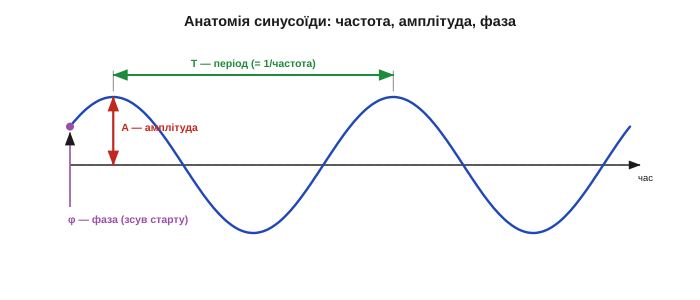
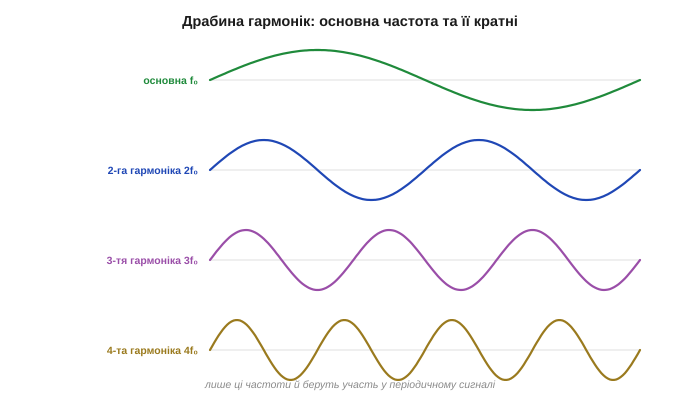
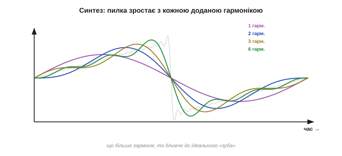
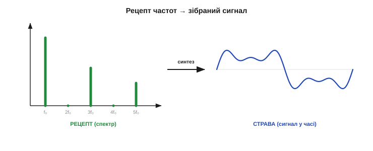
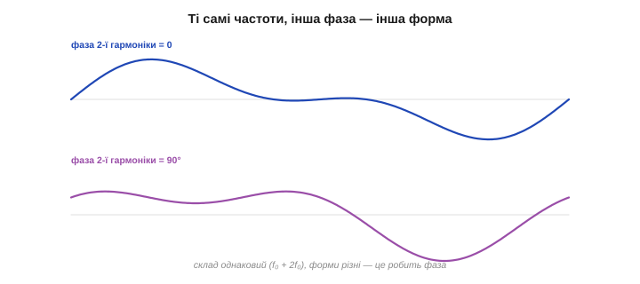
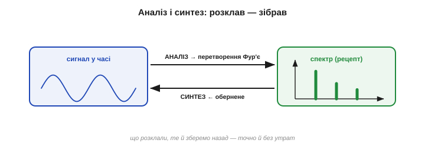

# Ідея Фур'є: будь-який сигнал = сума синусоїд

У сигналу дві мови — [часова й частотна](topic:math-analysis/time-and-frequency), а між ними оборотний місток. Сама **ідея**, на якій той місток стоїть, варта того, щоб сказати її якнайпростіше й найгучніше: **будь-який сигнал можна скласти із самих лише синусоїд**. Хоч би яким заплутаним був запис давача, мікрофона чи антени — це насправді **сума чистих коливань** різних частот, кожне зі своєю силою. Звучить майже неймовірно (Лагранж і не повірив), та саме ця теза — серце всієї цифрової обробки. Розберімо її по-інженерному: що таке «синусоїда-цеглинка», як із цеглинок збирається складне й що таке «рецепт» сигналу.

### Синусоїда — атом коливань

Чому саме синусоїди? Бо синусоїда — **найпростіше можливе коливання**, «атом» усіх хвиль. У неї немає внутрішньої структури: це одна-єдина частота, рівна й нескінченно гладка. Будь-яке інше коливання можна **розкласти** на синусоїди, а саму синусоїду — уже ні на що простіше. До того ж вона **виняткова для лінійних систем**: пропустіть синусоїду крізь фільтр, підсилювач, RC-коло — на виході знову **та сама синусоїда тієї ж частоти**, лише іншої амплітуди й зсунута в часі. Форма не міняється. Жодна інша крива не має цієї властивості — тому синусоїди й стали природною «системою координат» для сигналів.

Є й глибша причина любити синусоїди: до них тяжіє сама **природа**. Гойдалка, маятник, струна, вантаж на пружині, LC-контур, камертон — усе, що вільно коливається, робить це **синусоїдально**. Синус — «рідна» форма коливання фізичного світу, розв'язок рівнянь, що керують пружністю й інерцією. Тож, розкладаючи сигнал на синусоїди, ми розкладаємо його не на штучні абстракції, а на ті самі чисті тони, якими «говорить» сам світ. Не дивно, що така мова виявилася водночас і найзручнішою для математики, і найуніверсальнішою для техніки.

Кожна синусоїда-цеглинка повністю задається **трьома числами**:


*Анатомія синусоїди. Її задають рівно три числа: **частота** (як часто повторюється — скільки циклів за секунду, період T), **амплітуда** (яка заввишки — сила коливання) і **фаза** (де воно починається — зсув уліво/вправо). Змініть будь-яке з трьох — і дістанете іншу цеглинку. Із таких цеглинок Фур'є й складає геть усе.*

- **Частота** (*frequency*) — скільки повних коливань за секунду (герци); це «висота тону». По ній цеглинки й розрізняють.
- **Амплітуда** (*amplitude*) — наскільки коливання сильне, його розмах; це «гучність» цієї частоти.
- **Фаза** (*phase*) — у якій точці циклу хвиля перебуває в момент t=0, тобто наскільки вона зсунута вбік.

Запис формулою: `A·sin(2π·f·t + φ)`, де `f` — частота, `A` — амплітуда, `φ` — фаза. Уся ідея Фур'є — у тому, що з таких трійок, узятих у потрібній кількості, складається **що завгодно**.

### Гармоніки: основна частота та її кратні

Почнімо з найважливішого випадку — сигналу, що **періодично повторюється** (нота, гул двигуна, пульс). Фур'є показав: такий сигнал складається не з абияких частот, а з дуже впорядкованого набору — **основної частоти** `f₀` (період якої дорівнює періоду всього сигналу) та її **цілих кратних** `2f₀, 3f₀, 4f₀…`. Ці кратні звуть **гармоніками** (*harmonics*): друга гармоніка вдвічі швидша за основну, третя — втричі, і так далі.


*Драбина гармонік. Періодичний сигнал будують з основної частоти f₀ (найповільніше коливання, задає період) та її цілих кратних — 2f₀, 3f₀, 4f₀… Кожна наступна гармоніка вдвічі, втричі, вчетверо швидша. Лише ці частоти й беруть участь — звідси й музична назва «гармоніки».*

Це та сама драбина, що співає в напнутій струні: основний тон і його обертони. У музиці саме **набір гармонік** і їхні сили визначають **тембр** — чому скрипка й флейта на одній ноті звучать по-різному: основна частота однакова, а «приправа» з гармонік різна. Періодичний сигнал — це завжди основна частота плюс її гармоніки у власних пропорціях.

А скільки яких гармонік брати — залежить від форми. **Плавний**, близький до синуса сигнал має майже самі низькі гармоніки, а високих — кіт наплакав; **гострий**, зубчастий чи стрибкуватий — навпаки, багатий на сильні високі. Тому за самим виглядом рецепта вже видно характер хвилі: спадають гармоніки швидко — форма гладка; тягнуться високо й сильно — форма колюча. Працює це й у зворотний бік, як інженерна підказка: побачили в спектрі несподівано сильні високі гармоніки — десь у сигналі завівся різкий фронт, клац чи спотворення, якого в чистому тоні бути не мало б.

Жива ілюстрація — людський голос. Голосові зв'язки задають **основну частоту** (висоту голосу), а форма рота й горла підкреслює певні гармоніки — і саме цей візерунок ми чуємо як різні голосні: «а», «о», «і», проспівані на одній висоті, різняться лише **рецептом гармонік**. Тому за спектром голосу впізнають і звук, і навіть мовця: уся ця інформація закодована в тому, скільки якої гармоніки взято. Розпізнавання мови починається саме з цього розкладу на частоти.

### Будуємо складне з простого: синтез

Тепер — найпереконливіше. Якщо ідея правдива, то, **додаючи** гармоніки в правильних кількостях, ми мусимо вміти **зібрати** будь-яку періодичну форму. Перевірмо на пилкоподібній хвилі (рівний наростальний «зуб») — формі, здавалося б, геть несхожій на синус:


*Синтез на очах. Беремо основну синусоїду — груба подоба «зуба». Додаємо другу гармоніку — точніше. Третю, шосту… — і сума щоразу ближча до ідеального пилкоподібного зуба. Дайте правильні кількості кожної гармоніки — і складеться будь-яка форма. Це не фокус, а пряма перевірка тези Фур'є.*

Одна синусоїда — лише віддалений натяк на зуб. Дві — уже краще. Шість — і око майже не відрізнить суму від ідеальної пилки. Кожна нова гармоніка домальовує дрібнішу деталь, а разом вони відтворюють і пологий схил, і різкий обрив зуба. Чому саме **дрібнішу**? Бо кожна наступна гармоніка **швидша**: висока частота встигає на тому самому проміжку зробити багато коливань, тож відповідає за тонкі риси форми, а основна задає грубий каркас. Найважче синусоїдам дається **різкий злам** чи стрибок: щоб відтворити вертикальний обрив зуба, потрібні дуже високі гармоніки, і теоретично їх нескінченно багато. Саме тому біля гострих кутів сума ніколи не лягає ідеально — лишається характерний викид (явище Ґіббса), а гладкими цеглинками гострий кут складається лише в границі. Звідси робоче правило: **що різкіші деталі сигналу, то вищі гармоніки потрібні**. Це і є **синтез** (*synthesis*): складання сигналу з його синусоїдальних складових. І він працює для будь-якої форми — меандру, трикутника, імпульсу, осцилограми голосу, — треба лиш знати **правильні кількості**.

> 🔧 **Навіщо це.** Тут і ховається сенс усієї частотної обробки. Якщо сигнал — це сума синусоїд, то **керувати** ним можна, міняючи кількість кожної: прибрати гул 50 Гц — це **занулити** саме її гармоніку в сумі; підкреслити бас — підняти низькі; стиснути звук — викинути ті частоти, яких вухо не чує. Усе це стає простим саме тому, що сигнал розкладений на незалежні цеглинки. Часова мова цього не вміла — там усе сплутано в одну лінію; частотна вміє, бо тримає складові **окремо**.

### Рецепт сигналу: скільки кожної частоти

Якщо сигнал = сума синусоїд, то він повністю заданий **списком**: яка частота, скільки її (амплітуда), із якою фазою. Цей список — і є **рецепт** сигналу, його повний опис частотною мовою. А намальований стовпчиками — це [спектр](topic:math-analysis/spectrum) сигналу: по горизонталі частоти-інгредієнти, по вертикалі — скільки кожного.


*Рецепт і страва. Ліворуч — «рецепт»: стовпчики, скільки якої частоти взяти (спектр). Праворуч — «страва»: сигнал, зібраний синтезом саме з цих складових. Рецепт і страва — одне й те саме, подане двома мовами; знаючи рецепт, страву відтворюють точно, і навпаки.*

Метафора кухні тут точна. **Рецепт** (спектр) каже: стільки-то частоти `f₀`, стільки-то `2f₀`, стільки-то `5f₀`. **Страва** (часова хвиля) — це що вийде, як усе змішати. Дві форми того самого: маючи рецепт, ви точно спечете страву (синтез), а маючи страву, можете «розкуштувати» рецепт (аналіз). Саме тому спектр — повноцінний опис сигналу, а не якесь його скорочення: у рецепті записано **все**, що треба, аби відтворити оригінал до останньої рисочки.

Варто розрізнити два різновиди рецепта. У **періодичного** сигналу частоти беруться лише з драбини гармонік — тож рецепт **дискретний**, це короткий список окремих ліній (його звуть **рядом Фур'є**). А **разова**, неперіодична подія — одиничний клац, поодинокий імпульс — періоду не має, тож її рецепт уже не список, а **суцільна смуга** частот (це **перетворення Фур'є** у строгому сенсі). Інтуїція та сама — сума синусоїд, — лише для неперіодичного це сума по **неперервному** діапазону частот, а не по окремих гармоніках. Тонкощі цієї різниці нам не знадобляться; досить пам'ятати, що теза «сума синусоїд» покриває **обидва** випадки — і нескінченну ноту, і миттєвий клац.

**Приклад (рецепт прямокутної хвилі).** Зберемо наближений «меандр» (симетричний прямокутник) із кількох гармонік. Його рецепт — лише **непарні** гармоніки з вагами 1, ⅓, ⅕:

```
рецепт меандру:  f₀ · 1     (основна, повна сила)
                 3f₀ · 1/3   (третя, втричі слабша)
                 5f₀ · 1/5   (п'ята, ще слабша)
                 7f₀ · 1/7   ...
страва: сума цих синусоїд → щораз точніший прямокутник
парних гармонік (2f₀, 4f₀…) у рецепті НЕМАЄ — наслідок симетрії меандру
```

Усього кілька чисел — і повний опис форми, яку в часі довелося б задавати сотнею відліків. Рецепт часто **компактніший** за саму страву — на цьому, до речі, і стоїть стиснення (MP3, JPEG). Причому стиснення не псує сигнал навмання, а викидає **найменш потрібні** рядки рецепта — тихі частоти, нечутні гармоніки, — лишаючи ті, що несуть суть. Тому із кількох сотень коефіцієнтів можна лишити десятки, а страва на слух чи на око майже не зміниться. Сама можливість так чинити — пряме породження ідеї Фур'є: розклавши сигнал на **незалежні** частоти, ми дістали змогу зважити кожну окремо й зайві спокійно викинути.

### Фаза: де хвиля починається

Один тонкий, але важливий момент. У рецепті в кожної частоти є не лише **сила** (амплітуда), а й **фаза** — куди її зсунуто. І фаза реально впливає на **форму** часової хвилі: ті самі дві частоти, складені з різними зсувами, дадуть **різні** на вигляд осцилограми.


*Фаза змінює форму, не змінюючи складу. Обидві хвилі зібрані з однакових двох частот (f₀ і 2f₀) і однакових амплітуд — різниться лише фаза другої гармоніки. У часі форми помітно різні, але «інгредієнти» ті самі. Тому, коли питають лише «**які** частоти всередині», на фазу часто заплющують очі; коли ж важлива точна форма — фазу слід берегти.*

Звідси практичний висновок: якщо питання — «**які тони** в сигналі», то фаза другорядна, дивляться на самі амплітуди (саме тому [спектр](topic:math-analysis/spectrum) часто малюють без фази). А от якщо треба **точно відновити форму** сигналу синтезом, фазу викидати не можна — без неї страва вийде не та. Повний рецепт — це завжди **амплітуда плюс фаза** для кожної частоти.

Цікаво, що **вухо** на фазу майже не зважає: два звуки з однаковими амплітудами гармонік, але різними фазами, ми чуємо практично однаково, хоч їхні осцилограми різні. Око ж — для зображень — до фази, навпаки, дуже чутливе: саме вона несе контури предметів. Тому в стисненні звуку фазою часто **жертвують** заради компактності, а в обробці зображень її бережуть. Дрібниця, а показова: що в рецепті важливе, а чим можна знехтувати, залежить від того, **хто читатиме страву** — вухо, око чи алгоритм.

### Аналіз і синтез: туди й назад

Зведімо все в єдину пару напрямків. **Аналіз** (*analysis*) — це розкласти готовий сигнал на синусоїдальні складові, тобто **прочитати рецепт** зі страви; математично це і є **перетворення Фур'є**. **Синтез** (*synthesis*) — скласти сигнал назад із складових, **спекти страву за рецептом**; це **обернене перетворення**. Два боки однієї медалі.

Це і є той оборотний місток між [часовою й частотною мовами](topic:math-analysis/time-and-frequency), тепер названий точно: **аналіз** переводить нас на частотний берег, **синтез** повертає на часовий. І остання чесна обмовка: на практиці суму завжди **обривають** на скінченному числі гармонік — нескінченно багато їх не порахуєш. Тому реальний синтез дає не ідеал, а **наближення**: що більше гармонік лишили, то воно точніше — як видно на пилкоподібній хвилі вище. Де проходить ця межа й чим за неї платять — окрема розмова про [скінченне вікно й розтікання](topic:com-signal/windowing-leakage); досить знати, що скінченний рецепт відтворює сигнал **приблизно**, і керує цим усе той самий компроміс точності й вартості, що й у фільтрах.


*Замкнене коло. Аналіз (перетворення Фур'є) розкладає сигнал на синусоїдальні складові — дістаємо рецепт-спектр. Синтез (обернене перетворення) збирає сигнал назад із тих самих складових. Обидва боки точні й оборотні: що розклали, те й зберемо без утрат.*

Зверніть увагу: тут ми пояснили лише **що** відбувається — розклад на синусоїди й складання назад. **Як саме** комп'ютер читає рецепт з масиву відліків АЦП — за якою формулою рахувати амплітуди кожної частоти — це окрема, суто технічна тема, [дискретне перетворення Фур'є](topic:com-signal/dft), а як зробити це [**швидко**](topic:com-signal/fft) — ще одна. Важливо міцно тримати саму ідею: **сигнал ⇄ сума синусоїд**, аналіз в один бік, синтез у другий.

> 🔧 **Навіщо це.** Гармоніки — не лише теорія, вони народжуються у вашій схемі самі. Будь-яке **спотворення** (нелінійність підсилювача, обрізання сигналу, перемикання ключа) **додає гармоніки** до чистого тону — і саме тому «брудний» підсилювач звучить різкіше, а ШІМ-сигнал повний кратних частот. Дивлячись на спектр виходу, ви прямо бачите якість тракту: чистий тон — самотній пік; спотворений — пік плюс «частокіл» гармонік. Це стандартний інженерний тест (так міряють коефіцієнт гармонік, THD).

> 🔧 **Навіщо це.** Запам'ятайте сигнал як **рецепт**, а не як лінію. Коли наступного разу побачите складну осцилограму, питайте не «що це за крива?», а «**з яких частот** вона зварена і скільки кожної?». Цей зсув погляду — від форми до складу — і є головна навичка, що її дає Фур'є. Усе подальше (спектр, фільтри, стиснення) — лише способи прочитати, змінити чи відтворити цей рецепт.

Отже, ідея в кишені: будь-який сигнал — сума синусоїд, заданих рецептом частот, амплітуд і фаз; аналіз читає рецепт, синтез готує страву. Лишається придивитися до самого рецепта зблизька — навчитися [читати спектр](topic:math-analysis/spectrum): що означає кожен його стовпчик, де там корисне, а де завада, і що саме він каже про сигнал.

---
