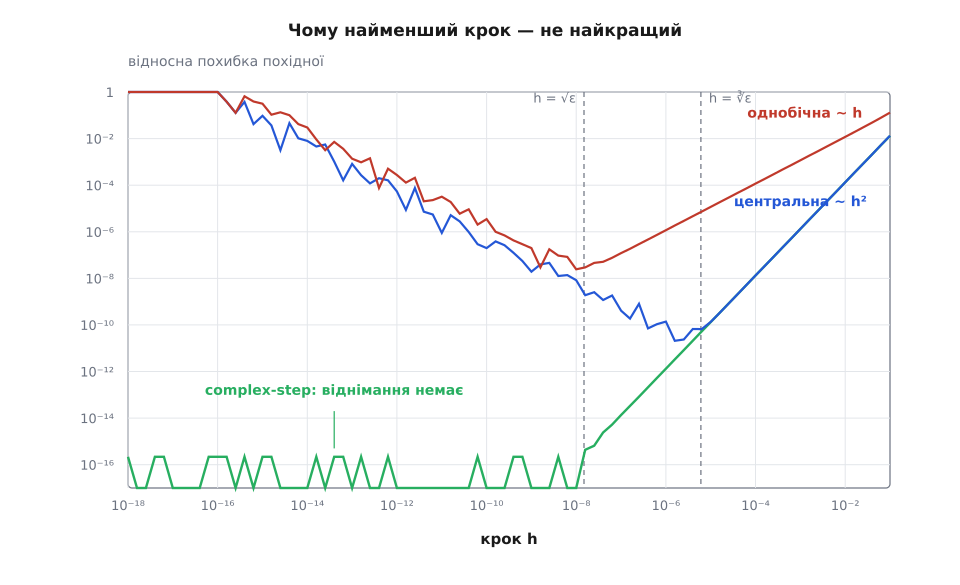
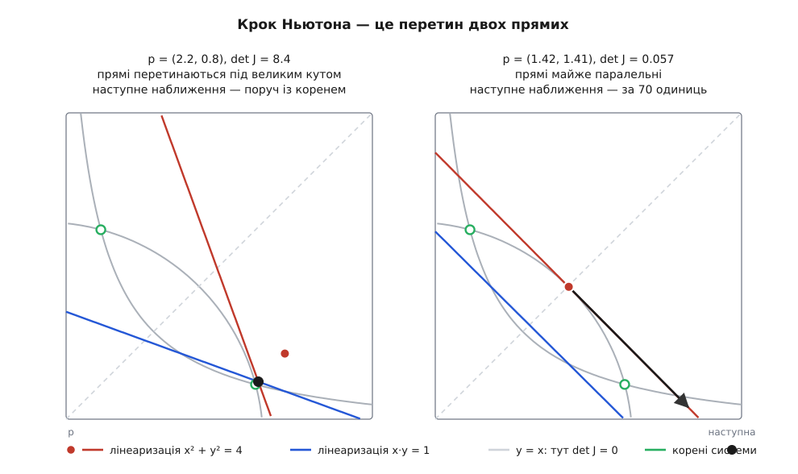

# ⚙️ Чисельний якобіан: n+1 виклик функції й крок, який усе вирішує

Формула під рукою є не завжди. Часто F — це скомпільована процедура, модель приладу або цілий розрахунок, у який ви заглядаєте лише крізь вхід і вихід. Похідних узяти нізвідки, а матриця J у точці потрібна: для кроку Ньютона, для перерахунку похибок, для керування. Єдиний доступний інструмент — виклик F, і його вистачає, якщо правильно вибрати одне число — крок h.

## Один поштовх — один стовпець

Стовпець якобіана відповідає на питання «куди поїде вихід, коли рухається один вхід». Отже, буквально штовхаємо: беремо xⱼ, додаємо маленьке h, дивимось, на скільки зсунувся весь вектор виходу, і ділимо на h.

```
                 F(x + h·eⱼ) − F(x)
стовпець  j  ≈   ──────────────────
                         h
```

Тут eⱼ — одиничний вектор уздовж j-ї осі. Значення F(x) спільне для всіх стовпців, тож уся матриця коштує **n + 1 виклик** F, і ця ціна не залежить від m: скільки б виходів функція не мала, кожен виклик приносить цілий стовпець одразу.

```cpp
#include <algorithm>
#include <cmath>
#include <cstddef>
#include <functional>
#include <limits>
#include <vector>

using Vec = std::vector<double>;
using Mat = std::vector<Vec>;                 // J[i][j] = ∂fᵢ/∂xⱼ
using Fun = std::function<Vec(const Vec&)>;   // F: ℝⁿ → ℝᵐ

// Однобічні різниці. f0 = F(x) приходить ззовні: у методі Ньютона
// це нев'язка, яку однаково вже порахували.
// scale[j] — типовий масштаб j-ї змінної в її власних одиницях, строго > 0.
Mat jacobianForward(const Fun& F, const Vec& x, const Vec& f0, const Vec& scale)
{
    static const double rt = std::sqrt(std::numeric_limits<double>::epsilon()); // ≈1.49e-8
    const std::size_t n = x.size(), m = f0.size();
    Mat J(m, Vec(n));
    Vec xt = x;
    for (std::size_t j = 0; j < n; ++j) {
        const double step = rt * std::max(std::abs(x[j]), scale[j]);
        volatile double bumped = x[j] + step;   // volatile — щоб компілятор
        const double h = bumped - x[j];         // не «спростив» цей рядок
        xt[j] = bumped;
        const Vec f1 = F(xt);
        xt[j] = x[j];
        for (std::size_t i = 0; i < m; ++i)
            J[i][j] = (f1[i] - f0[i]) / h;
    }
    return J;
}
```

Два рядки тут не косметичні. По-перше, `h` беруть не таким, яким його задумали, а таким, яким він **справді вийшов**: сума `x[j] + step` округлюється до найближчого представного числа, тож фактичний приріст трохи інший за `step`. Різниця `bumped - x[j]` дає цей приріст точно (обидва числа різняться менш ніж удвічі, тож віднімання виконується без похибки), і ділити треба саме на нього. Слово `volatile` змушує компілятор покласти суму в пам'ять і прочитати назад, інакше оптимізатор згорне вираз до `step` і зіпсує задум. По-друге, крок ніколи не беруть просто `rt * x[j]`: у точці x[j] = 0 він виродився б у нуль.

## Крок h: обидві крайності псують результат

Різниця має дві незалежні похибки, і вони тягнуть у різні боки.

Перша — **зріз ряду**. [Ряд Тейлора](topic:math-analysis/taylor-series) дає f(x + h) = f(x) + h·f′ + h²·f″/2 + …, тож відношення різниці до h дорівнює f′ + h·f″/2. Похибка пропорційна h: чим більший крок, тим гірше.

Друга — **втрата значущих цифр**. Кожне значення F відоме з відносною точністю ε ≈ 2.2·10⁻¹⁶ ([числа з рухомою комою](topic:hw-arch/floating-point) інакше не вміють). Отже, різниця двох близьких значень несе абсолютну похибку близько 2ε·|f|, і після ділення на h вона роздувається в 1/h разів. Похибка пропорційна 1/h: чим менший крок, тим гірше.

```
E(h) ≈ h·|f″|/2  +  2ε·|f|/h

мінімум суми:  h* = 2·√( ε·|f| / |f″| ) ,   E(h*) = 2·√( ε·|f|·|f″| )

при |f| ≈ |f″| ≈ 1:   h* ≈ 3·10⁻⁸ ≈ √ε ,   E ≈ 3·10⁻⁸
```

Звідси тверезий висновок: **однобічні різниці зберігають лише половину цифр**. Із шістнадцяти надійних десяткових знаків у похідній лишається вісім, і жодне налаштування цього не змінить — це не хиба реалізації, а рівновага двох похибок.

**Похідна f(x) = eˣ / √(sin³x + cos³x) у точці x = 1.5, де точне значення f′ = 4.05342789389862**

```
h = 10⁻²    відносна похибка  1.2·10⁻²
h = 10⁻⁵    відносна похибка  1.2·10⁻⁵
h = 10⁻⁸    відносна похибка  2.5·10⁻⁸   ← найкраще
h = 10⁻¹²   відносна похибка  2.7·10⁻⁴
h = 10⁻¹⁶   відносна похибка  1          x + h == x, різниця = 0, «похідна» = 0
```



*Права вітка кожної кривої — зріз ряду, ліва — втрачені цифри. Мінімум однобічної різниці стоїть на √ε, центральної — на ∛ε; complex-step лівої вітки не має взагалі.*

## Центральні різниці: удвічі дорожче, набагато точніше

Якщо штовхнути вхід в обидва боки, доданок h·f″/2 в одній різниці додатний, а в другій від'ємний — і в сумі зникає:

```
        F(x + h·eⱼ) − F(x − h·eⱼ)                       h²·|f‴|
J·eⱼ ≈  ────────────────────────── ,   зріз ряду ≈  ─────────
                   2h                                    6
```

Тепер зріз пропорційний h², а втрата цифр лишилася тією самою, тож рівновага зсувається: h* ≈ ∛ε ≈ 6·10⁻⁶, а похибка падає до ε^(2/3) ≈ 4·10⁻¹¹ — дві третини цифр замість половини. У вимірах вище центральна різниця при h = 10⁻⁶ дала 1.4·10⁻¹⁰, тобто в двісті разів точніше за найкращу однобічну. Ціна — **2n викликів**: значення F(x) більше нікуди не входить, спільної економії немає.

## Complex-step: віднімання, якого немає

Корінь усього зла — віднімання двох майже однакових чисел. Його можна прибрати цілком, якщо штовхнути аргумент не вздовж дійсної осі, а вздовж уявної. Розкладаємо той самий ряд для кроку i·h:

```
f(x + i·h) = f(x) + i·h·f′(x) − h²·f″(x)/2 − i·h³·f‴(x)/6 + …

Im f(x + i·h) = h·f′(x) − h³·f‴(x)/6

           Im f(x + i·h)
f′(x)  =   ─────────────  + O(h²)
                 h
```

Уявна частина складається **лише** з непарних доданків, серед яких f(x) немає взагалі — віднімати нічого. Тому h можна брати яким завгодно малим: при h = 10⁻³⁰ зріз ряду має порядок 10⁻⁶⁰, тобто його просто немає, а лишається звичайне округлення арифметики, ≈2·10⁻¹⁶. Це точність аналітичної похідної за ціною одного обчислення функції на стовпець.

```cpp
#include <complex>

using Cplx = std::complex<double>;

// F пишемо шаблоном, щоб її можна було інстанціювати і для double,
// і для std::complex<double>. Це головна вимога способу.
template <class T>
std::vector<T> F(const std::vector<T>& v)
{
    return { v[0] * v[0] + v[1] * v[1] - T(4.0),
             v[0] * v[1]               - T(1.0) };
}

Mat jacobianComplexStep(const Vec& x, std::size_t m)
{
    const double h = 1e-30;
    const std::size_t n = x.size();
    Mat J(m, Vec(n));
    std::vector<Cplx> z(x.begin(), x.end());
    for (std::size_t j = 0; j < n; ++j) {
        z[j] = Cplx(x[j], h);
        const std::vector<Cplx> f = F(z);
        z[j] = Cplx(x[j], 0.0);
        for (std::size_t i = 0; i < m; ++i)
            J[i][j] = f[i].imag() / h;
    }
    return J;
}
```

Платня за це — вимоги до самої F. Вона мусить бути аналітичною поблизу точки: арифметика, `exp`, `sin`, `cos`, степені це витримують, а `std::abs`, `std::max`, спряження та будь-яке порівняння значень — ні, бо ламають комплексну диференційовність. Кожне `if (v > 0)` всередині доводиться переписувати так, щоб воно дивилося тільки на дійсну частину. І код F має компілюватися для комплексного типу — саме тому шаблон.

Прийом старіший, ніж здається. Джеймс Лайнесс і Клів Молер 1967 року побудували способи брати похідні аналітичної функції через інтегральну теорему Коші; просту формулу для першої похідної опублікували Вільям Сквайр і Джордж Трапп (SIAM Review 40(1), 1998, с. 110–112), а Жоакім Мартінс зі співавторами (ACM TOMS, 2003) розібрали її теорію й показали, що це фактично [автоматичне диференціювання](topic:math-numeric/automatic-differentiation) прямого ходу, яке за вас виконує комплексна арифметика компілятора.

## Робочий приклад: метод Ньютона на чисельному якобіані

Розв'яжімо систему, у якої відповідь відома точно, — так видно кожну цифру похибки:

```
F₁(x, y) = x² + y² − 4         корінь у першому квадранті:
F₂(x, y) = x·y − 1             x* = 2·cos 15° = 1.9318516525781366
                               y* = 2·sin 15° = 0.5176380902050415
```

[Метод Ньютона](topic:math-numeric/newton-raphson) у багатьох вимірах — це щоразу розв'язати J·δ = −F(x) і зробити крок x ← x + δ. Для n = 2 систему розв'язує правило Крамера; для довільного n на його місці стоїть [LU-розклад](topic:math-algebra/lu-decomposition) із вибором головного елемента.

```cpp
#include <cstdio>

static const double XR = 1.9318516525781366;   // точний корінь — лише щоб
static const double YR = 0.5176380902050415;   // друкувати справжню похибку

static bool solve2(const Mat& J, const Vec& f0, Vec& d)
{
    const double det = J[0][0] * J[1][1] - J[0][1] * J[1][0];
    const double mag = std::abs(J[0][0] * J[1][1]) + std::abs(J[0][1] * J[1][0]);
    if (std::abs(det) < 1e-12 * mag) return false;   // майже вироджена
    d[0] = (-f0[0] * J[1][1] + J[0][1] * f0[1]) / det;
    d[1] = (-J[0][0] * f0[1] + J[1][0] * f0[0]) / det;
    return true;
}

int main()
{
    const Vec scale{1.0, 1.0};
    Vec x{3.0, 1.0}, d(2);
    for (int k = 0; k < 12; ++k) {
        const Vec f0 = F(x);                       // нев'язка — і вона ж вхід якобіана
        const double res = std::hypot(f0[0], f0[1]);
        std::printf("%2d  x = (%17.14f, %17.14f)   |F| = %.1e   |x-x*| = %.1e\n",
                    k, x[0], x[1], res, std::hypot(x[0] - XR, x[1] - YR));
        if (res < 1e-14) break;
        const Mat J = jacobianForward(F<double>, x, f0, scale);
        if (!solve2(J, f0, d)) { std::puts("якобіан майже вироджений"); break; }
        x[0] += d[0];
        x[1] += d[1];
    }
}
```

Вивід, розкладений по стовпцях:

```
 k        x                    y               |F|        |x − x*|
 0   3.00000000000000     1.00000000000000    6.3e+00     1.2e+00
 1   2.12500000651900     0.62499999782700    9.6e-01     2.2e-01
 2   1.94128788121600     0.52462121211100    4.8e-02     1.2e-02
 3   1.93188004681900     0.51766436048400    1.5e-04     3.9e-05
 4   1.93185165288400     0.51763809050900    1.7e-09     4.3e-10
 5   1.93185165257800     0.51763809020500    4.4e-16     2.5e-16
```

Похибка йде 1.2 → 0.22 → 0.012 → 3.9·10⁻⁵ → 4.3·10⁻¹⁰ → 2.5·10⁻¹⁶: кожен крок приблизно підносить попередню похибку до квадрата.

Найцікавіше — останній рядок. Якобіан ми знаємо лише з восьми цифрами, а корінь дістали до останнього біта. Суперечності немає: нерухома точка ітерації визначається рівнянням F(x) = 0, а J у нього не входить. Неточний якобіан краде **швидкість**, а не **відповідь**: квадратична збіжність псується множником порядку ‖ΔJ‖·‖J⁻¹‖ ≈ 10⁻⁸ за крок, чого в таблиці й не помітно. Саме тому дешевих різниць вистачає для Ньютона — і не вистачає там, де сама похідна є відповіддю: у чутливостях, у бюджеті похибок, у градієнтах для оптимізації.

## Що стається біля det J → 0

Візьмімо старт (1.4143, 1.4142). Визначник тут 5.7·10⁻⁴, і перший же крок викидає точку за п'ять тисяч одиниць від кореня:

```
 0   x = ( 1.414300000,  1.414200000)   |F| = 1.0e+00   det J = 5.7e-04
 1   x = (5001.16955899, -4998.69467496) |F| = 5.6e+07   det J = 4.9e+04
 2   x = (2501.17829583, -2498.75392434) |F| = 1.4e+07   det J = 2.4e+04
 …    (ще п'ятнадцять рядків повільного повернення)
18   x = ( 1.931851653,  0.517638090)   |F| = 8.9e-16   det J = 6.9e+00
```

Вісімнадцять ітерацій замість п'яти, і між ними — довга дорога назад із нізвідки. Причина видна геометрично. Крок Ньютона — це перетин двох прямих: лінеаризацій обох рівнянь. Визначник J дорівнює 2(x² − y²), тобто зникає на прямій y = x; там градієнти обох рівнянь стають паралельними, разом із ними паралельними стають і самі прямі, а перетин двох майже паралельних прямих відлітає нескінченно далеко.



*Ліворуч прямі сходяться під великим кутом — наступне наближення поруч із коренем. Праворуч кут майже нульовий, і той самий перетин опиняється за сімдесят одиниць звідси; для точки з таблиці, ще ближчої до прямої y = x, він відлітає за п'ять тисяч.*

Чисельні різниці тут ні до чого: аналітичний якобіан у цій точці вироджений так само. Лікується це не кращою похідною, а коротшим кроком — і не перевіркою «чи det малий», бо визначник змінюється як n-й степінь масштабу матриці й сам собою нічого не каже, а оцінкою [умовного числа](topic:math-numeric/condition-number) або простим обмеженням довжини δ радіусом довіри.

> 🔧 **Навіщо це.** У бібліотеці розв'язувачів різниця між «працює» і «розходиться» майже завжди в цих двох рядках: як вибрано h і чи вкорочується крок біля виродження. Ті самі два рядки — у прошивці, що калібрує прилад по трьох гвинтах, і в підгонці моделі під виміри.

## Пастки й ціна

**Різні одиниці.** Нехай x₁ — метри порядку 1, x₂ — струм порядку 10⁻⁶ А, а крок узято один на всіх, 1.5·10⁻⁸. Для першої змінної він нормальний, для другої це обурення на півтора відсотка — зовсім не «мале», і різниця дасть січну через далеку точку, а не похідну. Дзеркальний випадок гірший: якби третя змінна мала порядок 10¹⁰, той самий крок був би дрібнішим за останній біт мантиси, `x + h` дорівнювало б `x`, F не змінилася б, і стовпець вийшов би нульовим — матриця мовчки стала б виродженою. Саме від цього рятує аргумент `scale`, і брати його треба з умови задачі, а не з поточного значення, яке може бути нулем. Рядки матриці мають ту саму хворобу: якщо одне рівняння в кіловольтах, а друге в мікроамперах, розв'язок системи перекошений — [розмірний аналіз](topic:math-numeric/dimensional-analysis) тут не педантизм, а робочий крок.

**F шумить сама.** Якщо F усередині щось ітерує до допуску τ (розв'язувач, інтегратор, інтерполяція по таблиці), то в ролі ε виступає вже не 2.2·10⁻¹⁶, а цей τ. Рівновага зсувається: h* ≈ √τ, а точність похідної теж ≈ √τ. При τ = 10⁻⁶ ви дістанете три надійні цифри, і ніякі центральні різниці не допоможуть — вони борються зі зрізом, а не з шумом. Ознака проста: якщо різниця при зменшенні h перестає падати гладко й починає стрибати, ви вже вимірюєте шум.

**Повторне обчислення F(x).** У наведеному коді нев'язка передається в якобіан, а не рахується вдруге: це економить один виклик із n + 1 і, важливіше, гарантує, що в чисельнику стоять біт-у-біт ті самі числа. Звідси ж вимога: F має бути чистою функцією. Прихований стан — лічильник ітерацій, адаптивний допуск, кеш — робить сусідні виклики нерівноцінними, і різниця почне міряти цей стан, а не похідну.

**Ціна.** Однобічні різниці — n + 1 виклик, центральні — 2n, complex-step — n комплексних (кожен приблизно вдвічі-вчетверо дорожчий за дійсний). Розв'язання J·δ = −F додає O(n³). Поки F дорога, панують виклики; коли F дешева, а n велике, панує розклад матриці. Якщо кожен вихід залежить лише від кількох входів, стовпці можна оцінювати групами, штовхаючи одразу кілька змінних, які не перетинаються, — прийом Кертіса, Пауелла й Ріда (1974) зводить n + 1 виклик до кількості кольорів у [розфарбуванні графа розрідженості](topic:math-numeric/sparse-jacobian-coloring).

Переходити на [автоматичне диференціювання](topic:math-numeric/automatic-differentiation) варто тоді, коли одна з трьох умов стає нестерпною: n велике й кожен виклик F дорогий; потрібно більше за половину цифр; у F є злами (`abs`, `min`, галуження за значенням), на яких різниці й complex-step однаково брешуть. Автоматичне диференціювання дає точні похідні за ціною кількох обчислень F — але вимагає доступу до коду F, а чисельні різниці працюють із будь-якою чорною скринькою. Саме тому вони й не зникають.
