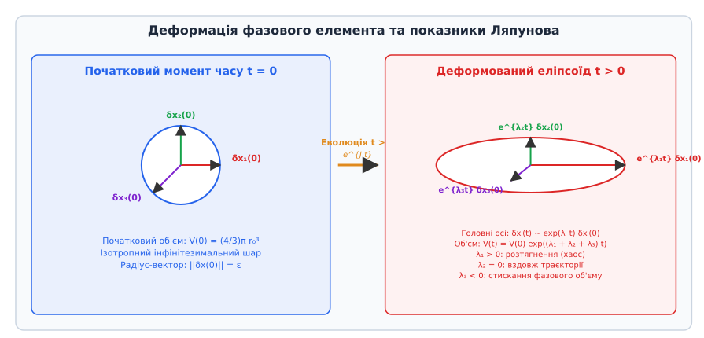
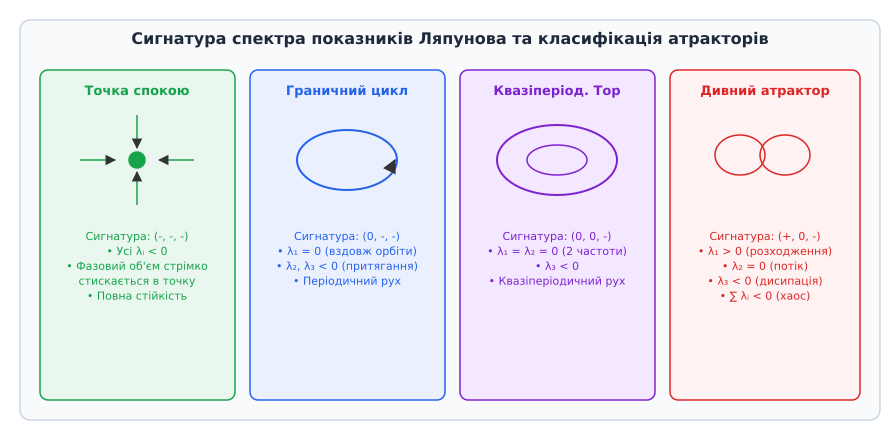
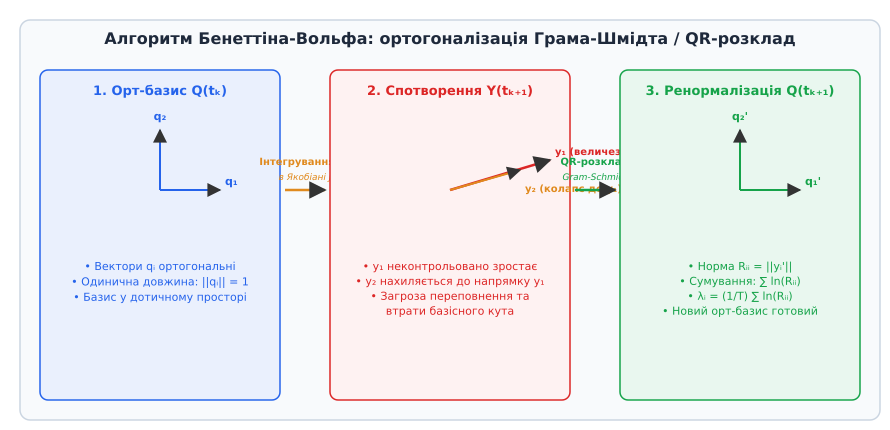

# Показники Ляпунова

<preknowlist>
- [Фазовий простір та фазовий портрет](topic:math-analysis/phase-portrait) — векторний стан системи та динамічні траєкторії.
- [Детермінований хаос](topic:math-analysis/deterministic-chaos) — чутливість до початкових умов та дивні атрактори.
- [Матриці та власні числа](topic:math/linear-algebra) — спектральний розклад лінійних операторів та якобіана.
</preknowlist>

Коли дві незаряджені частинки у турбулентному потоці рідини, два математичні маятники зі спільним підвісом або два космічні апарати зі близькими початковими швидкостями розпочинають рух із майже однакових точок фазового простору, відстань між ними з часом змінюється нелінійно. У регулярних впорядкованих системах (таких як ідеальний гармонічний осцилятор або ізольована планетна орбіта у задачі Кеплера) ця відстань зростає за лінійним або степеневим законом, або ж осцилює у вузьких фіксованих межах. Однак у складних нелінійних дисипативних і консервативних механічних системах близькі траєкторії можуть експоненціально розходитися, перетворюючи найменшу невпевненість у вимірюванні початкового стану на повну непередбачуваність майбутньої еволюції. Кількісною мірою цієї середньої експоненціальної швидкості розходження або стискання фазових траєкторій слугують показники Ляпунова (Lyapunov exponents).

Дослідження експоненціальної стійкості бере свій початок із класичних праць кінця XIX століття. Детальний опис історичного шляху від дисертації Олександра Ляпунова 1892 року до сучасних обчислювальних алгоритмів аналізу нелінійних систем винесено в окремий матеріал: 📜 [Історія виникнення показників Ляпунова](topic:math-analysis/lyapunov-exponent/hist-lyapunov-exponent.md).

## Геометрія деформації фазового елемента та локальна лінеаризація

Розглянемо n-вимірну автономну динамічну систему, стан якої в кожен момент часу описується точкою `x(t) = (x₁(t), x₂(t), ..., x♁(t))` у фазовому просторі ℝⁿ. Еволюція системи задається системою звичайних диференціальних рівнянь:

```
dx / dt = f(x)
```

де `f: ℝⁿ → ℝⁿ` — неперервно диференційовне векторне поле класу C¹.

Нехай `x(t)` — опорна (базова) траєкторія, що виходить із початкової точки `x(0) = x₀`. Оцінимо поведінку збуреної траєкторії `x̃(t) = x(t) + δx(t)`, де `δx(t)` — інфінітезимальний вектор збурення в дотичному просторі `T_x ℝⁿ`. Диференціюючи вектор збурення по часу та розкладаючи векторне поле `f(x + δx)` у ряд Тейлора в околиці поточного стану `x(t)`, обмежуючись членами першого порядку малості, отримуємо лінеаризоване варіаційне рівняння:

```
d(δx) / dt = J(x(t)) · δx(t)
```

де `J(x)` — матриця Якобі (якобіан) векторного поля, елементами якої є часткові похідні `J_ij = ∂f_i / ∂x_j`.

Розв'язок варіаційного рівняння виражається через фундаментальну матрицю розв'язків (оператор еволюції в дотичному просторі) `Y(t)`:

```
δx(t) = Y(t) · δx(0),     dY / dt = J(x(t)) · Y(t),     Y(0) = I
```

Геометричний зміст оператора еволюції `Y(t)` полягає у перетворенні початкової інфінітезимальної `n`-вимірної гіперсфери радіуса `ε = ||δx(0)||` у деформований `n`-вимірний еліпсоїд. У процесі руху вздовж нелінійної траєкторії напрямки та довжини піввісей цього еліпсоїда постійно змінюються та повертаються під дією локального поля якобіана.


*Деформація початкової гіперсфери у фазовому просторі в еліпсоїд. Довжини піввісей зростають пропорційно exp(λᵢ t).*

Довжина i-ї головної піввісі деформованого еліпсоїда `δx_i(t)` змінюється за експоненціальним законом:

```
||δx_i(t)|| ≈ ||δx_i(0)|| · exp(λ_i · t)
```

де `λ_i` — i-й показник Ляпунова. Знаки та величини показників Ляпунова визначають фізичну природу деформації фазового елемента:
- Якщо `λ_i > 0`, уздовж даного напрямку відбувається експоненціальне розтягнення фазового елемента (локальна втрата стійкості, розходження траєкторій та детермінований хаос).
- Якщо `λ_i < 0`, уздовж даного напрямку відбувається експоненціальне стискання (швидке загасання початкових збурень і притягання до атрактора).
- Якщо `λ_i = 0`, середня довжина піввісі зберігається (нейтральна стійкість вздовж напрямку фазового потоку).

## Математичне означення та спектр показників Ляпунова

Старший (максимальний) показник Ляпунова `λ_max` характеризує граничну середню швидкість розходження двох нескінченно близьких початкових станів за нескінченний час:

```
λ_max = lim_{t → ∞} (1 / t) · ln( ||δx(t)|| / ||δx(0)|| )
```

У загальному випадку n-вимірного фазового простору існує не один показник, а впорядкований набір із `n` чисел `λ₁ ≥ λ₂ ≥ ... ≥ λ♁`, який називається покроковим спектром показників Ляпунова.

Строге математичне обґрунтування існування цього спектра для майже всіх початкових точок спирається на граничну матрицю Оселедця:

```
Λ_x = lim_{t → ∞} [ Y(t)^T · Y(t) ]^{1 / (2t)}
```

Власні значення симетричної матриці `Λ_x` дорівнюють `exp(λ₁), exp(λ₂), ..., exp(λ♁)`. Докладний математичний розклад, строгі доведення та інваріантність спектра відносно координаторних диффеоморфізмів наведено в матеріалі: 🧮 [Математична теорія та спектральний розклад Оселедця](topic:math-analysis/lyapunov-exponent/math-lyapunov-spectrum.md).

Показники Ляпунова мають три фундаментальні математичні властивості:
1. **Інваріантність відносно замін координат:** При довільному гладкому обратимому перетворенні фазових змінних `y = g(x)` спектр `(λ₁, ..., λ♁)` залишається незмінним.
2. **Інваріантність вздовж траєкторії:** Усі точки, що належать одній і тій самій ергодичній траєкторії (або атрактору), мають однаковий спектр Ляпунова.
3. **Наявність нульового показника для потоків:** Для будь-якого автономного неперервного потоку `dx/dt = f(x)`, який не прямує до точки спокою, принаймні один із показників Ляпунова, що відповідає напрямку векторного поля `f(x)`, точно дорівнює нулю (`λ_flow = 0`).

## Локальні у часі показники Ляпунова та флуктуації розходження

Глобальні показники Ляпунова `λ_i` є середніми характеристиками за нескінченний час `t → ∞`. Однак у реальних фізичних системах швидкість розходження траєкторій суттєво варіюється залежно від того, через яку саме область фазового простору проходить траєкторія в даний момент.

Для опису цієї неоднорідності вводять поняття **локальних (або скінченночасових) показників Ляпунова** `λ_i(x, Δt)`:

```
λ_i(x, Δt) = (1 / Δt) · ln( (R(x, Δt))_{ii} )
```

де `R(x, Δt)` — верхня трикутна матриця QR-розкладу оператора еволюції `Y(x, Δt)` на скінченному проміжку часу `Δt`.

У хаотичних системах локальні показники `λ₁(x, Δt)` флуктують навколо середнього значення `λ₁`. Розподіл імовірностей локальних показників `P(λ, Δt)` підпорядковується теоремі про великі відхилення (Large Deviation Theory):

```
P(λ, Δt) ≈ exp( -Δt · S(λ) )
```

де `S(λ)` — спектр великих відхилень (функція Крамера).

Існування областей фазового простору, де локальний показник тимчасово стає від'ємним (`λ₁(x, Δt) < 0`), пояснює явище переміжного хаосу (intermittency), коли хаотичні сплески чергуються з тривалими ділянками квазіперіодичної поведінки.

Крім того, експоненціальне зростання відстані між траєкторіями `||δx(t)|| ≈ ||δx(0)|| · exp(λ₁ · t)` відбувається лише доти, доки відстань `||δx(t)||` залишається малим інфінітезимальним збуренням. Коли відстань досягає характерного геометричного розміру атрактора `L_attractor`, нелінійні члени вихідної системи `f(x)` припиняють експоненціальне розходження і повертають траєкторію назад у компактну область фазового простору (явище нелінійного насичення або складання, folding).

## Класифікація атракторів за сигнатурою спектра Ляпунова

Властивості динамічного режиму системи повністю визначаються знаками елементів спектра Ляпунова `(λ₁, λ₂, ..., λ♁)`. Послідовність знаків показників називається сигнатурою спектра.


*Типові сигнатури спектра Ляпунова для стійкої точки, граничного циклу, квазіперіодичного тора та дивного хаотичного атрактора.*

Розглянемо детально класифікацію граничних режимів для тривимірної нелінійної системи (`n = 3`):

### 1. Стійка точка спокою (вузол, фокус): сигнатура `(-, -, -)`
Усі три показники від'ємні (`λ₁ < 0, λ₂ < 0, λ₃ < 0`). Будь-яке початкове збурення експоненціально загасає по всіх трьох вимірах. Фазовий об'єм стрімко стискається в одну геометричну точку. Прикладом є згасаючий маятник із тертям, де вся кінетична та потенціальна енергія розсіюється в тепло.

### 2. Стійкий граничний цикл (періодичні осциляції): сигнатура `(0, -, -)`
Один показник дорівнює нулю (`λ₁ = 0`), а два інших від'ємні (`λ₂ < 0, λ₃ < 0`). Нульовий показник відповідає нейтральній зсувній стійкості вздовж замкненої орбіти (зсув фази осциляцій не зростає і не загасає). Від'ємні показники забезпечують поперечне притягання сусідніх траєкторій до поверхні циклу. Фізичним прикладом є генератор Ван дер Поля або механічний годинник із анкерним ходом.

### 3. Двовимірний тор (квазіперіодичний рух): сигнатура `(0, 0, -)`
Два показники дорівнюють нулю (`λ₁ = 0, λ₂ = 0`), а третій від'ємний (`λ₃ < 0`). Рух розкладається на дві незалежні частоти з несумірним відношенням. Траєкторія щільно вкриває поверхню тора, зберігаючи стабільність відносно зовнішніх поперечних збурень. Такий рух спостерігається у зв'язаних осциляторах до настання хаотичної розсинхронізації.

### 4. Дивний хаотичний атрактор (детермінований хаос): сигнатура `(+, 0, -)`
Один показник додатний (`λ₁ > 0`), один нульовий (`λ₂ = 0`), а третій від'ємний (`λ₃ < 0`). Додатний показник `λ₁ > 0` означає наявність локального розтягнення фазових траєкторій (експоненціальне розходження близьких станів). Від'ємний показник `λ₃ < 0` забезпечує глобальне стискання фазового об'єму, не дозволяючи траєкторії піти в нескінченність. Суміщення локального розтягнення та глобального складання (stretching and folding) утворює складну фрактальну структуру дивного атрактора. Класичними прикладами є система Лоренца 63, осцилятор Дюффінга та атрактор Ресслера.

### 5. Гіперхаос (Hyperchaos): сигнатура `(+, +, 0, -)`
У системах із розмірністю фазового простору `n ≥ 4` можливе виникнення режимів із двома або більше додатними показниками Ляпунова. Гіперхаос характеризується розтягненням фазового елемента одразу за кількома незалежними геометричними напрямками, що значно ускладнює структуру фазових траєкторій і робить систему надзвичайно стійкою до спроб її придушення чи синхронізації.

## Канонічні приклади нелінійних систем та їхні спектри

Аналіз конкретних модельних систем дозволяє глибше зрозуміти фізичний та обчислювальний зміст показників Ляпунова.

### Система Лоренца 63 (модель атмосферної конвекції)
Система описує конвекційне перенесення тепла у пласкому шарі рідини, що підігрівається знизу (комірки Бенара):
- `dx / dt = σ · (y - x)`
- `dy / dt = x · (ρ - z) - y`
- `dz / dt = x · y - β · z`

Тут `x` характеризує швидкість циркуляції конвекційного валу, `y` — різницю температур висхідного та низхідного потоків, а `z` — відхилення вертикального температурного профілю від лінійного.

При класичних параметрах `σ = 10`, `ρ = 28`, `β = 8/3` чисельний розрахунок дає такий спектр Ляпунова:
- `λ₁ ≈ +0.906` (додатний: локальне розтягнення, хаос)
- `λ₂ = 0.000` (нульовий: рух вздовж фазового потоку)
- `λ₃ ≈ -14.572` (від'ємний: потужне стискання фазового об'єму)

Сума показників дорівнює `∑ λ_i = -13.666`, що точно збігається з постійною дивергенцією векторного поля `div(f) = -(σ + 1 + β) = -(10 + 1 + 2.666) = -13.666`.

### Осцилятор Дюффінга з періодичним збудженням
Механічний осцилятор із двома станами рівноваги (пружна пластина між двома магнітами під дією гармонічної зовнішньої сили):
- `dx / dt = v`
- `dv / dt = x - x³ - δ · v + γ · cos(ω · t)`

Фазовий простір цієї системи є тривимірним `(x, v, θ)`, де `θ = ω · t mod 2π` — фаза зовнішнього збудження. При `δ = 0.25`, `γ = 0.30`, `ω = 1.0` система демонструє хаотичне перестрибування маятника між двома потенціальними ямами зі спектром Ляпунова `(+0.10, 0.00, -0.35)`.

### Дискретне відображення Ено (Henon Map)
Двовимірне дискретне відображення, що моделює переріз Пуанкаре нелінійного потоку:
- `x_{n+1} = 1 - a · x_n² + y_n`
- `y_{n+1} = b · x_n`

При канонічних параметрах `a = 1.4`, `b = 0.3` якобіан відображення постійний і дорівнює `det(J) = -b = -0.3`. Спектр показників Ляпунова становить `λ₁ ≈ +0.42` та `λ₂ ≈ -1.62`. Зміна площі фазового елемента за один крок дорівнює `exp(λ₁ + λ₂) = exp(0.42 - 1.62) = exp(-1.20) = 0.316 ≈ |det(J)|`.

## Теорема Ліувілля, Гамільтонові системи та симплектична симетрія

Швидкість зміни `n`-вимірного інфінітезимального фазового об'єму `V(t)` під дією векторного поля `f(x)` визначається дивергенцією цього поля (теорема Ліувілля):

```
(1 / V) · (dV / dt) = div(f) = ∑_{i=1}^n (∂f_i / ∂x_i) = tr(J(x))
```

Інтегруючи це співвідношення вздовж траєкторії за великий час `T`, отримуємо фундаментальний зв'язок між сумою всіх показників Ляпунова та середньою дивергенцією фазового потоку:

```
∑_{i=1}^n λ_i = lim_{T → ∞} (1 / T) · ∫_0^T tr(J(x(τ))) dτ
```

Виходячи з цього зв'язку, динамічні системи поділяються на два принципові класи:

### 1. Консервативні (Гамільтонові) системи
У гамільтоновій механіці векторний стан складається з обобщених координат `q` та імпульсів `p`, а рівняння руху задаються через функцію Гамільтона `H(q, p)`:
- `dq / dt = ∂H / ∂p`
- `dp / dt = -∂H / ∂q`

Дивергенція векторного поля гамільтонової системи тотожно дорівнює нулю: `div(f) = ∑ (∂²H / ∂q_i ∂p_i - ∂²H / ∂p_i ∂q_i) = 0`. Отже, фазовий об'єм консервативної системи строго зберігається в часі, а сума всіх показників Ляпунова дорівнює нулю:

```
∑_{i=1}^{2k} λ_i = 0
```

Більше того, матриця Якобі гамільтонової системи володіє симплектичною симетрією `J^T · J_{symp} + J_{symp} · J = 0`, де `J_{symp}` — канонічна симплектична матриця. З цієї симетрії випливає **парна дзеркальна властивість спектра Ляпунова**: якщо `λ_i` є показником Ляпунова консервативної системи, то `-λ_i` також є її показником Ляпунова. Спектр 2k-вимірної гамільтонової системи має вигляд:

```
( λ₁, λ₂, ..., λ_k, -λ_k, ..., -λ₂, -λ₁ )
```

Якщо у консервативній системі виникає додатний показник `λ₁ > 0`, обов'язково існує симетричний від'ємний показник `-λ₁`, який стискає фазовий елемент із точно такою ж швидкістю. Прикладом є відображення Чирикова (Standard Map) для пучка частинок у магнітних пастках усередненого поля, де хаотичні зони співіснують із регулярними замкненими KAM-торами.

### 2. Дисипативні системи
Внаслідок наявності в'язкості, тертя, випромінювання або активного електричного опору фазовий об'єм дисипативної системи звужується з часом (`div(f) < 0`). Сума всіх показників Ляпунова є суворо від'ємною:

```
∑_{i=1}^n λ_i < 0
```

У дисипативних системах сума від'ємних показників за модулем перевищує суму додатних показників. Це забезпечує локалізацію фазових траєкторій на геометричній множині нульового фазового об'єму — дивному атракторі.

## Чисельні бар'єри та алгоритм Бенеттіна-Вольфа

При спробі прямого чисельного розрахунку показників Ляпунова шляхом довготривалого інтегрування варіаційного рівняння `d(δx)/dt = J(x) · δx` виникають дві критичні обчислювальні проблеми:

1. **Експоненціальне переповнення (Numerical Overflow):** Для хаотичної системи норма вектора `||δx(t)|| ≈ ||δx(0)|| · exp(λ₁ · t)` перевищує максимально допустиме число формату IEEE 754 (`~10³⁰⁸`) за відносно короткий час.
2. **Колапс дотичного простору (Loss of Orthogonality):** Будь-який випадково обраний початковий вектор `δx(0)`, який має бодай мізерну проєкцію на напрямок найбільшого розтягнення `e₁`, під час інтегрування повертається і вирівнюється уздовж `e₁`. У результаті всі `n` інтегрованих векторів стають колінеарними, і обчислити молодші показники `λ₂, ..., λ♁` стає неможливо.

Для подолання цих бар'єрів використовується метод постійної реортогоналізації та ренормалізації (алгоритм Бенеттіна-Вольфа).


*Алгоритм Бенеттіна-Вольфа: запобігання чисельному переповненню та колапсу базису через накопичення нормувальних коефіцієнтів.*

Через рівні проміжки часу `Δt` дотичні вектори піддаються процедурі ортогоналізації Грама-Шмідта або QR-розкладу `Y = Q · R`. Ортогональна матриця `Q` дає новий чистий базис для наступного кроку інтегрування, а логарифми діагональних елементів верхньої трикутної матриці `R_ii` накопичуються в загальну суму.

Повна алгоритмічна реалізація цього методу з вихідним кодом на C та C++ подана у вставці: ⚙️ [Чисельний розрахунок показників Ляпунова](topic:math-analysis/lyapunov-exponent/proj-lyapunov-computation.md).

Для інженерних застосувань та створення готових програмних модулів розроблено стандартний інтерфейс обчислювального двигуна: 📋 [Специфікація програмного інтерфейсу бібліотеки LyapunovLab](topic:math-analysis/lyapunov-exponent/api-lyapunov-tools.md).

## Порівняльний аналіз чисельних алгоритмів оцінки показників

У залежності від того, чи відомі математичні рівняння руху системи, чи дослідник володіє лише експериментальним часовим рядом, використовуються різні обчислювальні підходи:

### 1. Метод Бенеттіна (Benettin et al., 1980)
Застосовується при відомих рівняннях `dx/dt = f(x)` та якобіані `J(x)`. Забезпечує найвищу точність обчислення всього спектра `(λ₁, ..., λ♁)`. Вимагає одночасного інтегрування `n + n²` диференціальних рівнянь та виконання процедури Gram-Schmidt/QR на кожному кроці `Δt`.

### 2. Алгоритм Вольфа (Wolf et al., 1985)
Призначений для оцінки старшого показника `λ₁` за виміряним одномірним часовим рядом. Використовує реконструкцію фазового простору за теоремою Такенса. Знайшовши початкову пару сусідніх точок `x(t₀)` та `z(t₀)` на відстані `L₀`, алгоритм відстежує зростання відстані `L(t)` до моменту насичення, після чого знаходить нового сусіда вздовж того ж напрямку (процедура replacement). Старший показник обчислюється як `λ₁ = (1/T) ∑ ln(L_k' / L_k)`.

### 3. Алгоритм Розенштейна (Rosenstein et al., 1993)
Оптимізований алгоритм для коротких і зашумлених часових рядів. На відміну від алгоритму Вольфа, метод Розенштейна не вимагає процедури заміни векторів (replacement), а розраховує середнє розходження між усіма парами найближчих сусідів як функцію часу `⟨ln d_j(i)⟩`. Похилий кут лінійної ділянки отриманого графіка безпосередньо дає значення `λ₁`.

### 4. Метод Екманна–Рюеля (Eckmann-Ruelle, 1985)
Дозволяє обчислювати не лише старший показник, а весь спектр Ляпунова з експериментальних даних шляхом чисельної апроксимації локальних матриць Якобі в реконструйованому фазовому просторі за допомогою методів найменших квадратів.

## Фрактальна геометрія атракторів та розмірність Каплана–Йорке

Спектр показників Ляпунова є містком між динамікою системи та її фрактальною геометрією.

### Розмірність Каплана–Йорке (D_L)

У 1979 році Джеймс Каплан та Джеймс Йорке висловили припущення, що дробова фрактальна розмірність хаотичного атрактора пов'язана зі спектром показників Ляпунова співвідношенням:

```
D_L = k + ( ∑_{i=1}^k λ_i ) / |λ_{k+1}|
```

де `k` — найбільший індекс, для якого сума перших `k` показників залишається невід'ємною: `∑_{i=1}^k λ_i ≥ 0`.

Наприклад, для відомої атракторної системи Лоренца 63 зі спектром `λ₁ ≈ +0.906`, `λ₂ = 0.000`, `λ₃ ≈ -14.572`:
1. Перевіряємо суми: `λ₁ = 0.906 > 0`, `λ₁ + λ₂ = 0.906 > 0`, але `λ₁ + λ₂ + λ₃ = -13.666 < 0`.
2. Отже, ціла частина розмірності `k = 2`.
3. Обчислюємо розмірність Ляпунова:

```
D_L = 2 + (0.906 + 0.000) / |-14.572|
    = 2 + 0.906 / 14.572
    ≈ 2.062
```

Значення `D_L ≈ 2.062` означає, що атрактор Лоренца являє собою складний фрактальний шар («листкове тісто»), фрактальна розмірність якого трохи перевищує звичайну двовимірну поверхню.

Геометричний зміст розмірності Каплана–Йорке полягає в тому, що дробова частина `(∑_{i=1}^k λ_i) / |λ_{k+1}|` описує баланс між експоненціальним розтягненням об'єму у перших `k` розтягувальних вимірах та стисканням у `(k+1)`-му вимірі. Це дозволяє точно обчислити ємнісну розмірність (box-counting dimension) та фрактальну розмірність Хаусдорфа для будь-якої багатовимірної дисипативної системи.

### Метрична ентропія Колмогорова–Синая (h_KS) та теорема Песіна

Ентропія Колмогорова–Синая `h_KS` характеризує швидкість виникнення нової інформації про стан системи або швидкість втрати пам'яті про початкові умови. Відповідно до теореми Песіна (1977), метрична ентропія дорівнює сумі всіх додатних показників Ляпунова:

```
h_KS = ∑_{λ_i > 0} λ_i
```

Для системи Лоренца `h_KS ≈ λ₁ ≈ 0.906` нат/с (або `0.906 / ln(2) ≈ 1.307` біт/с). Це означає, що кожної секунди вимірювальна прилад втрачає приблизно 1.31 біта інформації про точне положення фазової точки.

Зв'язок між показниками Ляпунова та автокореляційною функцією сигналів розкриває природу загасання пам'яті: у хаотичних системах з `λ₁ > 0` автокореляційна функція `R(τ) = ⟨s(t) s(t+τ)⟩` спадає за експоненціальним законом `R(τ) ~ exp(-λ_max · τ)`. Це пояснює, чому хаотичні системи випромінюють суцільний сплошний спектр потужності, схожий на білий або рожевий шум.

## Час Ляпунова, горизонталі передбачуваності та реконструкція за часовими рядами

Знання додатного старшого показника Ляпунова `λ_max` дозволяє розрахувати фундаментальну фізичну межу передбачуваності системи — час Ляпунова `τ_L`:

```
τ_L = 1 / λ_max
```

Якщо початковий стан системи відомий із похибкою `Δx(0) = ε`, а максимально припустима похибка прогнозу дорівнює `Δx_max`, то максимальний час `t_pred`, на який можна спрогнозувати стан системи з прийнятною точністю, дорівнює:

```
t_pred ≈ τ_L · ln( Δx_max / ε ) = (1 / λ_max) · ln( Δx_max / ε )
```

З логарифмічної залежності випливає фундаментальний висновок: **підвищення точності вимірювальних приладів у 1000 разів збільшує час точного прогнозу лише на `3 · τ_L · ln(10) ≈ 6.9 · τ_L`**. Саме через це довгостроковий точний прогноз погоди понад 10–14 діб є фізично неможливим, незалежно від потужності суперкомп'ютерів.

У реальних експериментальних дослідженнях фізичний стан системи часто неможливо виміряти за всіма фазовими змінними одразу. У таких випадках використовують теорему Такенса про вкладення (Takens embedding theorem). За допомогою часової затримки `τ` та виміряного одномірного часового ряду `s(t)` будується реконструйований фазовий вектор `x_rec(t) = (s(t), s(t+τ), ..., s(t+(m-1)τ))`. Алгоритм Алана Вольфа (1985) знаходить найближчих сусідів у реконструйованому просторі та обчислює швидкість розходження їхніх траєкторій, що дозволяє отримати реальне значення `λ_max` безпосередньо з експериментальних датчиків.

## Експериментальні установки та квантові аналоги

Концепція показників Ляпунова виходить далеко за межі чистої класичної механіки та знаходить своє втілення в експериментальній фізиці та квантовій теорії:

### 1. Фізичний маятник із вимушеними коливаннями
У лабораторному експерименті нелінійний маятник із магнітним демпфуванням та гармонічним приводним мотором обладнується оптичним енкодером кута `θ(t)` та датчиком кутової швидкості `ω(t)`. Збираючи часовий ряд кутових зміщень та застосовуючи алгоритм Вольфа або Розенштейна, дослідники обчислюють експериментальний старший показник Ляпунова `λ₁_exp`. Збіг експериментального значення з теоретичним розрахунком системи Дюффінга підтверджує наявність реального детермінованого хаосу у фізичному приладі.

### 2. Квантовий хаос та OTOC-корелятори
У квантовій механіці концепція класичної фазової траєкторії не застосовується внаслідок принципу невизначеності Гейзенберга. Однак аналогом експоненціальної розбіжності траєкторій слугують несинхронні у часі корелятори (Out-of-Time-Order Correlators, OTOC):

```
C(t) = - ⟨ [A(t), B(0)]² ⟩ ≈ ℏ² · exp( 2 · λ_L · t )
```

де `A(t)` та `B(0)` — квантові оператори в репрезентації Гейзенберга, а `λ_L` — квантовий показник Ляпунова. Малдасена, Шенкер та Стенфорд (Maldacena, Shenker, Stanford, 2016) довели існування фундаментального квантового межі для швидкості зростання хаосу у будь-якій квантовій багаточастинковій системі при температурі `T`:

```
λ_L ≤ ( 2 · π · k_B · T ) / ℏ
```

Цей результат пов'язує теорію показників Ляпунова з фізикою чорних дир, які є найбільш ефективними заплутувачами та квантовими хаотизаторами у Всесвіті.

## Синхронізація та методи контролю хаосу (OGY)

Незважаючи на хаотичну непередбачуваність, нелінійні системи з додатними показниками Ляпунова піддаються керуванню та синхронізації:

1. **Хаотична синхронізація (Пеклора–Кароль):** Якщо зв'язати дві однакові хаотичні системи так, щоб умовно керована підсистема мала лише від'ємні умовні показники Ляпунова (`λ_cond < 0`), ведена система повністю синхронізується з ведучою. Це явище використовується для створення надзахищених прихованих систем зв'язку, де корисний інформаційний сигнал ховається всередині хаотичної несучої.
2. **Контроль хаосу методом OGY (Ott, Grebogi, Yorke):** Будь-який дивний атрактор містить у собі нескінченну кількість нестійких періодичних орбіт (UPO). Аналізуючи покажчики Ляпунова та локальні седлові напрямки, метод OGY дозволяє за допомогою крихітних періодичних збурень параметрів стабілізувати систему на будь-якій обраній періодичній орбіті без перебудови всієї системи.

> 🔧 **Навіщо це.**
> Показники Ляпунова є не просто теоретичною абстракцією, а практичним інструментом у сучасній інженерії та прикладності:
> 1. **Аерокосмічна техніка та автопілоти:** Оцінка `λ_max` використовується для діагностики межі стійкості політу літальних апаратів на надкритичних кутах атаки та запобігання зваливанню в штопор.
> 2. **Пригнічення та контроль хаосу (метод OGY):** За допомогою малих періодичних імпульсів систему з додатним `λ₁ > 0` можна стабілізувати на одному з нестабільних періодичних орбіт (UPO), що лежать усередині дивного атрактора.
> 3. **Прихований зв'язок та хаотична криптографія:** Синхронізація двох хаотичних систем із однаковими від'ємними підспектрами Ляпунова (синхронізація Пеклори–Каролла) дозволяє використовувати хаотичні сигнали як високоефективний маскувальний носій для передачі даних.
> 4. **Медична діагностика:** Аналіз `λ_max` електрокардіограм (ЕКГ) та енцефалограм (ЕЕГ) дозволяє завчасно виявляти патологічні стани: нормальний серцевий ритм володіє помірним хаосом (`λ₁ > 0`), тоді як передсердна фібриляція або епілептичний напад супроводжуються аномальною зміною спектра Ляпунова.
