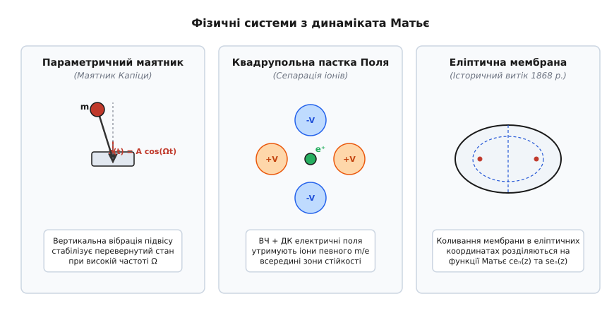
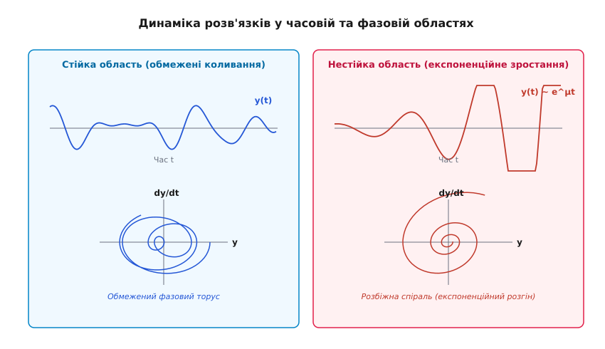
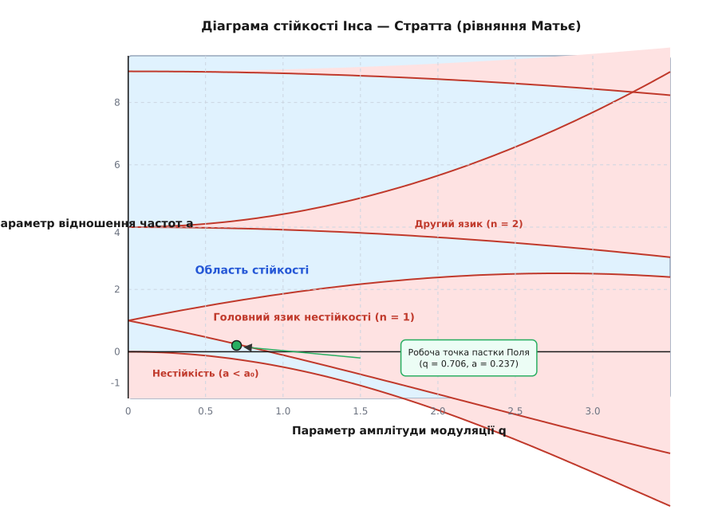

# Рівняння Матьє

<preknowlist>
- [Затухаючий осцилятор](root:ph-waves/damped-oscillator) — базові коливання системи з постійною жорсткістю та тертям.
- [Механічний резонанс та вимушені коливання](root:ph-waves/mechanical-resonance) — розгойдування системи під дією зовнішньої періодичної сили.
- [Фазовий портрет та лінеаризація систем](root:math-analysis/phase-portrait) — геометричне зображення траєкторій у просторі координата-швидкість.
- [Язики Арнольда](root:math-analysis/arnold-tongues) — клиноподібні області фазового захоплення у нелінійних осциляторах.
- [Осцилятор Даффінга та нелінійні коливання](root:math-analysis/duffing-oscillator) — нелінійні ефекти та ангармонічні коливання великої амплітуди.
</preknowlist>

Коли ми розгойдуємо ззвичайний годинниковий маятник або дитячу гойдалку, найпростіший і найвідоміший спосіб збільшити амплітуду — штовхати систему зовнішньою силою строго у фазі її руху. Це класичний вимушений резонанс, за якого зовнішнє джерело прикладає пряму синусоїдальну силу безпосередньо до маси. Проте існує принципово інший, значно підступніший та ефективніший спосіб розгойдування коливань: періодично змінювати не зовнішню силу, а внутрішні параметри самої системи — її жорсткість, довжину, момент інерції, ємність чи індуктивність. 

Дитина на гойдалці здатна розгонитися навіть без жодної сторонньої допомоги, якщо буде присідати й підводитися удвічі швидше за частоту власних коливань гойдалки. У мить максимального відхилення від центру дитина присідає (зменшуючи відстань від центру мас до осі обертання), а при проходженні нижньої точки рівноваги — підводиться. Підводячись у нижній точці, дитина виконує додаткову механічну роботу проти відцентрової сили та сили тяжіння, тим самим накачуючи додаткову енергію у систему кожні пів періоду.

Явище збудження коливань шляхом періодичної модуляції внутрішніх параметрів називається **параметричним резонансом**. Математичним еталоном та канонічною моделлю для опису будь-якого параметричного резонансу у фізиці, механіці, електроніці, гідродинаміці, оптиці та космології є **рівняння Матьє** — лінійне диференціальне рівняння второго порядку з періодичним косинусоїдальним коефіцієнтом.

## Параметричне розгойдування та фізична інтуїція

Щоб зрозуміти, як періодична зміна параметрів призводить до вибухового зростання коливань, розглянемо лінійний гармонічний осцилятор — масу `m` на пружині з власною жорсткістю `k_0`. За відсутності модуляції рівняння руху має добре відомий вигляд `m · (d²y/dt²) + k_0 · y = 0`, а його розв'язком є незатухаючі гармонічні коливання з власною частотою `ω_0 = √(k_0 / m)`.

Уявимо тепер, що жорсткість пружини періодично змінюється у часі за гармонічним законом під дією зовнішнього механізму:

```
k(t) = k_0 · (1 - h · cos(Ω·t))
```

де `h` — безрозмірна амплітуда модуляції жорсткості (`|h| < 1`), а `Ω` — частота параметричного збудження. Рівняння руху осцилятора набуває вигляду:

```
m · (d²y/dt²) + k_0 · (1 - h · cos(Ω·t)) · y = 0
```

Поділивши обидві частини на масу `m` та ввівши позначення власної частоти `ω_0² = k_0 / m`, отримуємо:

```
d²y/dt² + ω_0² · (1 - h · cos(Ω·t)) · y = 0
```

Це рівняння суттєво відрізняється від рівняння класичного вимушеного резонансу. У рівнянні вимушеного резонансу `d²y/dt² + ω_0²·y = (F_0/m)·cos(Ω·t)` зовнішнє збудження стоїть у правій частині як автономний член, повністю незалежний від відхилення `y`. У параметричному ж рівнянні модуляційний член `cos(Ω·t)` множиться безпосередньо на саму змінну `y`. Це має фундаментальний фізичний наслідок: за строго нульового початкового відхилення (`y(0) = 0` та `y'(0) = 0`) параметрична модуляція не здатна вивести систему зі стану спокою — на відміну від прямої сили, яка розгойдує систему навіть з нуля. Проте якщо система має хоча б найменше початкове флуктуаційне відхилення `y ≠ 0`, параметрична модуляція починає працювати як потужний підсилювач із параметричним зворотним зв'язком.

### Фізичний механізм передачі енергії

Розрахуємо механічну роботу, яку зовнішнє джерело модуляції здійснює над осцилятором за один період коливань. Повна енергія осцилятора складається з кінетичної та потенціальної: `E(t) = (m/2)·(dy/dt)² + (k(t)/2)·y²`. Диференціюючи енергію за часом з урахуванням рівняння руху, маємо:

```
dE/dt = m · (dy/dt) · (d²y/dt²) + k(t) · y · (dy/dt) + (1/2) · (dk/dt) · y²
      = (dy/dt) · [ m·(d²y/dt²) + k(t)·y ] + (1/2) · (dk/dt) · y²
```

Оскільки вираз у квадратних дужках дорівнює нулю в силу рівняння руху, швидкість зміни енергії системи визначається виключно похідною жорсткості:

```
dE/dt = (1/2) · (dk/dt) · y² = - (1/2) · k_0 · h · Ω · sin(Ω·t) · y²(t)
```

Звідси випливає ключовий висновок: якщо координата `y(t)` коливається з власною частотою `ω_0`, а жорсткість модулюється з подвоєною частотою `Ω ≈ 2·ω_0`, добуток `sin(2·ω_0·t) · y²(t)` після усереднення за період дає ненульову позитивну величину. Це означає, що при `Ω ≈ 2·ω_0` середня робота джерела модуляції є строго позитивною `⟨dE/dt⟩ > 0`, і енергія осцилятора зростає експоненційно з часом: `E(t) = E_0 · e^(2·μ·t)`.

### Зведення до канонічної форми Матьє

Щоб звести рівняння руху до стандартної математичної канонічної форми, зробимо безрозмірну заміну часової змінної. Введемо безрозмірний час `z = Ω·t / 2`. Диференціювання за часом `t` перераховується за ланцюговим правилом:

```
dy/dt = (dy/dz) · (dz/dt) = (Ω / 2) · (dy/dz)

d²y/dt² = (Ω / 2)² · (d²y/dz²)
```

Підставивши похідну второго порядку у рівняння руху, маємо:

```
(Ω / 2)² · (d²y/dz²) + ω_0² · (1 - h · cos(2·z)) · y = 0
```

Помноживши все рівняння на `4 / Ω²`, отримуємо канонічну форму **рівняння Матьє**:

```
d²y/dz² + (a - 2·q·cos(2·z)) · y = 0
```

де безрозмірні параметри `a` та `q` виражаються через фізичні характеристики системи наступним чином:

```
a = 4 · ω_0² / Ω² = (2 · ω_0 / Ω)²

q = 2 · h · ω_0² / Ω² = (h / 2) · a
```

Параметр `a` задає квадратичне відношення подвоєної власної частоти осцилятора `2·ω_0` до частоти модуляції `Ω`. Параметр `q` характеризує безрозмірну глибину модуляції жорсткості.

## Метод багатьох масштабів та аналітичний аналіз збурень

Для глибшого теоретичного розуміння того, як параметричний резонанс зароджується у разі малого параметра модуляції `h ≪ 1` (тобто `q ≪ 1`), застосуємо асимптотичний **метод багатьох масштабів** (англ. *Method of Multiple Scales*).

Введемо два незалежні часові масштаби:
* Швидкий час `T_0 = t`, який описує швидкі осциляції на власій частоті `ω_0`.
* Повільний час `T_1 = h · t`, який описує повільне експоненційне зростання або затухання амплітуди.

Повна похідна за часом розкладається за ланцюговим правилом: `d/dt = ∂/∂T_0 + h · (∂/∂T_1)`.

Розкладемо шукану функцію відхилення `y(t)` у степеневий ряд за малим параметром `h`:

```
y(t, h) = y_0(T_0, T_1) + h · y_1(T_0, T_1) + h² · y_2(T_0, T_1) + ...
```

Розглянемо випадок точної параметричної настройки `Ω = 2·ω_0 + h · σ`, де `σ` — параметр розстрочки частоти.

Підставляючи розклад у рівняння руху та збираючи члени при одинакових степенях `h`, у нулевому наближенні `O(h⁰)` отримуємо рівняння звичайного гармонічного осцилятора:

```
∂²y_0/∂T_0² + ω_0² · y_0 = 0
```

його загальний розв'язок записується у комплексній формі через повільно змінювану амплітуду `A(T_1)`:

```
y_0(T_0, T_1) = A(T_1) · e^(i·ω_0·T_0) + Ā(T_1) · e^(-i·ω_0·T_0)
```

У першому наближенні за малим параметром `O(h¹)` отримуємо рівняння для поправки `y_1`:

```
∂²y_1/∂T_0² + ω_0² · y_1 = - 2 · (∂²y_0 / (∂T_0 ∂T_1)) + ω_0² · cos(2·ω_0·T_0 + σ·T_1) · y_0
```

Підставляючи розв'язок нулевого наближення у праву частину та розкладаючи добуток косинуса на експоненту, ми виявляємо резонансні (секулярні) члени з частотою `e^(i·ω_0·T_0)`. Щоб розв'язок `y_1` залишався обмеженим і не містив розбіжних членів виду `T_0 · e^(i·ω_0·T_0)`, коефіцієнт при секулярній гармоніці мусить бути строго нульовим.

Ця умова усунення секулярних членів дає диференціальне рівняння для повільної амплітуди `A(T_1)`:

```
- 2·i·ω_0 · (dA/dT_1) + (ω_0² / 2) · Ā · e^(i·σ·T_1) = 0
```

Представляючи комплексну амплітуду у дійсній формі `A(T_1) = (1/2) · a(T_1) · e^(i·φ(T_1))`, ми отримуємо систему рівнянь для амплітуди `a` та фази `φ`:

```
da/dT_1 = (ω_0 / 4) · a · sin(2·φ - σ·T_1)

dφ/dT_1 = (ω_0 / 4) · cos(2·φ - σ·T_1)
```

Ввівши фазову різницю `ψ = 2·φ - σ·T_1`, отримуємо стаціонарні точки, які відповідають експоненційному зростанню `a(T_1) = a_0 · e^(μ·T_1)`. Інкремент зростання (показник Флоке) дорівнює:

```
μ = √ ( (ω_0 / 4)² - (σ / 2)² )
```

Цей результат демонструє два фундаментальні фізичні факти:
1. Максимальний інкремент розгону досягається при точній резонансній настройці `σ = 0` (`Ω = 2·ω_0`) і дорівнює `μ_max = h · ω_0 / 4`.
2. Параметричний резонанс виникає не лише при точній частоті, а у смузі розстрочки `|σ| < ω_0 / 2`, тобто у частотному інтервалі `2·ω_0 - h·ω_0 / 2 < Ω < 2·ω_0 + h·ω_0 / 2`. Саме ця смуга утворює перший клиноподібний язик на діаграмі Матьє.

## Історичні витоки та фізичні прояви

Рівняння Матьє вперше з'явилося 1868 року в роботах французького математика Еміля Матьє при розв'язуванні двовимірного хвильового рівняння для пружної еліптичної мембрани. Детальний аналіз хронології та розгалуження цієї історії — від акустики XIX століття до сучасних квантових іонних пасток — висвітлено у [історії відкриття рівняння Матьє та параметричного резонансу](root:math-analysis/mathieu-equation/hist-elliptic-membrane.md).


*Фізичні системи, чия динаміка описується рівнянням Матьє: маятник з вібрацією підвісу, квадрупольна пастка Поля та еліптична мембрана.*

Концептуальна універсальність рівняння Матьє полягає у тому, що воно виникає у найрізноманітніших галузях класичної та сучасної фізики.

### 1. Параметричний маятник та маятник Капіци

Розглянемо плоский маятник масою `m` та довжиною `l`, точка підвісу якого здійснює гармонічні вертикальні коливання за законом `z_0(t) = A · cos(Ω·t)`. У рухомій неінерційній системі відліку, прив'язаній до підвісу, на масу діє додаткова переносима сила інерції `F_in(t) = -m · (d²z_0/dt²) = m · A · Ω² · cos(Ω·t)`.

Ефективне прискорення вільного падіння стає періодично модульованим у часі:

```
g_eff(t) = g + A · Ω² · cos(Ω·t)
```

Точне нелінійне рівняння коливань кута відхилення `θ(t)` має вигляд:

```
d²θ/dt² + ( (g + A · Ω² · cos(Ω·t)) / l ) · sin(θ) = 0
```

Для малих відхилень поблизу нижнього стану рівноваги (`θ ≈ 0`) ми покладаємо `sin(θ) ≈ θ`. Позначивши власну частоту малих коливань `ω_0² = g / l` та зробивши заміну часу `z = Ω·t / 2`, ми отримуємо строго канонічне рівняння Матьє з параметрами:

```
a = 4 · g / (l · Ω²)

q = 2 · A / l
```

Коли частота вібрації підвісу наближається до подвоєної власної частоти `Ω ≈ 2·ω_0`, параметр `a ≈ 1`, і нижнє положення рівноваги втрачає стійкість: маятник самочинно розгойдується до великих кутів.

Ще дивовижнішим є поведінка маятника поблизу **перевернутого верхнього стану рівноваги** (`θ ≈ π`). У ззвичайних умовах верхній стан є нестійким сідлом у фазовому просторі. Проте якщо кут відхилення від верхньої точки позначити як `φ = θ - π`, то для малих `φ` маємо `sin(θ) = -sin(φ) ≈ -φ`. Рівняння руху набуває вигляду:

```
d²φ/dt² - ( (g + A · Ω² · cos(Ω·t)) / l ) · φ = 0
```

Це рівняння також зводиться до рівняння Матьє, але зі від'ємним базовим параметром `a = -4·g / (l·Ω²) < 0`. Завдяки високій частоті та належній амплітуді вібрації точка `(q, a)` може потрапити в одну з верхніх областей стійкості діаграми Матьє. Цей ефект, відкритий Петром Капіцею у 1951 році (**маятник Капіци**), демонструє, що швидка вібрація здатна створювати ефективний потенціальний жолоб, який стабілізує принципово нестійкі системи.

Використовуючи метод усереднення швидкозмінних змінних Боголюбова — Капіци, усереднений потенціал маятника поблизу верхньої точки можна подати у формі:

```
V_eff(φ) = m·g·l · (1 - cos(φ)) + (m · A² · Ω² / 4) · sin²(φ)
```

При виконанні умови `A² · Ω² > 2 · g · l` мінімум ефективного потенціалу розташований саме у точці `φ = 0` (перевернутий стан). Лінійний аналіз стійкості цього стану строго збігається з першою зоною стійкості діаграми Матьє.

### 2. Квадрупольна іонна пастка Поля

У атомній фізиці та квантових обчисленнях виникає задача утримання окремих заряджених іонів у обмеженому об'ємі вакуумної камери за допомогою електричних полів. Оскільки теорема Ірншоу забороняє існування стійкого мінімуму потенціалу у статичному електростатичному полі, Вольфганг Поль запропонував використовувати квадрупольне електричне поле, яке поєднує постійну напругу `V_dc` та високочастотну змінну напругу `V_ac · cos(Ω·t)`.

Потенціал електричного поля у квадрупольній пастці має вигляд:

```
V(x, y, z, t) = (V_dc + V_ac · cos(Ω·t)) · (x² + y² - 2·z²) / r_0²
```

Рівняння руху іона маси `m` та заряду `e` вздовж координати `x` записується через силу Лоренца:

```
m · (d²x/dt²) = -e · (∂V/∂x) = - (2·e / r_0²) · (V_dc + V_ac · cos(Ω·t)) · x
```

Здійснюючи заміну часу `z = Ω·t / 2`, отримуємо рівняння Матьє для координати `x(t)`:

```
d²x/dz² + (a_x - 2·q_x · cos(2·z)) · x = 0
```

де безрозмірні параметри Поля дорівнюють:

```
a_x = 8 · e · V_dc / (m · r_0² · Ω²)

q_x = 4 · e · V_ac / (m · r_0² · Ω²)
```

Рівняння для координати `z(t)` має аналогічний вигляд, але через коефіцієнт `-2` у потенціалі параметри мають протилежний знак: `a_z = -2·a_x` та `q_z = -2·q_x`.

Іон залишається у пастці тоді й лише тоді, коли **одночасно** координати `x(t)`, `y(t)` та `z(t)` лежать у зоні стійкості рівняння Матьє. Оскільки параметри `a` та `q` обернено пропорційні масі `m`, квадрупольна пастка працює як надточний мас-спектрометр: налаштовуючи напруги `V_dc` та `V_ac`, можна досягти того, щоб у пастці утримувалися лише іони з конкретним відношенням маси до заряду `m / e`, тоді як іони інших мас потрапляють у нестійкі язики й миттєво викидаються на електроди.

Рух іона у пастці складається з двох компонент: повільного макроколивання (секулярного руху з частотою `ω_sec = (Ω / 2) · √(a + q²/2)`) та швидкого мікроколивання на частоті поля `Ω`.

> 🔧 **Навіщо це.**
> Розрахунок параметрів рівняння Матьє є основою проектування квадрупольних мас-спектрометрів, атомних годинників та квантових процесорів на замкнених іонах. Без стабілізації робочої точки `(q, a)` у першій зоні Матьє неможливо утримати кубіти в квантовому регістрі від термодинамічного розлітання.

### 3. Поверхневі хвилі Фарадея у рідинах

Коли плоский шар рідини густиною `ρ` та коефіцієнтом поверхневого натягу `σ` піддається вертикальним вібраціям із прискоренням `a_z(t) = a_0 · cos(Ω·t)`, ефективне прискорення вільного падіння стає модульованим `g(t) = g + a_0 · cos(Ω·t)`.

Дисперсійне співвідношення для поверхневих гравітаційно-капілярних хвиль із хвильовим вектором `k` у шарі глибиною `h` має вигляд:

```
ω_0²(k) = (g · k + (σ / ρ) · k³) · th(k·h)
```

Малі збурення поверхні `ζ_k(t)` для кожної просторової моди `k` строго задовольняють рівняння Матьє:

```
d²ζ_k/dt² + ω_0²(k) · (1 + (a_0 / g) · cos(Ω·t)) · ζ_k = 0
```

При досягненні порогового прискорення вібрації `a_0 > a_crit` на вільній поверхні рідини самочинно виникають впорядковані стоячі хвилі (структури Фарадея — квадрати, смуги або гексагони), які коливаються на субгармонічній частоті `ω_wave = Ω / 2`.

### 4. Електронні LC-контури та варакторні підсилювачі

Параметричний резонанс відіграє фундаментальну роль в радіотехніці та надвисокочастотній електроніці. У паралельному або послідовному LC-контурі ємність конденсатора можна модулювати подачею змінної напруги на напівпровідниковий варактор (варікап): `C(t) = C_0 / (1 - h · cos(Ω·t))`.

Рівняння для електричного заряду `Q(t)` на обкладках конденсатора з урахуванням активного опору `R` та індуктивності `L` має вигляд:

```
L · (d²Q/dt²) + R · (dQ/dt) + (1 / C(t)) · Q = 0
```

Це рівняння строго зводиться до рівняння Матьє із тертям. Зсув ємності на подвоєній резонансній частоті `Ω = 2 / √(L·C_0)` викликає генерацію електричних коливань та параметричне підсилення вхідного радіосигналу з екстремально низьким рівнем власних теплових шумів. Це лежить в основі малошумливих параметричних підсилювачів (параметронів) для радіоастрономії та дальнього космічного зв'язку.

### 5. Орбіти лібрації у небесній механіці

У небесній механіці при аналізі руху штучних супутників або астероїдів поблизу точок лібрації Лагранжа `L_1, L_2, L_3` у обмеженій задачі трьох тіл (наприклад, у системі Земля — Місяць або Сонце — Земля) гравітаційний потенціал головного тіла модулюється ексцентриситетом орбіти другорядного тіла. Лінеаризовані рівняння відносного руху супутника вздовж відхилень від точки лібрації зводяться до рівнянь типу Матьє та Гілла. Стійкість німб-орбіт (англ. *Halo orbits*) та орбіт Ліссажу довкола точок `L_1/L_2`, на яких розташовано сучасні космічні обсерваторії (такі як телескоп «Джеймс Вебб»), обчислюється саме через діаграми стійкості Матьє.

### 6. Мікроелектромеханічні параметричні резонатори (MEMS)

У сучасній мікросистемній техніці (MEMS) параметричний резонанс застосовується для створення високоточних датчиків кутової швидкості (гіроскопів) та високочастотних фільтрів. У MEMS-резонаторі жорсткість кремнієвого підвісу модулюється зміною ємності електростатичних гребінчастих приводів при подачі змінної напруги `V(t) = V_dc + V_ac · cos(Ω·t)`. Параметричне підкачування дозволяє компенсувати внутрішнє механічне затухання матеріалу й підвищити добротність резонатора у 10–100 разів без використання складних активних підсилювачів.

### 7. Параметричні квантові підсилювачі та фотоніка

У сучасній квантовій фізиці надпровідних кубітів рівняння Матьє описує роботу джозефсонівських параметричних підсилювачів (JPA, англ. *Josephson Parametric Amplifier*). Індуктивність джозефсонівського контакту залежить від магнітного потоку `L(Ф) = L_0 / cos(2·π·Ф / Ф_0)`. Подача змінного магнітного поля підкачки модулює індуктивність контуру на подвоєній частоті, викликаючи параметричне підсилення квантових сигналів з рівнем шумів на квантовій межі Гейзенберга.

## Вплив дисипативного тертя на межі стійкості

У реальних механічних та радіотехнічних системах завжди присутнє в'язке тертя або активний омічний опір. Розглянемо рівняння Матьє з лінійним тертям:

```
d²y/dt² + 2·γ · (dy/dt) + ω_0² · (1 - h · cos(Ω·t)) · y = 0
```

За допомогою стандартної заміни змінної `y(t) = u(t) · e^(-γ·t)` терм з першою похідною повністю усувається. Рівняння для функції `u(t)` набуває канонічного вигляду рівняння Матьє зі зміщеною власною частотою `ω_d² = ω_0² - γ²`:

```
d²u/dt² + ( ω_0² - γ² - h · ω_0² · cos(Ω·t) ) · u = 0
```

Оскільки зв'язок між амплітудами вихідної та перетвореної систем є `y(t) = u(t) · e^(-γ·t)`, амплітуда `y(t)` буде зростати лише тоді, коли показник Флоке функції `u(t)` перевищує коефіцієнт затухання: `Re(μ_u) > γ`.

Це дає фундаментальний фізичний критерій виникнення параметричного резонансу у дисипативній системі:
1. Для збудження параметричного резонансу на частоті `Ω ≈ 2·ω_0` глибина модуляції `h` повинна перевищити порогове значення:
   ```
   h > h_crit = 4 · γ / ω_0 = 2 / Q
   ```
   де `Q = ω_0 / (2·γ)` — добротність осцилятора.
2. При наявності тертя вершини язиків нестійкості на діаграмі Інса — Стратта більше не торкаються осі `q = 0`, а відриваються від неї й піднімаються вгору на величину порогового значення `q_crit`. Якщо добротність системи мала (`Q < 2`), параметричний резонанс взагалі стає неможливим за малих амплітуд модуляції.

## Математична структура та теорія Флоке

Оскільки рівняння Матьє є диференціальним рівнянням второго порядку з неперервними `π`-періодичними коефіцієнтами, його загальні розв'язки описуються **теоремою Флоке**.

Згідно з теорією Флоке, фундаментальна система розв'язків лінійного періодичного рівняння подається у формі:

```
y_1(z) = e^(μ·z) · P_1(z)

y_2(z) = e^(-μ·z) · P_2(z)
```

де `P_1(z)` та `P_2(z)` є періодичними функціями з періодом `π`, а `μ` — **характеристичним показником Флоке** (англ. *Floquet characteristic exponent*).

Детальний математичний апарат теорії Флоке, матриці монодромії та виведення тридіагональних ланцюгових дробів наведено у [математичному аналізі рівняння Матьє та теорії Флоке](root:math-analysis/mathieu-equation/math-floquet-diagram.md).


*Динаміка розв'язків рівняння Матьє у часі та фазовому просторі: порівняння стійкого обмеженого тора та нестійкого експоненційного розгону.*

Характер розв'язків повністю визначається комплексним значенням показника `μ = α + i·ν`:

1. **Стійкий режим (`α = 0`, `μ = i·ν` — чисто уявне число):** Показник `e^(i·ν·z)` є обмеженою осцилюючою функцією. Загальний розв'язок є квазіперіодичним і обмеженим за амплітудою для всіх `z ∈ [0, ∞)`. У фазовому просторі `(y, dy/dz)` траєкторія утворює замкнений або щільний фазовий торус.
2. **Нестійкий режим (`α = Re(μ) > 0` — дійсне або комплексне число з позитивною дійсною частиною):** Множник `e^(α·z)` монотонно прямує до нескінченності при `z -> ∞`. Навіть найменше початкове збурення викликає експоненційно зростаючі коливання. У фазовому просторі траєкторія утворює розбіжну спіраль, що тікає на нескінченність.
3. **Межевий режим (`μ = 0` або `μ = i·k`):** Розв'язки є строго періодичними з періодом `π` або `2·π`. Вони формують межі між областями стійкості й нестійкості у просторі параметрів.

### Монодромія та зв'язок із властивостями матриць

Розглянемо фундаментальну матрицю `Φ(z)` з початковою умовою `Φ(0) = I`. Матриця монодромії `M = Φ(π)` обчислюється шляхом чисельного або аналітичного інтегрування двох базових станів `[1, 0]ᵀ` та `[0, 1]ᵀ` за один період `π`.

Характеристичний член `det(M - λ·I) = 0` зводиться до рівняння `λ² - Tr(M)·λ + 1 = 0`. Власні значення матриці монодромії `λ_1, λ_2` пов'язані з показником Флоке співвідношенням `λ = e^(μ·π)`.

Аналіз півсліду `D = Tr(M) / 2` дає строгий математичний критерій стійкості:
* `|D| < 1` ⇒ `λ_{1,2}` є комплексно-спряженими на одиничному колі `|λ| = 1`. Система є стійкою.
* `|D| > 1` ⇒ `λ_1` та `λ_2` є дійсними числами, причому одне `|λ_1| > 1`. Система є нестійкою.
* `|D| = 1` ⇒ `λ = ±1`. Система перебуває на критичній межі стійкості.

## Діаграма стійкості Інса — Стратта

Площина параметрів `(q, a)` рівняння Матьє розбивається на безкінечну мережу чергованих областей стійкості та нестійкості. Ця карта називається **діаграмою Інса — Стратта** (англ. *Ince-Strutt diagram*).


*Діаграма стійкості Інса — Стратта у просторі параметрів (q, a): клиноподібні язики нестійкості та області стійкого утримання.*

### Аналіз геометрії діаграми:

1. **Базові точки на осі `q = 0`:** Коли глибина модуляції дорівнює нулю (`q = 0`), рівняння Матьє перетворюється на звичайний гармонічний осцилятор `d²y/dz² + a·y = 0`.
   * При `a > 0` розв'язки є стійкими осциляціями `cos(√a · z)`.
   * При `a < 0` розв'язки є нестійкими гіперболічними функціями `exp(√|a| · z)`.
   * Точки `a = n²` (де `n = 0, 1, 2, 3, ...`) є вершинами, з яких при зростанні `q > 0` розгалужуються **язики нестійкості**.

2. **Головний язик нестійкості (`n = 1`, `a ≈ 1`):** Це найширша та найнебезпечніша область параметричного резонансу. Вона виходить з точки `a = 1` (що відповідає частоті модуляції `Ω = 2·ω_0`). Межі цього язика описуються кривими `b_1(q)` (нижня межа) та `a_1(q)` (верхня межа).
   При малих `q ≪ 1` асимптотичні розклади меж мають вигляд:
   ```
   b_1(q) = 1 - q - q²/8 + q³/64 - q⁴/1536 + O(q⁵)

   a_1(q) = 1 + q - q²/8 - q³/64 - q⁴/1536 + O(q⁵)
   ```
   Ширина головного язика розраховується як різниця верхньої та нижньої меж:
   ```
   Δa = a_1(q) - b_1(q) = 2·q - q³/32 + O(q⁵)
   ```
   Звідси видно, що ширина головної зони нестійкості зростає **лінійно** за амплітудою модуляції `q`.

3. **Другий язик нестійкості (`n = 2`, `a ≈ 4`):** Виходить з точки `a = 4` (що відповідає частоті модуляції `Ω = ω_0`). Межі описуються формулами:
   ```
   b_2(q) = 4 - q²/12 + 5·q⁴/13824 + O(q⁶)

   a_2(q) = 4 + 5·q²/12 - 11·q⁴/13824 + O(q⁶)
   ```
   Ширина другого язика дорівнює `Δa = (5/6)·q² + O(q⁴)`. Вона є **квадратичною** за `q`, тому за малого збудження другий язик значно вужчий за перший.

4. **Третій язик нестійкості (`n = 3`, `a ≈ 9`):** Виходить з точки `a = 9` (частота модуляції `Ω = (2/3)·ω_0`). Його ширина є **кубічною** за амплітудою збудження: `Δa = (1/8)·q³ + O(q⁵)`.

5. **Асимптотика великих q (метод Стратта):** При дуже великих значеннях параметра модуляції `q ≫ 1` межеві власні значення `a_n(q)` задовольняють асимптотичну формулу Стратта:
   ```
   a_n(q) ~ -2·q + 2·(2n + 1)·√q - (2n² + 2n + 1) / 8 + O(q^(-1/2))
   ```
   У цій границі потенціальні колодязі синусоїдального потенціалу `V(z) = -2·q·cos(2·z)` стають дуже глибокими, а енергетичні рівні усередині колодязів зводяться до рівнів квазікласичного гармонічного осцилятора.

### Аналогія з фізикою твердого тіла та зонною теорією

Існує фундаментальна математична еквівалентність між рівнянням Матьє та одновимірним рівнянням Шредінгера для електрона у періодичному кристаллічному потенціалі (модель Кроніга — Пенні або оптичні решітки). Замінивши `z` на просторову координату `x`, рівняння Матьє перетворюється на рівняння Шредінгера з синусоїдальним потенціалом `V(x) = 2·q·cos(2·x)`.

У цій аналогії:
* **Стійкі області** діаграми Інса — Стратта відповідають **дозволеним енергетичним зонам** електронів у кристалі (де хвильова функція є квантовою хвилею Блоха з обмеженою амплітудою).
* **Нестійкі язики** відповідають **забороненим енергетичним зонам (щелинам)**, у яких електронні хвилі згасають або відбиваються Бреггівським віддзеркаленням.

Цей зв'язок активно використовується у фотоніці — при створенні фотонних кристалів та оптичних хвилеводів з періодично модульованим показником заломлення.

## Спектральний метод визначників Гілла

Для точного розрахунку власного значення `a` при довільному `q` без застосування інтегрування у часі застосовується метод **визначників Гілла**.

Підставивши розклад розв'язку у ряд Фур'є `y(z) = ∑_{k=-∞}^∞ c_k · e^(i·(ν + 2k)·z)` у рівняння Матьє, отримуємо нескінченну тридіагональну систему лінійних алгебраїчних рівнянь для коефіцієнтів `c_k`:

```
- q · c_{k-1} + ( (ν + 2k)² - a ) · c_k - q · c_{k+1} = 0
```

Поділивши кожне `k`-те рівняння на `(ν + 2k)² - a`, отримуємо нескінченну матрицю Гілла `H(a, q, ν)`. Точна умова існування ненульового векторного розв'язку полягає у дорівнюванні нулю нескінченного визначника `det(H) = 0`.

Метод Гілла дозволяє обчислити характеристичний показник `ν` через елементарне співвідношення:

```
sin²(π·ν / 2) = Δ(0) · sin²(π·√a / 2)
```

де `Δ(0)` — знормований визначник Гілла при `ν = 0`. Для обчислень визначник усікається до скінченного розміру `(2N + 1) × (2N + 1)`. При `N = 15` метод забезпечує точність у 16 значущих цифр для будь-яких `q < 20`, що робить його еталонним алгоритмом у комп'ютерній алгебрі.

## Функції Матьє `ce_r(z, q)` та `se_r(z, q)`

На самих межах областей стійкості (тобто строго на кривих `a_n(q)` та `b_n(q)`) розв'язками рівняння є власні періодичні функції — **функції Матьє**:

* **Парні функції Матьє `ce_n(z, q)`** (абревіатура від *cosine-elliptic*): відповідають власним значенням `a = a_n(q)` і мають розклад Фур'є за косинусами:
  ```
  ce_2n(z, q) = ∑_{k=0}^∞ A_{2k}^(2n) · cos(2k·z)

  ce_2n+1(z, q) = ∑_{k=0}^∞ A_{2k+1}^(2n+1) · cos((2k+1)·z)
  ```

* **Непарні функції Матьє `se_n(z, q)`** (абревіатура від *sine-elliptic*): відповідають власним значенням `a = b_n(q)` і мають розклад Фур'є за синусами:
  ```
  se_2n(z, q) = ∑_{k=0}^∞ B_{2k}^(2n) · sin(2k·z)

  se_2n+1(z, q) = ∑_{k=0}^∞ B_{2k+1}^(2n+1) · sin((2k+1)·z)
  ```

Ці функції утворюють ортогональний базис на інтервалі `z ∈ [0, 2π]`:

```
∫₀²ᵖⁿ ce_n(z, q) · ce_m(z, q) dz = π · δ_{nm}

∫₀²ᵖⁿ se_n(z, q) · se_m(z, q) dz = π · δ_{nm}
```

Радіальні функції Матьє `Ce_n(ξ, q)` та `Se_n(ξ, q)`, необхідні для опису радіального розподілу хвильового поля в еліптичних циліндрах та еліптичних оптичних світловодах, отримуються заміною дійсного аргументу `z` на комплексний `i·ξ` або через ряди добутків функцій Бесселя:

```
Ce_2n(ξ, q) = (ce_2n(0, q) / A_0) · ∑_{k=0}^∞ (-1)^k · A_{2k} · J_k(√q · e^(-ξ)) · J_k(√q · e^ξ)
```

Вони відіграють у координатах еліпса таку саму фундаментальну роль, яку тригонометричні функції виконують у декартових координатах, а функції Бесселя — у полярних.

## Нелінійне обмеження та рівняння Дюффінга — Матьє

У будь-якому лінійному диференціальному рівнянні параметричний резонанс викликає необмежене експоненційне зростання амплітуди `y(t) ∼ e^(μ·t)`. Проте в реальних механічних та фізичних системах амплітуда коливань не може прямувати до нескінченності: при великих відхиленнях починають діяти нелінійні відновлювальні сили (наприклад, геометрична нелінійність кута маятника `sin(θ) ≈ θ - θ³/6` або нелінійність пружності матеріалу) та дисипативне тертя.

Типовою моделлю, що описує реальну поведінку параметричного осцилятора з урахуванням нелінійності та тертя, є **рівняння Дюффінга — Матьє**:

```
d²y/dt² + γ · (dy/dt) + ω_0² · (1 - h · cos(Ω·t)) · y + β · y³ = 0
```

де `γ > 0` — коефіцієнт лінійного в'язкого тертя, а `β > 0` — коефіцієнт кубічної нелінійності жорсткості.

### Фізичні наслідки нелінійності:

1. **Поріг збудження через тертя:** В'язке тертя `γ` створює енергетичні втрати. Для виникнення параметричного резонансу амплітуда модуляції `h` повинна перевищити порогове значення `h_crit ≈ 2·γ / ω_0`. Якщо `h < h_crit`, тертя повністю гасить параметричне підкачування, і система залишається у стані спокою.
2. **Насичення та граничні цикли:** Кубічна нелінійність `β·y³` змінює ефективну власну частоту осцилятора залежно від амплітуди коливань `A`: `ω_eff(A) ≈ ω_0 + (3·β / (8·ω_0)) · A²`. У результаті при зростанні амплітуди ефективна частота зсувається за межі язика нестійкості Матьє. Експоненційне зростання припиняється, і система виходить на стійкий нелінійний **граничний цикл** з амплітудою:
   ```
   A_limit ≈ √ ( (8·ω_0 / (3·β)) · (h·ω_0 / 2 - γ) )
   ```
3. **Гістерезис та стрибки:** Нелінійний зсув частоти нахиляє резонансну криву вбік більших частот (жорстка нелінійність `β > 0`), викликаючи ефект гістерезису й двостабільності (англ. *bifurcation hysteresis*), подібний до осцилятора Даффінга.

## Чисельне інтегрування та алгоритми розрахунку

Для чисельного розрахунку карти стійкості та траєкторій рівняння Матьє застосовується метод інтегрування матриці монодромії за допомогою алгоритму Рунге — Кутти 4-го порядку (RK4).

Опис алгоритму, робочий код мовами C та C++ у форматі порівняльних вкладок наведено у [чисельному інтегруванні рівняння Матьє та побудові діаграми стійкості](root:math-analysis/mathieu-equation/proj-mathieu-solver.md).

Для інтеграції чисельного розв'язувача у сторонні фізичні симулятори та програмні комплекси розроблено специфікацію C/C++ бібліотеки, детальну документацію якої викладено у [інтерфейсі та API бібліотеки чисельного розв'язувача рівняння Матьє](root:math-analysis/mathieu-equation/api-mathieu-solver.md).

## Підсумковий синтез

Рівняння Матьє дає строгий математичний ключ до розуміння того, як періодична зміна параметрів здатна кардинально змінювати стійкість диференціальних систем. Від астрофізики та акустики еліптичних мембран до іонних квантових комп'ютерів та стабілізації перевернутих маятників — діаграма Інса — Стратта виступає універсальною картою, що розділяє області стійкого утримання та експоненційного розгону коливань.
