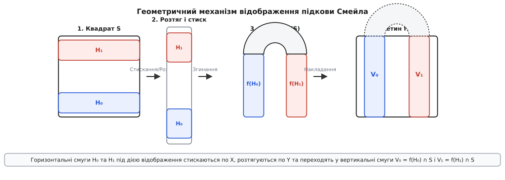
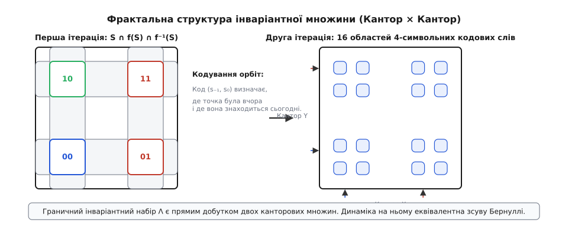
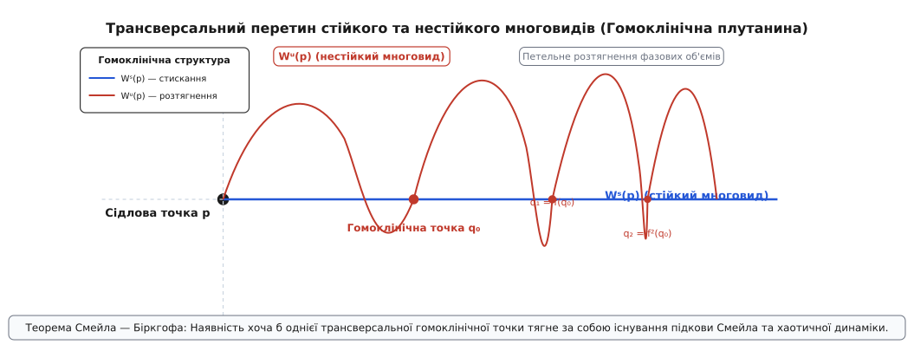

# Підкова Смейла

<preknowlist>
- [Відображення Пуанкаре](root:math-analysis/poincare-map) — січний перетин неперервного фазового потоку автономної або періодичної диференціальної системи.
- [Множина Кантора](root:math-analysis/cantor-set) — фрактальна досконала ніде не щільна множина нульової міри Лебега.
- [Показники Ляпунова](root:math-analysis/lyapunov-exponent) — кількісна міра середньої експоненційної швидкості розходження близьких фазових траєкторій.
</preknowlist>

У класичній детермінованій механіці тривалий час панувало переконання, що непередбачувана, квазівипадкова поведінка фізичної системи є наслідком або її надзвичайної складності (великої кількості ступенів вільності, як у термодинаміці), або зовнішнього випадкового шуму. Якщо ж система описується простими рівняннями руху Ньютона, Лагранжа чи Гамільтона з кількома ступенями вільності, вважалося, що її фазові траєкторії мають бути впорядкованими та регулярними. Поява комп'ютерного моделювання та аналізу нелінійних осциляторів зламала цю парадигму: виявилося, що навіть прості двовимірні дискретні відображення можуть генерувати справжній, математично нездоланний хаос.

Геометричний механізм підкови Смейла (Smale's horseshoe map), запропонований видатним американським математиком Стівеном Смейлом у 1960 році, став першим суворим математичним доказом того, як складний хаотичний рух виникає з чисто геометричного перетворення. Смейл показав, що простий двовимірний процес — стискання прямокутника в одному напрямку, розтягування в іншому, згинання в дугу та накладання на початкову область — неминуче породжує нескінченну кількість періодичних та неперіодичних орбіт із чутливістю до початкових умов. Цей механізм став фундаментальною цеглиною сучасної теорії динамічних систем, підтвердивши існування грубого (структурно стійкого) хаосу у фізиці.

## Передумови та геометрична конструкція відображення

У багатьох фізичних задачах — від вимушеного коливання маятника до руху астероїдів у резонансній зоні — аналіз неперервного фазового простору зводиться до дискретного відображення площини на себе через перетин Пуанкаре. Замість стеження за неперервною траєкторією в часі ми фіксуємо точки перетину фазової кривої із січною гіперповерхнею через кожен період зовнішнього збурення `T`.

Розглянемо замкнений одиничний квадрат `S = [0, 1] × [0, 1]` у двовимірному фазовому просторі з координатами `(x, y)`. Відображення Смейла `f: S → R²` діє на цей квадрат за чотири послідовні геометричні кроки:

1. **Горизонтальне стискання:** квадрат стискається вздовж осі `X` у `1 / α` разів (де параметр стиску задовольняє умову `0 < α < 1/2`), перетворюючись на тонку вертикальну смужку шириною `α`.
2. **Вертикальне розтягування:** отримана смужка розтягується вздовж осі `Y` у `β` разів (де параметр розтягу задовольняє умову `β > 2`), утворюючи довгий вузький прямокутник довжиною `β` та шириною `α`.
3. **Згинання в підкову:** довгий прямокутник згинається у формі літери `U` (підкови).
4. **Накладання на початковий квадрат:** зігнута підкова знову накладається на вихідну область `S` так, щоб дві її вертикальні гілки повністю перетинали квадрат `S` від нижньої до верхньої межі, а заокруглений купол підкови виходив за межі квадрата.


*Схема геометричних перетворень підкови Смейла: стискання квадрата по горизонталі, розтягування по вертикалі, згинання в дугу та накладання на початкову область.*

У результаті цього перетворення квадрат `S` перетинається зі своїм образом `f(S)` у двох вертикальних смугах, які позначаються як `V₀` та `V₁`. Відповідно, у вихідному квадраті `S` існують дві горизонтальні смуги `H₀` та `H₁`, які під дією відображення `f` переходять саме у ці вертикальні смуги:

```
f(H₀) = V₀      [нижня горизонтальна смуга H₀ переходить у ліву вертикальну V₀]
f(H₁) = V₁      [верхня горизонтальна смуга H₁ переходить у праву вертикальну V₁ з поворотом]
```

Точки квадрата `S`, які не належать смугам `H₀` та `H₁`, під дією відображення `f` потрапляють у купол підкови поза квадратом `S` і при подальших ітераціях навжди залишають область `S`. Таким чином, лише точки з об'єднання `H₀ ∪ H₁` залишаються всередині квадрата після першого кроку у прямій динаміці.

Для глибшого розуміння історію виникнення цієї концепції можна переглянути у матеріалі про [історію створення та розробки теми підкови Смейла](root:math-analysis/smale-horseshoe/hist-smale-horseshoe.md).

## Аналітичне формулювання відображення

Щоб перейти від наочної геометрії до суворого математичного аналізу, задамо відображення `f` явними аналітичними формулами на двох горизонтальних смугах `H₀` та `H₁`.

Нехай горизонтальні смуги визначаються інтервалами координат:

```
H₀ = [0, 1] × [0, α]           [нижня смуга висотою α]
H₁ = [0, 1] × [1 - α, 1]       [верхня смуга висотою α]
```

де `0 < α < 1/2`. Проміжок `(α, 1 - α)` між смугами відображається у купол підкови поза квадратом `S`.

Дія відображення `f(x, y) = (x', y')` на смузі `H₀` задається афінним перетворенням:

```
x' = α · x
y' = β · y
```

де `β > 2`. Бачимо, що координата `x` стискається у `1/α` разів, а координата `y` розтягується у `β` разів.

На верхній смузі `H₁` відображення не лише стискає та розтягує, але й повертає область на 180 градусів через згинання підкови:

```
x' = 1 - α · x
y' = β · (1 - y)
```

Зворотне відображення `f⁻¹(x, y) = (x'', y'')` визначено на вертикальних смугах `V₀ = [0, α] × [0, 1]` та `V₁ = [1 - α, 1] × [0, 1]`:

```
Для (x, y) ∈ V₀:
x'' = (1 / α) · x
y'' = (1 / β) · y

Для (x, y) ∈ V₁:
x'' = (1 / α) · (1 - x)
y'' = 1 - (1 / β) · y
```

Матриця Якобі `Df(x, y)` для точки з `H₀` має простий діагональний вигляд:

```
Df(x, y) = [ α   0 ]
           [ 0   β ]
```

А для точки з `H₁`:

```
Df(x, y) = [ -α    0 ]
           [  0   -β ]
```

У двох випадках модуль детермінанта Якобі становить `|det Df| = α · β`. Якщо `α · β < 1`, відображення є стискальним за площею (дисипативним), а якщо `α · β = 1` — воно зберігає двовимірну площу (консервативне гамільтонове відображення).

## Інваріантна множина та фрактальна структура Кантора

Оскільки нас цікавить довготривала фізична динаміка системи, необхідно знайти множину точок `Λ`, які **ніколи** не залишають квадрат `S` ні при прямуванні часу в майбутнє (`n → +∞`), ні при прямуванні часу в минуле (`n → -∞`). Формально інваріантна множина `Λ` визначається як перетин усіх прямих та зворотних образів квадрата:

```
Λ = ⋂_{n = -∞}^{+∞} fⁿ(S)
```

Щоб зрозуміти геометричну будову множини `Λ`, розглянемо пряму та зворотну динаміку окремо.

### Пряма динаміка та вертикальні смуги

Після першої ітерації `f(S) ∩ S` ми отримуємо 2 вертикальні смуги `V₀` та `V₁` шириною `α`. На другому кроці `f²(S) ∩ S` кожна з цих смуг піддається тому самому стисканню, розтягуванню та згинанню. У результаті виникає `2² = 4` тонших вертикальних смуги шириною `α²`.

Після `n` прямих ітерацій область `fⁿ(S) ∩ S` складається з `2ⁿ` вертикальних смуг шириною `αⁿ`. У границі при `n → +∞` перетин усіх прямих образів дає множину вертикальних відрізків, горизонтальні координати яких утворюють класичну [множину Кантора](root:math-analysis/cantor-set) `K_x` на відрізку `[0, 1]`.

### Зворотна динаміка та горизонтальні смуги

Якщо ми розглянемо зворотне відображення `f⁻¹`, то ролі осей `X` та `Y` міняються місцями. Зворотний образ `f⁻¹(S) ∩ S` дає 2 горизонтальні смуги `H₀` та `H₁` висотою `1 / β`. 

При `n` зворотних ітераціях `f⁻ⁿ(S) ∩ S` ми отримуємо `2ⁿ` горизонтальних смуг висотою `β⁻ⁿ`. У границі при `n → +∞` цей перетин дає множину горизонтальних відрізків, вертикальні координати яких утворюють іншу канторову множину `K_y`.

### Структура граничної множини

Повний інваріантний набір `Λ` є результатом перетину всіх вертикальних та горизонтальних смуг усередині квадрата `S`:

```
Λ = (⋂_{n=1}^{∞} fⁿ(S)) ∩ (⋂_{n=0}^{∞} f⁻ⁿ(S)) = K_x × K_y
```


*Утворення фрактальної множини Кантора в результаті перетину прямих вертикальних та зворотних горизонтальних смуг.*

Отже, інваріантна множина `Λ` підкови Смейла є двовимірним фракталом — прямим добутком двох канторових множин. Вона містить незліченну кількість точок, але має нульову двовимірну міру Лебега (площу). Фрактальна Hausdorff-вимірність `d_H` множини `Λ` обчислюється як сума вимірностей складових канторових множин:

```
d_H(K_x) = ln 2 / ln(1 / α)      [вимірність Кантора по горизонталі]
d_H(K_y) = ln 2 / ln β           [вимірність Кантора по вертикалі]
d_H(Λ) = d_H(K_x) + d_H(K_y) = (ln 2 / ln(1 / α)) + (ln 2 / ln β)
```

## Вужчі смуги та ієрархія підінтервалів

Розглянемо докладніше, як саме формуються підсмуги вищих порядків. Нехай `H_{s_0 s_1 ... s_k}` позначає горизонтальну смугу точок, які при перших `k+1` зворотних ітераціях відвідують послідовність смуг `H_{s_0}, H_{s_1}, ..., H_{s_k}`.

Висота такої підсмуги обчислюється за формулою:

```
h(H_{s_0 s_1 ... s_k}) = α · β⁻ᵏ      [висота смуги зменшується експоненційно з ростом k]
```

Аналогічно, ширина вертикальної підсмуги `V_{s_{-m} ... s_{-1} s_0}` точок, які при прямих ітераціях відвідують смуги `H_{s_{-m}}, ..., H_{s_0}`, становить:

```
w(V_{s_{-m} ... s_{-1} s_0}) = αᵐ⁺¹   [ширина смуги зменшується експоненційно з ростом m]
```

Перетин однієї вертикальної смуги порядку `m` та однієї горизонтальної смуги порядку `k` утворює прямокутник розміром `αᵐ⁺¹ × (α · β⁻ᵏ)`. У границі при `m → ∞` та `k → ∞` кожен такий прямокутник стягується до єдиної точки `p ∈ Λ`.

## Символічна динаміка та кодування орбіт

Найпотужнішим інструментом аналізу руху на інваріантній множині `Λ` є **символічна динаміка**. Вона дає змогу замінити неперервні геометричні координати точки `p ∈ Λ` нескінченною у обидва боки послідовністю символів із двійкового алфавіту `{0, 1}`.

Для будь-якої точки `p ∈ Λ` та будь-якого цілого числа `k ∈ Z` точка `fᵏ(p)` знаходиться всередині квадрата `S`. Оскільки `S ∩ f⁻¹(S) = H₀ ∪ H₁`, точка `fᵏ(p)` обов'язково потрапляє або в смугу `H₀`, або в смугу `H₁`.

Призначимо кожному моменту часу `k` двозначний символ `s_k`:

```
s_k = 0,  якщо fᵏ(p) ∈ H₀
s_k = 1,  якщо fᵏ(p) ∈ H₁
```

У результаті кожній точці `p ∈ Λ` ставиться у відповідність двостороння нескінченна послідовність символів:

```
s(p) = (..., s_{-2}, s_{-1}, s_0, s_1, s_2, ...) ∈ Σ₂
```

де `Σ₂ = {0, 1}^Z` — простір усіх двосторонніх нескінченних послідовностей з елементів `{0, 1}`.

Детальний формальний доказ побудови кодувального відображення наведено у матеріалі про [строгий математичний доказ топологічної спряженості та аналіз гіперболічності](root:math-analysis/smale-horseshoe/math-symbolic-dynamics.md).

Зв'язок між геометричним відображенням `f` на множині `Λ` та динамікою в символічному просторі `Σ₂` описується теоремою Смейла про топологічну спряженість:

```
h ∘ f = σ ∘ h      [комутативна діаграма топологічної спряженості]
```

де `h: Λ → Σ₂` — кодувальний гомеоморфізм, а `σ: Σ₂ → Σ₂` — стандартний **зсув Бернуллі** (Bernoulli shift), який просто зсуває всі елементи послідовності на одну позицію вліво:

```
σ(..., s_{-1}, s_0, s_1, ...) = (..., s_0, s_1, s_2, ...)
```

Завдяки топологічній спряженості дослідження складної геометричної поведінки `f` на фракталі `Λ` повністю зводиться до аналізу зсуву символів у послідовності. Це дає змогу негайно встановити ключові властивості хаотичного руху:

1. **Зліченна множина періодичних орбіт:** Будь-яка періодична послідовність символів (наприклад, `(...010101...)` періоду 2) відповідає єдиній періодичній точці відображення `f`. Для кожного натурального `N` існує точно `2ᴺ` періодичних точок періоду `N` або дільників `N`.
2. **Незліченна множина неперіодичних орбіт:** Оскільки простір послідовностей `Σ₂` містить незліченну кількість неперіодичних комбінацій, система має незліченну кількість нерегулярних квазівипадкових траєкторій.
3. **Всюди щільна орбіта (топологічна транзитивність):** Існує послідовність, яка містить у собі кожне можливе скінченне кодове слово. Точка `p ∈ Λ`, яка відповідає такій послідовності, під дією ітерацій `f` підходить як завгодно близько до будь-якої іншої точки множини `Λ`.
4. **Чутливість до початкових умов:** Якщо дві точки `p` та `q` збігаються за кодом від `-N` до `+N`, але різняться у символі `s_{N+1}`, вони спочатку розташовані дуже близько одна до одної (на відстані порядку `αᴺ`), проте через `N+1` кроків опиняються в різних смугах `H₀` та `H₁` на макроскопічній відстані близько `0.5`.

Для аналізу динаміки та чисельного експерименту побудовано окремий практичний комплекс: [програмну реалізацію та моделювання відображення мовами C та C++](root:math-analysis/smale-horseshoe/proj-smale-horseshoe.md).

## Точні координати нерухомих та періодичних точок

Завдяки явним формулам відображення ми можемо точно обчислити координати нерухомих точок `f(p) = p`.

Нерухома точка `P₀` у нижній смузі `H₀` має символ `s_k = 0` для всіх `k`. Розв'язуємо систему рівнянь:

```
x_0 = α · x_0
y_0 = β · y_0
```

Оскільки `0 < α < 1/2` та `β > 2`, єдиним розв'язком усередині квадрата є точка з координатами:

```
P₀ = (0, 0)      [перша нерухома точка, сідло на початку координат]
```

Нерухома точка `P₁` у верхній смузі `H₁` має символ `s_k = 1` для всіх `k`. Розв'язуємо відповідну систему з урахуванням повороту:

```
x_1 = 1 - α · x_1      [рівняння для координати X]
y_1 = β · (1 - y_1)    [рівняння для координати Y]
```

Розв'язуємо ці рівняння послідовно:

```
x_1 + α · x_1 = 1
x_1 · (1 + α) = 1
x_1 = 1 / (1 + α)      [координата X нерухомої точки P₁]

y_1 + β · y_1 = β
y_1 · (1 + β) = β
y_1 = β / (1 + β)      [координата Y нерухомої точки P₁]
```

Отже, друга нерухома точка `P₁` має точні координати:

```
P₁ = (1 / (1 + α),  β / (1 + β))
```

Для знаходження періодичних точок періоду 2 (тобто `f²(p) = p`) ми шукаємо точкові пари між смугами `H₀` та `H₁` із символьним кодом `(...010101...)`. Для кожного періоду `N` кількість періодичних точок описується формулою:

```
N_period(N) = 2ᴺ      [кількість періодичних точок періоду N]
```

Існування точок усіх можливих періодів є однією з найяскравіших ознак динамічного хаосу (теорема Лі — Йорка та теорема Шарковського).

## Обчислення ляпуновських показників та збереження об'єму

Щоб кількісно виміряти швидкість розходження траєкторій, розглянемо лінійне наближення відображення `f` у локальних координатах.

Для знаходження [показників Ляпунова](root:math-analysis/lyapunov-exponent) `λ_x` та `λ_y` обчислимо логарифми власних значень матриці Якобі після `n` ітерацій:

```
λ_x = lim_{n → ∞} (1 / n) · ln |αⁿ| = ln α < 0    [стискальний показник Ляпунова]
λ_y = lim_{n → ∞} (1 / n) · ln |βⁿ| = ln β > 0    [розтягувальний показник Ляпунова]
```

Оскільки `0 < α < 1/2`, маємо:

```
ln α < ln(1/2) = -ln 2 ≈ -0.69315
```

Це гарантує експоненційне зближення сусідніх фазових точок уздовж горизонтального напрямку.

Оскільки `β > 2`, маємо:

```
ln β > ln 2 ≈ 0.69315
```

Це свідчить про наявність додатного показника Ляпунова та експоненційне розходження близьких початкових станів уздовж вертикального напрямку.

Сума показників Ляпунова визначає швидкість зміни фазового об'єму (площі):

```
λ_x + λ_y = ln α + ln β = ln(α · β)
```

Залежно від значення добутку `α · β` можливі три фізичні режими:

1. **Дисипативний режим (`α · β < 1`):** Фазовий об'єм експоненційно стискається. Припускаючи, що збурення створює атрактор, підкова Смейла утворює дивний атрактор або хаотичний репелер.
2. **Консервативний режим (`α · β = 1`):** Фазовий об'єм зберігається (`det Df = 1`), що характерно для гамільтонових механічних систем без тертя (наприклад, астрономічних задач).
3. **Розширювальний режим (`α · β > 1`):** Площа локально зростає, проте обмеженість території квадрата змушує більшість точок вилітати за його межі.

Топологічна ентропія `h_{top}(f)` відображення підкови Смейла на інваріантній множині `Λ` дорівнює ентропії символічного зсуву `Σ₂`:

```
h_{top}(f) = ln 2 ≈ 0.69315      [міра швидкості зростання складності траєкторій]
```

## Лема про тіні (Shadowing Lemma) та чисельний хаос

Під час обчислювального моделювання хаотичних систем на комп'ютері неминуче виникають округлення чисел із плаваючою крапкою. Виникає логічне питання: якщо через додатний показник Ляпунова чисельні похибки зростають експоненційно, чи мають обчислені на комп'ютері псевдоорбіти хоч якийсь фізичний зміст?

Відповідь дає фундаментальна **Лема про тіні (Shadowing Lemma)** Боуена та Смейла.

Нехай `(x_n)_{n ∈ Z}` є `ε`-псевдоорбітою відображення `f`, тобто для кожного `n`:

```
dist(x_{n+1}, f(x_n)) < ε      [похибка кожного обчислювального кроку не перевищує ε]
```

Якщо інваріантна множина `Λ` є гіперболічною (як підкова Смейла), то для будь-якого як завгодно малого `δ > 0` існує таке `ε > 0`, що знайдеться **справжня точна орбіта** `(y_n)_{n ∈ Z}` (де `y_{n+1} = f(y_n)` без жодної похибки), яка задовільняє умову:

```
dist(x_n, y_n) < δ    для всіх n ∈ Z      [справжня орбіта «тінить» чисельну]
```

Це означає, що хоча обчислена траєкторія швидко відхиляється від справжньої траєкторії з тими самими початковими умовами, вона суворо відтворює поведінку **іншої справжньої траєкторії** тієї самої системи. Чисельний хаос у гіперболічних системах є фізично вірним!

## Виведення межі хаосу для осцилятора Дуффінга

Щоб показати, як підкова Смейла виникає у конкретному механічному пристрої, розглянемо вимушений осцилятор Дуффінга із двома ямами потенціалу:

```
d²x / dt² + δ · (dx / dt) - x + x³ = γ · cos(ω · t)
```

де `δ > 0` — коефіцієнт згасання, `γ` — амплітуда зовнішньої періодичної сили, `ω` — частота збурення.

Перепишемо це рівняння як систему двох диференціальних рівнянь першого порядку:

```
dx / dt = y
dy / dt = x - x³ - δ · y + γ · cos(ω · t)
```

При відсутності збурення та тертя (`δ = 0`, `γ = 0`) система є гамільтоновою з потенціалом `V(x) = -x²/2 + x⁴/4`. Непорушний сідловий стан знаходиться в початку координат `(0, 0)`. Стійкий та нестійкий многовиди збігаються, утворюючи незбурену гомоклінічну сепаратрисну петлю:

```
x_0(t) = √2 · sech(t)
y_0(t) = -√2 · sech(t) · tanh(t)
```

При додаванні малого тертя та збурення (`ε · δ` та `ε · γ`) гомоклінічна петля розривається. Обчислимо інтеграл Мельникова `M(t₀)` вздовж незбуреної сепаратриси:

```
M(t₀) = ∫_{-∞}^{+∞} y_0(t) · [ γ · cos(ω · (t + t₀)) - δ · y_0(t) ] dt
```

Розбиваємо інтеграл на дві частини — дисипативну `I_d` та збурювальну `I_p`:

```
I_d = -δ · ∫_{-∞}^{+∞} y_0²(t) dt = -δ · ∫_{-∞}^{+∞} 2 · sech²(t) · tanh²(t) dt = - (4 / 3) · δ
```

Збурювальна частина обчислюється через залишки (теорему про лишки у комплексній площині):

```
I_p = γ · ∫_{-∞}^{+∞} (-√2 · sech(t) · tanh(t)) · cos(ω · (t + t₀)) dt
    = γ · √2 · π · ω · sech(π · ω / 2) · sin(ω · t₀)
```

Отже, повна функція Мельникова дорівнює:

```
M(t₀) = - (4 / 3) · δ + γ · √2 · π · ω · sech(π · ω / 2) · sin(ω · t₀)
```

Трансверсальні нулі `M(t₀) = 0` виникають тоді і тільки тоді, коли амплітуда гармонічної частини перевищує постійне згасання:

```
γ · √2 · π · ω · sech(π · ω / 2) > (4 / 3) · δ
```

Звідси отримуємо точну аналітичну межу виникнення підкови Смейла та хаосу у осциляторі Дуффінга:

```
(γ / δ)_crit = (2 · √2 / (3 · π · ω)) · cosh(π · ω / 2)      [критичне співвідношення амплітуди до тертя]
```

Якщо відношення амплітуди сили до коефіцієнта тертя `γ / δ` перевищує це критичне значення `(γ / δ)_crit`, то стійкий і нестійкий многовиди перетинаються трансверсально, виникає гомоклінічна плутанина, а фазове відображення Пуанкаре містить підкову Смейла.


*Трансверсальне розщеплення та гомоклінічна плутанина утворення підкови Смейла.*

## Топологічне запледення орбіт та теорія вузлів

У тривимірному безперервному фазовому просторі автономної системи або періодичного вимушеного осцилятора замкнені періодичні траєкторії не просто існують поруч, а закручуються одна навколо одної, утворюючи фізичні вузли та зачеплення (knots and links).

Завдяки теоремі Бірмана — Вільямса (Birman-Williams theorem) уся складна нескінченна множина періодичних орбіт підкови Смейла проносується на так званий **вузловий шаблон (knot template)** або розгалужений многовид.

Для підкови Смейла шаблоном є двовимірна стрічка з двома гілками, одна з яких має півоборот (скручування на 180 градусів). Кожній періодичній послідовності символів відповідає конкретний вузол або зачеплення у 3D просторі:

- Періодичний код `(...0...)` відповідає тривіальному вузлу (незапледеній петлі).
- Періодичний код `(...1...)` відповідає невузлу із півоборотом.
- Періодичний код `(...01...)` утворює зачеплення Гопфа із двох петель.
- Складніші кодові слова (наприклад, періоду 3 чи 4) утворюють трилисники (trefoil knots) та вузли «вісімка» (figure-eight knot).

Цей топологічний інваріант гарантує, що хаотичну динаміку підкови Смейла неможливо розплутати жодною неперервною деформацією фазового простору: топологічні вузли орбіт затискають систему у стані нездоланного хаосу.

## Перехід до дивного атрактора Ено

Кусково-лінійне відображення підкови Смейла є ідеалізованою математичною моделлю. У реальних дисипативних системах геометричне згинання відбувається через гладку квадратичну або кубічну нелінійність.

Класичним гладким аналогом підкови Смейла є [відображення Ено](root:math-analysis/henon-map):

```
x_{n+1} = 1 - a · x_n² + y_n
y_{n+1} = b · x_n
```

При малих значеннях параметра `a` відображення має стійку нерухому точку або простий граничний цикл. Проте при збільшенні `a` (наприклад, для стандартних параметрів `a = 1.4`, `b = 0.3`) гладке згинання фазової області `S` утворює дивний атрактор Ено (Henon strange attractor).

Математичний зв'язок між ними полягає у тому, що при великих значеннях `a` інваріантна множина відображення Ено перетворюється саме на гіперболічний хаотичний репелер підкови Смейла, а для малих дисипацій `b → 0` виникає нескінченна послідовність гомоклінічних дотичностей (теорема Бенедікса — Карлесона).

## Ергодичні властивості та інваріантні міри

Оскільки хаотична орбіта блукає по інваріантній множині `Λ`, природно поставити запитання про ймовірність знаходження фазової точки у певній області простору.

Марковське розбиття квадрата `S` на горизонтальні та вертикальні смуги дає змогу побудувати ергодичні інваріантні міри. Для зсуву Бернуллі `σ` природною імовірнісною мірою є рівномірна бернуллівська міра `μ`, за якою ймовірність потрапляння у будь-яку підсмугу довжини `k` становить:

```
μ(H_{s_0 s_1 ... s_k}) = 2^{-(k+1)}      [імовірність кожного кодового слова довжини k+1]
```

За математичною теоремою Ергодичності Біркгофа, для майже всіх початкових точок `p ∈ Λ` за цією мірою середнє значення будь-якої фізичної величини `A(x, y)` уздовж траєкторії дорівнює просторовому середньому по множині `Λ`:

```
lim_{N → ∞} (1 / N) · ∑_{n=0}^{N-1} A(fⁿ(p)) = ∫_{Λ} A(x, y) dμ(x, y)
```

Для дисипативних систем із підковою Смейла фізичний розподіл точок описується мірою Синай — Руеля — Боуена (SRB-мірою), яка має гладку щільність уздовж нестійких многовидів і канторову структуру вздовж стійких.

## Глобальний фазовий транспорт та геометрія турнікетів

У фізичних системах із підковою Смейла фазовий об'єм потрапляє в область стискання й розтягнення, а потім розподіляється між різними регіонами фазового простору. Цей процес описується теорією транспортних турнікетів Макая — Мейса — Персіваля (MacKay-Meiss-Percival turnstile transport).

Між стійким та нестійким многовидами утворюються закриті фазові області — **ламелі або лопаті (lobes)**. На кожній ітерації відображення Пуанкаре одна лопать вилітає з резонансної зони, а інша входить у неї. Площа такої лопаті `A_{lobe}` визначає точну швидкість хаотичного масопереносу у фазовому просторі:

```
A_{lobe} = ∫_{q_0}^{q_1} M(t_0) dt_0      [площа фазової лопаті дорівнює інтегралу від функції Мельникова]
```

Цей результат застосовується в астродинаміці для розрахунку міжпланетного транспортного мережива (Interplanetary Transport Network), де космічні апарати перехоплюють хаотичні траєкторії турнікетів для перельоту між гравітаційними ямами планет без увімкнення двигунів.

## Алгоритм покриття сіткою (Box-counting) для фрактальної вимірності

Для практичного аналізу фрактальної структури інваріантної множини `Λ` в аналітичних чи чисельних дослідженнях застосовують алгоритм підрахунку сіткових осередків (box-counting algorithm).

Область фазового простору покривається квадратною сіткою з розміром комірки `ε`. Підраховується кількість комірок `N(ε)`, які містять хоча б одну точку з інваріантної множини `Λ`.

Фрактальна вимірність ємності (capacity dimension) визначається граничним співвідношенням:

```
D_box = lim_{ε → 0} (ln N(ε) / ln(1 / ε))      [гранична ємнісна вимірність фрактала]
```

Для підкови Смейла з однаковими коефіцієнтами стискання `α` та розтягування `β` кількість покриваючих комірок на рівні декомпозиції `k` становить `N(ε_k) = 2^{2k}` при розмірі комірки `ε_k = α^k`. Враховуючи логарифмічне співвідношення, отримуємо точне збігання з теоретичною вимірністю Хаусдорфа.

## Квантова хаологія та квазікласичне наближення

Хоча підкова Смейла є суто класичним геометричним об'єктом, її існування має фундаментальні наслідки для квантової механіки. У квантовій хаології (quantum chaology) вивчають квантові системи, чий класичний аналог має хаотичні фазові траєкторії.

Згідно із формулою слідів Гутцвіллера (Gutzwiller trace formula), квантова густина енергетичних рівнів `d(E)` хаотичної системи виражається через суму по всіх класичних періодичних орбітах:

```
d(E) = d_avg(E) + (1 / π · ℏ) · ∑_{p} ∑_{k=1}^{∞} (T_p / (2 · sinh(k · λ_p / 2))) · cos(k · S_p / ℏ - γ_p)
```

де `T_p` — період класичної орбіти `p`, `λ_p` — її показник Ляпунова, `S_p` — дія Гамільтона-Якобі вздовж орбіти, а `γ_p` — фаза Маслова.

Оскільки підкова Смейла містить точно `2ᴺ` періодичних орбіт довжини `N`, кількість класичних періодичних орбіт зростає експоненційно з ростом довжини траєкторії. Сума Гутцвіллера для квантового спектра систем із підковою Смейла вимагає врахування нескінченного зліченного фрактального каркаса орбіт. Це призводить до того, що розподіл відстаней між квантовими енергетичними рівнями описується статистикою випадкових матриць Вігнера — Дайсона (Wigner-Dyson distribution), що є голографічним відбитком класичного хаосу Смейла у квантовому світі.

## Простеження орбіт та експериментальний аналіз у реальних системах

У реальних експериментальних дослідженнях (наприклад, при вимірюванні коливань струму у генераторі Чуа або відхилення фізичного маятника за допомогою оптичного енкодера) ми маємо не аналітичну формулу `f`, а неперервний часовий ряд вимірювань `x(t_i)`.

Для виявлення підкови Смейла в експерименті застосовують таку послідовність кроків:

1. **Реконструкція фазового простору:** За теоремою Такенса будують зсувний вектор `X(t) = (x(t), x(t + τ))` із відповідною затримкою `τ`.
2. **Побудова перетину Пуанкаре:** Вибирають січну лінію `Σ` і фіксують послідовність точок перетину `P_k = X(t_k)`.
3. **Визначення символьного розбиття:** Шукають локальний максимум/мінімум кривої повернення (return map), який розділяє фазовий простір на дві області `H₀` та `H₁`.
4. **Обчислення емпіричної ентропії:** За кількістю спостережуваних `N`-значних кодових слів `K(N)` оцінюють топологічну ентропію:
   ```
   h_emp = lim_{N → ∞} (1 / N) · ln K(N)
   ```
   Якщо `h_emp ≈ ln 2`, це є прямою експериментальною ратифікацією наявності підкови Смейла в досліджуваному фізичному об'єкті.

## Порівняння з іншими класичними хаотичними механізмами

Для чіткого розуміння місця підкови Смейла серед моделей хаосу порівняємо її з іншими фундаментальними системами:

1. **Атрактор Лоренца:** На відміну від підкови Смейла, яка виникає в 2D відображенні й є інваріантним репелером або добутком канторових множин, атрактор Лоренца належить 3D неперервному потоку й має структуру розгалуженого листка з двома вухами, де нестійкість виникає через розщеплення потоку біля сідлового стану.
2. **Відображення кота Арнольда:** Відображення `(x', y') = (x + y, x + 2y) mod 1` є аносовським дифеоморфізмом на торі `T²`. Воно зберігає площу й покриває увесь тор без згинання, тоді як підкова Смейла вимагає згинання в дугу та накладання у 2D площині з вильотом частини точок за межі області.
3. **Каскад Фейгенбаума:** Подвоєння періоду описує шлях до хаосу через послідовність біфуркацій у 1D відображеннях, тоді як підкова Смейла виникає раптово (стрибком) при утворенні першої трансверсальної гомоклінічної точки.

## Гіперболічність та структурна стійкість

Важливою властивістю підкови Смейла є її **структурна стійкість** (structural stability). 

У багатьох спрощених математичних моделях хаос є "крихким": варто злегка змінити параметри рівняння, як нестійкі орбіти зникають або зливаються у звичайні періодичні цикли. Проте для підкови Смейла це не так.

Множина `Λ` є **гіперболічною інваріантною множиною**. Це означає, що у кожній точці `x ∈ Λ` дотичний простір розкладається у пряму суму двох інваріантних підпросторів:

```
T_x M = E^s(x) ⊕ E^u(x)      [розклад дотичного простору на стискальний та розтягувальний]
```

причому для всіх `v ∈ E^s(x)` та `w ∈ E^u(x)` виконуються нерівності:

```
||Dfⁿ(v)|| ≤ C · λⁿ · ||v||        [рівномірне стискання вздовж Eˢ, 0 < λ < 1]
||Df⁻ⁿ(w)|| ≤ C · λⁿ · ||w||       [рівномірне розтягнення вздовж Eᵘ]
```

За теоремою Смейла про структурну стійкість, якщо відображення `f` піддається довільному малому гладкому збуренню `g = f + ε`, то для відображення `g` існує збурена інваріантна множина `Λ_g`, а динаміка `g` на `Λ_g` залишається топологічно спряженою із динамікою `f` на `Λ`:

```
g|_{Λ_g}  істотно еквівалентна  f|_{Λ}
```

Для розробників програмного забезпечення аналітичних обчислень детальні специфікації функцій доступні у розділі [детальний опис C/C++ бібліотечного інтерфейсу libhorseshoe](root:math-analysis/smale-horseshoe/api-horseshoe-map.md).

Це має колосальне значення для фізики: хаос підкови Смейла є **грубим (стійким)** явищем. Його неможливо знищити малими похибками вимірювань, зовнішнім шумом або недосконалістю макроскопічної моделі.

Підсумовуючи, геометричний механізм підкови Смейла продемонстрував математичному та фізичному співтовариству, що складний, непередбачуваний і фрактальний хаос може жити всередині гранично простих детермінованих перетворень площини. Вона поєднала в єдину струнку теорію топологію, символічну динаміку, фрактальну геометрію Кантора та теорію вузлів, ставши надійним фундаментом сучасної фізики нелінійних явищ.

> 🔧 **Навіщо це.**
> Концепція підкови Смейла — це не просто умоглядне математичне побудування, а базовий інструмент розрахунку нелінійних систем у реальності:
> - **Небесна механіка та астродинаміка:** Розрахунок хаотичного транспортного каналу між орбітами планет і супутників (гравітаційні маневри космічних апаратів з мінімальною витратою палива lean-propulsion).
> - **Гідродинамічне перемішування:** У мікрофлюїдних пристроях для швидкого змішування речовин у ламінарному потоці використовують рельєф стінок, який реалізує геометричну підкову Смейла для фазових об'ємів рідини (stirring mechanisms).
> - **Стійкість нелінійних кіл:** У радіофізиці та схемотехніці (наприклад, у генераторах Чуа або вимушених осциляторах Дуффінга) підкова Смейла визначає межі надійного захоплення частоти та виникнення завадоподібного шуму.
