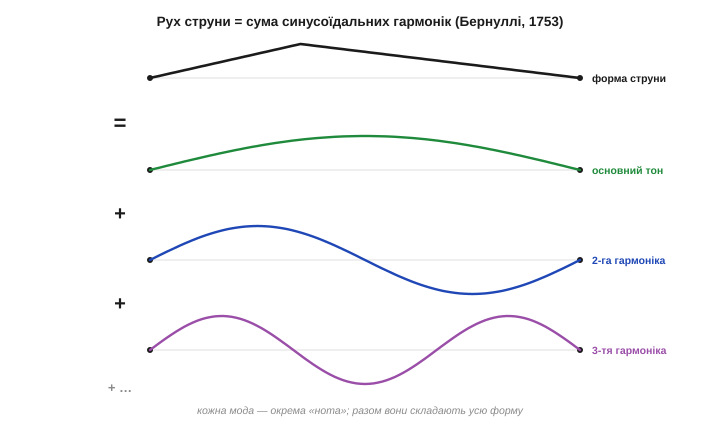
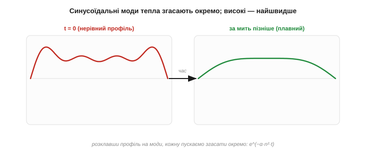
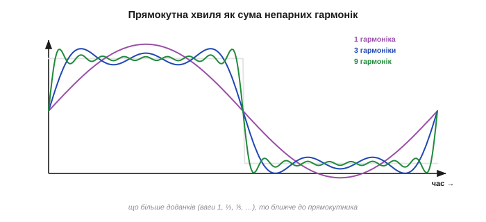
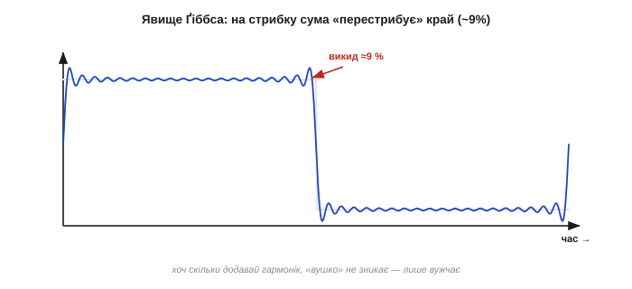
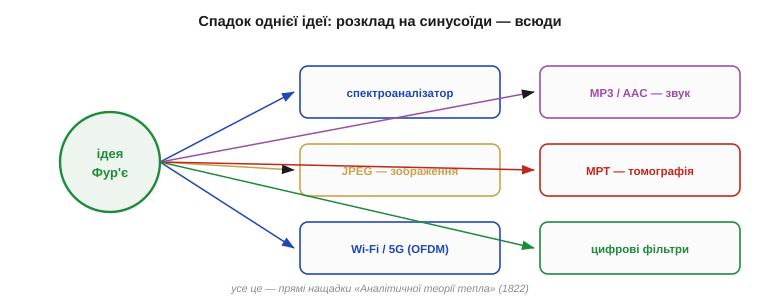
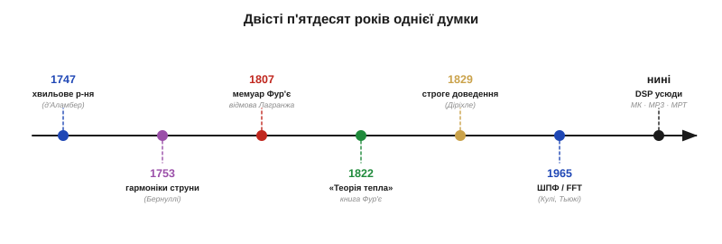

# 📜 Фур'є й суперечлива ідея, що все є сумою синусоїд

> Подивитися на сигнал не в часі, а в **частоті** — розкласти будь-яке коливання на чисті синусоїди й побачити, з чого воно «зроблене». Сьогодні це азбука: кожен спектроаналізатор, кожен MP3, кожен JPEG, кожне МРТ-зображення спираються на цю думку. А починалося все з гарячого металевого бруска й тези настільки зухвалої, що **найвидатніший математик епохи відмовився її друкувати**. Це історія ідеї, яку спершу відкинули за брак строгості, — і яка все одно перемогла, бо виявилася надто корисною, щоб її забути.

Париж, 21 грудня 1807 року. Перед фізико-математичним відділенням Інституту Франції — найповажнішого зібрання вчених на землі — сорокарічний інженер і колишній префект читає мемуар про те, як тепло розтікається твердим тілом. Слухає його комісія з чотирьох імен, кожне з яких саме по собі — епоха: **Жозеф-Луї Лагранж**, **П'єр-Симон Лаплас**, **Ґаспар Монж**, **Сильвестр Лакруа**. І коли доповідач доходить до головного — до твердження, що **будь-яку** температурну криву, хоч би яку ламану й розривну, можна скласти із самих лише синусоїд, — Лагранж, найбільший геометр свого віку, каже: ні. Цього не може бути. Мемуар не надрукують. Та ідея, яку щойно відхилили, через півтора століття працюватиме в кожному цифровому пристрої планети.

---

## Струна, що посварила геніїв

Думка, що складне коливання — це сума простих, народилася не в Фур'є. Вона визрівала шістдесят років до нього і встигла **пересварити** найкращих математиків XVIII століття. Полем битви була звичайна **натягнута струна**.

Коли смичок чи палець виводить струну з рівноваги, вона коливається — але як саме описати її рух? 1747 року **Жан Лерон д'Аламбер** (*Jean le Rond d'Alembert*, 1717–1783), француз, вивів рівняння, що керує цим рухом, — **хвильове рівняння**, одне з перших диференціальних рівнянь у частинних похідних у фізиці. Наступного року швейцарець **Леонард Ейлер** (*Leonhard Euler*, 1707–1783) дав свій розв'язок. А 1753 року ще один швейцарець із славетного базельського роду, **Даніель Бернуллі** (*Daniel Bernoulli*, 1700–1782), запропонував думку, що нас тут цікавить найбільше.

Бернуллі міркував фізично, як музикант. Струна, казав він, звучить не однією нотою, а **основним тоном і його обертонами** водночас: до найнижчого, найповільнішого коливання домішані вдвічі швидше, втричі швидше і так далі. А отже, **будь-який** рух струни — це накладення простих синусоїдальних коливань, **гармонік**: основна напівхвиля, повна хвиля, півтори хвилі… Сума синусоїд — ось і вся струна.


*Ідея Даніеля Бернуллі (1753). Рух защипнутої струни (угорі) можна подати як суму чистих синусоїдальних мод: основний тон (півхвиля), друга гармоніка (повна хвиля), третя і так далі. Кожна — окрема «нота», а разом вони складають усю форму. Це — пряма фізична прабатька ідеї Фур'є.*

Звучало переконливо — і одразу наразилося на спротив. **Ейлер і д'Аламбер не повірили**. Їхнє заперечення було глибоке: синусоїди — гладкі, округлі криві; як із них скласти, скажімо, **гострий злам** защипнутої трикутником струни? Здавалося очевидним, що сума плавних хвиль не може дати ані кута, ані тим паче розриву. Бернуллі ж не вмів довести зворотного — він **не знав, як обчислити коефіцієнти** того ряду, тобто скільки взяти кожної гармоніки. Він мав рацію в інтуїції, але не мав інструмента, щоб її захистити. Суперечка про струну тривала десятиліттями, лишилася незавершеною — і саме в цю незагоєну рану згодом ступить Фур'є.

> 🔧 **Навіщо це.** Слова, якими ми досі користуємось у звуці й сигналах, — **«основний тон» (fundamental)**, **«гармоніка» (harmonic)**, **«обертон»** — родом саме з цієї музичної суперечки про струну. Коли ваш спектроаналізатор показує пік на 50 Гц і менші піки на 100, 150, 200 Гц, ви бачите буквально те, що описував Бернуллі: основну частоту та її цілі кратні. Мова частот починалася як мова музики.

---

## Хлопчик з Осера, що пройшов крізь Терор і Єгипет

Перш ніж розповідати про тезу, варто пізнати людину, бо доля **Жозефа Фур'є** (*Jean-Baptiste Joseph Fourier*, 1768–1830) — це окремий роман, у якому математика дивом уціліла поміж гільйотиною й пустелею.

Він народився у французькому містечку **Осер** (*Auxerre*) у сім'ї кравця, рано осиротів — у дев'ять років лишився без обох батьків. Здібного хлопця прихистила військова школа при бенедиктинцях; там і спалахнула його пристрасть до математики — кажуть, він збирав недогарки свічок, щоб розв'язувати задачі ночами. Дорога вченого для безрідного юнака була майже закрита, тож Фур'є мав стати або священником, або вчителем — і став учителем.

А тоді прийшла **Французька революція**. Фур'є втягнувся в неї щиро, виступав у революційному комітеті свого міста — і ледь не наклав за це головою. У роки **Терору** його заарештували; за переказами, він був за крок від гільйотини й уцілів майже випадково — від падіння самого Робесп'єра. Пізніше він навчався в новоствореній **Нормальній школі**, слухав Лагранжа й Лапласа, а невдовзі вже сам викладав у легендарній **Політехнічній школі** (*École Polytechnique*).

1798 року життя Фур'є знову круто звернуло: він рушив із **Наполеоном до Єгипту**. Серед сотень науковців тієї експедиції він став секретарем заснованого Наполеоном **Каїрського інституту** (*Institut d'Égypte*), вів дипломатичні й інженерні справи, досліджував старожитності — і повернувся завзятим єгиптологом (праці експедиції лягли в монументальний «Опис Єгипту»). Кажуть навіть, що любов до спекотного клімату лишилася з ним назавжди — і, можливо, неабияк підштовхнула до головної теми його життя.

Бо саме після Єгипту, коли Наполеон призначив його **префектом департаменту Ізер** зі столицею в **Ґреноблі** (посаду він обіймав 1802–1814), Фур'є, керуючи дорогами й болотами цілого краю, у вільні години взявся за питання, що зробить його безсмертним: **як саме тече тепло**.

---

## Тепло, що тече: рівняння, яке вимагало синусоїд

У XVIII столітті природу тепла розуміли кепсько. Та Фур'є зайшов з боку не «що таке тепло», а «**за яким законом** воно перерозподіляється». Він припустив просту й точну річ: потік тепла в кожній точці пропорційний тому, **наскільки круто** там змінюється температура (її градієнту), і тече від гарячого до холодного. З цього **закону теплопровідності Фур'є** він вивів **рівняння теплопровідності** — рівняння в частинних похідних, що описує, як температурна крива згладжується з часом:

```
∂u/∂t = α · ∂²u/∂x²
```

де `u(x,t)` — температура в точці `x` у момент `t`, а `α` — теплопровідність матеріалу. Словами: **швидкість зміни температури в точці пропорційна «опуклості» профілю** в ній. Гострі піки тепла спливають швидко, пологі — повільно.

І тут Фур'є зробив рішучий хід. Він помітив, що в синусоїди є чарівна властивість щодо цього рівняння: **синусоїдальний профіль температури просто згасає на місці, не міняючи форми**. Покладіть на брусок температуру у вигляді `sin(nx)` — і з часом вона лишатиметься тією самою синусоїдою, тільки дедалі нижчою, згасаючи тим **швидше, чим частіша** хвиля (точніше — як `exp(−α·n²·t)`, пропорційно квадрату номера гармоніки). Синусоїди — це **власні форми** теплового процесу: кожна живе своїм незалежним життям.


*Чому теплу «зручні» синусоїди. Зліва — початковий нерівний профіль температури (сума багатьох мод). Високі гармоніки згасають як exp(−α·n²·t) — найшвидше, тож уже за мить дрібні зубці зникають, лишаючи плавну основну хвилю (праворуч). Розклавши профіль на синусоїди, Фур'є перетворив складне рівняння на набір простих, незалежних згасань.*

Звідси й уся стратегія: якщо **розкласти** будь-який початковий розподіл тепла на суму синусоїд, то розв'язати рівняння стає тривіально — кожну синусоїду пускаєш згасати окремо за її законом, а тоді складаєш назад. Складна задача розпадається на безліч однакових простих. Заради цього Фур'є й **мусив** уміти подати будь-яку температурну криву — хоч би яку — рядом синусоїд. Те, що Бернуллі лише вгадував для струни, Фур'є потрібно було **зробити робочим інструментом** для тепла.

---

## 1807: зухвала теза і вирок Лагранжа

І Фур'є зробив те, на що не зважилися попередники: він не просто заявив, що крива дорівнює сумі синусоїд, — він дав **формулу для коефіцієнтів**, рецепт, як обчислити «скільки взяти» кожної гармоніки (через інтеграл добутку функції на відповідну синусоїду). Це й перетворювало туманну здогадку на метод. А тоді він проголосив тезу в усій її зухвалій повноті: **будь-яку** функцію на проміжку — навіть із зламами, навіть **розривну**, як-от температурний стрибок, — можна точно подати **нескінченним рядом синусів і косинусів**.

Найвибуховіший приклад — **прямокутна хвиля**: різкий стрибок від «холодно» до «гаряче». Здавалося б, що може бути далі від гладкої синусоїди, ніж вертикальний обрив? А проте Фур'є показав: візьміть основну синусоїду, додайте третю гармоніку меншою, п'яту ще меншою, сьому… — і сума **щоразу ближче** тулиться до прямокутника, відтворюючи навіть його прямовисні стіни.


*Зухвала теза Фур'є наочно. Розривну прямокутну хвилю складають із самих синусоїд: одна гармоніка (груба хвиля), три, дев'ять… Що більше непарних гармонік (з вагами 1, ⅓, ⅕, …), то точніше сума відтворює навіть вертикальні стрибки. Саме в це — що гладкі хвилі дають гострий злам — і відмовлявся вірити Лагранж.*

Комісія слухала з повагою — і з недовірою. **Лагранж** (*Joseph-Louis Lagrange*, 1736–1813, італійсько-французький математик, народжений у Турині як Джузеппе Луїджі Лагранджа) заперечив рішуче — і, що цікаво, **по суті небезпідставно**. Адже це він замолоду був на боці тих, хто в суперечці про струну не вірив, що синусоїди дадуть розрив. Тепер той самий сумнів повернувся: Фур'є **не довів строго**, що його ряди справді збігаються до потрібної функції, — він радше демонстрував, що вони працюють. Для Лагранжа, жерця математичної строгості, цього було замало. **Лаплас** вагався. Підсумок: попри явну силу ідеї, мемуар 1807 року **відхилили до друку**.

Інститут, утім, відчував, що тут щось велике. 1811 року він оголосив **конкурсну премію** саме з поширення тепла — і Фур'є її **здобув**. Але журі (знову з Лагранжем у складі) у самому ж відгуку дорікнуло переможцеві **браком строгості й загальності**. Перемога з гірким присмаком: приз дали, а сумнів лишили. Друк праці знову відклали на роки.

---

## Бунт на стрибку: чому Лагранж мав рацію — і все одно програв

Найцікавіше, що **прискіпливість Лагранжа не була буркотінням заздрісника** — вона вказувала на реальну, глибоку трудність. Придивіться до того, як ряд Фур'є відтворює стрибок: біля самого обриву частинна сума не лягає гладко, а **перестрибує** через край і йде брижами. Хоч скільки додавай гармонік, на стрибку лишається стійкий **викид приблизно на 9 %**, який не зникає, а лише стискається до точки розриву. Згодом це назвуть **явищем Ґіббса** (*Gibbs phenomenon*).


*Чому строгість була доречною. Частинна сума ряду Фур'є біля розриву дає характерний викид (≈9 %) і брижі — явище Ґіббса. Скільки гармонік не додавай, «вушко» не зникає, лише вужчає. Збіжність ряду до розривної функції — тонка штука, і Лагранж мав рацію, що її треба доводити, а не приймати на віру.*

Тобто збіжність рядів Фур'є справді **тонша**, ніж здавалося Фур'є: вона буває не в кожній точці однаково, для розривних функцій поводиться химерно й вимагає обережних означень. Лагранж відчував цю прірву й не хотів через неї стрибати. Фур'є ж, інженер до кісток, **довіряв результату** — і результат його не підвів. У науці так трапляється: правий по суті виявився той, хто бачив далі, а правий у строгості — той, хто застерігав.

Розв'язали суперечку вже інші руки й пізніше. 1829 року німецький математик **Петер Густав Лежен Діріхле** (*Peter Gustav Lejeune Dirichlet*, 1805–1859) дав **перше строге доведення**: він сформулював умови (відомі тепер як **умови Діріхле**), за яких ряд Фур'є справді збігається до функції. Так, з потрібними застереженнями, теза Фур'є нарешті стала теоремою. А далі сталося неочікуване: **сама спроба зрозуміти, коли ряди Фур'є працюють**, штовхнула математику вперед на ціле століття. Заради неї уточнили саме поняття «функції», народилися строге означення інтеграла (**Бернгард Ріман**, *Bernhard Riemann*) і, зрештою, теорія множин (**Ґеорг Кантор**, *Georg Cantor*, починав саме з питань про збіжність тригонометричних рядів). Суперечка, що почалася зі струни й тепла, **перебудувала фундамент усього аналізу**.

> 🔧 **Навіщо це.** Явище Ґіббса — не музейна дивина, а ваш щоденний клопіт у цифровій обробці. Коли ви фільтруєте сигнал із різким фронтом або обриваєте спектр, на краях вискакують ті самі брижі-«дзвони». Тому інженери згладжують переходи [**вікнами**](topic:com-signal/windowing-leakage) і не дивуються «вушкам» на стрибках: це не помилка коду, а двохсотлітній привіт від суперечки Фур'є й Лагранжа.

---

## 1822: книга, що пережила суперечку

Фур'є виявився впертим — і терплячим. Хоча мемуар роками не друкували, він довів справу до кінця і 1822 року видав підсумкову працю — **«Аналітична теорія тепла»** (*Théorie analytique de la chaleur*). Це одна з тих книжок, що змінюють науку: у ній і закон теплопровідності, і рівняння, і повний апарат розкладу в ряди — те, що ми тепер звемо **рядами** й **перетворенням Фур'є**. Книга стала зразком нового стилю **математичної фізики**, де природне явище описують точним рівнянням і розв'язують його чесними методами.

У передмові Фур'є лишив рядок, що став девізом усієї прикладної математики: «**Глибоке вивчення природи — найплідніше джерело математичних відкриттів**» (*L'étude approfondie de la nature est la source la plus féconde des découvertes mathématiques*). У цьому весь він: не чиста абстракція заради абстракції, а математика, **народжена з реальної задачі** — з гарячого бруска заліза.

Визнання, хоч і запізніле, прийшло сповна. Ще 1809 року Наполеон надав Фур'є титул **барона**; згодом він став членом і незмінним секретарем **Академії наук**, членом **Французької академії**. А його ім'я викарбуване серед **72 імен найвидатніших учених на Ейфелевій вежі** — поряд із тими самими Лагранжем і Лапласом, що колись сумнівалися.

Була в нього й остання, майже випадкова перлина. Розмірковуючи, чому Земля тепліша, ніж «мала б бути» від самого лиш сонячного нагріву, Фур'є в 1820-х здогадався: атмосфера **затримує** частину тепла, що йде від поверхні, наче скляний ковпак. Так він першим описав механізм, який ми тепер звемо **парниковим ефектом** (*greenhouse effect*) — за два століття до того, як це стало найважливішою темою планети. Людина, що пояснила, як тепло тече **в бруску**, мимохідь пояснила, як воно тримається **навколо цілої Землі**.

---

## Від теплого бруска до MP3: чому ця ідея всюди

Тут історія робить найдивовижніший поворот. Ідею, що визріла заради **теплопровідності** й мало не загинула від недовіри, чекало життя, про яке Фур'є не міг і мріяти. Бо виявилося, що «розкласти на синусоїди» можна **будь-який** сигнал, не лише тепловий, — і що це **найкорисніша оптика** в усій техніці сигналів.

Звук — це сума тонів; розклавши його за Фур'є, дістаємо **спектр**, а навчившись прибирати чи стискати окремі частоти — **MP3** й **AAC**. Зображення — теж сума «просторових хвиль»; стиснувши їхній спектр, дістаємо **JPEG**. Радіо ділить ефір **за частотами**; сучасний Wi-Fi і 5G (**OFDM**) буквально передають дані сотнями синусоїд водночас. **МРТ** знімає не саме зображення, а його перетворення Фур'є, і відновлює картинку зворотним перетворенням. А ще — розпізнавання мови, сейсмологія, астрономія, кожен **спектроаналізатор** і кожен [цифровий фільтр](topic:com-signal/filter-as-spectrum-shaper), що його проєктують у частотній області. Усе це — нащадки гарячого бруска з Ґренобля.


*Від однієї ідеї — пів сучасної техніки. Розклад сигналу на синусоїди працює всюди: спектроаналізатор, стиснення звуку (MP3/AAC), зображень (JPEG), магнітно-резонансна томографія, бездротовий зв'язок (OFDM у Wi-Fi/5G), цифрові фільтри. Усе це — прямі нащадки «Аналітичної теорії тепла».*

Лишалася, щоправда, одна перешкода: чесно порахувати розклад Фур'є для довгого сигналу — це **гори арифметики**, неприйнятні навіть для ранніх комп'ютерів. Цю останню стіну проб'є 1965 року алгоритм [**швидкого перетворення Фур'є**](topic:com-signal/fft) (ШПФ/FFT) — окрема історія з власними героями. Саме ШПФ зробить ідею Фур'є не лише істинною, а й **миттєвою** — і всадить її в кожен мікроконтролер.


*Дві з половиною сотні років однієї думки. 1747 — хвильове рівняння (д'Аламбер); 1753 — гармоніки струни (Бернуллі); 1807 — мемуар Фур'є й відмова Лагранжа; 1811 — премія з докором; 1822 — «Аналітична теорія тепла»; 1829 — строге доведення (Діріхле); 1965 — ШПФ (Кулі й Тьюкі); сьогодні — у кожному цифровому пристрої.*

> 🔧 **Навіщо це.** Коли ви бачите, як осцилограма перетворюється на стовпчики спектра, варто пам'ятати: ви користуєтесь інструментом, який **відхилили до друку** найкращі математики світу. Урок для інженера подвійний. По-перше, **корисне переживає сумніви**: ідея Фур'є перемогла не бездоганною строгістю (її доточили інші, через двадцять років), а тим, що **працювала**. По-друге, велике **виростає з конкретного**: усе це могуття народилося не з абстракції, а з простого практичного питання — як остудити брусок заліза. Найглибша математика часто починається з найприземленішої інженерної задачі.

---

Отже, мова частот — це не суха абстракція, а **двохсотлітнє завоювання**, оплачене суперечками геніїв. Знаючи, **звідки** взялася думка розкладати все на синусоїди й **чому** їй колись не вірили, цю мову легше прийняти як інструмент: спосіб дивитися на той самий сигнал двома очима — у часі й у частоті.
