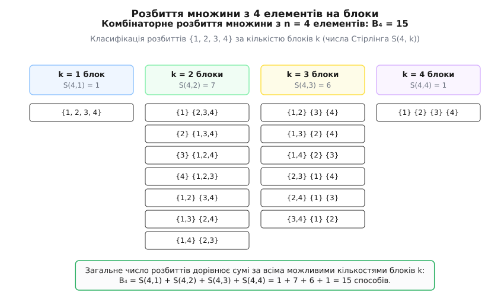
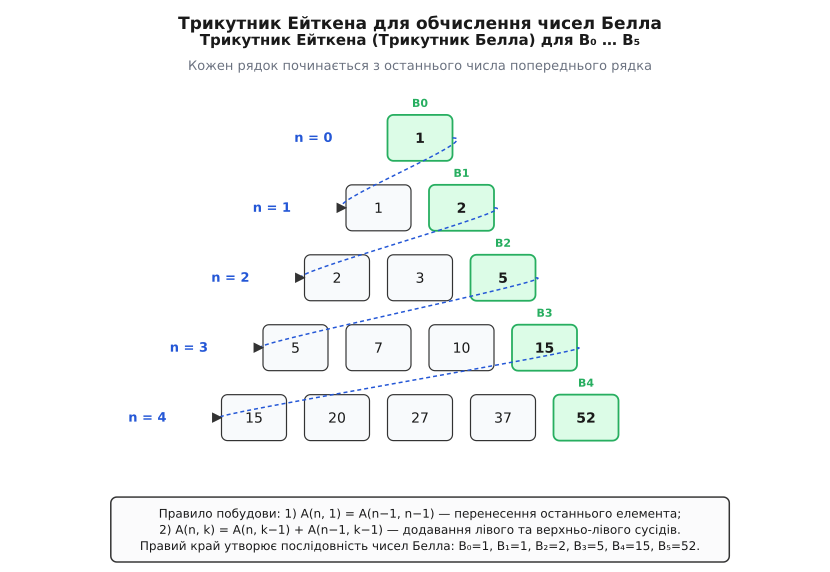
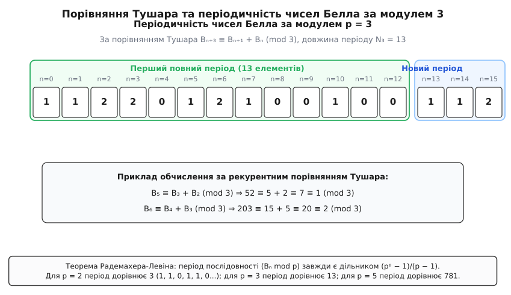

# Числа Белла

<preknowlist>
- [Числа Стірлінга другого роду](root:math-combinatorics/stirling-numbers-second-kind) — підрахунок способів розбиття n-елементної множини на k непорожніх блоків.
- [Твірні функції](root:math-combinatorics/generating-functions) — подання послідовностей через формальні степеневі ряди та експоненціальні твірні функції.
- [Модульна арифметика](root:math-number-theory/modular-arithmetic) — остачі від ділення, порівняння за модулем m та алгебраїчна структура кільця Z/mZ.
- [Мала теорема Ферма](root:math-number-theory/fermat-little-theorem) — тотожність aᵖ ≡ a (mod p) для простого числа p та будь-якого цілого a.
</preknowlist>

**Уявіть серверний кластер із п'яти різнорідних обчислювальних вузлів, які потрібно об'єднати у довільні незалежні робочі групи для паралельного виконання завдань.** Вузли у кожній групі тісно взаємодіють між собою, але самі групи є повністю ізольованими. Скількома фундаментально різними способами можна згрупувати ці 5 серверів? На відміну від класичних комбінаторних перестановок чи вибірок, де порядок елементів або фіксований розмір мають вирішальне значення, тут нас цікавить підрахунок способів розбиття множини на довільну кількість непорожніх підмножин (блоків). Для 5 серверів існує рівно **52** таких конфігурації.

Числовій послідовності `1, 1, 2, 5, 15, 52, 203, 877, 4140, 21147, 115975, …`, яка виникає під час розв'язання цього завдання для `n = 0, 1, 2, 3, 4, 5, …`, дано назву **чисел Белла** (позначаються `B_n`). Числа Белла є фундаментальним поняттям комбінаторики, теорії графів, аналітичної теорії чисел та абстрактної алгебри, описуючи кількість усіх можливих відношень еквівалентності на скінченній множині з `n` елементів.

---

## 1. Комбінаторна сутність розбиттів та визначення чисел Белла

Щоб чітко зрозуміти комбінаторну природу чисел Белла, необхідно розрізняти чотири основні види підрахунку елементів у комбінаториці:

1. **Перестановки `n!`** — підраховують способи впорядкування `n` помічених елементів у послідовний ряд.
2. **Сполучення `C(n, k)`** — підраховують способи вибору `k` елементів із `n` наявних без урахування порядку їх вибору.
3. **Числа розбиттів числа `p(n)`** — підраховують способи подання *непоміченого* цілого числа `n` у вигляді суми натуральних доданків без урахування порядку (наприклад, `4 = 3+1 = 2+2 = 2+1+1 = 1+1+1+1`).
4. **Числа Белла `B_n`** — підраховують способи розбиття *поміченої* `n`-елементної множини `S = {1, 2, …, n}` на довільну кількість непорожніх підмножин, які не перетинаються.

### Формальне означення розбиття множини

Нехай `S` — скінченна множина з `n` елементів. **Розбиттям множини `S`** (англ. *set partition*) називається родина її непорожніх підмножин `{B₁, B₂, …, Bₖ}` (які називаються **блоками** або **класами еквівалентності**), що задовольняють дві умови:

```
1. B_i ∩ B_j = ∅   для всіх i ≠ j  [блоки попарно не перетинаються]
2. B₁ ∪ B₂ ∪ … ∪ Bₖ = S             [об'єднання всіх блоків дає початкову множину S]
```

Число Белла `B_n` дорівнює загальній кількості усіх можливих розбиттів множини з `n` елементів. За означенням для порожньої множини `B₀ = 1` (існує єдине порожнє розбиття).

### Зв'язок із числами Стірлінга другого роду

Якщо зафіксувати кількість блоків `k`, то число способів розбити `n`-елементну множину строго на `k` непорожніх блоків називається **числом Стірлінга другого роду** і позначається `S(n, k)` (або `{#n \brace k}`).

Оскільки будь-яке розбиття `n`-елементної множини має містити якусь кількість блоків `k` у межах від `1` до `n` (або `k = 0` для `n = 0`), число Белла `B_n` виражається точним тотожним підсумовуванням чисел Стірлінга другого роду за всіма можливими значеннями `k`:

```
B_n = ∑ (від k=0 до n) S(n, k)
```

Наочну структуру цього розбиття для `n = 4` показано на діаграмі нижче.


*Класифікація 15 можливих розбиттів 4-елементної множини за кількістю блоків k: B₄ = S(4,1) + S(4,2) + S(4,3) + S(4,4) = 1 + 7 + 6 + 1 = 15.*

Для `n = 4` маємо 15 способів розбиття множини `{1, 2, 3, 4}`:
- **`k = 1` блок (`S(4,1) = 1` спосіб):** `{ {1, 2, 3, 4} }`.
- **`k = 2` блоки (`S(4,2) = 7` способів):** 4 способи розбиття виду `1 + 3` (наприклад, `{1}` та `{2,3,4}`) та 3 способи розбиття виду `2 + 2` (наприклад, `{1,2}` та `{3,4}`).
- **`k = 3` блоки (`S(4,3) = 6` способів):** способи виду `2 + 1 + 1` (наприклад, `{1,2}`, `{3}`, `{4}`).
- **`k = 4` блоки (`S(4,4) = 1` спосіб):** `{ {1}, {2}, {3}, {4} }`.

Сума всіх цих способів дає `B₄ = 1 + 7 + 6 + 1 = 15`.

### Зв'язок із сюр'єктивними функціями та числами Лаха

Числа Стірлінга другого роду та числа Белла тісно пов'язані з підрахунком сюр'єктивних функцій між скінченними множинами. Кількість усіх сюр'єкцій з `n`-елементної множини на `k`-елементну підписану множину дорівнює `k! · S(n, k)`.

Крім того, в комбінаторному аналізі виділяють **числа Лаха** `L(n, k) = (n! / k!) · C(n − 1, k − 1)`, які підраховують способи розбиття `n` елементів на `k` впорядкованих списків. У той час як числа Белла підраховують розбиття на невпорядковані блоки з невпорядкованими елементами, числа Лаха враховують порядок всередині кожного блоку.

### Алгебраїчний зв'язок із базисами многочленів

У лінійній алгебрі та алгебраїчній комбінаториці числа Стірлінга другого роду виступають коефіцієнтами переходу між звичайними степенями `xⁿ` та нисхідними факторіалами `(x)ₖ = x · (x − 1) · … · (x − k + 1)`:

```
xⁿ = ∑ (від k=0 до n) S(n, k) · (x)ₖ
```

Завдяки цій тотожності, якщо покласти `x = 1`, то оскільки `(1)₀ = 1`, `(1)₁ = 1` та `(1)ₖ = 0` для всіх `k ≥ 2`, сума значень нисхідних факторіалів під час звичайного підсумування приводить безпосередньо до чисел Белла та їхніх твірних операторів.

---

## 2. Рекурентні співвідношення та Трикутник Ейткена

Прямий підрахунок за числами Стірлінга вимагає обчислення всієї двовимірної таблиці `S(n, k)`. Проте для самих чисел Белла існує елегантна та фундаментальна трикутна рекурентна формула, яка дозволяє обчислювати `B_{n+1}` безпосередньо через попередні елементи `B₀, B₁, …, B_n`.

### Формула біноміальної рекурентності

Для будь-якого `n ≥ 0` виконується рекурентність:

```
B_{n+1} = ∑ (від k=0 до n) C(n, k) · B_k
```

де `C(n, k) = n! / (k! · (n − k)!)` — це звичайні біноміальні коефіцієнти з трикутника Паскаля.

### Доведення комбінаторним міркуванням

Розглянемо множину `S = {1, 2, …, n, n+1}`, яка містить `n + 1` елемент. Виділимо у цій множині останній `(n+1)`-й елемент і простежимо за блоком `B`, у якому він опиниться під час розбиття:

1. Нехай окрім самого елемента `(n+1)` блок `B` містить ще `j` інших елементів, обраних із перших `n` елементів `{1, 2, …, n}`.
2. Кількість способів обрати цих `j` супутників із `n` наявних елементів дорівнює біноміальному коефіцієнту `C(n, j)`.
3. Решта `n − j` елементів, що не потрапили до блоку `B`, мають бути довільним чином розбиті на власні блоки. За означенням кількість способів це зробити дорівнює числу Белла `B_{n−j}`.
4. Підсумовуючи за всіма можливими значеннями кількості супутників `j` від `0` до `n`, отримуємо:

```
B_{n+1}
= ∑ (від j=0 до n) C(n, j) · B_{n−j}             [сумування за розміром супутників j]
= ∑ (від k=0 до n) C(n, n − k) · B_k             [заміна змінної підсумовування k = n − j]
= ∑ (від k=0 до n) C(n, k) · B_k                 [оскільки C(n, n − k) = C(n, k)]
```

Це завершує строге доведення біноміальної рекурентності.

### Трикутник Ейткена (Трикутник Белла)

Швидким чисельним методом побудови послідовності `B_n` без обчислення біноміальних коефіцієнтів є **трикутник Ейткена** (або масив Ейткена / трикутник Белла).

Позначимо елементи трикутника через `A(n, k)` для `n ≥ 0` та `1 ≤ k ≤ n + 1`. Правило побудови масиву задається двома простими кроками:

```
1. A(0, 1) = 1                                   [початкова умова: верхівка трикутника]
2. A(n, 1) = A(n−1, n)                           [перший елемент n-го рядка є копією останнього елемента (n-1)-го рядка]
3. A(n, k) = A(n, k−1) + A(n−1, k−1)             [кожен наступний елемент дорівнює сумі лівого та верхньо-лівого сусідів]
```


*Покрокове формування послідовності чисел Белла B₀ … B₅ через масив Ейткена. Права діагональ (зелені комірки) дає числа Белла.*

Запишемо перші шість рядків трикутника Ейткена:

```
Рядок 0:  1
Рядок 1:  1    2
Рядок 2:  2    3    5
Рядок 3:  5    7   10   15
Рядок 4: 15   20   27   37   52
Рядок 5: 52   67   87  114  151  203
```

Зверніть увагу: перший елемент кожного рядка `A(n, 1)` та останній елемент попереднього рядка `A(n−1, n)` збігаються, а праві краї рядків утворюють послідовність чисел Белла: `B₀ = 1`, `B₁ = 1`, `B₂ = 2`, `B₃ = 5`, `B₄ = 15`, `B₅ = 52`, `B₆ = 203`.

---

## 3. Експоненціальні твірні функції та многочлени Белла

Для аналітичного дослідження асимптотики та алгебраїчних тотожностей у комбінаториці використовують метод твірних функцій. Оскільки числа Белла зростають швидше за будь-яку геометричну прогресію, для них розглядають **експоненціальну твірну функцію** (EGF):

```
B(x) = ∑ (від n=0 до ∞) B_n · (xⁿ / n!)
```

### Виведення замкненої форми твірної функції

Виведемо замкнений вираз для `B(x)`, використавши виведену раніше біноміальну рекурентність. Похідна функції `B(x)` по `x` дорівнює:

```
B'(x)
= (d/dx) [ ∑ (від n=0 до ∞) B_n · (xⁿ / n!) ]
= ∑ (від n=1 до ∞) B_n · (xⁿ⁻¹ / (n − 1)!)         [почленне диференціювання степеневого ряду]
= ∑ (від n=0 до ∞) B_{n+1} · (xⁿ / n!)             [зсув індексу підсумовування n → n + 1]
```

Підставимо у цей ряд біноміальне вираження для `B_{n+1}`:

```
B'(x)
= ∑ (від n=0 до ∞) [ ∑ (від k=0 до n) C(n, k) · B_k ] · (xⁿ / n!)
= ∑ (від n=0 до ∞) ∑ (від k=0 до n) (n! / (k! · (n − k)!)) · B_k · (xⁿ / n!)
= ∑ (від n=0 до ∞) ∑ (від k=0 до n) (B_k / k!) · (xⁿ⁻ᵏ / (n − k)!)
```

Змінивши порядок підсумовування (поклавши `m = n − k`), ми отримуємо добуток двох незалежних експоненціальних рядів (кошиківське добуток рядів):

```
B'(x)
= [ ∑ (від k=0 до ∞) B_k · (xᵏ / k!) ] · [ ∑ (від m=0 до ∞) (xᵐ / m!) ]
= B(x) · eˣ
```

Отримано просте диференціальне рівняння першого порядку з відокремлюваними змінними:

```
B'(x) / B(x) = eˣ   [відокремлення змінних]
```

Проінтегруємо обидві частини за зміною `x`:

```
ln(B(x)) = eˣ + C   [інтегрування обох частин]
B(x) = exp(eˣ + C) = C₁ · exp(eˣ)
```

Враховуючи початкову умову `B(0) = B₀ = 1`, маємо `1 = C₁ · exp(e⁰) = C₁ · e¹`, звідки `C₁ = 1 / e = e⁻¹`.

Отже, експоненціальна твірна функція чисел Белла має вигляд:

```
B(x) = exp(eˣ − 1) = e^(eˣ − 1)
```

Ця виняткова двоповерхова експоненціальна формула `e^(eˣ − 1)` поєднує аналітичні властивості експоненти з дискретною структурою розбиттів множин.

### Многочлени Белла та формула Фаа ді Бруно

Узагальненням чисел Белла є **однорідні та повні многочлени Белла** `B_n(x)`, які задаються твірною функцією:

```
exp(x · (eᵗ − 1)) = ∑ (від n=0 до ∞) B_n(x) · (tⁿ / n!)
```

При `x = 1` значення многочлена дає точне число Белла `B_n(1) = B_n`. З іншого боку, коефіцієнти многочлена `B_n(x)` дорівнюють числам Стірлінга второго роду:

```
B_n(x) = ∑ (від k=0 до n) S(n, k) · xᵏ
```

Запишемо перші шість многочленів Белла:
- `B₀(x) = 1`
- `B₁(x) = x`
- `B₂(x) = x² + x`
- `B₃(x) = x³ + 3x² + x`
- `B₄(x) = x⁴ + 6x³ + 7x² + x`
- `B₅(x) = x⁵ + 10x⁴ + 25x³ + 15x² + x`

У математичному аналізі часткові многочлени Белла `B_{n, k}(x₁, x₂, …, x_{n-k+1})` відіграють центральну роль у **формулі Фаа ді Бруно** (Faà di Bruno's formula) для обчислення `n`-ї похідної складеної функції `h(x) = f(g(x))`:

```
(dⁿ / dxⁿ) f(g(x)) = ∑ (від k=1 до n) f⁽ᵏ⁾(g(x)) · B_{n, k}(g'(x), g''(x), …, g⁽ⁿ⁻ᵏ⁺¹⁾(x))
```

Цей зв'язок робить многочлени та числа Белла незамінним інструментом у диференціальному численні та теорії диференціальних рівнянь.

---

## 4. Аналітичне підсумкування, формула Добінського та теорія ймовірностей

У 1877 році польський математик Ґжеґож Добінський відкрив вражаючий аналітичний факт: `n`-е число Белла `B_n` можна подати у вигляді суми звичайного нескінченного чисельного ряду.

### Формула Добінського

Для будь-якого цілого `n ≥ 0` виконується тотожність:

```
B_n = (1 / e) · ∑ (від k=0 до ∞) (kⁿ / k!)
```

або у розгорнутому вигляді:

```
B_n = (1 / e) · [ 0ⁿ/0! + 1ⁿ/1! + 2ⁿ/2! + 3ⁿ/3! + 4ⁿ/4! + … ]
```

*(Зауваження: для n = 0 приймають 0⁰ = 1, тому перша терма дорівнює 1).*

Повне строге алгебраїчне доведення цієї формули через диференціальні оператори `Θ = x · (d/dx)` та Малу теорему Ферма детально викладено у вставці [🧮 Доведення формули Добінського та порівняння Тушара](root:math-combinatorics/bell-numbers/math-dobinski-proof.md).

### Імовірнісна інтерпретація формули Добінського

З погляду теорії ймовірностей формула Добінського має глибинний зміст. 

Нехай `X` — випадкова величина, яка має **розподіл Пуассона** з математичним сподіванням `λ = 1`. Ймовірність того, що `X` набуде значення `k`, дорівнює `P(X = k) = e⁻¹ / k!`.

Тоді `n`-й початковий момент випадкової величини `X` дорівнює:

```
E[Xⁿ] = ∑ (від k=0 до ∞) kⁿ · P(X = k) = ∑ (від k=0 до ∞) kⁿ · (e⁻¹ / k!) = (1 / e) · ∑ (від k=0 до ∞) (kⁿ / k!) = B_n
```

Таким чином, **`n`-е число Белла є точним `n`-м початковим моментом пуассонівської випадкової величини з параметром λ = 1**.

Цікаво, що усі кумулянти (семиінваріанти) розподілу Пуассона з `λ = 1` строго дорівнюють `1`: `κ_m = 1` для всіх `m ≥ 1`. Оскільки початкові моменти будь-якого розподілу виражаються через його кумулянти за допомогою повних многочленів Белла `E[Xⁿ] = B_n(κ₁, κ₂, …, κ_n)`, підстановка `κ_m = 1` негайно дає `E[Xⁿ] = B_n(1, 1, …, 1) = B_n`.

Крім того, середня кількість блоків у випадковому розбитті `n`-елементної множини виражається як `E[k] = B_{n+1} / B_n − 1`.

### Асимптотичне зростання чисел Белла

Оскільки `B_n` підраховує складні комбінаторні об'єкти, його зростання є надгіпергеометричним (швидшим за `aⁿ` та `n!`, але повільнішим за `nⁿ`).

За формулою де Брейона та Мозера-Ваймана (Szekeres-Binet asymptotic analysis), логарифм чисел Белла має асимптотичний розклад:

```
ln(B_n) = n · ln(n) − n · ln(ln(n)) − n + o(n)
```

Точна точкова асимптотика задається через **W-функцію Ламберта** `W(n)` (розв'язок рівняння `W(n) · e^(W(n)) = n`):

```
B_n ≈ (1 / √n) · [ W(n) ]^(n + 1/2) · exp( W(n) − n − 1 )
```

Для великих `n` можна користуватися наближенням `W(n) ≈ ln(n) − ln(ln(n))`.

---

## 5. Арифметичні властивості та модульні порівняння

У теорії чисел числа Белла володіють багатими арифметичними властивостями та чудовою періодичною структурою за модулем простих чисел.

### Порівняння Тушара (Touchard's Congruence)

У 1939 році французький математик Жак Тушар довів, що для довільного простого числа `p` та будь-якого `n ≥ 0` числа Белла задовольняють лінійне порівняння:

```
B_{n+p} ≡ B_{n+1} + B_n (mod p)
```

Наприклад, для `p = 3` маємо рекурентне порівняння `B_{n+3} ≡ B_{n+1} + B_n (mod 3)`. Перевіримо це для `n = 2`:

```
B₅ = 52 ≡ 1 (mod 3)
B₃ + B₂ = 5 + 2 = 7 ≡ 1 (mod 3)
```

Обидві частини строго дорівнюють `1 (mod 3)`.

Узагальнене порівняння Тушара-Карліца для вищих степенів простого числа `pᵐ` має вигляд:

```
B_{n+pᵐ} ≡ B_{n+1} + m · B_n (mod p)
```

### Періодичність за модулем простого числа

З порівняння Тушара безпосередньо випливає, що послідовність остач `(B_n mod p)` є строго періодичною! Оскільки порівняння `B_{n+p} ≡ B_{n+1} + B_n (mod p)` є лінійним рекурентним рівнянням порядку `p`, довжина найменшого періоду `N_p` обмежена зверху.

За теоремою Радемахера-Левіна-Вільямса, довжина періоду `N_p` послідовності `(B_n mod p)` завжди ділить число:

```
N_p | ((pᵖ − 1) / (p − 1))
```

Розглянемо довжину періодів для перших кількох простих чисел:

1. **Для `p = 2`:** `(2² − 1) / (2 − 1) = 3`. 
   Послідовність `(B_n mod 2)` має період довжиною **3**: `1, 1, 0, 1, 1, 0, 1, 1, 0, …` (тобто `B_n` є парним тоді і тільки тоді, коли `n ≡ 2 (mod 3)`).
2. **Для `p = 3`:** `(3³ − 1) / (3 − 1) = 13`. 
   Послідовність `(B_n mod 3)` має період довжиною **13**.
3. **Для `p = 5`:** `(5⁵ − 1) / (5 − 1) = 781`. 
   Послідовність `(B_n mod 5)` має період довжиною **781**.

Структуру періодичності за модулем `p = 3` наочно показано на діаграмі нижче.


*Демонстрація періодичності довжиною N₃ = 13 послідовності Bₙ mod 3 на основі рекурентності Тушара Bₙ₊₃ ≡ Bₙ₊₁ + Bₙ (mod 3).*

---

## 6. Зв'язок із відношеннями еквівалентності та решіткою розбиттів

Основна теорема відношень еквівалентності стверджує, що існує взаємно однозначна бієктивна відповідність між усіма відношеннями еквівалентності `~` на скінченній множині `S` та усіма її розбиттями на блоки.

Кожен клас еквівалентності `[x] = {y ∈ S | y ~ x}` відповідає окремому блоку розбиття. Отже, **число Белла `B_n` дорівнює точній кількості усіх можливих відношень еквівалентності, які можна задати на множині з `n` елементів**.

### Алгебраїчна решітка розбиттів Π_n

Множина всіх розбиттів `n`-елементної множини позначається `Π_n`. На цій множині можна запровадити відношення часткового порядку за принципом **подрібнення**: розбиття `P₁` називається подрібненням розбиття `P₂` (`P₁ ≤ P₂`), якщо кожен блок розбиття `P₁` є підмножиною деякого блоку розбиття `P₂`.

З цим відношенням часткового порядку множина `Π_n` утворює алгебраїчну **геометричну решітку розбиттів**. 

Найменшим елементом решітки `0̂` є розбиття на `n` одноелементних блоків `{ {1}, {2}, …, {n} }`, а найбільшим елементом `1̂` — розбиття на єдиний блок `{ {1, 2, …, n} }`. Загальна кількість елементів у решітці `Π_n` дорівнює числу Белла `B_n`.

У алгебраїчній комбінаториці Джан-Карло Рота довів, що функція Мебіуса `μ(0̂, 1̂)` для решітки розбиттів `Π_n` задовольняє тотожність:

```
μ(0̂, 1̂) = (−1)ⁿ⁻¹ · (n − 1)!
```

Цей результат є основою інверсії Мебіуса на решітках розбиттів.

### Зауваження про понятійну відмінність: Числа Белла vs Стани Белла

У фізиці та квантовій теорії інформації широко відомі **стани Белла** (Bell states) та **нерівності Белла** (Bell's inequalities). Важливо підкреслити, що вони названі на честь іншого видатного вченого — північноірландського фізика-теоретика Джона Стюарта Белла (John Stewart Bell, 1928–1990), який досліджував квантову заплутаність у 1964 році. 

Числа Белла та многочлени Белла називаються на честь шотландсько-американського математика Еріка Темпля Белла (Eric Temple Bell, 1883–1960). Це два різні понятійні світи, які не варто плутати.

---

## 7. Приклад обчислення, алгоритми та застосування

Щоб закріпити розуміння механізму обчислення, виконаємо покроковий розрахунок перших кількох чисел Белла за всіма трьома основними формулами.

### Пряме обчислення для n = 0, 1, 2, 3, 4, 5

```
1. n = 0:  B₀ = S(0,0) = 1
2. n = 1:  B₁ = S(1,1) = 1
3. n = 2:  B₂ = C(1,0)·B₀ + C(1,1)·B₁ = 1·1 + 1·1 = 2
4. n = 3:  B₃ = C(2,0)·B₀ + C(2,1)·B₁ + C(2,2)·B₂ = 1·1 + 2·1 + 1·2 = 5
5. n = 4:  B₄ = C(3,0)·B₀ + C(3,1)·B₁ + C(3,2)·B₂ + C(3,3)·B₃ = 1·1 + 3·1 + 3·2 + 1·5 = 15
6. n = 5:  B₅ = C(4,0)·B₀ + C(4,1)·B₁ + C(4,2)·B₂ + C(4,3)·B₃ + C(4,4)·B₄ = 1·1 + 4·1 + 6·2 + 4·5 + 1·15 = 52
```

Для `n = 5` розбиття 52 варіантів розподіляється за кількістю блоків `k` наступним чином:
- `S(5,1) = 1` спосіб (1 блок);
- `S(5,2) = 15` способів (2 блоки: 5 способів типу `1+4` та 10 способів типу `2+3`);
- `S(5,3) = 25` способів (3 блоки: 10 способів типу `1+1+3` та 15 способів типу `1+2+2`);
- `S(5,4) = 10` способів (4 блоки типу `1+1+1+2`);
- `S(5,5) = 1` спосіб (5 блоків по одному елементу).

Сума: `1 + 15 + 25 + 10 + 1 = 52 = B₅`.

> 🔧 **Навіщо це.**
> Знання чисел Белла та алгоритмів генерації розбиттів є критично важливим у кількох галузях комп'ютерних наук та прикладної математики:
>
> 1. **Кластеризація та аналіз даних:** під час групування `n` об'єктів у невідому кількість кластерів числа Белла `B_n` визначають повний розмір простору пошуку оптимального розбиття.
> 2. **Розподілені обчислення та балансування навантаження:** розбиття `n` процесів або задач між однаковими обчислювальними вузлами описується решіткою розбиттів.
> 3. **Реляційні бази даних та проектування схем:** кількість можливих еквівалентностей між атрибутами таблиць для виявлення функціональних залежностей виражається числами Белла.
> 4. **Аналіз строф та римування у літературознавстві:** класичні схеми римування для `n`-рядкового вірша (наприклад, для чотиривірша `n = 4`: AAAA, ABAB, ABBA, AABB, AABC, ABCD…) строго відповідають 15 розбиттям множини з 4 елементів.

Докладніше про багату історію відкриття цих чисел від японських пахощів до праць Белла та Роти читайте у вставці [📜 Історія чисел Белла та комбінаторних розбиттів](root:math-combinatorics/bell-numbers/hist-bell-numbers.md). Практичні алгоритми обчислення та генерації розбиттів мовами C і C++ наведено у вставці [⚙️ Практичні алгоритми обчислення чисел Белла](root:math-combinatorics/bell-numbers/proj-bell-algorithms.md).
