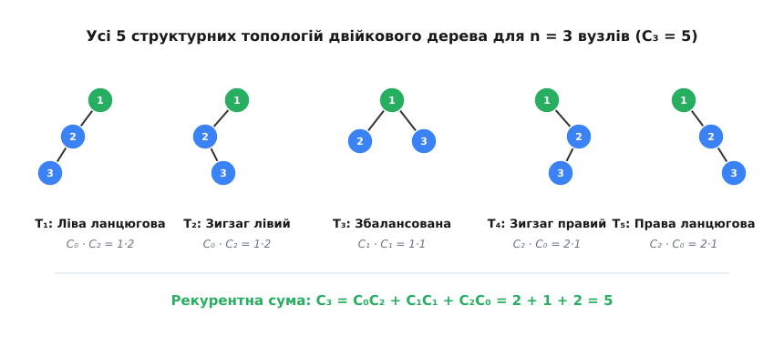
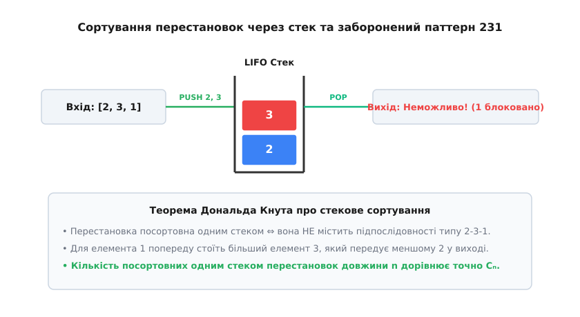
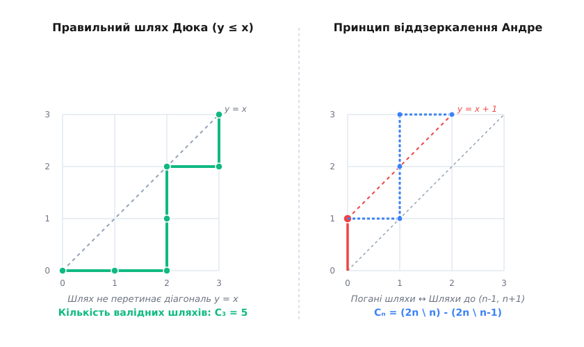
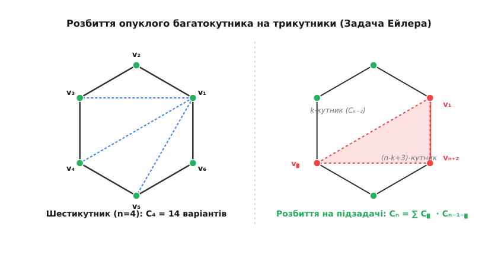

# Числа Каталана

<preknowlist>
- [Рекурсія](root:sf-algorithms/recursion) — базовий випадок, виклики, дерево рекурсії та самоподібні структури.
- [Двійкове дерево](root:sf-algorithms/binary-tree) — корінь, ліве й праве піддерева, топологічна морфологія.
- [Динамічне програмування](root:sf-algorithms/dynamic-programming) — оптимальна підструктура, перекривання підзадач, мемоїзація та табуляція.
- [Стек](root:sf-lang/stack-lifo) — LIFO-порядок, синтаксичний аналіз, стекові послідовності та дужкові структури.
- [Сортувальна станція Дейкстри](root:sf-lang/shunting-yard) — перетворення інфіксного запису на дерево операцій та валідність дужкових пар.
</preknowlist>

При проєктуванні деревних структур даних, оптимізації синтаксичних аналізаторів чи обчисленні алгебраїчних виразів першим фундаментальним питанням є оцінка топологічної різноманітності системи: скількома фундаментально відмінними способами можна побудувати двійкове дерево з `n` вузлів? Якщо для `n = 1` існує лише 1 можлива форма дерева, для `n = 2` — 2 форми, для `n = 3` — 5 форм, то вже при `n = 10` кількість топологічних варіантів досягає 16 796, а при `n = 20` перевищує 6.56 мільярдів. Це не просто довільна експонента, а жорсткий комбінаторний закон, який визначає простір рішень для цілого класу даних у комп'ютерних науках.

Кількість таких конфігурацій для багатьох ізоморфних обчислювальних моделей описується послідовністю цілих чисел, яка називається **числами Каталана** (`Cₙ`). Як детально показано в [історії виникнення чисел Каталана](root:math-combinatorics/catalan-numbers/hist-catalan.md), ця послідовність уперше з'явилася у XVIII столітті у працях Леонарда Ейлера при розв'язанні геометрії триангуляцій багатокутників і згодом була систематизована Еженом Каталаном для оцінки дужкових виразів.

## Комбінаторні моделі та ізоморфізм у структурах даних

Унікальність чисел Каталана полягає в тому, що одна й та сама числова послідовність виникає в десятках навигляд не пов'язаних між собою алгоритмічних задач. Усі ці задачі є комбінаторно ізоморфними: існує пряме взаємно-однозначне (бієктивне) відображення між елементами однієї моделі та елементами іншої. Це означає, що розв'язок, виведений для однієї геометричної чи алгебраїчної системи, миттєво переноситься на структури даних у пам'яті комп'ютера.

### 1. Двійкові дерева та дерева пошуку (BST)

Найбільш фундаментальним застосуванням у теорії структур даних є підрахунок кількості структурно відмінних **двійкових дерев**. 

Нехай є `n` внутрішніх вузлів. Скількома способами можна зв'язати ці вузли у валідне двійкове дерево? Відповідь дорівнює точно `Cₙ`. Якщо ж розглядати **строгі (повні) двійкові дерева** (де кожен вузол має або 0, або 2 дитини), то таке дерево з `n` внутрішніми вузлами неодмінно містить строго `n + 1` листок (зовнішніх вузлів). Інваріант кількості листків `L = I + 1` виконується для будь-якої топології, тому кількість різних строгих двійкових дерев із `n + 1` листком також дорівнює `Cₙ`.

У контексті **двійкових дерев пошуку (BST)** з `n` унікальними ключами, впорядкованими за зростанням, порядок розташування елементів у вузлах повністю визначається відносними значеннями ключів та обраною топологією. Оскільки кожна структурна форма дерева однозначно розміщує задану множину ключів, кількість різних валідних двійкових дерев пошуку для `n` ключів дорівнює точно `Cₙ`.



*Топологічна різноманітність двійкових дерев для 3 вузлів: рекурентний розклад фіксує корінь і підраховує добуток комбінацій лівого та правого піддерев.*

Цей факт пояснює, чому неконтрольоване створення BST є небезпечним у критичних обчислювальних системах. З-поміж `Cₙ` можливих дерев лише крихітна частка є збалансованими. Більшість топологій вироджуються в косі ланцюжки з висотою `O(n)`, що змушує алгоритми операцій пошуку, вставки та видалення працювати за найгірший час `O(n)`. Щоб запобігти цьому виродженню, у реальних системах використовуються інваріанти самобалансування (наприклад, AVL-дерева, Червоно-чорні дерева або Splay-дерева), які відсікають незбалансовані топології зі списку дозволених `Cₙ` конфігурацій.

### 2. Правильні дужкові послідовності та мова Дюка

Другою базовою моделлю є мова правильних дужкових послідовностей (Dyck language). Рядок із `n` відкриваючих `(` та `n` закриваючих `)` дужок називається **правильним**, якщо він задовольняє дві суворі умови:
1. Загальна кількість відкриваючих дужок дорівнює кількості закриваючих (рівно по `n` кожного типу).
2. У будь-якому префіксі рядка кількість відкриваючих дужок не менша за кількість закриваючих.

Кількість таких послідовностей довжини `2n` дорівнює `Cₙ`. Для `n = 3` існує точно 5 валідних послідовностей:
`((())), (()()), (())(), ()(()), ()()()`

У синтаксичному аналізі компіляторів кожна така послідовність відповідає валідному порядку обчислення виразу з парними операторами. У контексті управління пам'яттю та операцій LIFO-стеку відкриваюча дужка `(` репрезентує операцію `PUSH` (запис у стек), а закриваюча `)` — операцію `POP` (витяг зі стеку). Інваріант мови Дюка гарантує, що стек ніколи не зазнає помилки спустошення (Stack Underflow), адже кількість виконаних `POP` на будь-якому проміжку часу не може перевищувати кількість виконаних `PUSH`.

### 3. Сортування перестановок через стек (Knuth's Stack-Sortable Permutations)

У першому томі фундаментальної праці «Мистецтво програмування» Дональд Кнут поставив задачу: які перестановки чисел `{1, 2, ..., n}` можна посортувати за зростанням, пропустивши їх крізь один LIFO-стек?

Процес сортування працює за простим алгоритмом: ми читаємо елементи вхідної перестановки по одному. Ми можемо або одразу перемістити вхідний елемент у стек (`PUSH`), або виштовхнути верхній елемент стеку у вихідний потік (`POP`). Мета полягає в тому, щоб вихідний потік утворив строго впорядковану послідовність `[1, 2, ..., n]`.



*Стекове сортування за Кнутом: наявність забороненої підпослідовності 231 блокує витяг елементів і виключає перестановку зі списку допустимих.*

Кнут навів строге доведення: перестановка є посортовною одним стеком тоді й лише тоді, коли вона **не містить забороненої підпослідовності типу 231** (тобто трьох елементів `a_i, a_j, a_k` за індексами `i < j < k`, для яких виконується нерівність `a_k < a_i < a_j`).

Механізм цієї заборони простий: якщо у вхідному потоці зустрічається елемент `a_i`, а за ним пізніше йдуть більший елемент `a_j` та менший елемент `a_k`, то при потраплянні `a_i` у стек він виявляється заблокованим під елементом `a_j`. Оскільки `a_k` є найменшим серед трьох, він має вийти у вихідний потік першим. Але `a_j` лежить вище за `a_i` у стеку, тому `a_j` вийде раніше за `a_i`, що руйнує відсортований порядок `a_i < a_j` у виході.

Кількість таких посортовних одним стеком перестановок довжини `n` дорівнює точно `Cₙ`. Це відкриття Кнута поклало початок цілому напрямку комбінаторики дослідження перестановок із забороненими паттернами (Pattern Avoiding Permutations).

### 4. Шляхи Дюка на ґратці (Dyck Paths)

Геометричною інтерпретацією є монотонні блукання на двовимірній ґратці `n × n` від початкової точки `(0, 0)` до кінцевої точки `(n, n)`. Дозволено робити лише дискретні кроки праворуч `R = (1, 0)` та угору `U = (0, 1)`.

Траєкторія називається **шляхом Дюка**, якщо вона жодного разу не піднімається вище головної діагоналі `y = x` (тобто для всіх точок шляху `(x, y)` виконується інваріант `y ≤ x`).



*Аналіз шляхів Дюка на ґратці: невалідні шляхи, які перетинають діагональ, бієктивно віддзеркалюються на траєкторії поза межами цілі.*

Кожен крок праворуч `R` ізоморфний відкриваючій дужці `(` або операції `PUSH`, а кожен крок угору `U` — закриваючій дужці `)` або операції `POP`. Умова перебування під діагоналлю `y ≤ x` строго еквівалентна вимозі перевищення кількості `PUSH` над `POP`. Кількість усіх можливих шляхів Дюка на ґратці `n × n` становить `Cₙ`.

### 5. Триангуляція опуклих багатокутників (Задача Ейлера)

Якщо взяти опуклий багатокутник з `n + 2` сторонами (вершини `v₁, v₂, ..., vₙ₊₂`), кількість способів розбити його внутрішню поверхню на `n` трикутників за допомогою проведення `n - 1` неперетинних діагоналей дорівнює `Cₙ`.



*Задача триангуляції Ейлера: вибір вершини при фіксованій основі ділить опуклий багатокутник на дві незалежні суб-полігональні поверхні.*

Ця модель є основою геометричних алгоритмів триангуляції полігональних сіток у тривимірній графіці, розрахунку покриття в ГІС-системах та побудові сіток скінченних елементів для фізичного моделювання.

### 6. Неперетинні розбиття та хорди на колі (Non-Crossing Partitions)

Уявімо `2n` точок, розміщених на колі. Скількома способами можна з'єднати ці точки `n` неперетинними відрізками (хордами)? Відповідь — `Cₙ`.

Ця модель описує топологію розведення провідників без перетинів на одношарових друкованих платах (PCB routing), структуру складання молекул РНК (RNA secondary structure secondary folding без псевдовозлів) та взаємодію каналів у багатопотокових топологіях передачі даних.

> 🔧 **Навіщо це.** Комбінаторний ізоморфізм дає змогу трансляторам переводити складні синтаксичні об'єкти (наприклад, AST-дерева виразів) у лінійні компактні бітові послідовності (Dyck paths) і навпаки за `O(n)` часу без втрати структури даних, заощаджуючи обсяг пам'яті та прискорюючи серіалізацію.

## Математичний механізм: Рекурентність та закриті формули

Щоб зрозуміти, чому для всіх цих систем виникає саме така числова послідовність, проаналізуємо процес створення двійкового дерева з `n` вузлів із перших принципів.

### 1. Згорткове співвідношення Зегнера (Convolution Recurrence)

Розглянемо довільне двійкове дерево з `n` вузлами (`n ≥ 1`). Виділимо один вузол як корінь дерева. Це залишає `n - 1` вузлів, які необхідно розподілити між лівим та правим піддеревами.

Якщо у лівому піддереві розмістити `i` вузлів (де індекс `i` може набувати будь-якого цілочисельного значення від `0` до `n - 1`), то у правому піддереві неодмінно залишиться `n - 1 - i` вузлів. 

Оскільки вибір структури лівого піддерева не залежить від вибору структури правого піддерева, за фундаментальним правилом добутку комбінаторики існує точно `Cᵢ · Cₙ₋₁₋ᵢ` способів побудувати двійкове дерево з `i` вузлами зліва та `n - 1 - i` вузлами справа.

Просумувавши за всіма можливими розмірами лівого піддерева від `0` до `n - 1`, отримуємо базове квадратичне рекурентне співвідношення Зегнера:

```
C₀ = 1
Cₙ = C₀·Cₙ₋₁ + C₁·Cₙ₋₂ + ... + Cₙ₋₁·C₀ = ∑ᵢ₌₀ⁿ⁻¹ Cᵢ · Cₙ₋₁₋ᵢ    [для n ≥ 1]
```

Послідовно обчислимо перші кілька значень за цією рекурентністю:
- `C₀ = 1` (початкова умова: єдине порожнє дерево з 0 вузлів)
- `C₁ = C₀·C₀ = 1·1 = 1` (єдине дерево з 1 вузла)
- `C₂ = C₀·C₁ + C₁·C₀ = 1·1 + 1·1 = 2` (дві топології з 2 вузлів)
- `C₃ = C₀·C₂ + C₁·C₁ + C₂·C₀ = 1·2 + 1·1 + 2·1 = 5` (п'ять топологій з 3 вузлів)
- `C₄ = C₀·C₃ + C₁·C₂ + C₂·C₁ + C₃·C₀ = 1·5 + 1·2 + 2·1 + 5·1 = 14`

### 2. Явна формула через біноміальні коефіцієнти

Розв'язання цієї рекурентності дає точну закриту формулу для `n`-го числа Каталана:

```
Cₙ = (1 / (n + 1)) · (2n \ n) = (2n)! / ((n + 1)! · n!)
```

Детальне обґрунтування цієї формули наведено у вставці з [математичним виведенням формул чисел Каталана](root:math-combinatorics/catalan-numbers/math-catalan-proofs.md), де продемонстровано доведення через принцип віддзеркалення Андре та через метод твірних функцій.

### 3. Лінійне мультиплікативне співвідношення

Для практичного обчислення на комп'ютері формула через факторіали є незручною через швидке переповнення. Ділення двох сусідніх чисел Каталана `Cₙ / Cₙ⋇` дозволяє скоротити факторіали й отримати лінійне мультиплікативне співвідношення першого порядку:

```
C₀ = 1
Cₙ = Cₙ⋇ · (4n - 2) / (n + 1)    [для n ≥ 1]
```

Це співвідношення показує, що кожне наступне число Каталана отримується з попереднього множенням на раціональний дріб `(4n - 2) / (n + 1)`.

### 4. Асимптотичне зростання (Оцінка Стірлінга)

Застосування наближення Стірлінга `k! ≈ √(2πk) · (k / e)ᵏ` до факторіалів у явній формулі визначає підсумкову асимптотику для великих `n`:

```
Cₙ ~ 4ⁿ / (n^(3/2) · √π)
```

Отже, асимптотична складність зростання кількості топологій є експоненціальною:

```
Cₙ = Θ(4ⁿ / n^(3/2))
```

Показник `4ⁿ` описує експоненціальний вибух комбінаторного простору, який стримується лише діленням на степеневу величину `n^(3/2)`.

## Практичне застосування у комп'ютерних науках та системах

Знання властивостей чисел Каталана дає змогу проектувати високооптимізовані алгоритми та структури даних.

### 1. Стиснення топології дерев (Succinct Tree Encoding)

У класичному об'єктно-орієнтованому або зв'язаному поданні вузол двійкового дерева описується структурою з двох посилань `left` та `right`. На 64-бітній архітектурі кожен вказівник займає 8 байт, тому збереження топології дерева з `n` вузлів вимагає `16n` байт лише під посилання, не враховуючи накладних витрат аллокатора пам'яті.

Проте, оскільки існує лише `Cₙ` можливих топологій для `n` вузлів, фундаментальна теоретико-інформаційна межа пам'яті (ентропія Колмогорова) для збереження формату дерева становить:

```
I_min = ⌈log₂ Cₙ⌉ ≈ ⌈log₂ (4ⁿ / n^(3/2))⌉ ≈ 2n біт
```

Це означає, що структуру **будь-якого** двійкового дерева з `n` вузлів можна беззастережно закодувати всього у `2n` біт (по 2 біти на вузол)!

Цей принцип лежить в основі **лаконічних структур даних (Succinct Data Structures)**:
- **Блок-дужкове кодування (BP — Balanced Parentheses):** Обхід дерева вглиб записує біт `1` при вході у вузол і біт `0` при виході. Отриманий бітовий вектор довжини `2n` є правильним шляхом Дюка.
- **Порівневе кодування (LOUDS — Level-Order Unary Degree Sequence):** Вузли кодуються в порядку обходу вшир (BFS) унарним кодом ступеня.

Для дерева з 1 000 000 вузлів класичне зв'язане подання вимагає близько 16 МБ оперативної пам'яті, тоді як лаконічне подання Каталана займає всього **250 КБ** (зменшення обсягу в 64 рази!), зберігаючи можливість навігації до батька чи дітей за `O(1)` часу за допомогою апаратних інструкцій процесора `POPCNT` та `TZCNT`.

### 2. Складність синтаксичних аналізаторів та контекстно-вільних граматик

У компіляторах та інтерпретаторах алгоритми синтаксичного аналізу (наприклад, алгоритм Ерлі чи CYK) будують абстрактне синтаксичне дерево (AST). Якщо граматика мови є неоднозначною (ambiguous), для виразу з `n` операндів існує до `Cₙ⋇` можливих синтаксичних дерев розбору.

Це пояснює, чому парсер неоднозначної граматики без запровадження операторних пріоритетів та правил асоціативності зависає або вимагає експоненціального часу `O(Cₙ)`. Введення правил пріоритету фіксує єдине валідне дерево розбору з-поміж `Cₙ⋇` кандидатів.

### 3. Оптимізація порядку множення матриць (Matrix Chain Multiplication)

Завдяки асоціативності множення матриць, добуток `A₁ · A₂ · ... · Aₙ` повертає однаковий результат при будь-якій розстановці дужок. Однак кількість скалярних операцій множення залежить від розмірностей і порядку виконання.

Кількість варіантів розстановки дужок для `n` матриць дорівнює точно `Cₙ⋇`. Алгоритм динамічного програмування з часовою складністю `O(n³)` знаходить найдешевший порядок обчислень, досліджуючи саме цей комбінаторний простір Каталана.

## Обчислювальна складність та системні пастки

При практичній реалізації обчислення чисел Каталана розробник стикається з кількома технічними бар'єрами, пов'язаними з обмеженнями апаратури.

### 1. Межі переповнення цілих чисел (Integer Overflow)

Послідовність Каталана зростає експоненціально. Нижче наведено перші знакові значення:

```
C₀  = 1
C₁  = 1
C₂  = 2
C₃  = 5
C₄  = 14
C₅  = 42
C₆  = 132
C₇  = 429
C₈  = 1430
C₉  = 4862
C₁₀ = 16796
C₁₅ = 9694845
C₂₀ = 6564120420
C₂₅ = 4861946401452
C₃₀ = 3814986502092304
C₃₅ = 3116285494907301260
```

Граничні мови програмування та типи даних:
- **32-бітне беззнакове `uint32_t`**: Переповнюється при `n = 10` (`C₁₉ = 1 767 263 190 < 2³² - 1`, але `C₂₀ = 6 564 120 420 > 2³² - 1`).
- **64-бітне беззнакове `uint64_t`**: Переповнюється при `n = 36` (`C₃₅ = 3.11 · 10¹⁸ < 2⁶⁴ - 1`, але `C₃₆ = 1.43 · 10¹⁹ > 2⁶⁴ - 1`).

Якщо алгоритм вимагає обчислення `Cₙ` для `n ≥ 36`, необхідно використовувати бібліотеку довгої арифметики (BigInt) або проводити обчислення за модулем `mod M`.

### 2. Порівняльна характеристика реалізацій

Детальні реалізації та бенчмарки наведено у вставці з [алгоритмами обчислення та генерації чисел Каталана](root:math-combinatorics/catalan-numbers/proj-catalan-algorithms.md), а готові заголовні файли — у довіднику з [інтерфейсом та утилітами чисел Каталана](root:math-combinatorics/catalan-numbers/api-catalan-utils.md).

1. **Наївна рекурсія `O(3ⁿ)`**: Прямий рекурсивний виклик за формулою Зегнера без мемоїзації призводить до вибуху дерева викликів. Часова складність становить `O(3ⁿ)`, і програма зависає вже при `n = 15`.
2. **Табуляція динамічного програмування `O(n²)`**: Заповнення масиву `c[0...n]` за допомогою подвійного циклу гарантує відсутність повторних обчислень. Часова складність — `O(n²)`, просторова — `O(n)`.
3. **Пряма мультиплікативна ітерація `O(n)`**: Обчислення за лінійною формулою `Cᵢ = Cᵢ⋇ · (4i - 2) / (i + 1)` виконується за один прохід `O(n)` і потребує лише `O(1)` додаткової пам'яті.

Числа Каталана є фундаментальним містком між чистою комбінаторикою та практичною інженерією структур даних. Вони не лише встановлюють межі складності обробки дерев та дужкових виразів, але й вказують шлях до створення ультракомпактних алгоритмів збереження даних у сучасних обчислювальних системах.
