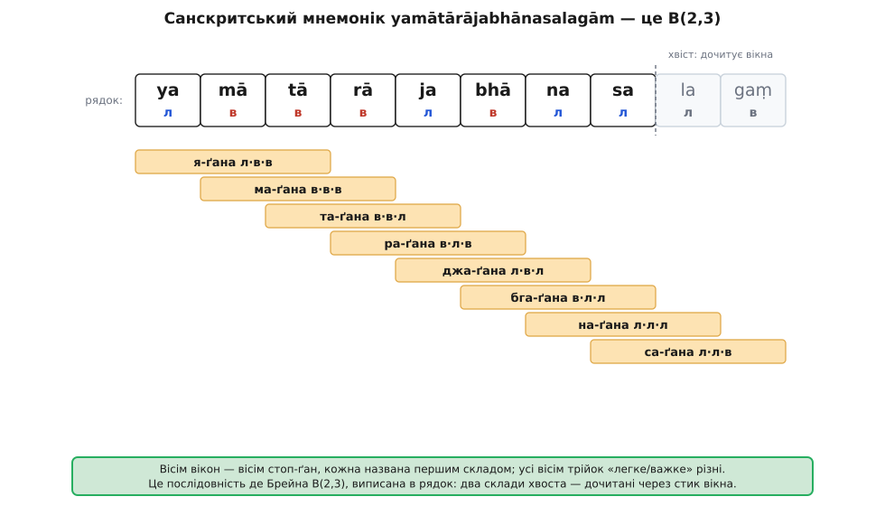
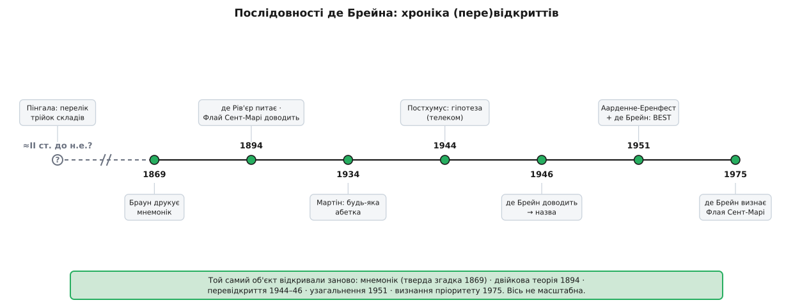

# 📜 Кільце, яке відкривали тричі

Послідовність де Брейна носить ім'я нідерландського математика, що довів її властивості 1946 року, — але він був щонайменше третім, хто натрапив на ці кільця, і сам чесно про це сказав. Той самий об'єкт відкривали незалежно принаймні тричі: санскритські віршознавці мали його як мнемонік, забутий француз довів усю двійкову теорію, а телеком-інженер натрапив на нього наново — і аж тоді до кілець пристала назва. Варто розкласти, хто що зробив, бо «відкрити» тут означає кілька різних речей.

## Санскритські просодисти: двійка зі складів

Найдавніший слід тягнеться на дві тисячі років назад і не має нічого спільного з графами чи бітами. Санскритському віршознавству треба було назвати ритмічні стопи, а склад у ньому буває рівно двох родів: *легкий* (laghu — короткий) і *важкий* (guru — довгий чи закритий). Це вже [двійковий](topic:math-number-theory/why-binary) поділ; трискладова стопа (ґана) — одна з 2³ = 8 можливих сполук легкого й важкого. Щоб утримати в пам'яті всі вісім стоп разом з їхніми назвами, хтось склав один десятискладовий рядок:

```
ya  mā  tā  rā  ja  bhā  na  sa  la  gaṃ
 л   в   в   в   л   в    л   л   л   в
```

Придивіться, як він працює. Кожне вікно з трьох підряд складів — це одна стопа, названа своїм **першим** складом: `ya-mā-tā` (л-в-в) — «я-ґана», `mā-tā-rā` (в-в-в) — «ма-ґана», `tā-rā-ja` (в-в-л) — «та-ґана», і так усі вісім, зсуваючись щоразу на склад. Вісім вікон — вісім різних трійок «легке/важке», кожна рівно раз. Це і є послідовність де Брейна `B(2,3)`, тільки виписана не кільцем, а в рядок: два зайві склади наприкінці — це дочитані «через стик» останні вікна. Рядок навіть підморгує: його хвіст `la-ga` — то й є скорочення самих слів *laghu* і *guru*, легке й важке, якими розмічають вірш.


*Мнемонік `yamātārājabhānasalagām`, розкладений на склади: легкий (л) чи важкий (в). Кожне з восьми вікон завширшки три вихоплює свою стопу-ґану, названу першим складом вікна; усі вісім трійок «легке/важке» різні. Це послідовність де Брейна `B(2,3)`, записана в рядок — задовго до модерної комбінаторики.*

Наскільки це давнє — сказати чесно годі. Сам мнемонік `yamātārājabhānasalagām` у друку найраніше засвідчений аж 1869 року, у книжці про санскритську просодію Чарлза Філіпа Брауна (Charles Philip Brown); традиція приписує рядок різним авторам (подеколи Паніні), проте твердого доказу глибшої давнини нема. А от **класифікація** самих трійок легкого й важкого — набагато старша: систематичний перелік усіх сполук складів заклав Пінгала (Piṅgala) у трактаті «Чхандах-шастра», який датують останніми століттями до н.е. (орієнтовно II ст. до н.е., хоча точна дата спірна). Тобто санскритська традиція **мала** цей об'єкт — але як мнемонічний трюк, спосіб запам'ятати, а не як доведену теорему. Ідея, ще не теорія.

## Забутий француз: Флай Сент-Марі, 1894

Перша справжня математика прийшла через задачник. 1894 року у французькому журналі задач-відповідей «L'Intermédiaire des Mathématiciens» («Посередник математиків») А. де Рів'єр (A. de Rivière) поставив питання: чи існує кільце з 2ⁿ нулів та одиниць, у якому трапляються всі 2ⁿ двійкових слів завдовжки `n`? Того ж року співвітчизник Каміль Флай Сент-Марі (Camille Flye Sainte-Marie) відповів — і не наполовину. Він довів, що таке кільце **існує**, і порахував, скільки їх різних: рівно

```
2^(2^(n−1) − n).
```

Це вся суть двійкової теорії — і існування, і точна лічба — надрукована за півстоліття до того, як з'явилася назва «послідовність де Брейна». А тоді відповідь у задачнику канула без сліду: ніхто на неї не послався, ніхто не став будувати далі. Результат був — розголосу не було.

## Нідерландське перевідкриття: Постхумус і де Брейн, 1944–1946

Удруге об'єкт виринув із інженерії. У дослідницькій лабораторії Philips, куди Ніколас Ґоверт де Брейн (Nicolaas Govert de Bruijn, 1918–2012) прийшов науковим співробітником у червні 1944-го, ці послідовності трапилися інженерові Кейсу Постхумусу (K. Posthumus), коли той вивчав імпульсні сигнали телекомунікації. Того-таки 1944 року Постхумус висловив **гіпотезу** — той самий підрахунок `2^(2^(n−1) − n)` для двійкового випадку. Де Брейн довів її 1946-го в короткій статті «Комбінаторна задача» (*A combinatorial problem*, Proc. KNAW **49**, с. 758–764; Indagationes Mathematicae **8**, с. 461–467), і саме через це доведення задача стала широко відомою.

Тим часом між французьким і нідерландським епізодами був ще один, теж загублений: 1934 року Монро Мартін дав спосіб будувати такі рядки для будь-якої абетки (жадібне правило «дописуй найбільший»). Ще одна ниточка, що ні до чого не приєдналася. А от цього разу результат **закріпився**: доведення де Брейна потрапило до широкого математичного обігу, на нього почали посилатися — і кільця дістали його ім'я. Чому його, а не Флая Сент-Марі й не Постхумуса? Бо ім'я пристає там, де спільнота читає й перевикористовує роботу. Ідею мали й раніше; відомою її зробив де Брейн.

## Чесність заднім числом: визнання пріоритету, 1975

Тут історія робить рідкісний поворот. Розшукавши згодом працю 1894 року, де Брейн 1975-го надрукував замітку з промовистою назвою «Визнання пріоритету К. Флая Сент-Марі» (*Acknowledgement of Priority to C. Flye Sainte-Marie*): людина, чиїм ім'ям названо об'єкт, сама показала пальцем на того, хто довів усе перший. Це чистий приклад **закону епонімії Стіглера** — іронічного спостереження, що відкриття рідко звуться на честь свого справжнього відкривача (і сам закон — теж приклад: Стіглер приписав його соціологові Мертону). Назви липкі, а не справедливі: вони мітять того, хто пустив ідею в люди, не завжди того, хто мав її першим.

## Таня Еренфест і теорема BEST, 1951

Лишилося ще одне «відкриття» — узагальнення, і з ним друга недооцінена постать. 1951 року де Брейн повернувся до задачі разом із Тетяною ван Аарденне-Еренфест (Tatyana van Aardenne-Ehrenfest) і вивів двійковий випадок за межі двійки — на будь-яку абетку, у статті «Кола й дерева в орієнтованих лінійних графах» (*Circuits and trees in oriented linear graphs*, Simon Stevin **28**, с. 203–217). Щоб порахувати кільця, довелося рахувати [ейлерові цикли](topic:math-combinatorics/graph-theory) орієнтованого графа, і формулу, яку вони довели — спираючись на працю Седріка Сміта й Вільяма Татта 1941 року, — сьогодні звуть **теоремою BEST**: абревіатура зшита з прізвищ de **B**ruijn, van Aardenne-**E**hrenfest, **S**mith, **T**utte.

Ван Аарденне-Еренфест — найтихіше ім'я в теоремі, яку вона наполовину створила. Народжена 1905 року у Відні, дочка фізика Пауля Еренфеста (Paul Ehrenfest), вона виросла в Санкт-Петербурзі, а з 1912-го — у нідерландському Лейдені; здобувши 1931 року докторат, вона так ніколи й не обійняла академічної посади. Та сама «E» посередині «BEST», яку більшість людей, що вимовляють назву теореми, навіть не розкладають на прізвище.

## Чотири різні «відкрив»

Варто тримати ці акти нарізно, бо кожен — інше значення слова. Санскритський рядок **мав** об'єкт — як пристрій пам'яті. Флай Сент-Марі **довів** двійкову теорію. Де Брейн зробив її **відомою**. Ван Аарденне-Еренфест **узагальнила** її на всі абетки. Жодного одного «першого», жодної одної нації: мнемонік санскритом, доведення французькою, перевідкриття нідерландською, узагальнення від математички, народженої у Відні й позбавленої кафедри.


*Той самий об'єкт знаходили знову й знову. Санскритська традиція мала його як мнемонік (тверда згадка — 1869); Флай Сент-Марі довів двійкову теорію 1894-го; Постхумус і де Брейн перевідкрили її 1944–46, звідки й назва; узагальнення й теорема BEST — 1951; визнання пріоритету — 1975. Вісь не масштабна.*

Ім'я на об'єкті — це зручність, а не вирок про те, кому він завдячує.
