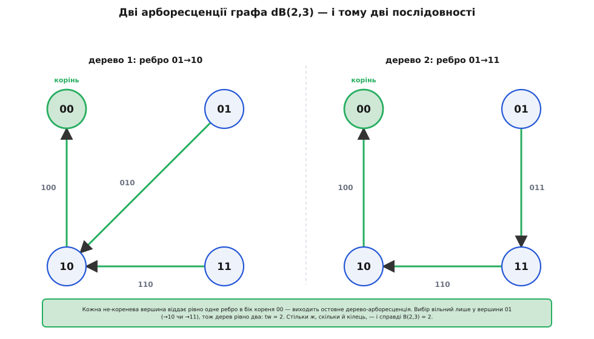

# 🧮 Скільки є послідовностей де Брейна: підрахунок через теорему BEST

Одна пара `(k, n)` задає не одне кільце де Брейна, а цілий рій — і їхнє число дається напрочуд стислою формулою `(k!)^(k^(n−1)) / kⁿ`, яку тут виведено від першого кроку до останнього. Шлях один-єдиний: кожне кільце — це ейлерів цикл у графі де Брейна, тож рахувати кільця означає рахувати ейлерові цикли, а їх лічить **теорема BEST**. Підставимо в неї збалансований граф де Брейна — і формула випаде сама; наприкінці дорахуємо перші значення руками й переконаємося, що вони сходяться.

<preknowlist>
- [Теорія графів](root:math-combinatorics/graph-theory) — орієнтований граф, вхідний і вихідний степінь вершини, ейлерів цикл (обхід кожного ребра рівно раз) та остовне дерево.
- [Власні вектори та власні значення](root:math-algebra/eigenvalues) — власне значення матриці, спектр і добуток власних значень: через них ми полічимо остовні дерева графа де Брейна.
</preknowlist>

## Що саме зводимо до чого

Нагадаю розклад, на якому все тримається. Граф де Брейна для пари `(k, n)` влаштований так: **вершини** — це всі слова завдовжки `n − 1`, отже їх `N = k^(n−1)`; **ребра** — усі слова завдовжки `n`, отже їх `m = kⁿ`. Ребро-слово веде від свого `(n−1)`-символьного префікса до `(n−1)`-символьного суфікса. З кожної вершини виходить рівно `k` ребер (праворуч можна дописати будь-який із `k` символів) і рівно стільки ж входить — граф **збалансований**, а ще й зв'язний.

Кільце де Брейна довжини `kⁿ`, прочитане ребро за ребром, — це замкнений маршрут, що проходить кожне ребро рівно раз, тобто **ейлерів цикл**; і навпаки, будь-який ейлерів цикл, якщо виписати символи його ребер, дає кільце де Брейна. Відповідність точна, тож питання «скільки кілець» дослівно те саме, що «скільки ейлерових циклів»:

```
число різних B(k, n)  =  число ейлерових циклів графа де Брейна.
```

Уся робота тепер — полічити ейлерові цикли одного конкретного графа.

## Теорема BEST: цикли через дерева

Загального рецепта «скільки в графі ейлерових циклів» довго не було — на відміну від простого критерію їх **існування**. Прорив у тім, щоб зачепити цикли за геть інший, легший для лічби об'єкт: за кореневі остовні дерева. Саме це й робить теорема BEST.

> 🔧 **Навіщо це.** Ейлерові цикли й остовні дерева на позір ніяк не пов'язані: одні бігають по ребрах, другі — застиглі каркаси без жодного циклу. Теорема BEST каже, що кількість перших повністю визначена кількістю других плюс дрібним локальним множником. Це той самий улюблений хід переліку — «полічи не те, що просять, а те, що легше, і покажи, що числа збігаються».

**Арборесценція** з коренем `w` — це остовне дерево графа, усі ребра якого спрямовані **в бік кореня**: з кожної не-кореневої вершини виходить рівно одне деревне ребро, і, йдучи за стрілками, з будь-якої вершини неминуче доходиш до `w`. Позначмо `tw` число таких арборесценцій. У збалансованому зв'язному графі це число **не залежить** від вибору кореня — воно однакове для всіх `w`, тож індекс можна опустити.

Теорема BEST (для зв'язного орієнтованого графа, де в кожній вершині вхідний степінь дорівнює вихідному) стверджує:

```
ec(G)  =  tw(G) · ∏  (deg⁺(v) − 1)!
                  v
```

Тут `ec(G)` — число ейлерових циклів, `deg⁺(v)` — вихідний степінь вершини `v`, а добуток береться по всіх вершинах. Локальний множник читається прозоро: у кожній вершині ейлерів цикл, заходячи в неї `deg⁺(v)` разів, щоразу обирає, яким із ще не пройдених вихідних ребер піти; `(deg⁺(v) − 1)!` — це число способів упорядкувати ці виходи (один із них «прив'язаний» до заходу ззовні, решту `deg⁺(v) − 1` можна переставляти вільно). Арборесценції ж стежать за глобальним: щоб локальні перестановки склалися в **один** суцільний цикл, а не розпалися на кілька роз'єднаних, — і саме дерево, спрямоване до кореня, задає той кістяк, уздовж якого все зшивається докупи.

Лічити цикли треба обережно щодо того, що вважати «тим самим» циклом. `ec(G)` рахує ейлерові цикли як **циклічні** об'єкти: два обходи — це один цикл, якщо різняться лише точкою, з якої почато обхід (циклічним зсувом). Рівнозначно: закріпимо одне ребро й лічитимемо тільки маршрути, що стартують саме з нього, — кожен циклічний клас має рівно один такий представник, бо кожне ребро в циклі трапляється один раз. Отже одне кільце де Брейна ↔ один ейлерів цикл у цьому сенсі, і `число кілець = ec(G)` без жодних поправок.

Назва «BEST» — не «найкраща», а склад із чотирьох прізвищ, підібраний так, щоб читалося слово *best*: de **B**ruijn, van Aardenne-**E**hrenfest, **S**mith, **T**utte. Документована історія така: британці Седрік Сміт і Вільям Татт довели ранню версію 1941 року, а нідерландці Тетяна ван Аарденне-Еренфест і Ніколас де Брейн 1951-го узагальнили її й застосували саме до кілець де Брейна. Порядок літер в акронімі не хронологічний — його склали пізніше заради красивого слова, хоча за часом першими були Сміт із Таттом.

## Легка половина: локальний множник

Підставмо граф де Брейна. Усі його вершини однакові з погляду степеня: `deg⁺(v) = k` в кожної. Тому локальний множник згортається миттєво — в добутку `N = k^(n−1)` однакових співмножників:

```
∏ (deg⁺(v) − 1)!  =  ((k − 1)!)^(k^(n−1)).
v
```

Отже вся формула вже зведена до однієї невідомої величини:

```
ec(G)  =  tw(G) · ((k − 1)!)^(k^(n−1)).
```

Лишилося єдине по-справжньому змістовне: полічити `tw` — число арборесценцій графа де Брейна.

## Важка половина: скільки арборесценцій

Тут у гру вступає [матрична теорема про дерева](root:math-combinatorics/matrix-tree-theorem) (Кірхгофова): число остовних дерев виражається через **лапласіан** графа. Для орієнтованого випадку вона дає `tw` як діагональний мінор матриці `L = D − A`, де `A` — матриця суміжності (`A[u][v]` = число ребер із `u` в `v`), а `D` — діагональ вихідних степенів. У нашому графі `D = k·I` (усі степені дорівнюють `k`), тож `L = k·I − A`. Зручний наслідок теореми для збалансованого графа — через власні значення: усі `N` діагональних мінорів рівні між собою (це і є те саме `tw` для будь-якого кореня), а їхня сума дорівнює добутку ненульових власних значень лапласіана. Коротко:

```
N · tw  =  добуток ненульових власних значень L.
```

Отже все зводиться до **спектра** графа де Брейна. І тут його чекає одна дуже гарна властивість.

**Ключове спостереження: за `n − 1` крок граф забуває, звідки ти вийшов.** Пройдімо будь-яку кількість ребер: кожен крок дописує праворуч один символ і виштовхує ліворуч найстаріший. За `n − 1` крок усе початкове `(n−1)`-символьне слово повністю виштовхується, і поточна вершина — це рівно ті `n − 1` символів, які ми щойно дописали, хоч би з якої вершини стартували. Тому з будь-якої вершини `u` в будь-яку вершину `v` веде **рівно один** шлях завдовжки `n − 1`: треба дописати саме символи `v`, іншого способу нема. А «число шляхів завдовжки `n − 1` з `u` в `v`» — це рівно елемент `A^(n−1)[u][v]`. Раз усі ці елементи дорівнюють одиниці:

```
A^(n−1)  =  J     (матриця з самих одиниць, розміру N × N).
```

Спектр матриці `J` відомий і простий: одне власне значення `N` (з власним вектором «усі одиниці») і `N − 1` власних значень, рівних нулю. А `A^(n−1) = J` означає, що кожне власне значення `A`, піднесене до степеня `n − 1`, дає власне значення `J`. Вектор «усі одиниці» — спільний для обох: `A·1 = k·1` (кожен рядок `A` сумує до `k`), тобто `k` — власне значення `A`, і справді `k^(n−1) = N`. Кожне інше власне значення `λ` мусить задовольняти `λ^(n−1) = 0`, тобто `λ = 0`. Отже спектр графа де Брейна гранично бідний:

```
власні значення A:   k  (одне),   0  (решта N − 1).
```

Звідси спектр лапласіана `L = k·I − A` виходить зсувом: `k − k = 0` (одне) і `k − 0 = k` (усі інші `N − 1`). Добуток ненульових власних значень — це `k`, помножене саме на себе `N − 1` разів:

```
добуток ненульових власних значень L  =  k^(N − 1).
```

Підставмо в наслідок теореми про дерева й дорахуємо `tw`, пам'ятаючи, що `N = k^(n−1)`:

```
N · tw  =  k^(N − 1)
tw      =  k^(N − 1) / N  =  k^(N − 1) / k^(n−1)  =  k^(N − n)  =  k^(k^(n−1) − n).
```


*Найменший випадок наочно. Арборесценція з коренем `00` — остовне дерево, усі ребра якого дивляться в корінь. Кожна з трьох не-кореневих вершин віддає рівно одне ребро; вибір вільний тільки у вершини `01` (вести до `10` чи до `11`), тож дерев рівно два: `tw = 2`. Формула дає те саме: `k^(k^(n−1) − n) = 2^(2² − 3) = 2¹ = 2`.*

## Складаємо формулу

Обидві половини готові — перемножмо їх:

```
ec(G)  =  tw · ((k − 1)!)^(k^(n−1))
       =  k^(k^(n−1) − n) · ((k − 1)!)^(k^(n−1)).
```

Розділимо `k^(k^(n−1) − n)` на два множники: `k^(k^(n−1) − n) = k^(k^(n−1)) / kⁿ`. Тепер степінь `k^(k^(n−1))` стає під той самий показник `k^(n−1)`, що й `(k − 1)!`, і вони зливаються — бо `k · (k − 1)! = k!`:

```
ec(G)  =  ( k^(k^(n−1)) · ((k − 1)!)^(k^(n−1)) ) / kⁿ
       =  ( k · (k − 1)! )^(k^(n−1)) / kⁿ
       =  (k!)^(k^(n−1)) / kⁿ.
```

Оце й є шукана формула — число різних послідовностей де Брейна `B(k, n)`. Для двійкового випадку `k = 2` факторіал `(k − 1)! = 1! = 1` зникає, а `(2!)^(...) = 2^(...)`, і все стягується до

```
число B(2, n)  =  2^(2^(n−1) − n).
```

**Що означає це `/ kⁿ`.** Формула носить на собі поділ на `kⁿ` — і в нього прозорий сенс. Чисельник `(k!)^(k^(n−1))` дорівнює `kⁿ · (число кілець)`: це ті самі цикли, але прочитані як **лінійні** рядки, кожен зі своєю позначеною стартовою точкою. У кільця довжини `kⁿ` таких стартів рівно `kⁿ` — по одному на кожне ребро, — і всі `kⁿ` прочитань різні, бо в послідовності де Брейна жоден циклічний зсув не дає її самої (усі `kⁿ` вікон різні, отже й усі зсуви різні). Поділ на `kⁿ` якраз і склеює ці `kⁿ` зсувів одного кільця назад в одне кільце. Теорема BEST одразу видає число кілець; стандартний запис `(k!)^(k^(n−1)) / kⁿ` пакує те саме число як «лінійні прочитання, поділені на число стартів».

## Перші значення

Найкраща перевірка — дорахувати кілька чисел до кінця. Двійковий ряд `k = 2` вибухає двічі-експоненційно:

```
B(2, 3):  2^(2² − 3)  =  2^(4 − 3)   =  2^1   =  2
B(2, 4):  2^(2³ − 4)  =  2^(8 − 4)   =  2^4   =  16
B(2, 5):  2^(2⁴ − 5)  =  2^(16 − 5)  =  2^11  =  2048
B(2, 6):  2^(2⁵ − 6)  =  2^(32 − 6)  =  2^26  =  67108864
```

Значення `B(2, 3) = 2` можна звірити оком: два кільця — це `00010111` та його дзеркальне `00011101`, і жодним поворотом одне в друге не переходить. А до `n = 6` кілець уже понад шістдесят сім мільйонів.

Щоб пересвідчитися, що формула працює й для більшої абетки, візьмімо `k = 3`, `n = 2` — і пройдімо весь ланцюжок величин, а не лише кінцевий вислів:

```
граф dB(3, 2):  N = 3^1 = 3 вершини,  m = 3² = 9 ребер,  кожен степінь = 3
tw          =  k^(k^(n−1) − n)  =  3^(3 − 2)      =  3^1  =  3
∏(deg−1)!   =  ((3 − 1)!)^3     =  (2!)^3         =  2^3  =  8
ec(G)       =  tw · ∏           =  3 · 8          =  24

пряма формула:  (3!)^(3^1) / 3²  =  6^3 / 9  =  216 / 9  =  24.
```

Обидва шляхи дають `B(3, 2) = 24` — і збігаються з `ec = 24`. Той самий приклад показує й сенс `/ kⁿ` у числах: чисельник `216` — це число лінійних прочитань, `9` різних стартів на кожне кільце, і `216 / 9 = 24` кілець.
