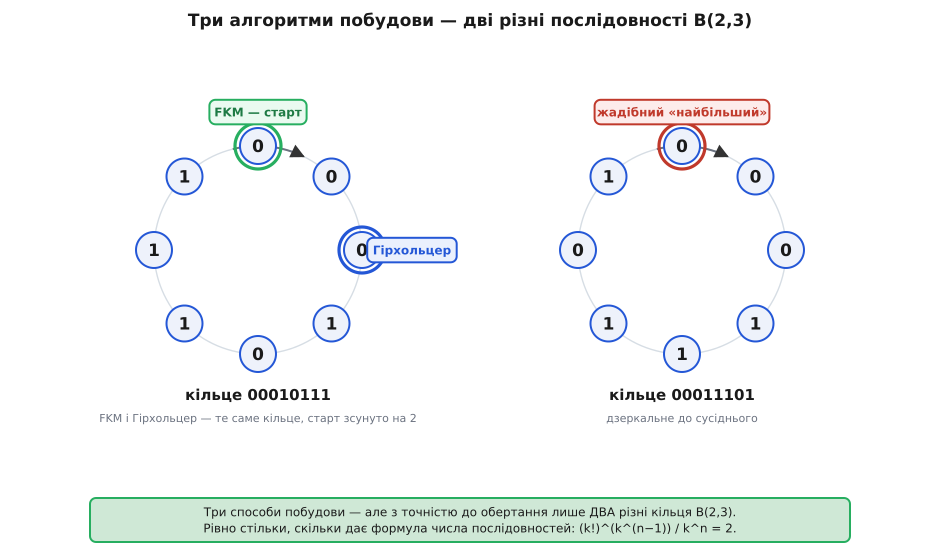

# ⚙️ Три способи скласти послідовність де Брейна

Довести, що потрібне кільце існує, — це ще не мати його на руках: доведення каже «десь воно є», а програмі потрібні самі символи, один за одним. Тут — три алгоритми, що видають ці символи для будь-яких `k` і `n`, кожен зі своїм характером. Перший універсальний і працює скрізь. Другий такий простий, що вміщається в голові, і водночас так дивно правильний, що в це не одразу віриться. Третій витрачає стільки пам'яті, скільки завдовжки одне слово, — і тому будує кільце, яке в пам'ять не влазить. Усі троє ми звіримо з еталоном `B(2, 3) = 00010111`.

Мова тут подвійна навмисно: **Python** — щоб алгоритм було видно голим, і **C++** — щоб було видно, як він виглядає, коли важить швидкість і пам'ять. У кожній вкладці код ідіоматичний для своєї мови, а не переписаний символ у символ.

## Спосіб 1: ейлерів цикл (Гірхольцер) — універсальний

Найпрямолінійніший шлях бере задачу такою, яка вона є: послідовність де Брейна — це ейлерів цикл у графі де Брейна, тож просто знайдімо його. [Ейлерів цикл](topic:math-combinatorics/graph-theory) — маршрут, що проходить кожне ребро рівно раз і замикається на старті; в орієнтованому графі він існує тоді й лише тоді, коли граф зв'язний і в кожній вершині вхідний степінь дорівнює вихідному. Граф де Брейна обидві умови задовольняє, тож цикл є завжди — лишається його побудувати.

Головна хитрість реалізації в тому, що граф **не треба будувати**. Його вершини — слова довжини `n − 1` — це просто числа `0 … kⁿ⁻¹ − 1`, а ребро «дописати символ `c`» веде з вершини `v` у вершину `(v·k + c) mod kⁿ⁻¹` (домножили на `k`, додали `c`, відкинули старший розряд). Ані списку вершин, ані матриці суміжності: усе рахується на льоту.

Будує цикл алгоритм Гірхольцера. Іди невитраченими ребрами, поки не застрягнеш; застрягти можна лише на старті (баланс степенів гарантує це), тож вийде замкнений обхід. Якщо він захопив не всі ребра — знайди на ньому вершину з невитраченими ребрами, пусти з неї другий обхід і вклей його в перший. На практиці все це робить один стек: коли з поточної вершини є вихід — заходимо глибше; коли виходу нема — знімаємо вершину зі стека й **дописуємо** пройдене ребро у відповідь. Написи, зібрані на відкоті й обернені, і є послідовність.

> 🔧 **Навіщо стек, а не рекурсія.** Наївний Гірхольцер пишуть рекурсивно — і на великому графі він валить програму. Глибина рекурсії дорівнює довжині обходу, тобто **числу ребер** `kⁿ`; уже для `B(2, 25)` це 33 мільйони вкладених викликів, і стек викликів переповнюється задовго до відповіді. Явний стек у купі знімає стелю: пам'ять росте там, де її багато, а не на тоненькому стеку викликів.

:::tabs
```python
def de_bruijn_hierholzer(k, n):
    m = k ** (n - 1)                 # вершини: слова довжини n-1, як числа 0..m-1
    nxt = [0] * m                    # наступний невитрачений вихідний символ вершини
    stack = [(0, -1)]                # (вершина, символ ребра, яким сюди зайшли)
    seq = []
    while stack:
        v, sym = stack[-1]
        if nxt[v] < k:               # є ще невитрачене ребро — заходимо глибше
            c = nxt[v]
            nxt[v] += 1
            stack.append(((v * k + c) % m, c))
        else:                        # глухий кут — відступаємо, записуючи ребро
            stack.pop()
            if sym != -1:
                seq.append(sym)
    seq.reverse()
    return seq
```
```cpp
#include <vector>
#include <utility>
#include <algorithm>

std::vector<int> de_bruijn_hierholzer(int k, int n) {
    std::size_t m = 1;                             // m = k^(n-1) — число вершин
    for (int i = 0; i < n - 1; ++i) m *= static_cast<std::size_t>(k);

    std::vector<int> nxt(m, 0);                    // наступний невитрачений символ вершини
    std::vector<std::pair<std::size_t, int>> stack{ {0, -1} };  // (вершина, ребро-вхід)
    std::vector<int> seq;

    while (!stack.empty()) {
        auto [v, sym] = stack.back();
        if (nxt[v] < k) {                          // є невитрачене ребро — глибше
            int c = nxt[v]++;
            stack.push_back({ (v * k + c) % m, c });
        } else {                                   // глухий кут — відступ із записом
            stack.pop_back();
            if (sym != -1) seq.push_back(sym);
        }
    }
    std::reverse(seq.begin(), seq.end());
    return seq;
}
```
:::

Складність: кожне з `kⁿ` ребер один раз кладеться на стек і один раз знімається, тож час **O(kⁿ)** — лінійний за довжиною відповіді, швидше нікуди. Пам'ять теж **O(kⁿ)**: стек у найгіршому разі тримає майже весь обхід. Це універсальний спосіб — жодних умов на `k, n`, — і єдиний, що легко дає **будь-яку** з наявних послідовностей, якщо перебирати ребра в різному порядку. Ціна універсальності — та сама пам'ять `O(kⁿ)`, від якої два наступні способи частково втечуть.

## Спосіб 2: жадібний «дописуй найбільший» (Мартін, 1934)

Тепер правило, яке можна пояснити дитині: **почни з `n` нулів і щоразу дописуй найбільший символ, від якого нове вікно завширшки `n` ще не траплялося; коли жоден символ не годиться — спинись.** І все; результат — ціла послідовність де Брейна.

У цьому місці варто спинитися й здивуватися. Сліпа жадібність у графі де Брейна легко заганяє в глухий кут — обхід замикається, коли пройдено ще не всі ребра. Чому ж **це** правило не замикається зарано? Відповідь несподівана: жадібний обхід із дописуванням найбільшого символу — це насправді той самий ейлерів обхід, тільки з жорстко зафіксованим вибором ребра (завжди найбільше невитрачене). Монро Мартін 1934 року довів нетривіальний факт: старт із усіх нулів разом із правилом «найбільший першим» влаштовані так, що обхід вичерпує ребра кожної вершини рівно в тому порядку, який дозволяє застрягнути **лише наприкінці**, коли пройдено вже все. Ніякого вклеювання, як у загального Гірхольцера, не потрібно — одним проходом.

Доводити тут не будемо; важливо, що це доведено й що правило нічого не «вгадує». Ось як воно будує `B(2, 3)`:

**Жадібний «найбільший» на `k = 2, n = 3`: старт `000`, щоразу пробуємо `1`, тоді `0`.**

```
000            вікна: {000}
000 → +1       001 нове   → 0001
001 → +1       011 нове   → 00011
011 → +1       111 нове   → 000111
111 → 1?110... +0  110 нове → 0001110
110 → +1       101 нове   → 00011101
101 → 1?011×  +0  010 нове → 000111010
010 → 1?101×  +0  100 нове → 0001110100
100 → 1?001×  0?000× — глухий кут, стоп
```

Перші `2³ = 8` символів — це циклічна відповідь: `00011101`. Решта — «хвіст» довжини `n − 1`, потрібний лише лінійному рядку, щоб дочитати вікна через стик.

:::tabs
```python
def de_bruijn_greedy(k, n):
    seq = [0] * n                          # старт: n нулів
    seen = {tuple(seq)}                    # єдине поки що вікно
    while True:
        tail = tuple(seq[len(seq) - (n - 1):])       # останні n-1 символів
        c = next((s for s in range(k - 1, -1, -1)    # найбільший символ,
                  if tail + (s,) not in seen), None)  # що не повторює вікна
        if c is None:                      # жоден не годиться — стоп
            break
        seq.append(c)
        seen.add(tail + (c,))
    return seq[:k ** n]                     # циклічна частина
```
```cpp
#include <vector>

std::vector<int> de_bruijn_greedy(int k, int n) {
    std::size_t kn = 1;                          // kn = k^n
    for (int i = 0; i < n; ++i) kn *= static_cast<std::size_t>(k);
    std::size_t kn1 = kn / k;                    // k^(n-1)

    std::vector<char> seen(kn, 0);               // вікна кодуємо числом 0..k^n-1
    std::vector<int> seq(n, 0);
    std::size_t win = 0;                         // код поточного вікна довжини n
    seen[0] = 1;                                 // вікно з самих нулів

    while (true) {
        std::size_t base = (win % kn1) * k;      // відкинули старший символ, зсунули
        int chosen = -1;
        for (int c = k - 1; c >= 0; --c)         // найбільший символ першим
            if (!seen[base + c]) { chosen = c; break; }
        if (chosen < 0) break;                   // жоден не годиться — стоп
        seq.push_back(chosen);
        win = base + chosen;
        seen[win] = 1;
    }
    seq.resize(kn);                              // циклічна частина
    return seq;
}
```
:::

У Python вікна — кортежі в множині: читається як означення. У C++ вікно спаковане в число (`win % kⁿ⁻¹ · k + c` — той самий зсув, що й у графі), а `seen` — плаский масив бітів; перевірка й позначка коштують по одній дії. Час — **O(k · kⁿ)** (на кожен із `kⁿ` символів скануємо до `k` кандидатів), пам'ять — **O(kⁿ)** на масив `seen`.

Дві пастки. Перша: `seen` займає `kⁿ` комірок, тож потокувати вихід при браку пам'яті цей спосіб не вміє — рівно як і Гірхольцер. Друга приємніша: «найбільший першим» дає **лексикографічно найбільшу** послідовність (`00011101`), а дзеркальне «найменший першим» — **найменшу** (`00010111`). Обидві — законні `B(2, 3)`; яку саме ви отримаєте, вирішує лише напрям жадібності.

## Спосіб 3: конкатенація слів Ліндона (FKM)

Найощадніший спосіб не будує ні графа, ні таблиці вікон — він виписує послідовність майже без пам'яті, спираючись на класичний об'єкт комбінаторики слів. [Слово Ліндона](topic:math-combinatorics/lyndon-word) — непорожнє слово, строго менше за кожне своє нетривіальне обертання (циклічний зсув); рівносильно — воно аперіодичне (не є коротшим словом, повтореним кілька разів) і водночас найменше серед усіх своїх обертань. Над `{0, 1}` найкоротші з них: `0`, `1`, `01`, `001`, `011`, `0001`, `0011`, `0111`. А `00` — ні (це `0`, повторене двічі), `10` — ні (обертання `01` менше), `010` — ні (обертання `001` менше).

Побудова Фредріксена, Кесслера й Майорани (FKM; зв'язок зі словами Ліндона встановили Fredricksen та Maiorana, 1978) звучить так: **випиши поспіль, у лексикографічному порядку, усі слова Ліндона над абеткою з `k` символів, чия довжина ділить `n`, — вийде лексикографічно найменша `B(k, n)`.** Умова «довжина ділить `n`» не з повітря: кожне з `kⁿ` слів довжини `n` належить до якогось «намиста» (класу за обертанням), і намисто з періодом `d` (а період завжди ділить `n`) представлене словом Ліндона довжини рівно `d`. Сума `Σ d·(число слів Ліндона довжини d)` по всіх `d ∣ n` дорівнює точно `kⁿ` — тому конкатенація й видає рівно `kⁿ` символів, ні більше ні менше.

**FKM на `k = 2, n = 3`: дільники трійки — 1 і 3, беремо слова Ліндона довжини 1 і 3.**

```
довжина 1:  0, 1
довжина 3:  001, 011
лекс. порядок:  0  <  001  <  011  <  1
конкатенація:   0 · 001 · 011 · 1  =  00010111
```

Рівно наш еталон. Генерувати ці слова окремо й сортувати не треба — короткий рекурсивний генератор видає їх уже впорядкованими:

:::tabs
```python
def de_bruijn_fkm(k, n):
    a = [0] * (n + 1)               # a[1..n] — поточне слово-кандидат
    seq = []
    def gen(t, p):                  # t: заповнено символів; p: довжина періоду
        if t > n:
            if n % p == 0:          # період p ділить n → слово Ліндона довжини p
                seq.extend(a[1:p + 1])
        else:
            a[t] = a[t - p]         # менша гілка: продовжити період
            gen(t + 1, p)
            for c in range(a[t - p] + 1, k):   # більший символ рве період
                a[t] = c
                gen(t + 1, t)
    gen(1, 1)
    return seq
```
```cpp
#include <vector>
#include <functional>

std::vector<int> de_bruijn_fkm(int k, int n) {
    std::vector<int> a(n + 1, 0), seq;
    std::function<void(int, int)> gen = [&](int t, int p) {   // t: довжина; p: період
        if (t > n) {
            if (n % p == 0)                                   // період p ділить n
                seq.insert(seq.end(), a.begin() + 1, a.begin() + p + 1);
        } else {
            a[t] = a[t - p];                                  // менша гілка: тягнемо період
            gen(t + 1, p);
            for (int c = a[t - p] + 1; c < k; ++c) {          // більший символ — новий період
                a[t] = c;
                gen(t + 1, t);
            }
        }
    };
    gen(1, 1);
    return seq;
}
```
:::

Як воно працює: `a[1..t]` завжди тримається «пренамистом» — найменшим лексикографічно продовженням, а `p` стежить за довжиною найдовшого префікса, що вже є словом Ліндона (поточний період). Гілка `a[t] = a[t−p]` тягне той самий період далі; гілки з більшим символом починають свіже слово Ліндона довжини `t`. Обхід іде за зростанням, тож слова виходять уже в лексикографічному порядку, а коли `p ∣ n` — виписуємо `a[1..p]`.

І ось чому цей спосіб окремий від двох попередніх. Пам'яті він тримає лише масив `a` довжини `n + 1` — **O(n)**, а не `O(kⁿ)`. Рекурсія теж углиб не більш ніж `n`, тож переповнення стека, від якого ми рятували Гірхольцера, тут неможливе в принципі: глибина не залежить від довжини виходу. Символи народжуються по одному з амортизовано сталою роботою на символ, тож FKM спокійно **потокує** кільце, яке не вмістилося б у пам'ять цілком, — саме те, чого не вміють ні Гірхольцер, ні жадібний.

## Звірка: три виходи, два кільця

Проженемо всі три на `B(2, 3)` і подивімося, що вони дали:

**Вихід трьох способів для `k = 2, n = 3` (циклічна частина, 8 символів).**

```
FKM        →  00010111     (лексикографічно найменша)
жадібний   →  00011101     (лексикографічно найбільша)
Гірхольцер →  01011100     (старт із вершини 00, найменше ребро першим)
```

На перший погляд три різні рядки. Але послідовність де Брейна — об'єкт **циклічний**, тож рядки треба порівнювати з точністю до обертання. І тоді `01011100` виявляється тим самим кільцем, що й `00010111`, лише прочитаним із позиції 2 (відкинь `00` спереду, підклей ззаду). Отже Гірхольцер і FKM видали **одне й те саме кільце**, а жадібний — його дзеркало. Різних кілець рівно два — рівно стільки, скільки й обіцяє формула числа послідовностей `(k!)^(kⁿ⁻¹) / kⁿ`, що для `B(2, 3)` дає `2⁴ / 8 = 2`. Три алгоритми не могли дати більше двох по суті різних відповідей, бо їх усього дві.


*Три алгоритми — дві відповіді. FKM і Гірхольцер лягають на одне кільце (`00010111`), відрізняючись тільки точкою старту; жадібний «найбільший» дає дзеркальне кільце (`00011101`). Більше двох різних кілець `B(2, 3)` не буває — стільки й дає формула підрахунку.*

Та сама звірка на `B(2, 4)`: FKM видає `0000100110101111`, жадібний — `0000111101100101`, Гірхольцер — `0100110101111000`; усі три завдовжки 16 і містять кожне з 16 чотирибітових слів рівно раз, а різних кілець тут уже шістнадцять. Збіг довжини й повнота вікон — найпростіша перевірка, яку варто прогнати на будь-якій новій реалізації: довжина рівно `kⁿ` і рівно `kⁿ` різних вікон.

> 🔧 **Що обрати.** Потрібне **будь-яке** кільце для довільних `k, n` і пам'ять не проблема — бери Гірхольцера: лінійний, універсальний, дає яку завгодно з наявних послідовностей. Потрібно швидко пригадати спосіб «на серветці» — жадібний «найбільший»; він теж тримає `O(kⁿ)` пам'яті, зате вміщається в один абзац. А коли `n` велике й кільце в пам'ять не влазить — лишається лише FKM: **O(n)** пам'яті, потокова видача, амортизовано стала робота на символ і передбачувано найменша за абеткою відповідь. Саме FKM стоїть усередині бібліотек, коли послідовність де Брейна треба згенерувати всерйоз.
