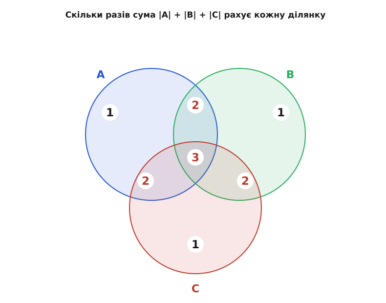
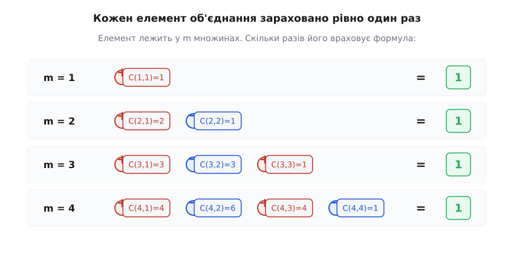
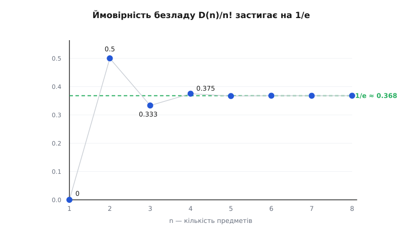

# Принцип включення-виключення

<preknowlist>
- [Теорія множин](topic:math-logic/set-theory) — об'єднання, перетин і доповнення множин, потужність |A| (скільки в множині елементів).
- [Комбінації і біноміальний коефіцієнт](topic:math-combinatorics/combinations) — число C(n,k) і біноміальна теорема: розклад (1 + x)ⁿ за степенями.
- [Перестановки і факторіал](topic:math-combinatorics/permutations) — факторіал n! і що таке перестановка n предметів.
</preknowlist>

Скільки чисел від 1 до 1000 діляться на 2, на 3 або на 5?

Кожну частину порахувати легко. Кратних двійці — рівно половина, 500. Кратних трійці — 333. Кратних п'ятірці — 200. Здається, лишилось скласти три купи:

```
500 + 333 + 200 = 1033
```

Але тисяча чисел не може містити 1033 своїх — їх усього тисяча. Відповідь хибна ще до перевірки, і хиба не в арифметиці, а в самому додаванні. Число 6 ділиться і на 2, і на 3 — його порахували в обох купах, двічі. Число 30 ділиться на 2, на 3 і на 5 — воно потрапило в усі три купи, тричі. Складаючи розміри, ми поставили спільні числа на облік по кілька разів, і сума роздулась.

Звідси й уся задача. Треба вміти рахувати, скільки **різних** елементів у кількох множинах, що перекриваються, коли пряме додавання їхніх розмірів бреше через повторний облік. Ідея ліку проста, як полагодити переважений рахунок: додати все, **відняти** те, що враховано зайвий раз, а тоді придивитися, чи не відняли ми, бува, забагато, — і відновити. Доведене до кінця, це й є принцип включення-виключення (лат. *inclusio* — включення, *exclusio* — виключення).

## Дві множини: полагодити подвійний облік

Найпростіший випадок — дві множини A і B. Складемо |A| + |B|. Кожен елемент, що лежить **лише** в A, порахований один раз; кожен лише в B — теж один раз. А ті, що лежать одночасно і в A, і в B, — тобто в перетині A ∩ B, — порахувалися двічі: один раз у складнику |A|, другий раз у |B|.

Надлишок точно відомий: він дорівнює числу таких спільних елементів, |A ∩ B|. Віднімемо його один раз — і кожен спільний елемент з двох облікових позицій опуститься до однієї, як і всі інші:

```
|A ∪ B| = |A| + |B| − |A ∩ B|
```

Це вже повний закон для двох множин. У задачі-зачині для чисел, кратних 2 або 3, він дав би: 500 + 333 − (кратних 6), тобто 500 + 333 − 166 = 667. Жодного роздування — спільні числа враховано рівно раз.

## Три множини: надлишок від надлишку

З трьома множинами напрошується той самий рух: додати три розміри, відняти три попарні перетини. Але тут ховається пастка, і саме вона робить принцип нетривіальним.

Розгляньмо три круги, що перекриваються, і придивімося, **скільки разів** сума |A| + |B| + |C| враховує кожну ділянку.


*Сама лише сума розмірів рахує одинарні ділянки один раз, кожну попарну — двічі, а серцевину, що належить усім трьом, — тричі. Виправлення має опустити кожне число до одиниці: попарні надлишки — відняти, а перевіднятій серцевині — повернути належне.*

Одинарні ділянки (елемент лише в одному крузі) враховано раз — з ними все гаразд. Кожну попарну ділянку (наприклад, у A і B, але не в C) враховано двічі. Серцевину, спільну всім трьом, — тричі.

Віднімемо три попарні перетини: |A ∩ B|, |A ∩ C|, |B ∩ C|. Попарні ділянки, що були враховані двічі, опустяться до одного разу — добре. Але що станеться із серцевиною? Вона лежить у **кожному** з трьох попарних перетинів, тож віднялась тричі. Була врахована тричі, відняли тричі — тепер вона враховується **нуль** разів, зникла з ліку зовсім. Ми відняли забагато.

Полагодити просто: повернути серцевину один раз, додавши |A ∩ B ∩ C|. Тепер і вона врахована рівно раз:

```
|A ∪ B ∪ C| = |A| + |B| + |C|
            − |A ∩ B| − |A ∩ C| − |B ∩ C|
            + |A ∩ B ∩ C|
```

Тепер задача-зачин доводиться до кінця. Для дільників 2, 3, 5 у межах тисячі попарні перетини — це кратні добуткам 6, 10, 15, а спільна серцевина — кратні 30:

```
|div 2 ∪ div 3 ∪ div 5|
   =  500 + 333 + 200        (кратні 2, 3, 5)
   −  166 − 100 −  66        (кратні 6, 10, 15)
   +   33                    (кратні 30)
   =  734
```

Отже, від 1 до 1000 діляться бодай на одне з чисел 2, 3, 5 — рівно 734 числа. Роздуте 1033 стиснулось до правдивого 734 двома хвилями поправок: спершу зняли попарний надлишок, потім повернули те, що зняли зайве із серцевини.

## Загальний закон і його ритм

Видно ритм: додати, відняти, додати… чергуючи знак і щоразу переходячи до перетинів на один глибше. Для будь-якого числа множин A₁, A₂, …, Aₙ закон читається так:

```
|A₁ ∪ A₂ ∪ … ∪ Aₙ| = S₁ − S₂ + S₃ − … + (−1)ⁿ⁺¹ Sₙ
```

де кожне Sₖ — це сума розмірів **усіх** перетинів рівно k множин:

```
S₁ = |A₁| + |A₂| + … + |Aₙ|                       (усі поодинці)
S₂ = |A₁∩A₂| + |A₁∩A₃| + … + |Aₙ₋₁∩Aₙ|            (усі пари)
S₃ = |A₁∩A₂∩A₃| + …                                (усі трійки)
…
Sₙ = |A₁ ∩ A₂ ∩ … ∩ Aₙ|                           (одна-єдина)
```

У сумі Sₖ доданків стільки, скільки є способів вибрати k множин із n, тобто C(n,k) штук. Знак чергується: непарні рівні (перетини непарної кратности) додаються, парні віднімаються.

Тут природно спитати: чому чергування знаків **рятує** саме до кінця, для будь-якого n? Що для трьох множин серцевину повертають один раз — ми побачили руками. Але звідки певність, що для десяти множин глибші поправки не залишать якусь ділянку врахованою двічі чи взагалі з від'ємним обліком? Відповідь на це — не перелік випадків, а один короткий доказ, і він тримає весь принцип.

## Чому знаки саме такі

Візьмімо один-єдиний елемент x з об'єднання й простежмо його долю через усю формулу. Нехай він лежить рівно в m множинах із n (m ≥ 1, бо він таки в об'єднанні). Питання одне: скільки разів формула його зараховує?

У суму S₁ елемент x дає внесок за кожну множину, до якої належить, — тобто m разів, або C(m,1). У суму S₂ він входить за кожну **пару** «своїх» множин, бо лежить у перетині будь-яких двох із них, — це C(m,2) разів. Загалом у Sₖ елемент зараховується стільки разів, скількома способами можна вибрати k множин **із його власних m**, тобто C(m,k). До множин, яким x не належить, йому байдуже: у перетин, що містить хоч одну чужу множину, він не потрапляє.

Складімо його загальний облік із чергуванням знаків формули:

```
внесок x = C(m,1) − C(m,2) + C(m,3) − … + (−1)ᵐ⁺¹ C(m,m)
```

Щоб принцип був правдивий, ця величина мусить дорівнювати рівно 1 — незалежно від m. І вона таки дорівнює, а ключ — біноміальна теорема. Розкладім (1 − 1)ᵐ за біномом:

```
(1 − 1)ᵐ = C(m,0) − C(m,1) + C(m,2) − … + (−1)ᵐ C(m,m) = 0
```

Ліва частина — це нуль у степені m, тобто просто 0. Перенесімо C(m,0) = 1 в інший бік:

```
C(m,1) − C(m,2) + C(m,3) − … = C(m,0) = 1
```

А ліворуч — рівно наш внесок x. Отже, кожен елемент об'єднання, хоч би в скількох множинах він сидів, зараховується формулою точно один раз. Уся хитромудра драбина знаків — це просто розписаний доказ того, що (1 − 1)ᵐ = 0, а тому додатні й від'ємні внески кожного елемента гасяться до чистої одиниці.


*Скільки б множин не накривало елемент, чергована сума його внесків C(m,1) − C(m,2) + … згортається рівно в одиницю. Це та сама рівність (1 − 1)ᵐ = 0, лише переставлена: додатні внески переважують від'ємні точно на один.*

Цей доказ нічого не припускає про природу множин — ані про числа, ані про капелюхи, ані про графи. Він працює з голим обліком «в скількох множинах сидить елемент», тому принцип однаково служить усюди, де є скінченні множини й перетини.

> 🔧 **Навіщо це.** Той самий облік «раз/двічі/тричі» — це логіка запиту `COUNT(DISTINCT …)` над кількома умовами в базі даних чи над кількома множинами тегів. Коли пряме «порахувати унікальні» дороге, а розміри окремих груп і їхніх перетинів уже відомі (кешовані лічильники), включення-виключення дає точну кількість унікальних без повторного проходу по всіх записах.

## Друга форма: коли жодна властивість не спрацювала

Досі ми лічили, скільки елементів потрапляють **бодай в одну** множину. Але на практиці частіше треба протилежне: скільки елементів не мають **жодної** з властивостей. Скільки чисел до тисячі не діляться **ні** на 2, ні на 3, ні на 5. Скільки перестановок не лишають на місці **жодного** предмета. Скільки чисел до n не мають з ним **жодного** спільного дільника.

Тут погляд повертається. Нехай є універсальна множина S (усі кандидати), і Aᵢ — ті, що мають властивість номер i. Елементів «поза всіма Aᵢ» рівно стільки, скільки в S мінус ті, що втрапили в об'єднання. Підставмо формулу об'єднання — і знаки просто зсунуться на один такт:

```
|поза всіма Aᵢ| = |S| − |A₁ ∪ … ∪ Aₙ|
                = |S| − S₁ + S₂ − S₃ + … + (−1)ⁿ Sₙ
                = Σ (−1)ᵏ Sₖ,   k = 0…n   (де S₀ = |S|)
```

Це та сама формула, лише зчитана «з нуля»: додаємо весь простір (перетин нуля множин — це весь S), віднімаємо тих, у кого є хоч одна властивість, повертаємо перебраних тощо. Той самий поелементний доказ підтверджує її напряму: елемент **без** жодної властивості (m = 0) зараховується лише в S₀, тобто один раз; елемент, що має рівно m ≥ 1 властивостей, набирає C(m,0) − C(m,1) + … = (1 − 1)ᵐ = 0, тобто випадає з ліку начисто. Формула лишає точно тих, хто не має нічого.

Повернімося до чисел. Скільки від 1 до 1000 не діляться ні на 2, ні на 3, ні на 5? Об'єднання ми вже порахували — 734, отже поза ним:

```
|ні на 2, ні на 3, ні на 5| = 1000 − 734 = 266
```

> 🔧 **Навіщо це.** Це і є ядро **решета** — від давнього решета Ератосфена до сучасних задач лічби. «Скільки чисел у діапазоні не діляться на жоден із заданих простих» — прямий запит включення-виключення; на ньому тримається оцінка кількости простих (формула Лежандра) і швидкі підрахунки в теорії чисел. Практична пастка та сама, що й у роздутій сумі-зачині: не можна лічити навпростець, треба чергувати перетини.

## Безлад: капелюхи, роздані навмання

Найгарніше принцип показує себе в задачі, [яку сформулювали ще на світанку теорії ймовірностей](topic:math-combinatorics/inclusion-exclusion/hist-birth.md). n гостей лишили в гардеробі n капелюхів. Роздавальник, не дивлячись, повертає їх навмання — по одному кожному. Яка ймовірність, що **жоден** гість не отримає свого капелюха?

Формально кожна роздача — це перестановка: гостю під номером i дістається капелюх під номером σ(i). «Свій капелюх» означає σ(i) = i — таке i називають нерухомою точкою перестановки (бо предмет лишився на своєму місці). Питання: скільки серед n! перестановок таких, що не мають **жодної** нерухомої точки? Перестановку без нерухомих точок звуть **безладом** (фр. *dérangement* — розлад, безпорядок): усе зрушене, ніщо не на своєму місці.

Це задача про «жодної властивості» — тож беремо другу форму. Універсум S — усі n! перестановок. Властивість номер i: «перестановка лишає предмет i на місці», тобто Aᵢ = { σ : σ(i) = i }. Безлад — це перестановка поза всіма Aᵢ.

Потрібні перетини. Скільки перестановок фіксують задане місце i? Один предмет прибитий (σ(i) = i), решта n−1 переставляються вільно — тобто (n−1)! штук. Скільки фіксують два задані місця i та j? Два прибиті, решта вільні — (n−2)!. Загалом перестановок, що фіксують k заданих місць, рівно (n−k)!. А самих способів вибрати, **які** k місць фіксувати, — C(n,k). Тому:

```
Sₖ = C(n,k) · (n−k)! = n!/(k!·(n−k)!) · (n−k)! = n!/k!
```

Множники (n−k)! скорочуються — і кожне Sₖ виявляється просто n!/k!. Підставмо в другу форму:

```
D(n) = Σ (−1)ᵏ · n!/k!  = n!·( 1 − 1/1! + 1/2! − 1/3! + … + (−1)ⁿ/n! )
```

Число безладів на n предметах позначають **!n** і звуть субфакторіалом (лат. *sub* — під, нижче за факторіал). Порахуймо для чотирьох гостей:

```
D(4) = 24/0! − 24/1! + 24/2! − 24/3! + 24/4!
     = 24 − 24 + 12 − 4 + 1
     = 9
```

Із 24 способів роздати чотири капелюхи рівно 9 не влучають у жоден правильний. Ймовірність «нікому свого» — це D(n)/n!, тобто сама чергована сума в дужках:

```
D(4)/4! = 9/24 = 0.375
```

А тепер найдивовижніше. Ця сума в дужках — 1 − 1/1! + 1/2! − 1/3! + … — це рівно частковий ряд Тейлора для [числа e](topic:math-analysis/e-number) в точці −1, тобто для e⁻¹. Тож зі зростанням n імовірність не пливе кудись і не тане до нуля, а **застигає**:

```
D(n)/n!  →  e⁻¹  ≈  0.3679
```


*Уже від чотирьох-п'яти предметів імовірність практично не змінюється й тримається коло 1/e ≈ 0.3679. Чи то чотири капелюхи, чи чотири мільйони — шанс, що жоден не повернеться власникові, той самий, близько 37%.*

Збіжність шалено швидка: додатки ряду — це 1/k!, вони спадають стрімкіше за будь-яку геометричну прогресію, тож уже !n завжди дорівнює найближчому цілому до n!/e. Для чотирьох: 24/e ≈ 8.83, найближче ціле — 9, як і вийшло руками. Стала присутність числа e там, де ні кола, ні експоненти, ні неперервности — лише капелюхи й перестановки, — не збіг, а слід тієї самої чергованої суми біномів, що стоїть у серці принципу.

> 🔧 **Навіщо це.** Це відповідь на щоденне «а яка ймовірність випадкового збігу». У «таємному Санті», де кожен має дарувати не собі, чиста випадкова роздача дає безлад лише в ~37% спроб — решту треба відкидати й тасувати наново, і принцип каже, скільки саме. Той самий лік стоїть за оцінкою, наскільки перемішування (shuffle) справді зрушило дані з місць.

## Функція Ейлера як просіювання

Той самий рух дає одну з наріжних формул теорії чисел без окремого винаходу. [Функція Ейлера](topic:math-number-theory/euler-totient) φ(n) лічить, скільки чисел від 1 до n взаємно прості з n — не мають з ним спільних дільників, крім одиниці. Мати спільний дільник із n означає ділитися бодай на один із простих множників n. Тож «взаємно просте» — це знову «жодної властивості».

Нехай n має різні прості множники p₁, …, p_r. Властивість i: «ділиться на pᵢ». Кратних pᵢ серед перших n чисел рівно n/pᵢ; кратних добутку pᵢpⱼ — рівно n/(pᵢpⱼ); і так далі — тут ділення точні, бо n на свої прості множники ділиться націло. Друга форма дає:

```
φ(n) = n − Σ n/pᵢ + Σ n/(pᵢpⱼ) − …  =  n·(1 − 1/p₁)(1 − 1/p₂)…(1 − 1/p_r)
```

Розкрий цей добуток — і з нього випаде рівно чергована сума включення-виключення, доданок за доданком. Компактний добуток ∏(1 − 1/pᵢ) — це просто згорнутий у множники той самий принцип.

## Ширше: сюр'єкції, решето й межа застосовности

Скрізь, де питання зводиться до «жодної із заборон» або «усіх умов одразу», принцип працює тим самим ритмом. Порахувати, скількома способами роздати n різних листів по m скриньках так, щоб **жодна не лишилась порожньою**, — це задача про [підрахунок сюр'єкцій](topic:math-combinatorics/inclusion-exclusion/math-surjections.md): забороняємо кожну окрему порожню скриньку й чергуємо перетини заборон. Порахувати числа в діапазоні, вільні від набору простих дільників, — те саме решето, і його [пряма реалізація перебором підмножин](topic:math-combinatorics/inclusion-exclusion/proj-subset-sieve.md) показує і силу, і ціну методу.

А ціна є. Повна формула має 2ⁿ − 1 доданків — по одному на кожну непорожню підмножину множин. Коли множин десять — це тисяча перетинів; коли п'ятдесят — більше, ніж атомів устигнеш полічити. Тому включення-виключення — точний інструмент, поки множин небагато або поки перетини швидко занулюються (як у безладі, де ряд обривається на кількох членах через 1/k!). Коли ж перетинів багато й вони не гаснуть, чергована сума з тисяч великих доданків, що майже гасять одне одного, стає і повільною, і чутливою до похибок — і тоді шукають інші підходи.

Але сама ідея лишається однією з найощадніших у комбінаториці. Не треба перелічувати конфігурації по одній: досить знати розміри перетинів — а вони часто прості, як (n−k)! чи n/pᵢ, — і чергування знаків саме собою зважить кожен елемент рівно на одиницю. Уся конструкція тримається на одному тихому факті: (1 − 1)ᵐ = 0, тобто додатні й від'ємні внески кожного елемента врівноважені так, що лишається чистий один.
