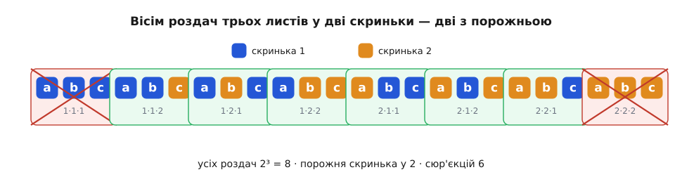
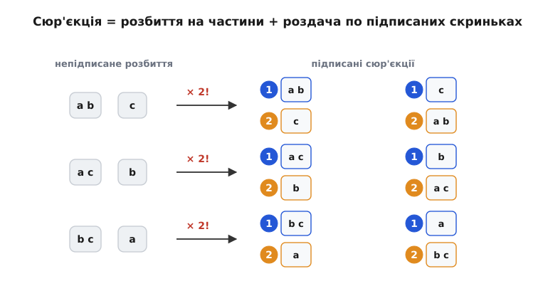

# 📮 Скільки сюр'єкцій: роздачі, де жодна скринька не порожня

Скількома способами роздати n різних листів по m підписаних скриньках так, щоб **жодна не лишилась порожня**? Це задача про сюр'єкції, і чергована сума включення-виключення відповідає на неї однією формулою — а заразом дарує формулу для чисел Стірлінга й ховає в собі рівно n!, коли скриньок стільки ж, скільки листів.

Кожна роздача — це функція: листу приписуємо скриньку, куди він ляже. Листів n, у кожного m варіантів, вибори незалежні — тож усіх роздач рівно mⁿ. Серед них нас цікавлять ті, де кожна скринька дістала бодай один лист: коли образ функції накриває **всю** множину скриньок. Таку функцію звуть сюр'єкцією (фр. *sur* — над, поверх: образ лягає на всю цільову множину; термін увів колектив Бурбакі). Позначмо їхню кількість Surj(n, m).

Пряме перелічування сюр'єкцій плутане: умова «жодна скринька не порожня» стосується всіх скриньок одразу. Але її легко вивернути на мову властивостей — а тоді працює друга форма включення-виключення, та, що лічить елементи **без жодної** із заборонених властивостей.

## Заборонити порожні скриньки по черзі

Візьмімо за універсум усі mⁿ роздач. Кожній скриньці припишемо властивість: «скринька i лишилась порожня». Сюр'єкція — це рівно та роздача, що не має **жодної** з цих властивостей: жодна скринька не порожня.

Щоб застосувати принцип, треба знати розміри перетинів. Скільки роздач лишають порожніми k **заданих** скриньок? Якщо k скриньок під забороною, кожен лист має тепер лише m − k дозволених місць; вибори все ще незалежні, тож таких роздач (m − k)ⁿ. А самих способів обрати, **які** k скриньок спорожнити, рівно C(m, k) — стільки, скільки є [комбінацій k із m](root:math-combinatorics/combinations), тобто способів вибрати k предметів із m без огляду на порядок. Тому сума розмірів усіх перетинів по k властивостях:

```
Sₖ = C(m, k) · (m − k)ⁿ
```

Крайні випадки видно одразу. При k = 0 заборон нема: S₀ = C(m,0)·mⁿ = mⁿ — увесь універсум. При k = m заборонені всі скриньки, дівати листи нікуди: Sₘ = C(m,m)·0ⁿ = 0 (для n ≥ 1, бо 0ⁿ = 0).

Друга форма чергує знаки, починаючи з S₀:

```
Surj(n, m) = Σ (−1)ᵏ · C(m, k) · (m − k)ⁿ ,   k = 0 … m
           = mⁿ − C(m,1)(m−1)ⁿ + C(m,2)(m−2)ⁿ − …
```

Додаємо всі роздачі, віднімаємо ті, де порожня бодай одна скринька, повертаємо переднятих (де порожні аж дві), і так далі — рівно ритм принципу, лише перекладений на скриньки.

## Малий приклад: три листи, дві скриньки

**Три листи a, b, c у дві скриньки (n = 3, m = 2).**

```
Surj(3, 2) = C(2,0)·2³ − C(2,1)·1³ + C(2,2)·0³
           =    1·8    −    2·1    +    1·0
           =     8     −     2     +     0
           =     6
```

Читається просто: усіх роздач 2³ = 8; серед них лише дві невдалі — «усе в першу скриньку» (друга порожня) і «усе в другу» (перша порожня); знявши їх, лишаємо 6 сюр'єкцій.


*Усіх роздач 2³ = 8. Одноколірні дві — «усе в одну скриньку» — лишають другу порожньою й випадають; решта шість накривають обидві скриньки. Це і є 8 − 2 = 6 із формули.*

## Місток до чисел Стірлінга

У формулі сховано ще одного героя. Порахуймо Surj(n, m) інакше — не через заборони, а навпростець.

Візьми будь-яку сюр'єкцію й **згрупуй листи за скринькою**, куди вони потрапили. Дістанеш m купок, і всі непорожні — бо сюр'єкція нікого не лишає без листа. Це розбиття n листів на m непорожніх частин. От тільки скриньки **підписані** (перша — не те саме, що друга), а частини самого розбиття — ні: купка {a, b} лишається тією самою купкою, байдуже, у якій вона скриньці.

Скільки є непідписаних розбиттів n-множини на m непорожніх частин — це окреме комбінаторне число, [числа Стірлінга другого роду](root:math-combinatorics/stirling-numbers-second-kind) S(n, m) (Джеймс Стірлінг, шотландський математик, 1692–1770). Кожне таке розбиття можна «підписати» — роздати m його частин по m підписаних скриньках — рівно m! способами. Тому кожне розбиття породжує m! різних сюр'єкцій, а всього:

```
Surj(n, m) = m! · S(n, m)
```


*Непідписане розбиття на m частин дає m! підписаних сюр'єкцій — стільки, скількома способами роздати частини по підписаних скриньках. Для {a, b, c} на дві скриньки: 3 розбиття × 2! = 6, тобто S(3, 2) = 3.*

Обернімо рівність — і безкоштовно дістанемо формулу для самих чисел Стірлінга, бо ліву частину ми вже вміємо лічити:

```
S(n, m) = Surj(n, m) / m! = (1/m!) · Σ (−1)ᵏ C(m, k) (m − k)ⁿ
```

Перевіримо на прикладі: S(3, 2) = 6 / 2! = 3. І справді, розбити {a, b, c} на дві непорожні частини можна рівно трьома способами — {a,b | c}, {a,c | b}, {b,c | a}.

> 🔧 **Навіщо це.** Той самий лік працює скрізь, де n різних об'єктів треба роздати m різним отримувачам **без простою**: n задач на m ядер так, щоб жодне не бідувало; n різних кульок по m коробок без порожніх. А через місток m!·S(n, m) підрахунок сюр'єкцій стає робочим способом лічити числа Стірлінга — цеглинку, на якій тримається вся лічба розбиттів множин.

## Коли скриньок рівно стільки, скільки листів

Поставмо m = n. Сюр'єкція саджає n листів у n скриньок так, щоб жодна не пустувала. Але листів рівно стільки, скільки скриньок, — тож «бодай один» перетворюється на «рівно один»: кожна скринька дістає точно один лист. Це вже бієкція, взаємно однозначна відповідність, а її можна задати n! способами (перша скринька — будь-який із n листів, друга — будь-який із решти n−1, і так до кінця). Отже:

```
Surj(n, n) = n!
```

Ліворуч, одначе, стоїть громіздка чергована сума — і рівність каже, що вона згортається просто в n!. Це неочевидна тотожність:

```
Σ (−1)ᵏ C(n, k) (n − k)ⁿ = n! ,   k = 0 … n
```

Перевіримо для n = 3:

```
C(3,0)·3³ − C(3,1)·2³ + C(3,2)·1³ − C(3,3)·0³
 =  1·27   −   3·8    +   3·1    −   1·0
 =   27    −   24     +    3     −    0
 =    6    =   3!
```

Місток до Стірлінга дає те саме з іншого боку: розбити n-множину на n непорожніх частин можна лише одним способом — усі поодинці, — тож S(n, n) = 1, а Surj(n, n) = n!·1 = n!.

А що, як скриньок **більше**, ніж листів, m > n? Накрити всі скриньки нічим — листів забракне, сюр'єкцій нема: Surj(n, m) = 0. Формула знає це сама — та сама чергована сума при n < m тихо дає нуль. Скажімо, два листи в три скриньки:

```
C(3,0)·3² − C(3,1)·2² + C(3,2)·1² − C(3,3)·0²
 =  1·9    −   3·4    +   3·1    −    0
 =   9     −   12     +    3     =    0
```

Тож одна чергована сума Σ (−1)ᵏ C(m,k)(m−k)ⁿ тримає всі три відповіді нараз: n! при m = n, нуль при m > n і m!·S(n, m) — у загальному разі. Знаки самі зважують кожну роздачу так, що в лічбі лишаються рівно ті, де жодна скринька не порожня.
