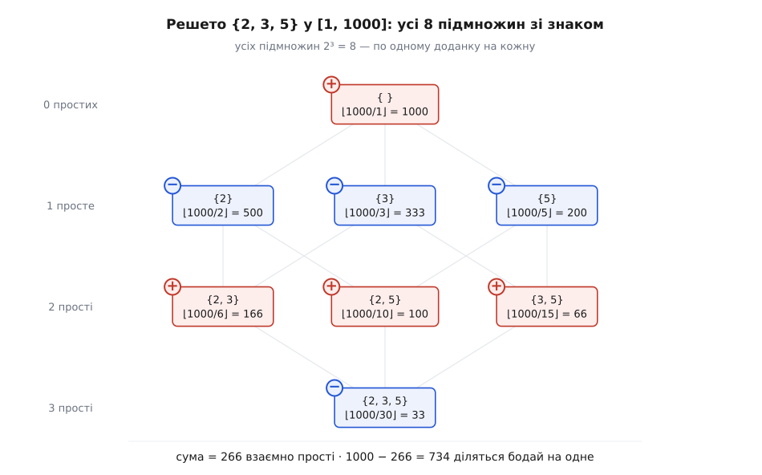

# ⚙️ Решето підмножинами: числа, вільні від набору простих

Формула включення-виключення для решета — не абстракція на дошці, а короткий цикл: пробігти всі 2ʳ підмножини заданих простих, для кожної додати чи відняти ⌊N / добуток підмножини⌋ — і за один прохід дізнатися, скільки чисел у [1, N] не діляться **на жоден** із них. Причому N може бути мільярд мільярдів: решето не торкається окремих чисел, воно рахує цілими пластами. Напишімо його так, щоб було видно і його силу, і його ціну.

## Задача

Дано межу N і список із r різних [простих чисел](topic:math-number-theory/prime-numbers) p₁, …, p_r. Питання-близнюки: скільки чисел від 1 до N діляться **бодай на одне** з них — і, доповненням, скільки не діляться **ні на одне** (взаємно прості з усіма).

Найпряміший шлях — пройти всі N чисел і кожне перевірити на подільність. Це O(N·r) і смерть уже для N = 10¹⁸: стільки чисел не перебрати за жоден розумний час. Але подільність має структуру, якою гріх не скористатися. Серед 1…N кратних pᵢ рівно ⌊N / pᵢ⌋ — кожне pᵢ-те число. Кратних одразу двом простим pᵢ, pⱼ — це кратні їхньому добутку (числа прості, тож найменше спільне кратне — просто pᵢ·pⱼ), тобто ⌊N / (pᵢ·pⱼ)⌋. Загалом чисел, кратних **усім** простим із підмножини S, рівно ⌊N / ∏S⌋. Це і є розмір перетину відповідних множин — а перетинами й годується включення-виключення. Отже, замість N чисел досить перебрати підмножини простих, а їх лише 2ʳ.

## Ідея: підмножина — це маска, маска — це доданок

r простих задають рівно 2ʳ підмножин, і кожну зручно закодувати числом-**маскою** від 0 до 2ʳ−1: i-й біт увімкнено ⟺ i-те просте входить у підмножину. Тоді весь перебір підмножин — це звичайний цикл `for mask = 0 … 2ʳ−1`, а робота всередині проста:

- перемножити прості, чиї біти в масці ввімкнені, → добуток ∏S;
- узяти доданок ⌊N / ∏S⌋ — скільки чисел кратні всім цим простим одразу;
- почепити знак за парністю розміру підмножини: плюс для парного числа простих, мінус для непарного. Розмір — це кількість одиничних бітів у масці (**population count**, popcount).

Порожня маска (усі біти нулі) — випадок окремий, але не винятковий: жодного простого не вибрано, добуток порожній і дорівнює 1, доданок ⌊N/1⌋ = N зі знаком плюс. Це «нульовий рівень» решета — увесь відрізок, з якого далі вибавляють. Склавши доданки всіх 2ʳ масок, дістаємо кількість **взаємно простих**; а хто ділиться бодай на один — це просто N мінус вони.

Прокрутімо руками {2, 3, 5} у межах N = 1000 — усі вісім підмножин:


*Кожна з 2³ = 8 підмножин дає один доданок ⌊1000 / добуток⌋ зі знаком за парністю розміру. Порожня підмножина вносить увесь відрізок (+1000), поодинокі прості віднімають своїх кратних, пари повертають двічі-відняте, трійка знімає тричі-повернене. Сума 266 — взаємно прості; решта, 734, діляться бодай на одне з 2, 3, 5.*

Сума +1000 −500 −333 −200 +166 +100 +66 −33 = 266 взаємно простих; отже 1000 − 266 = 734 діляться бодай на одне. Жодного числа ми при цьому не перебрали — тільки вісім підмножин трьох простих.

## Код

Головний варіант — C++: задача лічильна, а фіксована ширина цілого робить видимою головну пастку (переповнення добутку), заради якої й стоїть захисна перевірка. Поряд Python, де та сама перевірка потрібна вже не для правильности, а лише щоб не множити даремно, і Rust, де переповнення ловить сама мова через `checked_mul`.

:::tabs
```cpp
#include <cstdint>
#include <vector>
#include <bit>          // std::popcount (C++20)

// Скільки чисел у [1, N] взаємно прості з усіма простими p[0..r-1]
// (не діляться на жоден). Порожня маска дає весь N — доданок «нуля множин».
int64_t coprime_count(int64_t N, const std::vector<int64_t>& p) {
    int r = (int)p.size();
    int64_t total = 0;
    for (uint32_t mask = 0; mask < (1u << r); ++mask) {
        int64_t prod = 1;
        bool over = false;
        for (int i = 0; i < r; ++i)
            if ((mask >> i) & 1) {
                if (p[i] > N / prod) { over = true; break; }   // добуток перевищив би N
                prod *= p[i];
            }
        int64_t term = over ? 0 : N / prod;                    // ⌊N / добуток⌋
        total += (std::popcount(mask) & 1) ? -term : term;     // знак за парністю розміру
    }
    return total;
}

// Скільки діляться бодай на одне — це просто доповнення.
int64_t divisible_by_any(int64_t N, const std::vector<int64_t>& p) {
    return N - coprime_count(N, p);
}
```
```python
def coprime_count(N: int, primes: list[int]) -> int:
    total = 0
    for mask in range(1 << len(primes)):
        prod, over = 1, False
        for i, pi in enumerate(primes):
            if (mask >> i) & 1:
                if pi > N // prod:          # добуток перевищив би N → далі ⌊N/добуток⌋ = 0
                    over = True             # тут це ЛИШЕ оптимізація: цілі Python необмежені,
                    break                   # переповнення не буває, обриваємо марне множення
                prod *= pi
        term = 0 if over else N // prod
        total += -term if bin(mask).count("1") & 1 else term   # знак за парністю розміру
    return total


def divisible_by_any(N: int, primes: list[int]) -> int:
    return N - coprime_count(N, primes)
```
```rust
fn coprime_count(n: i64, primes: &[i64]) -> i64 {
    let r = primes.len();
    let mut total: i64 = 0;
    for mask in 0u32..(1 << r) {
        let mut prod: i64 = 1;
        let mut over = false;
        for (i, &pi) in primes.iter().enumerate() {
            if (mask >> i) & 1 == 1 {
                // checked_mul повертає None при переповненні i64 — мова ловить пастку сама
                match prod.checked_mul(pi) {
                    Some(v) if v <= n => prod = v,
                    _ => { over = true; break; }    // переповнення АБО добуток > N → доданок 0
                }
            }
        }
        let term = if over { 0 } else { n / prod };            // ⌊N / добуток⌋
        total += if mask.count_ones() & 1 == 1 { -term } else { term };  // знак за парністю
    }
    total
}

fn divisible_by_any(n: i64, primes: &[i64]) -> i64 {
    n - coprime_count(n, primes)
}
```
:::

Уся суть — у двох вкладених циклах: зовнішній обходить 2ʳ масок, внутрішній для кожної маски множить щонайбільше r простих. Звідси й складність — **O(2ʳ·r)**. Ключова деталь — перевірка `p[i] > N / prod` **перед** множенням, а не після: якби ми спершу помножили й лише тоді дивилися, добуток міг би вискочити за межу типу ще до перевірки, і зловити переповнення було б нічим. Ділення `N / prod` тут безпечне (`prod` ще не більше за N), а результат порівняння точно каже, чи наступний множник виштовхне добуток за N. Щойно виштовхне — доданок однаково нульовий (⌊N / щось-більше-за-N⌋ = 0), тож множення сміливо обриваємо.

> 🔧 **Навіщо це.** Той самий цикл — це готовий обчислювач [функції Ейлера](topic:math-number-theory/euler-totient): φ(n) дорівнює `coprime_count(n, різні_прості_дільники_n)`, бо взаємно прості з n — це рівно ті, що не діляться на жоден його простий множник. І тут показова тонкість про «ціну». Здавалося б, 2ʳ загрозливе, але для φ показник r — це число **різних** простих у самому n, а воно крихітне: добуток перших 15 простих уже 6.1·10¹⁷, а перших 16 — понад 3·10¹⁹. Тобто будь-яке 64-бітне число має щонайбільше 15–16 різних простих дільників, і 2ʳ для нього не перевищує ≈ 65 тисяч — мить. Експонента кусає не тоді, коли число велике, а тоді, коли простих у списку багато й вони незалежні.

## Ціна: коли 2ʳ стає стіною

Решето точне для будь-якого r, але кожне нове просте подвоює число доданків. Поки простих жменя, це подарунок — вісім підмножин замість перебору мільярда чисел. Та щойно їх стає багато, експонента бере своє:

```
r      доданків (2ʳ)        на практиці
5      32                   мить
10     1 024                мить
20     1 048 576            ще терпимо
30     ~10⁹                 секунди–хвилини
50     ~10¹⁵               не дочекатися
```

Тому решето включення-виключення — інструмент для **небагатьох** незалежних простих (чи ширше — небагатьох умов). Коли ж різних дільників-обмежень десятки й вони не пов'язані спільною структурою, чергована сума з мільйонів великих доданків, що майже гасять одне одного, стає і повільною, і чутливою до похибок — тоді беруть інші підходи (пряме решето кратних, імовірнісні оцінки густини простих тощо). Сила методу — рахувати пластами замість поштучно; ціна — що пластів рівно 2ʳ.

## Другий приклад: коли решето згортається до одного циклу

Буває, що перетини мають таку струнку структуру, що перебирати 2ⁿ підмножин узагалі не треба — сума складається в замкнену формулу. Класичний випадок — **субфакторіал** !n, число перестановок n предметів, у яких жоден не лишився на своєму місці. Тут те саме включення-виключення дає розміри перетинів Sₖ = n!/k! (усі однакового вигляду), і чергована сума згортається:

```
!n = n! · ( 1 − 1/1! + 1/2! − 1/3! + … + (−1)ⁿ/n! )
```

З цієї формули витікає точна цілочислова **рекурента**, яку легко довести відніманням n·!(n−1) від !n:

```
!0 = 1,      !n = n · !(n−1) + (−1)ⁿ
```

Це вже не 2ⁿ, а лінійний прохід — жодного перебору підмножин:

:::tabs
```cpp
#include <cstdint>
#include <vector>

// Субфакторіали !0 … !n точною цілою рекурентою (жодних дробів і float).
std::vector<int64_t> subfactorials(int n) {
    std::vector<int64_t> d(n + 1);
    d[0] = 1;
    for (int k = 1; k <= n; ++k)
        d[k] = (int64_t)k * d[k - 1] + ((k & 1) ? -1 : +1);   // (−1)ᵏ: −1 для непарних k
    return d;
}
```
```python
def subfactorials(n: int) -> list[int]:
    """!0 … !n точною рекурентою; цілі Python необмежені — точно для будь-якого n."""
    d = [1] * (n + 1)
    for k in range(1, n + 1):
        d[k] = k * d[k - 1] + (-1 if k & 1 else 1)   # (−1)ᵏ
    return d
```
:::

Перевірка на чотирьох предметах: d[1] = 0, d[2] = 1, d[3] = 2, d[4] = 4·2 + 1 = **9** — рівно ті дев'ять безладів, що й мали бути.

А ось і слід [числа e](topic:math-analysis/e-number), захований у цій рекуренті. Оскільки ряд у дужках — це частковий розклад e⁻¹, субфакторіал завжди дорівнює найближчому цілому до n!/e:

```
!n = round(n! / e)        (для n ≥ 1)

!4 = round(24 / 2.71828…) = round(8.829…) = 9
```

Формула гарна, але як **спосіб обчислення** — облудна. Щойно n! переростає точність `double` (мантиса тримає цілі лише до 2⁵³ ≈ 9·10¹⁵, а це вже 19!), значення n!/e рахується з похибкою більшою за половину, і округлення дає хибу. Тож round(n!/e) годиться хіба для малих n на олівці; рахує ж насправді ціла рекурента — вона точна, поки саме !n влазить у тип (для 64-бітного цілого — до n = 20 включно, далі потрібні великі числа). Гарну тотожність лишаємо очам, а машині — рекуренту.

## Пастки

**Переповнення добутку.** Добуток простих у підмножині росте швидко й легко вискакує за 64 біти (перемножте десяток різних простих — і вже за межею). У C++ і Rust це головна небезпека: мовчазне переповнення підсуне у `prod` сміття, а не добуток. Ліки — обривати множення, щойно добуток **перевищив би** N, і то перевіркою `p[i] > N / prod` **до** множення (перевірка після — це вже переповнене число). Доданок від такої підмножини однаково нульовий. У Rust ту саму роль грає `checked_mul`, що чесно повертає `None` при переповненні. У Python пастки нема зовсім — цілі необмежені; там обрив лишається тільки оптимізацією, а не рятунком.

**Порожня підмножина = весь N.** Маска 0 — повноправний доданок: добуток порожній дорівнює 1, внесок +⌊N/1⌋ = N. Це «нульовий рівень» решета, з якого все починається. Пропустити його — типова помилка «на все»: без нього сума дасть не кількість взаємно простих, а щось безглузде. У циклі це виходить само, якщо стартувати маску з 0, а не з 1.

**Знак — за парністю розміру, не за «рівнем на око».** Знак доданка визначає popcount маски: парне число простих — плюс, непарне — мінус. Не намагайтеся вести знак лічильником рівня наздогад — надійніше щоразу брати парність кількости одиничних бітів. І пам'ятайте про дзеркальність двох питань: сума з таким знаком (порожня маска +N) дає **взаємно прості**; хто ділиться бодай на один — це N мінус ця сума, у ній знаки протилежні й порожньої маски нема.

**round(n!/e) на `double`.** Спокуслива формула субфакторіала точна в математиці, але не в машинному числі з рухомою комою: щойно n! переростає 2⁵³, `double` перестає тримати його точно, і округлення бреше вже від n = 19. Для точних значень беріть цілу рекуренту !n = n·!(n−1) + (−1)ⁿ, а float-формулу лишайте для інтуїції та малих n.
