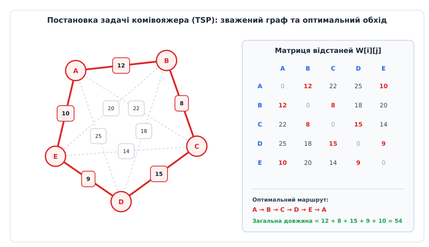
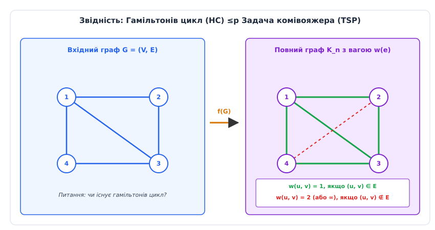
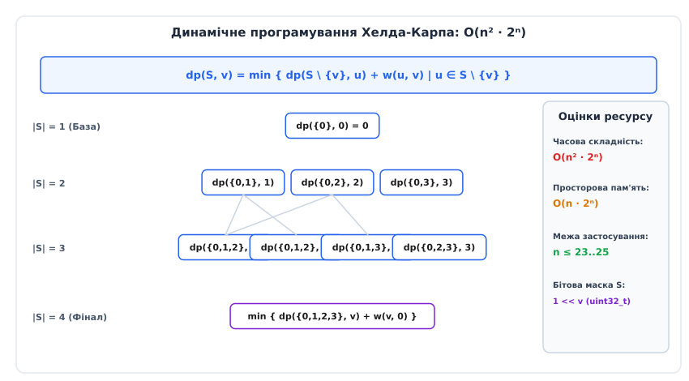
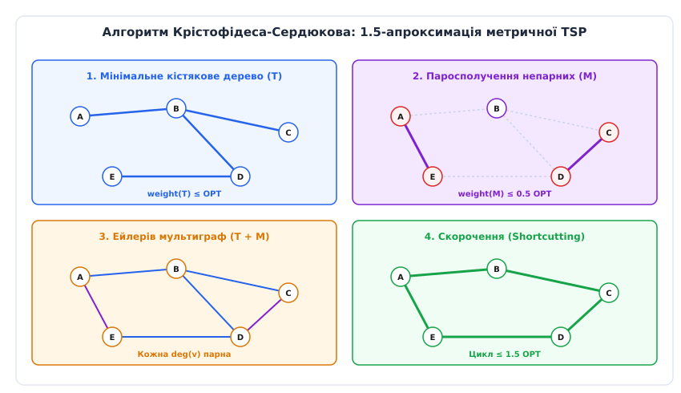
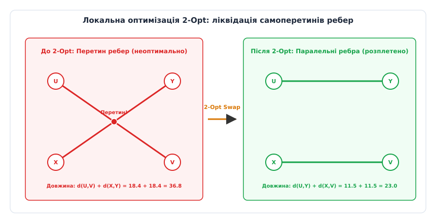

# Задача комівояжера

<preknowlist>
- [Матриця суміжності графа](topic:sf-algorithms/adjacency-matrix) — матричне та спискове подання структур графів у пам’яті.
- [Гамільтонів граф та гамільтонів цикл](topic:math-combinatorics/hamiltonian-cycle) — фундаментальна умова відвідування кожної вершини графа рівно один раз.
- [Класи NP та NP-повнота](topic:computability/np-completeness) — поняття поліноміальної звідності, сертифікатів перевірки та класифікація обчислювальної складності.
- [Проблема рівності класів P та NP](topic:computability/p-vs-np) — фундаментальне питання про можливість поліноміального розв'язання складних комбінаторних задач.
- [Ейлеровий граф та ейлеровий цикл](topic:math-combinatorics/eulerian-cycle) — замкнений обхід графа, що містить кожне ребро рівно один раз.
- [Досконале паросполучення](topic:sf-algorithms/perfect-matching) — покриття всіх вершин графа ребрами без спільних кінців.
- [Алгоритм Едмондса](topic:sf-algorithms/edmonds-algorithm) — знаходження досконалого паросполучення мінімальної або максимальної ваги в довільному графі.
- [Алгоритм Дейкстри](topic:sf-algorithms/dijkstra) — класичний алгоритм пошуку найкоротших шляхів від однієї вершини у зваженому графі.
</preknowlist>

Автоматизоване фрезерування друкованої плати сучасного сервера з 14 000 технологічними отворами або оптимізація польотного завдання для зграї з 500 вантажних дронів-доставщиків зіштовхується з однаковою комбінаторною (лат. *combinare* — поєднувати) перешкодою. Щоб виконати обробку з мінімальними витратами часу та енергії, робочий інструмент або літальний апарат повинен відвідати кожну задану точку рівно один раз і повернутися у вихідну позицію. Спроба обчислити оптимальну послідовність проходження банальним повним перебором усіх можливих варіантів вимагає аналізу `14 000!` комбінацій. Це число перевищує `10⁴⁵ ⁰⁰⁰` — суму, яка незрівнянно більша за кількість атомів у всьому спостережуваному Всесвіті (`10⁸⁰`). Навіть суперкомп'ютер, здатний перевіряти трильйон маршрутів за секунду, вимагатиме часу, що на сотні порядків перевищує вік нашого Всесвіту.

Ця математична та інженерна прірва називається **задачею комівояжера** (Traveling Salesperson Problem, TSP, від фр. *commis voyageur* — роз'їзний торговець). Вона є центральним об'єктом теорії комбінаторної оптимізації та класичною NP-важкою задачею. На відміну від пошуку найкоротшого шляху між двома вершинами (алгоритм Дейкстри з лінійним часом) або пошуку Ейлерового циклу, де рішення будується на локальній перевірці парності степенів вершин, задача комівояжера є глобально залежною: зміна ваги одного-єдиного реберного переходу на протилежному кінці мережі здатна повністю зруйнувати оптимальний глобальний маршрут.


*Постановка задачі комівояжера: зважений граф вершин, матриця відстаней та оптимальний замкнений маршрут.*

Історичний шлях задачі від ікосіанських ігор Гамільтона та теоретичних праць Карла Менгера у 1930-х роках до розробки сучасних солверів рівня Concorde наведено у вставці [Історія розвитку задачі комівояжера: Від ікосіанських ігор до солвера Concorde](topic:math-combinatorics/traveling-salesperson-problem/hist-tsp-history.md).

---

## 1. Формальна постановка та варіації задачі

У математичній теорії графів задача комівояжера задається на зваженому графі `G = (V, E, w)`, де `V` — множина з `n` вершин (міст), `E` — множина ребер (шляхів між містами), а `w: E → R⁺` — функція вагових коефіцієнтів (відстаней, вартості або часу переходу).

Комівояжер повинен знайти **гамільтонів цикл** мінімальної сумарної ваги, тобто послідовність вершин `(v[0], v[1], ..., v[n-1], v[0])`, де всі `v[i]` є унікальними, а сума `∑ w(v[i], v[i+1])` є найменшою з можливих.

Математично задачу поділяють на три рівні формалізації за типами запитань та цільових функцій:

1. **Задачна форма прийняття рішення (Decision TSP):**
   Задано граф `G = (V, E, w)` та числову межу `K > 0`. Запитання: чи існує у графі гамільтонів цикл з загальною вагою `w(C) ≤ K`? Ця форма є класичною мовою класів складності і належить до класу **NP-повних задач**.
2. **Задача пошуку (Search TSP):**
   Потрібно побудувати сам гамільтонів цикл `C`, що задовольняє умову `w(C) ≤ K`.
3. **Оптимізаційна задача (Optimization TSP):**
   Потрібно знайти цикл `C*`, для якого значення `w(C*)` досягає математичного мінімуму серед усіх можливих гамільтонових циклів графа. Ця форма є **NP-важкою** (NP-hard).

### 1.1. Геометричні та структурні класи задачі

Властивості функції ваги `w(u, v)` визначають математичні межі складності та можливість побудови апроксимаційних алгоритмів:

- **Симетрична TSP (Symmetric TSP, STSP):**
  Вага переходу не залежить від напрямку: `w(u, v) = w(v, u)` для всіх `u, v ∈ V`. Граф є неупорядкованим. Кількість можливих унікальних замкнених маршрутів для повного графа з `n` вершин становить `(n - 1)! / 2`.
- **Асиметрична TSP (Asymmetric TSP, ATSP):**
  Вага переходу залежить від напрямку: існує принаймні одна пара вершин, для якої `w(u, v) ≠ w(v, u)`. Така ситуація виникає в реальних логістичних мережах через наявність односторонніх вулиць, напрямок вітру при польоті авіації або рельєф місцевості. Кількість варіантів обходу становить `(n - 1)!`.
- **Метрична TSP (Metric TSP):**
  Функція відстаней задовольняє **нерівність трикутника** (triangle inequality):

```
w(u, v) ≤ w(u, z) + w(z, v),  ∀ u, v, z ∈ V
```

Нерівність трикутника означає, що прямий перехід від точки `u` до `v` ніколи не може бути довшим за обхідний шлях через проміжну точку `z`. Метрична TSP виникає в усіх евклідових просторах (геометрична TSP на площині або в тривимірному просторі). Сама присутність нерівності трикутника є фундаментальною роздільною межею: метричну TSP можна апроксимувати з гарантованою точністю за поліноміальний час, тоді як загальну (неметричну) TSP апроксимувати неможливо.

### 1.2. Простір станів та топологічна структура багатогранника TSP

З геометричної точки зору, кожен зважений граф із `n` вершинами можна зіставити з вершинами `n(n-1)/2`-вимірного одиничного гіперкуба. Кожен замкнений гамільтонів цикл описується вектор-стовпчиком `x = (x[e1], x[e2], ..., x[em])ᵀ`, у якому складові дорівнюють `1` для ребер, включених у маршрут, і `0` для ребер, що залишилися поза ним.

Опукла оболонка (Convex Hull) усіх таких векторів гамільтонових циклів називається **многогранником задачі комівояжера** (TSP Polytope). Розмірність цього многогранника для `n ≥ 3` дорівнює `n(n-3)/2`. Розв'язання задачі комівояжера еквівалентне знаходженню вершини цього многогранника, яка мінімізує лінійну функцію `wᵀ · x`.

Геометричний аналіз фасеток (граней максимальної вимірності `d-1`) многогранника TSP показує, що для повного опису многогранника крім нерівностей розрізів (DFJ subtour constraints) потрібні складніші класи геометричних нерівностей, такі як **нерівності гребінців** (Comb Inequalities), **нерівності корони** (Crown Inequalities) та **нерівності гало** (Halo Inequalities). Саме додавання цих нерівностей у процесі роботи алгоритму січних площин дозволяє солверам розв'язувати задачі для десятків тисяч міст.

---

## 2. Теоретико-складносний аналіз та доведення NP-повноти

Щоб зрозуміти комбінаторну природу задачі комівояжера, необхідно звести її до відомої NP-повної задачі — пошуку [Гамільтонового циклу](topic:math-combinatorics/hamiltonian-cycle).


*Поліноміальна звідність задачі Гамільтонового циклу до задачі комівояжера шляхом побудови повного зваженого графа.*

### 2.1. Доведення NP-повноти задачі прийняття рішення TSP

Теорема: *Задача прийняття рішення TSP є NP-повною.*

Доведення розбивається на два обов'язкових кроки:

1. **Належність до класу NP:**
   Як сертифікат розв'язку розглядається послідовність вершин `C = (v[0], v[1], ..., v[n-1])`. Алгоритм перевірки (верифікатор) за поліноміальний час `O(n)` виконує три дії:
   - Перевіряє, що масив містить точно `n` елементів і всі вершини унікальні (`O(n)`).
   - Обчислює суму ваг ребер `W = w(v[n-1], v[0]) + ∑ w(v[i], v[i+1])` (`O(n)`).
   - Порівнює `W ≤ K`.
   Оскільки детермінована перевірка виконується за лінійний час `O(n)`, `TSP ∈ NP`.

2. **NP-важкість (Поліноміальна звідність `Hamiltonian-Cycle ≤p TSP`):**
   Нехай задано довільний неупорядкований незважений граф `G = (V, E)` з `n` вершинами. Побудуємо за поліноміальний час екземпляр задачі TSP на повному зваженому графі `G' = (V, E', w)` та межею `K = n`:
   - Множина вершин `V` залишається тотожною.
   - Для кожної пари вершин `u, v ∈ V` задаємо функцію ваги:

```
w(u, v) = 1,  якщо (u, v) ∈ E
w(u, v) = 2,  якщо (u, v) ∉ E
```

Покажемо еквівалентність обох тверджень:
- Якщо граф `G` має гамільтонів цикл `C`, то цей самий цикл у графі `G'` складається з `n` ребер, кожне з яких має вагу `1`. Загальна вага `w(C) = n · 1 = n ≤ K`.
- Навпаки, якщо у графі `G'` існує цикл `C'` з вагою `w(C') ≤ n`, то оскільки мінімальна вага будь-якого ребра дорівнює `1`, а ребер у циклі точно `n`, єдиним способом отримати суму `≤ n` є використання **виключно** ребер з вагою `1`. Отже, усі `n` ребер циклу `C'` належать вихідній множині ребер `E`, що означає існування гамільтонового циклу в `G`.

Конструкція звідності виконується за час `O(n²)`. Отже, `TSP` є NP-повною задачею.

### 2.2. Неможливість поліноміальної апроксимації загальної TSP

Суттєвим результатом теорії складності є той факт, що при відсутності нерівності трикутника для загальної TSP не існує жодного поліноміального алгоритму, який гарантував би апроксимацію з будь-яким постійним коефіцієнтом `α ≥ 1`, якщо тільки `P ≠ NP`.

Це доводиться модифікацією звідності з Гамільтонового циклу: якщо задати вагу відсутніх ребер рівною `α · n + 2`, то будь-який апроксимаційний алгоритм з коефіцієнтом `α` був би змушений повертати маршрут довжиною `≤ α · n` тоді й лише тоді, коли вихідний граф містить гамільтонів цикл. Оскільки розпізнавання гамільтонова циклу є NP-повним, існування такого апроксимаційного алгоритму означало б `P = NP`.

---

## 3. Точні алгоритми розв'язання: Від перебору до динамічного програмування

Спроба розв meзати задачу комівояжера прямим перебором (Brute Force) генерує всі можливі перестановки вершин. Для симетричної TSP кількість унікальних циклів за умови фіксації початкової вершини становить `(n - 1)! / 2`.

За формулою Стірлінга для факторіала:

```
n! ≈ √(2πn) · (n / e)ⁿ
```

Це означає, що при збільшенні `n` лише на `1` кількість обчислень зростає в `n` разів. Для `n = 10` кількість варіантів дорівнює `181 440` (обчислюється за мікросекунди), для `n = 20` — `6.08 · 10¹⁶` варіантів (потрібні місяці обчислень), а для `n = 30` — `4.42 · 10³⁰` варіантів, що виходить за межі можливостей усіх комп'ютерів людства.

### 3.1. Алгоритм Хелда-Карпа (Bellman-Held-Karp)

У 1962 році Майкл Хелд, Річард Карп та Річард Беллман незалежно розробили алгоритм **динамічного програмування**, який знизив часову складність з факторіальної `O(n!)` до експоненціальної `O(n² · 2ⁿ)`.

Ідея полягає в тому, що для відновлення оптимального подальшого маршруту з вершини `u` до фіналу нам не потрібно знати точний порядок, у якому відвідано попередні міста. Достатньо знати лише **множину вже відвіданих міст `S`** та **поточну вершину `u`**.


*Гратчаста структура підзадач алгоритму Хелда-Карпа (динамічне програмування з бітовими масками).*

Визначення стану підзадачі:
Нехай `dp(S, u)` — мінімальна вага шляху, що починається у стартовій вершині `0`, проходить через усі вершини підмножини `S ⊆ V` (де `0 ∈ S` та `u ∈ S`) і закінчується у вершині `u`.

Рекурентне співвідношення:

```
dp(S, v) = min { dp(S \ {v}, u) + w(u, v) | u ∈ S \ {v} }
```

Базовий стан:

```
dp({0}, 0) = 0
```

Фінальний розв'язок шукається як мінімум після проходження всіх вершин (де `V` — повна множина міст):

```
OPT = min { dp(V, u) + w(u, 0) | u ∈ V \ {0} }
```

Часова та просторова складність алгоритму Хелда-Карпа:
- Кількість підмножин `S` становить `2ⁿ`.
- Для кожної маски `S` існує `n` можливих кінцевих вершин `u`. Загальна кількість станів у таблиці DP дорівнює `n · 2ⁿ`.
- Обчислення одного стану вимагає перебору `n` попередників `u`.
- **Часова складність:** `O(n² · 2ⁿ)`.
- **Просторова складність:** `O(n · 2ⁿ)`.

Практичне обмеження пам meті для `n = 22` вимагає створення таблиці розміром `2²² · 22 ≈ 92` мільйони елементів `double`, що займає близько `736 МБ` ОЗП. Для `n = 30` обсяг пам meті перевищить `250 ГБ`, що робить алгоритм Хелда-Карпа точним інструментом виключно для малих графів (`n ≤ 22`).

### 3.2. Метод гілок і меж (Branch and Bound) та цілочислове програмування

Для точного розв meзання задач середньої розмірності (`20 ≤ n ≤ 100`) застосовують метод **гілок і меж** (Branch and Bound). Алгоритм будує дерево пошуку, у якому кожна гілка відповідає вибору певного ребра в маршруті.

Для відсічі недоперспективних гілок використовують нижню межу оцінки `1-дерева` (1-tree relaxation) або лінійну релаксацію цілочислових формулювань MTZ та DFJ:
- **Формулювання Міллера-Таккера-Земліна (MTZ):** Вводить `O(n²)` додаткових змінних порядкових номерів вершин `u[i]`, що дозволяє усунути підмаршрути за допомогою `O(n²)` нерівностей.
- **Формулювання Данціга-Фалкерсона-Джонсона (DFJ):** Використовує `2ⁿ - 2` обмежень на розрізи підмножин `S ⊂ V`. Динамічне додавання цих нерівностей під час роботи алгоритму гілок і розрізів (Branch and Cut) забезпечує високу швидкість збіжності у сучасних розв meзачах на кшталт Concorde.

### 3.3. Лагранжева релаксація та субградієнтний алгоритм

Для підняття точності нижньої межі в методі гілок і меж Хелд та Карп розробили спосіб підсилення `1-дерева` через **лагранжеву релаксацію** (Lagrangian Relaxation).

Ідея полягає у введенні множників Лагранжа `λ[i] ∈ R` для кожної вершини `i ∈ V`. Модифіковані ваги ребер визначаються як:

```
w_λ(u, v) = w(u, v) + λ[u] + λ[v]
```

Для будь-якого вектора `λ` вага мінімального `1-дерева`, обчисленого на модифікованих вагах `w_λ`, дає нижню межу для `OPT - 2 ∑ λ[i]`. Максимізація цієї нижньої межі по всіх векторах `λ` за допомогою субградієнтного спуску (Subgradient Method) дозволяє отримати надзвичайно точну нижню межу, що збігається з лінійною релаксацією DFJ, не вимагаючи розв meзання громіздких задач лінійного програмування.

Формальний опис дискретних математичних формулювань MTZ та DFJ для задач цілочислового програмування наведено у вставці [Математичні формулювання та межі оцінок задачі комівояжера](topic:math-combinatorics/traveling-salesperson-problem/math-tsp-bounds-formulations.md).

---

## 4. Наближені алгоритми та евристики для метричної TSP

Оскільки точне розв meзання задачі для великих `n` є обчислювально неможливим, на практиці застосовують **наближені алгоритми** (порожують розв meзок із доведеною математичною гарантією відхилення від оптимуму) та **евристики** (лат. *eurisko* — знаходжу; швидкі алгоритми без суворих математичних гарантій якості).

### 4.1. 2-Апроксимація через Мінімальне Кістякове Дерево (MST)

Для метричної TSP найпростішим алгоритмом із доведеною гарантією якості є алгоритм на основі мінімального кістякового дерева (Minimum Spanning Tree, MST).

Алгоритм виконує три послідовні кроки:

1. Будуємо мінімальне кістякове дерево `T` на графі `G` за допомогою алгоритму Прима або Краскала за час `O(E log V)`.
2. Подвоюємо кожне ребро дерева `T`, утворюючи зважений псевдограф `T'`, у якому кожна вершина має парний степінь.
3. Будуємо Ейлерів цикл у `T'` і робимо його скорочення (Shortcutting): рухаємося вздовж Ейлерового циклу і пропускаємо вершини, які вже були відвідані раніше, переходячи напряму до наступної нової вершини.

Доведення 2-апроксимації:

```
1. Нехай OPT — вага оптимального гамільтонового циклу.
   Якщо вилучити будь-яке одне ребро з оптимального циклу, отримаємо кістякове дерево.
   Оскільки T є МІНІМАЛЬНИМ кістяковим деревом, його вага не перевищує вагу вилученого дерева:
   weight(T) ≤ OPT.

2. Вага подвоєного графа T' дорівнює:
   weight(T') = 2 · weight(T) ≤ 2 · OPT.

3. За нерівністю трикутника, скорочення шляху (прямий перехід замість обходу відвіданої вершини) не збільшує загальну довжину:
   weight(Tour_approx) ≤ weight(T') ≤ 2 · OPT.
```

Цей алгоритм має складність `O(n² log n)` і гарантує, що довжина знайденого маршруту ніколи не перевищить оптимальну більше ніж удвічі.

---

### 4.2. Алгоритм Крістофідеса-Сердюкова (1.5-Апроксимація)

У 1976 році Нікос Крістофідес та Анатолій Сердюков незалежно запропонували алгоритм, який покращив гарантію апроксимації метричної TSP до **`1.5 · OPT`** (або `3/2`-апроксимація). Цей результат залишався непобитим понад 40 років для загального метричного випадку.


*Чотири кроки алгоритму Крістофідеса-Сердюкова: побудова MST, паросполучення непарних вершин, створення Ейлерового графа та скорочення.*

Алгоритм Крістофідеса-Сердюкова складається з чотирьох кроків:

1. **Побудова MST:** Знаходимо мінімальне кістякове дерево `T` для графа `G`. Знаємо, що `weight(T) ≤ OPT`.
2. **Пошук непарних вершин:** Знаходимо множину вершин `O`, які мають **непарний степінь** у дереві `T`. За лемою про рукостискання, кількість таких вершин `|O|` обов'язково є парним числом.
3. **Мінімальне паросполучення:** Будуємо мінімальне за вагою досконале паросполучення (Minimum Weight Perfect Matching) `M` на підграфі, утвореному вершинами `O`. За доведенням Крістофідеса, `weight(M) ≤ 0.5 · OPT`.
4. **Об'єднання та скорочення:** Об'єднуємо ребра дерева та паросполучення в мультиграф `H = T ∪ M`. У графі `H` кожна вершина має парний степінь, отже він містить Ейлерів цикл. Обходимо Ейлерів цикл і скорочуємо повторні вершини за нерівністю трикутника, отримуючи підсумковий гамільтонів цикл.

Розбір оцінки ваги паросполучення `M`:
Якщо розбити скорочений оптимальний цикл `C*_O` на непарних вершинах `O` на два альтернативні паросполучення `M1` та `M2`, сума їхніх ваг задовольняє `weight(M1) + weight(M2) = weight(C*_O) ≤ OPT`. Оскільки мінімальне паросполучення `M` за визначенням не перевищує будь-яке інше, маємо `weight(M) ≤ min(weight(M1), weight(M2)) ≤ 0.5 · OPT`.

Сумарна вага знайденого циклу:

```
weight(Tour_christofides) ≤ weight(T) + weight(M)
                         ≤ OPT + 0.5 · OPT
                         = 1.5 · OPT
```

Найбільш обчислювально місткою частиною алгоритму є знаходження мінімального паросполучення (алгоритм Блоссома Едмондса), що виконується за час `O(n³)`.

### 4.3. Схема апроксимації за поліноміальний час (PTAS) для Евклідової TSP

У 1996 році Санджив Арора (Sanjeev Arora) та Джозеф Мітчелл (Joseph Mitchell) незалежно здійснили прорив, довівши, що для **евклідової TSP** (коли точки лежать на двовимірній площині `R²` або `Rᵈ`) існує **поліноміальна схема апроксимації** (Polynomial Time Approximation Scheme, PTAS).

Теорема Арори доводить, що для будь-якого фіксованого `ε > 0` існує алгоритм, який знаходить маршрут довжиною `≤ (1 + ε) · OPT` за час:

```
O(n · log n · (1 / ε)^(O(1/ε)))
```

Алгоритм Арори спирається на рекурсивне розбиття площини за допомогою квадродерева (Quadtree Decomposition) зі випадковим зсувом сітки та динамічне програмування на границях геометричних осередків. Це показує, що геометрична структура площини надає додаткові обчислювальні переваги, відсутні в загальних метричних графах.

---

### 4.4. Евристика локального пошуку 2-Opt та Lin-Kernighan

Для практичного вирішення задач із десятками тисяч міст найпопулярнішим інструментом є евристика **2-Opt** (розроблена Кросом у 1958 році).

Основна ідея 2-Opt полягає у послідовній ліквідації **самоперетинів ребер** у замкненому маршруті.


*Геометрична інтуїція локальної оптимізації 2-Opt для розплітання самоперетинів ребер.*

Алгоритм 2-Opt працює за принципом ітеративного покращення:
1. Обираємо дві неналежні одна одній пари ребер `(u, v)` та `(x, y)` у поточному маршруті.
2. Обчислюємо поточну суму відстаней `D1 = w(u, v) + w(x, y)`.
3. Обчислюємо суму відстаней при новій конфігурації ребер `D2 = w(u, x) + w(v, y)`.
4. Якщо `D2 < D1`, видаляємо ребра `(u, v)` та `(x, y)`, додаємо ребра `(u, x)` та `(v, y)`, а весь сегмент маршруту між `v` та `x` розвертаємо у зворотному напрямку.
5. Повторюємо процес для всіх можливих пар ребер, поки маршрут продовжує скорочуватися (досягнення локального мінімуму).

Завдяки простоті операції розвертання масиву одна ітерація перевірки всіх пар виконується за час `O(n²)`. У поєднанні з просторовими індексами (k-d дерева) 2-Opt дозволяє обробляти маршрути зі 100 000 міст за кілька секунд.

Аналіз варіантів 3-Opt:
У той час як 2-Opt розглядає єдиний спосіб перепідключення для двох вилучених ребер, евристика 3-Opt вилучає три ребра `(u, v)`, `(x, y)` та `(z, w)` і оцінює **вісім різних способів** їхнього перепідключення. Це дозволяє здійснювати складніші топологічні перебудови маршруту та розплітати потрійні перетини за час `O(n³)`.

Розширенням ідеї 2-Opt є евристика **Лін-Кернігана (LKH)**, яка адаптивно змінює кількість ребер (k-opt), що замінюються на кожному кроці. Алгоритм LKH вважається найпотужнішою практичною евристикою у світі, здатною знаходити маршрути з відхиленням менше 0.1% від оптимуму для мільйонів міст.

### 4.5. Популяційні та метаевристичні підходи (ACO, Genetic Algorithms)

Для складних модифікацій задачі комівояжера із додатковими часовими вікнами (TSPTW) або обмеженнями вантажопідйомності (CVRP) застосовують стохастичні метаевристики:
- **Алгоритм мурашиних колоній (Ant Colony Optimization, ACO):** Моделює рух штучних мурах, які залишають феромонні сліди на ребрах графа. Ймовірність вибору ребра зростає з появою високої концентрації феромону та зменшенням його довжини.
- **Генетичні алгоритми (Genetic Algorithms, GA):** Використовують оператори схрещування (Crossover, наприклад PMX — Partially Mapped Crossover) та мутації над популом маршрутів-хромосом для поступової еволюції розв'язку.

### 4.6. Квантові алгоритми оптимізації (QAOA та Квантовий відпал)

У галузі квантових обчислень задачу комівояжера формулюють як задачу квадратичної бінарної оптимізації без обмежень (Quadratic Unconstrained Binary Optimization, QUBO) або спінову модель Ізінга.

Квантові процесори (D-Wave) за допомогою квантового відпалу (Quantum Annealing) або квантовий алгоритм наближеної оптимізації (QAOA) на вентильних квантових комп'ютерах досліджують суперпозицію всіх можливих перестановок. Завдяки квантовому тунелюванню крізь потенціальні бар'єри такі системи потенційно здатні долати локальні мінімуми значно швидше за класичний метаалгоритм імітації відпалу.

Практичну реалізацію алгоритмів Хелда-Карпа та 2-Opt мовами C та C++ з детальним аналізом виділення пам meті наведено у вставці [Практичні алгоритми розв'язання задачі комівояжера: DP, 2-Opt та Branch and Bound](topic:math-combinatorics/traveling-salesperson-problem/proj-tsp-algorithms.md).

Специфікацію розробленої бібліотеки для інтеграції солвера в промислові проекти наведено у вставці [Специфікація програмного інтерфейсу солвера задачі комівояжера (libtsp)](topic:math-combinatorics/traveling-salesperson-problem/api-tsp-interface.md).

---

## 5. Промислові застосування та практичний вибір алгоритму

Задача комівояжера має колосальне значення для сучасної високотехнологічної промисловості та інженерії:

1. **Виробництво мікроелектроніки та друкованих плат:**
   При свердлінні десятків тисяч отворів на друкованих платах свердлильна головка ЧПК-верстата повинна відвідати всі координати з мінімальним часом позиціонування. Застосування алгоритмів TSP скорочує час виробництва однієї плати на 15–30%, економлячи мільйони доларів у великосерійному виробництві.
2. **Маршрутизація складових роботів у логістичних центрах:**
   Автономні мобільні роботи (AMR) на складах Amazon або DHL розв meзують варіацію TSP з урахуванням динамічних перешкод для збирання товарних замовлень з полиць.
3. **Геномне секвенування ДНК:**
   При збиранні геному з коротких зчитаних фрагментів (reads) побудова послідовності хромосоми зводиться до асиметричної задачі комівояжера (ATSP), де вага переходу між фрагментами визначається довжиною їхнього максимального перекриття (overlap).
4. **Оптимізація лазерного фотолітографічного трасування:**
   Під час випалювання елементів на кремнієвих пластинах лазерний промінь позиціонується за маршрутом, обчисленим солверами TSP для зменшення теплового деформування кристала.

---

### 5.1. Зведена таблиця характеристик алгоритмів

Вибір конкретного алгоритму для розв'язання задачі комівояжера залежить від розмірності графа `n`, вимог до строгої оптимальності та часових обмежень.

| Алгоритм / Метод | Часова складність | Гарантія точності | Максимальний розмір `n` | Область застосування |
| :--- | :--- | :--- | :--- | :--- |
| **Повний перебір (Brute Force)** | `O(n!)` | Точний (1.0) | `n ≤ 10` | Еталонні тести та перевірка коду |
| **Хелд-Карп (Dynamic Programming)** | `O(n² · 2ⁿ)` | Точний (1.0) | `n ≤ 22` | Точне розв'язання малих графів |
| **Метод гілок і меж (Branch & Bound)** | `O(2ⁿ)` у гіршому, `O(1.2ⁿ)` у середньому | Точний (1.0) | `n ≤ 100` | Точний розв'язок середніх задач |
| **Branch-and-Cut (Concorde Solver)** | Недетермінована, експоненціальна | Точний (1.0) | `n ≤ 85 000` | Промисловий стандарт точного розв'язку |
| **2-Апроксимація на основі MST** | `O(n² log n)` | `≤ 2.0 · OPT` | `n ≤ 10 000` | Швидка математична оцінка |
| **Крістофідес-Сердюков** | `O(n³)` | `≤ 1.5 · OPT` | `n ≤ 5 000` | Найкраща сувора метрична гарантія |
| **Евристика 2-Opt / 3-Opt** | `O(k · n²)` | Без гарантії (зазвичай 1.02..1.05) | `n ≤ 100 000` | Практична логістика та інженерія |
| **Евристика Лін-Кернігана (LKH)** | `O(n^2.2)` у середньому | Майже точний (1.001) | `n ≤ 1 000 000` | Промисловий стандарт евристичного пошуку |

Практичні рекомендації для розробників:
1. Якщо `n ≤ 20` і потрібен точний розв meзок — використовуйте алгоритм Хелда-Карпа на бітових масках.
2. Якщо `20 < n ≤ 100` і потрібна гарантована точність — застосовуйте метод гілок і меж або розв'язувач Concorde.
3. Якщо потрібні суворі теоретичні гарантії для метричного графа при `n ≤ 5000` — обирайте алгоритм Крістофідеса-Сердюкова.
4. Для швидких інтерактивних застосунків при `n ≤ 100 000` — застосовуйте евристику 2-Opt/3-Opt з ініціалізацією найближчим сусідом.

Задача комівояжера залишається видатним прикладом того, як абстрактне комбінаторне питання об'єднує глибоку теоретичну математику з фундаментальними інженерними застосуваннями — від розробки мікропроцесорів до космічної логістики.
