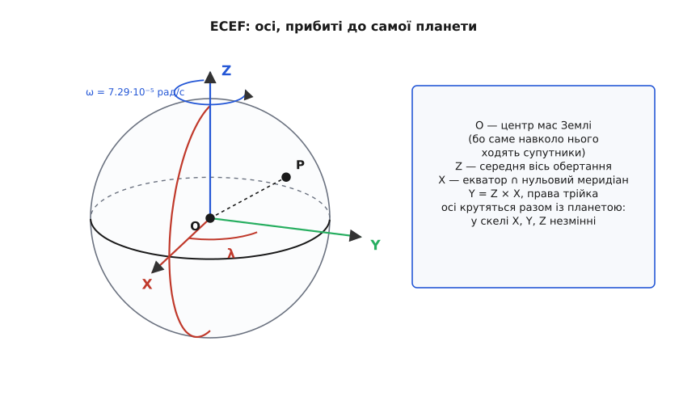
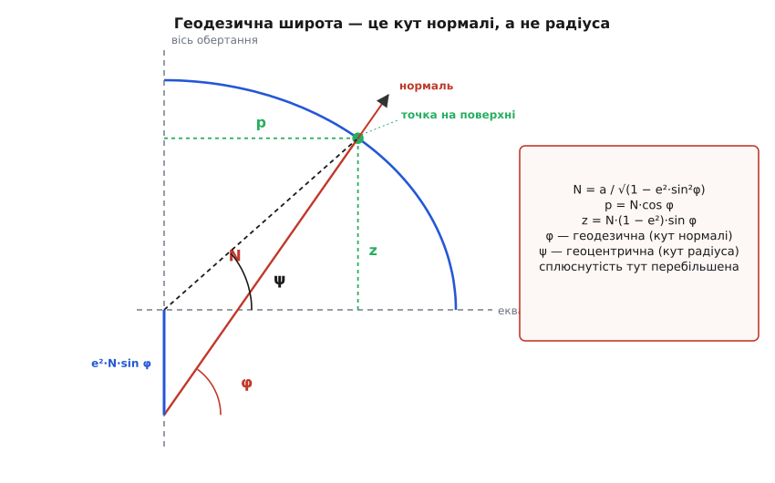
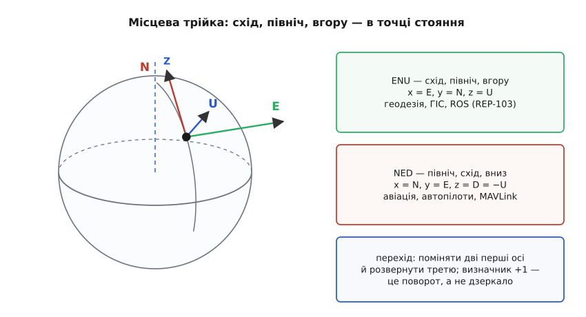

# ECEF, NED і ENU: земні й локальні системи координат

<preknowlist>
- [Система координат](topic:math-geometry/coordinate-system) — початок, осі, одиниця довжини, правило правої руки.
- [Складові вектора](topic:math-algebra/vector-components) — вектор як трійка чисел у заданому базисі.
- [Скалярний добуток](topic:math-algebra/dot-product) — проєкція вектора на одиничний напрям.
- [Векторний добуток](topic:math-algebra/cross-product) — як добудувати третій перпендикуляр і не переплутати його знак.
- [Синус і косинус](topic:math-geometry/sine-cosine) — проєкції одиничного відрізка на осі.
- [Еліпс](topic:math-geometry/ellipse) — канонічне рівняння й ексцентриситет.
- [Матриці повороту](topic:math-algebra/rotation-matrices) — ортогональна матриця, обернена дорівнює транспонованій.
</preknowlist>

Приймач супутникової навігації віддав дві позиції підряд. Перша — 50.4501° широти, 30.5234° довготи, 180 метрів висоти. Друга — 50.4511°, 30.5244°, 195 метрів. Питання, простіше за яке вигадати важко: який вектор веде з першої точки в другу?

Спокуса відняти по стовпчику дає (0.0010°, 0.0010°, 15 м). Це не вектор, і провалюється воно одразу в трьох місцях. Довжину не взяти — під коренем довелося б додавати градуси до метрів. Повернути не можна — поворот перемішує складові, а перемішувати градуси з метрами нема сенсу. І навіть якщо на мить забути про одиниці, той самий приріст довготи 0.0010° означає різну кількість метрів у Києві й у Каїрі.

Причина глибша за незручність запису. Трійка (широта, довгота, висота) — не координати в декартовому розумінні. Кожне з трьох чисел відкладене вздовж свого власного напряму: широта — уздовж меридіана, довгота — уздовж паралелі, висота — уздовж нормалі до поверхні. І всі три напрями **повзуть разом із точкою**: за сто кілометрів на північ меридіан дивиться інакше, паралель коротшає, а нормаль — це вже інша пряма в просторі. Три числа, кожне вздовж свого рухомого напряму, — це не вектор, а підпис на кривій поверхні.

Щоб рахувати рух — віднімати положення, додавати зсуви, писати швидкість і прискорення, повертати покази давача в загальний світ, — потрібне рівно те, чого тут бракує: **декартова система**. Початок, три сталі взаємно перпендикулярні одиничні напрями, одна одиниця довжини. Тоді різниця двох точок — вектор, довжина — теорема Піфагора, поворот — множення на матрицю.

Питання лишається одне: **де прибити початок і осі**. Відповіді дві, і обидві живуть у кожному навігаційному пристрої одночасно. Можна прибити систему до планети як цілого — тоді вона одна на всю Землю й нічого не треба пам'ятати про те, «від чого рахуємо». Можна прибити її до місця, де стоїш, — тоді осі матимуть людський сенс: північ, схід, вгору. Перше називають ECEF, друге — NED і ENU, а вся справа — у точному переході між ними.

## Що дає й чого коштує кожна прив'язка

Земна система виграє однозначністю. Кожна точка планети має в ній рівно одну трійку метрів, і щоб порівняти дві точки, не треба знати нічого, крім самих трійок. Супутник, наземна станція й апарат у повітрі говорять одними числами без пояснень. Але за це доводиться платити: у Києві жодна з її осей не дивиться ні вгору, ні на північ. Команда «піднімись на три метри» — не зміна однієї координати, а зміна всіх трьох одразу, у пропорції, що залежить від широти й довготи. Сила тяжіння в такій системі теж має три ненульові складові, різні для кожного місця.

Місцева трійка виграє рівно тим, чим земна програє: її осі означають те, чим оперує і людина, і регулятор. Похибка положення розкладається на «недоліт по півночі» й «знос на схід», вертикальний канал відокремлений від горизонтального, а горизонт, відносно якого міряють крен, — це просто площина двох перших осей. Ціна теж очевидна: така система прив'язана до однієї точки, тож у двох сусідніх сіл вони різні, і кожна вимагає, щоб десь було записано, де саме її початок.

Звідси й схема, до якої зрештою приходять усі: ECEF як спільна мова, місцева трійка — там, де справді працюють, і чесний перехід між ними. Перехід цей виявиться поворотом, що залежить лише від того, де ти стоїш.

## ECEF: осі, прибиті до планети

Назва — англійська абревіатура *Earth-Centered, Earth-Fixed*: «із центром у Землі, закріплена в Землі». Обидві половини несуть по вимозі, і кожну варто розібрати нарізно, бо жодна не була очевидною.

**Початок — центр мас Землі, а не центр її фігури.** Здавалося б, зручніше поставити початок у центр того еліпсоїда, яким моделюють поверхню, — він же й так фігурує в усіх формулах. Але систему координат мало **описати** — її треба **реалізувати**: мусить існувати спосіб виміряти, де саме проходять ці осі. І тут вирішує спосіб вимірювання. Осі ECEF реалізують за супутниками, а супутник рухається навколо центра мас — це прямий наслідок закону тяжіння, у якому фігурує маса, а не форма. Тому центр мас — єдиний початок, який видно з орбіти. Не випадково серед чотирьох визначальних сталих WGS-84 стоїть геоцентрична гравітаційна стала GM = 3.986004418·10¹⁴ м³/с²: вона потрібна саме для того, щоб із руху супутника відновити, де той центр.

**Вісь Z — середня вісь обертання.** Слово «середня» тут не для краси. Миттєва вісь обертання Землі гуляє відносно самої кори на кілька метрів упродовж року, тож якби Z ішла за нею, координати нерухомої скелі повзли б туди-сюди без жодного руху скелі. Тому домовляються про **умовний полюс** і закріплюють його, а справжнє блукання осі відстежують окремо, як поправку.

**Вісь X — перетин екваторіальної площини з нульовим меридіаном.** Екваторіальна площина вже задана: вона перпендикулярна до Z і проходить через початок. А от куди в цій площині дивитися — питання чистої домовленості, бо в обертовій кулі жоден горизонтальний напрям не кращий за інший. Домовилися про меридіан Гринвіча — точніше, про його сучасну заміну, яка проходить не там, де стоїть старий гринвіцький інструмент, а на 5.3 кутові секунди, тобто близько 102 метрів, східніше. Причина не в зміні домовленості: астрономи міряли довготу від прямовисної лінії, а геодезична довгота відлічується від нормалі до еліпсоїда, і в Гринвічі ці два напрями не збігаються. [Як меридіан «переїхав»](topic:math-geometry/ecef-ned-enu/hist-prime-meridian.md) — про конференцію 1884 року, про різницю астрономічної й геодезичної довготи та про те, чому нуль урешті залишили на місці, хоча туристи фотографуються не на тій лінії.

**Вісь Y добудовується без свободи вибору:** Y = Z × X, тобто трійка права. Жодної додаткової домовленості це не потребує — праву трійку однозначно задає векторний добуток.

**«Закріплена в Землі» означає, що осі обертаються разом із планетою.** Кутова швидкість ω = 7.292115·10⁻⁵ рад/с (теж одна з визначальних сталих WGS-84) — це один оберт за зоряну добу, 86 164 секунди. Наслідок, заради якого все й робилося: **у скелі сталі X, Y, Z**. Її координати не залежать від часу доби, і карта, складена вчора, годиться сьогодні.

Наслідок протилежного знаку треба назвати так само чесно: ECEF **не інерціальна**. Точка на екваторі мчить в інерціальному просторі зі швидкістю ω·a ≈ 465 м/с, і хоч у самій ECEF вона стоїть, порахувати її прискорення «просто двічі продиференціювавши координати» не можна — вилізуть відцентровий і коріолісів члени. [Інерціальна система відліку](topic:ph-mechanics/inertial-frame) — та, у якій вільне тіло рухається прямолінійно й рівномірно; в обертовій системі замість цього доводиться вводити [фіктивні сили](topic:ph-mechanics/coriolis-effect). Саме тому покази гіроскопів інтегрують не в ECEF, а спершу в [геоцентричній інерціальній системі](topic:math-geometry/eci-frame), не пов'язаній з обертанням кори, і вже результат повертають у земні осі.

Слово «закріплена» ідеалізує ще в одному місці. Кора рухається: плити повзуть на кілька сантиметрів за рік, тож координати тієї самої скелі в ECEF повільно міняються, і для геодезії довгого життя доводиться вказувати епоху, на яку вони дійсні. Для апарата, що літає годину, це неістотно; для реєстру нерухомості — істотно. Як еліпсоїд, початок і осі закріплюють у реальних пунктах спостереження, описано в [датумі WGS-84](topic:math-geometry/wgs84-datum).

> 🔧 **Навіщо це.** Приймач [супутникової навігації](topic:hw-sensing/gnss) не «отримує широту від супутника» — він розв'язує систему рівнянь на псевдовідстані, у якій положення супутників задані в ECEF, тож і природний розв'язок виходить у ECEF. Широта, довгота й висота, які видно в текстовому рядку на виході, — це вже перетворення, зроблене всередині приймача останнім кроком. Тому в бінарних форматах позиція часто лежить саме як X, Y, Z у сантиметрах: це те, що приймач порахував насправді, ще до переведення в градуси.


*Три осі, прибиті до самої планети. Початок — у центрі мас, бо саме навколо нього ходять супутники, якими цю систему й реалізують. Вісь Z дивиться в умовний полюс, вісь X — туди, де екватор перетинає нульовий меридіан, вісь Y добудована векторним добутком до правої трійки. Довгота λ — це кут повороту в екваторіальній площині від осі X. Уся конструкція крутиться разом із корою зі швидкістю ω, тому нерухомий камінь має незмінні X, Y, Z — і тому ж ця система не інерціальна.*

## Від (φ, λ, h) до ECEF: точний перехід

Тепер треба зшити дві мови: підпис на поверхні (φ, λ, h) і трійку метрів (X, Y, Z). Зшивається воно трьома рядками формул, але в них є деталь, без якої все розлазиться на кілометри.

Деталь ось у чому: **широта визначена через нормаль, а не через радіус**. На кулі різниці немає — промінь із центра і є нормаллю до поверхні. На еліпсоїді це дві різні прямі, і треба вибрати, яку з них має на увазі φ. Вибір продиктувала історія вимірювання: широту міряли астрономічно, як кут місцевої вертикалі до площини екватора, а нормаль до еліпсоїда — це і є модель тієї місцевої вертикалі. Тому **геодезична широта — кут між нормаллю в точці й екваторіальною площиною**. Кут променя з центра (його називають геоцентричною широтою) — інше число: на середніх широтах вони розходяться майже на 11.5 кутової хвилини, а це понад двадцять кілометрів уздовж поверхні. Сплутати їх — не дрібниця.

Далі — сама викладка. Розріз Землі площиною меридіана дає еліпс із півосями a (екваторіальна) і b (полярна). У цій площині зручні дві координати: p — відстань до осі обертання, z — уздовж осі. Точка поверхні задовольняє

```text
p²/a² + z²/b² = 1
```

Нормаль до кривої — напрям градієнта лівої частини, тобто пропорційний (p/a², z/b²). Кут цього напряму з горизонталлю і є геодезична широта:

```text
tan φ = (z/b²) / (p/a²) = a²·z / (b²·p)
```

Сплюснутість зручно міряти ексцентриситетом: e² = 1 − b²/a², звідки b² = a²(1 − e²). Тоді рівність для тангенса дає z через p:

```text
z = (b²/a²)·p·tan φ = (1 − e²)·p·tan φ
```

Підставимо це в рівняння еліпса й винесемо p²:

```text
p²/a² + (1 − e²)²·p²·tan²φ / (a²·(1 − e²)) = 1
(p²/a²)·[1 + (1 − e²)·tan²φ] = 1
```

Квадратна дужка згортається, якщо звести до спільного знаменника cos²φ:

```text
1 + (1 − e²)·tan²φ = [cos²φ + (1 − e²)·sin²φ] / cos²φ = (1 − e²·sin²φ) / cos²φ
```

(остання рівність — просто cos²φ + sin²φ = 1). Отже

```text
p² = a²·cos²φ / (1 − e²·sin²φ)
p  = a·cos φ / √(1 − e²·sin²φ)
```

Корінь у знаменнику зустрічається так часто, що вираз перед ним дістав власне ім'я:

```text
N(φ) = a / √(1 − e²·sin²φ)
```

Тепер обидві координати короткі: p = N·cos φ, а з рівності z = (1 − e²)·p·tan φ одразу виходить z = N·(1 − e²)·sin φ.

У N є точний геометричний зміст, і його варто побачити, бо інакше з цією величиною неможливо працювати без плутанини. Пройдімо з точки поверхні **вниз уздовж нормалі**. Напрям нормалі в наших координатах — (cos φ, sin φ), тож, відступивши назад на довжину s, дістанемо першу координату p − s·cos φ. Вона обнуляється при s = p/cos φ = N. Отже: **N — це відстань від точки поверхні до осі обертання, відміряна вздовж нормалі.** Не радіус із центра. Заодно видно, де саме нормаль перетинає вісь: підставивши s = N у другу координату, дістаємо z = N(1 − e²)·sin φ − N·sin φ = −e²·N·sin φ. Число від'ємне — **нормаль влучає нижче центра Землі**, і промахується рівно на e²·N·sin φ. Ось звідки в z множник (1 − e²), а в p його немає: сплюснутість «з'їдає» саме вертикальну складову.

Побічний висновок, який добре ловить суть: N — не відстань, а радіус кривини, тож він не зобов'язаний лежати між полярним і екваторіальним радіусами. На полюсі N = a²/b = 6 399 594 м — **більше за екваторіальний радіус** a = 6 378 137 м. Жодного протиріччя тут немає: біля полюса поверхня пласкіша, а пласкіша поверхня має більший радіус кривини.

Висоту h відкладають **уздовж тієї самої нормалі** — не до центра й не по вертикалі карти. Одиничний вектор нормалі в площині меридіана — (cos φ, sin φ), тож підняття на h просто додає h до кожної складової з відповідним множником:

```text
p = (N + h)·cos φ
z = (N·(1 − e²) + h)·sin φ
```

Асиметрія тут не помилка: h додається до N у першому рядку й до N(1 − e²) у другому, бо множник (1 − e²) належить еліпсоїду, а висота міряється вже поза ним, по прямій.

Останній крок тривіальний. Досі ми жили в площині меридіана; щоб потрапити в тривимір, треба повернути цю площину на довготу λ навколо осі Z:

```text
X = (N + h)·cos φ·cos λ
Y = (N + h)·cos φ·sin λ
Z = (N·(1 − e²) + h)·sin φ
```

Це повний і точний перехід. Наближень у ньому немає жодного: що завгодно, від сантиметра до континенту, рахується цими трьома рядками.

**Точка над Києвом у ECEF.** Дано φ = 50.4501°, λ = 30.5234°, h = 180 м; сталі WGS-84: a = 6 378 137 м (точно), e² = 0.00669438.

```text
sin φ = 0.7710703        cos φ = 0.6367500
sin λ = 0.5078902        cos λ = 0.8614218

1 − e²·sin²φ    = 1 − 0.00669438 · 0.5945494 = 0.99601986
√(1 − e²·sin²φ) = 0.99800795
N = 6378137 / 0.99800795 = 6390868.0 м

p = (N + h)·cos φ         = 6391048.0 · 0.6367500 = 4069499.8 м
X = p·cos λ               = 4069499.8 · 0.8614218 = 3505555.9 м
Y = p·sin λ               = 4069499.8 · 0.5078902 = 2066859.1 м
Z = (N·(1−e²) + h)·sin φ  = 6348265.4 · 0.7710703 = 4894958.8 м

перевірка: √(X² + Y² + Z²) = 6365646 м
            N              = 6390868 м     різниця 25 222 м
```

Остання перевірка не формальність. Вона в лоб показує різницю між двома величинами, які легко сплутати: відстань до центра Землі — 6 365 646 метрів, а N — 6 390 868, і на широті Києва вони розходяться на двадцять п'ять кілометрів. Той, хто підставить у формулу «радіус Землі» замість N, помилиться не на сантиметри.

> 🔧 **Навіщо це.** Висота h у цих формулах — **над еліпсоїдом**, тобто над математичною поверхнею, а не над рівнем моря. Різниця між нею і звичною висотою над рівнем моря сягає десятків метрів і міняється від місця до місця; що це за різниця й куди її дівати, розібрано в темі [геоїд і висота над рівнем моря](topic:math-geometry/geoid-and-amsl). Плутанина тут дає найпідступніші наслідки: горизонтальні координати правильні, апарат летить куди треба, а вертикальний профіль зміщений на сталу величину, і виявляється це вже під час посадки.

Зворотний хід — із (X, Y, Z) назад у (φ, λ, h) — влаштований геть інакше. Довгота дається одразу: λ = atan2(Y, X). А от φ і h зчеплені між собою через N, яке саме залежить від φ, тож рівняння виходить неявним, і елементарної формули «в лоб» для нього немає: задача зводиться до рівняння четвертого степеня. [Як розв'язують обернену задачу](topic:math-geometry/ecef-ned-enu/math-ecef-to-geodetic.md) — чому проста ітерація по φ збігається за кілька кроків, у чому фокус підстановки Боуринга 1976 року, що дає майже точну відповідь без ітерацій узагалі, і що ламається біля полюсів та поблизу центра Землі.


*Головна тонкість усього переходу. На еліпсоїді нормаль у точці поверхні не дивиться в центр: продовжена вниз, вона перетинає вісь обертання нижче центра рівно на e²·N·sin φ. Тому геодезична широта φ (кут нормалі до площини екватора) і геоцентрична ψ (кут радіуса) — різні числа. Довжина відрізка від точки до осі обертання вздовж нормалі і є N; саме через неї виражаються обидві координати, а множник (1 − e²) у вертикальній складовій — прямий наслідок того самого промаху нормалі повз центр. Сплюснутість на рисунку сильно перебільшена — справжня становить менш як 0.34 %.*

## Місцева трійка: як її будують

Тепер друга прив'язка. Стоїмо в точці (φ, λ) і хочемо три осі, що означають щось на місці. Кожну треба не назвати, а **вивести**, бо саме у виведенні видно, чому вони саме такі й де вони перестають існувати.

**Вгору.** Природний «верх» на еліпсоїді — нормаль до поверхні, і вона вже здобута: у площині меридіана це напрям (cos φ, sin φ), а поворот на довготу розкладає його на три складові:

```text
u = ( cos φ·cos λ,  cos φ·sin λ,  sin φ )
```

Вектор одиничний: cos²φ·cos²λ + cos²φ·sin²λ + sin²φ = cos²φ + sin²φ = 1.

Дві чесні поправки до слова «вгору». Перша: u **не** дивиться від центра Землі — це той самий промах нормалі повз центр, і збігаються два напрями лише на екваторі та на полюсах. Друга: u **не** збігається з напрямом сили тяжіння. Реальна прямовисна лінія відхиляється від нормалі до еліпсоїда на кутові секунди — у горах на десятки секунд, — бо тяжіння реагує на справжній розподіл мас, а еліпсоїд про той розподіл нічого не знає. Це відхилення й пов'язана з ним [поверхня геоїда](topic:math-geometry/geoid-and-amsl) — окрема історія; тут важить лише те, що місцева «вертикаль» математична, а не фізична, і там, де вирішують частки кутової секунди, ці дві вертикалі розрізняють. У всьому іншому u — звичайна [нормаль до поверхні](topic:math-geometry/surface-normal), з тими самими властивостями, що й у будь-якої гладкої поверхні.

**На схід.** Схід — напрям, у якому росте довгота, коли широта й висота стоять на місці. Отже, треба продиференціювати положення по λ. У формулах переходу λ входить лише в пару (cos λ, sin λ), помножену на p, тож

```text
∂r/∂λ = p·( −sin λ,  cos λ,  0 )
```

Довжина цього вектора дорівнює p, тож одиничний схід —

```text
e = ( −sin λ,  cos λ,  0 )
```

Три речі в ньому варто помітити. По-перше, у ньому **немає широти взагалі**: східний напрям однаковий у всіх точках одного меридіана, від екватора до полярного кола. По-друге, третя складова — **точний нуль**: схід ніколи не має вертикальної складової в ECEF, бо рух по паралелі відбувається в площині, перпендикулярній до осі Z. По-третє, при p = 0 ділити на довжину нема на що: на самих полюсах схід невизначений, і жодна формула цього не врятує — там просто немає виділеного горизонтального напряму. Це загальна властивість [криволінійних координат](topic:math-analysis/curvilinear-coordinates): місцевий базис існує там, де самі координати не вироджуються.

**На північ** добудовується векторним добутком, і порядок множників тут не дрібниця. Щоб трійка (e, n, u) вийшла правою, беремо n = u × e:

```text
n_x = u_y·e_z − u_z·e_y = 0 − sin φ·cos λ                = −sin φ·cos λ
n_y = u_z·e_x − u_x·e_z = −sin φ·sin λ − 0               = −sin φ·sin λ
n_z = u_x·e_y − u_y·e_x = cos φ·cos²λ + cos φ·sin²λ      =  cos φ
```

```text
n = ( −sin φ·cos λ,  −sin φ·sin λ,  cos φ )
```

Що це справді північ, видно з третьої складової: cos φ додатний на всіх широтах від −90° до 90°, тобто вектор завжди має складову вздовж +Z, «до полюса». І він одиничний: sin²φ·(cos²λ + sin²λ) + cos²φ = 1.

Ортогональність трійки перевіряється трьома рядками:

```text
e·u = −sin λ·cos φ·cos λ + cos λ·cos φ·sin λ                     = 0
e·n =  sin λ·sin φ·cos λ − cos λ·sin φ·sin λ                     = 0
n·u = −sin φ·cos φ·cos²λ − sin φ·cos φ·sin²λ + cos φ·sin φ       = 0
```

Три одиничні взаємно перпендикулярні вектори — це готовий ортонормований базис. Записавши їх рядками, дістаємо матрицю переходу з ECEF у місцеві осі:

```text
        [ −sin λ         cos λ         0     ]
R_ENU = [ −sin φ·cos λ  −sin φ·sin λ   cos φ ]
        [  cos φ·cos λ   cos φ·sin λ   sin φ ]
```

Множення на неї бере вектор, записаний у ECEF, і видає його ж, записаний у місцевій трійці: перший рядок дає східну складову, другий — північну, третій — вертикальну. Це чиста [зміна базису](topic:math-algebra/change-of-basis): сам вектор не рухається, міняється лише те, у яких напрямах його розкладають. Матриця ортогональна, бо її рядки ортонормовані, тож обернений перехід не треба виводити окремо — це просто транспонування, R_ECEF←ENU = R_ENUᵀ. Визначник дорівнює +1, бо права трійка перейшла в праву. У навігації таку матрицю називають [матрицею напрямних косинусів](topic:math-geometry/direction-cosine-matrix): кожен її елемент — косинус кута між віссю однієї системи й віссю другої.

Читається вона й геометрично, у два повороти. Спершу поворот навколо Z на кут λ ставить одну з горизонтальних осей у площину меридіана точки — і породжує рядок e, який якраз не залежить від широти. Далі поворот навколо цієї щойно здобутої східної осі на кут φ піднімає горизонтальну вісь до нормалі — і породжує рядки n та u. Третьої дії немає: два повороти вичерпують усю різницю між земними осями й місцевими, бо саме двома кутами й задається точка на поверхні.

**Найважливіше застереження: точка й вектор перетворюються по-різному.** Матриця повороту нічого не знає про початок — вона вміє тільки повертати напрями. Тому

- **вільний вектор** (швидкість, прискорення, покази акселерометра, різниця двох положень) переводиться **самим лише поворотом**: v_ENU = R·v_ECEF;
- **точка** спершу мусить стати вектором: віднімаємо ECEF-координати початку місцевої системи й лише потім повертаємо: enu = R·(r − r₀).

Забуте віднімання видає себе одразу — результат виходить порядку земного радіуса. А от друга форма тієї самої помилки тонша: матрицю треба брати в **точці-початку** місцевої системи, а не в поточній точці апарата. Обидва варіанти дають майже однакову відповідь поблизу початку, тому неправильний проходить усі короткі перевірки, а на кілометрі виявляється кутовим перекосом усієї координатної сітки.


*Три місцеві напрями в точці стояння: схід уздовж паралелі (він завжди горизонтальний і не залежить від широти), північ уздовж меридіана, вгору вздовж нормалі. Жоден із них не збігається з віссю Z земної системи — саме тому перехід між системами й потрібен. Ті самі три напрями порядкують двома різними способами: ENU ставить схід першим і вертикаль угору, NED — північ першою і вертикаль униз. Обидві трійки праві, тож перехід між ними — поворот, а не дзеркало.*

## Чому місцевих трійок дві

Напрями виведено, лишилося їх упорядкувати — і ось тут світ розділився надвоє. ENU бере (схід, північ, вгору): x = E, y = N, z = U. NED бере (північ, схід, вниз): x = N, y = E, z = D.

Обидві — праві трійки, і це варто перевірити, бо на око NED виглядає як дзеркальне відображення ENU. Перехід між ними міняє місцями дві перші осі й розвертає третю:

```text
    [ 0  1  0 ]
P = [ 1  0  0 ]        det P = +1
    [ 0  0 −1 ]
```

Сама перестановка двох осей дає визначник −1, тобто дзеркало; розворот третьої додає ще −1; разом +1. Отже, це **поворот**, а не відбиття, і жодні векторні добутки, кватерніони чи правило правої руки від переходу не ламаються. Ба більше: це поворот на 180° навколо горизонтальної осі, спрямованої на північний схід, — така вісь якраз міняє схід із північчю місцями й перевертає вертикаль.

**Чому авіація обрала NED.** Причина не в тому, що «вниз зручніше», а в тому, як NED стикується з осями самого апарата. Літальний апарат описують у трійці «вперед, праворуч, вниз»: x уздовж носа, y на праве крило, z під черево. Це теж права трійка, і в горизонтальному польоті на північ вона збігається з NED повністю. А далі починається головне: [кути Ейлера](topic:math-geometry/euler-angles) у цій парі трійок дають рівно те, що звик бачити пілот.

- Поворот навколо x (уперед) за правилом правої руки веде від y (праве крило) до z (вниз) — праве крило опускається, і це **додатний крен**.
- Поворот навколо y (праве крило) веде від z (вниз) до x (уперед) — ніс піднімається, і це **додатний тангаж**.
- Поворот навколо z (вниз) веде від x (уперед) до y (праворуч) — ніс іде вправо, тобто курс **росте за годинниковою стрілкою від півночі**, точнісінько як на компасі.

Останній пункт і є головний виграш: у NED кут рискання **дорівнює** курсу — без перетворень, без зміни знака й без вибору початку відліку. У ENU той самий поворот довелося б міряти проти годинникової стрілки від сходу, і кожен обмін даними з компасом чи з картою вимагав би переведення.

**Чому геодезія й робототехніка обрали ENU.** Там панує інша природність. Карта на екрані має x праворуч і y вгору — це вже готова пара (схід, північ), і нічого перевертати не треба. Висота росте вгору, як і в будь-якій людській розмові про висоту. Кут, відлічений проти годинникової стрілки від осі x, — це звичайний математичний кут, під який заточена вся тригонометрія і всі бібліотеки. Стандарт ROS (REP-103) закріплює ENU для зовнішніх систем відліку саме з цих міркувань.

Жодна з двох не «правильніша» — кожна знімає ту тертя, яке заважає саме її галузі. Але наслідок роздвоєності цілком матеріальний: кожен стик між авіаційним стеком (MAVLink, автопілоти — NED) і робототехнічним (ROS — ENU) мусить робити перетворення, і забуте перетворення виглядає як апарат, що дзеркалить власні рухи: команда «на північ» веде на схід, «вгору» — вниз. Для положень і швидкостей перестановка проста; для кватерніонів орієнтації її треба застосувати **з двох боків** — і до світової трійки, і до трійки апарата, — тож саме там і народжується більшість помилок. У повідомленнях MAVLink через це система відліку передається явним полем, а не «мається на увазі» ([координати й одиниці](topic:com-protocol/coordinate-frames-units)).

> 🔧 **Навіщо це.** Трійка чисел без назви системи — це не дані. Пара (5, 0, 0) означає «п'ять метрів на схід» в ENU і «п'ять метрів на північ» у NED; від'ємна третя складова означає «нижче» в ENU і «вище» в NED. Тому перше, що треба встановити, читаючи лог чи повідомлення, — у якій трійці записані числа. Найдешевша перевірка під час налагодження: пусти апарат чітко на північ і подивись, у якому каналі виріс додатний відлік — цього досить, щоб розрізнити NED і ENU за секунду, не читаючи документації.

## Уся ланка й чого вона варта

Ланцюг збирається так. Точку-початок місцевої системи задають один раз у геодезичних координатах і одразу переводять у ECEF — це r₀. Заразом рахують матрицю R(φ₀, λ₀): вона залежить лише від початку й далі не міняється. Кожна нова позиція йде тим самим шляхом: (φ, λ, h) → ECEF → відняти r₀ → помножити на R → метри на схід, північ і вгору. Назад — транспонованою матрицею, додаванням r₀ і оберненою задачею.

**Швидкість через ту саму матрицю.** Апарат над Києвом (φ = 50.4501°, λ = 30.5234°) іде рівно на північ зі швидкістю 50 м/с і набирає висоту 3 м/с. У NED це (50, 0, −3), у ENU — (0, 50, 3). Треба записати цю швидкість у ECEF.

```text
базис у точці:
e = ( −0.5078902,   0.8614218,   0         )
n = ( −0.6642168,  −0.3916191,   0.6367500 )
u = (  0.5485103,   0.3233991,   0.7710703 )

v_ECEF = 0·e + 50·n + 3·u
       = 50·( −0.6642168, −0.3916191, 0.6367500 )
       +  3·(  0.5485103,  0.3233991, 0.7710703 )
       = ( −33.2108, −19.5810, 31.8375 )
       + (   1.6455,   0.9702,  2.3132 )
       = ( −31.5653, −18.6108, 34.1507 )  м/с

перевірка довжини:
√(31.5653² + 18.6108² + 34.1507²) = 50.0899 м/с
√(50² + 3²)                       = 50.0899 м/с
```

Довжина збереглася до останньої цифри — і це не збіг, а прямий наслідок ортогональності: поворот не здатен змінити довжину вектора. Заразом видно, наскільки земні осі неприродні для місцевої задачі: рух чітко на північ має в ECEF усі три складові ненульовими, і жодна з них не схожа на 50.

Ось увесь ланцюг у коді — від геодезичних координат до місцевих метрів.

:::tabs
```cpp
#include <cmath>
#include <numbers>

// WGS-84: перші дві сталі — точні за означенням, третя з них випливає.
constexpr double WGS84_A  = 6378137.0;                  // велика піввісь, м
constexpr double WGS84_F  = 1.0 / 298.257223563;        // сплюснутість
constexpr double WGS84_E2 = WGS84_F * (2.0 - WGS84_F);  // квадрат ексцентриситету
constexpr double DEG      = std::numbers::pi / 180.0;

struct Geodetic { double lat_deg, lon_deg, h; };
struct Vec3     { double x, y, z; };
struct Enu      { double east, north, up; };

// (φ, λ, h) -> ECEF. Тільки double: самі координати мають порядок 6.4·10⁶ м.
Vec3 geodetic_to_ecef(Geodetic g) {
    const double phi = g.lat_deg * DEG, lam = g.lon_deg * DEG;
    const double s = std::sin(phi), c = std::cos(phi);
    const double N = WGS84_A / std::sqrt(1.0 - WGS84_E2 * s * s);
    const double p = (N + g.h) * c;              // відстань до осі обертання
    return { p * std::cos(lam),
             p * std::sin(lam),
             (N * (1.0 - WGS84_E2) + g.h) * s };
}

// Поворот ВІЛЬНОГО вектора з ECEF у місцеву трійку — рядки матриці R_ENU.
Enu rotate_to_enu(Vec3 v, double lat_deg, double lon_deg) {
    const double phi = lat_deg * DEG, lam = lon_deg * DEG;
    const double sp = std::sin(phi), cp = std::cos(phi);
    const double sl = std::sin(lam), cl = std::cos(lam);
    return { -sl * v.x + cl * v.y,
             -sp * cl * v.x - sp * sl * v.y + cp * v.z,
              cp * cl * v.x + cp * sl * v.y + sp * v.z };
}

// ТОЧКА: спершу відняти початок, аж потім повертати — і брати кути ПОЧАТКУ.
Enu point_to_enu(Geodetic origin, Geodetic p) {
    const Vec3 r0 = geodetic_to_ecef(origin);
    const Vec3 r  = geodetic_to_ecef(p);
    return rotate_to_enu({ r.x - r0.x, r.y - r0.y, r.z - r0.z },
                         origin.lat_deg, origin.lon_deg);
}

// NED — та сама трійка в іншому порядку: поміняти осі й розвернути вертикаль.
Vec3 enu_to_ned(Enu q) { return { q.north, q.east, -q.up }; }
```
```py
import math

# WGS-84: перші дві сталі — точні за означенням, третя з них випливає.
WGS84_A = 6378137.0                    # велика піввісь, м
WGS84_F = 1.0 / 298.257223563          # сплюснутість
WGS84_E2 = WGS84_F * (2.0 - WGS84_F)   # квадрат ексцентриситету


def geodetic_to_ecef(lat_deg, lon_deg, h):
    """(φ, λ, h) -> ECEF; координати мають порядок 6.4·10⁶ м."""
    phi, lam = math.radians(lat_deg), math.radians(lon_deg)
    s, c = math.sin(phi), math.cos(phi)
    n = WGS84_A / math.sqrt(1.0 - WGS84_E2 * s * s)
    p = (n + h) * c                             # відстань до осі обертання
    return (p * math.cos(lam),
            p * math.sin(lam),
            (n * (1.0 - WGS84_E2) + h) * s)


def rotate_to_enu(v, lat_deg, lon_deg):
    """Поворот ВІЛЬНОГО вектора з ECEF у місцеву трійку — рядки матриці R_ENU."""
    phi, lam = math.radians(lat_deg), math.radians(lon_deg)
    sp, cp = math.sin(phi), math.cos(phi)
    sl, cl = math.sin(lam), math.cos(lam)
    x, y, z = v
    return (-sl * x + cl * y,
            -sp * cl * x - sp * sl * y + cp * z,
            cp * cl * x + cp * sl * y + sp * z)


def point_to_enu(origin, p):
    """ТОЧКА: спершу відняти початок, аж потім повертати — на кути ПОЧАТКУ."""
    x0, y0, z0 = geodetic_to_ecef(*origin)
    x, y, z = geodetic_to_ecef(*p)
    return rotate_to_enu((x - x0, y - y0, z - z0), origin[0], origin[1])


def enu_to_ned(q):
    """NED — та сама трійка в іншому порядку."""
    east, north, up = q
    return (north, east, -up)
```
:::

Прогнавши цим кодом дві позиції з початку розмови — (50.4501°, 30.5234°, 180 м) і (50.4511°, 30.5244°, 195 м), — дістанемо ENU-зсув (71.025, 111.242, 14.999) метрів: сімдесят один метр на схід, сто одинадцять на північ і рівно ті п'ятнадцять метрів висоти, які й були різницею у вхідних даних. Вертикальний канал відтворив висоту з точністю до міліметра — це найкраща перевірка того, що трійка справді ортогональна й нічого нікуди не «протекло».

Порядок величин у ECEF накладає жорстку вимогу на тип числа. У [числі одинарної точності](topic:hw-arch/floating-point) 32 біти дають 24 біти мантиси, тож поблизу 6.4 мільйона метрів сусідні представні числа стоять рівно за **0.5 метра** одне від одного. Отже, ECEF у `float` — це сітка з півметровим кроком: сантиметрова точність, заради якої купували приймач, гине на першому ж присвоєнні. Тому ECEF рахують у подвійній точності, без варіантів. А **після** віднімання початку картина інша: місцеві метри мають порядок сотень або тисяч, і там одинарна точність дає крок у частки мікрометра — із величезним запасом. Звідси правило, що прямо випливає з арифметики й не потребує жодного досвіду: спершу відняти в подвійній точності, потім, якщо треба, знижувати. Переставити ці дві дії не можна.

Тепер видно, як із точного ланцюга виростає його спрощена версія. Візьмімо дві близькі точки й подивімось, у що перетворюється результат при малих приростах координат:

```text
ΔE ≈ (N + h)·cos φ·Δλ
ΔN ≈ (M + h)·Δφ              (Δφ, Δλ — у радіанах)
ΔU ≈ Δh
```

де M — **меридіанний радіус кривини**, M = a·(1 − e²) / (1 − e²·sin²φ)^(3/2): той самий геометричний зміст, що й у N, але для руху по меридіану, а не по паралелі. Це і є формули [місцевої дотичної площини](topic:math-geometry/local-tangent-plane) — плаского наближення, у якому кривина Землі відкидається. Точний ланцюг не суперечить йому, а показує, звідки в ньому беруться коефіцієнти.

Числа на широті 50° кажуть, наскільки ця різниця жива:

```text
меридіанний радіус  M = 6 372 956 м  →           111 229 м на градус широти
нормальний радіус   N = 6 390 702 м  → N·cos φ =  71 696 м на градус довготи

куля з R = 6 371 000 м               →           111 195 м на градус широти
                                                  71 475 м на градус довготи
```

По півночі куля майже не бреше — 34 метри на градус, три сотих відсотка, і то радше випадково: середній радіус кулі на цій широті мало не збігся з меридіанним. По довготі промах уже 221 метр на градус, тобто **0.31 %** — три метри на кожен кілометр на схід. Для апарата в радіусі сотні метрів це міліметри й плаского наближення вистачає з головою. Для машини, що обробляє поле десять кілометрів завширшки, це вже тридцять метрів упоперек — і сфероїд доводиться поважати.

Підсумкова думка, яку легко проґавити за формулами, така. Крива поверхня **не має власного базису**: ні на сфері, ні на еліпсоїді немає трьох сталих перпендикулярних напрямів, спільних для всіх точок. Тому базис доводиться позичати. Позичиш у планети як цілого — дістанеш систему, у якій усі точки рівні й нікому не треба нічого пояснювати, але в якій жоден напрям не означає нічого на місці. Позичиш у точки, де стоїш, — дістанеш осі з людським сенсом, дійсні лише тут, і за кожну треба пам'ятати, де вона прибита. Матриця R(φ, λ) — рівно ціна обміну однієї позики на іншу. А всі інші деталі, що виглядають як окремі складнощі — висота вздовж нормалі, N замість радіуса, множник (1 − e²), вибір між NED і ENU, — насправді одне питання, задане різними способами: **у чиєму базисі зараз записано ці три числа**.
