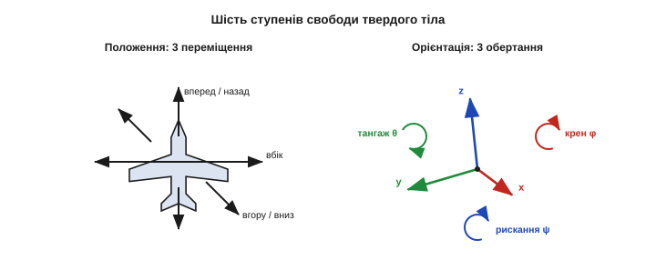
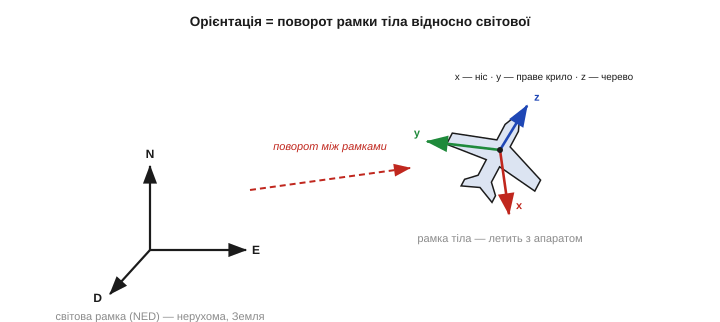
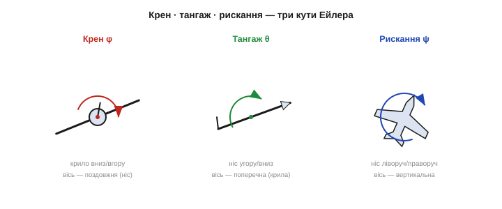
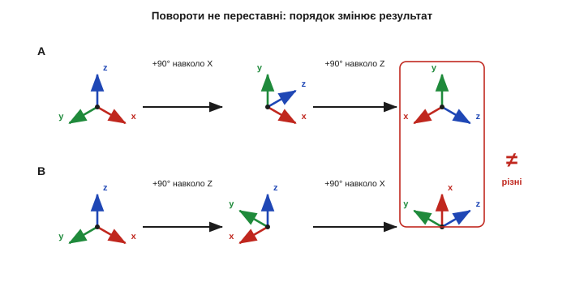
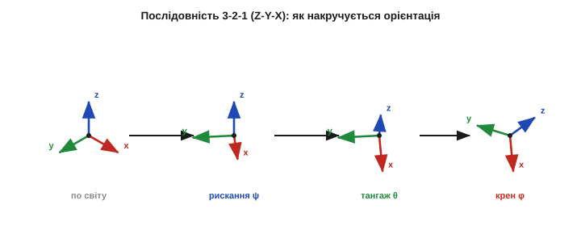
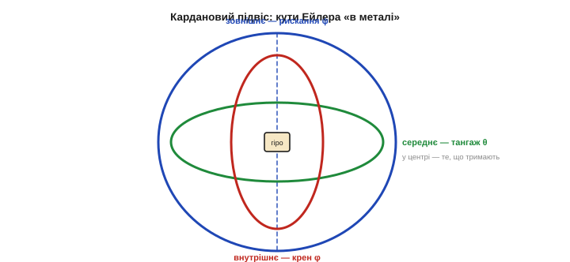
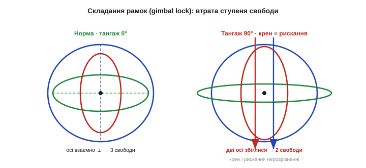
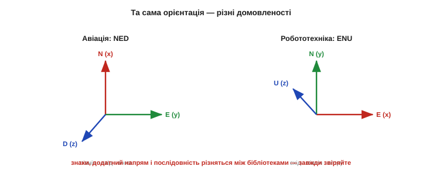

# Орієнтація в просторі: кути Ейлера

Щоб апарат **тримав** заданий поворот, його спершу треба вміти **назвати**. Як сказати числами, що «дрон нахилений отак», а «ніс дивиться туди»? Інтуїтивного «трохи завалений ліворуч» машині замало — потрібна сувора, однозначна мова орієнтації, у якій будь-який поворот тіла задається кількома числами, а комп'ютер може ці числа порівнювати, додавати й виправляти. Найдавніша й найнаочніша така мова — **кути Ейлера**: три прості повороти, з яких складається будь-яка орієнтація. Вони ж — крен, тангаж і рискання, що їх ви чули від пілотів. Розберемо, що це таке, чому **порядок** поворотів критичний і де ця зручна мова підступно ламається.

### Орієнтація — це окремі три ступені свободи

Почнемо з того, **скільки** чисел узагалі треба, щоб повністю задати стан твердого тіла в просторі. Відповідь — **шість**. Три з них кажуть, **де** тіло перебуває, — це **переміщення** вздовж трьох осей (вперед-назад, ліворуч-праворуч, вгору-вниз). Ще три кажуть, **як воно повернуте**, — це **орієнтація**. Разом їх звуть **шістьма ступенями свободи** (*6 DOF*, *degrees of freedom*).


*Тверде тіло в просторі має **6 ступенів свободи**: три **переміщення** (вздовж осей вперед/вбік/вгору-вниз) і три **обертання** (крен/тангаж/рискання). Положення й орієнтація — **незалежні**: апарат може стояти на місці й крутитися або летіти прямо, не обертаючись. Цей розділ — лише про другу трійку, про **орієнтацію**.*

Ключове усвідомлення: положення й орієнтація **незалежні** одне від одного. Квадрокоптер може висіти нерухомо в одній точці й водночас обертатися довкола себе; може й летіти прямою, зовсім не повертаючись. Тому орієнтацію вивчають **окремо** — як власну трійку чисел, що описує лише **поворот** тіла, незалежно від того, де воно. Саме цією трійкою — і нічим іншим — займається весь цей розділ: положенням у просторі (навігацією) ми тут не цікавимося.

Чому орієнтацій саме три, не більше й не менше? Бо обертатися тверде тіло може довкола трьох незалежних осей — а будь-який, навіть найскладніший, поворот завжди розкладається на комбінацію поворотів навколо цих трьох. Це — наслідок геометрії тривимірного простору, і його строго довів ще у XVIII столітті швейцарський математик **Леонард Ейлер** (*Leonhard Euler*): будь-яку орієнтацію тіла можна отримати **трьома** послідовними поворотами навколо осей. Звідси й назва — кути Ейлера.

Варто підкреслити: ці три обертальні свободи **незалежні** одна від одної — крен можна змінювати, не чіпаючи тангажа й рискання, і навпаки. Саме тому орієнтацію не вдасться стиснути до меншого числа, ніж три: жоден із трьох кутів не виводиться з двох інших. (Якби тіло було не твердим, а гнучким, ступенів свободи стало б більше — та ми весь час говоримо про **тверде** тіло, форму якого вважаємо незмінною: дрон, літак, корабель.) Ці три числа — мінімальний і водночас повний опис того, **як** тіло повернуте: менше — недостатньо, більше — надлишок.

### Дві системи відліку: рамка тіла й рамка світу

Сказати «апарат повернутий» можна лише **відносно чогось**. Тому орієнтація завжди живе між **двома системами відліку** (рамками).

Перша — **світова** (або навігаційна) рамка: вона нерухомо прив'язана до Землі. В авіації її зазвичай беруть як **NED** — осі дивляться на **N**orth (північ), **E**ast (схід) і **D**own (вниз, до центра Землі). Це наш нерухомий «глобус», відносно якого все вимірюється.

Друга — **рамка тіла**: вона жорстко приклеєна до самого апарата й **летить разом із ним**. Її осі звичайно беруть так: **x** — уперед, крізь ніс; **y** — праворуч, уздовж правого крила; **z** — униз, крізь черево. Куди дивиться апарат — туди й дивляться осі його рамки.


*Орієнтація — це **поворот рамки тіла відносно світової**. Світова рамка (NED) нерухомо прив'язана до Землі: північ, схід, униз. Рамка тіла (вперед-x, праворуч-y, вниз-z) летить з апаратом і повертається разом із ним. Завдання «знати орієнтацію» — це знати, **наскільки** і **як** рамка тіла відхилена від світової.*

Тепер можна точно сказати, що таке орієнтація: це **поворот, яким рамка тіла відхилена від світової**. Якщо осі апарата збігаються зі світовими — орієнтація «нульова», апарат летить рівно на північ. Будь-яке відхилення — це поворот, і саме його ми хочемо описати трьома числами. Уся решта теми — про те, **які** це числа.

Тут одразу проступає, чому орієнтацію взагалі непросто **втримати** в коді. [Гіроскоп](topic:hw-sensing/gyroscope) міряє швидкість обертання **у власній рамці тіла** — скільки градусів за секунду апарат крутиться навколо своїх x, y, z. Щоб із цих швидкостей дізнатися, як апарат стоїть **у світі**, їх треба не просто додати, а правильно **перевести** між рамками — і робити це десятки чи сотні разів на секунду, бо рамка тіла щомиті вже інша. Найменша похибка в цьому переведенні нагромаджується крок за кроком, і оцінка орієнтації поволі «спливає» — звідси й уся морока з [дрейфом гіроскопа](topic:hw-sensing/imu-noise-bias-drift). Отже, вибір **зручної** мови орієнтації — не математична забаганка, а питання того, чи зможе мікроконтролер чесно тримати цю мову в реальному часі.

> 🔧 **Навіщо це.** Плутанина рамок — джерело половини помилок у коді орієнтації. Перш ніж писати бодай рядок, чітко випишіть собі: де у вас x, y, z тіла (куди дивляться ніс, праве крило, черево) і яка світова рамка (NED чи інша). Покази акселерометра й гіроскопа з даташита — це завжди величини **в рамці тіла**; щоб дізнатися, як апарат стоїть **у світі**, їх треба перевести через поворот. Наплутавши осі чи їхні знаки, ви отримаєте керування, що штовхає апарат **у бік** помилки, а не проти неї.

### Крен, тангаж і рискання

Три кути Ейлера в авіації мають власні наочні імена — і ви їх уже знаєте з історії стернового. Кожен — це поворот навколо однієї з осей тіла.

- **Крен** (*roll*, кут φ) — поворот навколо **поздовжньої** осі x (тієї, що крізь ніс). Це коли одне крило опускається, а друге піднімається — апарат «завалюється» набік.
- **Тангаж** (*pitch*, кут θ) — поворот навколо **поперечної** осі y (уздовж крил). Це коли ніс іде вгору або вниз — апарат «задирається» чи «клює».
- **Рискання** (*yaw*, кут ψ) — поворот навколо **вертикальної** осі z. Це коли ніс повертає ліворуч-праворуч, як машина на дорозі, не нахиляючись.


*Три кути Ейлера. **Крен** φ — навколо поздовжньої осі (крило вниз/вгору). **Тангаж** θ — навколо поперечної (ніс угору/вниз). **Рискання** ψ — навколо вертикальної (ніс ліворуч/праворуч). Будь-яка орієнтація апарата — це певна трійка (φ, θ, ψ).*

Ці три числа (φ, θ, ψ) і є **кути Ейлера** в авіаційному варіанті (точніше — кути Тейта–Браяна, бо осі різні; але інженери частіше кажуть просто «кути Ейлера»). Будь-який поворот апарата задається такою трійкою — наочно, по-людськи, у градусах, які легко уявити. Саме тому горизонт на дисплеї дрона показують у крені й тангажі: це те, що пілот відчуває нутром.

Самі назви прийшли з раннього мореплавства й авіації. *Roll* — «перекочування» з борту на борт; *pitch* — «кивання» носом, як судно на хвилі; *yaw* — старе морське слово про «нишпорення» носом убік від курсу. Три кути разом дають повну орієнтацію, та по-різному «доступні» давачам: крен і тангаж видно з тяжіння (бо вони відхиляють вертикаль, і це ловить [акселерометр](topic:hw-sensing/accelerometer)), а от рискання тяжіння не змінює — поворот навколо вертикалі гравітація «не бачить», тож його доводиться брати з [магнітометра](topic:hw-sensing/magnetometer) або з інтегрованого гіроскопа. Ця нерівноправність кутів — крен і тангаж «легкі», рискання «важке» — дошкуляє завжди, коли орієнтацію відновлюють зі злиття кількох давачів.

> 🔧 **Навіщо це.** Коли ви читаєте «attitude» (просторове положення) з польотного контролера, майже завжди це три числа — крен, тангаж, рискання. Запам'ятайте, **який із них за що відповідає**: для утримання горизонту дрону критичні саме крен і тангаж (їх стабілізує найшвидший, внутрішній контур керування), а рискання лише задає, куди дивиться ніс. Плутанина між ними — типова причина дивних поведінок: апарат тримає горизонт, але вперто «повзе» курсом, або, навпаки, чітко тримає напрям, та валиться набік.

### Чому порядок поворотів критичний

Тут починається перша підступність кутів Ейлера. Трійка (φ, θ, ψ) задає орієнтацію **лише разом із домовленістю, у якому порядку повороти застосовувати** — бо повороти в просторі **не комутують**: поміняти їх місцями — отримати **іншу** орієнтацію.


*Повороти **не переставні**. Угорі: спершу поворот на 90° навколо X, тоді на 90° навколо Z. Унизу: ті самі повороти у **зворотному** порядку. Початковий стан однаковий, кути однакові — а **кінцева орієнтація різна** (трикутники-осі дивляться в різні боки). Тому трійка кутів Ейлера без указаного **порядку** безглузда.*

Це легко перевірити рукою: покладіть книжку на стіл обкладинкою вгору, корінцем до себе. Поверніть її на 90° «носом униз» (тангаж), а тоді на 90° навколо вертикалі (рискання) — запам'ятайте, куди дивиться обкладинка. Тепер поверніть так само, але **спочатку** рискання, **потім** тангаж — обкладинка опиниться **зовсім інакше**. Кути ті самі, порядок різний — результат різний. Тому будь-яка трійка кутів Ейлера несе сенс **лише** разом із домовленістю про послідовність осей.

В авіації стандартна послідовність — **3-2-1** (її ще звуть Z-Y-X): спершу **рискання** навколо z, тоді **тангаж** навколо нової осі y, нарешті **крен** навколо нової осі x. Саме в такому порядку три прості повороти «накручують» повну орієнтацію апарата.


*Стандартна авіаційна послідовність **3-2-1 (Z-Y-X)**. Стартуємо з рамки, зорієнтованої по світу; застосовуємо рискання ψ (навколо z), тоді тангаж θ (навколо вже поверненої y), нарешті крен φ (навколо вже двічі поверненої x). Кожен крок повертає трійку осей; підсумок — повна орієнтація тіла.*

Математично кожен елементарний поворот — це множення вектора на **матрицю повороту**: квадратну таблицю чисел, яка, домножена на вектор, повертає його на заданий кут. Три елементарні матриці (для поворотів навколо x, y, z):

```
          | 1     0       0    |              крен — навколо осі X
 Rx(φ) =  | 0   cos φ  −sin φ  |
          | 0   sin φ   cos φ  |

          |  cos θ   0   sin θ |              тангаж — навколо осі Y
 Ry(θ) =  |    0     1     0   |
          | −sin θ   0   cos θ |

          | cos ψ  −sin ψ   0  |              рискання — навколо осі Z
 Rz(ψ) =  | sin ψ   cos ψ   0  |
          |   0       0     1  |
```

А повна матриця повороту з рамки тіла у світову — це їхній **добуток** у тому самому порядку 3-2-1:

```
 R = Rz(ψ) · Ry(θ) · Rx(φ)

 Множення матриць НЕ комутує → порядок зашитий у саму формулу.
 Поміняти Rz і Rx місцями = описати іншу орієнтацію.
```

Помножити вектор у рамці тіла на R — і дістанемо той самий вектор у світовій рамці. Уся орієнтація захована в дев'яти числах цієї матриці; кути Ейлера — лише **компактний**, людяний спосіб ці дев'ять чисел задати трьома.

### Кардановий підвіс: коли рамки зроблені з металу

Звідки взялася сама ідея «трьох вкладених поворотів»? Із заліза. **Кардановий підвіс** (*gimbal*; названий за італійським ученим Джероламо Кардано, який його описав 1550 року, хоча сам механізм давніший і єдиного винахідника не має) — це механізм із трьох вкладених одне в одне кілець на взаємно перпендикулярних осях. Зовнішнє кільце крутиться навколо вертикалі (рискання), середнє — навколо горизонталі (тангаж), внутрішнє — навколо своєї осі (крен), а в самому центрі сидить те, що треба утримати: компас, гіроскоп, камера чи платформа.


*Кардановий підвіс (gimbal) — кути Ейлера «в металі». Три вкладені кільця на взаємно перпендикулярних осях задають рискання (зовнішнє), тангаж (середнє) і крен (внутрішнє). У центрі — те, що тримають незмінним (гіроскоп, камера). Кожне кільце — рівно один кут Ейлера; саме звідси й послідовність вкладених поворотів.*

Підвіс — не просто ілюстрація, а реальний прилад: на ньому століттями тримали корабельні компаси й гіроскопи, на ньому й досі стабілізують камери дронів. І саме він наочно показує, **чому** орієнтація розкладається на три послідовні повороти: кожне кільце повертається відносно того, у якому воно сидить, — рівно як матриці у добутку Rz·Ry·Rx. Кільце — це кут Ейлера, який можна помацати.

Підвіс — не музейна рідкість. На триосьовому кардановому підвісі трималася інерціальна платформа корабля «Аполлон»: важкий гіроскоп висів майже нерухомо у просторі, а кільця навколо нього міряли, як повертається сам корабель. І складання рамок було там цілком реальною загрозою: екіпажу не дозволяли виводити корабель на певні «заборонені» орієнтації, щоб не заклинити платформу (астронавт Майкл Коллінз ще жартував, просячи на Різдво «четверте кільце», якого так і не додали). Сьогодні ж ви бачите підвіс щодня — у стабілізаторах камер дронів: три моторизовані кільця тримають камеру нерухомою, поки апарат гойдається на вітрі.

### Складання рамок: де кути Ейлера ламаються

А тепер — фатальна вада, через яку кути Ейлера й доводиться зрештою міняти на інший опис. Уявімо, що тангаж дійшов до **90°**: ніс дивиться прямо вгору. Тоді середнє кільце підвісу повертає внутрішнє так, що його вісь (крен) **збігається** з віссю зовнішнього кільця (рискання). Два кільця тепер крутяться навколо **однієї і тієї ж** осі — а отже, дають **той самий** рух. Один ступінь свободи **зник**: хоч крути зовнішнім кільцем, хоч внутрішнім — апарат повертається однаково, і відрізнити крен від рискання стало неможливо.


***Складання рамок** (gimbal lock). Ліворуч — норма (тангаж 0°): осі трьох кілець взаємно перпендикулярні, три незалежні свободи. Праворуч — тангаж 90°: вісь внутрішнього кільця (крен) **збіглася** з віссю зовнішнього (рискання). Два кільця крутяться навколо однієї осі — один ступінь свободи зник, крен і рискання стали нерозрізненні. Кути Ейлера в цій точці **вироджуються**.*

Це явище звуть **складанням рамок**, або **gimbal lock**. У математиці воно проявляється так само боляче: біля тангажа ±90° формули перерахунку кутів містять ділення, що прямує до нескінченності, рискання й крен стають невизначеними, а маленький рух апарата вимагає **шаленого** стрибка кутів. Для дрона, що робить мертву петлю, чи ракети, що йде вертикально вгору, це не абстракція, а реальна катастрофа: система орієнтації в цій точці просто **божеволіє**.

Кількісно ваду видно просто. Щоб дістати крен і рискання назад із матриці повороту, у знаменнику формул стоїть `cos θ` — а біля тангажа θ = ±90° косинус прямує до нуля, і вираз **вибухає**: маленький фізичний рух вимагає нескінченно великого стрибка кутів. Ось чому серйозні системи орієнтації — від пілотажних дронів до космічних апаратів — **усередині** ніколи не зберігають орієнтацію в кутах Ейлера. Вони рахують її в матрицях повороту або в [кватерніонах](topic:math-geometry/quaternions), де виродженої точки немає взагалі, і переводять у звичні крен-тангаж-рискання лише **на самому виході** — щоб показати людині.

Складання рамок — не дефект конкретного коду, а **вроджена** вада самого способу описувати орієнтацію трьома послідовними кутами. Жодним перетасуванням осей його не прибрати — лише **відсунути** в інше місце. Саме тому інженери шукали принципово інший опис орієнтації, **без** цієї виродженої точки, — і знайшли його у **кватерніонах**.

### Пастка конвенцій

Наостанок — суто практична, але дорога пастка. Кути Ейлера зручні, та **домовленості про них різняться** між галузями й бібліотеками, і це регулярно коштує людям згорілих апаратів.


*Та сама орієнтація, різні домовленості. Авіація бере світову рамку **NED** (північ-схід-вниз), робототехніка (ROS) — часто **ENU** (схід-північ-вгору). Через це знаки кутів, додатний напрям крену й навіть послідовність поворотів у різних бібліотеках **не збігаються**. Завжди звіряйте конвенцію давача, бібліотеки й свого коду — інакше керування піде в протилежний бік.*

Конкретно різнитися можуть: **світова рамка** (NED в авіації проти ENU в ROS-робототехніці); **який напрям крену/тангажа вважати додатним**; **послідовність** поворотів (3-2-1 проти інших із дванадцяти можливих); навіть **одиниці** (градуси чи радіани). Дві бездоганно правильні бібліотеки, з'єднані без звірки конвенцій, дадуть систему, що тлумачить «нахил праворуч» як «нахил ліворуч».

> 🔧 **Навіщо це.** Перш ніж довіряти кутам із будь-якої IMU-бібліотеки, проведіть простий тест на столі: повільно нахиліть плату в кожен бік окремо й подивіться, **який** кут і в **який** бік міняється. Так ви за хвилину з'ясуєте реальні конвенції (осі, знаки, послідовність) — замість того щоб гадати по даташиту. Цей тест рятує більше апаратів, ніж будь-яке читання документації: ви на власні очі бачите, що крен — це крен, а не перевернутий тангаж.

**Приклад (орієнтація зі спокійного акселерометра).** Плата лежить нерухомо й нахилена лише по крену. [Акселерометр](topic:hw-sensing/accelerometer) міряє вектор тяжіння в рамці тіла; з нього дістаємо крен і тангаж через `atan2`.

```
Дано (спокій, g = 9.81 м/с²):
  a = (aₓ, a_y, a_z) = (0.000, 4.905, 8.496) м/с²

Крен:    φ = atan2(a_y, a_z)
           = atan2(4.905, 8.496) = 30.0°

Тангаж:  θ = atan2(−aₓ, √(a_y² + a_z²))
           = atan2(0, √(4.905² + 8.496²))
           = atan2(0, 9.81) = 0.0°
```

Зі **спокійного** акселерометра ми відновили крен і тангаж — двома рядками. Але зверніть увагу на дві межі. По-перше, **рискання так не дістати**: тяжіння симетричне навколо вертикалі, тож поворот навколо z акселерометр не «бачить» — для рискання потрібен [магнітометр](topic:hw-sensing/magnetometer). По-друге, формула чесна лише в **спокої**: щойно апарат розганяється, акселерометр міряє суму тяжіння й власного прискорення, і кут «попливе». Саме тому надійну орієнтацію будують **не** з одного давача, а **зливаючи** гіроскоп з акселерометром.

---
