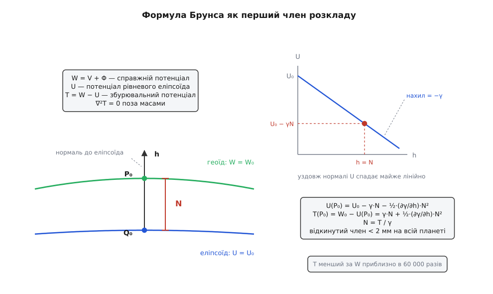
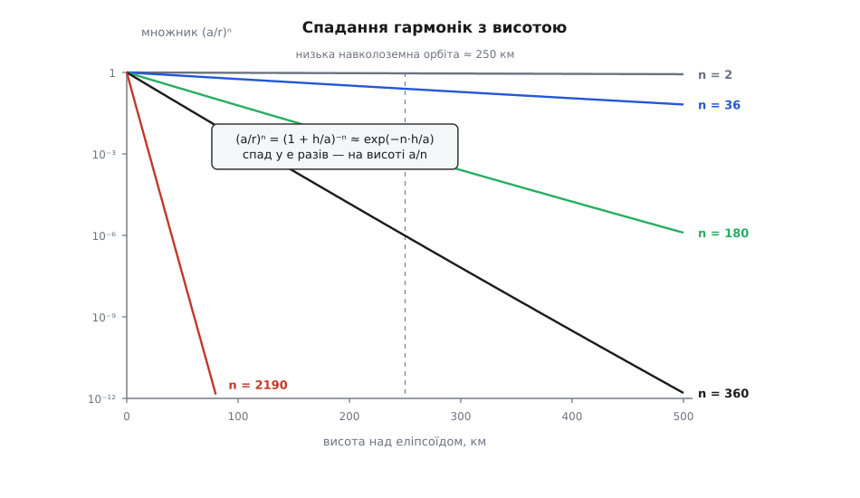
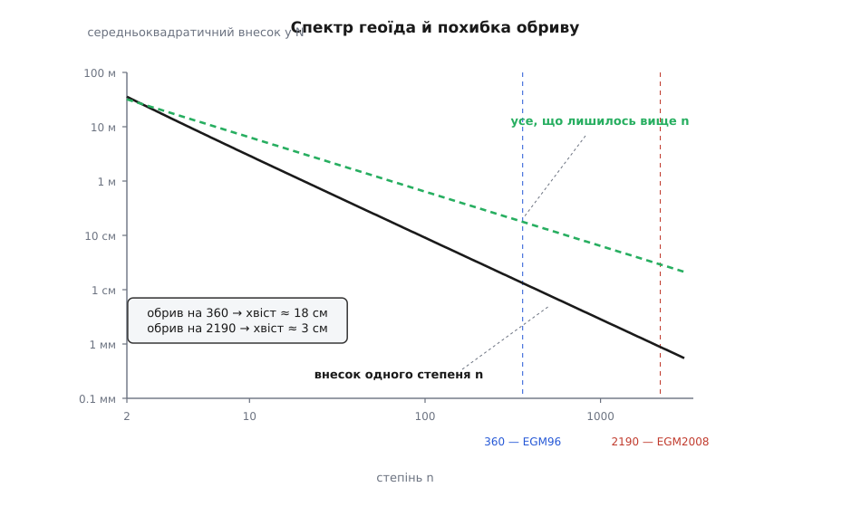

# 🧮 Математика ундуляції: один член ряду Тейлора і один розв'язок рівняння Лапласа

Ундуляцію геоїда `N` ніхто не міряє — її обчислюють із поля тяжіння, і весь цей рахунок стоїть на двох опорах: на першому члені розкладу потенціалу вздовж нормалі та на тому, що поза масами збурювальний потенціал є гармонічною функцією. Тут викладено обидві опори повністю: звідки береться `N = T/γ` і чому відкинуте важить менш ніж два міліметри; чому базис сферичних гармонік не обрано заради зручності, а нав'язано самим рівнянням поля; як степінь обриву ряду перетворюється на кілометри роздільної здатності й на мільйони коефіцієнтів; і скільки сантиметрів залишається за обривом.

## Нормальне поле: еліпсоїд, якому дали масу

Порівнювати можна лише однорідні речі. Геоїд — рівнева поверхня справжнього поля тяжіння; отже, [еліпсоїд](topic:math-geometry/wgs84-datum) теж треба перетворити з голої геометрії на поле, інакше «різниця» між ними не має сенсу.

Роблять це так. Беруть тіло, обмежене еліпсоїдом WGS-84, і добирають розподіл маси всередині так, щоб сама поверхня еліпсоїда виявилася рівневою поверхнею його власного поля — тяжіння разом із відцентровим. Таке тіло звуть **рівневим еліпсоїдом**, а його потенціал — **нормальним потенціалом** `U`. Класичний результат теорії рівневого еліпсоїда полягає в тому, що зовнішнє поле такого тіла визначається однозначно чотирма числами: великою піввіссю `a`, стисненням `f`, добутком `GM` і кутовою швидкістю обертання `ω`. Розподіл маси всередині може бути яким завгодно — назовні він не проступає.

Справжній потенціал сили тяжіння теж має дві складові:

```
W = V + Φ,     Φ = ½·ω²·(x² + y²)
```

де `V` — потенціал тяжіння мас, а `Φ` — відцентровий член. Різниця двох полів і зветься **збурювальним потенціалом**:

```
T = W − U
```

Тут ховається перша ключова властивість, без якої далі не було б нічого. Обидва поля обертаються з тією самою `ω`, тому в різниці відцентровий член скорочується **точно**, а не приблизно. Обидва мають той самий `GM`, тому в різниці зникає й головний член `GM/r`. Лишається різниця двох потенціалів тяжіння з однаковою повною масою — а потенціал тяжіння поза масами задовольняє [рівняння Лапласа](topic:math-analysis/laplace-equation), тобто є гармонічною функцією. Отже,

```
∇²T = 0   скрізь поза масами Землі
```

Це не технічна деталь, а той цвях, на якому висить решта: саме гармонічність `T` продиктує далі і форму розкладу, і те, як він поводиться з висотою.

Варто одразу відчути масштаби. Потенціал на поверхні має порядок

```
GM/a  = 3.986004418·10¹⁴ / 6378137        = 6.2497·10⁷ м²/с²
½ω²a² = 0.5 · (7.292115·10⁻⁵)² · 6378137² = 1.0816·10⁵ м²/с²
разом                                     ≈ 6.26·10⁷ м²/с²
```

а `T` навіть у найгіршому місці планети — близько `9.8 · 100 ≈ 10³ м²/с²`. Тобто збурення в шістдесят із гаком тисяч разів менше за саме поле. Ось чому вся теорія геоїда лінійна: `T` настільки мале, що квадратичними по ньому членами можна нехтувати свідомо, а не з відчаю.

## Формула Брунса: перший член розкладу вздовж нормалі

Тепер найважливіший крок. Візьмімо точку `Q₀` на еліпсоїді й точку `P₀` на геоїді, що лежить від неї вздовж нормалі до еліпсоїда на відстані `N`. За побудовою

```
U(Q₀) = U₀      (еліпсоїд — рівнева поверхня нормального поля)
W(P₀) = W₀      (геоїд — рівнева поверхня справжнього поля)
```

і сталу нормального поля добирають так, щоб `U₀ = W₀`.


*Уся формула Брунса — це відповідь на питання «наскільки впав нормальний потенціал, поки ми піднімалися від еліпсоїда до геоїда». Оскільки нахил `U` уздовж нормалі дорівнює `−γ`, спад дорівнює `γ·N`, а відповідає за нього рівно та надлишкова енергія, яку справжнє поле має проти нормального, — тобто `T`.*

Нам треба знати `U` не в `Q₀`, а в `P₀`. Позначмо через `h` відстань уздовж нормалі. Похідна потенціалу вздовж нормалі — це мінус сила: піднімаючись, ми втрачаємо потенціал зі швидкістю, що дорівнює нормальній силі тяжіння `γ`:

```
∂U/∂h = −γ(h)
```

Далі працює звичайний [ряд Тейлора](topic:math-analysis/taylor-series). Сама `γ` теж повільно змінюється з висотою, тому розкладімо її навколо еліпсоїда, `γ(h) = γ + (∂γ/∂h)·h`, і проінтегруймо від `0` до `N`:

```
U(P₀) = U₀ − ∫₀ᴺ γ(h)·dh = U₀ − γ·N − ½·(∂γ/∂h)·N²  − …
```

Підставмо це в означення `T`:

```
T(P₀) = W(P₀) − U(P₀) = W₀ − U₀ + γ·N + ½·(∂γ/∂h)·N²
      = γ·N + ½·(∂γ/∂h)·N²
```

Відкиньмо квадратичний член — і лишається **формула Брунса** (1878, Гайнріх Брунс):

```
N = T / γ
```

Її сила саме в тому, що вона лінійна. Ундуляція не просто «пов'язана» зі збурювальним потенціалом — вона є ним самим, поділеним на число близько `9.8`. Усе, що станеться з `T` далі, перекладається в метри геоїда одним множником.

Тепер оцінімо, що ми викинули. Вертикальний градієнт нормальної сили тяжіння у вільному повітрі становить приблизно `−3.086·10⁻⁶ с⁻²` — у геодезичних одиницях це `−0.3086` мілігала на метр (мілігал = `10⁻⁵ м/с²`). Викинутий член дає в `N` поправку `½·|∂γ/∂h|·N²/γ`:

**Приклад: наскільки бреше лінеаризація в найгіршій точці планети.**

```
N        = 100 м            (розмах ундуляції — близько ±100 м)
|∂γ/∂h|  = 3.086·10⁻⁶ с⁻²
γ        ≈ 9.8 м/с²

похибка = ½ · |∂γ/∂h| · N² / γ
        = 0.5 · 3.086·10⁻⁶ · 10⁴ / 9.8
        = 1.57·10⁻³ м = 1.6 мм
```

Півтора міліметра там, де значення сягає ста метрів, — тобто відносно `1.6·10⁻⁵`. Це збігається з тим, що дають реалізації: обчислення геоїда через один крок Брунса вважають еквівалентним одній ітерації методу Ньютона з середньоквадратичною похибкою близько 1.5 мм. Другий член ряду просто нікому не потрібен.

Зате не байдуже, яке саме `γ` підставляти. Це нормальна сила тяжіння **на еліпсоїді, на широті цієї точки**, і рахують її за замкненою формулою Сомільяни:

```
γ(φ) = γₑ · (1 + k·sin²φ) / √(1 − e²·sin²φ)

γₑ = 9.7803253359 м/с²      k  = 0.00193185265241
γₚ = 9.8321849379 м/с²      e² = 0.00669437999013
```

Від екватора до полюса `γ` змінюється на 0.53 %. Узяти екваторіальне значення всюди — означає систематично помилитися в `N` на ту саму частку, а це піввідсотка від ста метрів, тобто пів метра. Формула Сомільяни коштує кілька множень, тож економити тут нема на чому.

> 🔧 **Навіщо це.** Лінійність `N = T/γ` означає, що будь-яка домовленість про сталу переїжджає в геоїд одним діленням. Зокрема, «нульовий степінь» ряду — це поправка `N₀ = δ(GM)/(r·γ) − (W₀ − U₀)/γ`, яка зсуває **весь** геоїд однаково. Розбіжність у виборі `W₀` на `1 м²/с²` дає `1/9.8 = 10.2 см` глобального зсуву — саме звідси беруться дециметрові розходження між моделями, які інакше сходяться до сантиметрів. Так само переїжджає різниця припливних систем: вона живе в коефіцієнті `C̄₂₀` і виявляється сталим зсувом рівня, а не шумом.

## Чому саме сферичні гармоніки, а не будь-який зручний базис

Тепер треба розкласти `T`. Природно спитати, чому геодезія вибрала саме сферичні гармоніки, а не вейвлети, сплайни чи будь-що інше. Відповідь: не вибрала. Базис нав'язало рівняння.

Запишімо `∇²T = 0` у сферичних координатах `(r, φ̄, λ)`, де `φ̄` — геоцентрична широта, і шукаймо розв'язок у вигляді добутку `T = f(r)·Y(φ̄, λ)`. Змінні розділяються, і радіальна частина дає

```
r²·f″ + 2r·f′ − n(n+1)·f = 0    →    f(r) = rⁿ  або  f(r) = r⁻⁽ⁿ⁺¹⁾
```

Ми працюємо **поза** масами й вимагаємо, щоб поле згасало на нескінченності, — отже, член `rⁿ` відпадає, лишається `r⁻⁽ⁿ⁺¹⁾`. Кутова частина дає рівняння, чиї однозначні й усюди скінченні на сфері розв'язки існують лише за цілих `n ≥ 0`, і для кожного `n` їх рівно `2n + 1`: це [сферичні гармоніки](topic:math-analysis/spherical-harmonics)

```
P̄ₙₘ(sin φ̄)·cos(mλ)   і   P̄ₙₘ(sin φ̄)·sin(mλ),      m = 0 … n
```

де `P̄ₙₘ` — [приєднані функції Лежандра](topic:math-analysis/legendre-polynomials). Інакше кажучи: **будь-яке** гармонічне поле, що згасає на нескінченності, є такою сумою. Це не апроксимація зручним базисом, а загальний вигляд розв'язку.

Друга властивість, заради якої ця сім'я безцінна, — ортогональність на сфері. Інтеграл добутку двох різних гармонік по всій сфері дорівнює нулю. Наслідки прямі, як у [рядах Фур'є](topic:math-analysis/fourier-series), тільки на сфері замість прямої: кожен коефіцієнт дістається проєкцією `T` на свою гармоніку й не залежить від решти; коефіцієнти не «перекачують» вагу один в одного; а обрив ряду на степені `N_max` дає найкраще середньоквадратичне наближення серед усіх сум цього степеня. Останнє — саме те, що потрібно моделі поля: обрізавши хвіст, ми не псуємо голову.

Разом із формулою Брунса це дає робочий вигляд:

```
N(r, φ̄, λ) = GM/(r·γ) · Σ (a/r)ⁿ · Σ [ΔC̄ₙₘ·cos(mλ) + S̄ₙₘ·sin(mλ)] · P̄ₙₘ(sin φ̄)
                        n≥2         m=0..n
```

Множник перед сумою вартий окремої уваги — це просто довжина:

```
GM/(a·γ) ≈ 3.986004418·10¹⁴ / (6378137 · 9.79) ≈ 6.38·10⁶ м
```

Приблизно 6380 км. Це готова мірка для читання таблиць коефіцієнтів: **безрозмірна одиниця сьомого знака, 10⁻⁶, коштує близько 6.4 метра геоїда**.

Нормування `P̄ₙₘ` беруть повне (геодезичне): множник добирають так, щоб середній квадрат кожної базисної функції по сфері дорівнював одиниці.

```
P̄ₙₘ(t) = √( (2 − δ₀ₘ)·(2n + 1)·(n − m)! / (n + m)! ) · Pₙₘ(t)
```

Завдяки цьому коефіцієнти різних `n` і `m` можна порівнювати між собою напряму, а сума квадратів коефіцієнтів одного степеня одразу дає внесок цього степеня в середній квадрат `N`. Без нормування самі `Pₙₘ` на високих степенях розбігаються на десятки порядків, і жодна арифметика подвійної точності цього не витримує.

## Чому ряд починається з двійки

У сумі стоїть `ΔC̄ₙₘ` — різниця коефіцієнта справжнього поля й коефіцієнта нормального. Через це перші члени зникають або скорочуються майже до нуля, і кожне зникнення має фізичну причину.

**Степінь 0.** Коефіцієнт при `GM/r` — це повна маса. У нормального поля вона та сама за побудовою, тому `ΔC̄₀₀ = 0`. Якщо `GM` моделі й `GM` еліпсоїда все ж різні, це дає той самий сталий зсув `N₀`, про який ішлося вище.

**Степінь 1.** Коефіцієнти першого степеня — це положення центра мас відносно початку координат. Обидва поля відлічують від геоцентра, тому `C̄₁₀ = C̄₁₁ = S̄₁₁ = 0`. Ненульовий член першого степеня означав би не горб геоїда, а помилку в прив'язці системи координат.

**Степінь 2, порядок 0.** Це сплюснення. Справжній коефіцієнт `C̄₂₀ ≈ −4.84165·10⁻⁴`, коефіцієнт рівневого еліпсоїда WGS-84 `≈ −4.84167·10⁻⁴`. Різниця — близько `+1.4·10⁻⁹`, тобто менш ніж мільйонна частка вихідної величини. Еліпсоїд поглинув сплюснення майже без залишку, і саме тому лишок вимірюють у метрах, а не в кілометрах. *(Останні цифри `C̄₂₀` залежать від припливної системи, у якій подано модель; на цьому рівні відмінність вагома.)*

**Степінь 2, порядок 1.** `C̄₂₁ ≈ −1.9·10⁻¹⁰`, `S̄₂₁ ≈ +1.2·10⁻⁹` — практично нуль. Причина геометрична: ці два коефіцієнти описують нахил головної осі інерції планети до осі обертання, а вони збігаються з точністю, кращою за кутову секунду.

**Степінь 2, порядок 2.** Ось перший коефіцієнт, який справді працює: `C̄₂₂ ≈ +2.43914·10⁻⁶`, `S̄₂₂ ≈ −1.40017·10⁻⁶`. У нормального поля порядків, відмінних від нуля, немає взагалі — еліпсоїд обертання симетричний по довготі. Тому ця пара входить у ряд цілком і означає просту річ: екватор є еліпсом, а не колом. Амплітуда пари дорівнює `√(C̄₂₂² + S̄₂₂²) = 2.812·10⁻⁶`, довгота максимуму — `½·atan2(S̄₂₂, C̄₂₂) ≈ −14.9°`. Помножене на мірку 6.4 метра за 10⁻⁶ і на значення `P̄₂₂` на екваторі, це дає розмах близько 70 метрів між найдовшою й найкоротшою екваторіальними півосями геоїда, з довгою віссю поблизу 15° західної довготи.

## Скільки метрів дає кожен член

**Приклад: перші члени ряду в точці 30° пн. ш., 15° зх. д.** Беремо геоцентричну широту `φ̄ = 30°`, довготу `λ = −15°` і рахуємо на сфері радіуса `a`, тобто `(a/r)ⁿ = 1`.

```
sin φ̄ = 0.5                cos 2λ = cos(−30°) = 0.8660254
                            sin 2λ = sin(−30°) = −0.5

γ(30°) = 9.7803253359 · (1 + 0.00193185·0.25) / √(1 − 0.00669438·0.25)
       = 9.7803253359 · 1.00048296 / 0.99916285
       = 9.79325 м/с²

мірка: GM/(a·γ) = 3.986004418·10¹⁴ / (6378137 · 9.79325) = 6.38142·10⁶ м
```

Функції Лежандра в цій точці (`t = 0.5`):

```
P₂₀ = (3t² − 1)/2 = −0.125          P̄₂₀ = √5 · (−0.125)        = −0.279509
P₂₁ = 3t·√(1 − t²) = 1.299038       P̄₂₁ = 1.290994 · 1.299038  = +1.677051
P₂₂ = 3(1 − t²) = 2.25             P̄₂₂ = 0.645497 · 2.25       = +1.452369
P₃₀ = (5t³ − 3t)/2 = −0.4375        P̄₃₀ = √7 · (−0.4375)       = −1.157516
```

Тепер по членах:

```
(2,0)  ΔC̄₂₀ = +1.403·10⁻⁹
       6.38142·10⁶ · 1.403·10⁻⁹ · (−0.279509)              = −0.0025 м

(2,1)  C̄₂₁·cos λ + S̄₂₁·sin λ
       = (−1.9·10⁻¹⁰)(0.965926) + (1.2·10⁻⁹)(−0.258819)    = −4.91·10⁻¹⁰
       6.38142·10⁶ · (−4.91·10⁻¹⁰) · 1.677051               = −0.0053 м

(2,2)  C̄₂₂·cos 2λ + S̄₂₂·sin 2λ
       = (2.43914·10⁻⁶)(0.866025) + (−1.40017·10⁻⁶)(−0.5)  = +2.81247·10⁻⁶
       6.38142·10⁶ · 2.81247·10⁻⁶ · 1.452369                = +26.07 м

(3,0)  C̄₃₀ = +9.5725·10⁻⁷      (нормальне поле непарних зональних не має)
       6.38142·10⁶ · 9.5725·10⁻⁷ · (−1.157516)              = −7.07 м

сума перших членів                                          = +18.99 м
```

Три висновки з цієї арифметики варті більше, ніж саме число.

По-перше, увесь степінь 2 без порядку 2 не дає нічого: сплюснення й нахил осі інерції разом важать вісім міліметрів. Уся довгохвильова картина геоїда — це триосьовість (`m = 2`) і грушоподібність (`n = 3`).

По-друге, перші члени не наближають відповідь монотонно: `(2,2)` дав `+26` метрів, `(3,0)` одразу забрав `7`. Ряд збігається за середнім квадратом по всій сфері, а не член за членом у кожній точці, і в конкретному місці сусідній степінь легко перекриває попередній.

По-третє, `−15°` довготи вибрано не випадково — це максимум гармоніки `(2,2)`. Зсуньмося на `+30°` східної довготи, і той самий член дасть `cos(2·(30° + 14.9°)) = cos 89.86° ≈ 0.0024`, тобто **шість сантиметрів** замість двадцяти шести метрів. Місця біля вузлів низьких гармонік нічим не гірші, просто там увесь геоїд роблять степені, вищі за третій.

І прикінцеве застереження про строгість: справжнє обчислення веде відлік від геоцентричної широти й геоцентричного радіуса точки на еліпсоїді, а не від `φ̄ = φ` і `r = a`. На геодезичній широті 30° геоцентрична дорівнює 29.834° — розбіжність у 10 кутових хвилин, близько 18 км по меридіану, і в цьому прикладі вона зсуває суму на дециметри. Структури рахунку це не змінює, але у справжньому коді плутати ці широти не можна.

## Степінь обриву: кілометри й мільйони

Гармоніка степеня `n` має близько `n` вузлових ліній на великому колі. Отже, найкоротша повна хвиля, яку модель узагалі здатна нести, — це `2πR/n`, а найдрібніша розрізнювана деталь (півхвиля) — `πR/n`. У градусах остання дорівнює `180°/n`.

```
πR = π · 6371 км = 20015 км   (половина обводу планети)

n = 360:   180°/360  = 0.500° = 30.0′    півхвиля = 20015/360  = 55.6 км
n = 2190:  180°/2190 = 0.082° = 4.93′    півхвиля = 20015/2190 =  9.1 км
```

Звідси видно й походження кроків офіційних сіток. Найкоротша повна хвиля степеня 2190 — 18.3 км, отже, за [теоремою про дискретизацію](topic:com-signal/sampling-theorem) вузли мають стояти не рідше ніж через 9.1 км, тобто 4.93 кутової хвилини. Роздають же сітку з кроком 2.5′ — удвічі густіше. Цей надлишок не марнотратство: значення між вузлами дістають білінійною інтерполяцією, а вона рівно на межі Найквіста дає геть непридатну похибку; подвійне передискретизування опускає похибку інтерполяції до сантиметрів.

Тепер ціна. Кожен степінь дає `2n + 1` коефіцієнт (один при `m = 0` і по два на кожен `m` від 1 до `n`), тому повне число коефіцієнтів до `N_max` включно:

```
Σ (2n + 1) = (N_max + 1)²
n=0..N_max
```

```
EGM96,  N_max = 360:   361²  =   130 321
       мінус чотири тотожно нульові коефіцієнти степенів 0 і 1  →  130 317
EGM2008, повна до 2159, зі степенями до 2190 за m ≤ 2159:
        2160² + 31·(2·2160 − 1) = 4 665 600 + 133 889 = 4 799 489
```

У подвійній точності це `1.0 МБ` проти `38 МБ`. Зростання квадратичне й нещадне: шестикратне збільшення степеня коштує тридцятишестикратного збільшення таблиці, а деталізацію покращує лише вшестеро — з 56 до 9 кілометрів.

Дорого не тільки зберігати. Обчислення `N` в одній точці за повним рядом до 2190 — це майже п'ять мільйонів доданків, і кожен потребує свого `P̄ₙₘ`, узятого з рекурсії. На високих степенях ці рекурсії ще й чисельно норовливі: біля полюсів `P̄ₙₘ` для великих `m` провалюється під межу нормалізованих чисел подвійної точності, і рахувати доводиться зі штучним масштабуванням. Саме тому в приладах живе не ряд, а вже порахована сітка `N`, з якої значення дістають [білінійною інтерполяцією](topic:math-numeric/bilinear-interpolation).

## Множник (a/r)ⁿ: чому супутник сліпий до дрібного

Радіальна залежність `r⁻⁽ⁿ⁺¹⁾`, винесена відносно `a`, дає в ряді множник `(a/r)ⁿ`. Підставмо `r = a + h`:

```
(a/r)ⁿ = (1 + h/a)⁻ⁿ ≈ exp(−n·h/a)        для h ≪ a
```

Отже, кожен степінь згасає з висотою експоненційно, і **швидкість згасання пропорційна самому степеню**. Висота, на якій гармоніка слабшає в `e` разів, дорівнює `a/n`:

```
n = 2      a/n = 3189 км
n = 36     a/n = 177 км
n = 180    a/n = 35 км
n = 360    a/n = 18 км
n = 2190   a/n = 2.9 км
```


*Той самий підйом на 250 кілометрів для степеня 2 не значить нічого, для степеня 180 — послаблення в тисячу разів, а для степеня 2190 — зникнення поза межами будь-якої арифметики. Це не властивість приладу, а властивість гармонічного поля: дрібні деталі поверхневого розподілу мас згасають угору тим швидше, чим вони дрібніші.*

**Приклад: що бачить супутник на висоті 250 км.**

```
n·h/a для h = 250 км, a = 6378 км:

n = 180   →  7.06   →  exp(−7.06)  = 8.6·10⁻⁴
n = 360   →  14.11  →  exp(−14.11) = 7.4·10⁻⁷
n = 2190  →  85.8   →  exp(−85.8)  ≈ 5·10⁻³⁸
```

Отже, супутник на низькій орбіті принципово не може виміряти високі степені: сигнал від них не просто малий, він на порядки нижчий за будь-який шум приладу. Тому суто супутникові моделі поля закінчуються десь на степені 200–300, а все дрібніше в комбінованих моделях приходить із наземної гравіметрії, супутникової альтиметрії над океанами й моделей рельєфу.

Той самий множник окреслює й межу законності самого ряду. Збіжність доведена лише поза сферою, яка охоплює всі маси планети, а її радіус задає найвища гора — отже, майже вся поверхня суходолу лежить усередині цієї сфери, там, де доведення не діє. На реальній топографії ряд формально може й розбігатися. Практично моделі поводяться добре, але «доведено збіжний» і «працює» — це різні твердження, і суперечка про них у теоретичній геодезії триває десятиліттями.

## Скільки лишається за обривом

Обрив ряду на `N_max` викидає весь хвіст. Оцінити його можна емпіричним правилом Каули (1966): середньоквадратичний коефіцієнт степеня `n` має порядок `10⁻⁵/n²`. Тоді дисперсія степеня — це сума квадратів по всіх `2n + 1` коефіцієнтах, а завдяки повному нормуванню вона одразу перекладається в метри геоїда множником `GM/(a·γ)`:

```
σₙ² = (2n + 1)·10⁻¹⁰/n⁴

RMS внеску степеня n у N:
   R*·√σₙ² = 6.38·10⁶ · 10⁻⁵ · √(2n+1)/n²  ≈  63.9·√(2n+1)/n²   [м]
```

Хвіст вище `N_max` підсумовується інтегралом:

```
E² ≈   Σ    63.9²·(2n+1)/n⁴  ≈  63.9² · ∫ 2·dn/n³  =  63.9² / N_max²
     n>N_max                             (від N_max до ∞)

E(N_max) ≈ 63.9 / N_max   [м]

N_max = 360    →  E ≈ 0.18 м
N_max = 2190   →  E ≈ 0.03 м
```


*Внесок окремого степеня падає приблизно як `1/(n·√n)`, тому кожен наступний степінь важить дедалі менше — а от сума всього, що лишилося вище, спадає лише як `1/n`. Саме ця повільніша крива й є похибкою обриву: щоб зменшити її вдесятеро, степінь треба підняти вдесятеро, а таблицю коефіцієнтів — у сто разів.*

Правило Каули калібрували на високих степенях, тож на низьких воно завищує: для `n = 2` воно обіцяє 36 метрів, тоді як справжній внесок, порахований просто з `C̄₂₂` і `S̄₂₂`, дає близько 18 — удвічі менше. Але для оцінки хвоста, де важать сотні степенів, а не два, це рівно та точність, якої треба.

Порівняння з дійсністю тут повчальне. Заявлена точність EGM2008 наближається до 10 сантиметрів, тимчасом як обрив ряду коштує лише 3. Отже, обрив не є головним винуватцем: три сантиметри — це те, чого модель принципово не бачить, а решта походить із похибок самих даних, з яких її склали. Для EGM96 розрив був іще різкіший: 18 сантиметрів обриву тонули в метровому рівні тодішніх вимірів. Звідси й практичний висновок про вибір моделі: перехід із 360 на 2190 купує близько 15 сантиметрів і має сенс для геодезії, але не для апарата, чий барометричний канал і без того гуляє на метри.

І останнє про природу цієї похибки. Вона не рівномірна по планеті. Короткохвильова частина поля породжена головно рельєфом, тому над рівниною хвіст вище степеня 360 справді ближчий до кількох сантиметрів, а в горах він у рази більший за глобальне середнє. Число `63.9/N_max` — це середнє по сфері, а не гарантія в конкретній долині.
