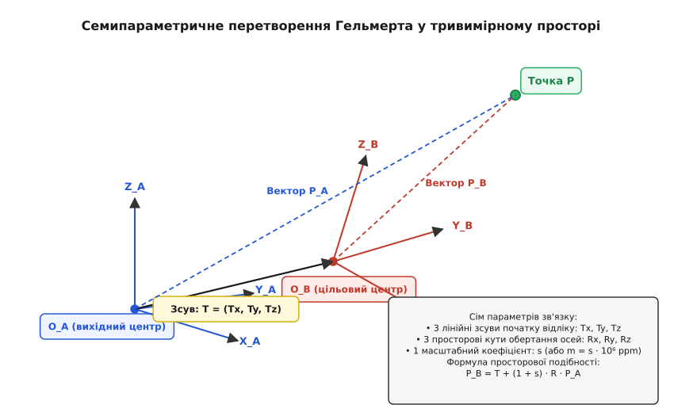
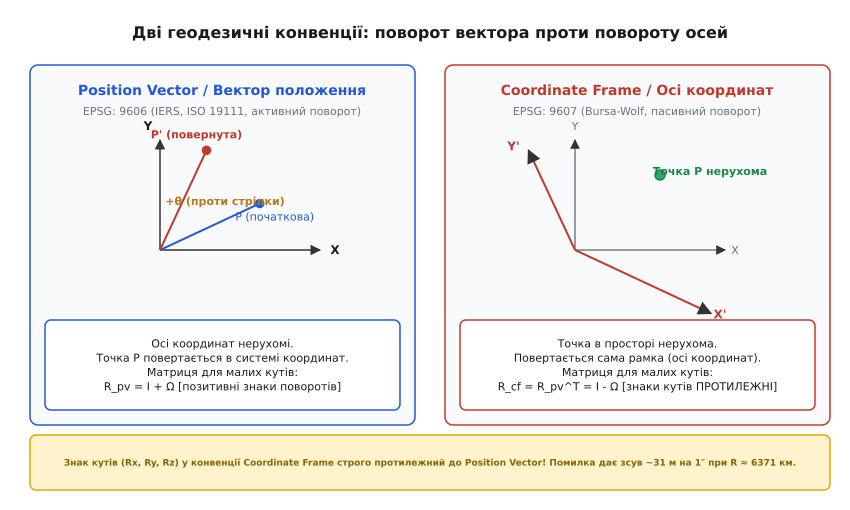
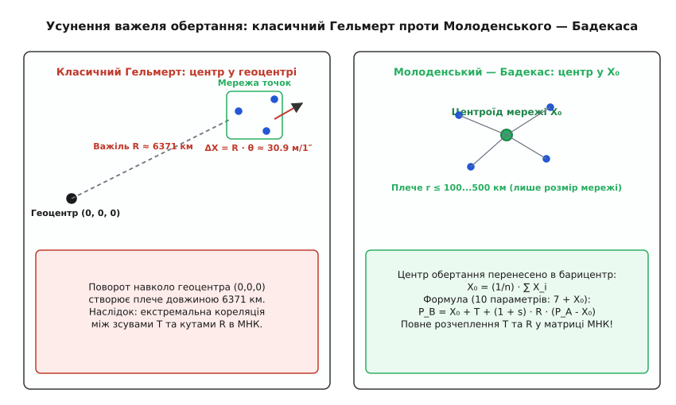
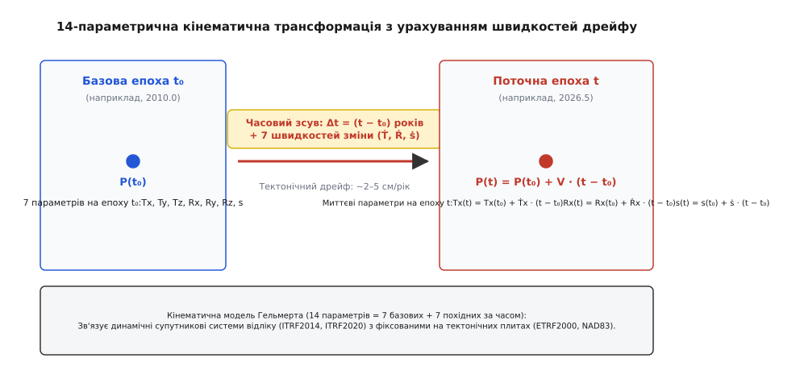

# Семипараметричне перетворення Гельмерта (Helmert Transformation)

<preknowlist>
- [Система координат](topic:math-geometry/coordinate-system) — тривимірний декартовий базис, початок відліку та взаємно перпендикулярні осі.
- [Матриці повороту](topic:math-algebra/rotation-matrices) — ортогональні матриці групи SO(3), кути Ейлера та проєкції осей.
- [ECEF, NED і ENU](topic:math-geometry/ecef-ned-enu) — просторові земні прямокутні координати з центром у центрі мас планети.
- [WGS-84: еліпсоїд і датум](topic:math-geometry/wgs84-datum) — просторова прив'язка референц-еліпсоїда до тіла Землі та розходження між геодезичними датумами.
- [Метод найменших квадратів](topic:math-probability/least-squares) — розв'язання перевизначених систем рівнянь і мінімізація суми квадратів нев'язок.
- [Афінне перетворення](topic:math-algebra/affine-transform) — паралельний зсув, лінійне деформування простору та збереження паралельності прямих.
</preknowlist>

Встанови на одному й тому самому геодезичному пункті два супутникові приймачі: один налаштований на роботу в системі WGS-84 (супутникове угруповання GPS), а другий — у системі ПЗ-90.11 (ГЛОНАСС), або порівняй отримані просторові координати з державною топографічною картою в системі СК-42 чи європейській системі ED50. Просторові прямокутні координати ECEF для одного й того самого фізичного репера розійдуться на десятки, а подекуди й на півтори сотні метрів. Геодезичний моноліт не зрушив з місця, жоден прилад не зробив помилки: просто просторові координатні осі цих систем мають зміщені центри, повернуті одна відносно одної на малі кути й відкалібровані з мікроскопічною різницею масштабу довжин.

Щоб перевести тривимірні координати з однієї просторової системи в іншу без деформації кутів, відстаней та геометрії об'єктів, застосовують просторове конформне перетворення подібності — **семипараметричне перетворення Гельмерта** (англ. *Helmert 7-parameter transformation*).

## Анатомія семи параметрів

Чому для зв'язку двох жорстких тривимірних систем координат необхідно рівно сім параметрів?

У тривимірному евклідовому просторі будь-яке взаємне просторове положення двох декартових систем координат має рівно сім ступенів вільності:

1. **Три ступені вільності лінійного перенесення (зсув початку відліку):**
   Вектор `T = [ Tx, Ty, Tz ]ᵀ` визначає відстань і напрям між центрами координат двох систем (у метрах).
2. **Три ступені вільності просторового обертання (орієнтація координатних осей):**
   Кути `Rx, Ry, Rz` визначають взаємний розворот осей навколо відповідних координатних напрямків. Обертання описується ортогональною матрицею третього порядку `R ∈ SO(3)`, яка має рівно три незалежні кутові параметри.
3. **Один ступінь вільності масштабування довжин:**
   Безрозмірний коефіцієнт зміни масштабу `k = 1 + s` (де `s` — відносний диференціал масштабу, що задається в частках одиниці або в `ppm`, *parts per million*, `1 ppm = 10⁻⁶`). Масштаб єдиний для всіх трьох осей, що гарантує збереження пропорцій та кутів (конформність).

```text
3 (лінійні зсуви) + 3 (кути повороту) + 1 (масштабний коефіцієнт) = 7 параметрів
```


*Сім параметрів зв'язку між вихідною системою A та цільовою системою B: три лінійні зсуви початку відліку (Tx, Ty, Tz), три кути просторового розвороту осей (Rx, Ry, Rz) та один масштабний коефіцієнт (1 + s).*

Перетворення Гельмерта є конформним перетворенням подібності (лат. *conformis* — «подібний за формою»): воно зберігає форму будь-якої геометричної фігури, переводить сфери у сфери, а прямі лінії — у прямі, змінюючи лише їхнє просторове положення, орієнтацію та абсолютний геометричний розмір.

Про те, як виникла потреба в узгодженні геодезичних мереж у Європі XIX століття та чому це перетворення названо на честь засновника сучасної вищої геодезії, читайте в нарисі [Фрідріх Роберт Гельмерт та об'єднання геодезичних мереж Європи](topic:math-geometry/helmert-transform/hist-friedrich-helmert.md).

## Математична модель та лінеаризація для малих кутів

У строгому нелінійному матричному вигляді вектор координат точки в цільовій системі `P_B = [ X, Y, Z ]ᵀ` обчислюється через координати у вихідній системі `P_A = [ x, y, z ]ᵀ`:

```text
P_B = T + (1 + s) · R · P_A
```

Матриця повного тривимірного повороту `R` утворюється перемноженням трьох елементарних матриць поворотів навколо осей `X`, `Y`, `Z`:

```text
R = Rz(Rz) · Ry(Ry) · Rx(Rx)
```

де кожна елементарна матриця містить тригонометричні синуси й косинуси:

```text
Rx(Rx) = [ 1      0         0     ]
         [ 0   cos(Rx)   sin(Rx)  ]
         [ 0  -sin(Rx)   cos(Rx)  ]

Ry(Ry) = [  cos(Ry)   0  -sin(Ry) ]
         [     0      1      0    ]
         [  sin(Ry)   0   cos(Ry) ]

Rz(Rz) = [  cos(Rz)   sin(Rz)   0 ]
         [ -sin(Rz)   cos(Rz)   0 ]
         [     0         0      1 ]
```

### Наближення нескінченно малих поворотів

У геодезичній та навігаційній практиці розходження між орієнтаціями координатних осей різних датумів становлять частки або одиниці кутових секунд (`1″ = 1/3600° ≈ 4.848137 · 10⁻⁶ рад`). Для настільки малих кутів тригонометричні функції розкладаються в ряд:

```text
cos(θ) = 1 − θ²/2 + ... ≈ 1
sin(θ) = θ − θ³/6 + ... ≈ θ
```

Добутки двох малих величин є величинами другого порядку малості (`Rx · Ry ≈ 10⁻¹⁰`), тому ними нехтують:

```text
R = Rz(Rz) · Ry(Ry) · Rx(Rx)
  ≈ [   1     Rz   -Ry ]   [ 1   0   0 ]   [ 1    0    0 ]
    [ -Rz      1    0  ] · [ 0   1  Rx ] · [ 0  cos  sin ]
    [  Ry      0    1  ]   [ 0  -Rx  1 ]   [ 0 -sin  cos ]
  ≈ [   1   -Rz    Ry ]
    [  Rz     1   -Rx ]
    [ -Ry    Rx     1 ]
```

Матрицю `R` записують через одиничну матрицю `I` та кососиметричну матрицю диференціальних поворотів `Ω`:

```text
R ≈ I + Ω
```

де:

```text
Ω = [   0   -Rz    Ry ]
    [  Rz     0   -Rx ]
    [ -Ry    Rx     0 ]
```

Підставляючи лінеаризований вираз обертання в рівняння Гельмерта й відкидаючи добуток малих величин другого порядку `s · Ω ≈ 0`, отримуємо робочу геодезичну формулу:

```text
P_B = T + (1 + s) · (I + Ω) · P_A
    = T + (I + Ω + s·I + s·Ω) · P_A     [розкриття дужок]
    ≈ T + P_A + Ω · P_A + s · P_A       [нехтування величиною s·Ω]
```

Покоординатний запис системи рівнянь для однієї точки:

```text
X = Tx + (1 + s) · x - Rz · (1 + s) · y + Ry · (1 + s) · z
Y = Ty + Rz · (1 + s) · x + (1 + s) · y - Rx · (1 + s) · z
Z = Tz - Ry · (1 + s) · x + Rx · (1 + s) · y + (1 + s) · z
```

Або з урахуванням знехтування добутками `s · R`:

```text
X = Tx + x - Rz · y + Ry · z + s · x
Y = Ty + Rz · x + y - Rx · z + s · y
Z = Tz - Ry · x + Rx · y + z + s · z
```

Строге математичне виведення системи нормальних рівнянь Гауса — Маркова, оцінку коваріаційної матриці параметрів та аналіз геометричних умов виродження рангу наведено у вставці [Математичне виведення методу найменших квадратів для семи параметрів](topic:math-geometry/helmert-transform/math-helmert-least-squares.md).

## Дві конвенції орієнтації: головна пастка геодезії

Найчастіша й найнебезпечніша помилка в геоінформаційних системах і бібліотеках супутникової навігації — плутанина між двома взаємно протилежними конвенціями визначення знаків кутів повороту:

1. **Position Vector transformation (Вектор положення / конвенція IERS / ISO 19111, метод EPSG: 9606):**
   Осі координат вважаються **нерухомими**. Повертається сам **радіус-вектор точки** навколо осей проти годинникової стрілки (активний поворот). Додатний знак кута `Rz` означає поворот точки від осі `X` до осі `Y`.
2. **Coordinate Frame rotation (Обертання осей координат / конвенція Бурси — Вольфа, метод EPSG: 9607):**
   Точка в просторі вважається **нерухомою**. Повертаються **самі осі координат** системи відліку (пасивний поворот).


*У конвенції Position Vector (EPSG:9606) точка повертається проти стрілки годинника в нерухомій системі осей; у Coordinate Frame (EPSG:9607, Бурса — Вольф) повертаються самі осі координат. Знаки кутів (Rx, Ry, Rz) у цих конвенціях взаємно протилежні.*

Оскільки поворот системи координат на кут `+θ` еквівалентний повороту вектора точки на кут `−θ`, матриці двох конвенцій пов'язані простим співвідношенням транспонування:

```text
R_cf = R_pvᵀ = (I + Ω)ᵀ = I − Ω
```

Це означає, що числові значення кутів повороту `(Rx, Ry, Rz)` для одного й того самого фізичного трансформаційного переходу в двох конвенціях мають **строго протилежні знаки**:

```text
Rx(Coordinate Frame) = −Rx(Position Vector)
Ry(Coordinate Frame) = −Ry(Position Vector)
Rz(Coordinate Frame) = −Rz(Position Vector)
```

### Ціна помилки в знаку

Якщо розробник помилково застосує параметри, опубліковані в конвенції Coordinate Frame, до алгоритму, що реалізує Position Vector, кутові похибки не компенсують розходження систем, а подвоять його.

Порахуймо лінійне зміщення на поверхні Землі (`R_землі ≈ 6 371 000 м`) при помилці в знаку кута лише на одну кутову секунду (`1″`):

```text
ΔL = R_землі · sin(2 · 1″)
   ≈ 6 371 000 м · 2 · 4.848137 · 10⁻⁶ рад
   ≈ 61.76 м
```

Шістдесят два метри зміщення координат на рівному місці. Саме тому будь-яка геодезична специфікація або база даних параметрів (наприклад, EPSG Geodetic Parameter Registry) обов'язково вказує код методу: `9606` чи `9607`.

## Модель Молоденського — Бадекаса: розв'язання проблеми важеля геоцентра

Коли 7-параметричне перетворення застосовують для глобального зв'язку загальноземних систем (наприклад, WGS-84 та ITRF), центр обертання природно розміщують у геоцентрі `(0, 0, 0)`.

Але коли перетворення Гельмерта застосовують для переходу від локального або національного датуму (наприклад, британського OSGB36 або європейського ED50) до глобального WGS-84, виникає серйозна математична проблема, відома як **ефект геоцентричного важеля**.


*Обертання навколо геоцентра Землі створює плече довжиною понад 6300 км, що призводить до жорсткої кореляції між параметрами зсуву та повороту. Модель Молоденського — Бадекаса переносить центр обертання в барицентр регіональної мережі X₀, повністю розчіплюючи параметри.*

Усі пункти регіональної мережі розташовані на поверхні Землі — на відстані близько 6371 км від початку координат. Нескінченно малий кутовий поворот осей навколо геоцентра `(0, 0, 0)` на кут `1″` викликає штучне паралельне зміщення всієї регіональної мережі на `6371 км · 1″ ≈ 30.9 м`.

Внаслідок цього при оцінці параметрів за методом найменших квадратів параметри лінійного зсуву `(Tx, Ty, Tz)` виявляються **екстремально скорельованими** з параметрами поворотів `(Rx, Ry, Rz)`: коефіцієнт кореляції сягає `r = 0.9999`. Невеликий шум у вихідних координатах призводить до того, що алгоритм довільно перерозподіляє десятки метрів похибки між зсувами та поворотами.

Щоб розв'язати цю проблему, грецький геодезист Георгіос Бадекас (1969) на основі ідей радянського вченого Михайла Молоденського запропонував перенести центр обертання з геоцентра в **барицентр (центроїд)** опорної геодезичної мережі `X₀ = [ X₀, Y₀, Z₀ ]ᵀ`.

Формула **10-параметричного перетворення Молоденського — Бадекаса** (EPSG метод 9636):

```text
P_B = X₀ + T + (1 + s) · R · (P_A − X₀)
```

де:
- `X₀ = [ X₀, Y₀, Z₀ ]ᵀ` — фіксовані координати центроїда регіональної мережі;
- `T = [ Tx, Ty, Tz ]ᵀ` — вектор зсуву, виміряний безпосередньо в точці центроїда;
- `R` та `s` — матриця повороту та масштаб відносно центроїда.

Оскільки середнє значення редукованих координат `∑ (P_A − X₀) = 0`, недіагональні блоки коваріаційної матриці МНК стають строго рівними нулю. Параметри зсуву `T` повністю розчіплюються з кутами повороту `R`, забезпечуючи абсолютну чисельну стійкість зрівноваження.

## 14-параметричне перетворення: динаміка тектонічних плит

Земна кора не є абсолютно твердим монолітом: літосферні плити дрейфують по поверхні астеносфери зі швидкістю від 1 до 10 см на рік. Наприклад, Євразійська плита зміщується на північний схід зі швидкістю близько 2.5 см/рік, а Північноамериканська плита рухається на захід.

Через це глобальні супутникові системи відліку (такі як ITRF2014 або ITRF2020) є **кінематичними** (динамічними): координати навіть фундаментальних скельних пунктів у них безперервно змінюються з часом. Водночас регіональні геодезичні датуми (наприклад, європейський ETRF2000 або американський NAD83) є **статичними**: їх зафіксовано на конкретній тектонічній плиті, щоб координати на топографічних картах не «пливли» щороку.


*Літосферні плити дрейфують зі швидкістю кілька сантиметрів на рік. 14-параметрична модель Гельмерта враховує сім базових параметрів на опорну епоху t₀ та сім швидкостей їхньої лінійної зміни в часі.*

Для зв'язку між динамічною та статичною системами застосовують **14-параметричне перетворення Гельмерта з урахуванням епохи спостережень** (EPSG метод 9606 або 9607 у часовому варіанті):

```text
p(t) = p(t₀) + ṗ · (t − t₀)
```

Кожен із семи параметрів обчислюється на момент спостереження `t` (виражений у десяткових долях року, наприклад `2026.63`):

```text
Tx(t) = Tx(t₀) + Ṫx · (t − t₀)
Ty(t) = Ty(t₀) + Ṫy · (t − t₀)
Tz(t) = Tz(t₀) + Ṫz · (t − t₀)
Rx(t) = Rx(t₀) + Ṙx · (t − t₀)
Ry(t) = Ry(t₀) + Ṙy · (t − t₀)
Rz(t) = Rz(t₀) + Ṙz · (t − t₀)
s(t)  = s(t₀)  + ṡ  · (t − t₀)
```

де:
- `t₀` — опорна епоха калібрування параметрів (наприклад, `2010.0`);
- `t` — епоха виконання супутникових вимірювань;
- `Ṫx, Ṫy, Ṫz` — швидкості паралельного зміщення (м/рік або мм/рік);
- `Ṙx, Ṙy, Ṙz` — швидкості взаємного кутового обертання плит (кутові секунди/рік або мілісекунди дуги/рік);
- `ṡ` — швидкість зміни масштабу (ppm/рік).

> 🔧 **Навіщо це.** Якщо ви розробляєте навігаційне ПЗ для безпілотників, геодезичних дронів або систем високоточного позиціонування RTK/PPP, перетворення координат із глобальної системи приймача WGS-84/ITRF у місцеву систему координат будівельного майданчика вимагає суворого врахування параметрів Гельмерта. При імпорті параметрів із реєстру EPSG або файлів конфігурації RTKLib завжди перевіряйте назву методу: для `Position Vector` кути підставляють як є, для `Coordinate Frame` — інвертують знаки поворотів. Забутий мінус при кутах дасть стрибок треку на 20–60 метрів, а пропущений облік епохи додасть систематичний дрейф 2.5 см на кожен рік різниці між поточною датою та датою закріплення місцевого датуму.

Готовий інженерний модуль із чисельною реалізацією прямого й зворотного перетворень на C, C++ та Python, а також МНК-оцінювачем параметрів за спільними точками наведено у практичній вставці [Програмна реалізація перетворення Гельмерта, конвенцій та оцінки параметрів](topic:math-geometry/helmert-transform/proj-helmert-transform.md).

## Покроковий числовий приклад розрахунку

Розглянемо практичний розрахунок перетворення просторових координат пункту тріангуляції з системи European Datum 1950 (ED50) у загальноземну систему WGS-84 за офіційним 7-параметричним набором EPSG:1618 (Position Vector).

### 1. Вихідні дані

Координати геодезичного пункту в системі ED50 (прямокутні просторові координати ECEF):

```text
x =  3 978 280.000 м
y =   -100 410.000 м
z =  4 968 390.000 м
```

Параметри перетворення Гельмерта (ED50 → WGS 84, EPSG:1618, Position Vector):

```text
Tx    = -89.500 м
Ty    = -93.800 м
Tz    = -123.100 м
Rx    = 0.000″
Ry    = 0.000″
Rz    = -0.156″
s_ppm = -1.200 ppm (відповідно s = -1.2 · 10⁻⁶)
```

### 2. Переведення кутів у радіани та формування матриці

Переведемо кут розвороту навколо осі `Z` з кутових секунд у радіани:

```text
Rz_рад = -0.156″ · (π / 648 000)
       = -0.156 · 4.848 136 811 · 10⁻⁶
       = -7.563 093 · 10⁻⁷ рад
```

Масштабний множник:

```text
1 + s = 1 + (-1.2 · 10⁻⁶) = 0.999 998 800
```

### 3. Обчислення обертання та масштабування

Обчислимо компоненти вектора `P' = (1 + s) · R · P_A`:

```text
x' = (1 + s) · (x - Rz_рад · y + Ry_рад · z)
   = 0.999 998 800 · [ 3 978 280.000 - (-7.563 093 · 10⁻⁷) · (-100 410.000) + 0 ]
   = 0.999 998 800 · [ 3 978 280.000 - 0.075 941 ]
   = 0.999 998 800 · 3 978 279.924 059
   = 3 978 275.149 м

y' = (1 + s) · (Rz_рад · x + y - Rx_рад · z)
   = 0.999 998 800 · [ (-7.563 093 · 10⁻⁷) · 3 978 280.000 + (-100 410.000) - 0 ]
   = 0.999 998 800 · [ -3.008 791 - 100 410.000 ]
   = 0.999 998 800 · (-100 413.008 791)
   = -100 412.888 м

z' = (1 + s) · (-Ry_рад · x + Rx_рад · y + z)
   = 0.999 998 800 · [ 0 + 0 + 4 968 390.000 ]
   = 4 968 384.038 м
```

### 4. Додавання лінійного зсуву (вектора трансляції)

Додамо компоненти вектора `T`:

```text
X_wgs84 = Tx + x' = -89.500 + 3 978 275.149 = 3 978 185.649 м
Y_wgs84 = Ty + y' = -93.800 + (-100 412.888) = -100 506.688 м
Z_wgs84 = Tz + z' = -123.100 + 4 968 384.038 = 4 968 260.938 м
```

Підсумкові координати в системі WGS-84:

```text
X =  3 978 185.649 м
Y =   -100 506.688 м
Z =  4 968 260.938 м
```

Загальне лінійне переміщення репера в просторі склало:

```text
ΔR = √[ (X - x)² + (Y - y)² + (Z - z)² ]
   = √[ (-94.351)² + (-96.688)² + (-129.062)² ]
   = √[ 8902.11 + 9348.57 + 16657.00 ]
   = √[ 34907.68 ]
   ≈ 186.836 м
```

Майже сто вісімдесят сім метрів суто координатного зміщення між двома просторовими системами відліку.

## Фізичні та математичні межі застосування

Перетворення Гельмерта є **жорстким глобальним перетворенням**. Воно вичерпно розв'язує задачу, коли обидві системи координат побудовані без внутрішніх геометричних перекосів (наприклад, зв'язок між сучасними супутниковими каркасами ITRF, WGS-84, PZ-90, Galileo GTRF).

Однак при зв'язку супутникових систем зі старими державними тріангуляційними мережами XIX–XX століть (такими як СК-42, ED50 чи NAD27) 7-параметрична модель стикається з фізичним обмеженням:

1. **Накопичення похибок оптичних кутових вимірів:**
   Старі мережі будувалися ланцюгами трикутників протягом десятиліть. Неминучі систематичні похибки рефракції, центрування та базисних вимірювань створювали нелінійні локальні деформації («хвилі» розтягу та скручування мережі) амплітудою від 0.5 до 3–5 метрів на відстанях у сотні кілометрів.
2. **Неможливість компенсувати локальні деформації єдиним набором параметрів:**
   Семипараметричне перетворення описує простір як абсолютно тверде тіло. Воно не здатне вигнути чи локально розтягнути координатний каркас. Якщо застосувати один набір 7 параметрів до всієї території країни розміром з Україну чи Францію, залишкові некомпенсовані похибки на краях території становитимуть 1–2 метри.

Коли потрібна геодезична точність порядку кількох сантиметрів для історичних мереж, єдиний 7-параметричний перехід доповнюють або замінюють сітковими трансформаціями зміщень (англ. *Grid Shift*, формати NTv2, NADCON), які містять таблиці локальних інтерполяційних поправок для кожного квадратного кілометра території.

У задачах же глобальної навігації, орбітальної механіки, космічної геодезії та прямого перерахунку супутникових орбіт семипараметричне перетворення Гельмерта залишається непорушним і математично строгим стандартом координатної геометрії.
