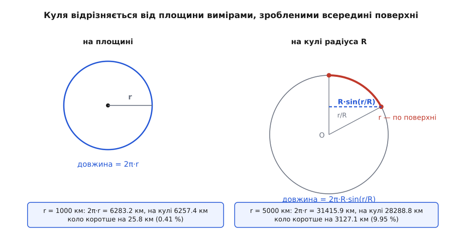
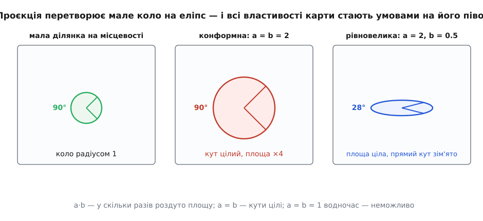
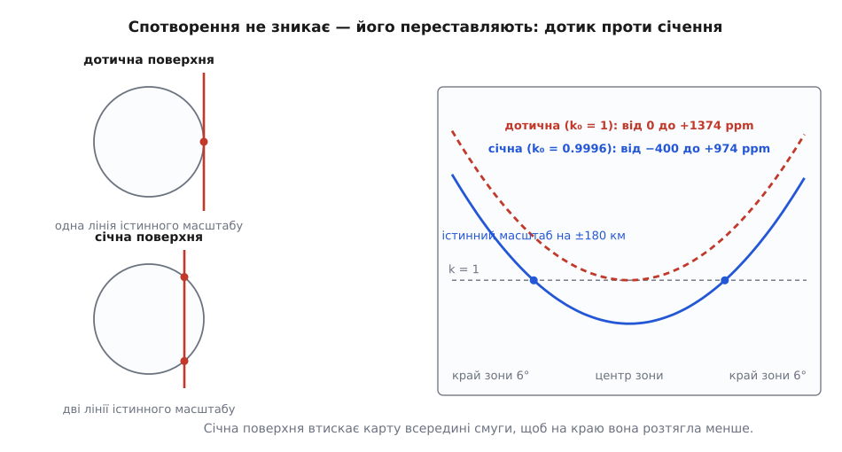

# Картографічні проєкції та їхні спотворення

<preknowlist>
- [Синус і косинус](topic:math-geometry/sine-cosine) — синус кута як довжина проєкції на колі; на ньому тримається кожна оцінка спотворення нижче.
- [Система координат](topic:math-geometry/coordinate-system) — координати мають сенс лише щодо домовленої основи; карта задає свою власну.
- [Частинна похідна](topic:math-analysis/partial-derivative) — швидкість зміни функції по одній зі змінних; нею міряють, як карта тягне поверхню в кожному напрямку.
- [Еліпс](topic:math-geometry/ellipse) — велика й мала півосі; саме еліпс виявиться мірилом спотворення.
- [WGS-84: еліпсоїд і датум](topic:math-geometry/wgs84-datum) — справжня фігура Землі не куля, а сплюснутий еліпсоїд; куля тут буде свідомим спрощенням.
</preknowlist>

Обчисти апельсин одним суцільним клаптем і спробуй притиснути шкірку до стола. Вона не ляже. Щоб краї стали пласкими, їх доводиться надривати, а щоб залатати надриви — розтягувати сусідні місця. Що більший клапоть, то безнадійніше.

Карта світу — той самий клапоть, тільки без надривів: усе, що мало б розірватися, натомість розтягнуто, стиснуто або зсунуто. Виглядає це як вада способу — мовляв, досить придумати хитрішу формулу. Насправді хитріша формула не існує, і перше, що варто зрозуміти, — звідки береться ця приреченість. Друге — як назвати спотворення числом, щоб карти можна було порівнювати не на око.

Далі скрізь Земля — куля. Її справжня фігура сплюснута, і в строгих формулах проєкцій це дає поправки в частки відсотка, важливі для геодезії; на висновок про неможливість ідеальної карти вони не впливають — еліпсоїд викривлений так само, як куля.

## Вимір, що робиться, не відриваючись від поверхні

Спотворення означає одне: відстань між двома точками на карті не відповідає відстані між ними на землі. Отже, ідеальна карта — це розкладання сфери на площину, що зберігає **всі** відстані, зміряні по самій поверхні.

Припустімо на хвилину, що таке розкладання є. Тоді будь-який вимір, зроблений уздовж поверхні, без виходу в простір, дасть на кулі те саме число, що й на пласкій копії: усі такі виміри врешті зводяться до довжин, а довжини за припущенням збережено. Отже, досить знайти один-єдиний вимір, який на кулі й на площині дає різні числа, — і припущення розсиплеться.

Такий вимір знаходиться відразу. Постав ніжку циркуля в точку й познач усі точки, віддалені від неї рівно на `r`, причому `r` відкладай по самій поверхні, не зрізаючи навпростець крізь товщу. На площині вийде звичайне коло довжиною 2π·r. На кулі радіуса R вийде теж коло — край шапочки, — але його справжній радіус інший: дуга довжиною `r` відповідає центральному куту r/R, і точки того кола віддалені від осі шапочки не на `r`, а на R·sin(r/R). Синус завжди менший за свій аргумент, тож

```text
на площині:  C = 2π·r
на кулі:     C = 2π·R·sin(r/R)  <  2π·r
```

**Земля, R = 6371 км.**
```text
r = 1000 км:  2π·r =  6283.2 км,  на кулі  6257.4 км → коротше на   25.8 км (0.41 %)
r = 5000 км:  2π·r = 31415.9 км,  на кулі 28288.8 км → коротше на 3127.1 км (10.0 %)
```

Землемір, який ніколи не бачив планету збоку, може довести, що вона не пласка, самим лише мірним ланцюгом: відкласти від колодязя тисячу кілометрів у всі боки й пересвідчитися, що обхід позначеної межі виходить на двадцять шість кілометрів коротшим, ніж належить колу такого радіуса. І це не наслідок недосконалості ланцюга — це властивість самої поверхні. Ідеальне розкладання мусило б зберегти і радіус, і довжину кола, а на площині ці два числа пов'язані жорстко, C = 2π·r, і жодного вибору не лишають.


*Той самий циркуль на площині й на кулі. Радіус відкладено по поверхні, тож на кулі коло виявляється коротшим за 2π·r — і різниця вимірна зсередини поверхні, без жодного погляду ззовні. Саме тому пласкої копії кулі не існує.*

Величину, яку намацує це коло, звуть **гаусовою кривиною**: для кулі радіуса R вона дорівнює 1/R², для площини — нулю. Головне в ній не формула, а те, що її можна обчислити, не виходячи з поверхні, — самими вимірами вздовж неї. Це довів 1827 року Карл Фрідріх Гаус і назвав результат *theorema egregium* (лат. «чудова теорема»); привела його туди практика — він тоді керував тріангуляційним зніманням Ганноверського королівства. Наслідок для нас прямий: дві поверхні з різною гаусовою кривиною не накладаються одна на одну без спотворення навіть на найменшому клаптику. Чим саме є ця величина й чому вона внутрішня — [окрема тема](topic:math-geometry/gaussian-curvature); тут достатньо кола з циркулем.

І тут ховається несподіванка, на якій тримається все картографічне ремесло. Згорни аркуш паперу в трубку. Ти нічого не розтягнув і не надірвав — кожна відстань, зміряна по паперу, лишилася тією самою. Значить, у трубки ті самі внутрішні виміри, що в аркуша, а її гаусова кривина теж нуль, хоч у просторі вона очевидно вигнута. Те саме з конусом. Вигнутість у просторі й кривина зсередини — різні речі, і на карту впливає лише друга. Поверхні з нульовою кривиною розгортаються в площину без жодного спотворення; їх звуть **розгортними**. Сфера до них не належить — і жоден поворот, розтяг чи хитра формула цього не змінять.

## Два числа, які кажуть про карту все

Ідеальної карти немає — отже, карти доводиться порівнювати між собою. Для цього спотворення треба назвати числом, і не одним числом «на карту»: у різних її місцях воно різне, часто на порядки.

Візьми на землі клаптик, малий проти радіуса планети, — скажімо, кілометр. У такому масштабі і поверхня, і карта майже пласкі, а перетворення між ними майже лінійне; саме це й означає гладкість формул проєкції, а формально йдеться про [якобіан](topic:math-analysis/jacobian-matrix) — матрицю частинних похідних координат карти по широті й довготі. Лінійне перетворення робить із кола еліпс. Завжди, без винятків.

Звідси спосіб міряти. Намалюй на землі маленьке коло одиничного радіуса й подивись, у що воно перетворилося на карті: вийде еліпс із півосями `a` і `b`. Ці два числа — повний опис спотворення в цій точці. `a` — найбільше розтягнення, `b` — найменше, і напрямки, у яких вони досягаються, взаємно перпендикулярні і на землі, і на карті. Що така пара напрямків знаходиться завжди — не картографічний факт, а властивість будь-якого лінійного перетворення, відома як [сингулярний розклад](topic:math-algebra/svd). Сам еліпс зветься **індикатрисою Тіссо**: французький картограф Ніколя Оґюст Тіссо запропонував цей спосіб 1859 року й розгорнув його в книжці 1881-го; відтоді спотворення карт описують саме так.

Тепер кожна бажана властивість карти перетворюється на умову для двох чисел:

```text
a = b   у кожній точці   →  карта зберігає кути          (конформна)
a · b = 1               →  карта зберігає площі         (рівновелика)
a = b = 1               →  карта зберігає геть усе      (ідеальна)
```

Із тих самих двох чисел виводяться і звичні оцінки спотворення. Площа роздувається рівно в a·b разів. А найбільше, на скільки може збрехати кут між двома напрямками, дається формулою sin(ω/2) = |a − b| / (a + b). Обидві виводяться з еліпса за кілька рядків — [виведення й повний набір формул](topic:math-geometry/map-projections/math-tissot.md) винесено окремо, разом із тим, як дістати `a` і `b` із похідних конкретної проєкції.

**Одна широта, дві циліндричні карти: 60° північної широти.**
```text
конформна (Меркатора)
  a = b = 1/cos 60° = 2          кути цілі
  a · b = 4                      ділянка вчетверо більша, ніж є насправді

рівновелика (Ламберта)
  a = 1/cos 60°   = 2            уздовж паралелі
  b = cos 60°     = 0.5          уздовж меридіана
  a · b = 1                      площа ціла
  sin(ω/2) = 1.5 / 2.5 = 0.6  →  ω = 73.7°
```

Одна широта, та сама циліндрична розгортка — і два протилежні рахунки. Перша карта каже правду про форму й бреше про розмір учетверо. Друга каже правду про розмір, а прямий кут на ній може перекоситися на сімдесят три градуси. Конкретно для карти Меркатора цей рахунок розгорнуто в темі про [Web Mercator](topic:math-geometry/web-mercator-tiles) — там видно, як із вимоги a = b народжується вся її формула.


*Мала кругла ділянка після проєкції стає еліпсом, і його півосі відповідають на всі питання. Рівність півосей означає цілі кути й роздуту площу; одиничний добуток — цілу площу й зім'яті кути. Обидві умови водночас дали б коло того самого розміру, тобто ідеальну карту.*

> 🔧 **Навіщо це.** «Точність карти» — не одне число, і питання «яка проєкція точніша» без згадки про операцію відповіді не має. Програмі, що рахує площу лісової ділянки чи густину населення, важить лише добуток a·b — різниця півосей їй байдужа. Програмі, що малює сектор огляду камери, стрілку курсу чи коло похибки приймача, важить лише різниця a − b: щойно вона не нуль, коло на екрані стає еліпсом, а прямий кут перестає бути прямим. Тому перше питання при виборі проєкції — не «наскільки вона хороша», а «яке з двох чисел псує мою задачу».

## Чому бажання взаємно виключні

Обидві умови вже записано, і тепер видно, що разом вони не виконуються. Якщо a = b і водночас a·b = 1, то a² = 1, тобто a = b = 1 — карта зберігає всі довжини. А це те саме ідеальне розкладання, яке щойно заборонило коло з циркулем. Отже, конформна карта неминуче бреше про площі, а рівновелика — про форми, і не десь на краях, а в кожній точці, де вона взагалі щось спотворює.

Так само падає мрія про карту з правильними відстанями: «всі відстані цілі» — це знову a = b = 1. Тому слово «рівнопроміжна» ніколи не стоїть саме: воно завжди має додаток. Рівнопроміжна **від однієї точки** — відстані правильні лише вздовж променів із неї. Рівнопроміжна **вздовж меридіанів** — правильні лише північ-південь. Це не скромність назви, а єдине, що взагалі можливо.

Першим це чітко сформулював Йоганн Гайнріх Ламберт — уродженець Мюльгаузена, тодішньої міської республіки в союзі зі швейцарськими кантонами, нащадок гугенотів-утікачів, який працював у Берлінській академії. У праці 1772 року він уперше розібрав загальні властивості проєкцій як класу, вказав на несумісність конформності та рівновеликості й заразом виклав сім нових проєкцій; три з них — конічна конформна, поперечна Меркатора й азимутальна рівновелика — працюють щодня досі. Як людство доходило до цієї межі й що робило з нею потім, аж до суперечок про «чесну» карту світу, — [окремою розповіддю](topic:math-geometry/map-projections/hist-impossible-map.md).

Раз обидві крайності мають ціну, лишається третій шлях: не зберігати точно нічого, зате не дати жодному спотворенню розростися надто. Такі проєкції звуть **компромісними**. Артур Робінсон побудував свою 1963 року на замовлення видавця Rand McNally, підбираючи розстановку паралелей на око, за списком вимог до вигляду, а не за формулою. Потрійна проєкція Освальда Вінкеля (1921) усереднює дві інші, і «потрійна» вона тому, що автор цілив одразу в три спотворення — площ, напрямків і відстаней. National Geographic 1988 року перейшло на Робінсонову, а 1998-го — на Вінкелеву, і саме вона тепер найвідоміша карта світу, яка не зберігає нічого точно.

## Куди подіти те, що не зникає

Спотворення не прибирається, але воно не мусить лежати саме там, де лежить. Уся техніка картографії — про те, як пересунути його туди, де воно нікому не заважає. Важелів три.

**Перший — на що розгортати.** Розгортні поверхні вже знайдено: площина, циліндр, конус. Звідси стандартний хід у два кроки — спершу перенести сферу на розгортну поверхню, і саме цей крок псує, а потім розгорнути її в аркуш, що вже безкоштовно. Циліндр дає прямокутну сітку, зручну для смуги; конус — віяло, зручне для пояса середніх широт, витягнутого по довготі; площина торкається в одній точці й пасує круглому районові чи полюсу.

Тут потрібна засторога. Більшість названих проєкцій не є проєкціями в буквальному, променевому сенсі: карта Меркатора не вийде, якщо посвітити з центра кулі на циліндр, бо її вертикальна координата дається інтегралом, а не променем. Поділ на циліндричні, конічні й азимутальні описує **вигляд сітки й місце, де спотворення мале**, а не спосіб побудови.

**Другий важіль — куди повернути дотик.** Циліндр не обов'язково ставити на екватор. Поверни його на дев'яносто градусів — і той самий Меркатор стане точним уздовж вибраного меридіана: смуга з півночі на південь ляже на нього майже неспотвореною. Так само конус чи площину можна прикласти під будь-яким кутом. Розташування дотику звуть аспектом: нормальний, поперечний, косий — і вибирають його так, щоб лінія дотику пройшла посередині району.

**Третій — торкатися чи врізатися.** Дотична поверхня має одну лінію, де масштаб істинний, і далі спотворення росте лише в один бік. Січна врізається в кулю: ліній істинного масштабу стає дві, між ними карта трохи стиснута, поза ними трохи розтягнута. Найгірше значення при цьому падає майже вдвічі — задарма, самим лише зсувом нуля.

**Смуга UTM: звідки береться число 0.9996.**
```text
ширина зони             = 6° довготи
півширина на екваторі   = 3° · π/180 · 6378 км = 334 км
масштаб поперечної Меркатора:  k = k₀ · cosh(x/R),  x — відхід від осьового меридіана

дотична, k₀ = 1:
  центр  k = 1.000000        0 ppm
  край   k = 1.001374    +1374 ppm

січна,  k₀ = 0.9996 = 1 − 1/2500:
  центр  k = 0.999600     −400 ppm
  край   k = 1.000974     +974 ppm
  k = 1  на  x = ±180 км
```

Замість однієї межі в 1374 мільйонні частки виходять дві, −400 і +974, і найгірше по модулю стає майже вдвічі меншим. Ось і все пояснення дивного коефіцієнта, який стоїть у кожній зоні UTM: карту навмисне зменшили на чотири десятитисячні, щоб на краю зони їй лишалося менше куди розтягуватися.


*Дотик дає одну лінію істинного масштабу й спотворення, що росте в один бік. Січення дає дві такі лінії та ділить помилку між знаком мінус усередині смуги й знаком плюс на її краях. Площа під кривою нікуди не поділася — її просто переставили.*

> 🔧 **Навіщо це.** Масштабний коефіцієнт зони — не абстракція, а поправка, яку геодезист множить руками. Мільйонна частка — це міліметр на кілометр, тож −400 ppm означає, що відрізок, узятий із карти, на сорок сантиметрів коротший за фактичну відстань на кожен кілометр. Виносячи проєктну точку в натуру, довжину з плану ділять на масштабний коефіцієнт у цьому місці зони; забутий поділ дає систематичний зсув, який росте з довжиною ходу й ніколи не усереднюється до нуля. З тієї самої причини не можна безкарно зшивати виміри з двох сусідніх зон: на стику однакові координати належать різним системам.

## Як обирають проєкцію

Три питання, і саме в такому порядку.

**Наскільки великий район?** Спотворення росте як квадрат відношення розміру району до радіуса планети, а це означає, що для малих районів воно просто зникає під шумом вимірів. Оцінку згори дає азимутальна рівнопроміжна проєкція: у ній відстані від центра точні, а поперечний масштаб дорівнює (r/R)/sin(r/R) ≈ 1 + (r/R)²/6.

```text
район радіусом  100 км:    +41 ppm    ≈  4 см на кілометр
район радіусом  500 км:  +1030 ppm    ≈   1 м на кілометр
район радіусом 2000 км:    +1.66 %    ≈  17 м на кілометр
```

Найкраща можлива проєкція для такого району ще трохи краща за цю оцінку, але порядок величини вона задає правильно. Висновок практичний: для міста чи області вибір проєкції майже не важить — усе тоне в похибці самих вимірів, і локальну геометрію там простіше рахувати прямо в [місцевій дотичній площині](topic:math-geometry/local-tangent-plane), у метрах. Для країни вибір уже видно на числах. Для світу він визначає геть усе, що карта скаже читачеві.

**Що з картою робитимуть?** Прокладати курс, міряти кути, впізнавати обриси — конформну; на такій карті ще й [лінія сталого курсу](topic:math-geometry/rhumb-line) на циліндричних варіантах виходить прямою. Рахувати площі, показувати густини й будь-яку статистику «на квадратний кілометр» — рівновелику: на конформній карті око само зважить дані площею, і Гренландія переважить Африку. Міряти дальність і азимут від однієї точки — радіозв'язок, радіус дії, зона досяжності — азимутальну рівнопроміжну з центром саме в цій точці.

**Якої форми район?** Витягнутий по довготі в середніх широтах — конічну на двох стандартних паралелях: рівновелику Альберса для статистики, конформну Ламберта для авіаційних карт. Вузька смуга з півночі на південь — поперечний циліндр: так побудовано UTM і більшість національних систем координат. Круглий район або полярна шапка — азимутальну. Правило одне: лінія (чи точка) дотику мусить пройти серединою району, бо саме там спотворення нульове.

Порахувати спотворення для власного району й власної проєкції можна без жодних аналітичних формул — числовим диференціюванням прямого перетворення; готова [добірка коду](topic:math-geometry/map-projections/proj-distortion-map.md) будує поле `a`, `b`, площі й кутової деформації по сітці й дозволяє порівняти кілька кандидатів числами, а не на око.

## Проєкція — частина даних

Останнє, що з усього цього випливає, стосується вже не паперу, а файлів. Пара чисел «x, y», знята з карти, сама по собі місця не означає: одне й те саме місце в різних проєкціях має різні координати, а однакові координати в різних проєкціях вказують на різні місця. Тому поруч із числами завжди мусить лежати назва проєкції й [датума](topic:math-geometry/wgs84-datum) — без них дані нечитні, а накладання двох шарів із різних систем дає розбіжність, яку легко прийняти за похибку вимірів.

Та сама пара `a`, `b` пояснює і найпоширенішу помилку в обробці: довжину чи площу міряють просто в тих координатах, у яких дані лежать. Якщо це координати [Web Mercator](topic:math-geometry/web-mercator-tiles), у якій показано майже всі карти в браузері, то на широті шістдесят градусів довжина вийде вдвічі, а площа вчетверо більшою за справжню — рівно ті `a` і `b`, що вийшли для конформної карти на шістдесятій паралелі. Відстані міряють по самій поверхні планети: [дугою великого кола](topic:math-geometry/great-circle-distance) для швидкої оцінки або строгими геодезичними розв'язками для точності. Площі — у рівновеликій проєкції, підібраній під район.

Карта — це стиснення з утратами. Вибрати проєкцію означає вибрати, що саме дозволено втратити, і записати цей вибір поруч із даними, щоб той, хто прийде після, знав, чому вірити.
