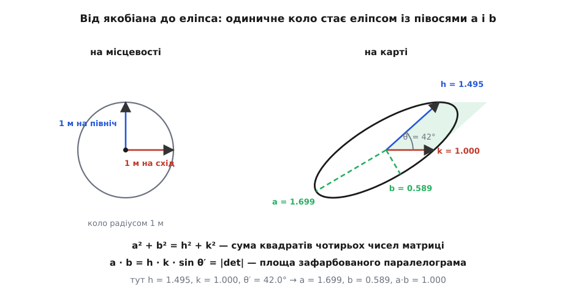
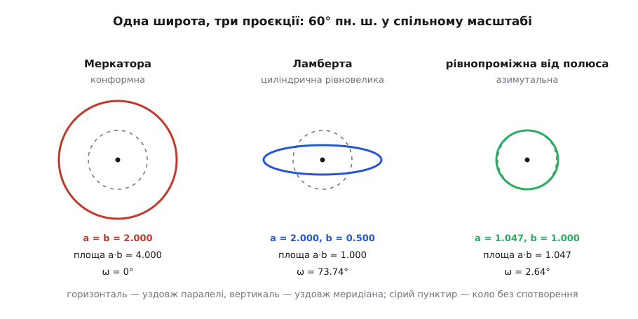

# 🧮 Еліпс спотворень: як дістати a і b просто з формул проєкції

Спотворення карти в точці — це два числа, півосі еліпса Тіссо. Тут показано, як добути їх із самих формул проєкції за скінченну кількість кроків: метрика сфери → якобіан → два інваріанти → `a` і `b`; а вже з них площа, кутова деформація й обидві класичні умови на карту виводяться кількома рядками алгебри. Наприкінці все доведено до чисел на чотирьох проєкціях.

## Скільки метрів в одиниці координати

Широта й довгота — кути, а не довжини, тож похідні по них самі по собі нічого не важать: однакове прирощення довготи біля екватора й біля полюса дає різні відстані на землі. Перше, що потрібне, — переклад із кутів у метри.

Точка на кулі радіуса `R`. Зміщення вздовж меридіана на `dφ` дає дугу `R·dφ`, бо меридіан — велике коло радіуса `R`. Зміщення вздовж паралелі на `dλ` дає дугу `R·cos φ·dλ`, бо паралель — коло меншого радіуса `R·cos φ`. Ці два напрямки перпендикулярні, тож за теоремою Піфагора мале зміщення має довжину

```text
ds² = R²·(dφ² + cos²φ·dλ²)
```

Звідси два перевідники, на яких тримається все далі:

```text
1 метр на північ  ⟷  dφ = 1/R
1 метр на схід    ⟷  dλ = 1/(R·cos φ)
```

## Матриця, що діє на метри

Проєкція — пара гладких функцій `x(φ, λ)` і `y(φ, λ)`. На клаптику, малому проти радіуса планети, вона з будь-якою потрібною точністю лінійна, і цю лінійну частину задає [якобіан](root:math-analysis/jacobian-matrix) — таблиця чотирьох [частинних похідних](root:math-analysis/partial-derivative).

Але якобіан у змінних `(φ, λ)` діє на кути, і його числа залежать від того, у чому міряти аргумент. Щоб дістати чесне відношення «метри на карті до метрів на землі», йому треба подавати ортонормований репер місцевості — ті самі «метр на схід» і «метр на північ». Підставляємо перевідники в стовпці:

```text
     ⎡  (1/(R·cos φ))·∂x/∂λ      (1/R)·∂x/∂φ  ⎤
A =  ⎢                                        ⎥
     ⎣  (1/(R·cos φ))·∂y/∂λ      (1/R)·∂y/∂φ  ⎦
```

Перший стовпець — куди на карті поїде метр, відкладений на схід; другий — метр, відкладений на північ. Довжини цих стовпців і кут між ними вже мають імена:

```text
k  = √((∂x/∂λ)² + (∂y/∂λ)²) / (R·cos φ)     масштаб уздовж паралелі
h  = √((∂x/∂φ)² + (∂y/∂φ)²) / R             масштаб уздовж меридіана
θ′ = кут між образами цих двох напрямків на карті
```

> 🔧 **Навіщо це.** Дільник `R·cos φ` у `k` — місце, де найчастіше ламається саморобний розрахунок спотворення. Забути його легко: формула `x = R·λ` виглядає так, ніби вздовж паралелі масштаб дорівнює одиниці на будь-якій широті. Насправді на 60° паралель удвічі коротша за екватор, і той самий `∂x/∂λ = R` означає розтяг удвічі. Помилка не крикне — вона тихо видасть правдоподібні числа, у яких карта Меркатора виявиться рівновеликою.

## Дві величини, які не залежать від вибору осей

Матриця `A` перетворює одиничне коло на [еліпс](root:math-geometry/ellipse), і це не збіг, а зміст [сингулярного розкладу](root:math-algebra/svd): будь-яку матрицю 2×2 можна записати як поворот, потім розтяг уздовж двох перпендикулярних осей на `a` і `b`, потім ще один поворот. Числа `a ≥ b` звуть сингулярними; на карті це найбільший і найменший масштаб у точці, і напрямки, у яких вони досягаються, перпендикулярні і на землі, і на карті.

Знаходити сам розклад не треба. Пара `a`, `b` однозначно задається своєю сумою й добутком, а обидва зчитуються з `A` прямо:

```text
a² + b² = A₁₁² + A₁₂² + A₂₁² + A₂₂² = k² + h²
a · b   = |det A| = h·k·sin θ′
```

Перша рівність: квадрати сингулярних чисел — це власні значення `AᵀA`, а їхня сума є слід цієї матриці, тобто сума квадратів усіх чотирьох елементів `A`. Та сама сума — це квадрати довжин стовпців, `k²` і `h²`. Друга рівність: [визначник](root:math-algebra/matrix-determinant) множиться при композиції, а в повороту він дорівнює одиниці, тож від трьох множників розкладу лишається `|det A| = a·b`; геометрично це площа паралелограма, збудованого на двох стовпцях, а вона дорівнює `h·k·sin θ′`.

Далі — шкільна алгебра. Сума квадратів і добуток дають квадрати суми й різниці:

```text
(a + b)² = a² + b² + 2ab = h² + k² + 2·h·k·sin θ′
(a − b)² = a² + b² − 2ab = h² + k² − 2·h·k·sin θ′
```

звідки формули Тіссо:

```text
a + b = √(h² + k² + 2·h·k·sin θ′)
a − b = √(h² + k² − 2·h·k·sin θ′)

a = ((a+b) + (a−b))/2 ,   b = ((a+b) − (a−b))/2
```

Коли сітка меридіанів і паралелей лягла на карту прямокутною, `sin θ′ = 1`, під коренями стоять повні квадрати `(h ± k)²`, і все згортається до `a = max(h, k)`, `b = min(h, k)`. Так поводиться більшість проєкцій у нормальному аспекті — саме тому їхні `h` і `k` часто називають масштабами «по осях» без застережень. Загальні формули потрібні там, де меридіан перетинає паралель косо.


*Стовпці матриці — це образи двох одиничних напрямків; їхні довжини дають `h` і `k`, а площа паралелограма на них — добуток `a·b`. Півосі еліпса не збігаються з жодним із двох стовпців, щойно кут між ними перестає бути прямим.*

## Площа і кут

Площа — просто `a·b`: коло площею π стало еліпсом площею `π·a·b`.

Кут вимагає роботи. Візьмімо на місцевості напрямок під кутом `u` до тієї осі, уздовж якої розтяг найбільший. У власних осях перетворення виглядає елементарно: `(cos u, sin u) → (a·cos u, b·sin u)`. Отже, образ дивиться під кутом `u′`, для якого

```text
tan u′ = (b/a)·tan u
```

Оскільки `b ≤ a`, кут завжди притискається до великої осі, `u′ ≤ u`. Шукаємо, де притискання найбільше: позначимо `t = tan u` і продиференціюємо різницю `u − u′ = arctg t − arctg(t·b/a)` по `t`.

```text
1/(1 + t²) − (b/a)/(1 + (b/a)²·t²) = 0
⇒  1 + (b²/a²)·t² = (b/a)·(1 + t²)
⇒  t²·(b/a)·((b/a) − 1) = (b/a) − 1
⇒  t² = a/b
```

Скорочення на `(b/a − 1)` законне доти, доки `a ≠ b`; при `a = b` викривлення кутів немає взагалі. Отже, найгірший напрямок — той, де `tan u = √(a/b)`, і тоді `tan u′ = (b/a)·√(a/b) = √(b/a)`. Обидва кути читаються з прямокутних трикутників із катетами `√a` і `√b`:

```text
sin u  = √a/√(a+b) ,  cos u  = √b/√(a+b)
sin u′ = √b/√(a+b) ,  cos u′ = √a/√(a+b)

sin(u − u′) = sin u·cos u′ − cos u·sin u′ = (a − b)/(a + b)
```

Лишається одна тонкість. Величина `ω` — це найбільша зміна кута *між двома* напрямками, а не поворот одного. Візьми пару, симетричну відносно великої осі: `+u` і `−u`. Кут між ними дорівнює `2u`, на карті він стає `2u′`, тобто змінюється на `2(u − u′)`. Це і є `ω`:

```text
sin(ω/2) = (a − b)/(a + b)
```

Тепер видно й де саме шукати найгірший розкид. Для `a = 2`, `b = 0.5` виходить `tan u = 2`, тобто `u = 63.43°`: кут у `126.87°` між двома напрямками лягає на карту як `2·arctg 0.5 = 53.13°`, і різниця `73.74°` — це і є `ω`.

## Дві умови, яких від карти хочуть

**Конформність.** Рівність `a = b` означає, що `A` — це поворот, помножений на число: коло переходить у коло. У термінах стовпців — вони однакової довжини й перпендикулярні, тобто `h = k` і `θ′ = 90°`.

У похідних це записується найкоротше, якщо спершу вирівняти саму метрику. Уведемо ізометричну широту `ψ` умовою `dψ = dφ/cos φ`:

```text
ψ = ∫ dφ/cos φ = ln tan(π/4 + φ/2)
```

Цей [інтеграл січної](root:math-geometry/web-mercator-tiles/math-secant-integral.md) — той самий, що дає вертикальну координату Меркатора. Підставивши `dφ = cos φ·dψ` у метрику, дістаємо

```text
ds² = R²·cos²φ·(dλ² + dψ²)
```

У координатах `(λ, ψ)` метрика відрізняється від пласкої лише спільним додатним множником, а спільний множник кутів не міняє. Отже, карта зберігає кути рівно тоді, коли відображення `(λ, ψ) → (x, y)` [конформне](root:math-analysis/conformal-map) як відображення площини, тобто задовольняє рівняння Коші–Рімана:

```text
∂x/∂λ = ∂y/∂ψ ,   ∂x/∂ψ = −∂y/∂λ
```

Повертаючись до широти через `∂/∂ψ = cos φ·∂/∂φ`:

```text
∂x/∂λ = cos φ·∂y/∂φ ,   cos φ·∂x/∂φ = −∂y/∂λ
```

**Рівновеликість.** Умова `a·b = 1` — це `|det A| = 1`, тобто, після множення обох частин на `R²·cos φ`:

```text
(∂x/∂λ)·(∂y/∂φ) − (∂x/∂φ)·(∂y/∂λ) = ± R²·cos φ
```

Косинус праворуч не прикраса: це та сама поправка «паралель коротша за екватор», зашита в площу клітинки сітки.

## Чотири проєкції, пораховані до чисел

### Меркатора

```text
x = R·λ                       ∂x/∂λ = R      ∂x/∂φ = 0
y = R·ln tan(π/4 + φ/2)       ∂y/∂λ = 0      ∂y/∂φ = R/cos φ

k = R/(R·cos φ)       = 1/cos φ
h = (R/cos φ)/R       = 1/cos φ
θ′ = 90°   →   a = b = 1/cos φ
```

Коші–Ріман: ліворуч `∂x/∂λ = R`, праворуч `cos φ·∂y/∂φ = cos φ·R/cos φ = R` — тотожність, карта конформна. Визначник: `R·R/cos φ = R²/cos φ`, а рівновеликість вимагала б `R²·cos φ` — збіг лише на екваторі.

```text
 φ       h = k         a = b       a·b = 1/cos²φ      ω
 0°     1.000000      1.000000        1.000000       0°
45°     1.414214      1.414214        2.000000       0°
60°     2.000000      2.000000        4.000000       0°
75°     3.863703      3.863703       14.928203       0°
```

### Циліндрична рівновелика Ламберта

```text
x = R·λ               ∂x/∂λ = R      ∂x/∂φ = 0
y = R·sin φ           ∂y/∂λ = 0      ∂y/∂φ = R·cos φ

k = 1/cos φ     h = cos φ     θ′ = 90°
a = 1/cos φ     b = cos φ     a·b = 1  тотожно

sin(ω/2) = (1/cos φ − cos φ)/(1/cos φ + cos φ) = sin²φ/(1 + cos²φ)
```

Визначник `R·R·cos φ = R²·cos φ` — рівновеликість виконано точно на всій кулі. Коші–Ріман: `R` проти `cos φ·R·cos φ = R·cos²φ` — рівні лише на екваторі.

```text
 φ     h = cos φ    k = 1/cos φ       a           b        a·b     sin(ω/2)       ω
 0°    1.000000     1.000000      1.000000    1.000000    1.000    0.000000     0.00°
45°    0.707107     1.414214      1.414214    0.707107    1.000    0.333333    38.94°
60°    0.500000     2.000000      2.000000    0.500000    1.000    0.600000    73.74°
75°    0.258819     3.863703      3.863703    0.258819    1.000    0.874437   121.96°
```

На 75-й паралелі кут між двома напрямками може збрехати на сто двадцять два градуси: тупий кут у `151°` лягає на карту як гострий `29°`.

### Азимутальна рівнопроміжна, центр — полюс

```text
c = π/2 − φ        полярна відстань від центра
ρ = R·c            радіус точки на карті,   напрямок = λ
```

Уздовж меридіана карта точна за побудовою: радіус росте рівно так, як дуга, тож `h = 1`. Уздовж паралелі рахунок теж короткий — коло радіуса `ρ = R·c` на карті має довжину `2π·R·c`, а сама паралель на кулі — `2π·R·sin c`:

```text
h = 1              k = c/sin c            θ′ = 90°
a = c/sin c        b = 1                  a·b = c/sin c ≈ 1 + c²/6

sin(ω/2) = (c − sin c)/(c + sin c)
```

```text
 φ     c = 90°−φ    k = a = c/sin c       b        a·b            ω
 0°       90°          1.570796        1.000     1.570796     25.66°
45°       45°          1.110721        1.000     1.110721      6.01°
60°       30°          1.047198        1.000     1.047198      2.64°
75°       15°          1.011521        1.000     1.011521      0.66°
```

Порівняння колонок повчальне. На 60° ця карта роздуває площу на 4.7 % і кривить кути на 2.6° — не зберігає нічого точно, зате тримає малими обидва спотворення там, де кожна з двох попередніх уже віддала одне з двох чисел. Ціна винесена на протилежний край: на екваторі, за чверть оберту від центра, паралель розтягнуто в `π/2` разів.


*Одне місце на землі, три проєкції, спільний масштаб рисунка. Пунктирне коло — те, чим ділянка була б на неспотвореній карті.*

### Синусоїдальна: випадок, коли `sin θ′ ≠ 1`

```text
x = R·λ·cos φ        ∂x/∂λ = R·cos φ      ∂x/∂φ = −R·λ·sin φ
y = R·φ              ∂y/∂λ = 0            ∂y/∂φ = R

     ⎡ 1   −λ·sin φ ⎤
A =  ⎢              ⎥      λ — у радіанах від осьового меридіана
     ⎣ 0      1     ⎦
```

Визначник дорівнює одиниці тотожно — карта рівновелика. Але другий стовпець не перпендикулярний до першого, і чим далі від осьового меридіана, тим сильніше косить сітка. Позначивши `t = λ·sin φ`:

```text
k = 1                h = √(1 + t²)          sin θ′ = 1/h
a + b = √(4 + t²)    a − b = |t|            a·b = 1
sin(ω/2) = |t| / √(4 + t²)
```

```text
 λ (на φ = 45°)      t          h         θ′          a          b          ω
    0°           0.000000   1.000000    90.00°    1.000000   1.000000     0.00°
   45°           0.555360   1.143864    60.95°    1.315518   0.760158    31.04°
   90°           1.110721   1.494555    42.00°    1.699225   0.588505    58.09°
  135°           1.666081   1.943148    30.97°    2.134561   0.468480    79.59°
```

Тут формули Тіссо працюють не задарма. Підставивши `h` і `k` у зручне «`a` — більший з двох, `b` — менший», на 90° довготи дістали б `1.495` і `1.000` замість правильних `1.699` і `0.589`, а їхній добуток вийшов би `1.495` замість одиниці — карта здалася б такою, що роздуває площу в півтора раза, хоча вона рівновелика точно. Косий кут між образами меридіана й паралелі забирає з добутку рівно множник `sin θ′`.

## Коли похідних немає в закритому вигляді

Аналітичні формули має не кожна проєкція: у складених, багатогранних і підібраних на око (як Робінсонова) похідних просто не існує. Для еліпса Тіссо це не перешкода — `A` будується з чотирьох різницевих відношень:

```text
∂x/∂φ ≈ (x(φ+δ, λ) − x(φ−δ, λ)) / (2δ)        і так само три інші
```

Центральна різниця має похибку зрізання порядку `δ²` і похибку округлення порядку `ε/δ`, де `ε ≈ 2.2·10⁻¹⁶` — крок подвійної точності. Їхня сума найменша при `δ ≈ ε^(1/3) ≈ 10⁻⁵` радіана (близько шістдесяти метрів на місцевості), і тоді відносна похибка `a` та `b` — порядку `ε^(2/3) ≈ 10⁻¹¹`, на кілька порядків нижче за все, що комусь знадобиться від карти. Про те, звідки береться цей компроміс і чому надто малий крок робить гірше, — [числове диференціювання](root:math-numeric/numerical-differentiation).
