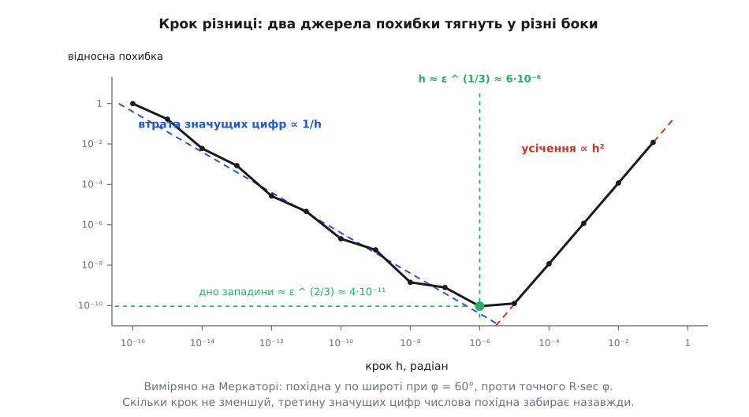

# ⚙️ Карта спотворень: зміряти проєкцію, маючи саму лише формулу вперед

Щоб дізнатися, як проєкція тягне поверхню, виводити її похідні не обов'язково — досить чорної скриньки, яка з пари (φ, λ) робить пару (x, y). Нижче код, що з цієї єдиної функції дістає головні масштаби `a` і `b` у кожному вузлі сітки, а з них коефіцієнт площі й кутову деформацію, і зводить чотирьох кандидатів у таблицю, за якою проєкцію під район вибирають числами, а не на око.

Аналітичні похідні варті мороки не завжди. У конічній конформній вони займають півсторінки й списуються з помилкою; у компромісних проєкціях на кшталт Робінсонової замкненого виразу немає взагалі — там таблиця й інтерполяція. Числовий шлях однаковий для всіх, коротший за виведення й перевіряє сам себе.

## Матриця, яку треба дістати

Мале коло на землі проєкція перетворює на еліпс, і всю цю дію описує матриця 2×2 з частинних похідних. Але брати її сирою не можна. `∂x/∂φ` — це «одиниць карти на радіан широти», а масштаб — це «одиниць карти на метр землі», і різниця тут не косметична: радіан широти й радіан довготи покривають на землі різні відстані.

Радіан широти — завжди дуга R. Радіан довготи на широті φ — дуга R·cos φ, і на шістдесятій паралелі вона вдвічі коротша за екваторіальну. Тому кожен стовпець ділиться на свою земну довжину:

```text
        ┌ (∂x/∂λ)/(R·cos φ)    (∂x/∂φ)/R ┐
   M =  │                                │
        └ (∂y/∂λ)/(R·cos φ)    (∂y/∂φ)/R ┘
            стовпець «схід»    стовпець «північ»
```

Тепер M безрозмірна: вона бере одиничний вектор, відкладений по землі на схід або на північ, і каже, у що він перетворився на карті. Ідеальна карта дала б одиничну матрицю.

Порядок стовпців тут не декоративний. Осі карти йдуть «схід, північ» — x праворуч, y вгору, — тож і вхідні напрямки треба брати в тому самому порядку. Поставиш широту першою — матриця вийде дзеркальною, визначник від'ємним, і формула кута нижче почне видавати рівно 180° для будь-якої проєкції, тоді як `a`, `b` і площа лишаться бездоганними. Пастка підступна саме тим, що псує одне число з чотирьох: три правильні відповіді присипляють пильність.

## Похідні без похідних

Кожну похідну беремо центральною різницею — двома викликами перетворення обабіч точки:

```text
∂x/∂φ ≈ [ x(φ+h, λ) − x(φ−h, λ) ] / (2h)
```

Чотири виклики на вузол — і матриця готова. Лишається одне питання: яке брати `h`. Тут не годиться ні велике, ні мале. Велике `h` міряє не дотичну, а січну, і похибка усічення падає як h². Мале `h` віднімає два майже однакові числа, і в різниці лишається сміття останніх розрядів — цей шум росте як 1/h. Разом виходить западина: докладніше про обидва схили — у [чисельному диференціюванні](topic:math-numeric/numerical-differentiation), а природа самого віднімання — у [числах із рухомою комою](topic:hw-arch/floating-point).


*Виміряна похибка похідної проти точного значення. Два джерела тягнуть у різні боки, тож зменшувати крок «про всяк випадок» — шкідливо: за оптимумом кожен наступний порядок псує відповідь удесятеро.*

**Похідна y по широті в Меркатора при φ = 60°, проти точного R·sec φ.**
```text
h = 10⁻³     відносна похибка  1.2·10⁻⁶     ← панує усічення
h = 10⁻⁵                       1.3·10⁻¹⁰
h = 10⁻⁶                       9.2·10⁻¹¹    ← дно
h = 10⁻⁸                       1.4·10⁻⁹
h = 10⁻¹²                      2.7·10⁻⁵     ← панує втрата розрядів
h = 10⁻¹⁵                      1.7·10⁻¹
```

Оптимум сидить там, де схили зрівнялися: h ≈ ε^(1/3), тобто близько 6·10⁻⁶ для подвійної точності. Дно западини при цьому дорівнює приблизно ε^(2/3) ≈ 4·10⁻¹¹ — числове диференціювання назавжди з'їдає третину значущих цифр, і кращого дна для нього не буває. Для карт це подарунок: десять правильних знаків там, де важать три.

Крок 10⁻⁶ радіана — це шість метрів по землі. Досить малий, щоб проєкція на такому відрізку була лінійною до одинадцятого знака, і досить великий, щоб різниця координат не втопилася в шумі.

## Сингулярні числа матриці 2×2 в замкненому вигляді

`a` і `b` — це [сингулярні числа](topic:math-algebra/svd) матриці M, найбільший і найменший коефіцієнти розтягу серед усіх напрямків. Для 2×2 шукати їх ітераціями не треба: є вираз у чотири корені.

```text
E = (m₁₁ + m₂₂)/2        F = (m₁₁ − m₂₂)/2
G = (m₂₁ + m₁₂)/2        H = (m₂₁ − m₁₂)/2

Q = √(E² + H²)     ← конформна частина: поворот із однаковим розтягом
S = √(F² + G²)     ← антиконформна: чистий перекіс

a = Q + S          b = |Q − S|
```

Розбиття має простий сенс. Q — та частина перетворення, що діє на всі напрямки однаково; кути вона не чіпає. S — та, що розтягує один напрямок за рахунок перпендикулярного. Конформна карта — це S = 0 у кожній точці.

Звідси обидві відповіді падають самі. Площа:

```text
a·b = |Q² − S²| = |E² + H² − F² − G²| = |m₁₁m₂₂ − m₁₂m₂₁| = |det M|
```

Коефіцієнт площі — це просто [визначник](topic:math-algebra/matrix-determinant), і через `a` з `b` його рахувати не обов'язково. Зате це безкоштовна перевірка: два незалежні шляхи мусять збігтися до останнього розряду. А кут:

```text
sin(ω/2) = (a − b)/(a + b) = min(Q, S) / max(Q, S)
```

Найбільша кутова деформація — це відношення меншої з двох частин до більшої, і жодних `a`, `b` для неї не потрібно. Записати його як S/Q спокусливо й хибно: щойно карта виявиться дзеркальною, S пережене Q, аргумент арксинуса вилетить за одиницю, і затискач `min(1, ·)` тихо поставить рівні 180° у кожному вузлі.

## Код

Одна функція на точку, одна на обхід сітки, чотири на кандидатів. Прямі перетворення — сферичні, за Снайдером; усі повертають метри на кулі, тому їхні числа можна класти поруч.

:::tabs
```python
import math, statistics

R = 6371008.8                      # середній радіус WGS-84, м
D = math.pi / 180

def tissot(f, phi, lam, h=1e-6):
    """Головні масштаби a, b, коефіцієнт площі a·b і кутова деформація ω (градуси)."""
    (xe1, ye1), (xe2, ye2) = f(phi, lam + h), f(phi, lam - h)   # СХІД — перший стовпець
    (xn1, yn1), (xn2, yn2) = f(phi + h, lam), f(phi - h, lam)   # ПІВНІЧ — другий
    de, dn = 2 * h * R * math.cos(phi), 2 * h * R               # метрів по землі

    m11, m12 = (xe1 - xe2) / de, (xn1 - xn2) / dn
    m21, m22 = (ye1 - ye2) / de, (yn1 - yn2) / dn

    E, F = (m11 + m22) / 2, (m11 - m22) / 2
    G, H = (m21 + m12) / 2, (m21 - m12) / 2
    Q, S = math.hypot(E, H), math.hypot(F, G)

    a, b = Q + S, abs(Q - S)
    lo, hi = min(Q, S), max(Q, S)
    omega = math.degrees(2 * math.asin(min(1.0, lo / hi))) if hi > 0 else 0.0
    return a, b, a * b, omega

def sweep(f, south, west, north, east, n=61):
    """Найгірше й медіанне спотворення по сітці над прямокутником (градуси)."""
    area, omega = [], []
    for i in range(n):
        phi = (south + (north - south) * i / (n - 1)) * D
        for j in range(n):
            lam = (west + (east - west) * j / (n - 1)) * D
            _, _, ab, om = tissot(f, phi, lam)
            area.append(ab)
            omega.append(om)
    med = statistics.median(area)          # калібрування номінального масштабу карти
    return (min(area) / med, max(area) / med, max(omega), statistics.median(omega))

def mercator(lam0):
    return lambda phi, lam: (R * (lam - lam0), R * math.asinh(math.tan(phi)))

def lambert_cea(phi1, lam0):               # циліндрична рівновелика, нормальна паралель phi1
    c = math.cos(phi1)
    return lambda phi, lam: (R * (lam - lam0) * c, R * math.sin(phi) / c)

def lambert_cc(phi1, phi2, phi0, lam0):    # конічна конформна на двох стандартних паралелях
    t = lambda p: math.tan(math.pi / 4 + p / 2)
    n = math.log(math.cos(phi1) / math.cos(phi2)) / math.log(t(phi2) / t(phi1))
    F = math.cos(phi1) * t(phi1) ** n / n
    rho0 = R * F / t(phi0) ** n
    def f(phi, lam):
        rho, th = R * F / t(phi) ** n, n * (lam - lam0)
        return (rho * math.sin(th), rho0 - rho * math.cos(th))
    return f

def azimuthal_ed(phi0, lam0):              # азимутальна рівнопроміжна з центром (phi0, lam0)
    def f(phi, lam):
        cc = (math.sin(phi0) * math.sin(phi)
              + math.cos(phi0) * math.cos(phi) * math.cos(lam - lam0))
        c = math.acos(max(-1.0, min(1.0, cc)))       # кутова відстань від центра
        k = 1.0 if c < 1e-10 else c / math.sin(c)
        return (R * k * math.cos(phi) * math.sin(lam - lam0),
                R * k * (math.cos(phi0) * math.sin(phi)
                         - math.sin(phi0) * math.cos(phi) * math.cos(lam - lam0)))
    return f
```
```cpp
#include <algorithm>
#include <cmath>
#include <functional>
#include <vector>

namespace distort {

inline constexpr double R  = 6371008.8;                 // середній радіус WGS-84, м
inline constexpr double PI = 3.14159265358979323846;

struct XY { double x, y; };
using Forward = std::function<XY(double phi, double lam)>;   // радіани → одиниці карти

struct Tissot { double a, b, area, omega; };            // omega у градусах

// Спотворення в точці: h — крок центральної різниці, радіани.
Tissot tissot(const Forward& f, double phi, double lam, double h = 1e-6) {
    const XY e1 = f(phi, lam + h), e2 = f(phi, lam - h);   // СХІД — перший стовпець
    const XY n1 = f(phi + h, lam), n2 = f(phi - h, lam);   // ПІВНІЧ — другий
    const double de = 2.0 * h * R * std::cos(phi);         // метрів по землі
    const double dn = 2.0 * h * R;

    const double m11 = (e1.x - e2.x) / de, m12 = (n1.x - n2.x) / dn;
    const double m21 = (e1.y - e2.y) / de, m22 = (n1.y - n2.y) / dn;

    const double E = 0.5 * (m11 + m22), F = 0.5 * (m11 - m22);
    const double G = 0.5 * (m21 + m12), H = 0.5 * (m21 - m12);
    const double Q = std::hypot(E, H), S = std::hypot(F, G);   // конформна / антиконформна

    const double a = Q + S, b = std::fabs(Q - S);
    const double lo = std::min(Q, S), hi = std::max(Q, S);
    const double om = hi > 0.0 ? 2.0 * std::asin(std::min(1.0, lo / hi)) * 180.0 / PI : 0.0;
    return { a, b, a * b, om };
}

struct Score { double area_lo, area_hi, omega_max, omega_med; };

// Найгірше й медіанне спотворення по сітці над прямокутником (градуси).
Score sweep(const Forward& f, double south, double west, double north, double east, int n = 61) {
    std::vector<double> area, omega;
    area.reserve(std::size_t(n) * n);
    omega.reserve(std::size_t(n) * n);
    for (int i = 0; i < n; ++i) {
        const double phi = (south + (north - south) * i / (n - 1)) * PI / 180.0;
        for (int j = 0; j < n; ++j) {
            const double lam = (west + (east - west) * j / (n - 1)) * PI / 180.0;
            const Tissot t = tissot(f, phi, lam);
            area.push_back(t.area);
            omega.push_back(t.omega);
        }
    }
    std::sort(area.begin(), area.end());
    std::sort(omega.begin(), omega.end());
    const double med = area[area.size() / 2];      // калібрування номінального масштабу
    return { area.front() / med, area.back() / med,
             omega.back(), omega[omega.size() / 2] };
}

}  // namespace distort

namespace proj {

using distort::PI;  using distort::R;  using distort::XY;

auto mercator(double lam0) {
    return [lam0](double phi, double lam) -> XY {
        return { R * (lam - lam0), R * std::asinh(std::tan(phi)) };
    };
}

// Циліндрична рівновелика Ламберта, нормальна паралель phi1.
auto lambert_cea(double phi1, double lam0) {
    const double c = std::cos(phi1);
    return [c, lam0](double phi, double lam) -> XY {
        return { R * (lam - lam0) * c, R * std::sin(phi) / c };
    };
}

// Конічна конформна Ламберта на двох стандартних паралелях.
auto lambert_cc(double phi1, double phi2, double phi0, double lam0) {
    auto t = [](double p) { return std::tan(PI / 4 + p / 2); };
    const double n    = std::log(std::cos(phi1) / std::cos(phi2)) / std::log(t(phi2) / t(phi1));
    const double F    = std::cos(phi1) * std::pow(t(phi1), n) / n;
    const double rho0 = R * F / std::pow(t(phi0), n);
    return [t, n, F, rho0, lam0](double phi, double lam) -> XY {
        const double rho = R * F / std::pow(t(phi), n);
        const double th  = n * (lam - lam0);
        return { rho * std::sin(th), rho0 - rho * std::cos(th) };
    };
}

// Азимутальна рівнопроміжна з центром (phi0, lam0).
auto azimuthal_ed(double phi0, double lam0) {
    return [phi0, lam0](double phi, double lam) -> XY {
        const double cc = std::sin(phi0) * std::sin(phi)
                        + std::cos(phi0) * std::cos(phi) * std::cos(lam - lam0);
        const double c  = std::acos(std::clamp(cc, -1.0, 1.0));   // кутова відстань від центра
        const double k  = c < 1e-10 ? 1.0 : c / std::sin(c);
        return { R * k * std::cos(phi) * std::sin(lam - lam0),
                 R * k * (std::cos(phi0) * std::sin(phi)
                        - std::sin(phi0) * std::cos(phi) * std::cos(lam - lam0)) };
    };
}

}  // namespace proj
```
:::

Перш ніж вірити цифрам, код варто спитати про те, що відомо наперед. Кожна з чотирьох проєкцій має визначальну властивість, і числовий шлях мусить її відтворити:

```text
Меркатора на φ = 60°           a = 2.0000000000   b = 2.0000000000   ω = 5·10⁻⁹ °
рівновелика (φ₁ = 0) на 60°    a = 2.0000000000   b = 0.5000000000   ω = 73.7398°
                                                  a·b = 1.0000000000
конічна конформна, будь-де     a − b = 1.3·10⁻¹⁰                     ω = 8·10⁻⁹ °
азимутальна у своєму центрі    a = b = 1.000000000 ± 6·10⁻¹¹

a·b і |det M| в одному вузлі   2.42027662545271  проти  2.42027662545271
```

Конформність, рівновеликість і центр азимутальної відтворено з тією самою точністю, яку обіцяла западина. Це не декоративна перевірка: вона ловить і переставлені стовпці, і забуте `cos φ`, і зайвий множник R.

## Чотири кандидати над одним районом

Тепер обхід сітки має сенс. Прямокутник — Україна; конічній дано стандартні паралелі на шосту частину смуги широт від її країв, азимутальній і циліндричній рівновеликій — центр району.

**φ 44.0…52.5°, λ 22.0…40.5°, сітка 61×61.**
```text
проєкція                              площа після калібр.   ω найгірший / медіанний   a, b
Меркатора (λ₀ = 31.25°)               −14.3 … +19.7 %        0.00° / 0.00°     1.390 … 1.643
рівновелика Ламберта (φ₁ = 48.25°)      0.0 …   0.0 %       10.26° / 4.88°     0.914 … 1.094
конічна конформна (45.42° / 51.08°)    −0.14 … +0.42 %       0.00° / 0.00°     0.9988 … 1.0016
азимутальна рівнопроміжна (центр)      −0.09 … +0.21 %       0.17° / 0.05°     1.0000 … 1.0030
```


*Дві глобальні проєкції валять по одному числу кожна: у Меркатора площа гуляє на сорок відсотків між півднем і північчю району, у рівновеликої прямий кут перекошується на десять градусів. Дві місцеві не валять жодного — і саме тому вибір між ними вирішує вже не спотворення, а зручність сітки.*

Цифри кажуть те, чого на око не видно. Меркатор над Україною ідеальний за формою й непридатний для площ: Крим і Волинь роздуто по-різному в 1.4 раза, і будь-яка статистика «на квадратний кілометр», порахована прямо в цих координатах, поїде саме на стільки. Рівновелика Ламберта чесна щодо площ до останнього знака, але десять градусів перекосу — це видимі оком витягнуті обриси. Обидві місцеві проєкції тримають усе під половиною відсотка й нижче за похибку самого знімання.

> 🔧 **Навіщо це.** З двох чисел лише `ω` можна порівнювати між картами просто так. Воно залежить від відношення `a` до `b`, тож помножити всю карту на сталу — і воно не зміниться. А `a·b` від цього множника залежить квадратично: сирі коефіцієнти площі в Меркатора над Україною лежать біля 2.25, але це не означає, що карта вдвічі з чвертю гірша за конічну, — це означає лише, що її істинний масштаб живе на екваторі. Тому перед порівнянням площ кожну карту калібрують — ділять поле `a·b` на його медіану по району, і лишається те, чого масштабом уже не виправиш: розкид. Медіана, а не середнє: одна точка біля краю не повинна зсувати калібрування всієї карти.

## Скільки коштує й де ламається

```text
один вузол               4 виклики прямого перетворення + ~20 арифметичних дій
сітка n×n                4n² викликів,  O(n²)
61×61   (3721 вузол)     14 884 виклики    ≈ 6 мс на Python
201×201 (40401 вузол)    161 604 виклики   ≈ 60 мс
```

Ціна мізерна, тому сітку беруть щедро — але подрібнювати її без міри ні до чого: спотворення змінюється по району плавно, і 61×61 ловить найгірший вузол так само, як 601×601.

**Полюси.** На φ = ±90° множник R·cos φ обертається на нуль, і стовпець «схід» вибухає. Гірше, що φ + h переходить за полюс: більшість прямих перетворень таку широту мовчки приймають і повертають точку, віддзеркалену на інший бік, тож стовпець «північ» стає не `NaN`, а правдоподібним сміттям. Сітку зупиняють на ±89.5°, а сам полюс, якщо треба, беруть однобічною різницею — і пам'ятають, що вироджується там система координат (φ, λ), а не карта: полярна азимутальна проєкція в самому полюсі бездоганна.

**Перехід через 180-й меридіан.** Якщо `λ ± h` опиняються по різні боки розрізу, а перетворення зводить довготу в (−π, π], дві точки лягають на протилежні краї карти. Різниця замість десятка метрів дає всю ширину світу, і `a` вискакує в мільйони разів. Ліки — звести `λ − λ₀` в межі один раз, до різницювання, щоб розріз пішов на антипод центра карти; а вузли, де `a` все-таки перевищує розумну межу, просто викидати з вибірки.

**Масштаб щодо кулі проти масштабу карти.** Наведені перетворення повертають метри на кулі, тому `a` й `b` — чисті коефіцієнти й порівнюються прямо. Чужа проєкція може віддавати тайлові одиниці, градуси чи пікселі — тоді в `a` вбудований ще й номінальний масштаб карти, і сирі числа не значать нічого, доки не поділені на свою медіану.

**Куля замість еліпсоїда.** Усе вище рахує сферу. Для порівняння кандидатів цього досить із запасом: сплюснутість дає поправку в третьому знаку після коми відсотка, а самі кандидати різняться в рази. Для геодезії вже ні: там і перетворення, і множники беруться на [еліпсоїді WGS-84](topic:math-geometry/wgs84-datum), де замість одного R стоять два радіуси кривини, різні по меридіану й по паралелі.
