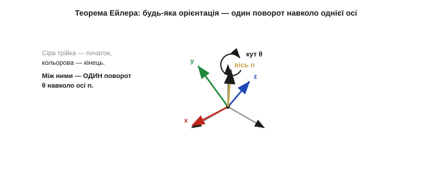
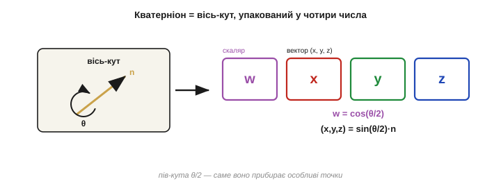
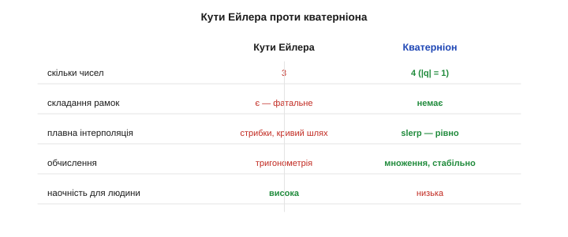
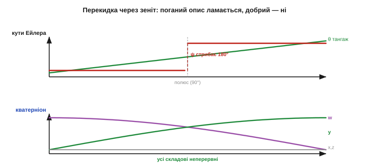
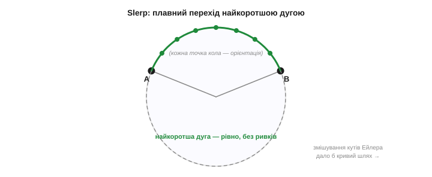
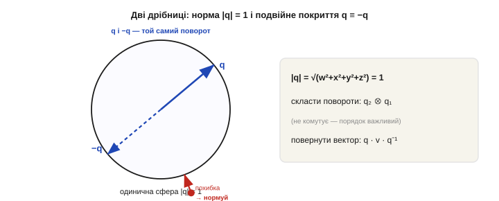
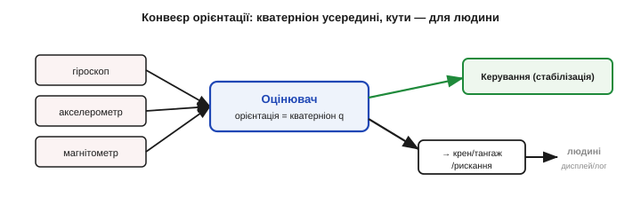

# Кватерніони: чому з ними зручніше

[Кути Ейлера](root:math-geometry/euler-angles) наочні для людини, та мають фатальну ваду — **складання рамок**, — а до неї додається ще одна: ними погано робити **плавний перехід** між орієнтаціями. Тому всередині серйозні системи орієнтації говорять іншою, менш наочною, але куди надійнішою мовою — **кватерніонами**. Слово лякає, проте за ним ховається проста й гарна ідея. Розберемося **якісно**, без занурення в алгебру: що це за чотири числа, звідки вони взялися, чому їх саме чотири й чому вони не знають ні складання рамок, ні стрибків.

### Один поворот навколо однієї осі

Почнемо з красивого факту, що його теж довів Ейлер (**теорема Ейлера про обертання**): хоч би як хитро було повернуте тверде тіло, цю орієнтацію завжди можна отримати **одним-єдиним** поворотом — на певний кут θ навколо певної **осі** n. Не трьома послідовними, як у кутах Ейлера, а одним. Уявіть глобус у будь-якому положенні: завжди знайдеться вісь, проштрикнувши вздовж якої й крутнувши на потрібний кут, ви переведете «нульове» положення точно в дане.


*Сіра трійка осей — початкове положення; кольорова — кінцеве. Хоч би яке складне було кінцеве положення, його завжди можна дістати **одним** поворотом на кут θ навколо **однієї** осі n (золота). Це подання — «вісь-кут» — уже без порядку й без трьох рамок, що можуть скластися.*

Це подання звуть **«вісь-кут»** (*axis–angle*): орієнтація = (вісь n, кут θ). Воно вже без головних вад кутів Ейлера — немає ні послідовності, що її легко переплутати, ні трьох окремих рамок, що можуть збігтися. Проблема лише одна: рахувати **композицію** поворотів (повернули так, потім ще отак) прямо у форматі «вісь-кут» незручно — формули виходять громіздкі. І тут на сцену виходить геніальне пакування тієї самої осі-кута в чотири числа — **кватерніон**.

Можна думати про це й так: кватерніон — це «золота середина» між двома іншими описами орієнтації. Матриця повороту надійна й без виродження, але громіздка: дев'ять чисел із шістьма прихованими зв'язками між ними. [Кути Ейлера](root:math-geometry/euler-angles) компактні — три числа, — але з фатальною дірою. Кватерніон бере від обох найкраще: майже такий самий компактний, як кути (чотири числа), і такий самий надійний, як матриця (без виродження). Не дивно, що саме він став робочим стандартом скрізь, де орієнтацію треба рахувати, а не лише показувати.

### Що таке кватерніон

**Кватерніон** (лат. *quaternio* — четвірка, набір із чотирьох) — це набір із **чотирьох** чисел: q = (w, x, y, z). Перше, w, — «скалярна» частина; трійка (x, y, z) — «векторна». Беруть їх не абияк, а прямо з осі-кута, з однією характерною рисою — **половиною кута**:

```
 w        = cos(θ/2)
 (x,y,z)  = sin(θ/2) · n        (n — одинична вісь повороту)

 приклад: поворот на θ = 90° навколо осі z = (0,0,1)
   w = cos45° = 0.707
   (x,y,z) = sin45°·(0,0,1) = (0, 0, 0.707)
   q = (0.707, 0, 0, 0.707)
```


*Кватерніон — компактний запис осі-кута: скалярна частина w = cos(θ/2), векторна (x, y, z) = sin(θ/2)·n. Чотири числа замість трьох кутів — і саме «пів кута» θ/2 робить алгебру поворотів гладенькою, без особливих точок.*

Тобто кватерніон — це просто зручний для обчислень запис того самого «повернути на θ навколо n». Половина кута тут не примха: саме вона прибирає особливі точки й робить переходи гладенькими. Глибше в алгебру (як саме два кватерніони перемножуються) ми не лізтимемо — для практики досить інтуїції: **кватерніон = вісь і кут повороту, упаковані в чотири числа**, і з ним усі дії з орієнтацією стають надійними.

Корисна аналогія — **комплексні числа**. Згадайте: множенням на комплексне число зручно **повертати** точку на площині, у 2D. Гамільтон саме й шукав «комплексні числа для простору», щоб так само легко повертати в 3D, — і виявив, що для цього потрібна не одна «уявна» одиниця, а **три** (їх позначають i, j, k), а отже разом зі звичайним числом — **чотири** компоненти. Тому кватерніон і має одну скалярну та три «векторні» частини: це природне продовження комплексних чисел на тривимірні повороти. Якщо комплексне число — це поворот у площині, то кватерніон — поворот у просторі, записаний так само компактно.

Звідки взялася ця дивовижа — окрема яскрава історія, і вона повчально **колективна**. Зазвичай кажуть: кватерніони винайшов ірландський математик **Вільям Роуен Гамільтон** (*William Rowan Hamilton*) 16 жовтня 1843 року. Він роками шукав, як поширити комплексні числа на простір, аж раптом, ідучи з дружиною вздовж Королівського каналу в Дубліні, зрозумів, що потрібні **чотири** виміри, а не три, — і тут-таки видряпав ножем на камені моста Брум формулу `i² = j² = k² = ijk = −1`. Та правда повніша: ще **1840 року**, за три роки до Гамільтона, французький математик (і банкір, реформатор) **Олінд Родриґ** (*Olinde Rodrigues*) суто геометрично вивів правило **складання скінченних поворотів** — а це, по суті, і є множення одиничних кватерніонів, тільки без назви; його внесок десятиліттями недооцінювали. А ще раніше, **1819 року**, рівноцінні результати отримав німець **Карл Фрідріх Ґаус** (*Carl Friedrich Gauss*), але не опублікував їх, і світ дізнався про це аж 1900-го. Тож кватерніони — не осяяння одинака, а **спільне** відкриття кількох умів; Гамільтонові належить назва, символи i, j, k і остаточна алгебра.

Цікаво, що кватерніони мало не зникли зовсім. Наприкінці XIX століття в завзятій «війні» з ними перемогло простіше **векторне числення** (його розвинули Джозая Ґіббс і Олівер Гевісайд), і на десятиліття кватерніони лишилися математичною екзотикою, майже забутою інженерами. Повернуло їх до життя несподіване — **комп'ютерна графіка й аерокосмос**. 1985 року Кен Шумейк (*Ken Shoemake*) показав, як кватерніонами плавно анімувати обертання (сферична інтерполяція slerp), і відтоді вони стали стандартом у графіці, іграх і робототехніці — а в космічній навігації їх широко взяли на озброєння в бортовому керуванні Спейс-Шатла, де кватерніон проліз майже в усі функції наведення. Те, що видавалося відірваною від життя абстракцією XIX століття, виявилося рівно тим інструментом, якого через сто років потребували машини, що рухаються самі.

### Чому чотири числа, а не три

Резонне питання: орієнтація має лише **три** ступені свободи — навіщо ж **чотири** числа? Відповідь і є розгадкою всієї переваги кватерніонів. Виявляється, описати **всі** можливі орієнтації лише трьома числами **неможливо без особливої точки**: десь обов'язково виникне виродження, де опис ламається. Складання рамок у кутах Ейлера — це не недогляд, а **неминуча плата** за бажання обійтися трьома числами. А варто додати **четверте** (з однією умовою — про неї нижче), і простір орієнтацій вкривається **гладенько, без жодної дірки**.

Цю неминучість легко відчути на знайомому прикладі — **карті Землі**. Широта й довгота — це теж лише два числа на сферу, і вони чудово працюють усюди, **крім полюсів**: на самому полюсі довгота втрачає сенс (усі меридіани сходяться в точку), а крихітний крок поряд із полюсом стрибає на десятки градусів довготи. Це **той самий** виродок, що й складання рамок, тільки на вимір менше: двома числами не можна гладко вкрити сферу без особливої точки. Кути Ейлера — це, по суті, «широта й довгота» для орієнтацій, із полюсом-пасткою всередині; кватерніон же додає вимір і прибирає той полюс зовсім.


*Чим кватерніон кращий. Кути Ейлера: 3 числа, є складання рамок, стрибки під час інтерполяції, наочні для людини. Кватерніон: 4 числа (з умовою |q|=1), складання рамок **немає**, інтерполяція плавна, обчислення стабільні — ціною лише того, що людині вони неінтуїтивні.*

Отже, кватерніон «купує» головне — відсутність виродженої точки — невеликою ціною: однією зайвою координатою й однією умовою, що її легко підтримувати. Це класичний інженерний обмін: трохи надлишку заради надійності. Саме тому всі поважні польотні контролери, ігрові рушії, робото-бібліотеки й системи стабілізації камер тримають орієнтацію **всередині** в кватерніонах, а не в кутах.

### Немає складання рамок

Найголовніша практична перевага — кватерніон **не має** виродженої точки. Проведіть апарат хоч прямо через зеніт (тангаж 90°), хоч через мертву петлю — кватерніон змінюється весь час **гладенько**, без стрибків і нескінченностей. Для нього кожна орієнтація, зокрема й та фатальна для кутів Ейлера, — звичайна, нічим не особлива точка.

Уявіть пілотажний дрон, що крутить **мертву петлю**, або телефон, який ви перевертаєте екраном униз і далі через «голову». Це рухи прямо «через зеніт». Система на кутах Ейлера в цю мить смикнеться: горизонт на екрані перекинеться, рискання раптом відскочить на 180°, а стабілізація на коротку мить «осліпне». Та сама петля, описана кватерніоном, проходить **непомітно гладко** — апарат навіть не «знає», що проминув колись фатальну точку. Саме тому акробатичні дрони, ракети й розумні камери всередині рахують орієнтацію виключно в кватерніонах, лишаючи кути для вікна на екрані пілота.


*Та сама плавна перекидка носа через зеніт. Угорі (кути Ейлера): тангаж доходить до 90° — і рискання миттю **стрибає на 180°**, бо опис вироджується. Унизу (кватерніон): усі чотири складові міняються **неперервно**, ніякого стрибка. Фізичний рух один і той самий — ламається лише поганий опис, не добрий.*

### Плавна інтерполяція

Друга велика перевага — **плавний перехід** між двома орієнтаціями. Це треба щохвилини: камеру на підвісі плавно навести з однієї цілі на іншу, в анімації повернути модель, у польоті м'яко перейти від поточного нахилу до бажаного. З кватерніонами це робить **сферична лінійна інтерполяція** (*slerp*): вона веде орієнтацію **найкоротшою дугою**, рівномірно, без ривків і без ризику дорогою влетіти у складання рамок.


*Сферична лінійна інтерполяція (slerp). Дві орієнтації A і B — як дві точки на сфері; slerp веде від A до B **найкоротшою дугою** (зелена), рівномірно за швидкістю. Спроба плавно «змішати» кути Ейлера натомість дає кривий, нерівномірний шлях (сірий), що може ще й зачепити складання рамок.*

Якщо ж лінійно «змішувати» кути Ейлера, шлях виходить кривий, швидкість стрибає, а посеред переходу можна влетіти у виродження. Тому скрізь, де орієнтацію треба плавно **вести** — у камерах, дронах, анімації, — беруть кватерніон і slerp.

> 🔧 **Навіщо це.** Практичне правило: **тримайте орієнтацію всередині в кватерніонах, а в кути Ейлера переводьте лише на «краю» — для показу людині чи для логів.** Майже всі бібліотеки IMU/AHRS уже видають кватерніон; не піддавайтеся спокусі одразу перегнати його в крен-тангаж-рискання й рахувати далі в кутах — так ви власноруч повернете собі складання рамок, від якого кватерніон вас урятував. Кути — це формат **відображення**, а не формат **обчислень**.

### Практичні дрібниці: одинична норма й подвійне покриття

Користуючись кватерніонами, треба пам'ятати дві дрібниці, що регулярно ловлять початківців.

Перша — **одинична норма**. Правильний кватерніон повороту має довжину рівно 1: √(w² + x² + y² + z²) = 1. Через накопичення обчислювальних похибок ця довжина поволі «пливе», тож після кожного кроку інтегрування кватерніон **нормують** назад до одиниці (ділять на його довжину). Операція копійчана, але без неї орієнтація з часом спотвориться.

Друга — **подвійне покриття**: кватерніони q і −q (усі знаки навпаки) описують **той самий** фізичний поворот. Це наслідок половини кута: повернути на θ чи на θ+360° — фізично те саме, а в кватерніоні дає зміну знака. Через це під час інтерполяції треба стежити, щоб іти «коротшим» зі знаків, інакше камера крутнеться не туди — довгим шляхом.


*Дві дрібниці. **Норма:** правильний кватерніон лежить на одиничній сфері |q|=1; похибки виштовхують його назовні — треба нормувати назад (червона стрілка). **Подвійне покриття:** q і протилежний −q (антиподи) — це **той самий** поворот; для плавного переходу бери той знак, що дає коротшу дугу.*

А щоб **скласти** два повороти (спершу один, тоді другий), кватерніони **перемножують** — і, як і матриці, вони **не комутують**: порядок важливий, бо порядок поворотів важливий завжди. Щоб **повернути** вектор v кватерніоном q, рахують q·v·q⁻¹. Усе це за вас зробить бібліотека — від вас лише розуміння, що відбувається.

Найчастіша дія над кватерніоном на практиці — **інтегрування гіроскопа**. Гіроскоп щокроку каже швидкість обертання навколо осей тіла; із неї будують крихітний кватерніон «доповороту» за цей крок і **домножують** ним поточну орієнтацію — так q крок за кроком стежить за тим, як апарат реально крутиться. Саме на цьому й тримається оцінка орієнтації між поправками від інших давачів. І саме тут критична нормалізація: тисячі дрібних домножень за секунду неминуче «розгойдали» б довжину q, якби її не повертали до одиниці після кожного кроку. Дешева операція ділення рятує всю орієнтацію від повільного спотворення.

### Де кватерніони живуть у вашому коді

Складімо картину докупи. Усередині системи орієнтації працює **оцінювач**, що тримає поточну орієнтацію як кватерніон q і щокроку оновлює його з гіроскопа, а виправляє — поправками від акселерометра й магнітометра (це і є [злиття давачів](root:com-signal/sensor-fusion)). Назовні цей кватерніон іде двома шляхами: у **контур керування**, що стабілізує апарат, — і, перетворений у крен-тангаж-рискання, на **дисплей чи в лог**, де його читає людина.


*Типовий конвеєр орієнтації. Гіроскоп, акселерометр і магнітометр годують **оцінювач**, що тримає орієнтацію в **кватерніоні** q (без вад). Назовні q іде в керування, а для показу людині його перетворюють у звичні крен-тангаж-рискання. Усередині — надійна математика; назовні — наочні кути.*

> 🔧 **Навіщо це.** Не лякайтеся слова «кватерніон» у даташиті чи прикладі коду — у 99% випадків вам не доведеться рахувати їх руками. Достатньо знати три речі: (1) це чотири числа, що задають поворот без вад кутів Ейлера; (2) їх треба **нормувати** й стежити за знаком (q ≡ −q); (3) для людини їх наприкінці переводять у крен-тангаж-рискання. Цього розуміння вистачить, щоб правильно користуватися будь-якою бібліотекою орієнтації.

> 🔧 **Навіщо це.** Якщо вам треба **плавно** повертати щось — камеру на підвісі, віртуальну модель, ціль наведення — не інтерполюйте кути Ейлера, а беріть **slerp** по кватерніонах. Лінійне змішування кутів дає смикані, нерівномірні рухи й може зачепити складання рамок просто посеред переходу; slerp веде найкоротшою дугою рівно й безпечно. Це різниця між професійно-плавним і «сіпаним» рухом камери.

Отож кватерніон — це чотири числа, що кодують той самий поворот «вісь-кут», але без вад кутів Ейлера: без складання рамок, із плавною інтерполяцією й стабільними обчисленнями, ціною лише неінтуїтивності для людини й однієї умови |q|=1. Це **надійна мова** для орієнтації — компактна, як кути, і безвідмовна, як матриця повороту, без жодної виродженої точки на всьому діапазоні рухів. Саму ж орієнтацію ще треба **здобути** з недосконалих давачів — зливаючи швидкий, але дрейфливий гіроскоп зі стабільним, але шумним акселерометром; цим займається [комплементарний фільтр](root:com-signal/complementary-filter).

---
