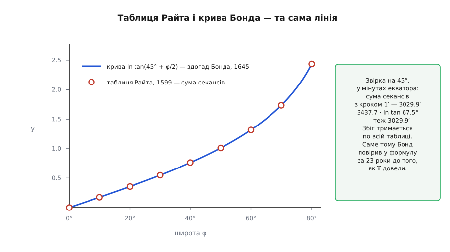
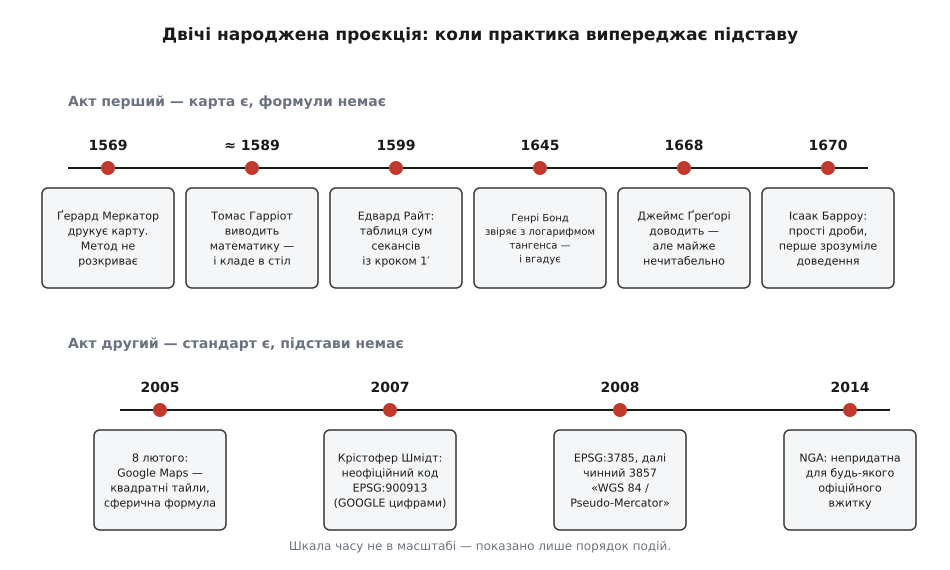

# 📜 Сто років між картою і формулою

Карта Меркатора почала возити кораблі 1569 року, а рівняння, за яким вона побудована, довели аж 1670-го — сто один рік штурмани користувалися інструментом, математичної підстави якого не мав ніхто в Європі. Це не курйоз на полях: та сама послідовність — спершу працює, потім хтось нарешті пояснює чому — повторилася з тією ж проєкцією вдруге, коли її взяв веб, і саме звідти ростуть дивацтва на кшталт коду `900913` та офіційної назви «Pseudo-Mercator».

## Фламандець, що не лишив викрійки

Ґерард Меркатор народився 5 березня 1512 року в Рупельмонде, графство Фландрія, під іменем Ґерард (де) Кремер; «Mercator» — латинізоване «крамар», звичайна для тодішнього вченого світу процедура з прізвищем. Помер 2 грудня 1594-го в Дуйсбурзі. Фламандець за походженням і мовою; підданство його змінювалося разом із політичною долею Нижніх Земель, тож звична етикетка «нідерландський картограф» — спрощення.

1569 року він видрукував велику карту світу на вісімнадцяти аркушах, розміром 202 × 124 см, із назвою, що сама пояснює задум: **«Nova et Aucta Orbis Terrae Descriptio ad Usum Navigantium Emendate Accommodata»** — «Новий і повніший опис земної кулі, належно пристосований для потреб мореплавців». Ключове слово — *ad usum navigantium*. Меркатор розв'язував не естетичну, а навігаційну задачу: зробити так, щоб курс сталого компасного напрямку — [локсодрома](topic:math-geometry/rhumb-line) — виходив на карті прямим відрізком, який можна прокласти лінійкою.

Щоб це сталося, паралелі на карті доводиться розсувати до полюса дедалі сильніше. Меркатор так і написав у легенді: відстані між паралелями зростають у міру наближення до полюса. Але **як саме** зростають — за яким законом він вирахував свої сходинки — не сказано **в жодній з його праць**. Це не забудькуватість, а стан справ: доказовий статус тут — «не зафіксовано». Дослідники припускають, що він скористався таблицями румбів португальця Педру Нунеша або й зовсім геометричною побудовою на глобусі та лінійці, але це **гіпотеза**, а не документ.

> 🔧 **Навіщо це.** Різниця між «маю таблицю» і «маю формулу» тут не академічна. З таблицею карту можна перемалювати лише в тих точках, які в ній є, і не можна ні продовжити її далі, ні згустити, ні перевірити чужу. З формулою карта стає обчислюваною — саме тому через триста років її змогли покласти в цикл, що ріже світ на тайли.

## Гарріот: виведено й покладено в стіл

Приблизно з 1589 року математику проєкції опрацьовував англієць Томас Гарріот (бл. 1560 — 2 липня 1621) — той самий, що першим у Європі спрямував телескоп на Місяць і залишив по собі гори записів. Він працював над сферичними задачами навігації, і в його паперах є те, що ми сьогодні звемо інтегралом секанса.

Гарріот не надрукував **нічого** з цього. Він узагалі за життя видав одну книжку — звіт про Віргінію, 1588 року. Решта лишилася в рукописах, які розібрали й оцінили щойно у XX столітті. Тож доказовий статус цього пункту особливий: пріоритет реальний, але **вплив нульовий** — жоден із наступних персонажів цієї історії про Гарріотів результат не знав і відштовхнутися від нього не міг. Дата «бл. 1589» походить із датування рукописів, а не з публікації, і в різних дослідників трохи гуляє.

## Райт: таблиця замість формули

Едвард Райт (1561–1615), англійський математик із Кембриджа, зробив 1599 року те, що виявилося практично важливішим за формулу. У книжці **«Certaine Errors in Navigation»** він надрукував першу точну таблицю **меридіональних частин** — тобто саме тих сходинок широти, які Меркатор побудував мовчки.

Метод був чесно чисельний. Райт міркував так: якщо горизонталь на широті φ розтягнено в 1/cos φ разів, то, щоб не поламати кути, стільки ж треба додати й по вертикалі на кожному малесенькому кроці широти. Отже, повна висота — це сума таких доданків від екватора до потрібної паралелі. Він узяв крок в одну кутову мінуту й склав секанси:

```
крок Δφ = 1′
y(φ) ≈ sec(0′)·Δφ + sec(1′)·Δφ + sec(2′)·Δφ + … + sec(φ)·Δφ

а якщо міряти y не в радіанах, а в мінутах екваторіальної дуги,
то Δφ = 1′ скорочується і лишається гола сума секансів:

M(φ) ≈ Σ sec(кожна мінута від 0 до φ)
```

Це — рімановa сума за три чверті століття до того, як з'явилося слово «інтеграл». Її точність вражає: коли таблицю Райта звірили з машинним обчисленням, найбільша розбіжність на карті склала 0.0099 мм. Друге видання 1610 року розрослося з шести сторінок до двадцяти трьох і давало значення з кроком у мінуту аж до 75° широти.

Доказовий статус цього кроку: **таблиця, а не формула**. Райт умів порахувати будь-яке потрібне число, але не міг записати y(φ) одним виразом — і не претендував на це.

## Бонд: здогад із двох таблиць

1645 року англійський учитель навігації Генрі Бонд (бл. 1600–1678) зробив хід, який неможливо назвати виведенням, — і при цьому саме він зрушив справу з місця. Бонд поклав поруч дві таблиці, зроблені для зовсім різних потреб: таблицю меридіональних частин Райта і таблицю [логарифмів](topic:math-analysis/logarithms) тангенса, яку рахували для тригонометричних викладок. І побачив, що це **ті самі числа**.

Звідси й народилася гіпотеза:

```
y(φ) = ln tan(45° + φ/2)
```

Перевірити збіг можна й зараз, на 45°, у мінутах екваторіальної дуги:

```
сума секансів із кроком 1′ від 0° до 45° . . . . . 3029.9′
ln tan(45° + 45°/2) = ln tan 67.5° = 0.8813736 рад
0.8813736 · (180·60/π) = 0.8813736 · 3437.7468 = 3029.9′
```



*Те, що побачив Бонд. Крива — формула, кружечки — таблиця, порахована зовсім іншим способом і на півстоліття раніше. Збіг тримається на всій довжині, і саме він переконав сучасників, що формула правильна, задовго до будь-якого доведення.*

Доказовий статус: **здогад із чисельного збігу**. Бонд не мав ані доведення, ані навіть ідеї, звідки логарифм узявся в задачі про секанси. Він мав рівність, яка не хибила в жодному розряді, — і цього виявилося досить, щоб їй повірили й нею користувалися.

## Чому це була відкрита задача

Наступні двадцять три роки формулу Бонда ніхто не міг ані довести, ані спростувати. Історики математики називають її однією з визначних відкритих задач середини XVII століття; Ісаак Ньютон знав про неї щонайпізніше 1665 року.

Причина складності проста, якщо згадати, чого тоді ще не було. [Інтеграла](topic:math-analysis/integral) як операції, оберненої до похідної, не існувало — Ньютон і Ляйбніц напишуть це за десятиліття. Не було й звички бачити логарифм як первісну: зв'язок логарифма з площею під гіперболою щойно почали розуміти. Тобто питання «чому сума секансів дорівнює логарифму тангенса» ставилося мовою, у якій ще не було жодного зі слів, потрібних для відповіді.

Побічна деталь, що плутає читача таблиць і досі: серед головних дійових осіб логарифмічної теорії тих років був **Ніколас Меркатор** (Ніклаус Кауфман, бл. 1620 — 1687), уродженець Ойтіна, автор «Logarithmotechnia» 1668 року. До фламандського картографа він не має жодного стосунку — просто обидва латинізували своє прізвище, а «крамар» німецькою і фламандською виглядає однаково.

## Ґреґорі і Барроу: нарешті доведення

1668 року шотландець Джеймс Ґреґорі (1638–1675) опублікував у «Exercitationes Geometricae» розв'язання гіпотези Бонда й одразу застосував його до навігаційних таблиць. Доведення було справжнє, але настільки важке для читання, що навіть сучасники бралися за нього неохоче.

За два роки, 1670-го, Ісаак Барроу в «Lectiones Geometricae» дав перше **зрозуміле** доведення. І зробив він це прийомом, який ми зараз проходимо на першому курсі, — розкладом на прості дроби. Історики фіксують цей епізод як **найраніше засвідчене застосування простих дробів до інтегрування**; Барроу викладав його ще геометричною мовою свого часу, але кістяк упізнаваний:

```
sec φ = 1/cos φ = cos φ / (1 − sin²φ)

підстановка u = sin φ, du = cos φ·dφ:

∫ sec φ dφ = ∫ du/(1 − u²)

розклад на прості дроби — той самий крок Барроу:
1/(1 − u²) = ½·[ 1/(1 − u) + 1/(1 + u) ]

∫ du/(1 − u²) = ½·ln( (1 + u)/(1 − u) ) = ½·ln( (1 + sin φ)/(1 − sin φ) )
```

Звірка на 45°, щоб було видно, що це справді формула Бонда:

```
sin 45° = 0.7071068
(1 + 0.7071068)/(1 − 0.7071068) = 1.7071068/0.2928932 = 5.8284271
½·ln 5.8284271 = ½·1.7627472 = 0.8813736

ln tan 67.5° = 0.8813736     ✓
```

На цьому перший акт закінчено: **ідея** 1569 року, **таблиця** 1599-го, **гіпотеза** 1645-го, **доведення** 1668 і 1670 років. Кожна ланка має своє авторство, і жодна з них не є «винаходом проєкції» цілком.

## Акт другий: 8 лютого 2005

Далі проєкція три століття спокійно жила в морському й топографічному ремеслі, поки 8 лютого 2005 року Google не оголосив у своєму блозі запуск Google Maps. Карта в браузері вимагала схеми, у якій світ ріжеться на квадратні картинки-тайли, а рівні збільшення відрізняються рівно вдвічі, — і Меркатор для цього підходив ідеально: він конформний, тож масштабування тайла збігається зі справжнім переходом між рівнями, а не спотворює форму.

Але разом із проєкцією в схему заклали **скорочення**. Широту й довготу приймач супутникової навігації видає на еліпсоїді WGS-84, а формула, яку взяли, — сферична. Строга еліпсоїдальна вимагає ще одного множника й обчислюється помітно дорожче; для картинки на екрані різниця здавалася неважливою, а мільйони тайлів рахувати треба було вже вчора. Гібрид «координати з еліпсоїда, формула зі сфери» зайняв своє місце мовчки, без специфікації й без імені.

## Код, у якого не було органу

Ім'я знадобилося, щойно з тими самими тайлами схотіли працювати сторонні програми: будь-яка ГІС питає, в якій системі координат дані. Офіційного коду в реєстрі EPSG не було, і 2007 року Крістофер Шмідт, розробник бібліотеки OpenLayers, у своєму блозі просто оголосив код **`EPSG:900913`** — це слово GOOGLE, записане цифрами. Код зашили в OpenLayers 2, звідки він розійшовся по всьому вебу; формально це означало, що авторитетом, який видає ідентифікатори систем координат, на якийсь час стала клієнтська JavaScript-бібліотека.

Реєстр наздогнав практику 2008 року: спершу з'явився код **3785** із назвою «Popular Visualisation CRS / Mercator» і прямим застереженням, що це не офіційна геодезична система, а невдовзі — чинний і донині **`EPSG:3857`**, «WGS 84 / Pseudo-Mercator». Назва тут — не жарт і не зневага: приставка *pseudo* точно фіксує зміст гібрида. Це Меркатор, у якого еліпсоїдальні широти підставлені у сферичні формули, тобто **не** еліпсоїдальний Меркатор і **не** сферичний, а третє.

## 2014: NGA каже «ні»

Розв'язка настала в лютому 2014 року. Американське Національне агентство геопросторової розвідки (NGA) видало застереження, у якому назвало цю проєкцію **непридатною для будь-якого офіційного вжитку**, вказавши, що похибка перерахунку сягає **до 40 км на місцевості**.

Тут варто бути точним, бо застереження часто переказують неправильно. Пікселі Google Maps не «зсунуті на 40 км» — картинка внутрішньо узгоджена, і об'єкт на ній стоїть там, де треба. Небезпечним є **тлумачення**: якщо взяти координати з такої карти й обробити їх як координати справжнього еліпсоїдального Меркатора, широта поїде по землі на десятки кілометрів. Для перегляду це байдуже, для цілевказання — ні.



*Два акти поруч. В обох спершу з'являється робоча річ, а вже потім — підстава під неї: у першому акті сто один рік між картою й доведенням, у другому — три роки між де-факто стандартом і офіційним кодом, і ще шість — до документа, який чесно назвав межі його застосовності.*

## Що з цього лишається

Обидва акти зроблені за однією схемою, і схема ця не про недбалість. Райт не зміг би дочекатися Барроу — кораблі ходили щодня, і таблиця, яка працює без пояснення, була кращою за відсутність таблиці. Google не міг зупинити запуск заради строгої еліпсоїдальної формули, бо задача була показати картинку, а не звести координати. Практика законно біжить попереду підстави.

Ціну цього платить не той, хто біг. Її платить наступний — той, хто через сто років доводить формулу, або через дев'ять читає застереження NGA і з'ясовує, що система координат, у якій він отримав дані, названа «псевдо» цілком заслужено. Тому в цій історії важлива не жодна окрема дата, а звичка питати про кожен зручний інструмент: він працює тому, що правильний, чи просто тому, що досі ніхто не поставив його в умови, де різниця видна.

**Доказовий статус наведеного.** Дати, назви праць і авторства першого акту спираються на опубліковані праці й усталену історіографію інтеграла секанса; «бл. 1589» для Гарріота — датування рукописів, а не публікації, і воно приблизне. Спосіб побудови карти 1569 року — не задокументований, усі версії про Нунеша чи графічну побудову є гіпотезами. Дати другого акту — блог-оголошення Google, блог Шмідта та записи реєстру EPSG; рік появи 3857 у різних переказах подають то 2008-м, то 2009-м, розбіжність стосується моменту оприлюднення запису, а не самого коду.
