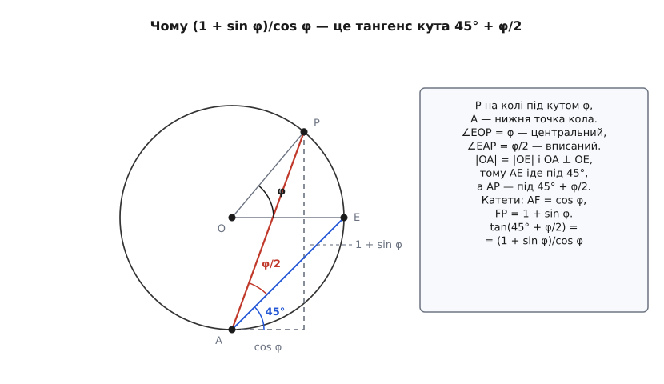
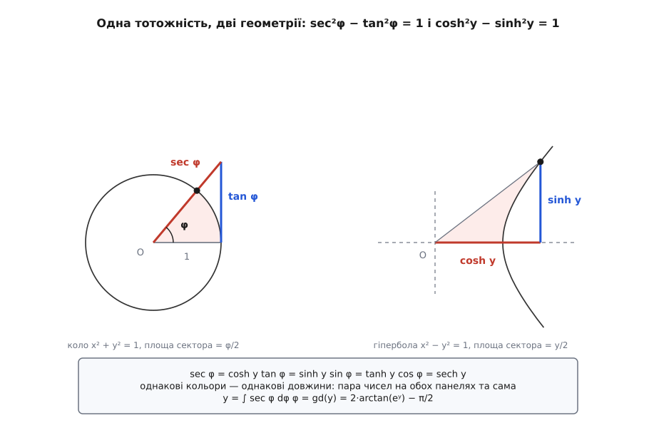

# 🧮 Інтеграл секанса: три обличчя однієї первісної

Рівняння карти Меркатора записується за півсекунди — `dy/dφ = sec φ`, — а його розв'язок `ln tan(π/4 + φ/2)` не схожий ні на що: у ньому нізвідки взявся логарифм, нізвідки півкут і зсув на 45°, і поруч ходять іще два записи тієї самої функції, `asinh(tan φ)` і `atanh(sin φ)`. Нижче ця первісна береться двома незалежними шляхами, доводиться, що всі три записи — одна й та сама функція, будується обернена до неї, і вже з неї виводяться широта зрізу 85.0511287798°, коефіцієнти розтягнення `sec φ` та `sec²φ` і еліпсоїдальна поправка.

## Чому підстановка в лоб не бере

```text
∫ sec φ dφ = ∫ dφ/cos φ
```

Природна спроба — підставити u = cos φ. Тоді du = −sin φ dφ, і щоб нею скористатися, у чисельнику мав би стояти sin φ; його там немає. Дзеркальна спроба u = sin φ дає du = cos φ dφ — знову не те, що лежить під інтегралом. Інтегрування частинами теж не рятує:

```text
∫ sec φ dφ = φ·sec φ − ∫ φ·sec φ·tan φ dφ
```

праворуч вийшов інтеграл, складніший за той, з якого починали.

Підказку дає сама відповідь. Логарифм народжується рівно з одного вигляду:

```text
∫ (f′/f) dφ = ln|f| + C
```

Отже, уся задача зводиться до одного питання: чи існує функція f, у якої f′ = sec φ · f? Знайти таку f можна двома способами, і кожен дає свій запис відповіді.

## Шлях перший: пара, що замикається сама на себе

Подивімося, чиї похідні взагалі містять множник sec φ:

```text
(tan φ)′ = sec²φ        = sec φ · sec φ
(sec φ)′ = sec φ·tan φ  = sec φ · tan φ
```

Похідна тангенса дає секанс, похідна секанса дає тангенс — ці двоє замикаються одне на одного. Тому їхня сума відтворює саму себе:

```text
(sec φ + tan φ)′ = sec φ·tan φ + sec²φ = sec φ·(sec φ + tan φ)
```

Це рівно те, що шукали: f = sec φ + tan φ задовольняє f′ = sec φ · f. Звідси

```text
sec φ = (sec φ + tan φ)′ / (sec φ + tan φ)

∫ sec φ dφ = ln|sec φ + tan φ| + C
```

Той самий крок зазвичай подають як домноження на одиницю у вигляді `(sec φ + tan φ)/(sec φ + tan φ)`:

```text
sec φ · (sec φ + tan φ)/(sec φ + tan φ) = (sec²φ + sec φ·tan φ)/(sec φ + tan φ)
```

у чисельнику опинилася похідна знаменника, і далі все зводиться до попереднього рядка. Виглядає як витягнутий із рукава кролик, але кролика немає: множник добирали не навмання, а з умови «похідна пропорційна самій функції з коефіцієнтом sec φ», і саме замкненість пари (sec, tan) робить таку комбінацію можливою.

Різниця цієї пари працює так само, лише зі знаком мінус: `(sec φ − tan φ)′ = −sec φ·(sec φ − tan φ)`, звідки другий запис первісної, `−ln|sec φ − tan φ|`. Це не інша відповідь, а та сама, і причина варта окремого рядка, бо знадобиться далі:

```text
(sec φ + tan φ)·(sec φ − tan φ) = sec²φ − tan²φ = 1
```

Два вирази взаємно обернені, а логарифм оберненого — це той самий логарифм зі зміненим знаком.

Стала C для карти нульова: на екваторі sec 0 + tan 0 = 1, і ln 1 = 0, тобто початок координат сам сідає на екватор.

Проміжок `|φ| < 90°` тут не формальність, а робоча область: на ньому sec φ > 0 і sec φ + tan φ > 0 (навіть на −89°, де секанс і тангенс майже рівні за модулем: 57.2987 − 57.2900 = 0.0087), тож модуль під логарифмом можна прибрати назавжди.

## Шлях другий: підстановка й прості дроби

Другий шлях не потребує здогаду про вдалу комбінацію — лише підготовчого домноження на cos φ:

```text
1/cos φ = cos φ/cos²φ = cos φ/(1 − sin²φ)
```

Тепер підстановка u = sin φ, du = cos φ dφ лягає точно:

```text
∫ sec φ dφ = ∫ du/(1 − u²)
```

Знаменник розкладається на множники, а сам дріб — [на прості](topic:math-algebra/partial-fractions) (правильний дріб зі знаменником-добутком завжди розпадається на суму дробів із простішими знаменниками):

```text
1/(1 − u²) = 1/((1 − u)(1 + u)) = ½·1/(1 − u) + ½·1/(1 + u)
```

Перевірка займає рядок: ½·[(1 + u) + (1 − u)]/(1 − u²) = 1/(1 − u²). Кожен доданок інтегрується як логарифм, і в першому з'являється мінус, бо всередині стоїть (1 − u), похідна якого дорівнює −1:

```text
∫ du/(1 − u²) = ½·[−ln|1 − u| + ln|1 + u|] = ½·ln((1 + u)/(1 − u))
```

Ця півлогарифмічна конструкція має власне ім'я — ареатангенс, `atanh`, обернена до [гіперболічного тангенса](topic:math-geometry/hyperbolic-functions) (гіперболічні синус, косинус і тангенс складаються з eʸ та e⁻ʸ так само, як звичайні тригонометричні — з точок кола). Розкрутити її просто:

```text
w = atanh u  ⇔  u = tanh w = (e²ʷ − 1)/(e²ʷ + 1)
e²ʷ = (1 + u)/(1 − u)      ⇒      w = ½·ln((1 + u)/(1 − u))
```

тож другий шлях завершується так:

```text
∫ sec φ dφ = atanh(sin φ)
```

Дві дороги, дві відповіді, жодного спільного кроку. Отже, обидві відповіді мусять бути тією самою функцією.

## Три записи — одна функція

**Ареатангенс і логарифм секанса.** Позначмо s = sin φ і скористаймося тим, що (1 − s)(1 + s) = 1 − sin²φ = cos²φ:

```text
½·ln((1 + s)/(1 − s)) = ½·ln( (1 + s)² / ((1 − s)(1 + s)) )
                      = ½·ln( (1 + s)² / cos²φ )
                      = ln( (1 + sin φ)/cos φ )
                      = ln( sec φ + tan φ )
```

Перший і другий шляхи зійшлися.

**Ареасинус.** Спершу розкриємо `asinh` через логарифм. З x = sinh w = (eʷ − e⁻ʷ)/2 виходить квадратне рівняння на eʷ:

```text
e²ʷ − 2x·eʷ − 1 = 0      ⇒      eʷ = x + √(x² + 1)
asinh x = ln(x + √(x² + 1))
```

(корінь беремо додатний, бо eʷ > 0 завжди). Підставмо x = tan φ. На проміжку |φ| < 90° секанс додатний, тому

```text
√(tan²φ + 1) = √(sec²φ) = sec φ
asinh(tan φ) = ln(tan φ + sec φ)
```

— знову той самий вираз.

**Тангенс півкута.** Лишилося показати, що `(1 + sin φ)/cos φ = tan(45° + φ/2)`. Позначмо h = φ/2 і розпишемо чисельник та знаменник через h:

```text
1 + sin φ = cos²h + sin²h + 2·sin h·cos h = (cos h + sin h)²
cos φ     = cos²h − sin²h                 = (cos h + sin h)(cos h − sin h)
```

Спільний множник скорочується, а далі ділимо чисельник і знаменник на cos h:

```text
(1 + sin φ)/cos φ = (cos h + sin h)/(cos h − sin h) = (1 + tan h)/(1 − tan h)
```

Права частина — це формула тангенса суми, у якій tan 45° = 1:

```text
tan(45° + h) = (tan 45° + tan h)/(1 − tan 45°·tan h) = (1 + tan h)/(1 − tan h)
```

Отже `(1 + sin φ)/cos φ = tan(45° + φ/2)`, і третій запис первісної — той самий, що й перші два.

У цієї тотожності є геометричне доведення — без жодного тотожнісного перетворення. Візьмімо одиничне коло з центром O, його праву точку E (кут 0), точку P під кутом φ і нижню точку A (кут −90°). Центральний кут ∠EOP дорівнює φ, тож вписаний кут ∠EAP, що спирається на ту саму дугу EP, дорівнює φ/2. Радіуси OA і OE рівні й перпендикулярні, тому трикутник OAE рівнобедрений прямокутний і хорда AE іде під 45° до горизонталі — а хорда AP, отже, під кутом 45° + φ/2. Той самий кут можна взяти з прямокутного трикутника, добудованого на AP: горизонтальний катет від A до основи точки P дорівнює cos φ, вертикальний — 1 + sin φ, бо A лежить на одиницю нижче за центр. Тангенс кута — відношення катетів, і це рівно `(1 + sin φ)/cos φ`.


*Вписаний кут ∠EAP удвічі менший за центральний ∠EOP, а хорда AE стоїть під 45°, бо радіуси OA і OE рівні й перпендикулярні. Нахил хорди AP дорівнює 45° + φ/2, а порахувати цей нахил можна й по катетах: cos φ по горизонталі, 1 + sin φ по вертикалі.*

**Числова перевірка на широті Києва, φ = 50.4501°.**
```text
sin φ = 0.7710703   cos φ = 0.6367500   tan φ = 1.2109467   sec φ = 1.5704751

ln(sec φ + tan φ)       = ln 2.7814218        = 1.0229622
atanh(sin φ)            = atanh 0.7710703     = 1.0229622
asinh(tan φ)            = asinh 1.2109467     = 1.0229622
ln tan(45° + 25.22505°) = ln tan 70.22505°    = 1.0229622
```
Чотири різні на вигляд вирази — одне число до сьомого знака й далі.

## Обернена: функція Гудермана

Кожен із трьох записів обертається на місці, бо в кожному широта сидить під однією функцією:

```text
y = ln tan(45° + φ/2)  ⇒  tan(45° + φ/2) = eʸ  ⇒  φ = 2·arctan(eʸ) − π/2
y = atanh(sin φ)       ⇒  sin φ = tanh y       ⇒  φ = arcsin(tanh y)
y = asinh(tan φ)       ⇒  tan φ = sinh y       ⇒  φ = arctan(sinh y)
```

Три записи оберненої — рівно тому, що прямих було три записи однієї функції. Ця обернена має власне ім'я: **функція Гудермана**, gd(y). Її ввів у 1760-х швейцарський математик Йоганн Генріх Ламберт; ім'я їй дав 1862 року Артур Келі — на честь німецького математика Крістофа Гудермана, який у 1830-х розробляв саме такі функції (Гудерман, Theorie der Potenzial- oder cyklisch-hyperbolischen Functionen, 1833). Тобто автор функції й людина, чиїм іменем її звуть, — різні особи: Келі давав назву не як вказівку на першовідкривача, а як шану за розробку цього кола функцій.

Її похідна береться із загального правила для оберненої функції й лягає симетрично до прямої:

```text
dφ/dy = 1/(dy/dφ) = 1/sec φ = cos φ = sech y
```

тобто gd′(y) = sech y — гіперболічний секанс там, де в прямому напрямку стояв звичайний.

А тепер найцікавіше — чому в цій задачі взагалі з'явилися гіперболічні функції. Первісна дала `eʸ = sec φ + tan φ`, а тотожність `sec²φ − tan²φ = 1` каже, що `sec φ − tan φ` — обернене до нього, тобто `e⁻ʸ`. Дві експоненти в руках — і словник складається сам:

```text
cosh y = (eʸ + e⁻ʸ)/2 = sec φ
sinh y = (eʸ − e⁻ʸ)/2 = tan φ
tanh y = sinh y/cosh y = tan φ/sec φ = sin φ
sech y = 1/cosh y = cos φ
```

Корінь усього — одна тотожність, записана двома почерками:

```text
sec²φ − tan²φ = 1        ⇄        cosh²y − sinh²y = 1
```

Пара (sec φ, tan φ) і пара (cosh y, sinh y) лежать на одній і тій самій гіперболі x² − y² = 1. Широта φ і вертикальна координата карти y — просто два способи параметризувати ту саму точку цієї гіперболи, а функція Гудермана й є перекладачем між параметрами.


*На колі секанс — це гіпотенуза, а тангенс — дотичний відрізок; на гіперболі це просто координати точки. Довжини збігаються не випадково: sec²φ − tan²φ = 1 і cosh²y − sinh²y = 1 — одна тотожність. Площа сектора на колі дорівнює φ/2, на гіперболі y/2; функція Гудермана переводить один параметр в інший, але не зберігає площу — φ і y різні числа.*

> 🔧 **Навіщо це.** Рівність `sec φ = cosh y` означає, що коефіцієнт розтягнення карти читається просто з вертикальної координати, без повернення до широти. Для точки з нормалізованою тайловою координатою yₙ маємо y = (0.5 − yₙ)·2π, і масштаб у цій точці дорівнює cosh y. Для Києва yₙ = 0.3371905 дає y = 1.0229622 і cosh y = 1.5704751 — точно секанс широти 50.4501°. Тобто клієнт карти може порахувати, скільки метрів у пікселі, з номера рядка тайла, не викликаючи ані арктангенса, ані арксинуса.

## Широта, на якій карту обрізають

Квадратність карти й задає точку обриву. По горизонталі довгота пробігає повне коло, тобто x ∈ [−π, π] в одиницях радіуса Землі, і ширина карти дорівнює 2π. Щоб висота зрівнялася з шириною, y мусить пробігати той самий діапазон, і зріз стоїть там, де y доростає до π:

```text
tan(45° + φ/2) = e^π = 23.140692632779
φ = 2·arctan(23.140692632779) − π/2 = 85.0511287798°
```

Дві інші форми дають те саме число іншими дорогами:

```text
sin φ = tanh π = 0.99627207622075   ⇒   φ = arcsin(0.99627207622075)
tan φ = sinh π = 11.548739357        ⇒   φ = arctan(11.548739357)
```

Синус широти зрізу — це просто `tanh π`, а її секанс — `cosh π`. Звідси одразу читається, чого коштує край карти:

```text
sec φ_зріз  = cosh π  = 11.5919533      довжини роздуто в 11.6 раза
sec²φ_зріз  = cosh²π  = 134.3733807     площі роздуто в 134 рази
```

## Звідки беруться sec φ і sec²φ

Візьмімо сферу радіуса R і карту `x = R·λ`, `y = R·ln tan(45° + φ/2)`. Масштабний коефіцієнт — це відношення довжини на карті до відповідної довжини на землі, порахованої в тій самій точці.

Уздовж паралелі приріст довготи dλ дає на землі дугу довжиною R·cos φ·dλ (радіус паралелі менший за радіус кулі рівно в cos φ разів), а на карті — відрізок dx = R·dλ:

```text
h_паралель = (R·dλ) / (R·cos φ·dλ) = 1/cos φ = sec φ
```

Уздовж меридіана приріст широти dφ дає на землі дугу R·dφ, а на карті — dy = R·sec φ·dφ, бо саме таке рівняння ми розв'язували:

```text
h_меридіан = (R·sec φ·dφ) / (R·dφ) = sec φ
```

Обидва коефіцієнти однакові — і ця рівність і є [конформність](topic:math-analysis/conformal-map) (відображення, що в кожній точці збільшує однаково в усі боки й тому зберігає кути). Саме з вимоги `h_меридіан = h_паралель` рівняння `dy/dφ = sec φ` і виводиться; тут ми проходимо той самий крок навспак, як перевірку.

Площа розтягується у добуток двох лінійних коефіцієнтів. Формально: відображення (λ, φ) → (x, y) має діагональну матрицю Якобі diag(R, R·sec φ) з визначником R²·sec φ, а елемент площі на сфері дорівнює R²·cos φ·dλ·dφ:

```text
S_карти/S_землі = (R²·sec φ) / (R²·cos φ) = sec²φ
```

```text
φ = 60°:        sec²φ = 4
φ = 85.0511°:   sec²φ = 134.37
```

## Еліпсоїдальний доданок

На еліпсоїді «радіус» перестає бути одним числом: кривина поверхні вздовж меридіана й упоперек нього різна, і замість R доводиться тримати [два радіуси кривини](topic:math-geometry/wgs84-datum) — меридіанний M і радіус першого вертикала N (перший описує вигин меридіанного перерізу, другий відкладається по нормалі до поверхні аж до осі обертання):

```text
M(φ) = a·(1 − e²)/(1 − e²·sin²φ)^1.5
N(φ) = a/√(1 − e²·sin²φ)
```

Радіус паралелі на еліпсоїді дорівнює N(φ)·cos φ. Умова конформності лишається тією самою — вертикальний масштаб дорівнює горизонтальному, — тільки тепер вона дає інше диференціальне рівняння:

```text
dy/dφ = M(φ)/(N(φ)·cos φ)
      = [a(1 − e²)/(1 − e²sin²φ)^1.5] · [√(1 − e²sin²φ)/(a·cos φ)]
      = (1 − e²)/[(1 − e²·sin²φ)·cos φ]
```

Твердження таке: первісна цього виразу — сферична формула плюс один доданок:

```text
y/a = ln tan(45° + φ/2) + (e/2)·ln((1 − e·sin φ)/(1 + e·sin φ))
```

Перевіряється це диференціюванням, і перевірка є повноцінним доведенням. Похідна доданка:

```text
d/dφ [ (e/2)·ln(1 − e·sin φ) − (e/2)·ln(1 + e·sin φ) ]
  = (e/2)·[ −e·cos φ/(1 − e·sin φ) − e·cos φ/(1 + e·sin φ) ]
  = −(e²·cos φ/2)·[ (1 + e·sin φ) + (1 − e·sin φ) ]/(1 − e²·sin²φ)
  = −e²·cos φ/(1 − e²·sin²φ)
```

Додаємо похідну першого доданка, яка дорівнює sec φ, і зводимо все до спільного знаменника:

```text
sec φ − e²·cos φ/(1 − e²·sin²φ)
  = [ (1 − e²·sin²φ) − e²·cos²φ ] / [ cos φ·(1 − e²·sin²φ) ]
  = [ 1 − e²·(sin²φ + cos²φ) ] / [ cos φ·(1 − e²·sin²φ) ]
  = (1 − e²) / [ cos φ·(1 − e²·sin²φ) ]
```

Рядок у рядок збіглося з умовою конформності — первісну знайдено правильно.

Той доданок — теж ареатангенс, лише від іншого аргументу:

```text
(e/2)·ln((1 − e·sin φ)/(1 + e·sin φ)) = −e·atanh(e·sin φ)
```

тож уся еліпсоїдальна формула стискається у два однакові на вигляд члени, з яких другий — точна поправка на сплюснутість:

```text
y/a = atanh(sin φ) − e·atanh(e·sin φ)
```

Web Mercator другий член просто викидає. Для WGS-84 (e² = 0.00669437999014, e = 0.0818191908) ця відкинута частина коштує так:

```text
φ = 45°:        e·atanh(e·sin φ) = 0.0047389   →  ·a = 30.23 км карти
φ = 85.0511°:                      0.0066843   →  ·a = 42.63 км
φ → 90°:                           0.0067094   →  ·a = 42.79 км (насичення)
```

Це відстані в координатах карти, а не зсув точки на місцевості: біля зрізу один кілометр карти відповідає дедалі меншому шматку землі. На 45° розбіжність у 30.2 км карти — це 21.4 км по поверхні, а на широті зрізу 42.6 км карти дають уже лише 3.7 км по землі.

## Наскільки Web Mercator насправді не конформний

Web Mercator бере `x = a·λ`, `y = a·ln tan(45° + φ/2)`, але підставляє в цю сферичну формулу **геодезичну** широту еліпсоїда. Тому чисельники масштабів у нього сферичні, а знаменники — еліпсоїдальні:

```text
k_паралель = (a·dλ)/(N·cos φ·dλ)     = √(1 − e²·sin²φ)/cos φ
k_меридіан = (a·sec φ·dφ)/(M·dφ)     = sec φ·(1 − e²·sin²φ)^1.5/(1 − e²)
```

Конформність вимагала б їхньої рівності. Поділімо одне на одне — sec φ і cos φ скорочуються, від кореня лишається перший степінь:

```text
k_меридіан/k_паралель = (1 − e²·sin²φ)/(1 − e²)
```

```text
φ = 0°:          1.0067395    різниця 0.674 %
φ = 30°:         1.0050546              0.505 %
φ = 45°:         1.0033697              0.337 %
φ = 60°:         1.0016849              0.168 %
φ = 85.0511°:    1.0000502              0.005 %
```

Тут ховається неочікуване. Найбільше Web Mercator ламає форму **на екваторі**, а не біля зрізу: чисельник (1 − e²·sin²φ) спадає з широтою й поступово наздоганяє сталий знаменник (1 − e²), а зрівнюється з ним рівно тоді, коли sin²φ = 1, тобто аж на полюсі. Кружечок похибки на екваторі — це еліпс, півосі якого різняться на 0.674 %, а на широті зрізу — уже майже точне коло.

Дві ціни спрощення розкладені по широті протилежно, і саме тому їх легко переплутати. На екваторі координата збігається з еліпсоїдальною точно, зате форма спотворена найдужче; біля зрізу форма майже ідеальна, зате координата розходиться на 42.6 км. Перша похибка не варта уваги: для кола радіусом сто пікселів 0.674 % — це дві третини пікселя різниці між півосями. Друга не має до вигляду картинки жодного стосунку й прокидається лише тоді, коли цю картинку приймають за геодезичну систему координат.
