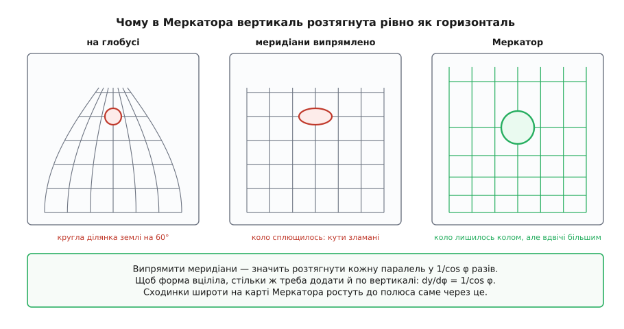
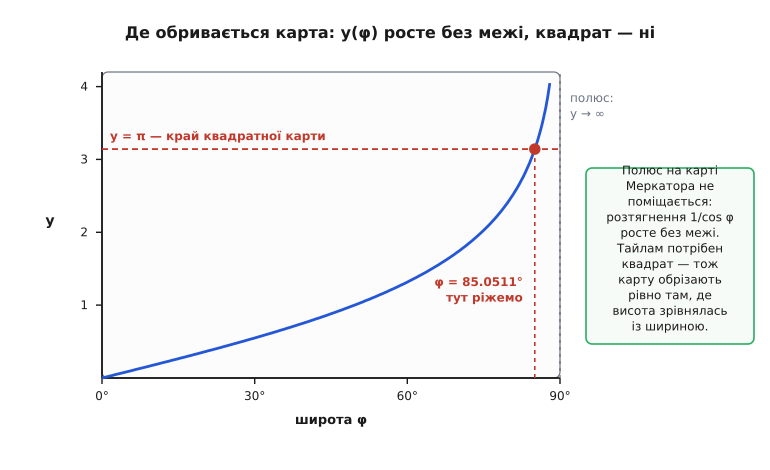
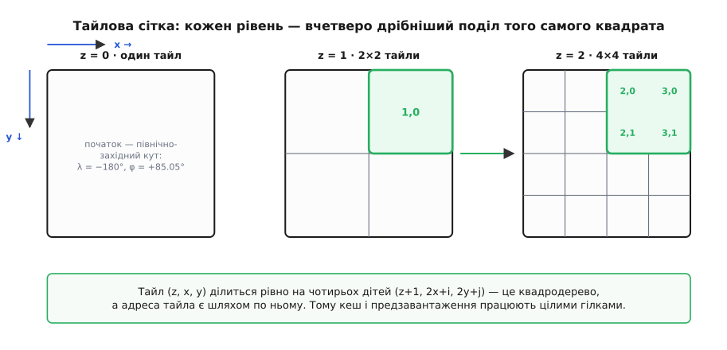
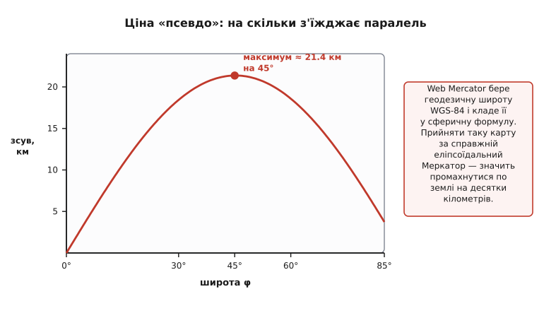

# Web Mercator і тайлова сітка

<preknowlist>
- [Синус і косинус](root:math-geometry/sine-cosine) — cos φ як стиснення паралелі до полюса; звідси весь коефіцієнт розтягнення.
- [Логарифми](root:math-analysis/logarithms) — натуральний логарифм і його обернена, експонента; у формулі карти логарифм стоїть на чільному місці.
- [Похідна](root:math-analysis/derivative) — швидкість зміни величини; масштаб карти є похідною координати по широті.
- [Інтеграл](root:math-analysis/integral) — накопичення нескінченно малих кроків; координату по вертикалі доводиться саме накопичувати.
- [Картографічні проєкції та їхні спотворення](root:math-geometry/map-projections) — будь-яке розгортання кулі на площину щось ламає; треба знати, що вибір проєкції — це вибір, чим пожертвувати.
- [WGS-84: еліпсоїд і датум](root:math-geometry/wgs84-datum) — широта й довгота задані на еліпсоїді обертання, а не на кулі; ця різниця тут стане головною пасткою.
</preknowlist>

Спробуй уявити файл, який містив би карту світу в тій дрібності, з якою її показує браузер на найглибшому зумі. На тому рівні один піксель накриває близько тридцяти сантиметрів землі, тож по стороні карти вкладається 134 217 728 пікселів, а всього їх виходить 1.8·10¹⁶ — вісімнадцять мільйонів мільярдів. Такий файл не існує й не може існувати: його не зберегти, не переслати, не відкрити. А карта в браузері працює.

Працює вона тому, що замість одного зображення сервер тримає мільярди однакових квадратиків і віддає лише ті кілька десятків, що зараз потрапили у вікно. І щойно ми погоджуємося різати карту на квадратики, геометрія починає диктувати свої умови — аж до того, що з усіх проєкцій світу лишається одна-єдина, а карта Землі обривається на широті 85.0511287798°, числі, яке з першого погляду скидається на друкарську помилку. Розберемо цей ланцюг від початку: чому квадратики, яку проєкцію вони змушують узяти, звідки береться її формула, звідки те дивне число, і яку ціну за все це платять.

## Що тайли вимагають від карти

Нарізати карту на шматки — це ще не рішення, а лише напрямок. Шматки треба різати так, щоб ними було зручно користуватися, і кожна зручність накладає на нарізку умову.

**Умова перша: усі шматки однакового розміру в пікселях.** Браузер, отримавши шматок, мусить знати, куди його класти, не заглядаючи всередину. Якщо всі шматки — квадрати по 256 пікселів, то місце кожного на екрані рахується двома множеннями. Якби розміри плавали, довелося б тримати таблицю розмірів і звірятися з нею перед кожним малюванням. Заразом однаковий розмір робить однорідним кеш: кожен шматок коштує приблизно однаково, і місце під сховище рахується множенням.

**Умова друга: рівні детальності мусять бути вкладені один в одного.** Крутячи колесо, ти переходиш із грубшого рівня на дрібніший. Перехід дешевий лише тоді, коли грубий шматок накриває **цілу кількість** дрібних: тоді карта на секунду розтягує вже наявний грубий шматок, а на його місце потихеньку приїжджають дрібні. Якщо ж межі рівнів не збігаються, кожен дрібний шматок сидить на стику чотирьох грубих, і замість підміни доводиться перемальовувати всі.

Найпростіший поділ, що задовольняє обидві умови разом, — **квадрат, розрізаний на чотири однакові квадрати**. Кожен із них ріжеться так само далі. Рівень поділу заведено звати **масштабом** (англ. *zoom*) і позначати `z`: на рівні `z` уся карта поділена на 2ᶻ × 2ᶻ квадратів. Такий квадрат і є **тайл** (англ. *tile* — «плитка»), а сама сітка — тайлова.

**Умова третя: адреса шматка рахується з координати, без пошуку.** Клієнт, знаючи широту й довготу кутів вікна, мусить сам сказати, які саме тайли йому потрібні, і скласти адресу — без звертання до якогось каталогу на сервері. Це означає, що номер тайла по горизонталі має залежати **тільки від довготи**, а номер по вертикалі — **тільки від широти**. Дві незалежні одновимірні формули, а не система рівнянь.

І ось тут нарізка перестає бути питанням про картинку й стає питанням про геометрію. Щоб уся карта світу була одним квадратом, який ділиться на чотири, проєкція мусить видавати **квадрат**. Щоб номер по горизонталі залежав лише від довготи, а по вертикалі лише від широти, меридіани на карті мусять бути **вертикальними прямими**, а паралелі — **горизонтальними**. Це вже дуже вузький клас проєкцій: розгортка на циліндр із прямокутною сіткою. Лишилася одна річ, яку ми ще не зажадали, — і саме вона доб'є вибір до єдиної відповіді.

## Чому карта мусить зберігати кути

Розтягнути карту по вертикалі можна як завгодно — сітка від цього не перестане бути прямокутною. То за яким правилом розставити паралелі?

Подивімося, що ми вже накоїли, випрямивши меридіани. На кулі меридіани сходяться до полюсів, і паралель на широті φ — коло радіусом R·cos φ, тобто коротше за екватор рівно в cos φ разів. На карті ж усі паралелі однакової довжини — на всю ширину полотна. Отже, паралель на широті φ **розтягнута в 1/cos φ разів**. Ця величина зветься **секанс** (лат. *secans* — «той, що січе») і позначається sec φ. На екваторі sec 0° = 1 (нічого не розтягнули), на широті 60° sec 60° = 2 (усе вдвічі ширше, ніж має бути), і далі — гірше.

Тепер уяви на карті кружечок — хоч би коло похибки супутникового приймача. Горизонтально його розтягнули вдвічі, вертикально не чіпали: круг став лежачим еліпсом. І це не косметика. Разом із формою ламаються **кути**: напрямок, який на місцевості йде рівно на північний схід, на такій карті виглядатиме положистішим, і наскільки — залежить від широти. Стрілка курсу, вектор вітру, сектор огляду камери — уся навігаційна графіка перестала б бути правдою й потребувала б поправки на кожен піксель.


*Кругла ділянка землі на широті 60°, проведена крізь три стани. На глобусі меридіани сходяться, ділянка кругла. Випрямили меридіани — паралель розтягнулася вдвічі, ділянка сплющилась у лежачий еліпс, кути зламані. Розсунули паралелі рівно на стільки ж — і ділянка знову кругла, лише вдвічі більша за справжню. Форма врятована ціною розміру.*

Ліки очевидні: якщо горизонталь розтягнули в sec φ разів, треба розтягнути на стільки ж і вертикаль. Тоді в кожній точці карта збільшує **однаково в усі боки** — фігура зростає, але не спотворюється, і кути лишаються тими самими, що на місцевості. Відображення з такою властивістю зветься [конформним](root:math-analysis/conformal-map) (лат. *conformis* — «однакової форми»): воно міняє розміри, але зберігає кути між напрямками в кожній точці.

Конформність тут не естетична забаганка, а те, без чого тайлова карта розсипається. Плавний зум між рівнями — це масштабування вже наявних тайлів, тобто множення на число; якщо карта роздуває широту й довготу по-різному, масштабування не збігається зі справжнім переходом і зображення «пливе». Кружечок точності мусить бути кружечком на будь-якій широті, інакше клієнт має рахувати еліпс під кожну точку. І сама проєкція народилася саме заради збереження кутів: на ній **лінія сталого курсу** — [локсодрома](root:math-geometry/rhumb-line) — виходить прямим відрізком, і штурман може прокласти курс лінійкою. Історію цього винаходу — від фламандського картографа до формули, яку сто років не могли вивести, — розгорнуто [окремо](root:math-geometry/web-mercator-tiles/hist-mercator-to-web.md).

> 🔧 **Навіщо це.** Конформність — причина, чому на карті в клієнті можна малювати геометрію в екранних пікселях і не думати про широту. Коло радіусом 50 метрів навколо апарата — це коло на екрані, а не еліпс; кут між двома променями на екрані дорівнює куту на місцевості; іконку можна повертати на курс без поправок. Щойно проєкцію змінили б на неконформну, кожен із цих елементів довелося б рахувати через зворотне перетворення в географічні координати й назад.

## Звідки береться формула

Вимога сформульована: розтягнення по вертикалі мусить дорівнювати розтягненню по горизонталі, а те дорівнює sec φ. Перетворимо це на формулу.

Хай `y` — вертикальна координата на карті, а карту зробимо в умовних одиницях, у яких радіус Землі дорівнює одиниці (справжній масштаб припасуємо потім). Тоді крок по землі вздовж меридіана на приріст широти dφ дорівнює просто dφ. Крок по карті — це dy. Відношення й є вертикальний масштабний коефіцієнт:

```text
k_вертикальний = dy/dφ
k_горизонтальний = sec φ = 1/cos φ
```

Прирівнюємо — і дістаємо диференціальне рівняння, у якому вже сидить уся проєкція:

```text
dy/dφ = 1/cos φ
```

Читається воно прозоро: **що далі на північ, то швидше карта тікає вгору**. Біля екватора один градус широти дає майже один умовний крок; на 60° — удвічі більший; на 85° — у 11.6 раза більший. Лишається накопичити ці кроки від екватора до широти φ, тобто взяти інтеграл:

```text
y(φ) = ∫₀^φ (1/cos t) dt = ln tan(π/4 + φ/2)
```

Праворуч стоїть логарифм тангенса півкута — саме те, що робить карту Меркатора саме такою. Обчислення цього інтеграла й дві його інші форми, `asinh(tan φ)` і `atanh(sin φ)`, розібрано [окремо](root:math-geometry/web-mercator-tiles/math-secant-integral.md): це той рідкісний випадок, коли первісна виглядає ні на що не схожою, хоч і виводиться в кілька рядків. Обидві альтернативні форми — [гіперболічні функції](root:math-geometry/hyperbolic-functions), і вони ж дають обернений хід, від `y` назад до широти:

```text
φ(y) = 2·arctan(eʸ) − π/2 = arcsin(tanh y)
```

Перевірмо формулу на кінцях. На екваторі y(0) = ln tan 45° = ln 1 = 0 — початок координат там, де й має бути. А коли φ прямує до 90°, тангенс півкута прямує до tan 90° і **вибухає**: y росте без межі. Це не збій виведення, а чесний висновок: полюс на карті Меркатора не поміщається взагалі. Він відсунутий на нескінченність, бо розтягнення sec φ у ньому нескінченне — точка перетворюється на цілу лінію завширшки з увесь екватор.

## Звідки береться 85.0511287798°

Нескінченна карта нам не годиться: тайли вимагали квадрата. Значить, карту треба обрізати — і от питання, де саме.

Порахуємо ширину. Довгота пробігає від −180° до +180°, і по горизонталі проєкція лінійна, тож в умовних одиницях x пробігає від −π до +π; ширина карти — 2π. Щоб карта була квадратом, висота теж мусить бути 2π, тобто `y` має пробігати від −π до +π. Отже, різати треба рівно там, де `y` доростає до π:

```text
ln tan(π/4 + φ/2) = π
tan(π/4 + φ/2)    = e^π = 23.14069
π/4 + φ/2         = arctan(23.14069)
φ                 = 2·arctan(e^π) − π/2 = 85.0511287798°
```

Ось і все пояснення того самого «дивного» числа. Це не округлення й не домовленість «десь біля вісімдесяти п'яти»: це **єдина широта, на якій висота карти зрівнюється з її шириною**. Усе, що північніше 85.0511287798° і південніше −85.0511287798°, з тайлової карти просто випадає — Північний Льодовитий океан обрізаний, Антарктида показана смужкою узбережжя. Полярні дослідники користуються іншими проєкціями; для карти в браузері така втрата виявилася прийнятною ціною за квадрат.


*Вертикальна координата Меркатора проти широти. Крива йде в нескінченність біля полюса — там розтягнення sec φ необмежене. Тайли ж вимагають квадрата, тобто висоти, що дорівнює ширині 2π. Горизонталь y = π перетинає криву рівно на 85.0511287798°, і це та широта, на якій карту обрізають.*

## Від квадрата до адреси тайла

Тепер квадрат є, і лишилося перевести географічні координати в номер тайла й піксель усередині нього. Робиться це за два кроки: спершу точка кладеться в квадрат зі стороною одиниця, потім квадрат ділиться на 2ᶻ частин.

Нормалізація по горизонталі очевидна — довгота лінійна:

```text
xₙ = (λ° + 180) / 360        ∈ [0, 1)
```

По вертикалі беремо `y` з формули Меркатора, ділимо на повний розмах 2π і зсуваємо так, щоб екватор потрапив у 0.5:

```text
yₙ = 0.5 − ln tan(π/4 + φ/2) / (2π)        ∈ [0, 1)
```

Мінус тут не випадковий: північ на карті вгорі, а рядки растрового зображення нумеруються **згори вниз**. Тому `yₙ = 0` — це верхній край, широта +85.0511°, а `yₙ = 1` — нижній. Початок координат тайлової сітки сидить у північно-західному куті.

Далі множимо на кількість тайлів на рівні й розділяємо ціле й дробове:

```text
n = 2ᶻ
X = ⌊xₙ · n⌋        номер тайла по горизонталі
Y = ⌊yₙ · n⌋        номер тайла по вертикалі
px = (xₙ·n − X)·256, py = (yₙ·n − Y)·256        піксель усередині тайла
```

**Київ на п'ятнадцятому рівні: φ = 50.4501°, λ = 30.5234°.**
```text
n   = 2¹⁵ = 32768
xₙ  = (30.5234 + 180) / 360        = 0.5847872
tan(45° + 50.4501°/2) = tan 70.22505° = 2.7814218
y   = ln 2.7814218                 = 1.0229622
yₙ  = 0.5 − 1.0229622 / (2π)       = 0.3371905

X   = ⌊0.5847872 · 32768⌋ = ⌊19162.31⌋ = 19162
Y   = ⌊0.3371905 · 32768⌋ = ⌊11049.06⌋ = 11049
px  = 0.31 · 256 ≈ 79,  py = 0.06 · 256 ≈ 15
```
Тобто центр Києва лежить у тайлі `15/19162/11049`, майже впритул до його верхнього краю.


*Той самий квадрат світу, поділений дедалі дрібніше. Номер x росте на схід від −180°, номер y — на південь від +85.05°, початок у північно-західному куті. Підсвічений тайл (1, 0) першого рівня накривається рівно чотирма тайлами другого — і так на кожному переході.*

Ця вкладеність має ім'я: тайлова сітка є **квадродеревом**, а трійка (z, x, y) — шляхом по ньому від кореня. Дитина тайла (z, x, y) — це чотири тайли (z+1, 2x+i, 2y+j) при i, j ∈ {0, 1}, і навпаки, батько знаходиться діленням номерів навпіл. Звідси ростуть речі, які самі по собі не мають стосунку до географії: [просторовий індекс](root:sf-algorithms/spatial-index) на квадродереві, а також лінійний ключ, у якому обидва номери переплетено по бітах — [крива Мортона](root:sf-algorithms/z-order-curve), відома в тайловому світі як **quadkey**. Як саме трійка (z, x, y) складається в адресу запиту й чому в схемі TMS номер `y` рахується знизу, а не згори, розібрано в [адресних схемах тайлових сервісів](root:sf-visual/tile-url-schemes).

> 🔧 **Навіщо це.** Клієнт карти щокадру робить рівно цю арифметику: бере прямокутник видимої області в градусах, проганяє два його кути крізь наведені формули, дістає діапазон номерів `X` і `Y` і будує з них список запитів. Той самий перерахунок працює навспак, коли треба показати позначку в потрібному місці екрана. А предзавантаження офлайн-карти — це обхід гілки квадродерева: обрати район на грубому рівні, спуститися до потрібного, скласти всі адреси. Практична сторона цього — у статті про [кеш тайлів](root:sf-visual/offline-tile-cache).

## Скільки землі в пікселі

Адреса тайла — це ще не масштаб. Щоб знати, скільки метрів накриває піксель, треба прив'язати умовні одиниці до Землі.

За радіус Web Mercator бере велику піввісь еліпсоїда WGS-84: a = 6 378 137 м. Довжина екватора виходить

```text
C = 2π · 6 378 137 = 40 075 016.686 м
```

На нульовому рівні весь екватор укладається в один тайл завширшки 256 пікселів, тож

```text
res(0) = 40 075 016.686 / 256 = 156 543.034 м на піксель
```

Кожен наступний рівень ділить це навпіл, бо тайлів удвічі більше по кожній осі:

```text
res(z) = 156 543.034 / 2ᶻ
```

Це число знати корисно напам'ять хоч би приблизно: на десятому рівні виходить близько 153 м/px, на п'ятнадцятому — 4.78 м/px, на дев'ятнадцятому — 0.30 м/px.

Тільки всі ці значення — **на екваторі**. Далі на північ той самий піксель накриває менше землі: карта ж розтягнута в sec φ разів, тож справжня роздільність множиться на cos φ:

```text
res(z, φ) = 156 543.034 · cos φ / 2ᶻ
```

**Роздільність на широті Києва, п'ятнадцятий рівень.**
```text
res(15)        = 156 543.034 / 32768 = 4.7773 м/px
cos 50.4501°   = 0.63678
res(15, 50.45) = 4.7773 · 0.63678 = 3.0420 м/px
```
Той самий тайл, що на екваторі накрив би 1223 метри, у Києві накриває 779.

Звідси два практичні наслідки. Масштабна лінійка на карті мусить перераховуватися при кожному зсуві по широті — інакше вона брехатиме тим сильніше, чим північніше дивишся. І однакова кількість тайлів вкриває дуже різну площу: щоб залити офлайн-кешем місто в Норвегії, тайлів треба помітно менше, ніж на таке саме за площею місто в Кенії.

Окремо варто знати про «метри Web Mercator». Система координат **EPSG:3857** віддає не нормалізовані одиниці, а ті самі умовні координати, помножені на a: x і y пробігають від −20 037 508.34 до +20 037 508.34, і ці числа звуть метрами. Метрами вони є **тільки на екваторі** — на широті φ один такий «метр» відповідає cos φ справжніх метрів на землі. Плутанина тут коштує дорого: обчислена в цих одиницях довжина маршруту в Скандинавії завищена вдвічі.

## Ціна: площа

Конформність урятувала кути, але за щось же треба платити. Платить площа. Якщо в кожній точці карта роздуває довжину в sec φ разів **в обидва боки**, то площу вона роздуває в sec²φ разів:

```text
φ = 60°:      sec²φ = 4
φ = 85°:      sec²φ ≈ 132
φ = 85.0511°: sec²φ ≈ 134
```

Ось звідки славнозвісна Гренландія завбільшки з Африку: Гренландія лежить між 60° і 83°, Африка сидить на екваторі, і карта роздуває першу в десятки разів, майже не чіпаючи другу. Насправді Африка більша за Гренландію приблизно в чотирнадцять разів.

Виправити це, не втративши кутів, неможливо. Проєкція кулі на площину не може одночасно зберігати кути й площі — це наслідок того, що куля й площина мають різну внутрішню кривину, і жодне розгортання не робить одну одною. Так що вибір «кути або площі» — не недогляд Меркатора, а розвилка, на якій стоїть уся картографія; чому вона неминуча, розібрано в [проєкціях та їхніх спотвореннях](root:math-geometry/map-projections).

## Головна пастка: чому воно «псевдо»

Досі йшлося про Меркатора на **кулі**. Але широта й довгота, які видає супутниковий приймач, задані не на кулі, а на **еліпсоїді** WGS-84 — сплюснутій фігурі, у якої полярна піввісь на 21 км коротша за екваторіальну. Строгий Меркатор для еліпсоїда існує, і формула в нього трохи довша:

```text
y = a · [ ln tan(π/4 + φ/2) + (e/2)·ln((1 − e·sin φ)/(1 + e·sin φ)) ]
```

де e ≈ 0.0818 — ексцентриситет еліпсоїда. Web Mercator цей другий доданок **просто викидає**: бере геодезичну широту з еліпсоїда й підставляє її у сферичну формулу, ніби Земля — куля радіусом a. Саме за цей підлог система й дістала офіційну назву **WGS 84 / Pseudo-Mercator** (лат. *pseudo* — «несправжній»).

Наслідків рівно два, і вони дуже різні за вагою.

**Перший наслідок — карта не строго конформна.** Раз широта еліпсоїдальна, а формула сферична, розтягнення вздовж меридіана й вздовж паралелі виходять трохи різні. Їхнє відношення дорівнює (1 − e²sin²φ)/(1 − e²): 1.0067 на екваторі, 1.0034 на 45°, майже рівно 1 біля зрізу. Тобто кружечок насправді трішки еліпс — на сім десятих відсотка в найгіршому місці. Око цього не бачить, і на практиці цим нехтують.

**Другий наслідок значно серйозніший: та сама широта дає інше місце на карті.** Порівняймо. Строга еліпсоїдальна формула й спрощена сферична для однієї й тієї самої точки видають різні `y`, і різниця росте від нуля на екваторі до 42.6 км біля зрізу. Якщо ту саму картинку хтось прийме за справжній еліпсоїдальний Меркатор і перерахує назад, він дістане **не ту широту**: паралель зсунеться на місцевості, і зсув сягає максимуму 21.4 км на 45°.


*На скільки з'їжджає паралель, якщо картинку Web Mercator прийняти за строгий еліпсоїдальний Меркатор. На екваторі різниці немає, на середніх широтах зсув доростає до 21.4 км, ближче до зрізу спадає — там кожен кілометр карти коштує дедалі менше землі. У самих координатах карти розбіжність ще більша й доходить до 42.6 км.*

Саме через це американське Національне агентство геопросторової розвідки (NGA) 2014 року видало окреме попередження: Web Mercator не годиться для завдань, де потрібна геодезична точність, а помилка визначення місця при змішуванні систем може сягати 40 кілометрів; Міністерство оборони США визнало проєкцію неприйнятною для офіційного використання. Це не помилка в реалізації — це те, чим за неї заплачено з самого початку.

Чому ж тоді її не виправили? Насамперед — заради швидкості. Обернене перетворення для еліпсоїда не має замкненого вигляду й розв'язується ітераціями; для карти, що перераховує тисячі точок на кадр, це було відчутно у 2005 році, коли схему запускали. Далі — карта в браузері й не претендувала на геодезію: вона для очей, а не для вимірювань. І врешті найсильніше: щойно за цією схемою нарізали перші мільярди тайлів, зміна формули означала б перерізати весь світ наново й розсинхронізувати всі наявні кеші. Узгодженість переважила точність.

Слід тієї історії лишився в самих кодах системи. Спершу спільнота відкритого картографування позначала проєкцію неофіційним номером **900913** — це слово GOOGLE, записане цифрами; потім EPSG видала офіційний код 3785 для сферичного варіанта, а 2008–2009 років — чинний **EPSG:3857** із назвою «WGS 84 / Pseudo-Mercator», що чесно фіксує гібрид: координати з еліпсоїда, формула зі сфери.

> 🔧 **Навіщо це.** Практичне правило коротке: **тайли — для показу, не для вимірювання**. Позначити точку на карті, намалювати маршрут, показати сектор — усе це в тайлових координатах законно й точно настільки, наскільки видно оком. А от порахувати довжину маршруту, площу ділянки чи буфер навколо точки в цих координатах — груба помилка: результат буде завищений у sec φ разів по довжині й у sec²φ по площі, і це на додачу до «псевдо»-зсуву. Відстані рахують по еліпсоїду — через [формулу гаверсинусів](root:math-geometry/great-circle-distance) для швидкої оцінки або строгі геодезичні розв'язки для точності; локальну геометрію — у [місцевій дотичній площині](root:math-geometry/local-tangent-plane), де метри є справжніми метрами.

## Код перетворення

Обидва напрямки перетворення вкладаються в кілька рядків. Нижче — пряме перетворення в дробові тайлові координати, з якого потім беруть цілу частину (номер тайла) і дробову (піксель); зворотний хід, обчислення списку тайлів під видиму область і типові пастки на кшталт переходу через 180-й меридіан винесено в [окрему добірку](root:math-geometry/web-mercator-tiles/proj-tile-coords.md).

:::tabs
```ts
const MAX_LAT = 85.0511287798;   // широта зрізу: там висота карти = ширині
const TILE = 256;                // сторона тайла в пікселях

interface TilePos { x: number; y: number; px: number; py: number; }

/** Географічні координати -> тайл рівня z і піксель усередині нього. */
function latLonToTile(latDeg: number, lonDeg: number, z: number): TilePos {
  const lat = Math.max(-MAX_LAT, Math.min(MAX_LAT, latDeg));  // зріз полярних шапок
  const phi = (lat * Math.PI) / 180;

  const xn = (lonDeg + 180) / 360;                            // довгота лінійна
  const ym = Math.log(Math.tan(Math.PI / 4 + phi / 2));       // інтеграл секанса
  const yn = 0.5 - ym / (2 * Math.PI);                        // мінус: північ угорі

  const n = 2 ** z;
  const fx = xn * n;
  const fy = yn * n;
  return {
    x: Math.floor(fx),
    y: Math.floor(fy),
    px: (fx - Math.floor(fx)) * TILE,
    py: (fy - Math.floor(fy)) * TILE,
  };
}

/** Скільки метрів землі в пікселі на цій широті й цьому рівні. */
function resolution(latDeg: number, z: number): number {
  const EQUATOR = 2 * Math.PI * 6378137;                      // 40 075 016.686 м
  return (EQUATOR * Math.cos((latDeg * Math.PI) / 180)) / (TILE * 2 ** z);
}
```
```cpp
#include <cmath>
#include <algorithm>

constexpr double MAX_LAT = 85.0511287798;   // широта зрізу: висота карти = ширині
constexpr int    TILE    = 256;             // сторона тайла в пікселях
constexpr double EQUATOR = 2.0 * M_PI * 6378137.0;   // 40 075 016.686 м

struct TilePos { int x, y; double px, py; };

// Географічні координати -> тайл рівня z і піксель усередині нього.
TilePos lat_lon_to_tile(double lat_deg, double lon_deg, int z) {
    const double lat = std::clamp(lat_deg, -MAX_LAT, MAX_LAT);  // зріз полярних шапок
    const double phi = lat * M_PI / 180.0;

    const double xn = (lon_deg + 180.0) / 360.0;                // довгота лінійна
    const double ym = std::log(std::tan(M_PI / 4.0 + phi / 2.0));  // інтеграл секанса
    const double yn = 0.5 - ym / (2.0 * M_PI);                  // мінус: північ угорі

    const double n  = std::ldexp(1.0, z);                       // 2^z без pow()
    const double fx = xn * n;
    const double fy = yn * n;
    const double ix = std::floor(fx);
    const double iy = std::floor(fy);
    return { static_cast<int>(ix), static_cast<int>(iy),
             (fx - ix) * TILE, (fy - iy) * TILE };
}

// Скільки метрів землі в пікселі на цій широті й цьому рівні.
double resolution(double lat_deg, int z) {
    return EQUATOR * std::cos(lat_deg * M_PI / 180.0) / (TILE * std::ldexp(1.0, z));
}
```
:::

Три рядки в цьому коді несуть усю попередню математику. `Math.log(Math.tan(...))` — це інтеграл секанса, тобто плата за збереження кутів. Зріз на `MAX_LAT` — це квадратність карти, без якої не було б квадродерева. А `cos` у роздільності — той самий sec φ, тільки навиворіт: карта розтягнула, дійсність стискає назад.

## Що з цього виходить

Уся конструкція виросла з однієї-єдиної вимоги: карту треба різати на однакові квадрати, вкладені один в одного. Квадрати змусили карту бути квадратом і мати прямокутну сітку; прямокутна сітка змусила випрямити меридіани; випрямлені меридіани розтягнули кожну паралель у sec φ разів; збереження форми змусило розтягнути на стільки ж і вертикаль; це дало рівняння dy/dφ = sec φ, а його розв'язок — логарифм тангенса півкута, який тікає в нескінченність біля полюса; нескінченність довелося обрізати рівно там, де висота зрівнялася з шириною, — на 85.0511287798°. І та сама sec φ, що народила формулу, повертається наприкінці двічі: як cos φ у справжній роздільності пікселя й як sec²φ у роздутій площі Гренландії.

А поверх усього цього лежить один свідомий підлог: у сферичну формулу підставили еліпсоїдальну широту, бо так швидше й бо мільярди вже нарізаних тайлів дорожчі за двадцять кілометрів точності. Тому карта в браузері — не геодезичний інструмент, а спосіб показати світ так, щоб кути на екрані не брехали, а квадратики приїжджали вчасно.
