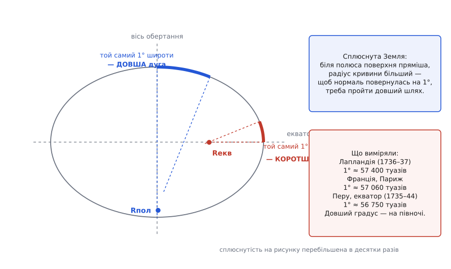

# 📜 Як дізналися, що Земля сплюснута

Двісті років між першою підозрою і надійним числом: як суперечка про те, чи роздутий екватор, чи навпаки витягнуті полюси, змусила французів везти квадранти в Лапландію й на екватор — і як із того самого питання виріс рід систем WGS, у якому сьогодні рахує кожен супутниковий приймач.

## Маятник, який відстав

Перший натяк прийшов не від геометрії, а від годинника. У 1672 році Жан Ріше (фр. Jean Richer), відряджений Паризькою академією до Каєнни у Французькій Гвіані — майже на екваторі, — виявив, що його маятниковий годинник, вивірений у Парижі, там відстає. Щоб повернути правильний хід, маятник довелося вкоротити.

Це дрібниця з погляду годинникаря і велика новина з погляду фізика. Період [маятника](topic:ph-waves/pendulum) залежить від прискорення вільного падіння: чим слабше тягне, тим повільніше він хитається. Годинник відстав — отже, **на екваторі тягне слабше, ніж у Парижі**. Земля перестала бути тілом з однаковою вагою всюди.

Пояснень напрошувалося два, і вони не виключали одне одного. Перше: обертання. Точка на екваторі описує за добу коло радіусом понад шість тисяч кілометрів, і частина тяжіння йде на те, щоб утримати речовину на цій траєкторії, а не притиснути її вниз — та сама [відцентрова частка](topic:ph-mechanics/centrifugal-force). Друге: якщо екватор роздутий, то поверхня там просто далі від центра мас, а сила спадає з відстанню. Обидва пояснення разом означали б, що Земля не куля.

## Ньютон рахує форму, не міряючи її

У «Математичних началах натуральної філософії» (лат. *Philosophiæ Naturalis Principia Mathematica*, 1687) Ісаак Ньютон зробив із цим те, чого до нього не робив ніхто: **вивів форму планети з механіки, не виміривши на ній жодної дуги**.

Хід міркування простий і саме тому переконливий. Уявімо Землю однорідною рідиною, яка обертається. Рідина не тримає форми: якщо вздовж якогось каналу всередині тиск не зрівноважений, вона тектиме, доки не зрівняється. Порахуймо два уявні канали від центра — один до полюса, другий до екватора. У другому частину ваги стовпа з'їдає обертання, тож щоб тиск на дні обох каналів був однаковий, екваторіальний стовп мусить бути **вищим**. Рівновага можлива тільки для сплюснутого тіла. Ньютон довів цю оцінку до числа: сплющення близько 1/230.

> 🔧 **Навіщо це.** Тут уперше форма планети стала наслідком закону, а не результатом зйомки. Питання «яка Земля?» перетворилося на питання «яка Земля мусить бути, якщо [тяжіння](topic:ph-mechanics/newton-gravitation) працює так, як ми думаємо?» — і тепер вимір міг закон перевірити або спростувати.

Христіан Гюйгенс (нід. Christiaan Huygens) у «Міркуванні про причину тяжіння» (1690) порахував те саме, але з іншим припущенням про будову тяжіння — ніби вся маса зосереджена в центрі, — і дістав сплющення близько 1/578, майже втричі менше. Уже це показувало: **число залежить від моделі внутрішньої будови**, і саме тому виміряне сплющення пізніше стане способом зазирнути всередину планети. Справжнє значення (близько 1/298) лежить між двома оцінками — Земля не однорідна, її речовина згущена до центра, і від цього вона сплюснута менше, ніж вийшло б у Ньютона.

## Париж міряє — і дістає протилежний знак

Тим часом французи міряли. Жан Пікар (фр. Jean Picard) у 1669–1670 роках виміряв дугу меридіана на північ від Парижа — [ланцюгом трикутників](topic:math-geometry/triangulation-survey), кути в яких брали з високих точок, а масштаб задавала одна ретельно відміряна базисна лінія. Далі цю дугу тягнули далі на північ і на південь Джованні Доменіко Кассіні (італ. Giovanni Domenico Cassini, у Франції — Жан-Домінік; родом із Періналдо в тодішній Генуезькій республіці, натуралізований француз) і його син Жак Кассіні (фр. Jacques Cassini, 1677–1756), який після 1712 року очолив роботу й довів дугу від Дюнкерка до Перпіньяна.

Логіка вимірювання така. Градус широти — це шлях по меридіану, на якому **напрям прямовисної лінії повертається на один градус**. Де поверхня пряміша (радіус кривини більший), там нормаль повертається неохоче, і градус довший. Тож дуга в один градус на півночі й дуга в один градус на півдні мають різну довжину — і **знак цієї різниці й є відповіддю про форму**.



*Той самий один градус широти: біля полюса — довша дуга, на екваторі — коротша. Сплюснутість на рисунку перебільшено в десятки разів.*

Кассіні опублікував підсумок у праці «Про величину й фігуру Землі» (фр. *De la grandeur et de la figure de la terre*, 1720) — і вийшло, що на північ від Парижа градус **коротший**. Знак протилежний ньютонівському: Земля не сплюснута, а витягнута вздовж осі, як яйце.

Тут варто зупинитися й не поспішати з присудом «вони помилилися через упередження». Помилка була, і вона повчальна. Різниця між північним і південним градусом на дузі завдовжки лиш кілька градусів широти — порядку сотні туазів (туаз ≈ 1.949 м) на майже 57 тисяч, тобто частки відсотка. Це було на самій межі того, що бачили їхні секторні інструменти: кутова похибка в кілька секунд дуги, невраховане згинання променя в атмосфері, [відхилення прямовиса](topic:math-geometry/geoid-and-amsl) біля гір — і знак різниці перевертається. Кассіні дістали не хибний вимір, а **вимір без запасу точності**, у якому шум перебив сигнал. Те, що результат зручно лягав на картезіанську фізику вихорів, якої трималася паризька школа проти ньютонівського тяжіння на відстані, справі не допомогло.

Вихід був один: рознести кінці якнайдалі. Якщо міряти градус не на півночі й півдні Франції, а біля полярного кола й на екваторі, різниця виросте з сотні туазів до кількох сотень, і жодна секторна похибка її вже не з'їсть.

## Дві експедиції

Паризька академія відрядила дві партії.

**До Перу** (сучасний Еквадор, тоді віцекоролівство Перу) експедиція відпливла у травні 1735 року: Луї Ґоден (фр. Louis Godin), П'єр Буґе (фр. Pierre Bouguer, 1698–1758) і Шарль Марі де Ла Кондамін (фр. Charles Marie de La Condamine). До Кіто дісталися в червні 1736-го. З ними працювали іспанські морські офіцери Хорхе Хуан-і-Сантасілья (ісп. Jorge Juan y Santacilia) та Антоніо де Ульоа (ісп. Antonio de Ulloa) — за умовою іспанської корони, без дозволу якої в колонії не пускали, — і еквадорський географ Педро Вісенте Мальдонадо (ісп. Pedro Vicente Maldonado). Міряли дугу близько трьох градусів у міжгірній долині на висоті кілометрів понад три, ланцюгом трикутників між вершинами Анд. Робота, розрахована на два-три роки, розтяглася на десятиліття: висота, хвороби, брак грошей, чвари всередині партії, війна, судова тяганина з місцевою владою. Вимірювання завершили близько 1739 року, а додому учасники поверталися хто коли — Ла Кондамін дістався Франції 1745-го, спустившись Амазонкою.

**До Лапландії** партія вирушила 1736-го під проводом П'єра Луї Моро де Мопертюї (фр. Pierre Louis Moreau de Maupertuis). З ним були Алексіс Клод Клеро (фр. Alexis Claude Clairaut), Шарль Етьєн Луї Камю, П'єр Шарль Ле Монньє, абат Режіналь Утьє (фр. Réginald Outhier) та швед Андерс Цельсій (швед. Anders Celsius). До Торніо на півночі Ботнічної затоки прибули 19 червня 1736 року, поставили сигнали на вершинах уздовж річки Торне до пагорба Кіттісваара, зиму провели на місці — по замерзлій річці навіть відміряли базис, — і 10 червня 1737-го були вже у Франції.

Ця несиметричність доль показова: важче було не поїхати, а виміряти. У Лапландії дуга завдовжки менш ніж градус — але з коротким ланцюгом трикутників і чистою північною атмосферою; у Перу дуга втричі довша — але серед вулканів, які самі відхиляють прямовис.

Числа зійшлися. Градус широти виходив приблизно так (за різними опрацюваннями цифри трохи різняться):

```text
Лапландія, ≈66° пн. ш.     1° ≈ 57 400 туазів  ≈ 111.9 км
Франція, ≈45–49° пн. ш.    1° ≈ 57 060 туазів  ≈ 111.2 км
Перу, ≈0°                  1° ≈ 56 750 туазів  ≈ 110.6 км
```

Градус росте до полюса. Земля **сплюснута**, і ньютонівський знак правильний. Мопертюї писав Джеймсу Бредлі, що сплющення виходить навіть більше, ніж думав Ньютон, — його лапландський результат давав завелике значення, бо похибка лишалася чималою, але для розв'язання суперечки цього вистачало з головою: різниця між полюсом і екватором виявилася в рази більша за будь-яку правдоподібну похибку. Вольтер, який тримав ньютонівський бік, пустив про Мопертюї глузливий титул «сплющувач Землі й Кассіні» — жарт добре засвідчений сучасниками, і саме він приклеївся до цієї історії міцніше за самі числа.

**Що чим було.** Сплюснутість як здогад — стара; як **теорія** з числом — Ньютон 1687 і Гюйгенс 1690; як **вимір**, що вибирає між знаками, — 1736–1744; а ось перше **число, придатне для карт**, дали вже наступні покоління. Обидві експедиції привезли більше, ніж відповідь: Клеро 1743 року вивів теорему, що пов'язує сплющення з тим, як росте сила тяжіння від екватора до полюса, — відтоді форму можна визначати не лише зйомкою, а й гравіметром; Буґе на схилах Чимборасо спробував зважити гору за відхиленням прямовиса й описав це у «Фігурі Землі» (фр. *La figure de la terre*, 1749), а поправка за притяганням підстильної товщі дотепер зветься його ім'ям.

## Від дуги до датума

Далі дуги розмножилися. Найбільша з класичних — так звана дуга Струве, ланцюг із понад двохсот пунктів від Гаммерфеста в Норвегії до гирла Дунаю, виміряний у 1816–1855 роках під керівництвом Фрідріха Ґеорґа Вільгельма Струве (нім. Friedrich Georg Wilhelm Struve), астронома німецького роду, що працював у Дерптській (нині Тартуській, Естонія) обсерваторії на службі Російської імперії; частина збережених пунктів лежить на території сьогоднішньої України, і весь ланцюг занесено до списку світової спадщини ЮНЕСКО.

Кожна така робота давала свій найкращий еліпсоїд — Бесселя, Кларка, Красовського — і кожна країна прив'язувала його до себе так, щоб він якнайкраще лягав **на її ділянку** поверхні. Це розумно, поки карта не виходить за межі країни, і стає бідою, щойно виходить: сусідні зйомки не стикуються, одна й та сама точка має різні координати в різних системах, а різниця сягає сотень метрів.

## Рід WGS

Саме ця біда й породила WGS. Замовник тут — військовий, і причина суто практична: ракеті, літаку чи флоту потрібні **єдині** координати на цілій планеті, а не мозаїка місцевих датумів, зшитих на око.

- **WGS 60** (кінець 1950-х) — перша спроба Міноборони США звести докупи роботи армії, флоту й авіації: наземна гравіметрія, астрономо-геодезичні дані, радіодалекомірні мережі HIRAN і SHORAN. Уже тут закладено головну ідею: еліпсоїд не підганяють під один регіон, а орієнтують за **центром мас Землі**.
- **WGS 66** (упроваджено 1967) — перша система, яку суттєво поправили супутники: доплерівські й оптичні спостереження дали сплющення 1/298.25 при великій півосі 6 378 145 м.
- **WGS 72** (початок 1970-х) — доплерівські виміри, оптична камерна мережа BC-4, гравітаційні аномалії; піввісь 6 378 135 м, сплющення близько 1/298.26. Саме WGS 72 стала робочою системою супутникової навігації попереднього покоління.
- **WGS 84** (1984) — робота Картографічного управління Міноборони США (англ. *Defense Mapping Agency*, DMA; згодом NIMA, від 2003 року NGA). Матеріал уже зовсім іншого класу: лазерна локація супутників, наддовгобазова радіоінтерферометрія, супутникова радіовисотомірія над океаном.

Помітно, як від версії до версії зсувалися числа: 6 378 145 → 6 378 135 → 6 378 137 м. Різниця в десяток метрів — це і є ціна питання на тому рівні точності. У WGS 84 велика піввісь 6 378 137 м і обернене сплющення 298.257223563 разом із гравітаційним параметром GM = 3.986004418·10¹⁴ м³/с² і кутовою швидкістю обертання ω = 7.292115·10⁻⁵ рад/с стали **визначеннями** — числами, які не переглядають від нових вимірів, бо на них спираються формули в усіх приймачах світу.

Що переглядають — то це не форму, а прив'язку. Реалізації WGS 84 (G730 у 1994-му, далі G873, G1150, G1762, G2139 і G2296 у січні 2024-го) — це щоразу нове, точніше положення тих самих опорних станцій, узгоджене з міжнародною земною системою відліку ITRF. Форма лишається домовленістю; рухається під нею земна кора.

Від маятника, що відстав у Каєнні, до сталої 298.257223563 — та сама одна задача, тільки інструменти змінилися з квадранта на радіоінтерферометр. І перевірка теж лишилася та сама, що в Мопертюї: заміряй градус на двох різних широтах — і подивись, який довший.
