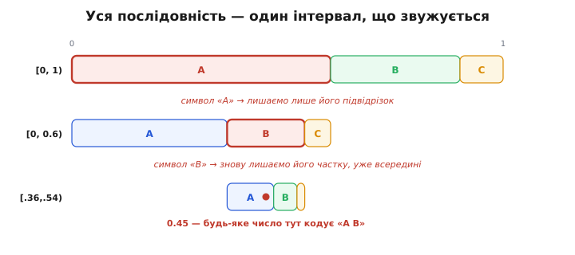
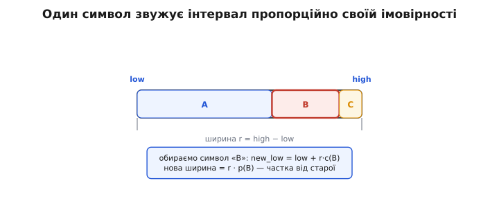
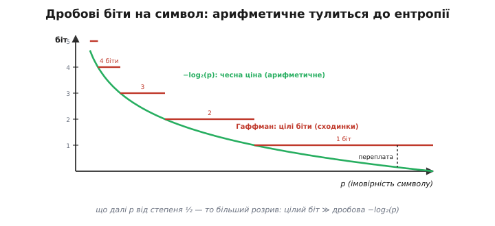
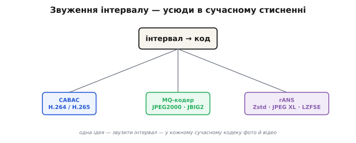

# Арифметичне кодування

Будь-яке стиснення впирається в одну межу — [ентропію](root:math-information/entropy): скільки бітів **у середньому** несе один символ джерела. [Код Гаффмана](root:math-information/huffman-coding) підбирається до цієї межі знизу, та має вроджену ваду: він видає **ціле** число бітів на символ. А що, як чесна ціна символу — 0.2 біта? Гаффман не вміє записати п'яту частку біта, тож округлює вгору до одного — і переплачує. **Арифметичне кодування** (*arithmetic coding*, від грецького *arithmós* — «число») знімає це обмеження геть інакше: воно взагалі не дає кожному символу окремий код. Замість того воно перетворює **всю послідовність** на одне-єдине дробове число — і так платить за символ **дробову** кількість бітів, тулячись до ентропії впритул.

### Головна ідея: вся послідовність — один інтервал

Облишмо звичку «символ → кодове слово». Арифметичне кодування думає про повідомлення цілком. Уяви відрізок `[0, 1)` — усі дійсні числа від нуля до одиниці. Кожне можливе повідомлення займе на цьому відрізку **свій крихітний підвідрізок**, і що довше повідомлення, то вужчий його шматок. Закодувати повідомлення означає назвати **будь-яке число** всередині його підвідрізка.

Як цей підвідрізок знайти? Звужуючи його символ за символом. Беремо повний `[0, 1)` і ділимо його на частини **пропорційно ймовірностям** символів: частий символ дістає широку частку, рідкісний — вузеньку. Перший символ повідомлення каже, **в яку частку перейти** — і тепер уже вона стає нашим робочим відрізком. Його знов ділимо за тими самими частками, другий символ обирає підчастку всередині, і так далі. Кожен символ **звужує** інтервал; уся послідовність стискає `[0, 1)` до одного тонюсінького проміжку.


*Уся послідовність — один інтервал, що звужується. Імовірності A=0.6, B=0.3, C=0.1. Кодуємо «A B». Символ «A» лишає підвідрізок [0, 0.6); усередині нього «B» лишає [0.36, 0.54). Будь-яке число з цього вікна — скажімо, 0.45 — однозначно кодує «A B». Що довше повідомлення, то вужче вікно й то більше цифр треба, щоб назвати число всередині, — це і є біти коду.*

Ось чому це працює. Широка частка (частий символ) звужує інтервал **мало** — тож додає мало цифр до числа, тобто мало бітів. Вузька частка (рідкісний символ) звужує **сильно** — і коштує багато бітів. Скільки саме? Звуження в `1/p` разів додає рівно `−log₂(p)` біта — а це і є [Шеннонова ціна символу](root:math-information/entropy). Підсумкова ширина інтервалу дорівнює добутку ймовірностей усіх символів, тож загальна довжина числа всередині — це сума `−log₂(p)` по всьому повідомленню. А сума `−log₂(p)` — це і є ентропія, помножена на довжину. Арифметичне кодування дістає ентропію не наближено, а майже точно, бо ніде не округлює до цілого біта.

### Звуження крок за кроком

Тримати весь інтервал у голові не треба — досить двох чисел: `low` (ліва межа) і `high` (права). Один символ перераховує їх так:

```
r = high − low                 // поточна ширина
new_low  = low + r · c_lo      // c_lo — ліва кумулятивна межа символу
new_high = low + r · c_hi      // c_hi — права кумулятивна межа символу
```


*Один символ звужує інтервал пропорційно своїй імовірності. Ширина r = high − low. Усередині неї символи мають кумулятивні межі c (як A:0…0.6, B:0.6…0.9, C:0.9…1). Обраний символ «B» дає new_low = low + r·c(B), а нова ширина — рівно r·p(B), частка від старої. Жодного округлення: інтервал звужується точно на стільки, скільки символ «коштує».*

«Кумулятивні межі» — це просто частки, викладені одна за одною вздовж відрізка. Якщо `p(A)=0.6, p(B)=0.3, p(C)=0.1`, то A займає `[0, 0.6)`, B — `[0.6, 0.9)`, C — `[0.9, 1.0)`. Кодуючи символ, ми переносимо ці самі частки в поточний `[low, high)` і лишаємо ту, що відповідає символу.

> 🔧 **Навіщо це.** На дроні чи будь-де у вбудованій системі арифметичний кодер — це фінальний, найщільніший крок ентропійного пакування після [перетворення й квантування](root:com-signal/jpeg-intra). Він тримає лише `low`, `high` і модель імовірностей — кілька десятків байтів стану замість таблиці кодів. Розуміючи, що символ просто масштабує інтервал, ти бачиш, **звідки беруться** дробові біти й чому за нерівних імовірностей арифметичне відчутно випереджає Гаффмана: воно не марнує ні частки біта на округлення.

### Worked-приклад: кодуємо «B A»

Візьмімо ту саму модель `p(A)=0.6, p(B)=0.3, p(C)=0.1` (кумулятивні межі: A `[0, 0.6)`, B `[0.6, 0.9)`, C `[0.9, 1.0)`) і закодуймо коротке повідомлення «B A».

**Старт.** Інтервал — увесь відрізок.

```
low = 0.0   high = 1.0   r = 1.0
```

**Символ «B».** Беремо частку B — кумулятивні межі `c_lo = 0.6, c_hi = 0.9`.

```
new_low  = 0.0 + 1.0 · 0.6 = 0.60
new_high = 0.0 + 1.0 · 0.9 = 0.90
→ low = 0.60   high = 0.90   r = 0.30
```

**Символ «A».** Тепер частку A (`c_lo = 0.0, c_hi = 0.6`) кладемо всередину `[0.60, 0.90)`.

```
new_low  = 0.60 + 0.30 · 0.0 = 0.60
new_high = 0.60 + 0.30 · 0.6 = 0.78
→ low = 0.60   high = 0.78   r = 0.18
```

**Код.** Будь-яке число з `[0.60, 0.78)` кодує «B A» — наприклад `0.6`. Декодер відновлює повідомлення дзеркально: бачить, що `0.6` лежить у частці B відрізка `[0, 1)` → перший символ «B»; переходить у `[0.6, 0.9)`, дивиться, в яку його підчастку впало `0.6` → це частка A → другий символ «A». Те саме число, прочитане крізь ту саму модель, віддає ту саму послідовність.

Порівняймо ціну. Чесна вартість «B A» за Шенноном — `−log₂(0.3) − log₂(0.6) ≈ 1.74 + 0.74 = 2.48` біта. Щоб однозначно вказати число у вікні шириною `0.18`, треба теж близько `−log₂(0.18) ≈ 2.48` біта. [Код Гаффмана](root:math-information/huffman-coding) на цій моделі дав би A=1 біт, B=2, C=2 — тобто «B A» коштувало б `2 + 1 = 3` біти. Арифметичне кодування економить **пів біта на двох символах**, і на довгому потоці ця економія накопичується.

### Дробові біти проти цілих

Ось у чому докорінна різниця. [Код Гаффмана](root:math-information/huffman-coding) будує дерево й дає кожному символу **префіксний код із цілою** довжиною — 1 біт, 2 біти, 3. Це оптимально лише тоді, коли всі ймовірності — точні степені `½` (`½, ¼, ⅛…`). Щойно ймовірність відходить від степеня двійки, ціла довжина вже не дорівнює `−log₂(p)`, і Гаффман **округлює вгору**, переплачуючи різницю.


*Дробові біти на символ. Зелена крива −log₂(p) — чесна вартість символу; стільки платить арифметичне кодування. Червоні сходинки — Гаффман: він мусить дати ціле число біт, тож округлює вгору до найближчої сходинки. Коли p близьке до степеня ½, сходинка майже лягає на криву й переплати майже нема. Та що далі p від ½ (наприклад дуже частий символ p=0.9, якому чесно належить ~0.15 біта), то більший розрив: цілий біт замість дробового — груба переплата.*

Найболючіше це за двох умов. По-перше, **дуже частий символ**: якщо `p = 0.9`, чесна ціна — `0.15` біта, а Гаффман віддасть аж цілий біт. По-друге, **близькі ймовірності**: коли символи майже рівноймовірні, дерево Гаффмана й так дає всім однакову довжину, але дрібні нерівності воно згладити не може. Арифметичне кодування в обох випадках платить рівно `−log₂(p)` — дробову, не округлену ціну, — тож підходить до ентропії там, де Гаффман помітно відстає.

> 🔧 **Навіщо це.** Саме тому сучасні відеокодеки взяли арифметичне ядро. У стисненні відео після квантування левову частку символів становлять **нулі** з імовірністю далеко за `0.9`. Гаффман віддав би на кожен нуль цілий біт; арифметичне ядро ([CABAC](root:com-signal/cabac)) витрачає **частки** біта — і це дає ті самі відсотки бітрейту, що вирішують, влізе потік у радіоканал чи ні.

### Цілі числа замість дробів: range coding

На папері все на дробах `[0, 1)`, та процесор дробами з нескінченною точністю не оперує: після кількох десятків символів інтервал стане вужчим за машинне число й «схлопнеться». Практична реалізація обходить це **range coding** (англ. *range* — діапазон): замість дробів тримають **цілі** `low` і `high` у звичайних 32-бітних регістрах, а звуження роблять цілочисельним масштабуванням. Головний трюк — **renormalization** (від латинського *re-* — знову + *norma* — міра): щойно старші біти `low` і `high` збіглися, вони вже **не зміняться** хоч би що було далі, тож їх можна негайно **вивести в потік** і звільнити місце, розтягнувши інтервал. Так точність не вичерпується ніколи, а код виходить рівним струмком байтів. Як саме це влаштовано — у [детальній версії](root:math-information/arithmetic-coding/detail).

### Чому воно тепер усюди

Арифметичне кодування довго лишалося на маргінесі — і не через техніку, а через **патенти**. Ідею в 1970-х розвинули в IBM (ключові імена — Йорма Ріссанен і Гленн Ленґдон), і компанія обклала її патентами. Широко метод став відомий аж із прозорого опису Віттена, Ніла й Клірі в *Communications of the ACM* 1987 року — але юридична морока змусила цілі покоління інженерів лишатися на безпечному Гаффмані. Класичний JPEG, наприклад, арифметичний режим **передбачав**, та майже ніхто ним не користувався саме через патенти.


*Звуження інтервалу — усюди в сучасному стисненні. Класичне арифметичне ядро живе в CABAC — ентропійному кодері H.264 і H.265, — а також у MQ-кодері JPEG2000 та JBIG2. Сучасний нащадок тієї самої ідеї, rANS (різновид асиметричних систем числення), дає майже ту саму щільність на більшій швидкості й тому стоїть у Zstandard, JPEG XL та LZFSE. Корінь скрізь один: перетворити дані на положення в інтервалі.*

Коли основні патенти доспівали, метод ринув у стандарти. Сьогодні арифметичне ядро — це **CABAC** (context-adaptive binary arithmetic coding), ентропійний кодер [H.264 і H.265](root:embedded/mjpeg-vs-h264); це **MQ-кодер** усередині JPEG2000 та JBIG2. А 2009 року поляк Ярослав Дуда винайшов [**асиметричні системи числення** (ANS)](root:math-information/asymmetric-numeral-systems) — родича арифметичного кодування, що дає ту саму щільність помітно швидше; його різновид **rANS** Дуда свідомо лишив у відкритому доступі, без патентів, і відтоді він розійшовся всюди — Zstandard від Facebook, формат образів JPEG XL, LZFSE від Apple. (Не плутати з безвтратним аудіо FLAC: воно тулиться до ентропії інакше — кодом Райса, не арифметичним.) Та сама ідея, що десятиліттями лежала під замком, тепер пакує мало не кожне нове фото й відео.

### Підсумок теми

Арифметичне кодування перетворює **всю послідовність** на одне дробове число в інтервалі `[0, 1)`: кожен символ звужує інтервал **пропорційно своїй імовірності**, а будь-яке число всередині підсумкового вузького вікна = код повідомлення. Декодер тим самим діленням за тією самою моделлю відновлює послідовність із числа. Головна перевага над [кодом Гаффмана](root:math-information/huffman-coding) — **дробові** біти на символ замість цілих: воно платить рівно `−log₂(p)` і тому тулиться до [ентропії](root:math-information/entropy) впритул, особливо за нерівних чи дуже близьких імовірностей, де Гаффман переплачує на округленні. Практично метод реалізують як **range coding** на цілих числах із renormalization — без нескінченної точності. Колись закутий у патенти IBM, тепер він — ядро сучасних кодеків (CABAC у H.264/H.265, MQ-кодер у JPEG2000), а його швидкий нащадок rANS стоїть у Zstandard і JPEG XL.

---
