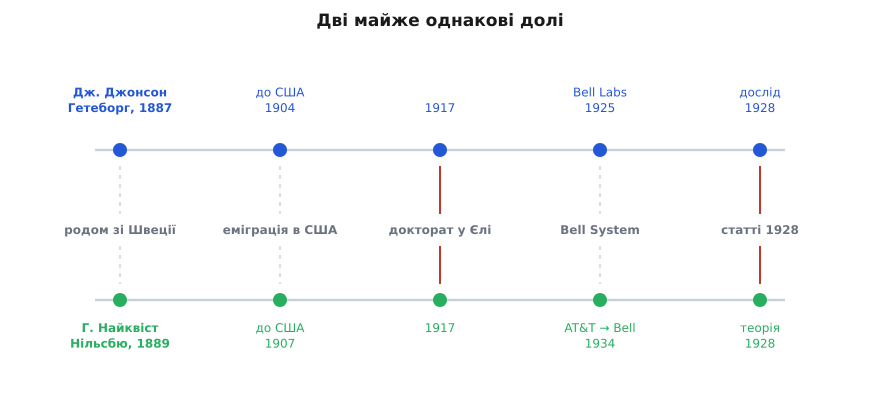

# 📜 Двоє шведів і шум, що йде від тепла

У середині 1920-х інженери Bell полювали на шипіння. Підсилювачі ставали дедалі чистіші — кращі лампи, ретельніше екранування, тихіші джерела живлення, — і разом із кожним поліпшенням зникала чергова завада. Аж поки не лишалося одне тихе рівне шипіння, яке не зникало нізащо. Хоч як вилизуй схему, хоч який бездоганний бери резистор, у навушниках сидів той самий м'який шурхіт. Спершу його списували на недосконалість деталей: десь погана пайка, десь брудний контакт, десь мікроскопічна вада матеріалу. Логіка проста — знайди винну деталь, заміни, і шум піде. Але він не йшов. І це починало непокоїти по-справжньому, бо той шум ставив стелю чутливості: підсилюй сигнал скільки завгодно — разом із ним підсилюється й шурхіт, і слабкий голос під цією підлогою не витягти ніколи.

Розгадка виявилася не в поганій деталі, а в самій природі речовини. І прийшла вона від двох людей, чиї життєві шляхи були настільки схожі, що це аж моторошно.

### Хлопець із Гетеборга

Джон Бертранд Джонсон (John Bertrand Johnson) народився 2 жовтня 1887 року в Гетеборзі, у Швеції, — при народженні Юхан Ерік Бертранд. Родина жила в такій нужді, що про освіту не йшлося: дитинство минало на межі виживання. Порятунок прийшов від дядька, який уже влаштувався за океаном і витягнув небожа за собою — 3 липня 1904 року сімнадцятирічний Джон ступив на американський берег. Дядько ж і подбав, щоб хлопець зміг учитися.

Далі — сходження, яке в Європі того часу було б для сина бідняків майже неможливе. Університет Північної Дакоти, магістерський ступінь 1914-го, а тоді — докторат із фізики в Єльському університеті 1917 року. Джонсон осів у інженерному відділі Western Electric і виявився передусім **майстром інструмента**: близько 1922-го він приробив до трубки Брауна розжарений катод і зробив із неї придатний до роботи катодний осцилограф — прилад, що вперше дав інженерам **побачити** швидкі електричні коливання на власні очі. 1925 року, коли з інженерних відділів Western Electric та AT&T зібрали окрему компанію — Bell Telephone Laboratories, — Джонсон опинився там. Людина, яка вміла будувати чутливі вимірювачі й довіряла тому, що вони показують, навіть коли показане суперечить сподіванням.

### Досліди 1926–1927: шум, байдужий до всього

Саме ця довіра до приладу і привела до відкриття. Замість того щоб і далі проклинати шипіння, Джонсон вирішив його **виміряти** — акуратно, кількісно, як фізичну величину. Він брав звичайний резистор, під'єднував до чутливого лампового підсилювача й міряв, наскільки сильно тремтить напруга на його кінцях, коли крізь нього не тече жодного струму від жодного джерела. Резистор просто лежав собі — а напруга на ньому все одно дрібно смикалася.

І тоді почалося найцікавіше — Джонсон став міняти все підряд, шукаючи, від чого шум залежить. Результат був приголомшливо впертий: шум **не залежав майже ні від чого**, крім двох речей.

Він не залежав від того, **з чого** зроблено резистор, — вугільний, металевий, дротяний, електроліт у пробірці — байдуже, шум був той самий. Не залежав від форми, розміру, способу виготовлення. Не залежав від того, яку напругу колись до нього прикладали. Єдине, що керувало силою шуму, — це **опір** резистора і його **температура**. Нагрій резистор — шипіння передбачувано гучнішає. Охолоди — тихішає. Середній квадрат тремкої напруги виявився прямо пропорційним і опору, і абсолютній температурі:

```
⟨u²⟩ = 4·k·T·R·Δf
```

де ⟨u²⟩ — середній квадрат шумової напруги, R — опір, T — температура в кельвінах, Δf — смуга частот, у якій міряють, а k — стала Больцмана. Ця незалежність від матеріалу й була справжньою бомбою. Якби шум ішов від якоїсь вади конкретного резистора, він мав би різнитися від зразка до зразка. А він був **однаковий для всіх** — отже, джерело не в деталі, а в чомусь глибшому, спільному для будь-якого провідника у Всесвіті. Це вже пахло не інженерією, а фізикою першооснов.

Джонсон доповів про виміряне на грудневих зборах Американського фізичного товариства 1926 року, коротку замітку надіслав до журналу *Nature* 1927-го, а повну статтю — «Thermal Agitation of Electricity in Conductors» («Теплове збурення електрики в провідниках») — надрукував у *Physical Review* 1928 року (том 32, с. 97–109). Він знав **що** відбувається і за яким законом. Чого він, за власним зізнанням, не мав, — це чистого пояснення, **чому** саме так і чому в формулі стоїть саме стала Больцмана. За поясненням він пішов коридором — до колеги, якого звали Гаррі Найквіст.

### Найквіст: місяць — і термодинаміка все пояснила

І тут історія робить свій моторошний віраж, бо життєпис Найквіста — це майже копія Джонсонового, зсунута на пару років.

Гаррі Теодор Найквіст (Harry Theodor Nyquist, при народженні швед. Nyqvist) народився 7 лютого 1889 року в селі Нільсбю у Вермланді, Швеція, — четвертим із восьми дітей у родині шевця. Так само нужда, так само поле й батькова майстерня замість безжурного дитинства. Вчитель, що побачив у хлопцеві хист, порадив те саме, що й тисячам скандинавів тієї доби: у Швеції бідному ходу нема — їдь до Америки. 1907 року Найквіст емігрував, перебивався сезонною роботою на фермах усе тієї ж **Північної Дакоти** — і вступив до того самого університету, що й Джонсон трьома роками раніше. Магістерський ступінь з електротехніки, а тоді — докторат із фізики в **Єлі, того самого 1917 року, що й Джонсон**. Двоє бідних шведських хлопців, які ніколи не бачилися вдома, пройшли той самий шлях — та сама країна, той самий університет у прерії, той самий Єль, той самий випуск — і зійшлися врешті в дослідницькому світі Bell. (Формально в 1928-му Джонсон працював у Bell Telephone Laboratories, а Найквіст — у дослідницькому відділі AT&T; до самих Bell Labs він офіційно перейшов 1934 року. Але це були сусідні кабінети однієї великої лабораторії.)

Джонсон приніс Найквістові свої дані й запитання: звідки береться саме така величина шуму? Приблизно за **місяць** Найквіст повернувся з відповіддю — і відповідь була така стисла й гарна, що досі її вставляють у підручники майже без змін.

Хитрість Найквіста в тому, що він **не став порпатися в мікроскопічному безладі електронів**. Не рахував зіткнень, не будував моделі кристалічної ґратки — усе це нестерпно складно й до того ж залежало б від матеріалу, а шум від матеріалу не залежить. Замість цього він міркував **термодинамічно**. Уяви два однакові резистори, з'єднані дротом і замкнені в спільному тепловому «ящику» за температурою T. Кожен шумить і шле свою тремтливу потужність по дроту в бік іншого. Якщо вони в тепловій рівновазі, потоки мусять урівноважитися — інакше один резистор нагрівав би інший без жодних витрат, а це вічний двигун, якого термодинаміка не дозволяє. Із цієї простої вимоги рівноваги вже випливає, скільки саме потужності мусить нести шум.

Далі Найквіст уявив дріт між резисторами як лінію передачі, у якій «живуть» стоячі хвилі — власні коливальні моди, як у струні. А до кожної такої моди застосовна **теорема про рівнорозподіл енергії**: у тепловій рівновазі на кожен незалежний спосіб коливатися природа насипає в середньому по ½·k·T енергії, і жодна мода не обділена. Полічи моди, що вміщаються в смугу Δf, дай кожній її теплову пайку — і одразу випадає, скільки шумової потужності віддає резистор:

```
P = k·T·Δf
```

Доступна шумова потужність — рівно добуток температури на смугу (зі сталою Больцмана як перевідником енергії). Звідси прямо відновлюється й Джонсонова формула для напруги ⟨u²⟩ = 4·k·T·R·Δf. Найквіст надрукував це поряд із Джонсоновою статтею — «Thermal Agitation of Electric Charge in Conductors», *Physical Review*, 1928, том 32, с. 110–113. Дослід і теорія вийшли пліч-о-пліч, за підписами двох людей однієї долі, — тому шум відтоді й зветься **шумом Джонсона–Найквіста**.


*Двоє, що ніколи не стрічалися вдома, пройшли той самий шлях: обидва народжені в бідній Швеції, обидва емігрували, обидва вчилися в Північній Дакоті й здобули докторат у Єлі того самого 1917 року, обидва опинилися в дослідницькому світі Bell — і 1928-го дали світові одне: дослід і теорію теплового шуму.*

### Чому це не вада, а закон

Варто спинитися й відчути, наскільки несподіваний висновок отримали ці двоє. Шум у дроті — це **не поломка**, не наслідок брудних контактів чи кепських деталей, які колись навчаться робити краще. Це прямий вияв того, що будь-який шматок речовини теплий. Мільярди мільярдів вільних зарядів у провіднику ніколи не стоять на місці: тепло смикає їх урізнобіч, і в кожну мить їхній безладний натовп трішки збивається то в один бік, то в інший, лишаючи на кінцях провідника крихітну випадкову напругу (мікроскопічну картину цього тремтіння розгортає [фізика теплового шуму](root:ph-condensed/thermal-noise)). Прибрати цей рух означало б **зупинити тепло**, тобто опустити температуру до абсолютного нуля. Поки резистор теплий — він шумить, і крапка.

І та сама k·T, що визначає силу цього шуму, — не випадкова гостя. Це той самий добуток, який у термодинаміці задає теплову енергію на одну частинку газу, на один спосіб коливатися, на один ступінь вільності. Тремтіння зарядів у дроті виявилося **рідним братом** безладного руху молекул у нагрітому газі — те саме тепло, той самий закон рівнорозподілу, та сама k·T. Ось чому шум байдужий до матеріалу: він тече не від хімії конкретного резистора, а від температури як такої. Це підлога, яку кладе сама термодинаміка, і глибше за неї не опуститися нікому й ніколи.

### Термометр зі шуму — і як зважили Больцмана

У формулі ⟨u²⟩ = 4·k·T·R·Δf ховається ще один подарунок, який Джонсон помітив одразу. Дивись, що в ній стоїть: опір R інженер знає точно, смугу Δf свого приладу — теж, шумову напругу він **виміряв**. Лишаються дві невідомі — температура T і стала Больцмана k. А отже, рівняння можна **розвернути** й читати задом наперед: виміряй шум за відомої температури — і дістанеш k; або, знаючи k, виміряй шум — і дістанеш **температуру**, ні до чого не торкаючись, самим лише слуханням теплового шипіння. Це називають шумовою термометрією, і Джонсон уже у своїй статті 1928 року витяг зі своїх вимірів значення сталої Больцмана, яке в межах похибки збігається з нинішнім. Резистор виявився ще й термометром.

Ця думка мала довге відлуння. Через дев'ять десятиліть, коли метрологи вирішили перебудувати всю систему одиниць на фундаментальних сталих, шумова термометрія стала одним зі способів **надточно зважити** сталу Больцмана: 2017 року в NIST виміряли її саме через шум Джонсона–Найквіста з похибкою краще за три мільйонні частки. Ці й подібні виміри й дали остаточне число, після чого 2019 року сталу Больцмана **зафіксували назавжди** точним значенням:

```
k = 1.380649·10⁻²³ Дж/К   (точно, за визначенням)
```

Відтоді кельвін означений не через воду й лід, а через цю сталу. Дивовижна дуга: те саме тихе шипіння, що колись дратувало інженерів у навушниках, стало одним із інструментів, якими людство наново означило, що таке **градус температури**.

### Хто був раніше

Історія була б неповна без згадки про попередників — бо теплового шуму, як це часто буває, чекали ще до того, як його впіймали. Ще 1918 року німецький фізик Вальтер Шоттки (Walter Schottky) теоретично передбачив, що тепловий рух зарядів має породжувати в провіднику флуктуації напруги, — тим самим міркуванням, яким відкрив «дробовий» шум лампового струму. Ще раніше, у докторській дисертації 1912 року, нідерландка Гертруда де Гааз-Лоренц (Geertruida de Haas-Lorentz) вивела формули для середнього квадрата теплового струму. Тобто **ідея** носилася в повітрі.

Але між «має бути» й «є, і ось із якою точно величиною» — прірва. Саме Джонсон **чисто виміряв** явище й показав його вражаючу універсальність, а Найквіст **вивів правильну величину** з першооснов термодинаміки, без жодних підгінних припущень. Через це в назві стоять двоє: вимір і теорія, рука й голова, — і обидва, за примхою долі, вихідці з бідної Швеції через прерії Північної Дакоти. Доказовий статус усього тут — **усталено**: формула перевірена мільйони разів, лежить в основі шумової термометрії й метрології, і жодних поважних сумнівів не викликає.

Те, що вони знайшли, — не якась деталь схемотехніки, а тверда межа, вписана в саму речовину: поки щось тепле, воно шумить, і рівень того шуму задає сама лише температура. Це і є та неуникна підлога, під яку не пірнути жодному сигналу, — і саме тому будь-яка чесна розмова про межі зв'язку рано чи пізно впирається в двох шведів, що слухали шипіння тихого резистора.
