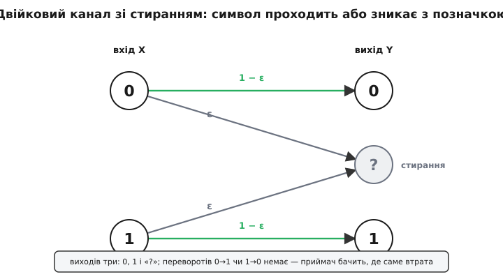
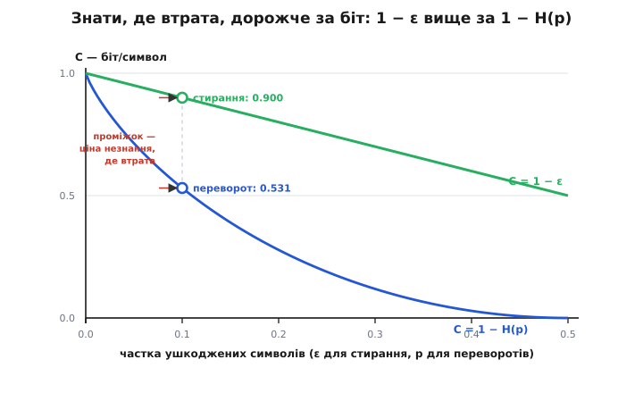

# Двійковий канал зі стиранням

<preknowlist>
- [Імовірність як міра непевності](root:math-probability/probability-basics) — що таке ймовірність ε (число від 0 до 1), незалежні спроби, «частка з багатьох».
- [Двійковий логарифм](root:math-information/binary-logarithm) — log₂x питає, у який степінь звести двійку, щоб дістати x; у ньому міряють біти.
- [Ентропія Шеннона](root:math-information/shannon-entropy) — міра невизначеності в бітах; двійкова H(p) = −p·log₂p − (1−p)·log₂(1−p) — невизначеність монети з шансом p.
</preknowlist>

Зіпсувати біт можна двома дуже різними способами, і різниця між ними — не дрібниця, а ціла прірва. Перший спосіб жорстокий: біт нишком перевертається, нуль обертається на одиницю, а приймач цього не помічає й бере брехню за правду. Саме так псує [двійковий симетричний канал](root:math-information/binary-symmetric-channel) — модель, де кожен біт із якоюсь імовірністю потай міняє значення, і збиті біти нічим не відрізняються від цілих. Другий спосіб чесний: канал не бреше про біт, а просто губить його — і **зізнається**, що загубив. Замість значення приймач дістає порожнє місце, позначку «тут щось було, але я його не доніс». Її записують знаком стирання «?», і третього виходу, крім чесного біта й чесного зізнання, тут не буває.

Це не абстракція. Коли пакет в інтернеті приходить із побитою [контрольною сумою](root:com-modulation/checksums), приймач не вдає, що все гаразд, — він викидає пакет цілком, а за розривом у нумерації бачить рівно, якого шматка бракує. Дані не спотворені нишком, вони відверто відсутні, і місце їхньої відсутності відоме. Канал, що псує саме так — губить символ, але позначає втрату, — звуть **двійковим каналом зі стиранням** (англ. *binary erasure channel*, BEC).

### Модель: біт або доходить, або зникає з позначкою

Уся модель, як і в симетричного брата, тримається на одному числі. Позначмо його **ε** (грец. *épsilon*) — імовірність, що символ дорогою зітреться. Тоді з імовірністю 1 − ε він проходить недоторканим. Вхід бере два значення, 0 і 1; вихід — уже три: ті самі 0 і 1 плюс знак стирання «?». І ось головне обмеження, з якого випливе все інше: канал **ніколи не перевертає** біт. Одиниця не вийде нулем. Ти або одержуєш точно те, що послали, або одержуєш «?» — але хибного біта, що вдає правильний, тут не буває зроду. Кожне користування каналом незалежне: канал не пам'ятає попередніх символів і щоразу наново вирішує, донести чи стерти.


*Дві прямі стрілки (символ проходить, імовірність 1−ε) і дві стрілки, що збігаються на знаку стирання «?» (символ зникає, імовірність ε). Перехресних стрілок 0→1 чи 1→0 немає взагалі — канал не вміє перевертати, лише доносити або губити.*

### Уся сіль: втрата позначена

Порівняймо дві невдачі впритул, бо в цьому порівнянні — весь сенс теми. Коли симетричний канал перевертає біт, він робить це **потай**: приймач бачить нормальний на вигляд нуль чи одиницю й гадки не має, котрі з них підмінені. Помилка захована в потоці, і перш ніж її виправити, її треба ще **знайти**. Стирання ж кричить про себе: кожна втрата **позначена**. Приймач достеменно знає, у яких місцях бракує даних, — невідоме лише саме значення, не його адреса. Ось уся різниця між двома каналами, і з неї, як з насінини, виростає все дальше: стирання лишає нам половину задачі вже розв'язаною.

### Пропускна здатність: C = 1 − ε

Скільки ж корисного можна надійно проштовхнути крізь такий канал на кожен символ? Тут відповідь Шеннона така прозора, що її видно майже без обчислень:

```
C = 1 − ε   бітів на символ
```

Логіка гола. З кожної сотні посланих бітів у середньому ε·100 зітреться, а решта, (1 − ε)·100, дійде бездоганно — і ти точно знаєш, котрі саме дійшли. Стерті місця не несуть нічого, зате й не брешуть; уцілілі несуть по цілому біту. Отже втрачаєш рівно стерту частку — ані більше, ані менше — і лишається рівно 1 − ε. Строгий доказ через [взаємну інформацію](root:math-information/mutual-information) входу й виходу дає той самий результат за три рядки: невизначеність про вхід зостається тільки там, де стерто (частка ε), тож із кожного біта шум з'їдає ε, а віддає 1 − ε — цю викладку до дна розписує [математична вставка](root:math-information/binary-erasure-channel/math-capacity-erasure.md).


*Однакова частка ушкоджень, але дві різні стелі. Стирання (пряма 1−ε) завжди щедріше за переворот (крива 1−H(p)), бо не змушує вгадувати позицію втрати. Проміжок між кривими при ваді 0.1 — це і є ціна незнання, де саме сталася біда.*

Тепер відчуймо, чого варте те знання позиції, поставивши стирання поряд із переворотом на однаковій «десятивідсотковій» ваді.

**Приклад (ε = 0.1 проти p = 0.1).** Хай псується кожен десятий символ — але в одному каналі він стирається, а в іншому нишком перевертається:

```
стирання:  C = 1 − ε       = 1 − 0.1     = 0.900 біта/символ
переворот: C = 1 − H(0.1)  = 1 − 0.469   = 0.531 біта/символ
```

Однакова частка ушкоджень — а пропускна здатність майже вдвічі різна. Уся ця прірва, 0.900 проти 0.531, — плата за незнання: симетричний канал змушує вгадувати, **де** сталася біда, і саме це вгадування коштує половини каналу. Стирання цієї ціни не бере, бо адресу втрати видає задарма.

> 🔧 **Навіщо це.** Виміряй частку втрачених пакетів ε — і одразу знаєш стелю каналу, 1 − ε, без жодних логарифмів: рівно стільки корисного пропхнеш надійно. Це підказує й стратегію: якщо на нижньому рівні біти спотворюються потай, вигідно навмисне обертати спотворення на стирання — доклавши контрольну суму, що відсіює побиті блоки. Ти ніби доплачуєш бітами перевірки, зате переводиш канал із дорогого режиму переворотів (стеля 1 − H(p)) у дешевий режим стирань (стеля 1 − ε), де і межа вища, і код простіший.

### Стирання вдвічі дешевше за помилку

Та сама перевага повертається й у кодуванні, ще й удвічі відчутніше. Код боронить повідомлення тим, що розставляє дозволені слова далеко одне від одного за [відстанню Геммінга](root:com-modulation/hamming-distance) — числом позицій, у яких два слова різняться. Щоб полагодити пошкодження, декодер мусить упевнено сказати, яке слово справжнє. З помилкою в нього подвійний клопіт: спершу з'ясувати, **котрі** біти збрехали, а тоді їх перекинути, — і на це потрібен запас відстані **2t + 1**, щоб надійно виправити t помилок. Зі стиранням половина роботи вже зроблена: позиції відомі, лишається підставити в них значення так, щоб вийшло дозволене слово. Тому для t стирань досить відстані лише **t + 1** — рівно вдвічі дешевше. Знати, де діра, — це половина всієї боротьби з шумом.


*Стирання показує свої позиції відкрито — лишається знайти лише значення. Помилка ховається серед цілих бітів, тож декодер спершу мусить її вистежити й аж тоді виправити. Тому та сама кількість стирань коштує вдвічі меншого запасу відстані, ніж стільки ж помилок.*

Через цю поблажливість канал зі стиранням став робочою моделлю там, де втрати відкриті, а не приховані. Передусім це сам інтернет: кожен пакет несе контрольну суму, і побитий пакет не приймають зіпсованим, а відкидають, — тобто спотворення на нижчому рівні обертається чесним стиранням на вищому, і мережа виглядає як одне велике BEC поверх пакетів. Під цю модель скроєні й спеціальні [фонтанні коди](root:com-modulation/fountain-codes), що ллють нескінченний потік порцій, доки приймач не набере досить уцілілих, аби скласти файл, — байдуже, які саме загубилися дорогою. А сам двійковий випадок — лише найпростіший зріз загального [каналу зі стиранням](root:math-information/erasure-channel-and-packet-loss), де стиратися може символ будь-якого алфавіту, не конче з двох значень. Що ж до родоводу, цю модель [ввів Пітер Еліас](root:math-information/binary-erasure-channel/hist-elias-erasure.md) у середині 1950-х поряд із симетричним каналом, і десятиліттями потому вона несподівано стала найточнішим портретом мереж із комутацією пакетів — каналу, що радше чесно губить, ніж потай бреше.

---
