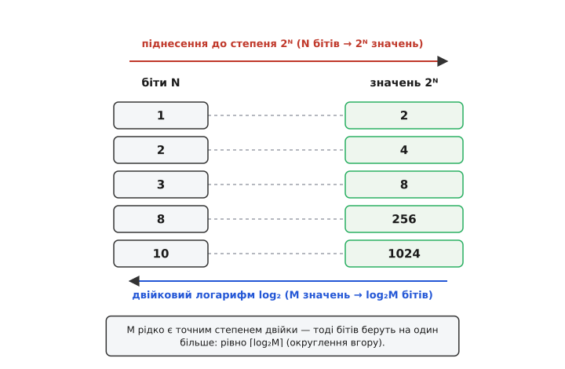
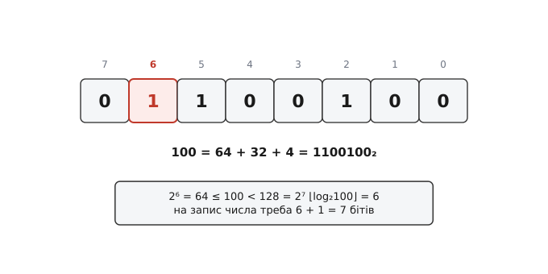
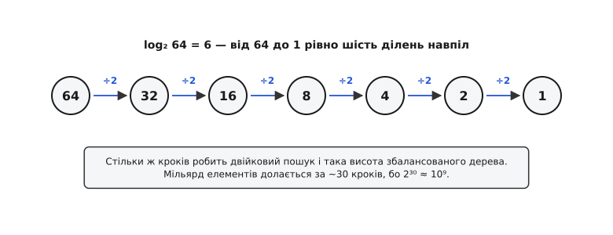

# Двійковий логарифм

<preknowlist>
- [Логарифми](root:math-analysis/logarithms) — логарифм як обернена дія до піднесення до степеня: «до якого показника звести основу, щоб дістати число».
- [Чому двійкова](root:math-number-theory/why-binary) — біт як розряд із двома станами й правило місткості: N бітів тримають 2ᴺ значень.
- [Позиційні системи](root:math-number-theory/positional-systems) — як двійковий запис читається числом і що вага k-го розряду дорівнює 2ᵏ.
</preknowlist>

Питання «скільки різних значень влізе у 8 бітів?» має миттєву відповідь: 2⁸ = 256. Але в роботі так питають рідко. Набагато частіше питання стоїть навпаки. У мережі тисяча вузлів — скільки бітів відвести під номер? У таблиці мільйон записів — за скільки кроків знайдеться потрібний? Піксель має 256 рівнів яскравості — скільки це бітів?

Це те саме правило 2ᴺ, лише прочитане з іншого кінця: не «N бітів → скільки значень», а «стільки-то значень → скільки бітів». Дія, що робить цей поворот, і зветься двійковим логарифмом. Вона не екзотична функція з підручника аналізу — це відповідь на найчастіше лічильне питання в цифровій техніці.

### Два боки одного правила


*Праворуч драбиною йде піднесення до степеня: додали біт — подвоїли кількість значень. Ліворуч тією самою драбиною йде двійковий логарифм: маємо M значень — питаємо, скільки бітів їх тримає. Це одна драбина, пройдена у два боки, а не дві різні задачі.*

Двійковий логарифм числа M — це показник, до якого треба звести двійку, щоб дістати M:

```
2ᴺ = M    ⇄    N = log₂M
```

Обидва записи кажуть те саме, просто питають про різні місця в рівності. Ліворуч невідома — результат, праворуч — показник. Тому 2¹⁰ = 1024 і log₂1024 = 10 — це одне твердження, вимовлене двічі.

Саму назву склали з двох грецьких коренів — *lógos* (відношення, лічба) і *arithmós* (число); її дав шотландський барон Джон Непер, оприлюднивши логарифми 1614 року. Незалежно від нього ту саму ідею розробив швейцарський годинникар Йост Бюрґі — імовірно, ще на початку 1580-х, хоч надрукував лише 1620-го, вже після Непера. Обидва рахували не двійками; двійковий логарифм ішов своєю, окремою і несподівано довгою стежкою — [її варто пройти нарізно](root:math-information/binary-logarithm/hist-binary-logarithm.md): від лічби поділів навпіл у джайнського математика VIII століття Вірасени через таблицю степенів двійки Міхаеля Штіфеля 1544 року до Ейлера, що 1739-го застосував двійковий логарифм до **теорії музики** — за двісті років до того, як він знадобився теорії інформації.

Через цю довгу історію єдиного позначення так і не склалося. Стандарти (ISO 80000-2, DIN 1302) приписують `lb n`; німецька традиція каже `ld n` (від латинського *logarithmus dualis*); програмісти звикли до `lg n`, хоч ті самі стандарти закріпили `lg` за десятковим логарифмом. Щоб не плутатися, тут скрізь пишемо `log₂` — надлишково, зате однозначно.

### Основа 2 — не примха, а одиниця виміру

Тут природно засумніватися: чи справді двійковий логарифм — щось окреме? Адже логарифми за різними основами пов'язані простим переходом:

```
log₂M = ln M / ln 2 = log₁₀M / log₁₀2 ≈ 1.4427 · ln M
```

Виходить, усі логарифми — та сама функція з точністю до сталого множника. Крива одна, різниця лише в тому, як її розтягнули по вертикалі. То чому ж двійка заслуговує на власну назву й окрему розмову?

Бо сталий множник — це не дрібниця, коли він **називає одиницю**. Логарифм рахує, скільки разів величина помножилася сама на основу. За основою 10 він рахує десятикратні зростання (порядки), за основою e — е-кратні (непери), за основою 2 — **подвоєння**. А одне подвоєння — це рівно один біт: доданий розряд подвоює місткість, і жодного іншого сенсу в біті немає. Тому log₂ не просто «логарифм із зручним числом»: він відповідає **в бітах**, тоді як інші основи відповідають у чужих одиницях, які ще треба перераховувати. Питати «скільки бітів» натуральним логарифмом — те саме, що міряти довжину дошки в дюймах, коли пиляєш за метричним креслеником: числа перерахуються, але щоразу із зайвим множником і зайвою нагодою помилитися. [Сам перехід між основами виводиться з двох рядків](root:math-information/binary-logarithm/math-change-of-base.md) і показує заразом, звідки береться множник 1.4427.

> 🔧 **Навіщо це.** Коли профайлер каже «алгоритм логарифмічний», а стаття — «складність log n», основу часто взагалі не вказують: у межах O-нотації вона й не важить, бо ховається в сталому множнику. Але щойно логарифм дає **відповідь**, а не оцінку зростання, основа стає критичною: «10 чого?» — бітів, порядків, неперів? Правило просте: рахуєте біти, розряди, кроки поділу навпіл, рівні дерева — основа 2, завжди.

### Ціла частина — це просто позиція старшого біта

Для точних степенів двійки log₂ виходить цілим: log₂256 = 8, log₂1024 = 10. Для решти чисел він дробовий і здебільшого ірраціональний — log₂100 ≈ 6.6439. Здавалося б, тепер потрібні ряди, наближення й дійсна арифметика. Але для цілих чисел найпотрібніша частина відповіді — **ціла** — лежить на поверхні двійкового запису.


*Число 100 у двійковій — 1100100. Найстарший одиничний біт стоїть на позиції 6 (лічба з нуля, справа наліво) — і саме 6 дорівнює ⌊log₂100⌋. Це не збіг: одиниця на позиції 6 означає доданок 2⁶ = 64, а все, що додається праворуч, разом менше за 64 і подвоїти число не здатне.*

Ланцюжок міркування короткий. Старший одиничний біт на позиції k означає, що число має доданок 2ᵏ, тож воно точно не менше за 2ᵏ. Водночас усі молодші розряди разом дають щонайбільше 2ᵏ − 1, тож число не дотягує до 2ᵏ⁺¹. Разом:

```
2ᵏ ≤ n < 2ᵏ⁺¹        →        ⌊log₂n⌋ = k
```

Перевіримо на сотні: 2⁶ = 64 ≤ 100 < 128 = 2⁷, отже ⌊log₂100⌋ = 6. Ніякої трансцендентності — суто **читання** запису.

Ось звідки береться характер цієї дії в машині. Знайти ⌊log₂n⌋ для цілого — це не обчислити функцію, а **подивитися, де стоїть старша одиниця**. Тому процесори мають для цього окрему інструкцію (x86 — `LZCNT`/`BSR`, ARM — `CLZ`), яка відпрацьовує за такт: питання «який тут двійковий логарифм» для заліза настільки ж просте, як «яка тут довжина».

### Дві сусідні задачі, які постійно плутають

Тепер до самої лічби. Задачі дві, вони схожі — і тому їх зливають в одну, породжуючи класичну помилку на одиницю.

**Умова: у мережі 1000 вузлів, кожному треба свій номер. Скільки бітів відвести під поле адреси?**

```
9 бітів  → 2⁹  = 512  значень   — замало (512 < 1000)
10 бітів → 2¹⁰ = 1024 значення   — вистачає (1024 ≥ 1000)

треба:  N = ⌈log₂1000⌉ = ⌈9.9658⌉ = 10 бітів
```

Дробової частини бути не може — бітів беруть цілу кількість, і **округлення тільки вгору**: дев'яти не вистачить, дев'ять із половиною не існує. Двадцять чотири адреси лишаються невитраченими — звичайна плата за те, що тисяча не є степенем двійки.

**Умова: скільки бітів займе саме число 100?**

```
⌊log₂100⌋ = 6      — позиція старшого біта
довжина   = 6 + 1 = 7 бітів      (100 = 1100100₂)
```

Різниця тонка, але вона справжня. Перша задача питає про **місткість**: скільки бітів, щоб пронумерувати M речей — відповідь ⌈log₂M⌉. Друга питає про **довжину запису**: скільки бітів, щоб записати число n — відповідь ⌊log₂n⌋ + 1. Формули різні, і на точних степенях двійки вони розходяться найболючіше:

```
пронумерувати 1024 значення (0…1023):  ⌈log₂1024⌉   = 10 бітів
записати саме число 1024:              ⌊log₂1024⌋+1 = 11 бітів
```

Обидві відповіді правильні — просто на різні питання. Тисяча двадцять чотири різні значення справді вміщаються в десять бітів; але саме число 1024 у десять бітів не влазить, бо в десяти бітах найбільше — 1023. Звідси й нескінченні баги з лічильниками, що «мали б рахувати до 1024». Найнадійніший спосіб не помилитися — не згадувати формулу, а поставити питання руба: **я нумерую значення чи записую число?**

### Скільки разів поділити навпіл

У log₂ є ще один сенс — не про запис, а про **дію**, і саме він зробив двійковий логарифм головним числом в алгоритмах.


*Від 64 до 1 — рівно шість ділень навпіл, і log₂64 = 6. Причина пряма: кожне подвоєння додає до логарифма одиницю, тож кожне ділення навпіл одиницю віднімає. Логарифм — це просто лічильник подвоєнь, прочитаний назад.*

Звідси й береться всюдисущість log₂ у програмуванні. **Будь-який процес, що на кожному кроці відкидає половину, добігає кінця за log₂n кроків** — бо стільки разів n можна поділити навпіл. [Двійковий пошук](root:sf-algorithms/binary-search) щоразу відрізає половину діапазону; висота збалансованого дерева — це те саме число поділів навпіл, тому [купа](root:sf-algorithms/priority-queue-adt) з мільйона елементів має глибину лише двадцять.

І тут головне — **як повільно** росте це число:

```
n = 1 000          → log₂n ≈ 10
n = 1 000 000      → log₂n ≈ 20
n = 1 000 000 000  → log₂n ≈ 30
n = 10¹²           → log₂n ≈ 40
```

Дані виросли в тисячу разів — робота додала десять кроків. Подвоїли обсяг — додали **рівно один** крок. Саме тому [логарифмічна складність](root:computability/asymptotic-complexity) вважається практично безкоштовною: пошук серед мільярда записів коштує близько тридцяти порівнянь, бо 2³⁰ ≈ 1.07·10⁹. Різниця між «перебрати мільярд» і «зробити тридцять кроків» — це різниця між неможливим і миттєвим.

Тепер про межу цієї картинки, бо «скільки разів поділити навпіл» ховає пастку, і пастка ця не про логарифм, а про [подільність](root:math-number-theory/modular-arithmetic). Ділити можна двома різними способами, і вони дають різні числа. Можна ділити **з округленням униз**, доки не дійдемо до одиниці: 100 → 50 → 25 → 12 → 6 → 3 → 1, шість кроків — це і є ⌊log₂100⌋. А можна ділити **націло, поки число парне**: 100 → 50 → 25, і все, далі не ділиться — двійка входить у 100 лише двічі. Друге число зветься 2-адичним порядком і про логарифм не каже нічого: воно про **подільність**, про те, скільки двійок сидить у розкладі числа на множники. Для точних степенів двійки обидва рахунки збігаються (на те вони й степені), а для решти розходяться геть: у сотні ⌊log₂100⌋ = 6, тоді як двійок у ній усього дві. Історично на цьому місці й сталася розвилка: Вірасенова *ардхаччхеда* рахувала саме **точні** поділи, тобто 2-адичний порядок, — а отже, збігалася з двійковим логарифмом рівно там, де числа були степенями двійки, і розходилася з ним усюди поза ними.

### Біт як міра незнання

Є ще один бік — той, з якого log₂ увійшов у теорію інформації. Якщо на питання є M рівноймовірних відповідей, то, дізнавшись правильну, ми отримали log₂M бітів [інформації](root:math-information/entropy). Логіка та сама лічильна: кожне ідеально поставлене двійкове питання ділить множину варіантів навпіл, тож щоб від M варіантів дійти до одного, треба log₂M таких питань.

Це відразу дає відчуття масштабу. Гра у «двадцять запитань» здатна розрізнити 2²⁰ ≈ мільйон варіантів — за умови, що кожне питання чесно ділить решту навпіл. Один кинутий кубик несе log₂6 ≈ 2.585 біта — і ось тут дробова частина логарифма перестає бути незручністю й стає точною відповіддю: шість рівноймовірних результатів не вкладаються в ціле число бітів, тому кубик у принципі не можна закодувати трьома бітами без надлишку чи двома без утрат.

### Як його рахують насправді

Найспокусливіший шлях — узяти `log2()` з бібліотеки математики й відкинути дріб. Це працює на малих числах і тихо ламається на великих, бо [дійсна арифметика](root:hw-arch/floating-point) тримає лише 53 значущі біти:

```
n = 2⁵⁴ − 1 = 18014398509481983      — старший біт на позиції 53, отже ⌊log₂n⌋ = 53
у double n не влазить точно → округлюється до найближчого, а це рівно 2⁵⁴
log2(2⁵⁴) = 54.0 рівно  →  відкинули дріб → 54       ПОМИЛКА на одиницю
```

Тут навіть не йдеться про «похибку в останньому знаку»: число округлилося **вгору через межу степеня**, і відповідь стала завідомо хибною. Правильний шлях — цілочислові засоби, які читають позицію старшого біта прямо, без дійсних чисел. Кожна мова дає їх під своєю назвою:

:::tabs
```cpp
#include <bit>
#include <cstdint>

// ⌊log₂n⌋ — позиція старшого одиничного біта; для n == 0 не визначено
constexpr int floor_log2(std::uint64_t n) {
    return 63 - std::countl_zero(n);      // countl_zero(0) == 64 → дасть −1
}

// ⌈log₂n⌉ — скільки бітів, щоб пронумерувати n значень
constexpr int ceil_log2(std::uint64_t n) {
    return std::bit_width(n - 1);         // n == 1 → bit_width(0) == 0
}
```
```rust
// ⌊log₂n⌋ — вбудований метод; панікує на нулі, тож нуль відсікаємо самі
fn floor_log2(n: u64) -> u32 {
    n.ilog2()
}

// ⌈log₂n⌉ — скільки бітів, щоб пронумерувати n значень
fn ceil_log2(n: u64) -> u32 {
    if n <= 1 { 0 } else { (n - 1).ilog2() + 1 }
}
```
```py
# ⌊log₂n⌋ — довжина двійкового запису мінус один; n > 0
def floor_log2(n: int) -> int:
    return n.bit_length() - 1

# ⌈log₂n⌉ — скільки бітів, щоб пронумерувати n значень
def ceil_log2(n: int) -> int:
    return (n - 1).bit_length()
```
:::

Три мови — три різні імена (`bit_width`, `ilog2`, `bit_length`), але дія одна: подивитися, де стоїть старша одиниця. Варто розглянути кожен рядок окремо. `std::countl_zero` у C++ лягає прямо на апаратну інструкцію, тож `floor_log2` коштує один такт. Rust виніс дію в метод самого числа й **панікує на нулі** — це чесно, бо log₂0 не існує (скільки не подвоюй двійку, нуля не буде), і мова радше зупиниться, ніж поверне сміття. Python дає `bit_length` для цілих **довільної довжини** — і саме тому пастка з `log2()` там особливо підступна: числа за 2⁵³ пишуться так само легко, як малі, а от через `float` вони вже не проходять. Порівняйте `int(math.log2(2**54 - 1))`, що дає 54, з `(2**54 - 1).bit_length() - 1`, що дає правильні 53.

Вираз `ceil_log2` варто прочитати уважно: скрізь це «довжина запису числа n − 1». Причина знайома — щоб пронумерувати n значень, найбільший потрібний номер дорівнює n − 1, а бітів треба рівно стільки, скільки займає його запис. Заразом сам собою вирішується випадок точного степеня двійки, на якому спотикається наївне «⌊log₂n⌋ + 1»: для n = 1024 маємо запис числа 1023, тобто десять бітів — саме те, що треба. [Коли лічити такти справді доводиться](root:math-information/binary-logarithm/proj-ilog2.md), під це є ще й окремі прийоми — від розгорнутого циклу зсувів до множення на послідовність де Брейна, — але починати варто із вбудованого засобу: він майже завжди вже компілюється в ту саму одну інструкцію.

> 🔧 **Навіщо це.** Двійковий логарифм — робочий інструмент, який стає в пригоді щодня, і майже завжди в одному з трьох виглядів. **Перший — розмір поля.** Скільки бітів під лічильник, індекс, ідентифікатор, номер каналу? ⌈log₂M⌉, округлення вгору, крапка. Саме тут народжуються поля, що переповнюються на дев'ятсот дев'яносто дев'ятому клієнті. **Другий — вартість алгоритму.** Побачили в структурі поділ навпіл — одразу знаєте, що кроків буде близько log₂n, а це означає, що зростання даних вам майже не страшне: подвоєння обсягу додає один крок. Працює це й у зворотний бік: якщо профайлер показує сотні кроків там, де мало бути тридцять, — поділу навпіл насправді не відбувається. **Третій — дисципліна ⌈⌉ проти ⌊⌋.** Ці дві формули відрізняються рівно на одиницю на точних степенях двійки — тобто саме там, де в техніці найчастіше стоять межі (256, 1024, 65536). Тож не покладайтеся на пам'ять і не рахуйте логарифм через `float`: питайте себе «нумерую чи записую» — і беріть цілочисловий засіб своєї мови.
