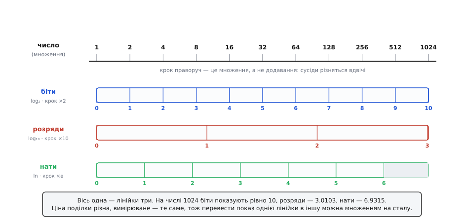
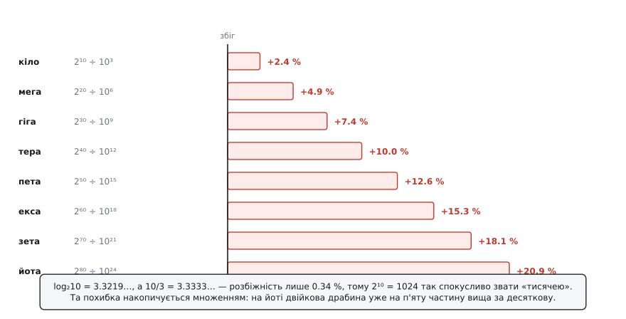

# 🧮 Перехід між основами

Формулу переходу подають зазвичай як річ, яку просто беруть і запам'ятовують:

```
log_b M = log_a M / log_a b
```

Запам'ятати неважко. Але за таким поданням лишаються дві невидимі речі, і обидві цікавіші за саму формулу. Перша — **звідки вона взагалі береться**. Друга, глибша — **чому переходу вистачає одного-єдиного числа**. Адже логарифми за різними основами виглядають як різні функції; чому ж, щоб перебратися від однієї до іншої, досить помножити на сталу — не додати щось, не викривити, не перерахувати наново?

Відповідь на друге питання пояснює перше. Тож почнімо з нього.

## Логарифм міряє не число

Візьмімо звичайну лінійку — ту, якою міряють дошку. Працює вона так: приклали, полічили поділки, сказали «сто двадцять». І тут варто зауважити річ, повз яку зазвичай проходять: число 120 не є властивістю дошки. Це **спільне твердження** про дошку й про лінійку. Замінили лінійку на дюймову — дошка та сама, число інше.

З логарифмом усе так само, тільки лічать не кроки вздовж, а **множення**.

Ось у чому суть. Логарифм не міряє число. Він міряє, **як далеко число стоїть від одиниці, якщо йти до нього множенням**. А основа каже єдину річ: **що вважати одним кроком**.

- основа 2 — крок є подвоєння;
- основа 10 — крок є множення на десять;
- основа e — крок є множення на e.

Три лінійки. Одна відстань.


*Числа розставлено на множинній осі: крок праворуч — це не «додати», а «помножити на два». Під віссю — три лінійки, прикладені до тієї самої відстані, з різною ціною поділки. На числі 1024 біти показують рівно 10, десяткові розряди — 3.0103, нати — 6.9315. Показ різний, вимірюване одне.*

Тепер видно, чому переходу вистачає сталої. Усі три лінійки міряють **те саме** — ту саму відстань уздовж тієї самої осі. Різняться вони лише **ціною поділки**. А коли два вимірювачі прикладені до однієї величини й відрізняються тільки ціною поділки, перевести показ одного в показ другого можна єдиним способом — помножити на відношення поділок. Нічому іншому там просто немає місця.

## Формула як бухгалтерія одиниць

Запишімо цю думку буквально — так, як переводять одиниці.

Скільки коштує один b-крок, виміряний a-кроками? Це й є log_a b — «на скільки a-кроків тягне одне множення на b». Скажімо, log₂10 ≈ 3.3219: одне множення на десять важить трохи більше за три з третиною подвоєння.

Далі — звичайна арифметика «кількість × ціна»:

```
(скільки b-кроків до M) · (a-кроків в одному b-кроці) = (скільки a-кроків до M)

        log_b M         ·          log_a b            =         log_a M
```

Поділіть обидва боки на log_a b — і маєте формулу переходу. По суті вона нічого не доводить, а лише **записує** те, що лінійка одна, а поділки різні.

Аналогія з лінійкою чесна, але має межу, і межа ця повчальна. Коефіцієнти переведення фізичних одиниць люди **призначають**. Дюйм дорівнює 2.54 сантиметра **точно** — не приблизно: 1 липня 1959 року шість країн підписали угоду про міжнародні ярд і фунт, поклали ярд рівним 0.9144 метра, і дюйм став рівно 2.54 см за домовленістю. Число гарне, бо його **вибрали** гарним.

З логарифмами так не вийде. Тут коефіцієнт не призначають — його **диктує арифметика**. І він майже завжди виявляється числом, якого не запишеш дробом, хоч скільки домовляйся.

## Два рядки

Формальний бік справді короткий — рівно два рядки. Візьмімо конкретику: двійку й натуральний логарифм.

```
N = log₂M          ⇔     2ᴺ = M              ← це просто означення log₂
ln(2ᴺ) = ln M      →     N · ln 2 = ln M     ← логарифм степеня
                         N = ln M / ln 2
```

Перший рядок не робить нічого — він переписує означення іншими словами. Уся робота в другому, у переході від ln(2ᴺ) до N · ln 2. Спинімося саме тут, бо тут заховано все.

**Чому log(bᴺ) = N · log b?** Бо bᴺ — це b, помножене саме на себе N разів, а логарифм перетворює множення на додавання:

```
log(x · y) = log x + log y
```

Отже:

```
log(b · b · … · b)  =  log b + log b + … + log b  =  N · log b
    └── N разів ──┘      └────── N доданків ─────┘
```

**А чому логарифм перетворює множення на додавання?** Бо показники додаються:

```
a^p · a^q = a^(p+q)
```

А це вже не теорема, а лічба: помножити на a п'ять разів, а тоді ще три — це помножити на a вісім разів разом. Більше там нічого немає.

Ось увесь ланцюжок, до самого дна: лічба множень → показники додаються → логарифм міняє × на + → log(bᴺ) = N · log b → перехід між основами. Жодної вищої математики; перехід між основами — наслідок того, що множення можна лічити.

Загальний вигляд той самий, тільки замість двійки будь-яке b, а замість ln — логарифм за будь-якою основою a:

```
N = log_b M   ⇔   bᴺ = M   →   log_a(bᴺ) = log_a M   →   N · log_a b = log_a M

                                                          N = log_a M / log_a b
```

## Взаємні числа

З формули негайно випадає ще одна, якщо підставити M = a:

```
log_b a = log_a a / log_a b = 1 / log_a b        (бо log_a a = 1)

              log_a b · log_b a = 1
```

Перевірмо на двійці з десяткою:

```
log₂10 · log₁₀2 = 3.321928094887362 · 0.3010299956639812 = 1.0
```

У мові лінійок це самоочевидно: якщо один десятковий розряд коштує 3.3219 біта, то один біт коштує 1/3.3219 = 0.30103 розряду. Формула лише записала те, що й так зрозуміло.

## Звідки береться 1.4427

Тепер власне число. У рівності

```
log₂M = ln M / ln 2 = (1 / ln 2) · ln M
```

M довільне, тож усе, що від M не залежить, і є той сталий множник:

```
ln 2     = 0.6931471805599453…
1 / ln 2 = 1.4426950408889634…
```

Отже, 1.4427 — не самостійна стала й не константа з власною біографією. Це просто **одиниця, поділена на ln 2**. Уся її загадковість зникає, щойно спитати, що вона означає на лінійці: **один нат — це 1.4427 біта**.

Ось усі чотири числа, які тут узагалі бувають потрібні, разом із їхнім читанням:

```
1 / ln 2 = 1.442695…      1 нат ................. 1.4427   біта
ln 2     = 0.693147…      1 біт ................. 0.6931   ната
log₂10   = 3.321928…      1 десятковий розряд ... 3.3219   біта
log₁₀2   = 0.301030…      1 біт ................. 0.30103  розряду
```

Пари стоять взаємні: 1.4427 = 1/0.6931, а 3.3219 = 1/0.30103. Запам'ятовувати варто одне число з пари — друге здобувається діленням.

> 🔧 **Навіщо це.** Читати ці сталі як **ціну переведення** — не педантизм, а спосіб не помилитися в бік. Питання «то множити чи ділити на 3.3219?» заганяє в глухий кут, доки числа безіменні. Але щойно вимовлено «один розряд — це 3.3219 біта», напрямок стає очевидним: у п'ятнадцятизначного десяткового числа буде близько 15 · 3.3219 ≈ 50 бітів, бо **бітів більше** — вони дрібніші. Дрібніша поділка — більше поділок; ця думка рятує від перевернутого множника надійніше за будь-яке завчене правило.

## Чому ці числа такі негарні

Питання напрошується: невже не можна інакше? Може, 1.4427 — просто наслідок невдалого вибору, і за іншої пари основ вийшло б щось чемне?

Ні. І це не про невезіння, а про теорію чисел.

**Твердження: log₂10 — ірраціональне.**

Припустімо навпаки: нехай його можна записати дробом.

```
log₂10 = p/q,   p, q — цілі додатні
2^(p/q) = 10                        ← означення логарифма
2^p = 10^q                          ← піднесли обидва боки до степеня q
```

Тепер погляньмо на цю рівність очима простих множників. Ліворуч — чистий степінь двійки: у ньому немає нічого, крім двійок, і **п'ятірки немає напевно**. Праворуч — 10^q = 2^q · 5^q, а q ≥ 1, тож **п'ятірка там є**. Одне й те саме число не може водночас мати й не мати множника 5: за [основною теоремою арифметики](topic:math-number-theory/fundamental-theorem-arithmetic) кожне ціле, більше за одиницю, розкладається в добуток простих одним-єдиним способом (з точністю до порядку множників). Тобто п'ятірка в числі або є, або її немає, і третього не дано. Суперечність. Отже, дробом log₂10 не записується.

Той самий доказ проходить для будь-якої пари основ із різними простими множниками. Раціональним log_a b буває лише тоді, коли a і b — степені **спільного** цілого: скажімо, log₈32 = 5/3, бо і вісімка, і тридцять два виросли з двійки (8 = 2³, 32 = 2⁵). Двійка й десятка спільного кореня не мають — п'ятірка в десятці стоїть на заваді. Тому їхнє відношення й приречене бути нескінченним неперіодичним дробом.

**Ще глибше.** Ірраціональність — не найгірше. Обидві наші сталі **трансцендентні**: вони не є коренем жодного многочлена з раціональними коефіцієнтами, тобто їх не здобути ні дробом, ні коренем, ні жодною скінченною алгебраїчною формулою.

Для ln 2 це наслідок теореми Ліндемана–Ваєрштрасса (ключовий випадок довів Фердинанд фон Ліндеман 1882 року, узагальнив Карл Ваєрштрасс 1885-го): для будь-якого ненульового алгебраїчного α логарифм ln α або дорівнює нулю, або трансцендентний. Двійка алгебраїчна (корінь рівняння x − 2 = 0), а ln 2 ≠ 0 — отже, ln 2 трансцендентний.

Для log₂10 це наслідок теореми Гельфонда–Шнайдера, яку 1934 року незалежно один від одного довели радянський математик Олександр Гельфонд і німець Теодор Шнайдер: для ненульових алгебраїчних α і γ відношення ln γ / ln α або раціональне, або трансцендентне. Раціональним воно, як щойно доведено, не є — лишається трансцендентність.

Практичний висновок звідси рівно один, зате твердий: **шукати гарний вигляд для 1.4427 чи 3.3219 марно**. Їх не спростить ні хитріший доказ, ні вдаліша нотація. Це не тимчасова незручність, а властивість самих чисел.

## Чому 1024 і 1000 ніколи не зійдуться

У щойно доведеної ірраціональності є несподівано побутовий наслідок. Перепишімо її так: рівняння

```
2ⁿ = 10ᵏ
```

не має розв'язків у цілих додатних n і k — бо якби мало, log₂10 дорівнював би дробові k/n. Отже, двійкова й десяткова драбини, розійшовшись від спільної одиниці, **більше не перетинаються ніде й ніколи**.

Ось справжня причина плутанини з кілобайтом. Це не недбальство інженерів і не забаганка маркетологів: «кіло» як 1000 і «кіло» як 1024 несумісні **в принципі**, і жодна старанність їх не помирить.

Тоді чому плутанина взагалі виникла? Бо 10/3 = 3.3333… — непогане наближення до log₂10 = 3.3219…, розбіжність усього 0.34 %. Іншими словами, 2¹⁰ = 1024 і 10³ = 1000 стоять так близько, що спокуса назвати їх одним словом майже нездоланна. Близько — але не разом. А похибка наближення накопичується **множенням**:


*Кожен наступний префікс — це ще одне множення на 1.024, тож двійкова драбина відходить від десяткової дедалі далі. На кілобайті розбіжність 2.4 % — дрібниця; на терабайті вже 10 %; на йотабайті двійкова драбина вища за десяткову на п'яту частину.*

```
2¹⁰ ÷ 10³  = 1.024000    +2.4 %     кіло
2²⁰ ÷ 10⁶  = 1.048576    +4.9 %     мега
2³⁰ ÷ 10⁹  = 1.073742    +7.4 %     гіга
2⁴⁰ ÷ 10¹² = 1.099512   +10.0 %     тера
2⁸⁰ ÷ 10²⁴ = 1.208926   +20.9 %     йота
```

На кілобайті різниця в 2.4 % — дрібниця, на яку свого часу махнули рукою. На терабайті це вже 10 %: саме звідси беруться скарги, що «диск на 2 ТБ показує 1.82 ТБ». Диск чесний — просто виробник лічить десятковими тера (2 · 10¹² байтів), а система показує двійкові (2 · 10¹² / 2⁴⁰ = 1.819).

Щоб розрубати цей вузол, Міжнародна електротехнічна комісія запропонувала 1996 року окремі двійкові префікси — кібі, мебі, гібі (KiB, MiB, GiB); міжнародним стандартом вони стали в січні 1999-го, поправкою 2 до IEC 60027-2. Ідея проста: якщо два значення несумісні, дайте їм різні імена — бо серед [префіксів СІ](topic:math-numeric/si-prefixes), де кожен префікс є степенем десятки, «кіло» завжди означало й означає рівно тисячу, і претендувати на 1024 воно не може.

## Скільки десяткових цифр у n-бітному числі

Друге місце, де перехід між основами працює щодня, — розмір буфера під друк числа.

**Умова: скільки десяткових цифр треба, щоб надрукувати будь-яке 64-бітове беззнакове число?**

```
цифр = ⌈n · log₁₀2⌉

64 · 0.3010299956639812 = 19.265919722494797
⌈19.2659…⌉ = 20 цифр
```

Перевірка прямою лічбою: найбільше 64-бітове число — 18446744073709551615, і в ньому справді 20 цифр.

У мові лінійок формула читається легко: один біт коштує 0.30103 розряду, тож 64 біти коштують 19.27 розряду, а розряди беруть цілими й тільки вгору. Але чому округлення вгору **завжди** правильне? Ось де ірраціональність, доведена вище, робить справжню роботу.

Кількість цифр числа m дорівнює ⌊log₁₀m⌋ + 1. Найбільше n-бітове число — це 2ⁿ − 1, тож:

```
цифр = ⌊log₁₀(2ⁿ − 1)⌋ + 1
```

Тепер ключовий крок. Хотілося б замінити незручне 2ⁿ − 1 на кругле 2ⁿ. Замінити можна тоді й лише тоді, коли між ними не заховався степінь десятки, — інакше ⌊·⌋ стрибнув би на одиницю. Але степінь десятки там не заховається **ніколи**: рівність 2ⁿ = 10ᵏ неможлива, і це рівно те, що доведено вище. Отже:

```
⌊log₁₀(2ⁿ − 1)⌋ = ⌊n · log₁₀2⌋
```

Лишилося останнє. Число n · log₁₀2 при n ≥ 1 ірраціональне (якби воно було дробом, дробом був би й сам log₁₀2), а для ірраціонального x завжди ⌈x⌉ = ⌊x⌋ + 1 — бо в ціле воно влучити не може. Тому:

```
цифр = ⌊n · log₁₀2⌋ + 1 = ⌈n · log₁₀2⌉
```

Ось і вся формула. І варто помітити, що саме її тримає: **ірраціональність log₁₀2 тут не завада, а підпора**. Якби двійка й десятка десь сходилися, стеля в цій формулі ламалася б рівно в точках збігу й довелося б виписувати окремий випадок. Того випадку немає саме тому, що збігу не буває.

Практичний висновок: буфер під 64-бітове беззнакове — 20 цифр плюс завершальний нуль, тобто 21 байт. Під знакове рівно стільки ж, тільки складене інакше: ⌈63 · log₁₀2⌉ = 19 цифр, мінус і нуль.

## Пастка: не рахуйте log₂ через ln

І тут-таки — місце, де перехід між основами найчастіше кусає.

У математиці рівність log₂M = ln M / ln 2 **точна**. У машині — ні, і причина видна просто зі складу дійових осіб: ln M та ln 2 обидва ірраціональні, тобто в пам'ять жодне з них не лягає точно. Обидва округлюються, а тоді ще й діляться одне на одне. Частка двох округлених чисел не зобов'язана влучити в ціле — навіть коли математика запевняє, що там рівно ціле.

Це не теорія:

```
ln(2²⁹) / ln 2 = 29.000000000000004        ← а мало бути рівно 29
⌈29.000000000000004⌉ = 30                  ← зайвий біт зі стелі
log2(2²⁹) = 29.0 рівно     →     ⌈29.0⌉ = 29
```

У діапазоні 64-бітових степенів двійки цей шлях на звичайній реалізації промахується на дев'яти показниках: 29, 31, 39, 47, 51, 55, 58, 59, 62. Дев'ять із шістдесяти трьох — кожен сьомий, і всі вони саме там, де в техніці стоять межі.

Прикметно, що промах тут **однобокий**: усі дев'ять значень виходять трохи **більшими** за ціле. Тому ⌊·⌋ це переживає, а ⌈·⌉ — ні. А ⌈log₂M⌉ — рівно та формула, що відповідає на питання «скільки бітів під M значень». Тобто ламається саме той бік, яким користуються найчастіше.

:::tabs
```cpp
#include <cmath>
#include <cstdint>

// ✗ Перехід між основами просто в коді: два округлені ірраціональні числа й ділення
double log2_via_ln(std::uint64_t n) {
    return std::log(static_cast<double>(n)) / std::log(2.0);
}
// n = 2²⁹ → 29.000000000000004 → std::ceil(…) → 30, зайвий біт

// ✓ Виділена функція: ділення немає, отже немає й зайвого округлення
double log2_direct(std::uint64_t n) {
    return std::log2(static_cast<double>(n));
}
// n = 2²⁹ → рівно 29.0 → std::ceil(…) → 29
```
```py
import math

# ✗ Перехід між основами просто в коді.
#   Увага: math.log(n, 2) — це те саме ділення всередині, з тією ж вадою
def log2_via_ln(n: int) -> float:
    return math.log(n) / math.log(2)
# n = 2**29 → 29.000000000000004 → math.ceil(…) → 30, зайвий біт

# ✓ Виділена функція: ділення немає
def log2_direct(n: int) -> float:
    return math.log2(n)
# n = 2**29 → рівно 29.0 → math.ceil(…) → 29
```
:::

Саме заради цього в C99 завели окрему `log2()` — доти в `<math.h>` були тільки `log()` і `log10()`, і двійкову основу доводилося добувати діленням. Це не зручність, а виправлення: спеціалізована функція рахує логарифм за двійкою **прямо**, не проходячи через дві округлені сталі. З тієї ж причини Python має окрему `math.log2`, і саме тому `math.log(n, 2)` їй не рівня — під капотом там те саме ділення й та сама вада.

Два чесних застереження до цієї поради.

Перше: стандарт не вимагає, щоб `log` була **правильно заокруглена**, тож точний перелік показників, на яких ділення промахується, залежить від бібліотеки й платформи. Тобто це не той дефект, який можна обійти, вивчивши напам'ять дев'ять поганих значень: ненадійний тут не конкретний випадок, а **сам підхід**.

Друге: `log2()` лікує тільки хворобу ділення. Дійсна арифметика має власну стелю — [числа з рухомою комою](topic:hw-arch/floating-point) подвійної точності тримають лише 53 значущі біти мантиси, тож великі цілі в них уже не лягають точно й округлюються до сусіднього подання. Тому надійна відповідь на питання «скільки бітів» узагалі не проходить через дійсні числа: позицію старшої одиниці читають цілочислово — `std::bit_width` у C++, `bit_length` у Python, — і жодного логарифма там не обчислюється.

> 🔧 **Навіщо це.** Правило коротке: **перехід між основами — інструмент паперу, а не коду**. На папері він точний і безкоштовний. У машині це два округлені ірраціональні числа й ділення, яке псує саме ті випадки, заради яких формулу й брали, — точні степені двійки. Тому в коді: є `log2` — беріть `log2`; потрібна ціла відповідь «скільки бітів» — не беріть логарифм узагалі, читайте позицію старшого біта цілочислово. А формулу переходу лишіть для того, що вона вміє найкраще: пояснити, звідки взялося 1.4427, і перевести розряди в біти в голові.

## Чому в O(log n) основу не пишуть

Наостанок — дрібниця, але приємна. Перехід між основами пояснює, чому в оцінках складності основу логарифма зазвичай не вказують узагалі:

```
log_b n = log_a n · (1 / log_a b)
                     └─ стала, від n не залежить ─┘
```

Множник 1/log_a b від n не залежить, а O-нотація сталі множники ковтає. Тому O(log₂n), O(log₁₀n) і O(ln n) буквально позначають одну й ту саму множину функцій, і писати основу немає сенсу — вона нічого не додає. Звичка опускати основу в O(log n) — не недбальство, а **дозвіл**, виданий саме цією формулою. Межа дозволу читається з неї ж: стала зникає лише під знаком O, а в будь-якому виразі, який доводять до числа, вона нікуди не дівається.

## Одна крива

Формула переходу — з тих, що виглядають технічними, а насправді світоглядні. Вона каже, що логарифмів **не багато, а один**: одна крива, одна дія, один спосіб міряти, як далеко число відійшло від одиниці множенням. Основи — то лінійки, прикладені до тієї самої відстані, а всі ці 1.4427 і 3.3219 — ціни їхніх поділок, і ні на що більше вони не претендують.

І та сама формула чесно показує, чого коштує зміна лінійки. Ціни поділок виходять ірраціональні, ба навіть трансцендентні: тому двійкова драбина з десятковою не зійдуться ніде, тому кілобайт назавжди лишиться сваркою двох значень, тому ⌈n · log₁₀2⌉ дає точну кількість цифр — і тому ж машинне ділення двох логарифмів промахується саме на круглих степенях двійки. Одне число переводу — і ціла низка наслідків, з якими живе кожен, хто лічить біти.
