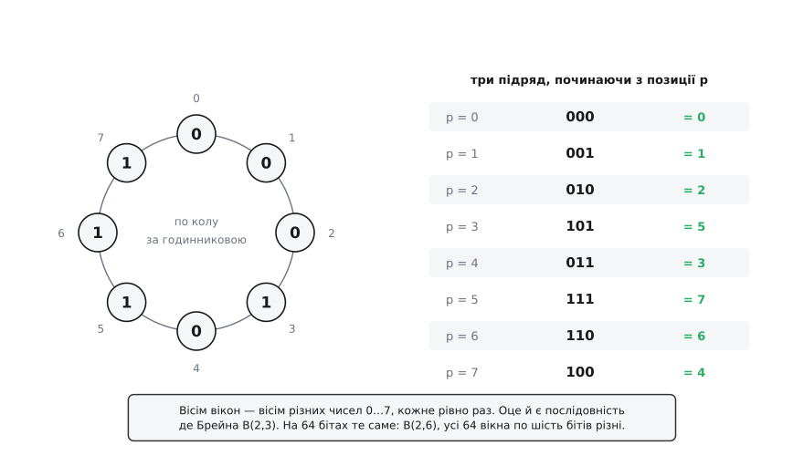
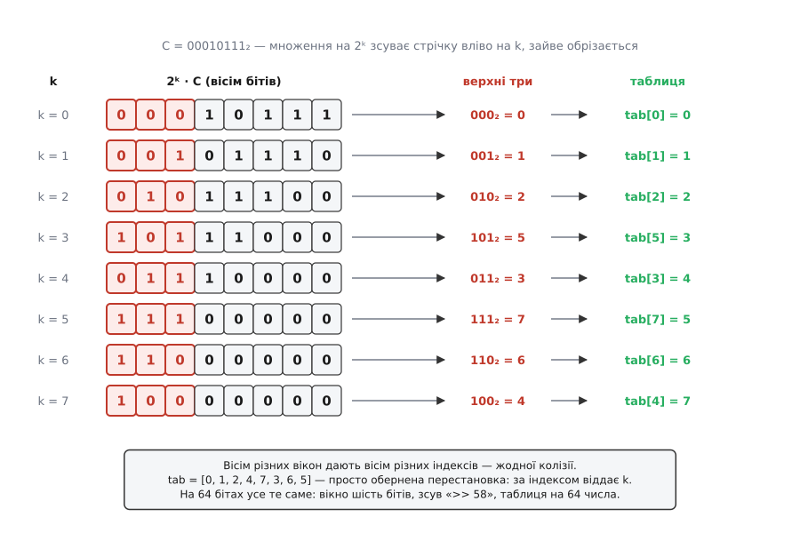
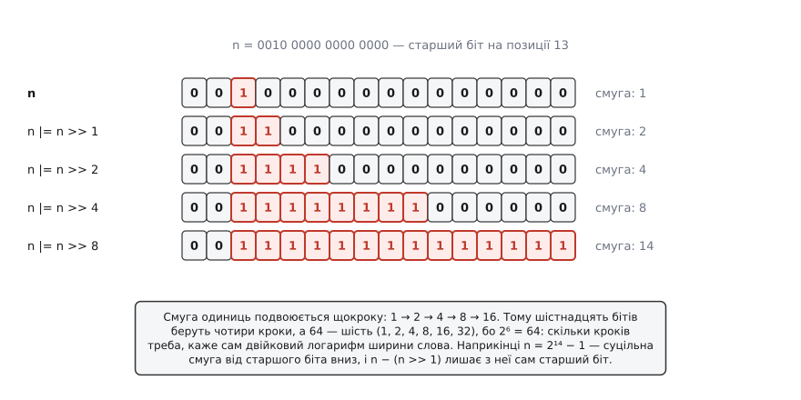

# ⚙️ ilog2 за лічені такти: розгорнутий цикл і послідовність де Брейна

Почнімо з попередження, без якого вся ця вставка перетворюється на шкідливу пораду. На x86-64 і на будь-якому ARM, починаючи з ARMv7, позиція старшого одиничного біта дістається **однією інструкцією** — `LZCNT`, `BSR`, `CLZ`. Компілятор підставляє її сам, щойно бачить `std::countl_zero` чи `u64::ilog2`. Жоден прийом звідси таку відповідь не пришвидшить: змагатися з однією інструкцією просто нічим.

То навіщо вони? Бо «одна інструкція» — це властивість не мови, а **цілі складання**. ARMv6-M — набір інструкцій ядер Cortex-M0 і M0+ — інструкції `CLZ` не має зовсім: вона з'явилася в Thumb аж у ARMv7-M. Написавши там `__builtin_clz`, ви дістанете не інструкцію, а **виклик** `__clzsi2` з libgcc: пролог, цикл, епілог. Тобто найповільніший із можливих варіантів — і саме там, де тактів найменше. Другий випадок: стандартну бібліотеку хтось мусить написати, і її портативний шлях складається рівно з цих прийомів. Третій, найчастіший: щоб довіряти вбудованому засобу, варто знати, що він робить.

А ще — за цим ховається несподівано гарна математика. Головний прийом стоїть на комбінаторному об'єкті, який спершу здається зайвим, а виявляється точно припасованим до задачі.

## Задача

Дано ціле беззнакове n завширшки 64 біти, n > 0. Знайти k = ⌊log₂n⌋ — позицію старшого одиничного біта, лічба з нуля. Дійсна арифметика заборонена: `double` тримає 53 значущі біти й на межах степенів двійки бреше. Апаратної інструкції теж немає — вважаймо, що ми на Cortex-M0 або всередині портативної реалізації.

Мірятимемо не абстрактну складність, а дві конкретні речі: **скільки операцій** виконується і **якої довжини ланцюг залежностей** — тобто скільки з цих операцій мусять чекати одна одну, бо кожна наступна бере результат попередньої. Друге число часто важить більше за перше: незалежні операції процесор виконує паралельно, залежні — ніколи.

## База: цикл, що знімає по біту

Найпряміша відповідь на «скільки разів n ділиться навпіл, доки не зникне»:

```cpp
// ⌊log₂n⌋ для n > 0; на нулі поверне −1
int floor_log2_naive(std::uint64_t n) {
    int k = -1;
    while (n) { n >>= 1; ++k; }
    return k;
}
```

Код правильний, і саме тому він корисний як еталон для звірки. Але як робочий — поганий, і одразу з двох причин.

Перша очевидна: ітерацій рівно ⌊log₂n⌋ + 1, тобто для великих чисел до 64. Кожна — зсув, інкремент, перевірка, стрибок.

Друга тонша й гірша. Кількість проходів залежить **від значення** n, тому передбачувач переходів приречений схибити на виході з циклу, а на непередбачуваній гілці процесор викидає весь спекулятивний хвіст. Тут варто знати одну річ про [передбачення переходів](topic:hw-arch/branch-prediction): гілка коштує нуль тактів, поки її вгадують правильно, і десятки тактів на промаху, бо конвеєр доводиться спорожняти й наповнювати заново. Цикл зі змінною кількістю проходів — це гарантований промах на кожному виклику.

Є й третій бік, про який згадують рідше: час виконання **видає дані**. Якщо n — секрет, наївний цикл розповідає про нього кожному, хто вміє дивитися на годинник.

## Прийом перший: розгорнутий цикл зсувів

Ідея з'являється, щойно поглянути на **відповідь**, а не на вхід. Наївний цикл знімає по одному біту **входу** — а входу до шістдесяти чотирьох бітів. Тим часом відповідь — число від 0 до 63, тобто рівно шість бітів. Тож шукаймо по одному біту **відповіді** за крок: шість кроків замість шістдесяти чотирьох, і це просто двійковий пошук по позиції.

Питання першого кроку: «чи є хоч щось у верхній половині слова, у бітах 32…63?» Якщо так — старший біт n стоїть не нижче за 32, тож у відповіді розряд, що важить 32, дорівнює одиниці, і нижню половину можна викинути зсувом. Якщо ні — половина відпадає задарма. Далі те саме з 16, 8, 4, 2, 1: щоразу питання відрізає половину решти й називає один розряд відповіді.

:::tabs
```cpp
// ⌊log₂n⌋ для n > 0 — двійковий пошук по позиції старшого біта
constexpr int floor_log2_unrolled(std::uint64_t n) {
    int k = 0;
    if (n >= std::uint64_t{1} << 32) { n >>= 32; k += 32; }
    if (n >= std::uint64_t{1} << 16) { n >>= 16; k += 16; }
    if (n >= std::uint64_t{1} <<  8) { n >>=  8; k +=  8; }
    if (n >= std::uint64_t{1} <<  4) { n >>=  4; k +=  4; }
    if (n >= std::uint64_t{1} <<  2) { n >>=  2; k +=  2; }
    if (n >= std::uint64_t{1} <<  1) {           k +=  1; }
    return k;
}
```
```rust
/// ⌊log₂n⌋ для n > 0 — двійковий пошук по позиції старшого біта
fn floor_log2_unrolled(mut n: u64) -> u32 {
    let mut k = 0;
    if n >= 1 << 32 { n >>= 32; k += 32; }
    if n >= 1 << 16 { n >>= 16; k += 16; }
    if n >= 1 << 8  { n >>= 8;  k += 8;  }
    if n >= 1 << 4  { n >>= 4;  k += 4;  }
    if n >= 1 << 2  { n >>= 2;  k += 2;  }
    if n >= 1 << 1  {           k += 1;  }
    k
}
```
:::

Шість кроків замість шістдесяти чотирьох — і, що важливіше, **рівно шість завжди**, незалежно від n. Час перестав залежати від значення, а разом із ним зникла і непередбачувана гілка, і витік через годинник.

Кількість кроків тут не випадкова: їх стільки, скільки бітів у відповіді, тобто log₂64 = 6. Двійковий логарифм сам каже, скільки коштує його знайти.

Слово «гілка» у цьому коді, до речі, здебільшого оманливе. Кожне `if` має тіло на дві дешеві операції без побічної дії, тому компілятор рахує обидві вітки й вибирає результат умовним пересиланням — `CMOVcc` на x86, `CSEL` на ARM. Стрибків у машинному коді не лишається взагалі. Це і є та властивість, заради якої розгортання робилося: не «менше ітерацій», а «нема чого вгадувати».

Один рядок вартий окремої уваги — `std::uint64_t{1} << 32`. Написати тут `1 << 32` не можна: `1` має тип `int`, зсув 32-бітного `int` на 32 позиції — невизначена поведінка, і компілятор вправі зробити з цим що завгодно. Rust таку помилку ловить сам: у `n >= 1 << 32` тип літерала виводиться з порівняння й стає `u64`, а спроба зсунути `i32` на 32 позиції не пройшла б компіляцію.

## Прийом другий: множення на послідовність де Брейна

Шість кроків розгорнутого циклу — це шість **залежних** кроків: кожен зсуває те, що лишив попередній. Ланцюг завглибшки шість, і скоротити його, лишаючись у логіці «відрізаємо по половині», неможливо.

Тож треба інша логіка. Мета зухвала: **одне множення, один зсув, одне читання таблиці** — і відповідь.

### Множення на сталу — це зсув

Уся будова тримається на спостереженні, банальному до образливості. Якщо в числі рівно **один** одиничний біт, тобто n = 2ᵏ, то множення на будь-яку сталу C — це просто зсув:

```
2ᵏ · C = C << k
```

Множення не перемішує C, а **прокручує** її на k позицій уліво. Тепер візьмімо верхні шість бітів добутку — `(2ᵏ · C) >> 58`. Це шестибітове вікно, вирізане з C, і воно з'їхало рівно на k. Різне k — різне місце вікна.

Звідси випливає все інше. **Якщо стала C така, що всі її шестибітові вікна різні, то вікно однозначно називає k.** Вікно — це шість бітів, тобто число 0…63. Позицій теж 64. Значить, ідеться про відображення 64 позицій у 64 значення без жодної колізії: ідеальний хеш, що вміщається в одне множення.

Лишається питання, чи існує така стала. Шістдесят чотири вікна по шість бітів у 64-бітовому числі неминуче накладаються одне на одне — сусідні ділять аж п'ять бітів із шести. І при цьому всі 64 мусять бути різні. Звучить як забагато.

### Що таке послідовність де Брейна

Такі сталі існують, і в них є ім'я. Циклічна двійкова послідовність довжини 2ⁿ, у якій **кожне** з 2ⁿ можливих n-бітових слів трапляється рівно раз, зветься послідовністю де Брейна B(2, n). Для n = 6 це рівно 64 біти — тобто рівно машинне слово. Збіг настільки доречний, що аж підозрілий: об'єкт, придуманий у чистій комбінаториці, лягає в регістр без жодного залишку.

Найлегше побачити її на іграшковому масштабі — B(2, 3): вісім бітів, вікно три.


*Вісім бітів 00010111, замкнені в коло. Читаємо по три підряд, починаючи з кожної позиції, — і жодне число з 0…7 не повторюється й жодного не бракує. Вісім вікон, вісім різних значень. Те саме на 64 бітах: B(2,6), усі 64 вікна по шість бітів різні.*

Тут корисно знати, що це не поодинокий трюк, а [ціла родина об'єктів зі своєю теорією](topic:math-combinatorics/de-bruijn-sequence): послідовності де Брейна існують для будь-якого алфавіту й будь-якої довжини вікна, їх уміють будувати кількома способами й уміють рахувати. Останнє дає число, від якого відлягає:

```
кількість B(2, n) = 2^(2ⁿ⁻¹ − n)

для n = 6:  2^(2⁵ − 6) = 2^(32 − 6) = 2²⁶ = 67 108 864
```

Придатних сталих, отже, десятки мільйонів, і жодна з них не «та єдина магічна».

Історія назви — окрема й повчальна. 1946 року нідерландський математик Ніколас Ґоверт де Брейн довів гіпотезу свого співвітчизника Кейса Постгумуса про кількість таких послідовностей, і відтоді вони звуться його ім'ям. Але 1975 року де Брейн сам надрукував **визнання пріоритету**: той самий результат для двійкового випадку отримав ще 1894 року француз Каміль Флай Сент-Марі, відповідаючи на задачу, яку того ж таки року поставив А. де Рів'єр у журналі «L'Intermédiaire des Mathématiciens». Проміжна ланка теж була загубилася: 1934 року існування для довільного алфавіту довів американець Монро Мартін у праці «A problem in arrangements», і про неї надовго забули. Ім'я в назві, отже, вказує на того, хто зробив задачу відомою, а не на першого, хто її розв'язав, — і сам де Брейн наполіг, щоб це було записано. Згадують іще й санскритську мнемоніку *yamātārājabhānasalagām*, яка кодує саме B(2,3); статус цієї згадки чесніше назвати непідтвердженим: найдавніше документоване джерело — книжка Чарлза Філіпа Брауна 1869 року, де рядок названо давнім і приписано Паніні, але жодного підтвердження тій атрибуції немає.

Як таку послідовність побудувати — питання теж не порожнє. Найпрозоріший шлях веде через [теорію графів](topic:math-combinatorics/graph-theory): будуємо граф, де вершини — усі 5-бітові слова, а ребра — 6-бітові, і шукаємо ейлерів цикл, що проходить кожним ребром рівно раз. Цикл існує завжди, а його слід і є шукана послідовність. На практиці зручніший інший спосіб — про нього за хвилину, у коді генератора.

### Чому вікно називає позицію

Тепер видно, як усе складається. Множимо 2ᵏ на сталу — вікно з'їжджає на k. Дивимося у вікно — бачимо число. Число різне для кожного k, бо всі вікна різні. Отже, за числом можна назвати k — треба лише таблиця, яка переведе одне в друге.


*Той самий іграшковий масштаб: C = 00010111₂, вісім бітів, вікно три. Кожен рядок — множення на 2ᵏ, тобто зсув стрічки вліво на k; те, що вилізло за край, обрізається. Верхні три біти щоразу нові, тож індекс щоразу новий, і таблиця просто повертає з нього k. Таблиця — обернена перестановка, більше в ній нічого немає.*

Саму думку — прикласти послідовності де Брейна до пошуку одиниці в машинному слові — надрукували 1998 року Чарльз Лейзерсон, Гаральд Прокоп і Кіт Рендалл із MIT, у короткій праці «Using de Bruijn Sequences to Index a 1 in a Computer Word». Комбінаторному об'єктові на той час було вже сто чотири роки, і всі ці сто чотири він чекав на задачу, для якої його ніхто не вигадував.

### Тонкість, яку зазвичай ховають

Ось місце, де більшість описів мовчки підсовує готову сталу — а насправді саме тут ховається єдина справжня складність.

Послідовність де Брейна **циклічна**: її вікна замикаються в коло, останні заходять на початок. А зсув `C << k` — **не циклічний**: він викидає старші біти геть і підсуває знизу нулі. Для малих k різниці немає, вікно ще всередині сталої. Але щойно k підбирається до кінця, у вікно починають затікати ті підсунуті нулі — і воно вже не дорівнює циклічному вікну послідовності. Гарантія «всі різні» стосувалася циклічних вікон; на порізаних вона не поширюється.

Порятунок простий, коли його побачити. Зсунуті вікна збігатимуться з циклічними, якщо те, що заходить із кола, і так є нулями — тобто якщо послідовність **починається з нулів**. Точний рахунок дає п'ять: потрібно, щоб п'ять найстарших бітів сталої були нульові. Тоді всі 64 вікна від k = 0 до k = 63 збігаються з циклічними, і колізій немає.

Умову легко забезпечити. Кожна B(2,6) містить вікно з шести нулів — рівно раз, бо двічі воно суперечило б означенню. Досить почати послідовність саме з цього вікна: тоді вгорі стоїть шість нулів, а п'яти й вимагали.

Наскільки це критично, видно з рахунку. Візьміть **ту саму** послідовність де Брейна й почніть її з іншого місця — з 64 можливих початків придатними виявляться рівно **два**: той, що дає шість провідних нулів, і наступний за ним, що дає п'ять. Решта шістдесят два дають колізію, тобто дві різні позиції з однаковим індексом і мовчки хибну відповідь на частині входів. Послідовність де Брейна сама по собі — ще не стала; стала — це послідовність **плюс правильний початок**.

### Таблицю не набирають руками

Таблиця — обернена перестановка до відображення «позиція → вікно». Її можна знайти в інтернеті, набрати з екрана й отримати баг, який спрацює на одному вході з шістдесяти чотирьох через півроку. Правильно — обчислити її з самої сталої, тим самим виразом, що стоїть у гарячому коді. Тоді таблиця не може розійтися зі сталою в принципі.

Генератор — задача складання, не виконання: працює раз, швидкодія не важить, важить прозорість і довільна довжина чисел. Тут доречний Python.

```py
M64 = (1 << 64) - 1

def de_bruijn_b2_6() -> int:
    """Найменша лексикографічно послідовність B(2,6), укладена в 64 біти."""
    a, seq = [0] * 12, []

    def gen(t, p):                       # алгоритм Фредриксена — Кесслера — Майорани
        if t > 6:
            if 6 % p == 0:
                seq.extend(a[1:p + 1])
            return
        a[t] = a[t - p]
        gen(t + 1, p)
        for j in range(a[t - p] + 1, 2):
            a[t] = j
            gen(t + 1, t)

    gen(1, 1)
    c = 0
    for bit in seq:                      # seq[0] стає найстаршим бітом
        c = (c << 1) | bit
    return c

C = de_bruijn_b2_6()
assert C.bit_length() == 58, 'угорі мусить бути шість нулів'
print('стала:  0x%016x' % C)             # 0x0218a392cd3d5dbf

tab = [None] * 64
for k in range(64):
    idx = (((1 << k) * C) & M64) >> 58
    assert tab[idx] is None, 'колізія — стала непридатна'
    tab[idx] = k
print('таблиця:', tab)
```

Алгоритм Фредриксена — Кесслера — Майорани будує **найменшу лексикографічно** послідовність де Брейна, зчіплюючи слова Ліндона, довжина яких ділить n, у лексикографічному порядку — це теорема Фредриксена й Майорани 1978 року. Наслідок несподівано приємний: найменша послідовність уже має потрібний початок задарма. Перші два слова Ліндона — «0» і «0…01» — разом дають рівно n провідних нулів, тобто шість для n = 6. Прокручувати нічого не треба, і перший `assert` це підтверджує.

Дві перевірки в коді варті окремого слова. Перша ловить неправильний початок, друга — колізію. Разом вони означають: якщо генератор відпрацював мовчки, стала й таблиця узгоджені за побудовою, а не за чиїмось чесним словом. Саме так і виводять із коду магічні числа — не коментарем «взято з праці 1998 року», а генератором, який те число відтворює на очах.

### Але спершу треба лишити один біт

Уся будова стоїть на «n = 2ᵏ, рівно один одиничний біт». Наше n таким не є: біт старший, а під ним що завгодно. Треба перетворити n на 2ᵏ, не зачепивши позиції старшого біта.

Робиться це у два ходи. Спершу — **розмазати** старший біт донизу, заливши все під ним одиницями:


*Старший біт тече вниз, аж поки не заллє все під собою. Що там було спочатку — байдуже: «або» вміє лише додавати одиниці, тож позиція старшого біта не зрушить, а все нижче стане суцільною смугою. Від початкового числа наприкінці лишається сама його довжина — рівно те, по що ми й прийшли.*

Операція «або» додає одиниці й ніколи не прибирає, тож позиція старшого біта не рухається, а все під ним заповнюється. Наприкінці n перетворилося на суцільну смугу від старшого біта вниз, тобто на 2ᵏ⁺¹ − 1. Другий хід — витягти з цієї смуги сам старший біт:

```
n = 2ᵏ⁺¹ − 1        (після розмазування)
n >> 1 = 2ᵏ − 1
n − (n >> 1) = (2ᵏ⁺¹ − 1) − (2ᵏ − 1) = 2ᵏ
```

Одне віднімання — і в числі лишився один біт, той самий, чию позицію ми шукаємо.

### Повний код

:::tabs
```cpp
#include <array>
#include <cstddef>
#include <cstdint>

// B(2,6), укладена так, що вгорі стоїть її вікно з шести нулів.
// Стала не єдина можлива: таких є 2²⁶ · 2. Ця — найменша лексикографічно.
inline constexpr std::uint64_t DEBRUIJN = 0x0218a392cd3d5dbfULL;

// Таблицю будує компілятор ще до запуску — тим самим виразом, що й гарячий код.
consteval std::array<std::uint8_t, 64> make_table() {
    std::array<std::uint8_t, 64> t{};
    for (std::uint64_t k = 0; k < 64; ++k) {
        const std::uint64_t hash = ((std::uint64_t{1} << k) * DEBRUIJN) >> 58;
        t[static_cast<std::size_t>(hash)] = static_cast<std::uint8_t>(k);
    }
    return t;
}
inline constexpr auto TAB = make_table();

// ⌊log₂n⌋ для n > 0. На нулі НЕ визначено — див. «Пастки».
constexpr int floor_log2_debruijn(std::uint64_t n) {
    n |= n >> 1;   n |= n >> 2;    n |= n >> 4;    // розмазали старший біт донизу:
    n |= n >> 8;   n |= n >> 16;   n |= n >> 32;   // n стало 2ᵏ⁺¹ − 1
    const std::uint64_t msb = n - (n >> 1);        // лишили сам старший біт: 2ᵏ
    return TAB[static_cast<std::size_t>((msb * DEBRUIJN) >> 58)];
}
```
```rust
// B(2,6), укладена так, що вгорі стоїть її вікно з шести нулів.
// Стала не єдина можлива: таких є 2²⁶ · 2. Ця — найменша лексикографічно.
const DEBRUIJN: u64 = 0x0218_a392_cd3d_5dbf;

// Таблицю будує компілятор ще до запуску — тим самим виразом, що й гарячий код.
const fn make_table() -> [u8; 64] {
    let mut t = [0u8; 64];
    let mut k = 0;
    while k < 64 {
        let hash = ((1u64 << k).wrapping_mul(DEBRUIJN) >> 58) as usize;
        t[hash] = k as u8;
        k += 1;
    }
    t
}
const TAB: [u8; 64] = make_table();

/// ⌊log₂n⌋ для n > 0. На нулі НЕ визначено — див. «Пастки».
fn floor_log2_debruijn(mut n: u64) -> u32 {
    n |= n >> 1;   n |= n >> 2;    n |= n >> 4;    // розмазали старший біт донизу:
    n |= n >> 8;   n |= n >> 16;   n |= n >> 32;   // n стало 2ᵏ⁺¹ − 1
    let msb = n - (n >> 1);                        // лишили сам старший біт: 2ᵏ
    TAB[(msb.wrapping_mul(DEBRUIJN) >> 58) as usize] as u32
}
```
:::

Різниця між вкладками — не косметична, і вона повчальна. У C++ множення беззнакових обрізається до 64 бітів **за означенням мови**: переповнення беззнакового типу — це арифметика за модулем 2⁶⁴, і саме на ній тримається весь прийом. Тут доречно нагадати, що таке [модульна арифметика](topic:math-number-theory/modular-arithmetic): рахувати за модулем 2⁶⁴ означає тримати лише остачу від ділення на 2⁶⁴, тобто рівно ті 64 біти, що влізли в регістр, — і в цій арифметиці множення на 2ᵏ справді є зсувом, а «загублені» старші біти не загублені, а законно відкинуті. Rust на те саме дивиться інакше: звичайне `*` у налагоджувальному складанні **панікує** на переповненні, тож обрізання доводиться просити явно — `wrapping_mul`. Це не незручність, а чесність: мова змушує написати, що переповнення тут не помилка, а суть.

## Скільки це коштує насправді

Тепер порахуймо — і результат буде не той, на який усе йшло.

```
розгорнутий цикл:  6 порівнянь + до 6 зсувів + до 6 додавань ≈ 18 операцій
                   ланцюг залежностей — 6 кроків

де Брейн:          розмазування  6 зсувів + 6 «або»           = 12 операцій
                   виділення     1 зсув + 1 віднімання        =  2
                   хеш           множення + зсув + читання    =  3
                                                          разом ≈ 17 операцій
                   ланцюг залежностей — 12 кроків розмазування,
                   далі ще множення (≈3 такти) і читання з L1 (≈4 такти)
```

Операцій приблизно порівну — а ланцюг у де Брейна **вдвічі довший**. Кожен крок розмазування чекає на попередній, і шість пар «зсув-або» вишиковуються в чергу завдовжки дванадцять. Мета «одне множення замість шести кроків» не досягнута: множення справді одне, але перед ним стоїть каскад, довший за все, що ми намагалися замінити.

Висновок незручний, але його краще сказати прямо: **для старшого біта прийом де Брейна зазвичай не виграє в розгорнутого циклу**. Каскад розмазування з'їдає всю економію.

### Де він справді сяє

Річ у тім, що прийом придумували не для старшого біта. Погляньмо на дзеркальну задачу — скільки нулів у хвості числа, тобто позиція **молодшого** одиничного біта. Там виділення одного біта робиться однією фразою:

```
x & −x     — лишає рівно молодший одиничний біт
```

Працює це завдяки [доповняльному кодові](topic:math-number-theory/twos-complement-algebra) — тому самому, у якому від'ємне число записують як ~x + 1. Простежмо за двома ходами. Інвертування обертає нулі під молодшою одиницею на одиниці, а саму одиницю — на нуль. Тоді додавання одиниці біжить угору по тих щойно народжених одиницях, гасить їх назад у нулі й спиняється рівно на тому нулі, лишивши там одиницю. Підсумок: у −x молодша одиниця стоїть на тому самому місці, під нею самі нулі, а над нею все інвертоване. «І» лишає тільки те, що збіглося в обох числах, — а збігається рівно та молодша одиниця, бо нижче в −x нулі, вище — протилежне до x.

Дві операції, ланцюг завглибшки два — замість дванадцяти. Ось тепер множення справді стоїть майже на початку, і прийом окупається сповна.

Так і зробили в стандартній бібліотеці Go, і краще за будь-який аргумент це показує сам її код. У `math/bits` живуть **обидва** підходи — і кожен там, де він доречний:

```go
// нулі в хвості — де Брейн: виділити молодший біт можна за дві операції
const deBruijn64 = 0x03f79d71b4ca8b09

func TrailingZeros64(x uint64) int {
	if x == 0 {
		return 64
	}
	return int(deBruijn64tab[(x&-x)*deBruijn64>>(64-6)])
}

// довжина числа — розгорнутий цикл і таблиця на байт: жодного де Брейна
func Len64(x uint64) (n int) {
	if x >= 1<<32 {
		x >>= 32
		n = 32
	}
	if x >= 1<<16 {
		x >>= 16
		n += 16
	}
	if x >= 1<<8 {
		x >>= 8
		n += 8
	}
	return n + int(len8tab[x])
}
```

`Len64` — це рівно наша задача: `Len64(x)` дорівнює ⌊log₂x⌋ + 1. І де Брейна там немає. Натомість — три кроки розгорнутого циклу, які збивають число до байта, а далі таблиця на 256 записів, що дочитує решту одним зверненням. Третій варіант розкладу: виміняли пам'ять (256 байтів замість 64) на три кроки ланцюга.

Це не здогад про чиїсь наміри, а те, що просто написано в джерелах Go. Автори стандартної бібліотеки, для яких портативний шлях — щоденна робота, дійшли того самого висновку: де Брейн — для хвоста, розгорнутий цикл — для голови.

## Пастки

**Нуль ламає все — і мовчки.** Логарифма нуля не існує, і кожен прийом ламається по-своєму. Наївний цикл поверне −1. Розгорнутий цикл поверне 0 — тобто збреше, вдавши, що старший біт на нульовій позиції. Де Брейн теж поверне 0: розмазування нуля дає нуль, виділення дає нуль, добуток нуль, індекс нуль, а `TAB[0]` містить 0, бо в нашій сталій вікно з шести нулів стоїть саме на позиції 0. Дві різні реалізації дають ту саму хибну відповідь із того самого місця — і жодна не скаржиться. Go не випадково починає `TrailingZeros64` з явного `if x == 0`: перевірку доводиться писати руками, бо звідки їй ще взятися. Або перевірка, або задокументована передумова n > 0 — третього немає.

**Початок сталої.** Найпідступніше з усього. Візьміть послідовність де Брейна звідки завгодно, покладіть у 64 біти «як є» — і з імовірністю 62/64 дістанете колізію. Код скомпілюється, тести на малих числах пройдуть, а на певних входах відповідь буде хибна. Захист — той `assert` у генераторі, що перевіряє провідні нулі, і другий, що ловить колізію.

**Переповнення мусить бути дозволене.** У Rust звичайне `*` панікує в налагоджувальному складанні й мовчки обрізає у випусковому. Це найгірший різновид помилки: у режимі випуску код працює, а тести в режимі налагодження падають — або навпаки, залежно від того, як пощастить. `wrapping_mul` знімає питання назавжди. У C++ обрізання беззнакових гарантоване стандартом, а от **знакове** переповнення — невизначена поведінка, тому `int64_t` тут категорично не годиться.

**Знакові типи ламають і зсув.** `>>` на знаковому від'ємному числі — арифметичний зсув: підсуває зверху одиниці, а не нулі. Розмазування такого числа дасть суцільні одиниці, і відповідь буде 63 незалежно від входу. Уся ця арифметика — тільки для беззнакових типів.

**Таблиця, набрана руками, — невидимий баг.** Шістдесят чотири числа, у яких важить кожне. Помилка в одному спрацює рівно на тих входах, де старший біт стоїть на одній конкретній позиції, — тобто ніколи на малих тестах. Генеруйте таблицю зі сталої; в C++ і Rust це робиться ще на складанні й не коштує жодного такту виконання.

**Сталий час — не безкоштовний.** Розгорнутий цикл після перетворення на `CMOVcc` справді сталий за часом. Де Брейн — ні: він читає таблицю за індексом, що залежить від даних, а це вже [кеш](topic:hw-arch/cache). Тут рятує дрібниця, яку варто зробити навмисно: таблиця з `uint8_t` на 64 записи важить рівно 64 байти — тобто рівно один рядок кеша на x86-64. Вирівняйте її на 64 байти — і будь-який індекс потрапить у той самий єдиний рядок, тож витоку часу через адресу не буде. Без вирівнювання таблиця може лягти на межу двох рядків, і сталий час зникне.

**«Одна інструкція» — не скрізь.** Головна пастка, з якої все й почалося. `__builtin_clz` на ARMv6-M компілюється у виклик `__clzsi2`, і це найповільніший варіант із усіх розглянутих. Перевіряти треба не наміри, а вихід компілятора: `__ARM_FEATURE_CLZ` каже, чи інструкція взагалі є в цілі складання.

## Що обирати

```
є апаратна інструкція (x86-64, ARMv7+)     → вбудований засіб мови, і крапка
                                              std::countl_zero / u64::ilog2
немає інструкції, потрібен старший біт     → розгорнутий цикл зсувів
                                              (коли пам'яті не шкода — плюс таблиця на байт,
                                               як зроблено в Go)
немає інструкції, потрібен молодший біт    → де Брейн: x & −x, множення, таблиця
n секретне, потрібен сталий час            → розгорнутий цикл (CMOVcc, без таблиці)
```

Головне, що варто винести з цієї вставки, — це не сталі й не таблиці. Апаратна інструкція `CLZ` не робить нічого магічного: усередині неї той самий пошук по позиції, лише розгорнутий не в шість кроків у часі, а в дерево вентилів, що спрацьовує за такт. Розгорнутий цикл — та сама думка, записана мовою. А прийом де Брейна показує зовсім інший спосіб думати: замість шукати відповідь **обчисленням**, побудувати ключ, який її просто **називає**, — і по нього збігати в таблицю. Комбінаторний об'єкт із 1894 року виявився ідеальною хеш-функцією для 64 позицій, і те, що він точнісінько влазить у машинне слово, — не збіг: 2⁶ = 64 і тут, і там. Та сама рівність, лише прочитана з двох боків.
