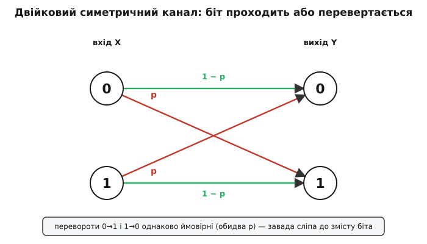
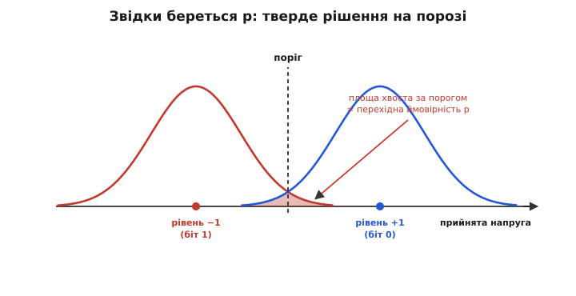
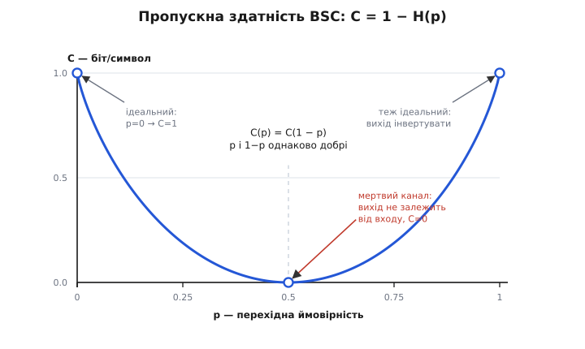
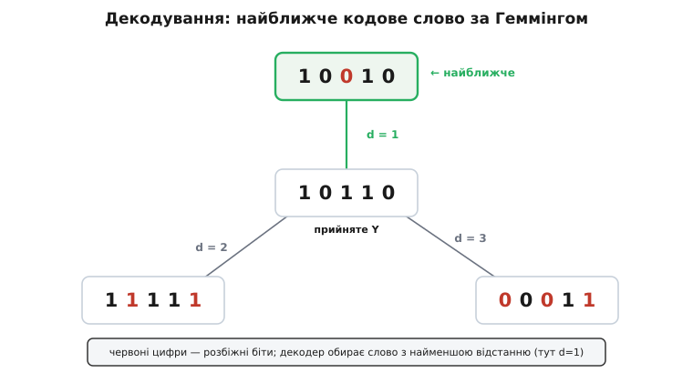

# Двійковий симетричний канал

<preknowlist>
- [Імовірність як міра непевності](topic:math-probability/probability-basics) — що таке ймовірність p (число від 0 до 1), незалежні спроби, «частка з багатьох».
- [Двійковий логарифм](topic:math-information/binary-logarithm) — log₂x питає, у який степінь звести двійку, щоб дістати x; у ньому міряють біти.
- [Ентропія Шеннона](topic:math-information/shannon-entropy) — міра невизначеності в бітах; зокрема двійкова H(p) = −p·log₂p − (1−p)·log₂(1−p) — невизначеність монети з шансом p.
</preknowlist>

Коли приймач уже відфільтрував, підсилив і продетектував сигнал, від усієї фізичної колотнечі лишається сама послідовність бітів. І з окремим бітом може статися рівно дві речі: він або дійде таким, яким був, або **перевернеться** — нуль обернеться на одиницю, одиниця на нуль. Третього немає. Отже найпростіший мислимий цифровий канал — це монета, що зрідка бреше: більшість бітів пропускає чесно, а якусь частку нишком підмінює. Саме цю модель звуть **двійковим симетричним каналом** (англ. *binary symmetric channel*, BSC), і для теорії кодування вона — те саме, що безтертьова площина для механіки: гранично проста сцена, на якій уперше випробовують геть кожну ідею.

### Модель: біт або проходить, або перевертається

Уся модель уміщається в один параметр. Позначмо його **p** — імовірність, що біт дорогою перевернеться (її звуть **перехідною ймовірністю**, англ. *crossover probability*). Тоді з імовірністю 1 − p біт проходить недоторканим. Кожне користування каналом незалежне від інших: канал не пам'ятає, що зробив із попереднім бітом, — щоразу кидає ту саму нечесну монету наново. Таку безпам'ятну поведінку звуть **каналом без пам'яті**.


*Дві прямі стрілки (біт проходить, імовірність 1−p) і дві перехресні (біт перевертається, імовірність p). Симетрія в тому, що обидва перевороти однаково ймовірні: 0→1 так само рідкісний, як 1→0.*

Слово **симетричний** (гр. *symmetría* — сумірність) тут точне й важливе: канал перевертає нуль на одиницю **з тією самою** ймовірністю p, що й одиницю на нуль. Він не має упередження до жодного з бітів — псує їх однаково. Це не дрібниця: бувають і **несиметричні** канали, де одне значення міцне, а інше крихке (скажімо, у деяких видах пам'яті записана одиниця «стікає» в нуль набагато охочіше, ніж навпаки). Тоді P(1→0) ≠ P(0→1), і вся дальша математика ускладнюється. Двійковий симетричний канал — це чистий випадок, коли завада сліпа до змісту біта: їй байдуже, що псувати.

Двійкове (лат. *binarius* — двоскладовий) тут — бо і вхід, і вихід беруть лише два значення, 0 та 1. Отже вся модель — три слова, три припущення: **двійковий** алфавіт, **симетрична** завада, **без пам'яті**. Один-єдиний параметр p вичерпує канал повністю.

### Звідки береться p — за лаштунками аналоговий канал

Виникає природне питання: звідки взагалі беруться перевороти, якщо канал «цифровий»? Насправді жоден канал не цифровий у нутрі. Під BSC завжди ховається неперервна фізична лінія з шумом, і p — це не первинна річ, а **наслідок** того, як приймач розтлумачив брудний аналоговий сигнал.

Погляньмо, як це виходить. Передавач посилає біт не як абстрактний символ, а як певний рівень напруги чи фазу несучої — скажімо, +1 вольт на нуль і −1 вольт на одиницю (це найпростіша фазова модуляція, [BPSK](topic:com-modulation/fsk-psk)). Дорогою [канал з тепловим шумом](topic:math-information/awgn-channel) додає до цього рівня випадкову гаусову добавку, тож приймач бачить не рівне ±1, а розмиту хмару значень навколо нього. Далі він мусить винести **тверде рішення**: узяв прийняту напругу, порівняв із порогом (тут — із нулем) і оголосив «це був нуль» або «це була одиниця». Здебільшого шум малий і рішення правильне. Але зрідка сплеск шуму перекидає напругу за поріг, у чужу область, — і приймач помиляється. Частка таких помилок і є p.


*Під двійковим симетричним каналом — аналоговий шум. Приймач порівнює прийняту напругу з порогом. Здебільшого рішення правильне, але хвіст гаусової хмари, що перелазить за поріг, дає помилку — його площа і є p. Симетрія хмар навколо ±1 робить обидва перевороти однаково ймовірними.*

Тому p — не свавільне число, а пряма функція відношення сигнал/шум: для BPSK у гаусовому шумі перехідна ймовірність дорівнює площі хвоста гаусової кривої за порогом, p = Q(√(2·Eb/N₀)), де Eb/N₀ — енергія на біт відносно щільності шуму. Сильніший сигнал — тонший хвіст — менше p; слабший — товщий хвіст — більше p. Ось звідки береться крива, що зв'язує якість лінії з часткою помилок ([BER проти SNR](topic:com-modulation/ber-snr-curve)).

За цю простоту доводиться платити. Звівши всю багату хмару прийнятих напруг до єдиного «нуль чи одиниця», приймач **викидає** цінну підказку — наскільки він був упевнений. Напруга рівно на порозі й напруга далеко в надрах своєї області обидві стають просто «нулем», хоч довіри до них зовсім різна. Це тверде рішення (*hard decision*) коштує реального програшу: код, що працює з м'якими напругами напряму, виграє в такого, що бачить лише готові біти BSC, приблизно 2 децибели потужності. Тому BSC — модель чесна, але не безплатна: вона зручна саме тому, що відкидає частину інформації, і цю відкинуту частину варто пам'ятати.

### Що p робить із цілим повідомленням

Доля **одного** біта непередбачувана: перевернеться чи ні — чиста випадковість, і наперед не скажеш. А от доля **довгого потоку** передбачувана напрочуд точно. Пошлемо мільйон бітів через канал із p = 0.01 — і зіпсованими виявляться майже рівно десять тисяч, з дуже вузьким розкидом навколо цього числа. Це закон великих чисел у дії: окремий біт — хаос, але частка перевернутих у довгому потоці майже напевно сідає на p. Канал, що на одному біті всемогутній, на мільйоні стає передбачуваним за своїм загальним масштабом.

Саме ця передбачуваність у великому й робить надійний зв'язок можливим. Якби помилки були свавільні без міри, боротися з ними було б нікуди. Але вони мають сталий бюджет — приблизно p·n на n бітів, — а проти відомого бюджету вже можна щось вигадати: додати надлишкові біти рівно стільки, щоб покрити очікувану кількість переворотів. Скільки саме — каже головне число каналу.

### Пропускна здатність: C = 1 − H(p)

Ось найважливіше про BSC — і водночас одна з найкрасивіших формул у всій теорії зв'язку. Скільки корисної інформації можна **надійно** проштовхнути крізь такий канал на кожен переданий біт? Відповідь Шеннона напрочуд прозора:

```
C = 1 − H(p)   бітів на символ
```

де H(p) = −p·log₂p − (1−p)·log₂(1−p) — та сама [двійкова ентропія](topic:math-information/shannon-entropy), міра невизначеності монети з шансом p. Читати формулу треба як **бюджет**. На кожен канальний символ у тебе є рівно 1 біт «місця». Шум вкидає в цей біт невизначеність — і рівно H(p) цього місця з'їдає як непоправну плутанину: приймач, дивлячись на вихід, не знає напевно, чи був біт перевернутий. Те, що лишилося після відрахування шумового податку, 1 − H(p), — твоє, і його можна використати без помилок. (Чому саме H(p) і як ця формула виводиться строго — через [взаємну інформацію](topic:math-information/mutual-information) входу й виходу — розгортає [математична вставка](topic:math-information/binary-symmetric-channel/math-capacity-derivation.md).)


*Пропускна здатність двійкового симетричного каналу залежно від p. Ідеальний канал (p=0) несе цілий біт. Найгірший (p=0.5) не несе нічого: вихід ніяк не пов'язаний із входом. А канал, що перевертає майже все (p→1), знову ідеальний — бо його вихід досить лише інвертувати.*

**Приклад (добрий канал, p = 0.01).** Хай перевертається кожен сотий біт. Порахуймо шумовий податок і ємність:

```
H(0.01) = −0.01·log₂(0.01) − 0.99·log₂(0.99)
        = 0.01·6.644 + 0.99·0.0145
        = 0.0664 + 0.0144  ≈  0.0808 біта

C = 1 − 0.0808  ≈  0.919 біта на символ
```

Отже навіть у доброму каналі один зіпсований біт зі ста коштує вісім відсотків пропускної здатності — і водночас лишає цілих 0.92 біта, які можна донести **зовсім без помилок**. Протилежний край — коли p = 0.5:

```
H(0.5) = −0.5·log₂(0.5) − 0.5·log₂(0.5) = 0.5 + 0.5 = 1 біт
C = 1 − 1 = 0
```

Це мертвий канал. Він перевертає біт із шансом рівно ½, тобто вихід — чесна монета, що не має жодного стосунку до входу: хоч нуль пошли, хоч одиницю, на виході однаково п'ятдесят на п'ятдесят. Пропустити крізь нього бодай крихту надійної інформації неможливо, скільки не старайся.

Тут ховається чудова несподіванка, видна на кривій. Ємність симетрична відносно p = 0.5: канал із p = 0.9 такий самий добрий, як із p = 0.1. На перший погляд це безглуздя — канал, що перевертає дев'ять бітів із десяти, здається жахливим. Але подумай, що робить приймач, знаючи цю ваду: він просто **інвертує кожен прийнятий біт**. Тоді дев'ять «помилок» стають правильними, а один правильний біт — «помилкою», і канал обертається на такий, що псує лише один із десяти. Погана не сама лише кількість переворотів, а їхня **непередбачуваність**; а вона найбільша не на краях, а рівно посередині, при p = 0.5, де жодне інвертування не рятує. Ось чому p = 0.5 — єдина по-справжньому безнадійна точка, а не p = 1.

> 🔧 **Навіщо це.** Пропускна здатність 1 − H(p) — це лінійка, якою міряють будь-який завадостійкий код. Виміряй p свого каналу (частку збитих бітів), підстав у формулу — і одразу знаєш стелю: скільки корисних даних узагалі можна прогнати надійно. Якщо твій код везе помітно менше за 1 − H(p) — є куди рости, варто шукати кращий. Якщо вперся в стелю — далі шліфувати марно, треба або чистіший канал (менше p), або ширшу смугу. Це те число, що відрізняє «ще можна вичавити» від «уже вперлися у фізику».

### Чому «симетричний» так важить для декодування

Симетрія каналу дарує ще один подарунок — вона підказує, **як** правильно декодувати, і робить це напрочуд наочно. Приймач одержав якусь послідовність бітів і хоче вгадати, яке **кодове слово** насправді послали. Розумний підхід — обрати те слово, при якому спостережене найімовірніше (це зветься декодуванням за **максимальною правдоподібністю**). Порахуймо цю ймовірність.

Хай передане слово й прийняте розходяться в **d** позиціях — тобто рівно d бітів перевернулося, а решта n − d пройшла цілими. Оскільки кожен переворот незалежний і має ймовірність p, а кожне вціле проходження — ймовірність 1 − p, ймовірність саме такого результату є:

```
P(прийняте | передане) = p^d · (1−p)^(n−d)
```

Тепер ключова думка. Кількість позицій, у яких дві двійкові послідовності різняться, — це [відстань Геммінга](topic:com-modulation/hamming-distance) між ними, наше d. Поки канал добрий (p < 0.5), маємо p < 1 − p, тобто дріб p/(1−p) менший за одиницю. А значить, вираз p^d·(1−p)^(n−d) тим **більший**, чим **менше** d: кожен зайвий переворот множить імовірність на дріб менший за одиницю й тому її зменшує. Висновок виходить сам собою: найправдоподібніше передане слово — те, що **найближче** до прийнятого за відстанню Геммінга.


*Декодування за максимальною правдоподібністю на симетричному каналі зводиться до простого правила: обрати кодове слово, найближче до прийнятого за відстанню Геммінга (числом розбіжних бітів). Що більше переворотів довелося б припустити, то менш імовірний такий варіант.*

Це не дрібний технічний факт, а **фундамент усього блокового кодування**. Він пояснює, чому саме відстань Геммінга — правильна лінійка для кодів, а не якась інша міра несхожості: на двійковому симетричному каналі «найімовірніше передане» й «найближче за Геммінгом» — це буквально одне й те саме. Тому й [коди виправлення помилок](topic:com-modulation/hamming-code) будують так, щоб їхні кодові слова стояли **якнайдалі** одне від одного за Геммінгом: що більший проміжок, то більше переворотів декодер здатен переловити, перш ніж прийняте слово підповзе ближче до чужого, ніж до справжнього.

### Наскільки далеко наївний код від стелі

Формула ємності обіцяє багато — але дає лише стелю, не спосіб її досягти. Щоб відчути прірву між обіцянкою й наївом, візьмімо найпростіший код — **потрійне повторення**. Кожен біт шлемо тричі, а на прийомі беремо більшість голосів: якщо шум зіпсував один із трьох, двоє інших його переголосують. Помилка стається лише тоді, коли перевернулися щонайменше два біти з трьох.

**Приклад (потрійне повторення на каналі з p = 0.1).** Імовірність двох або трьох переворотів із трьох:

```
P(помилки) = 3·p²·(1−p) + p³
           = 3·0.01·0.9 + 0.001
           = 0.027 + 0.001  =  0.028
```

Що ми дістали? Швидкість упала до третини (шлемо три біти замість одного), а помилка **все одно** лишилася — 0.028 на біт, не нуль. Порівняймо зі стелею того самого каналу: C = 1 − H(0.1) ≈ 0.531 біта на символ, і Шеннон обіцяє при цій швидкості помилку **як завгодно близьку до нуля**. Наївне повторення дає всемеро гіршу швидкість (0.33 проти 0.53) і при цьому не безпомилкове. Уся ця прірва — між жалюгідним 0.028 при швидкості 0.33 і безпомилковим при 0.53 — і є та відстань, яку розумні коди долали десятиліттями. (Зібрати двійковий симетричний канал у коді, прогнати крізь нього повторення й декодер найближчого слова та зміряти залишкову помилку своїми руками можна в [код-проєкті](topic:math-information/binary-symmetric-channel/proj-bsc-simulation.md).)

### BSC у загальній картині

Двійковий симетричний канал — це дискретний двійник [каналу з гаусовим шумом](topic:math-information/awgn-channel). Гаусів канал живе в неперервному світі напруг і хмар; BSC — його огрублена тінь після того, як приймач виніс тверде рішення й від усієї фізики лишив одне-єдине число p. Обидва описують ту саму реальність із різною роздільністю: AWGN — чесніше, зате складніше; BSC — грубіше, зате так просто, що на ньому все можна порахувати руками.

І саме через цю простоту BSC став випробувальним стендом усієї теорії кодування. Кожен новий код — від [біта парності](topic:com-modulation/parity-bit) до [LDPC](topic:com-modulation/ldpc) — уперше проганяють крізь двійковий симетричний канал, бо там його поведінка гола й прозора: один параметр p, одна формула ємності, одне правило декодування за відстанню Геммінга. А коли Шеннон формулював [теорему про кодування каналу](topic:math-information/channel-coding-theorem) — той самий результат, що надійний зв'язок можливий на будь-якій швидкості аж до C, — саме двійковий симетричний канал був найпростішим прикладом, де ця межа набуває чіткого вигляду 1 − H(p). Проста монета, що зрідка бреше, виявилася дверима до найглибших істин про те, скільки інформації взагалі здатен пронести будь-який шумний канал.

---
