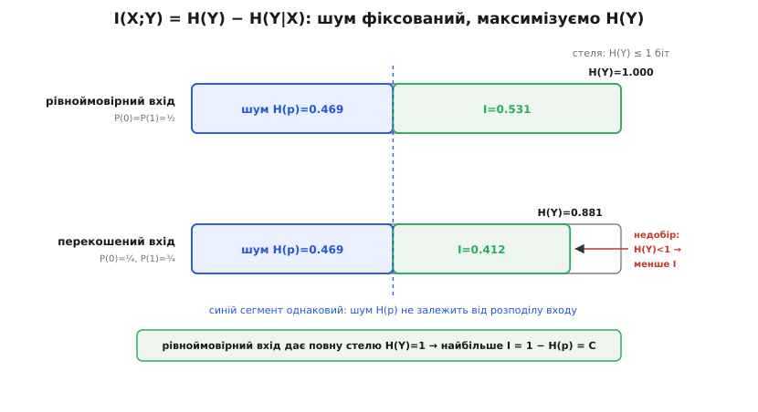
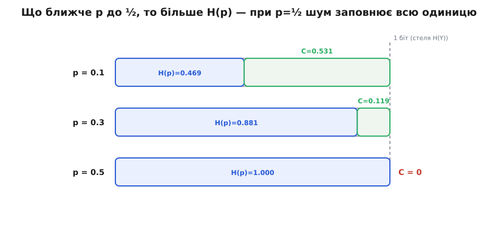

# 🧮 Звідки береться 1 − H(p): виведення ємності через взаємну інформацію

Формула `C = 1 − H(p)` у тілі теми подана як бюджет: один біт місця на символ, з нього шум з'їдає `H(p)`, решта — твоя. Метафора чудова, але метафора нічого не доводить. Звідки саме `H(p)`, а не, скажімо, `p` чи `2p(1−p)`? Чому від'ємник — саме двійкова ентропія перехідної ймовірності, та сама, що міряє непевність монети? І чому одиниця, а не якесь інше число, стоїть попереду? На всі три питання є одна відповідь, і вона не з метафор, а з означення пропускної здатності. Виведімо формулу так, щоб наприкінці стало ясно: її не вибрано — її **змушено**, і кожен її шматок має ім'я.

Найкраще в цьому виведенні те, що воно розпадається на два кроки, і кожен для цього каналу майже до смішного простий. Уся хитрість — правильно розрізати взаємну інформацію надвоє. Один шматок виявиться сталим (від нас не залежить нічого), другий — легко максимізується. Складаєш назад — і формула сама випадає в руки.

### Що взагалі означає «пропускна здатність»

Спершу — про саме число, бо його часто вимовляють, не спитавши, що воно таке.

Канал нам заданий: перехідна ймовірність `p` — це фізика лінії, її ми не міняємо. Але одну річ ми таки вибираємо самі — **як користуватися** входом: із якою частотою слати нулі, із якою одиниці, який узагалі розподіл дати вхідному символу `X`. Різні розподіли входу проштовхнуть крізь той самий канал різну кількість інформації. Пропускна здатність — це найкраще, чого взагалі можна досягти, перебравши всі можливі способи вживати вхід:

```
C = max  I(X;Y)
    P(X)
```

де `I(X;Y)` — **[взаємна інформація](root:math-information/mutual-information)** входу `X` й виходу `Y`, тобто скільки біт про `X` можна дізнатися, подивившись на `Y`. Максимум береться по всіх розподілах входу `P(X)`. Це означення пропускної здатності належить Шеннону (1948) і на позір суто математичне — просто максимум якоїсь величини. Але за ним стоїть тверда обіцянка: [теорема про кодування каналу](root:math-information/channel-coding-theorem) доводить, що це саме число `C` і є та гранична швидкість, на якій зв'язок можна зробити як завгодно надійним. Тому виведення `C` — не гра в символи: ми рахуємо реальну стелю, вище якої безпомилкова передача фізично неможлива.

Отже задача поставлена як **максимізація**: є одна ручка, яку ми крутимо, — розподіл входу, — і треба знайти її найкраще положення. Уся дальша робота — це розв'язати цю задачу для нашого каналу. І тут стається перше диво: величина, яку максимізуємо, розпадається на дві частини, з якими можна впоратися нарізно.

### Взаємна інформація — і чому її корисно розрізати саме так

Взаємну інформацію найпростіше прочитати як **спад непевності**. До того, як побачив вихід, ти не знаєш вихідного символу `Y` — уся його непевність є `H(Y)`. Коли ж вхід `X` тобі відомий, частина непевності `Y` все одно лишається — це та випадковість, яку домішав сам канал, і зветься вона умовною ентропією `H(Y|X)`. Різниця й є те, що вхід реально доніс до виходу:

```
I(X;Y) = H(Y) − H(Y|X)
```

Прочитай це повільно. `H(Y)` — уся непевність, яку має вихід. `H(Y|X)` — та її частина, що лишається, **навіть коли вхід уже знаєш**; тобто чистий внесок шуму, непевність, за яку вхід не відповідає. Відняв друге від першого — дістав те, що годен пояснити самим лише входом. Це й є перекинута каналом інформація.

Що ця рівність не з повітря, видно з [ланцюгового правила](root:math-information/shannon-entropy/math-entropy-axioms.md) для ентропії: спільну непевність пари можна набирати у два способи — спершу `X`, тоді `Y` при відомому `X`, або навпаки:

```
H(X,Y) = H(X) + H(Y|X) = H(Y) + H(X|Y)
```

Взаємну інформацію означують як «перекриття» двох непевностей, `I(X;Y) = H(X) + H(Y) − H(X,Y)`; підставивши сюди будь-яке з двох розкладів спільної ентропії, дістаєш або `I = H(Y) − H(Y|X)`, або дзеркальне `I = H(X) − H(X|Y)`. Обидві форми правдиві й рівноправні — вибирай ту, з якою легше рахувати.

І ось тут ховається головна кмітливість усього виведення. Для цього каналу форму `H(Y) − H(Y|X)` вибрано не випадково: вона розпадається на **сталу** (від'ємник) плюс **легкий максимум** (зменшуване). Друга форма, `H(X) − H(X|Y)`, така сама правильна — але `H(X|Y)` для цього каналу рахувати морока: щоб знайти непевність входу за відомим виходом, треба обертати ймовірності через формулу Баєса. Правильно вибраний ніж — половина справи.

### Крок перший: шум `H(Y|X)` дорівнює `H(p)` — і вхід тут ні до чого

Візьмімося за від'ємник. Умовна ентропія — це середня непевність виходу, зважена по тому, який символ подали:

```
H(Y|X) = P(X=0)·H(Y | X=0) + P(X=1)·H(Y | X=1)
```

Порахуймо кожен доданок окремо. Якщо на вхід подали **0**, канал випустить `0` з імовірністю `1−p` і `1` з імовірністю `p`. Непевність такого виходу — двійкова ентропія цих двох шансів, тобто рівно `H(p)`:

```
H(Y | X=0) = H(p)      вихід:  1−p на «0»,  p на «1»
```

А якщо подали **1**, канал випустить `1` з імовірністю `1−p` і `0` з імовірністю `p`. Ті самі два числа, лише поміняні місцями, — а ентропія від перестановки шансів не міняється:

```
H(Y | X=1) = H(p)      вихід:  p на «0»,  1−p на «1»
```

Ось воно, серце симетрії. **Обидва** входи дають ту саму непевність виходу — рівно `H(p)`. Тепер підставмо це назад:

```
H(Y|X) = P(X=0)·H(p) + P(X=1)·H(p)
       = [ P(X=0) + P(X=1) ] · H(p)
       = 1 · H(p) = H(p)
```

Вдумайся, що сталося. Ми брали зважене середнє — а обидва доданки виявилися однакові, `H(p)`. Середнє однакових чисел є те саме число, **хоч би якими були ваги**. А ваги — це і є розподіл входу `P(X=0)`, `P(X=1)`. Отже вони скоротилися дощенту: шумовий податок `H(Y|X) = H(p)` **не залежить від того, як ми вживаємо вхід**. Хоч рівно навпіл шли нулі й одиниці, хоч самі нулі — канал домішує рівно `H(p)` біт непевності на символ. Це незнищенна шумова підлога, задана самим `p` і більше нічим.

Чому так вийшло, варто сказати прямо, бо це властивість не арифметики, а **симетрії** каналу. Рядок таблиці переходів для входу `0` — це `(1−p, p)`; для входу `1` — `(p, 1−p)`. Один рядок є переставленням іншого, тож ентропії рядків однакові. Саме тому середнє по рядках не залежить від ваг: усі рядки несуть ту саму непевність. У несиметричного каналу рядки різні, їхні ентропії різні — і тоді `H(Y|X)` таки залежить від входу, а вся дальша легкість зникає. Симетрія — це не косметика назви, це те, що робить від'ємник сталим.

> 🔧 **Навіщо це.** Стала `H(Y|X)` — це те, що перетворює задачу максимізації з важкої на тривіальну. Максимізувати `I = H(Y) − H(Y|X)` по входу взагалі кажучи важко, бо обидва доданки залежать від входу й тягнуть у різні боки. Але тут другий доданок **не тягне нікуди** — він сталий. Тож максимум `I` — це просто максимум `H(Y)`, зсунутий униз на фіксовану `H(p)`. Ціла задача звелася до одного питання: коли вихід найнепевніший?

### Крок другий: вихідну ентропію `H(Y)` максимізує рівноймовірний вхід

Тепер зменшуване. `Y` — двійкова величина, лише два значення, `0` чи `1`. А непевність двійкової величини має жорстку стелю: найбільша вона тоді, коли обидва значення рівноймовірні, і дорівнює рівно одному біту:

```
H(Y) ≤ 1 біт,   рівність  ⟺  P(Y=0) = P(Y=1) = ½
```

Це не властивість каналу, а загальний факт про [двійкову ентропію](root:math-information/shannon-entropy): монета найнепевніша, коли чесна. Питання лиш одне: чи можемо ми, крутячи вхід, зробити вихід чесною монетою? Порахуймо розподіл виходу. Одиниця на виході з'являється двома шляхами — або подали `0` й він перевернувся, або подали `1` й він пройшов цілим:

```
P(Y=1) = P(X=0)·p + P(X=1)·(1−p)
```

Візьмімо рівноймовірний вхід, `P(X=0) = P(X=1) = ½`:

```
P(Y=1) = ½·p + ½·(1−p) = ½·(p + 1 − p) = ½
```

Диво, і до того ж стійке: `p` скоротилося геть, і вихід виходить рівно `½` на `½`, хоч би яким був канал. Рівноймовірний вхід дає рівноймовірний вихід — а отже `H(Y) = 1`, найбільша можлива. Стеля досяжна, і досягає її саме той вхід, що напрошується найпростішим.

Тепер збери обидва кроки. Оскільки `H(Y|X) = H(p)` — стала, максимізація `I` віддає всю роботу зменшуваному:

```
C = max [ H(Y) − H(Y|X) ]  =  ( max H(Y) )  −  H(p)  =  1 − H(p)
    P(X)                        P(X)
```

Тут є тонке місце, повз яке легко проскочити, а воно — уся суть. Взагалі кажучи, `max(A − B)` **не дорівнює** `(max A) − (max B)`: не можна максимізувати два доданки нарізно, коли обидва залежать від тієї самої ручки. Ми змогли це зробити лише тому, що `B = H(Y|X)` **не залежить** від ручки взагалі — вона стала. Саме крок перший (симетрія → сталий шум) дав нам право винести `H(p)` з-під максимуму як звичайну константу. Без симетрії ця вправа розсипалась би. А з нею той самий рівноймовірний вхід, що робить `H(Y)=1`, і є оптимальний — жодного конфлікту, бо від'ємник до вибору входу байдужий.


*Взаємна інформація — це вихідна ентропія `H(Y)` без шумового податку `H(Y|X)=H(p)`. Синій сегмент (шум) однаковий у будь-якому рядку — він не залежить від входу. Рівноймовірний вхід натягує загальну довжину до повної стелі `H(Y)=1`, тож наскрізна зелена частина найбільша: `I = 1 − H(p) = C`. Перекошений вхід недотягує `H(Y)` до одиниці — і тим самим марнує частину пропускної здатності.*

### Ті самі кроки — на живих числах

Абстракція переконує кроками, число переконує остаточно. Візьмімо добрий канал, `p = 0.1`, і прогонімо крізь нього **два** входи — перекошений і рівноймовірний, — щоб на очах побачити, як обидва кроки працюють.

Спершу шумовий податок. Він той самий для будь-якого входу:

```
H(0.1) = −0.1·log₂0.1 − 0.9·log₂0.9
       = 0.1·3.3219 + 0.9·0.1520
       = 0.3322 + 0.1368  =  0.4690 біта
```

**Перекошений вхід: `P(X=0)=¼`, `P(X=1)=¾`.** Розподіл виходу й наскрізна інформація:

```
P(Y=1) = ¼·0.1 + ¾·0.9 = 0.025 + 0.675 = 0.70
H(Y)   = H(0.70) = H(0.30) = 0.8813 біта

I = H(Y) − H(Y|X) = 0.8813 − 0.4690 = 0.4123 біта
```

**Рівноймовірний вхід: `P(X=0)=P(X=1)=½`.** Той самий рахунок:

```
P(Y=1) = ½·0.1 + ½·0.9 = 0.5
H(Y)   = H(0.5) = 1.0000 біта

I = 1.0000 − 0.4690 = 0.5310 біта
```

Порівняй два рядки — і побачиш обидва кроки в дії. Шумовий податок `H(Y|X) = 0.4690` **однаковий** в обох (крок перший: вхід на нього не впливає). А `H(Y)` різна — `0.8813` проти `1.0000`, — і рівноймовірний вхід виграє, бо тільки він натягує вихід до чесної монети (крок другий). Через це й наскрізна інформація більша: `0.5310` проти `0.4123`. Перекошений вхід залишив на столі `0.12` біта — рівно стільки, скільки його `H(Y)` недотягла до одиниці. Максимум — `0.5310` біта на символ, і це є `C = 1 − H(0.1)`. Формула не обіцянка, а підрахований факт.

### Симетрія `C(p) = C(1−p)` — тепер видно, звідки вона

У тілі теми симетрія пропускної здатності доводилась операційно: канал із `p = 0.9` не гірший за канал із `p = 0.1`, бо досить інвертувати кожен прийнятий біт. Виведення дає тій самій симетрії другий, чисто ентропійний доказ — і він однорядковий. Пропускна здатність є `1 − H(p)`, а двійкова ентропія симетрична відносно `½`:

```
H(p)   = −p·log₂p − (1−p)·log₂(1−p)
H(1−p) = −(1−p)·log₂(1−p) − p·log₂p       ← ті самі два доданки, переставлені
```

Заміна `p ↔ 1−p` просто міняє два доданки місцями, а сума від цього не зрушить: `H(p) = H(1−p)`. Отже й `C(p) = 1 − H(p) = 1 − H(1−p) = C(1−p)`. Два докази сходяться в одне: операційний каже **чому** (перевороти передбачувані, їх можна відкотити інверсією), ентропійний каже **на скільки** (рівно нінащо, бо `H` не відчуває перестановки шансів). Погана не кількість переворотів, а їхня непередбачуваність, і `H(p)` міряє саме її — тому й сліпа до того, з якого боку від `½` стоїть `p`.

### Чому рівно `p = ½` дає `I = 0`

Лишилася найглибша точка кривої — та, де канал умирає. Через формулу вона очевидна: `H(½) = 1`, тож `C = 1 − 1 = 0`. Але за цим нулем ховається точніша істина, ніж «шум завеликий». Погляньмо, що коїться з виходом при `p = ½`:

```
P(Y=1 | X=0) = p   = ½
P(Y=1 | X=1) = 1−p = ½
```

Обидві умовні ймовірності рівні — **байдуже, що подали на вхід, вихід той самий**: чесна монета. А це і є означення статистичної **незалежності**: `Y` не залежить від `X` анітрохи. Знання входу не змінює розподілу виходу ні на волосину, тож і дізнатися про вхід із виходу неможливо — нема жодної статистичної ниточки, за яку смикнути. Незалежні величини за означенням мають нульову взаємну інформацію: `I(X;Y) = 0`. І це вже не рятується вибором входу — жоден розподіл `P(X)` не зарадить, бо для кожного входу `I` тут дорівнює нулю, а максимум нулів є нуль.

Той самий нуль видно й крізь наш розклад, і так він ще промовистіший. При `p = ½` шумовий податок роздувається до `H(Y|X) = H(½) = 1` — рівно до тієї стелі, якої сягає й найбільша можлива `H(Y) = 1`. Зменшуване й від'ємник зрівнялися:

```
I = H(Y) − H(Y|X) = 1 − 1 = 0
```

Шум заповнив увесь бюджет виходу до країв. Тієї одиниці місця, що має вихід, шум забирає всю, і на корисне не лишається ані біта. Ось точний сенс «мертвого каналу»: не те, що переворотів багато (при `p=1` їх іще більше, а канал ідеальний), а те, що при `p=½` вони максимально невизначені — і саме невизначеність, зміряна через `H(p)`, з'їдає стелю без останку.


*При рівноймовірному вході вихідна ентропія завжди повна, `H(Y)=1` — уся смуга. Що ближче `p` до `½`, то ширший шумовий сегмент `H(p)`, і то вужча наскрізна частина `C`. При `p=½` шум займає всю одиницю, і на корисне не лишається нічого. Це та сама межа `p=½`, що на кривій `C(p)` є єдиною по-справжньому безнадійною точкою.*

### Що з цього винести

Формула `C = 1 − H(p)` — не бюджетна метафора, а наслідок означення, вичавлений двома кроками. Пропускна здатність за Шенноном є `max I(X;Y)` по входу; взаємну інформацію розрізаємо як `H(Y) − H(Y|X)` — вихідна непевність мінус шумовий податок. Далі спрацьовує симетрія каналу, і спрацьовує двічі. Вона робить від'ємник `H(Y|X) = H(p)` сталим — байдужим до входу, бо обидва рядки таблиці переходів несуть ту саму ентропію. І вона ж дозволяє рівноймовірному входу натягнути `H(Y)` до повної одиниці, бо рівні шанси на вході дають рівні на виході. Стала мінус, максимум — зменшуване: `C = 1 − H(p)`. Симетрія `C(p)=C(1−p)` падає задарма з `H(p)=H(1−p)`, а мертва точка `p=½` — це коли шум `H(½)=1` рівно дорівнює всій стелі виходу, вихід стає незалежним від входу, і взаємна інформація гасне в нуль. Кожен доданок формули має тепер ім'я: одиниця — це стеля двійкового виходу, `H(p)` — це незнищенний шум, а мінус між ними — це те, що симетрія дозволила винести з-під максимуму.
