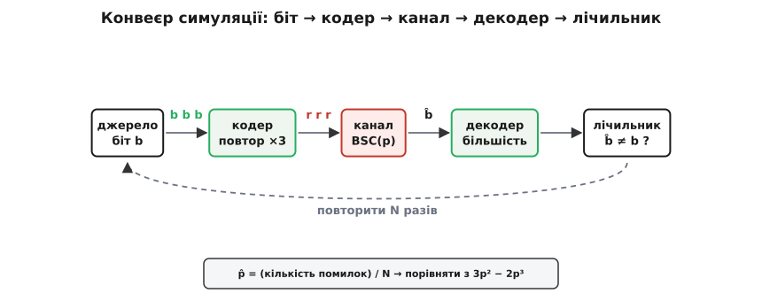
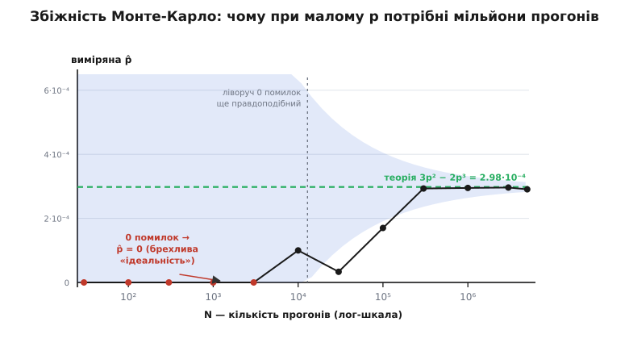

# ⚙️ Двійковий симетричний канал власноруч: зміряти те, що обіцяє формула

Теорія віддає два числа й просить повірити. Перше — залишкова частка помилок потрійного повторення, 3p² − 2p³. Друге — стеля надійної швидкості, 1 − H(p). Обидва виведені на папері, обидва точні, і все ж число, якого ти не бачив на власні очі, — це число, у яке віриш наполовину. Тож зберімо всю вимірювальну оснастку своїми руками: монету-канал, що зрідка бреше, кодер, декодер і лічильник помилок. Півсотні рядків — і теоретична крива перестане бути обіцянкою: виміряна точка виповзе просто на неї в тебе на очах. А потім — три пастки, через які цей вимір починає брехати навіть у того, хто все написав правильно.

## Задача: не вивести, а зміряти

Ми не доводитимемо формулу — ми її **перевіримо дослідом**. Метод простий, як лабораторний стенд: беремо один біт, проганяємо крізь весь тракт зв'язку й дивимося, чи вцілів він на виході. Повторюємо мільйони разів, ділимо число невдач на число спроб — і маємо виміряну ймовірність помилки. Це і є **метод Монте-Карло**: замість інтегрувати ймовірність аналітично, ми кидаємо кості достатньо разів, щоб частка сама сіла на істину.

Увесь стенд — коротка стрічка з чотирьох ланок, обгорнута в цикл:


*Уся вимірювальна оснастка: біт народжується в джерелі, кодер утроює його, канал перевертає кожну копію з імовірністю p, декодер відновлює біт голосуванням, лічильник питає «а чи збігся він із посланим?». Петля жене цю стрічку N разів; наприкінці ділимо помилки на N і звіряємо з 3p² − 2p³.*

Кожна ланка — окрема чесна функція на кілька рядків. Розберімо їх по черзі, а тоді зберемо докупи.

## Канал: монета, що зрідка бреше

Серце всього — двійковий симетричний канал. Його поведінка вичерпується одним параметром p: кожен біт незалежно перевертається з цією ймовірністю й проходить цілим з імовірністю 1 − p. У коді це буквально один рядок — для кожного біта кинути монету й, коли випав «переворот», інвертувати:

```python
import random
from math import log2

def bsc(bits, p, rng):
    """Прогнати біти крізь двійковий симетричний канал:
    кожен незалежно перевертається з імовірністю p."""
    return [b ^ (rng.random() < p) for b in bits]
```

Фокус у `b ^ (rng.random() < p)`. Вираз `rng.random() < p` — це монета: з часткою p дає `True`, інакше `False`. У Python `True` — це одиниця, тож «виключне або» з нею перевертає біт (`0 ^ True = 1`, `1 ^ True = 0`), а `^ False` лишає його недоторканим. Один виклик `rng.random()` на один біт — і жодної пам'яті між ними: канал не знає, що зробив із попереднім символом. Саме це «без пам'яті» й «щоразу та сама монета» роблять його симетричним і безпам'ятним точно за означенням.

Запам'ятай тут одну дрібницю, яка згодом обернеться пасткою: **один виклик каналу — це одне користування каналом, один переданий символ**. Не один біт повідомлення — один символ на дроті. Різниця здасться крихітною, поки ми не почнемо утроювати біти.

## Кодер і декодер: повтор і найближче слово

Код потрійного повторення — найнаївніший захист, який лишень можна вигадати: кажемо кожне слово тричі, сподіваючись, що шум не зіпсує більшість копій. Кодер тривіальний:

```python
def encode_rep3(bits):
    """Кожен біт → три його копії."""
    out = []
    for b in bits:
        out += [b, b, b]
    return out
```

Декодер цікавіший, бо тут ховається глибша ідея. Перший, очевидний спосіб — **голосування більшості**: у кожній трійці рахуємо одиниці; дві або три — виводимо одиницю, інакше нуль.

```python
def decode_majority(recv):
    """Голосування більшості в кожній трійці."""
    out = []
    for i in range(0, len(recv), 3):
        out.append(1 if recv[i] + recv[i+1] + recv[i+2] >= 2 else 0)
    return out
```

Але більшість — лише спритний ярлик, що працює саме для повторення. Загальне правило, яке годиться для **будь-якого** коду на цьому каналі, інше: обрати те кодове слово, що різниться від прийнятого в найменшій кількості позицій — тобто має найменшу [відстань Геммінга](root:com-modulation/hamming-distance) до нього (відстань Геммінга — це просто лічба позицій, у яких дві двійкові послідовності не збігаються). На симетричному каналі це і є декодування за максимальною правдоподібністю: що менше переворотів довелося б припустити, то ймовірніший такий варіант. Запишімо його прямо, через кодову книгу з двох слів:

```python
CODEBOOK = {0: (0, 0, 0), 1: (1, 1, 1)}

def hamming(u, v):
    """Відстань Геммінга — скільки позицій різняться."""
    return sum(a != b for a, b in zip(u, v))

def decode_nearest(recv):
    """Загальний декодер: у кожному блоці обрати найближче кодове слово."""
    out = []
    for i in range(0, len(recv), 3):
        block = recv[i:i+3]
        out.append(min(CODEBOOK, key=lambda m: hamming(block, CODEBOOK[m])))
    return out
```

І ось приємна перевірка на місці: для трійки з двома одиницями відстань до `000` дорівнює 2, а до `111` — лише 1, тож `decode_nearest` обирає одиницю — рівно те саме, що й більшість. Для будь-якої трійки ці два декодери дають однаковий біт, у чому легко переконатися, прогнавши обидва й порівнявши. Різниця не в результаті, а в думці: більшість — це трюк, найближче слово — це принцип, що масштабується на коди з тисячами слів, де жодного «голосування» вже не видно.

## Оснастка й запуск

Тепер зшиймо ланки. Джерело сипле випадкові біти, кодер утроює, канал псує, декодер відновлює, лічильник рахує розбіжності:

```python
def run(p, n_bits, seed=1):
    rng = random.Random(seed)
    src  = [rng.getrandbits(1) for _ in range(n_bits)]
    recv = bsc(encode_rep3(src), p, rng)
    dec  = decode_majority(recv)
    errors = sum(s != d for s, d in zip(src, dec))
    return errors / n_bits            # частка помилок НА ІНФОРМАЦІЙНИЙ біт
```

Поруч — те, з чим порівнюємо. Теоретична залишкова помилка повторення й стеля ємності:

```python
def theory(p):
    return 3*p**2 - 2*p**3            # = 3p²(1−p) + p³ — помилка ⟺ ≥2 перевороти з 3

def H(p):
    if p in (0.0, 1.0):
        return 0.0
    return -p*log2(p) - (1 - p)*log2(1 - p)

def capacity(p):
    return 1 - H(p)                   # стеля надійної швидкості, біт/символ
```

Дві форми теорії — 3p² − 2p³ і 3p²(1−p) + p³ — це той самий вираз, лише розкритий: розгорни другий, і −3p³ + p³ дадуть −2p³. Він рахує ймовірність, що з трьох копій перевернулося щонайменше дві, бо саме тоді більшість голосує проти правильного біта. А H(p) — та сама двійкова [ентропія Шеннона](root:math-information/shannon-entropy), міра невизначеності монети з шансом p; на межах 0 і 1 у формулі стоїть особливий випадок, бо `log2(0)` не існує, а внесок нульового доданка все одно нульовий.

Лишається прогнати розгортку по кількох p і звести все в таблицю:

```python
print(f"{'p':>6} {'uncoded':>9} {'p̂ вимір.':>12} {'3p²−2p³':>12} {'1−H(p)':>10}")
for p in (0.01, 0.05, 0.1, 0.2, 0.3, 0.5):
    print(f"{p:>6} {p:>9} {run(p, 1_000_000):>12.3e} "
          f"{theory(p):>12.3e} {capacity(p):>10.4f}")
```

## Що показує лічильник

Один прогін на мільйон інформаційних бітів (зерно 1) друкує приблизно таке:

```
     p   uncoded     p̂ вимір.      3p²−2p³     1−H(p)
  0.01      0.01    3.050e-04    2.980e-04     0.9192
  0.05      0.05    7.188e-03    7.250e-03     0.7136
   0.1       0.1    2.790e-02    2.800e-02     0.5310
   0.2       0.2    1.038e-01    1.040e-01     0.2781
   0.3       0.3    2.163e-01    2.160e-01     0.1187
   0.5       0.5    4.996e-01    5.000e-01     0.0000
```

Виміряна колонка сідає на теоретичну до третього-четвертого знака — формула жива, дослід її підтвердив. Але таблиця каже більше, ніж «формула правильна», і варто прочитати її повільно.

Порівняй колонки `uncoded` й `p̂` при малому p. На каналі з p = 0.01 голий біт хибить раз на сотню, а після потрійного повторення — лише тричі на десять тисяч: код збив помилку майже в тридцять разів. Ось навіщо взагалі повторювати. Тепер спустися вниз, до p = 0.5: там `uncoded` і `p̂` зійшлися — обидва рівно ½. Повторення не дало **нічого**. І це не випадковість, а точний поріг: повторення зменшує помилку тільки тоді, коли 3p² − 2p³ < p, а нерівність ця, коли поділити на p, зводиться до (2p − 1)(p − 1) > 0 — істинної рівно на проміжку p < 0.5. За півсотнею код не рятує, а шкодить: перевертаючи більшість, ти лише впевненіше вгадуєш неправильно. Симетрична стеля ємності казала те саме здалеку; тут ти бачиш той самий поріг зблизька, у стовпчику чисел.

А тепер найважче на зір, але найважливіше по суті — колонка ємності. При p = 0.1 повторення везе одну третину біта на символ (три символи на біт) і **все одно** лишає 0.028 помилки. А 1 − H(0.1) ≈ 0.531 обіцяє везти **більш ніж половину** біта на символ — і при цьому з помилкою, як завгодно близькою до нуля. Це не описка: [теорема Шеннона про кодування каналу](root:math-information/channel-coding-theorem) стверджує, що на будь-якій швидкості нижче за ємність існує код зі скільки завгодно малою помилкою. Повторення бере вп'ятеро гіршу швидкість — і навіть її не робить безпомилковою. Уся ця прірва між жалюгідним рядком нашої таблиці й обіцянкою Шеннона — це і є та відстань, яку розумні коди долали піввіку. Наш вимір щойно показав, з якого дна вони стартували.

> 🔧 **Навіщо це.** Виміряний стенд — це не іграшка, а робочий інструмент оцінки коду. Береш реальний канал, міряєш його p (частку збитих голих бітів), проганяєш крізь свій кодек ту саму симуляцію — і бачиш живу залишкову помилку, а не паперову обіцянку. Порівняв її зі стелею 1 − H(p) — і знаєш, чи є куди рости: якщо код везе куди менше за стелю, варто шукати кращий; якщо вперся — далі шліфувати марно, треба чистіший канал. Той самий каркас (джерело → кодер → канал → декодер → лічильник) міряє будь-який код, від біта парності до LDPC; міняється лише вміст двох середніх ланок.

## Пастка перша: малий p і брехливий нуль

Ось найпідступніше. Спокуса — прогнати симуляцію на «круглих» десяти тисячах бітів і повірити результату. Подивимось, що з цього вийде на доброму каналі p = 0.01, де теорія обіцяє помилку 2.98·10⁻⁴. На десяти тисячах інформаційних бітів очікуване число помилок — це N разів по цій частці, тобто 10000 · 2.98·10⁻⁴ ≈ **три**. Три помилки. А що як цього разу шум був трохи лагідніший і не сталося жодної? Тоді лічильник чесно надрукує нуль, а ти зробиш переможний висновок: «код ідеальний, помилок нема». Це брехня, породжена не багом, а браком спроб.


*Виміряна p̂ як функція числа прогонів N при p = 0.01. Ліворуч, доки N·P ще менше за одиницю, найімовірніший результат — рівно нуль помилок, і оцінка бреше «ідеально». Лише коли прогонів більшає за кілька десятків тисяч, точка сідає на теоретичну лінію 3p² − 2p³. Блакитна смуга ±1.96σ звужується як 1∕√N: щоб виміряти малу помилку точно, спроб треба обернено багато.*

Правило, що рятує, просте й його варто закарбувати: **надійна оцінка ймовірності потребує близько сотні зафіксованих подій**. Не сотні прогонів — сотні самих **помилок**. Бо відносна похибка оцінки Монте-Карло спадає як 1∕√(число помилок): сотня подій дає розкид близько 10 %, тисяча — близько 3 %. Звідси кількість прогонів не можна брати «круглою» — її диктує сам p:

```
потрібно прогонів  ≈  100 ∕ (3p² − 2p³)

 p = 0.1   →  100 ∕ 0.028      ≈  3.6 тис.
 p = 0.01  →  100 ∕ 2.98·10⁻⁴  ≈  336 тис.
 p = 0.001 →  100 ∕ 3.0·10⁻⁶   ≈  33 млн
 p = 0.0001→  100 ∕ 3.0·10⁻⁸   ≈  3.3 млрд
```

Число вибухає, бо мала помилка — рідкісна подія, а рідкісну подію треба довго підстерігати. Розумна оснастка не гадає N наперед, а жене прогони, доки не набере потрібну сотню помилок:

```python
def until_100_errors(p, target=100, seed=1):
    rng = random.Random(seed)
    errors = trials = 0
    while errors < target:
        trials += 1
        flips = (rng.random() < p) + (rng.random() < p) + (rng.random() < p)
        errors += flips >= 2          # помилка декодування ⟺ ≥2 перевороти з 3
    return errors / trials, trials
```

Тут сховано ще й приємне спрощення: подія помилки залежить лише від **числа переворотів у трійці**, а не від того, який біт послали, — це прямий подарунок симетрії каналу. Тому й генерувати сам біт джерела не треба: досить кинути монету тричі й спитати, чи випало щонайменше два перевороти. Стенд стиснувся до трьох монеток на прогін.

І ось де вилазить різниця мов. Для p = 0.001 нам треба 33 мільйони прогонів на одну точку, для p = 0.0001 — три мільярди; а якщо будувати цілу криву по десятку значень p, множ на десять. Python на такому гарячому циклі, де вся робота — три порівняння й інкремент, витрачає більшість часу на власні накладні витрати інтерпретатора й повзе. Той самий цикл на C, де тіло компілюється в жменю машинних інструкцій без жодного виділення пам'яті, біжить у десятки разів швидше — і три мільярди прогонів стають хвилинами, а не годиною. Тому ядро-симулятор варто мати у двох іпостасях: читабельний Python, щоб зрозуміти, і тісний C, щоб дочекатися.

:::tabs
```python
# Python: ясно й ідіоматично — для розуміння й невеликих N
def until_errors(p, target=100, seed=1):
    rng = random.Random(seed)
    errors = trials = 0
    while errors < target:
        flips = (rng.random() < p) + (rng.random() < p) + (rng.random() < p)
        errors += flips >= 2
        trials += 1
    return errors / trials, trials

if __name__ == "__main__":
    p_hat, n = until_errors(0.001, target=100)
    print(f"p={0.001}  p̂={p_hat:.3e}  прогонів={n}  теорія={3*0.001**2 - 2*0.001**3:.3e}")
```
```c
/* C: той самий цикл, але гарячий шлях у машинних інструкціях — для великих N */
#include <stdio.h>
#include <stdlib.h>
#include <stdint.h>

/* xorshift64 — дешевий і достатньо якісний ГВЧ для Монте-Карло */
static uint64_t st = 1;
static inline double urand(void) {
    st ^= st << 13; st ^= st >> 7; st ^= st << 17;
    return (st >> 11) * (1.0 / 9007199254740992.0);   /* 53 біти в [0,1) */
}

int main(int argc, char **argv) {
    double   p      = atof(argv[1]);
    long long target = argc > 2 ? atoll(argv[2]) : 100;
    st = argc > 3 ? strtoull(argv[3], 0, 10) : 1;     /* зерно, тільки не 0 */

    long long errors = 0, trials = 0;
    while (errors < target) {
        int flips = (urand() < p) + (urand() < p) + (urand() < p);
        errors += (flips >= 2);        /* помилка ⟺ ≥2 перевороти з 3 */
        trials++;
    }
    printf("p=%.4g  p_hat=%.3e  прогонів=%lld  теорія=%.3e\n",
           p, (double)errors / trials, trials, 3*p*p - 2*p*p*p);
    return 0;
}
```
:::

Обидва — не переклад рядок у рядок, а ідіоматичний двійник: Python читаєш, як опис задуму; C компілюєш і запускаєш на мільярди прогонів. Вибір диктує не смак, а p: доки він великий і подій багато, вистачить Python; коли полюєш за помилкою рідкіснішою за мільйонну, без C (чи Rust) чекатимеш непристойно довго.

## Пастка друга: біт проти символу

Друга пастка тонша й ловить навіть уважних. Код повторення утроює потік: на кожен **інформаційний** біт іде три **канальні** символи. Отже в системі живуть дві різні «частки помилок», і плутати їх — значить рахувати нісенітницю. Перша — помилка на канальний символ: це сирий p самого BSC, бо кожен окремий символ на дроті перевертається саме з цією ймовірністю. Друга — помилка на інформаційний біт **після** декодування: це наше 3p² − 2p³, менше за p, бо голосування дечого рятує. Лічильник мусить ділити помилки на число інформаційних бітів `n_bits`, а не на довжину закодованого потоку `len(recv)`, що втричі більша.

Класичний баг — саме тут:

```python
errors / len(recv)     # НЕПРАВИЛЬНО: ділимо на канальні символи (×3 забагато)
errors / n_bits        # правильно: помилка на інформаційний біт
```

Перший рядок дасть число втричі менше за справжнє й підсунеться ближче до сирого p — так, що недосвідчений зрадіє «якому доброму коду», хоча насправді просто поділив не на те. Ця сама плутанина мстить і в порівнянні зі стелею. Швидкість повторення — 1∕3 біта на символ; ємність 1 − H(p) теж міряють у бітах на символ. Порівнювати треба однакове з однаковим: наші 1∕3 біта на символ проти, скажімо, 0.531 біта на символ при p = 0.1. Якщо ж мовчки зміряти «на біт» тут і «на символ» там, отримаєш яблука проти груш і будь-який висновок про близькість до межі буде хибним. Тримай у голові просте питання-компас: **це число — на що саме, на біт даних чи на символ каналу?**

## Пастка третя: зерно генератора

Остання пастка — про відтворюваність, і вона рідко про «неправильну» відповідь, а частіше про **брехливо гарну**. Генератор випадкових чисел псевдовипадковий: із того самого зерна він видає ту саму послідовність. Це благо для налагодження — прогін відтворюється до біта, баг ловиться. Але те саме благо стає капканом, якщо необережно всадити зерно всередину циклу усереднення:

```python
# ПАСТКА: свіже зерно в кожній ітерації → усі прогони ІДЕНТИЧНІ
def broken_average(p, runs=1000, n=100000):
    total = 0.0
    for _ in range(runs):
        total += run(p, n, seed=42)   # те саме 42 щоразу!
    return total / runs               # «дисперсія нуль» — і це брехня
```

Кожна ітерація тут стартує з того самого зерна 42, тому канал перевертає ті самі біти в тих самих місцях, і всі тисяча «незалежних» прогонів — насправді одна й та сама відповідь, переписана тисячу разів. Усереднення дає гладеньке число з нульовим розкидом, і легко повірити, що вимір напрочуд стабільний, — тоді як ти просто не поставив жодного незалежного досліду. Ліки — одне з двох: або вести один довгий потік ГВЧ крізь усі прогони, ніколи його не перезапускаючи (тоді кожен новий біт справді новий), або, коли прогони мають бути окремі, давати кожному **своє** зерно:

```python
# правильно: незалежні прогони — кожному власне зерно
def honest_average(p, runs=1000, n=100000):
    return sum(run(p, n, seed=s) for s in range(runs)) / runs
```

Загальне правило таке: зерно фіксуй **один раз** на весь експеримент — щоб результат відтворювався й баг ловився, — але **ніколи** не скидай його всередині циклу, що мусить давати незалежні спроби. Одне зерно на вершині коду — свідок чесності: інший читач запустить твій файл і побачить те саме число. Те саме зерно в нутрі циклу — свідок самообману: ти помножив один дослід на тисячу й назвав це статистикою.

## Що ми зміряли

Півсотні рядків обернули дві теоретичні формули на дві виміряні криві. Тепер 3p² − 2p³ — не значок на папері, а лінія, на яку в тебе на очах сіла точка з мільйона кинутих монет; а 1 − H(p) — не абстрактна стеля, а прірва, яку видно в колонці таблиці: одна третина біта проти половини, залишкова помилка проти обіцяного нуля. Найцінніше тут — навіть не підтвердження формул, а три пастки: щоб міряти рідкісну помилку, спроб треба обернено багато; щоб порівнювати чесно, треба знати, «на біт чи на символ»; щоб дослід був незалежний, зерно не можна скидати. Хто пройшов ці три граблі на потрійному повторенні — не наступить на них, коли той самий стенд міритиме турбокод чи LDPC, де ставки вже не навчальні.
