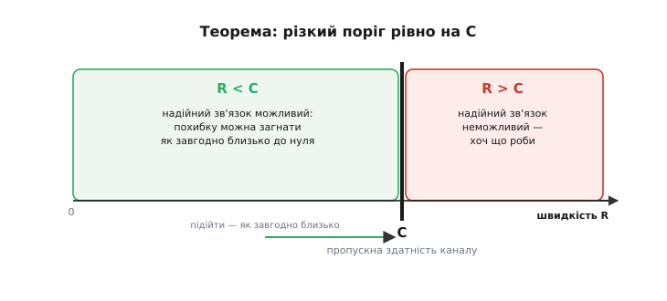
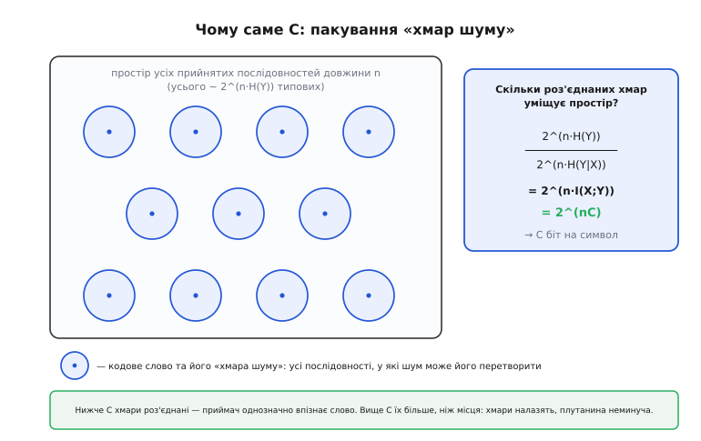
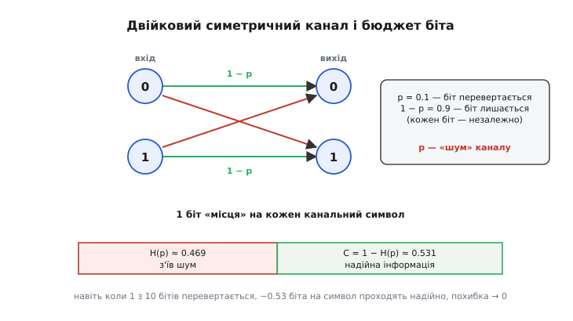

# Теорема Шеннона про кодування каналу: шум — не вирок

<preknowlist>
- [Ентропія Шеннона](topic:math-information/shannon-entropy) — міра невизначеності джерела в бітах; що таке H(p) і скільки інформації несе символ.
- [Імовірність як міра непевності](topic:math-probability/probability-basics) — базова мова випадковості: імовірність події, незалежні спроби, «частка з багатьох».
</preknowlist>

До 1948 року серед інженерів зв'язку панувала тиха зневіра. Будь-яка реальна лінія — телеграфний дріт, радіоефір, телефонний кабель — додає до сигналу **шум**, а шум псує частину переданого. Здавалося очевидним: що більше даних женеш, то більша частка приходить спотвореною, і повністю позбутися помилок не можна ніяк. Хочеш надійніше — повторюй кожен символ по кілька разів і бери більшість; але тоді швидкість падає. Виходило, ніби **надійність і швидкість — вороги**: щоб загнати помилку до нуля, доводиться повторювати без кінця, а швидкість при цьому теж падає до нуля. Ідеальна точність коштує повного паралічу лінії.

Клод Шеннон (*Claude Shannon*) показав, що це переконання — **хибне**. І не наполовину хибне, а хибне цілком. Його теорема про кодування каналу стверджує річ, у яку сучасники спершу не повірили: у кожного каналу є число — **пропускна здатність C** (від англ. *capacity* — місткість) — і **доки ти передаєш повільніше за C, помилку можна зробити як завгодно малою, зовсім не знижуючи швидкості**. Не «менше помилок ціною темпу», а майже безпомилково на будь-якій швидкості аж до самої стелі C.

### Дві половини одного твердження

Теорема складається з двох частин, і разом вони окреслюють різку межу.


*Ліворуч від C (нижчі швидкості) — зона, де надійний зв'язок можливий: похибку декодування можна загнати як завгодно близько до нуля. Праворуч (вище за C) — зона, де надійний зв'язок неможливий у принципі. Перехід не плавний — це стрімка стіна рівно на C.*

**Пряма частина** (її ще звуть *досяжністю*): для будь-якої швидкості R, меншої за C, і будь-якої, хоч якої дрібної, дозволеної похибки існує спосіб кодувати повідомлення так, що приймач помиляється рідше за цю межу. Хочеш помилку раз на мільйон? Існує код. Раз на трильйон? Теж існує. І при цьому швидкість лишається R — за надійність ти не платиш темпом.

**Обернена частина** (*converse*): щойно R перевищує C, гру закінчено. Жодна модуляція, жодне кодування, жодна хитрість не дадуть надійного зв'язку — похибка не впаде нижче певної стелі, хоч що роби.

Разом виходить не поступовий обмін, а **поріг**. C — це не «типова» й не «рекордна» швидкість, а **різка стіна між можливим і неможливим**. Підійти до неї впритул можна; перейти — ні.

### Пастка повторення

Щоб відчути, наскільки це несподівано, погляньмо на найпростіший спосіб боротьби з шумом — **повторення**. Хай канал перевертає кожен десятий біт. Надсилаю кожен біт тричі, а на прийомі беру більшість: якщо шум зіпсував один із трьох — двоє інших його переголосують. Помилка справді впала — але я тепер шлю втричі більше бітів заради тієї самої інформації, тобто **швидкість упала до третини**. Хочу надійніше — повторюю по п'ять, по сім разів; помилка тане, але й швидкість тане разом із нею. Гранично: нульова помилка — нульова швидкість.

Саме цю картину всі й вважали законом природи. А Шеннон побачив, що повторення — просто **дурний код**: воно бореться з шумом наосліп, символ за символом, ніби кожен біт живе окремо. Варто кодувати не окремі біти, а **довгі блоки** відразу — і весь розрахунок міняється.

### Чому довгі блоки рятують

Ось серце ідеї. Доля **одного** біта непередбачувана: перевернеться чи ні — чиста випадковість. Але доля **довгого блоку** передбачувана напрочуд точно. Якщо канал перевертає біти з імовірністю p, то в блоці з тисячі бітів зіпсованими виявляться **майже рівно** p·1000 — це закон великих чисел. Окремий біт — хаос; тисяча бітів — майже певність. Шум, який на одному символі всемогутній, на довгому блоці стає передбачуваним за своїм загальним масштабом.

Тепер уявімо весь простір можливих прийнятих блоків. Кожне передане **кодове слово** шум перетворює не в що завгодно, а в один із порівняно тісного набору схожих блоків — у «**хмару**» навколо цього слова, чий розмір задає той самий передбачуваний масштаб шуму. Декодувати означає впізнати, з якої хмари прилетів блок. І тут усе вирішує **пакування**: якщо хмари різних кодових слів **не налазять** одна на одну, приймач завжди однозначно вкаже правильне слово, і похибка прямує до нуля.


*Простір усіх прийнятих послідовностей умовно вміщує 2^(n·H(Y)) типових блоків; хмара шуму навколо одного слова — близько 2^(n·H(Y|X)). Скільки роз'єднаних хмар туди влазить — стільки різних слів можна безпомилково розрізнити: їх якраз 2^(n·C). Ось джерело самої межі C.*

Скільки ж окремих хмар уміщує простір? Поділи його «об'єм» на «об'єм» однієї хмари — і дістанеш рівно **2^(n·C)** роз'єднаних хмар на блок довжини n, тобто **C бітів на кожен символ**. Ось звідки береться межа: доки кодових слів менше, ніж вільних хмар (R < C), їх можна розкидати так, щоб не перетиналися, — і зв'язок майже безпомилковий. Щойно слів більше, ніж місця (R > C), хмари неминуче налазять, і жодне декодування не розплутає, котре слово було послане. Та сама картинка пояснює **обидві** половини теореми одразу.

### Несподіваний доказ: випадкові коди

Лишається питання: як **знайти** ті кодові слова, чиї хмари не перетинаються? Тут Шеннон зробив хід, що й досі вражає елегантністю. Він **не будував** хороший код. Він узяв кодові слова **навмання** — просто накидав випадкові довгі послідовності — і довів, що в такому величезному просторі випадкові точки майже напевно лежать далеко одна від одної, тож їхні хмари майже напевно не перетинаються. Порахувавши **середню** похибку по всіх можливих випадкових кодах і показавши, що вона прямує до нуля, він зробив висновок: хоча б один добрий код мусить існувати. Це доказ **існування без побудови** — він гарантує, що скарб є, але не каже, де копати. Точний апарат — типові послідовності, закон великих чисел у формі рівнорозподілу й акуратний підрахунок пакування — розгортає [математична вставка про випадкове кодування](topic:math-information/channel-coding-theorem/math-random-coding.md).

### Скільки саме: канал, що перевертає біти

Абстракція оживає на конкретному каналі. Найпростіша модель шуму — [двійковий симетричний канал](topic:math-information/binary-symmetric-channel): кожен біт незалежно перевертається з імовірністю p, інакше проходить цілим. Його пропускна здатність має напрочуд прозорий вигляд:

```
C = 1 − H(p)
```

де H(p) — двійкова ентропія, міра невизначеності, яку шум вкидає в кожен біт. Читається це як **бюджет**: на кожен канальний символ у тебе є 1 біт «місця»; шум відбирає H(p) цього місця як невиправну невизначеність; що лишилося, 1 − H(p), — твоє, і його можна використати надійно. (У загальному випадку C — це найбільша [взаємна інформація](topic:math-information/mutual-information) між входом і виходом, тобто скільки біт вихід насправді розповідає про вхід; для двійкового симетричного каналу вона й зводиться до 1 − H(p).)


*Двійковий симетричний канал: біт лишається з імовірністю 1 − p, перевертається з імовірністю p. З 1 біта «місця» на символ невизначеність шуму H(p) з'їдає частину; решта C = 1 − H(p) лишається на надійну інформацію.*

**Приклад (канал перевертає кожен десятий біт).** Хай p = 0.1. Обчислимо ентропію шуму й ємність:

```
H(0.1) = −0.1·log₂(0.1) − 0.9·log₂(0.9)
       = 0.1·3.322 + 0.9·0.152
       = 0.332 + 0.137  ≈  0.469 біта

C = 1 − 0.469  ≈  0.531 біта на символ
```

Висновок бентежить інтуїцію: **навіть коли кожен десятий біт приходить перевернутим**, крізь такий канал можна безпомилково проштовхнути близько 0.53 біта справжньої інформації на кожен переданий біт — і похибку загнати до нуля. Для порівняння: те саме потрійне повторення має швидкість лише 0.33 і **все одно** лишає помилку близько 0.028 на біт — воно й повільніше за стелю, і не безпомилкове. Прірва між цим жалюгідним результатом наївного коду й обіцянкою Шеннона (0.53 біта **без** помилок) — це рівно та відстань, яку інженери долали наступні півстоліття.

### Обіцянка, яку виконували 45 років

Тут криється підступ. Шеннон довів, що добрі коди **існують**, але його випадкові коди на практиці непридатні: щоб декодувати випадковий код, треба перебрати неосяжну кількість варіантів. Тож десятиліттями межа стояла як недосяжний ідеал. Реальні коди — [Геммінга](topic:com-modulation/hamming-code), [Ріда–Соломона](topic:com-modulation/reed-solomon), згорткові — працювали справно, рятували дані на дисках і в далекому космосі, та лишали до стелі розрив у кілька децибелів. Прорив стався аж 1993 року з **турбокодами**, а невдовзі — з перевідкриттям [LDPC-кодів](topic:com-modulation/ldpc), які нарешті підійшли до межі Шеннона на частку децибела. Драматичну історію цієї гонитви — від голого доказу існування 1948-го до коду, що майже торкнувся стелі, — зібрано в [окремій розповіді](topic:math-information/channel-coding-theorem/hist-approaching-the-limit.md). А побачити різкий поріг на власні очі — симуляцію каналу, де похибка декодування падає до нуля під C і застрягає над C, — дає [код-проєкт](topic:math-information/channel-coding-theorem/proj-simulate-threshold.md).

> 🔧 **Навіщо це.** Теорема про кодування каналу — Полярна зоря всієї цифрової передачі й зберігання. Вона не каже, *як* збудувати код, зате каже, *наскільки добрим* він у принципі може бути — і тим рятує від двох марнот: гнатися за неможливим (вище C) або далі шліфувати код, що вже вперся в стелю. Виміряй C свого каналу — і знаєш, чи є ще куди рости. Саме цим числом міряють себе 5G і Wi-Fi, контролери SSD-накопичувачів, QR-коди й зв'язок із міжпланетними станціями: усі вони — перегони до C, і всі знають, що фінішну стрічку напнув Шеннон.

### Дві межі, одна стаття 1948 року

Варто відступити на крок і побачити всю будову. У тій самій праці Шеннон поставив **дві** межі, і вони дзеркальні. Одна — знизу: [теорема про кодування джерела](topic:math-information/source-coding-theorem) каже, що повідомлення **не можна стиснути** коротше за його ентропію H, — це підлога подання. Друга — згори: теорема про кодування каналу каже, що надійно передати **не можна швидше** за пропускну здатність C, — це стеля передавання. Між H і C живе вся цифрова техніка зв'язку: спершу **вичавити** з повідомлення зайве, стиснувши його майже до H, а тоді **дбайливо вдягнути назад** структуровану надмірність, щоб воно безпечно проїхало під стелею C. Два числа, одна стаття — і весь кістяк інформаційної доби.

Конкретне значення C залежить від природи каналу: для неперервної лінії з тепловим шумом його дає [формула смуги й межі Шеннона](topic:math-information/bandwidth-capacity) C = B·log₂(1 + S/N), а найпоширенішу таку модель — [канал з адитивним білим гаусовим шумом](topic:math-information/awgn-channel) — розбирають окремо. Але хоч звідки береться число C, сенс теореми незмінний: під ним — воля, над ним — стіна.

---
