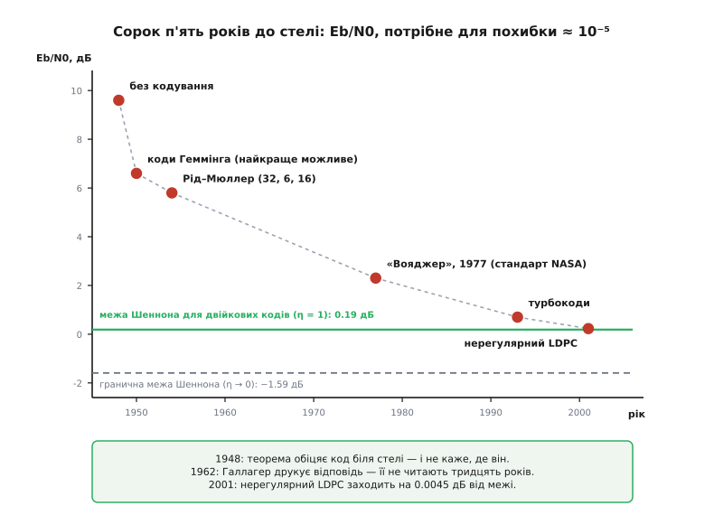
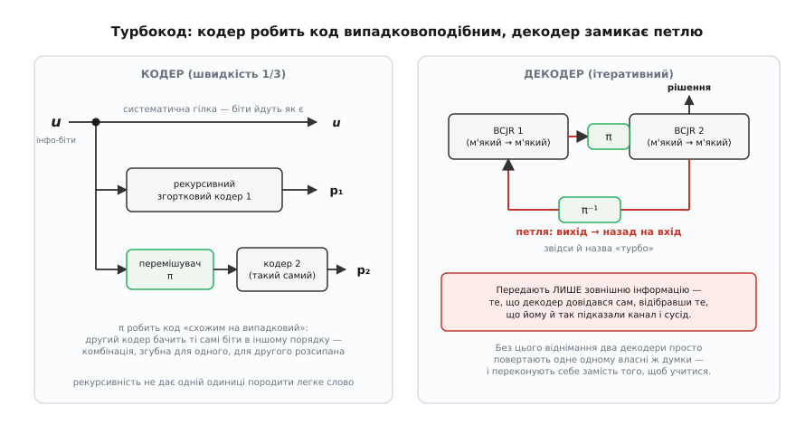

# 📜 Сорок п'ять років до стелі

Шеннон подарував інженерам річ дивної форми: доказ, що скарб існує, без жодного натяку, де копати. Він усереднив похибку по всіх випадкових кодах, побачив, що середнє прямує до нуля, і зробив висновок — отже, хоча б один код добрий. Бездоганна логіка. Практична цінність — нуль: «хоча б один» із набору, де кодів більше, ніж атомів у видимому Всесвіті, це не адреса.

Іронія почалася відразу. Єдиний нетривіальний код, що взагалі з'являється в статті Шеннона 1948 року, — крихітний (7, 4, 3) [код Річарда Геммінга](root:com-modulation/hamming-code) (*Richard Hamming*), колеги Шеннона по Bell Labs, який виправляє рівно одну помилку. Тобто в самій праці, що обіцяла коди біля стелі, як приклад стояв код, від тієї стелі неосяжно далекий. Так між обіцянкою і вмінням розверзлася щілина, яку закривали сорок п'ять років.

## Хибний компас: алгебричне кодування

Перше покоління відповіло на виклик так, як відповідає будь-яка здорова інженерія: почало будувати те, що вміло рахувати.

Геммінг опублікував свій нескінченний клас однопомилкових кодів 1950 року (*Bell System Technical Journal*, т. 29, с. 147–160). Ще раніше, у червні 1949-го, швейцарський математик Марсель Голе (*Marcel J. E. Golay*) втиснув у **пів сторінки** журналу *Proc. IRE* (т. 37, с. 657) [досконалий](root:com-modulation/perfect-codes) двійковий код (23, 12, 7), що виправляє три помилки, і потрійковий (11, 6, 5) на додачу — досконалий тут означає, що кулі навколо кодових слів вкривають увесь простір без залишку й без перекриття. Елвін Берлекемп (*Elwyn Berlekamp*) згодом назве цю пів сторінки найкращою окремою надрукованою сторінкою в теорії кодування за всі роки від 1948-го до 1973-го. 1954 року Девід Мюллер (*David Muller*) вводить свій клас кодів, а Ірвінг Рід (*Irving Reed*) невдовзі подає їх наново — вже з дієвим декодером; так з'являються коди Ріда–Мюллера, рідня Геммінгових.

Усе це трималося на одній ідеї: **максимізувати мінімальну відстань d**. Якщо будь-які два кодові слова різняться щонайменше в d позиціях, декодер гарантовано виправить (d−1)/2 помилок. Гарантія залізна, побудова явна, апарат — прекрасна алгебра над скінченними полями.

І це був **хибний компас**. Не поганий — хибний, тобто спрямований не туди, куди показував Шеннон.

Придивімося, чому. Мінімальна відстань — це характеристика **найгіршої пари** кодових слів у коді. Оптимізувати d означає витрачати весь бюджет надмірності на єдиного найнебезпечнішого супротивника — ту пару слів, що лежать найближче одна до одної. Але канал не породжує найгірших випадків. Канал породжує **типові**: він перевертає приблизно p·n бітів, розкиданих як заманеться. Доля повідомлення вирішується не тим, чи є в коді одна тісна пара, а тим, як розподілені відстані від типового слова до **всіх** решти. Шеннонів доказ ніде не каже «розсуньте слова якнайдалі». Він каже: **беріть слова навмання**. У випадковому коді мінімальна відстань посередня — зате весь розподіл відстаней правильний, а саме він і керує похибкою. Алгебричне кодування тридцять років шліфувало не ту величину: воно готувалося до ворога, який майже ніколи не приходив.

До цього додалася друга втрата, дрібніша на вигляд і дорога насправді. Алгебричний декодер вимагає на вході **тверде** рішення: нуль або одиниця. А приймач насправді знає більше — він знає, наскільки впевнений. Викинути цю впевненість і рахувати відстань Геммінга по твердих бітах коштує, за оцінкою Костелло й Форні, від 2 до 3 дБ. Тож підсумок першого покоління скромний: реальний виграш кодів Геммінга на гаусовому каналі не перевищує приблизно 3 дБ навіть із найкращим м'яким декодуванням.

## Лінійка: скільки децибелів до стелі

Щоб історія перестала бути туманом із похвал і зневір, потрібна лінійка. У кодуванні нею служить **Eb/N0** — енергія на один **інформаційний** біт, поділена на спектральну щільність шуму. Величина зручна тим, що чесно ділить: скільки енергії ти витратив саме на корисний біт, а не на надмірність.

Мовою Eb/N0 теорема Шеннона для [гаусового каналу](root:math-information/awgn-channel) — каналу, де до сигналу додається білий шум із нормальним розподілом, — дає нижню межу, що залежить від спектральної щільності η (біт за секунду на герц):

```
Eb/N0 ≥ (2^η − 1)/η

η → 0:   (2^η − 1)/η → ln 2 = 0.693
         10·log₁₀(0.693) = −1.59 дБ
```

Ось воно — **гранична межа Шеннона: −1.59 дБ**. Нижче не спуститься ніхто й ніколи, хоч скільки смуги витрать.

**Приклад (яке завширшки все поле гри).** Порівняймо два краї — передавання зовсім без кодування і абсолютний ідеал:

```
Без кодування, щоб дістати похибку Pb = 10⁻⁵:   Eb/N0 ≈ 9.6 дБ
Гранична межа Шеннона (η → 0):                  Eb/N0 = −1.59 дБ

Уся дистанція:  9.6 − (−1.59) ≈ 11.2 дБ
У разах потужності:  10^(11.2/10) ≈ 13.2 раза
```

Отже, весь приз, за який ішла гра, — приблизно тринадцятикратна економія потужності передавача. Не абстракція: для станції біля Сатурна це різниця між антеною, яку можна вивести на орбіту, і антеною, яку не можна.

> 🔧 **Навіщо це.** Децибел тут — не оздоба, а єдиний спосіб чесно сказати «наскільки ми відстали». Кодування не буває «добрим» чи «поганим» саме по собі: воно буває за стільки-то децибелів від стелі при заданій похибці. Ця лінійка перетворює сорок п'ять років суперечок на один графік із однією віссю — і саме тому нею можна виміряти й тріумф, і сором. Запам'ятайте одне число: **3 дБ — це рівно вдвічі за потужністю**. Воно ще вистрелить.


*Сорок п'ять років гонитви на одній осі: яке Eb/N0 треба було найкращому практичному коду, щоб дати похибку ≈ 10⁻⁵. Перші майже чотири децибели алгебричні коди 1950-х забрали порівняно легко — далі кожен наступний коштував дедалі дорожче, і конкатенована схема «Вояджера» (1977) стала комфортним плато на півтора десятиліття. Турбокоди 1993-го одним стрибком закрили 1.6 дБ із тих приблизно 2.1, що лишалися до стелі; нерегулярні LDPC 2001-го підійшли на 0.040 дБ у симуляції (і на 0.0045 дБ за теоретичним порогом). Числа зібрано з огляду Костелло й Форні.*

## Елаяс, Галлагер і коди, що впали не в те століття

Тим часом у МТІ визрівала зовсім інша лінія — не алгебрична, а ймовірнісна.

1955 року Пітер Елаяс (*Peter Elias*) винаходить [згорткові коди](root:com-modulation/convolutional-codes) — коди, де кодер не ріже потік на незалежні блоки, а протягує його крізь регістр зсуву, тож кожен вихідний символ залежить від кількох попередніх вхідних. Роберт Галлагер (*Robert Gallager*), його учень, згодом оцінить ту працю як, мабуть, найвпливовішу ранню статтю в теорії інформації після самого Шеннона — і не через самі коди. Елаяс довів дві речі, що б'ють у корінь: **лінійні коди не гірші за загальні** (а лінійні легко кодувати), і **майже кожен випадковий код добрий**. Тобто добрі коди не рідкість, яку треба вистежувати, — вони норма. Рідкість — це вміння їх **декодувати**.

І тоді учень Елаяса зробив крок, який мав закінчити всю історію на місці.

Дисертацію Галлагера про **коди розрідженої перевірки паритету** — [LDPC](root:com-modulation/ldpc), коди, чия перевірочна матриця майже суцільно з нулів, тож кожна перевірка торкається лише кількох бітів, — керував Елаяс, і мотив був той самий: знайти клас «схожих на випадкові» кодів, які можна декодувати біля ємності за посильну ціну. Стаття вийшла 1962 року (*IRE Transactions on Information Theory*, т. IT-8, № 1, с. 21–28), монографія — 1963-го в MIT Press. Разом із кодом Галлагер описав **ітеративний декодер із пересиланням повідомлень**: вершини графа обмінюються локальними ймовірностями, доки не дійдуть згоди. За свідченням Форні, це, схоже, взагалі перша поява в літературі того, що сьогодні звуть **алгоритмом сум-добутків**, він же **поширення переконань** (*belief propagation*).

Тобто **1962 року відповідь уже існувала**. Повна. Надрукована. З декодером.

А тепер найгірша подробиця цієї історії. Того ж 1962 року навколо кодів Мессі й Галлагера засновують компанію Codex Corp. — і LDPC, зазначають Костелло й Форні, входили до того портфеля, але **ніколи не розглядалися серйозно для практичного втілення**. Коди лежали в засновницькій теці фірми. Ніхто не взявся їх будувати.

Форні пізніше схарактеризує винахід Галлагера як шматочок кодування XXI століття, що випадково впав у XX. Забуття тривало понад тридцять років. Причину першої половини цього терміну назвати легко: для техніки 1960-х такий декодер був надто складний, і це чесне пояснення. Причину другої половини не може пояснити й сам Форні — він прямо визнає, що незрозуміло, чому коди лишалися знехтуваними аж до середини 1990-х. Варто спинитися на цьому зізнанні: ціла дисципліна тридцять років не бачила відповіді, надрукованої в її ж головному журналі, і досі не має гідного пояснення, як це вийшло.

## Воркшоп, на якому кодування оголосили мертвим

У квітні 1971 року в Сент-Пітерсберзі, штат Флорида, відбувся перший воркшоп IEEE з теорії зв'язку. Він увійшов у пам'ять фаху як **воркшоп «кодування померло»**.

Доповідь, що дала йому ім'я, виголосив Нед Велдон (*Ned Weldon*). Його теза: теоретики кодування перетворилися на маленьку замкнену групу, надто довго відірвану від реальності. Ілюстрував він її одним-єдиним слайдом — загін щурів, яких психологи тримали в тісноті надто довго; що саме там робили ті щури, Боб Лакі (*Bob Lucky*) у своїй колонці в *IEEE Spectrum* переказувати не став, зауваживши лише, що слайд потім багато разів позичали, щоб показати, до чого доходить відірвана від світу спільнота. Письмового протоколу воркшопу, схоже, не збереглося — тож усе, що ми знаємо, спирається на спогад Лакі, записаний десь через двадцять років. Це переказ, а не документ, і так його й треба читати.

Відповідь пролунала на місці. Ірвін Джейкобс (*Irwin Jacobs*) підвівся в задньому ряду, підняв над головою мікросхему середньої інтеграції — можливо, чотирибітний регістр зсуву — і сказав, що **ось це** і є майбутнє кодування. Берлекемп сказав приблизно те саме. Обидва не просто говорили: Джейкобс далі очолив Linkabit зі згортковими кодами, Берлекемп — Cyclotomics із блоковими, і це були дві головні кодувальні фірми 1970-х.

Історія показала, що мали рацію **всі троє**, і саме тому епізод повчальний. Велдон не помилявся — він лише сказав ширше, ніж мав на увазі: помирало не кодування, а **алгебричне** кодування, яке справді вичерпало віддачу. А Джейкобс і Берлекемп указували на другий бік тієї самої монети: щойно транзистори подешевшають, декодер перестане бути розкішшю. Лакі закінчив колонку питанням, від якого важко відкараскатися: чому ми, технологи, так кепсько передбачаємо майбутнє техніки?

## Комфортне плато: «Вояджер»

Поки одні ховали фах, інші будували те, що літає.

1966 року Девід Форні (*G. David Forney Jr.*) публікує в MIT Press свою докторську роботу про [конкатеновані коди](root:com-modulation/concatenated-codes). Ідея заощадлива до краси: замість одного велетенського коду постав два скромні один за одним. Внутрішній вимітає більшість помилок і зрідка помиляється сам — але помиляється **пачками**. Зовнішній код бере ці рідкі пачки на себе. Два посередні коди, складені стосом, дають те, чого жоден із них поодинці не дає.

1967 року Ендрю Вітербі (*Andrew Viterbi*; народжений Андреа Джакомо Вітербі в Бергамо, з італійської єврейської родини, що втекла до США 1939 року від расових законів Муссоліні; ім'я англізували при натуралізації) публікує свій алгоритм (*IEEE Trans. Inform. Theory*, т. IT-13, с. 260–269). Цікаво, що він вводив його **не як практичний декодер**, а як «асимптотично оптимальний» — інструмент, щоб довести експоненційні межі на похибку. Що він оптимальний насправді, розпізнали майже одразу. А Джеррі Геллер (*Jerry Heller*) із Лабораторії реактивного руху (JPL) побачив головне: короткі згорткові коди з декодером Вітербі цілком практичні, і 64-станний код дає порядку 6 дБ виграшу.

Усе це зійшлося 1977 року на «Вояджері». JPL узяла зовнішнім кодом [Ріда–Соломона](root:com-modulation/reed-solomon) (255, 223, 33) над полем із 256 елементів — він виправляє до 16 байтових помилок і чудово бере ті самі пачки, — а внутрішнім поставила згортковий код зі швидкістю 1/2 на 64 стани з декодером Вітербі. Ця конкатенована схема стала стандартом NASA.

І тут треба сказати те, що зазвичай проковтують, коли розганяють драму. **Воно працювало.** Ця схема привезла нам Юпітер і Сатурн. Розрив до стелі лишався — за пізнішою оцінкою Форні, стандартний конкатенований код NASA приблизно на 1.6 дБ гірший за те, що потім покажуть турбокоди, тобто десь на 2 дБ з гаком від межі. Але два децибели — це не ганьба, це **плато**. А плато небезпечніші за провали: з провалу тікають, на плато влаштовуються жити.

## Інструмент, який чекав двадцять років

1974 року Лаліт Баль, Джон Кок, Фредерік Єлінек і Йозеф Равів (*Bahl, Cocke, Jelinek, Raviv*) друкують декодер, який тепер звуть **BCJR** (*IEEE Trans. Inform. Theory*, т. IT-20, с. 284–287). Він відповідає на інше питання, ніж Вітербі. Вітербі питає: «яка послідовність найімовірніша?» BCJR питає про кожен біт окремо: «яка ймовірність, що тут був нуль?»

І він програв. Складніший за Вітербі — потрібен прохід уперед і назад, а не лише вперед, — а виграшу майже не дає. Тож його поклали на полицю.

Але в нього була властивість, за яку тоді ніхто не платив: він **м'який на вході й м'який на виході** — бере ймовірності, віддає ймовірності. У 1974 році це нікому не здалося цінним, бо далі по ланцюжку не було нікого, хто вмів би спожити ймовірність: наступною ланкою завжди стояв споживач твердих бітів. Інструмент пролежав дев'ятнадцять років, чекаючи на машину, якій знадобиться саме те, чим він відрізнявся.

Запам'ятаймо форму цієї історії, бо вона повториться: **всі частини прориву 1993 року вже лежали на видноті**.

## Двоє з Бреста

Клод Берру (*Claude Berrou*) й Ален Главйо (*Alain Glavieux*) працювали в Вищій національній школі телекомунікацій Бретані в Бресті. Главйо (нар. 4 липня 1949, Париж — пом. 25 вересня 2004, Брест) прийшов туди 1978 року з паризької ENST, з нуля збудував викладання цифрового зв'язку і став професором 1989-го. Берру був професором проєктування НВІС — тобто фахівцем із кремнію.

Жоден із них не був теоретиком кодування. Костелло й Форні додають до цього подробицю, від якої історія набуває смаку: у примітці вони зазначають, що, хоч обидва були професорами, **ні Берру, ні Главйо не мали докторського ступеня**. Статус цього твердження варто назвати чесно: це свідчення Форні — людини з самого осердя фаху — у рецензованій статті *Proceedings of the IEEE*; біографії обох у відкритих джерелах цього не підтверджують і не спростовують, вони просто мовчать про докторат. Тож — вагоме свідчення, не документ.

Почалося все буденно: Главйо запропонував колезі, що було б цікаво реалізувати декодер SOVA у кремнії. SOVA — м'яковихідний Вітербі, робота Йоахіма Гагенауера (*Joachim Hagenauer*) й Петера Гогера (*Peter Hoeher*). Розбираючись, як воно влаштоване, Берру наштовхнувся на фразу Гагенауера: м'яковихідний декодер — це такий собі **підсилювач відношення сигнал/шум**.

Ось тут і повернувся важіль усієї історії.

Для теоретика кодування «підсилювач» — це вільна метафора, барвиста й порожня. Для інженера-електронника **підсилювач — це схема**. І будь-який електронник знає про підсилювач рівно одну першу річ: навколо нього замикають **зворотний зв'язок**. І Берру поставив питання, яке теоретикові кодування просто не спало б на думку — Костелло й Форні пояснюють це фізичним складом його мислення: якщо ця штука підсилює сигнал/шум, **що буде, якщо подати її вихід назад на вхід?**

Прорив народився з того, що метафору зрозуміли буквально. Людина, чия рідна дисципліна робила буквальне прочитання очевидним, не мала звідки знати, що так не заведено.

Ґрунт був підготовлений: французький теоретик Жерар Батай (*Gérard Battail*), чиї праці надихали обох, роками обстоював пошук саме **«схожих на випадкові»** кодів — тієї властивості, на яку від 1948 року вказував Шеннонів доказ.

Конструкція вийшла така. Потік інформаційних бітів іде крізь систематичний **рекурсивний** згортковий кодер зі швидкістю 1/2 на 16 станів — це перший потік перевірки. Ті самі біти [перемішують](root:com-modulation/interleaving) великим псевдовипадковим перемішувачем і подають у другий, точнісінько такий самий кодер — це другий потік перевірки. Передають усе разом: швидкість 1/3. Так з'явилася **паралельна конкатенація** (на відміну від давнішої, послідовної).

Кожна деталь тут працює на «випадковоподібність». Перемішувач потрібен, щоб два кодери бачили ту саму інформацію в різному порядку: комбінація, згубна для одного, для другого розсипана. Рекурсивність (зворотний зв'язок усередині самого кодера) потрібна тому, що нерекурсивний кодер від одної-єдиної одиниці неминуче народив би легке, майже порожнє кодове слово.

А декодер — це два BCJR, ті самі, з 1974-го, що дев'ятнадцять років чекали свого. Вони передають ймовірності одне одному крізь перемішувач і назад. І тут Берру з колегами знайшли те, без чого вся конструкція не працює: передавати треба лише **зовнішню** інформацію — те, що декодер довідався **сам** на цій ітерації, відібравши те, що йому й так підказав канал чи сусід. Інакше два декодери просто повертають одне одному власні ж думки, дедалі впевненіше переконуючи одне одного в тому, що самі й сказали. Це віднімання — і є вся різниця між справжнім навчанням і луною.

Перші симуляції Берру й Главйо прогнали 1991 року. Результат приголомшив їх самих: за спогадом Берру, він щодня питав себе, які ще помилки можуть ховатися в програмі. Заявку на патент подали 23 квітня 1991 року (згодом US 5 446 747, чинність збігла 29 серпня 2013-го); патенти забрала France Télécom.

Третім автором статті став **Пунья Тітімайшима** (*Punya Thitimajshima*, 9 листопада 1955 — 2006) — таєць, докторант Главйо. Його дисертація, захищена того-таки 1993 року, називалася «Систематичні рекурсивні згорткові коди та їх застосування до паралельної конкатенації» — тобто рівно про ту цеглину, на якій усе стоїть. Він повернувся додому, 1995-го став викладачем Технологічного інституту короля Монгкута в Ладкрабангу й помер 2006 року, не доживши й до п'ятдесяти одного.

А назва народилася від маркетингу. France Télécom попросила комерційне ім'я. Берру, дивлячись по телевізору автоперегони, побачив аналогію: турбонагнітач жене вихлоп назад, щоб підсилити згоряння, — а декодер жене свій вихід назад, щоб підсилити себе. Гагенауер потім слушно заперечив, що ім'я хибне: **кодер** ніякого зворотного зв'язку не має, ітерується сам декодер. Він мав рацію. Назва прилипла.


*Зліва — кодер: ті самі інформаційні біти йдуть у два однакові рекурсивні згорткові кодери, але в другий — після перемішувача; передають інформацію й обидві перевірки. Справа — декодер: два BCJR передають одне одному лише зовнішню інформацію (те, що довідалися самі), крізь той самий перемішувач і назад. Саме ця петля дала кодам ім'я — і саме віднімання «свого» від «чужого» не дає їй виродитися в луну.*

## Женева, травень 1993

Міжнародна конференція IEEE зі зв'язку (ICC), Женева, 23–26 травня 1993 року, сторінки 1064–1070. Назва статті — «Near Shannon limit error-correcting coding and decoding: Turbo-codes».

Заявлене: код зі швидкістю 1/2 (після виколювання), перемішувач довжини N = 2¹⁶ = 65 536, і за похибки 10⁻⁵ — приблизно **0.5 дБ від межі Шеннона** для двійкових кодів. Для порівняння: стандартний конкатенований код NASA, вінець тридцяти років інженерії, — приблизно на 1.6 дБ гірший, і це за нижчої швидкості й приблизно тієї ж складності декодування.

Спільнота не повірила. Костелло й Форні пишуть, що доповідь приголомшила фах, і поширеною реакцією було: «It can't be true; they must have made a 3 dB error» — не може бути, вони десь помилилися на 3 дБ. За переказом *IEEE Spectrum*, мало хто з досвідчених інженерів повірив; дехто вирішив, що французи заблукали в обчисленнях; чимало експертів просто не стали читати статтю.

Але придивіться до самого закиду — він набагато цікавіший за звичайний снобізм. Чому **саме 3 дБ**? Бо 3 дБ — це рівно множник два, а множник два — найпоширеніша похибка в цьому ремеслі. Ось як його заробляють:

```
Es = R · Eb,   де R = 1/2  (енергія на канальний символ проти енергії на інформаційний біт)

Сплутати Es з Eb за R = 1/2:
    Eb/N0 = (Es/N0) / R = 2 · (Es/N0)
    10·log₁₀(2) = 3.01 дБ
```

Досить у програмі симуляції взяти енергію на канальний символ там, де треба енергію на інформаційний біт, — і **вся** твоя крива безкоштовно з'їде на 3.01 дБ у твій бік. Те саме дає нормування дисперсії шуму на дійсний вимір замість комплексного відліку.

Тобто скептики не хамили. Вони робили байєсів висновок: заявка настільки виходила за межі очікуваного, що найдешевшим поясненням лишалася найтиповіша помилка фаху — і вони назвали її **точно**, з номером. Це не глухота, це справна імунна система. І спрацювала вона як слід: **упродовж року кілька лабораторій незалежно відтворили результат**. Турбореволюція почалася.

Далі були нагороди: Golden Jubilee Award for Technological Innovation від Товариства теорії інформації IEEE 1998 року — всім трьом; медаль Річарда Геммінга IEEE 2003-го — Берру й Главйо; премія Марконі 2005-го — Берру; Французька академія наук 2007-го. Двоє з трьох цього не побачили довго: Главйо помер 2004-го, Тітімайшима — 2006-го.

## Перевідкриття Галлагера

Щойно стало ясно, що ітеративне декодування працює, з-під тридцятирічного пилу дістали LDPC.

Девід Маккей (*David MacKay*) із Кембриджа й Радфорд Ніл (*Radford Neal*) із Торонто показали це 1995 року на конференції IMA (стаття «Good codes based on very sparse matrices»), а тоді, у серпні 1996-го, — в *Electronics Letters* (т. 32, с. 1645–1646): коди розрідженої перевірки паритету дають продуктивність біля межі Шеннона. Незалежно й приблизно тоді ж Майкл Сіпсер (*Michael Sipser*) і Деніел Спілмен (*Daniel Spielman*) з МТІ прийшли до розширювальних кодів (*expander codes*; FOCS 1994, потім *IEEE Trans. Inform. Theory*, листопад 1996) — з лінійною за довжиною складністю кодування й декодування.

Форні звертає увагу на одну обставину, і вона повторює женевський урок: перевідкривачі прийшли **з інформатики й фізики, а не з кодування**. Знову сторонні. І це не збіг. Маккей був фізиком, що займався байєсовим висновком і нейронними мережами, — поширення переконань було його **рідним** інструментом, і він упізнав у декодері Галлагера саме його. Теоретики кодування дивилися на ту саму сторінку тридцять років і бачили надто складний код.

Вузол зав'язав Ніклас Віберг (*Niclas Wiberg*) у дисертації в Лінчепінгу (1996): турбокоди й LDPC — **той самий вид**, коди на розріджених графах, а обидва їхні декодери — один алгоритм, сум-добутків. А наприкінці роботи Віберг виявив, що чималу частину його результатів уже отримав Майкл Теннер (*Michael Tanner*) у здебільшого забутій статті 1981 року (*IEEE Trans. Inform. Theory*, вересень 1981) — саме там той дводольний граф, який тепер звуть графом Теннера.

Порахуймо цю бухгалтерію: **забутий код 1962 року, забутий декодер 1974-го, забутий граф 1981-го**. Революція 1993 року зібрана майже цілком із деталей, які фах уже виготовив і загубив.

## 0.0045 децибела

Далі машина запрацювала на повну. Томас Річардсон і Рюдігер Урбанке (*Richardson, Urbanke*) винайшли **еволюцію густин** — спосіб точно порахувати, за якого рівня шуму даний клас графів іще сходиться. Тепер коди не вгадували, а **проєктували під поріг**. Майкл Лубі (*Luby*) з колегами виявили, що **нерегулярні** графи — де одні біти беруть участь у багатьох перевірках, а інші в кількох — б'ють регулярні.

У лютому 2001 року Се-Йон Чун (*Sae-Young Chung*), Форні, Річардсон і Урбанке публікують у *IEEE Communications Letters* (т. 5, с. 58–60) статтю, в якої число винесено просто в назву: нерегулярний LDPC зі швидкістю 1/2, чий теоретичний поріг лежить **за 0.0045 дБ від межі Шеннона**. А код із довжиною блоку 10⁷ у симуляції підійшов на **0.040 дБ** за похибки 10⁻⁶.

Коментар Форні до власного ж результату — найкраще речення в усій цій історії: таке близьке підходження до межі Шеннона **не зажадало жодного розширення кодів Галлагера, крім нерегулярності**.

Спиніться на цьому. Галлагер мав відповідь 1962 року. Щоб дійти від неї до 0.0045 дБ, знадобилися: один поворот гвинта (нерегулярні степені вершин), десять мільйонів бітів довжини блоку і комп'ютер, здатний прокрутити декодер. Відстань від 1962-го до 2001-го — це **не математика**. Це закон Мура й людська увага.

## Мораль, яку легко зіпсувати

З цієї історії напрошується дешевий висновок: «генії-аутсайдери побили істеблішмент», «експерти завжди помиляються». Він лінивий і неправдивий, і варто розібрати, чому.

Велдон **мав рацію**: алгебричне кодування справді вичерпалося. Скептики 1993 року **мали рацію** сумніватися — і, що головне, перевірили за рік, а не за покоління; це імунна система, що спрацювала, а не сліпота. Джейкобс із мікросхемою в піднятій руці **мав рацію** ще 1971-го.

Справжня річ, яку показує ця гонитва, інша й глибша.

Шеннон від початку сказав, що робити: коди мають бути **довгі й схожі на випадкові**. Фах почув — і не зміг ворухнутися, бо у випадкового коду **немає декодера**: перебирати 2^k слів неможливо. Тоді фах зробив те, що робить кожен, хто впирається в нерозв'язне: почав оптимізувати сусідню величину, яку **вміє** оптимізувати. Так народилася прекрасна алгебрична теорія **не тієї** величини. Мінімальна відстань була не помилкою розуму, а помилкою доступності.

Отже, вузьким місцем ніколи не був код. Вузьким місцем був **декодер**. Уся сорокап'ятирічка — це одне питання: як декодувати випадковоподібний код, не перебираючи? Відповідь — ганяти локальні ймовірності розрідженим графом, доки вони не узгодяться, — Галлагер записав 1962 року, і на залізі 1962-го вона не бігала. Коли кремній дозрів, відповідь так і лежала на місці; знадобилися двоє інженерів, які не знали, що так не можна.

І Берру з Главйо не переграли теоретиків на їхньому полі. Вони грали в **іншу гру**. Зворотний зв'язок навколо підсилювача — банальність в електроніці; революцією в кодуванні він став лише тому, що дві дисципліни перестали розмовляти. Ціна мовчання між сусідніми фахами — тут вимірювана: приблизно два децибели й тридцять років.

Питання Лакі так і стоїть незакритим.

А теорема 1948 року, виявляється, дала не тільки обіцянку без адреси. Вона дала обіцянку, чия адреса була надрукована 1962 року, у книжці, учнем того, хто винайшов згорткові коди, — і її не прочитали, бо машина, здатна за нею піти, мала з'явитися аж через тридцять років. Шеннонів доказ був не просто правильний. Він був **терплячий**.
