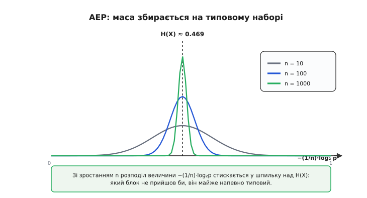
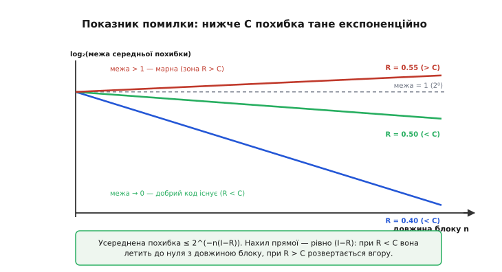
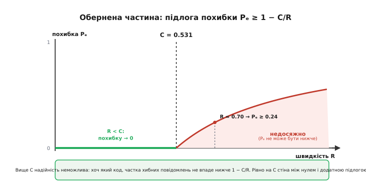

# 🧮 Ядро доказу: типовість, лічба пакування й випадкове кодування

> Теорема про кодування каналу в переказі спирається на чотири образи: шум розмиває передане слово в «хмару» схожих блоків, простір усіх послідовностей має «об'єм», хмар туди вміщується рівно 2^(nC), а серед незліченних кодів «десь існує добрий». Кожен із цих образів — насправді точний математичний об'єкт. Зберемо доказ із першопричин: означимо взаємну інформацію (звідки взагалі береться число C), зробимо «хмару» точною через типові послідовності й властивість асимптотичного рівнорозподілу, полічимо пакування, доведемо існування доброго коду **випадковим кодуванням**, а тоді замкнемо стелю зверху **нерівністю Фано**.

## Чотири нечіткі слова, які треба зробити точними

Інтуїтивна картина оперує словами, що звучать переконливо, але нічого не доводять. «Хмара» — це скільки блоків і яких саме? «Об'єм простору» — у яких одиницях, і чому його можна ділити, як шматок сиру? «Добрий код існує» — існує де, і як це довести, не пред'явивши жодного? Уся строгість теореми — у тому, щоб замінити ці слова на об'єкти, з якими можна рахувати.

Ось словник перекладу, яким ми скористаємось. «Скільки вихід розповідає про вхід» — це **взаємна інформація** I(X;Y), а її максимум і є пропускна здатність C. «Хмара» й «об'єм» — це **типовий набір** та його розмір 2^(nH): майже вся ймовірність довгого блоку сидить у цьому наборі, і елементів у ньому рівно стільки. «Скільки хмар уміщується» — це відношення двох таких об'ємів, що згортається до 2^(nI). «Існує добрий код» — це наслідок того, що **середня** похибка по випадкових кодах прямує до нуля. А «вище C — стіна» — це нерівність Фано, яка зі швидкості R > C добуває незбориму підлогу похибки. П'ять об'єктів, і кожен займе свій розділ.

## Взаємна інформація: скільки вихід розповідає про вхід

Почнімо з числа C. Канал заданий умовними ймовірностями p(y|x) — з якою ймовірністю на виході з'явиться символ y, коли на вхід подали x. Шум у цих числах уже сидить: чистий канал мав би p(y|x) = 1 на правильній парі, шумний розмазує цю одиницю по кількох виходах. Питання: скільки інформації просочується крізь таке розмазування?

Мова для відповіді — ентропія. Невизначеність джерела на вході — це [ентропія Шеннона](topic:math-information/shannon-entropy) H(X) = −Σ p(x)·log₂ p(x), середня кількість бітів несподіванки на символ. Коли ми вже бачимо вихід Y, частина цієї невизначеності лишається — її міряє **умовна ентропія**:

```
H(X|Y) = Σ p(y) · H(X | Y = y)
```

тобто скільки в середньому ще непевності щодо входу після того, як вихід прочитано. Різниця «було непевності — лишилося непевності» і є те, що вихід **розповів** про вхід. Це й називають взаємною інформацією:

```
I(X;Y) = H(X) − H(X|Y)
```

Читається буквально: невизначеність входу мінус та її частина, яку вихід не зняв, дорівнює знятій частині. Та сама величина має ще дві рівносильні форми, і кожна підсвічує свій бік:

```
I(X;Y) = H(Y) − H(Y|X)              (з боку виходу)
I(X;Y) = H(X) + H(Y) − H(X,Y)       (симетрично)
```

Форма з боку виходу H(Y) − H(Y|X) читається так: повна різноманітність виходу мінус та її частина, яку домальовує сам шум (H(Y|X) — невизначеність виходу, коли вхід уже зафіксовано, тобто чистий внесок каналу). Що лишилось — це різноманітність, якою входи справді керують, а не шум. Симетрична форма показує, що взаємна інформація не розрізняє «хто на кого дивиться»: вихід розповідає про вхід рівно стільки ж, скільки вхід про вихід.

Чому I(X;Y) ніколи не від'ємна? Бо це замаскована [розбіжність Кульбака–Лейблера](topic:math-information/kl-divergence): I(X;Y) = D(p(x,y) ‖ p(x)·p(y)) — відстань від справжнього спільного розподілу до того, яким він був би за повної незалежності. Розбіжність невід'ємна завжди й дорівнює нулю лише за збігу розподілів. Тому I(X;Y) ≥ 0, і рівність — рівно тоді, коли вхід і вихід незалежні: канал, у якому вихід нічого не каже про вхід, пропускає нуль інформації. Це не метафора, а тотожність.

Тепер сам C. Умовні ймовірності p(y|x) задає **природа каналу** — їх ми не міняємо. А от розподіл входу p(x) обирає **інженер**: як часто слати кожен символ, під яку статистику налаштувати передавач. Взаємна інформація залежить від обох, тож розумний вибір входу вичавлює з каналу максимум:

```
C = max  I(X;Y)
   p(x)
```

Пропускна здатність — це найбільше, що вихід у принципі здатен розповісти про вхід, за найкращого вибору вхідної статистики. Одиниця — біти на одне використання каналу.

**Приклад (двійковий симетричний канал).** Канал перевертає біт із імовірністю p, інакше пропускає. Тоді H(Y|X) = H(p) — хоч що подай на вхід, шум додає до виходу рівно H(p) невизначеності. Вихід двійковий, тож H(Y) ≤ 1, і рівність H(Y) = 1 досягається за рівноймовірного входу. Звідси:

```
I(X;Y) = H(Y) − H(Y|X) ≤ 1 − H(p)
C = max I = 1 − H(p)          (за рівноймовірного входу)
```

Для p = 0.1: H(0.1) ≈ 0.469, тож C ≈ 0.531 біта на символ. Прозорий вигляд «1 − H(p)» — не збіг, а окремий випадок загального максимуму: одиниця — це «місце» двійкового символа, H(p) — те, що шум забирає, різниця — те, чим можна керувати надійно.

## AEP: закон великих чисел, що переїхав у показник

Тепер зробимо точною «хмару». Уся її магія — в одному спостереженні: доля одного біта непередбачувана, а доля довгого блоку передбачувана майже до певності. Формалізує це властивість асимптотичного рівнорозподілу (англ. *asymptotic equipartition property*, AEP).

Візьмімо джерело, що видає незалежні однаково розподілені символи X₁, X₂, …, Xₙ з розподілом p (мова незалежності й матсподівання — у [основах імовірності](topic:math-probability/probability-basics)). Імовірність конкретної послідовності — добуток:

```
p(X₁ … Xₙ) = p(X₁) · p(X₂) · … · p(Xₙ)
```

Добуток n випадкових множників — незручна річ. Логарифм перетворює його на суму, і тут стається диво. Візьмімо −(1/n)·log₂ від цієї ймовірності:

```
−(1/n)·log₂ p(X₁ … Xₙ) = (1/n) · Σ [ −log₂ p(Xᵢ) ]
```

Праворуч — **середнє** n незалежних однаково розподілених величин −log₂ p(Xᵢ). У кожної з них матсподівання одне й те саме:

```
E[ −log₂ p(X) ] = Σ p(x) · ( −log₂ p(x) ) = H(X)
```

А [закон великих чисел](topic:math-probability/mean-variance) каже: середнє багатьох незалежних однакових величин майже напевно збігається до їхнього матсподівання. Отже:

```
−(1/n)·log₂ p(X₁ … Xₙ)  ⟶  H(X)        (за n → ∞)
```

Перечитаймо, що це означає для самої ймовірності. Якщо −(1/n)·log₂ p ≈ H, то log₂ p ≈ −nH, тобто p(X₁ … Xₙ) ≈ 2^(−nH). **Майже кожна послідовність, яку джерело реально видає, має приблизно однакову ймовірність 2^(−nH).** Звідси й «рівнорозподіл» у назві: типові результати рівноправні за ймовірністю, а весь незліченний натовп нетипових має разом зникомо малу вагу.

Оформимо це як набір. **Типовий набір** A_ε — це всі послідовності, чия ймовірність лежить у вузькій вилці навколо 2^(−nH):

```
A_ε = { послідовності :  | −(1/n)·log₂ p − H |  ≤  ε }
```

Три його властивості — це і є вся машина доказу:

```
(1)  P(A_ε) ⟶ 1          прийнятий блок майже напевно типовий
(2)  p(послідовності) ≈ 2^(−nH)     усі типові ~рівноймовірні
(3)  |A_ε| ≈ 2^(nH)      типових послідовностей — близько 2^(nH)
```

Третя властивість — просто арифметика перших двох: якщо весь набір несе ймовірність ≈ 1, а кожен елемент важить ≈ 2^(−nH), то елементів мусить бути ≈ 1 / 2^(−nH) = 2^(nH). Ось точне значення «об'єму хмари».


*Зі зростанням n розподіл величини −(1/n)·log₂p стягується у вузьку шпильку над H(X). Тому прийнятий блок майже завжди типовий: він потрапляє у вузьку смужку, а не будь-куди.*

**Приклад (відчути стиснення).** Джерело p = (0.9, 0.1), H ≈ 0.469 біта. Блок довжини n = 1000. Усього можливих двійкових послідовностей — 2^1000, число з понад трьомастами нулями. А типових — лише близько 2^469. Їхня частка серед усіх:

```
|A_ε| / (усього)  ≈  2^469 / 2^1000  =  2^(−531)  ≈  10^(−160)
```

Зникомо мала жменька послідовностей — і саме в ній із імовірністю, що прямує до одиниці, опиниться той блок, який джерело справді видасть. Хаос окремого символа обернувся майже певністю на рівні блоку. Це і є строгий зміст фрази «шум, всемогутній на одному символі, передбачуваний за масштабом на довгому блоці».

## Спільна типовість і лічба пакування

Одну послідовність ми опанували; тепер пара «вхід–вихід». Пропустімо код через канал і подивімось на пари (Xⁿ, Yⁿ). Означимо **спільно типовий набір**: пари, де вхід типовий для p(x), вихід типовий для p(y), і сама пара типова для спільного розподілу p(x,y), тобто −(1/n)·log₂ p(xⁿ,yⁿ) ≈ H(X,Y). До кожного з трьох вимірів застосовна та сама AEP, тож усі три рахунки чинні одночасно.

Тепер два підрахунки, з яких і виростає межа. Типових виходів усього:

```
кількість типових yⁿ  ≈  2^(nH(Y))
```

А скільки виходів спільно типові з **одним** заданим входом xⁿ — тобто наскільки широку «хмару» шум розмазує навколо переданого слова? Рівно стільки, скільки невизначеності лишає канал:

```
хмара навколо xⁿ  ≈  2^(nH(Y|X))
```

Простір типових виходів поділено на такі хмари. Скільки роз'єднаних хмар туди влазить — стільки різних входів приймач і зможе безпомилково розрізнити. Ділимо об'єм простору на об'єм однієї хмари:

```
2^(nH(Y))                                                    
─────────────  =  2^( n·[ H(Y) − H(Y|X) ] )  =  2^( n·I(X;Y) )
2^(nH(Y|X))                                                  
```

У показнику проступила рівно взаємна інформація. Максимізуймо вибором входу — і дістанемо 2^(nC). **Ось звідки береться C: це логарифм числа роз'єднаних хмар, що вміщуються в простір виходів, поділений на довжину блоку.** Не «типова» швидкість і не «рекордна», а число місць для неперетинних хмар — рівно C біт на символ.

Ця сама лічба вже натякає на обидві половини теореми. Доки кодових слів менше, ніж вільних хмар (R < C), їх можна розкидати без перетинів. Щойно слів більше, ніж місця (R > C), хмари неминуче налазять — і жодне декодування не розплутає, котре слово було послане. Але «можна розкидати без перетинів» — це поки що обіцянка. Її треба довести, не пред'явивши коду.

## Випадкове кодування: існування без побудови

Задача: розкласти M = 2^(nR) кодових слів так, щоб їхні хмари не збігалися. Прямий шлях — конструювати — веде в нетрі: як гарантувати неперетин мільярдів хмар одразу? Шеннон обійшов конструювання зовсім. Він не будував код — він **рандомізував**.

**Ансамбль.** Згенеруємо кодову книгу з M = 2^(nR) слів, і кожне слово — це n символів, накиданих незалежно з того самого розподілу p(x), що дає C. Усі слова випадкові й незалежні одне від одного. Ми аналізуємо не один код, а весь ансамбль випадкових кодів одразу.

**Декодер спільної типовості.** Прийнявши yⁿ, приймач шукає єдине кодове слово, спільно типове з yⁿ. Знайшлося рівно одне — його й оголошує; жодного або кілька — оголошує помилку. Ніякого перебору «найближчого» за відстанню, лише перевірка типовості.

**Розбір похибки** (усереднюємо і по випадкових книгах, і по повідомленнях; без утрати загальності послано слово номер 1). Помилитися можна лише двома способами:

```
E₀ :  послане слово xⁿ(1) НЕ спільно типове з yⁿ
Eⱼ :  якесь чуже слово xⁿ(j), j ≠ 1, спільно типове з yⁿ
```

Подія E₀ — це збій самої AEP: справжня пара «вхід–вихід» майже завжди типова, тож P(E₀) ⟶ 0. Уся суть — у Eⱼ. Чуже слово xⁿ(j) накидали **незалежно** від того, що послали, отже й незалежно від отриманого yⁿ. Яка ймовірність, що дві незалежні типові послідовності випадково виявляться ще й спільно типовими? Це відношення числа спільно типових пар до числа всіх незалежних пар:

```
                2^(nH(X,Y))
P(випадкова пара спільно типова)  ≈  ─────────────────────  =  2^( −n·I(X;Y) )
                                     2^(nH(X)) · 2^(nH(Y))
```

бо H(X) + H(Y) − H(X,Y) — це та сама взаємна інформація. Одне чуже слово вклинюється в хмару виходу з крихітною ймовірністю 2^(−nI). Але чужих слів M − 1. Оцінка через об'єднання (кожне слово додає свій шанс):

```
P(хоч одне чуже слово типове)  ≤  (M − 1) · 2^(−nI)  <  2^(nR) · 2^(−nI)  =  2^( −n·(I − R) )
```

Складаємо обидва внески:

```
середня похибка  P̄ₑ  ≤  P(E₀)  +  2^( −n·(I − R) )
```

Якщо R < I (а взявши вхід, що дає C, — то й для будь-якого R < C), обидва доданки летять до нуля з довжиною блоку. Показник (I − R) додатний — і похибка тане експоненційно.


*Усереднена похибка обмежена 2^(−n(I−R)). У логарифмі це пряма з нахилом рівно (I−R): нижче C вона летить до нуля з довжиною блоку, вище C розвертається вгору й межа стає марною.*

Тепер сам фокус існування. Ми довели, що **середня** по всіх випадкових книгах похибка прямує до нуля. Але середнє не буває меншим за найкращого учасника: якщо середня похибка мала, то щонайменше одна книга в ансамблі має похибку не гіршу за середню. Отже **добрий код існує** — доведено, хоча ми не побудували жодного й не знаємо, який саме. Це доказ існування без побудови: скарб напевно є, а де копати — теорема мовчить.

**Приклад (наскільки мала похибка).** Візьмімо I = C = 0.531 (той самий канал, p = 0.1) і блок n = 1000.

```
R = 0.40 :  P̄ₑ ≲ 2^(−1000·0.131) = 2^(−131) ≈ 4·10^(−40)   (практично нуль)
R = 0.50 :  P̄ₑ ≲ 2^(−1000·0.031) = 2^(−31)  ≈ 5·10^(−10)   (усе ще мала; запас I−R тане)
R = 0.55 :  показник (I − R) = −0.019 < 0 → оцінка 2^(+19) — марна   (це вже R > C)
```

Видно і силу, і межу методу. При R = 0.40 гарантія астрономічна. При R = 0.50 запас I − R стиснувся, і похибка помітно більша, хоч усе ще мала. А щойно R переступає C, показник міняє знак, оцінка через об'єднання вибухає — і це вже тінь оберненої частини.

**Дрібний борг: найгірше повідомлення.** Мала *середня* похибка не боронить, що якесь одне слово в книзі — нещасливе. Лагодиться це **проріджуванням** (англ. *expurgation*): викидаємо гіршу половину слів, і в решти *максимальна* похибка теж мала, а швидкість платить лиш R → R − 1/n — зникома данина за велике n. Тож надійне навіть найгірше повідомлення.

## Обернена частина: нерівність Фано як стіна згори

Пряма частина показала: R < C — можна. Лишилося довести, що R > C — **не «важче», а неможливо**. Інструмент — нерівність, яку в MIT на початку 1950-х вивів Роберто Маріо Фано (*Robert Fano*), уродженець Турина з італійсько-єврейської родини, син математика Джино Фано, що втік від фашизму до США й пізніше записав цю нерівність у своєму підручнику 1961 року.

**Постановка.** Повідомлення W рівноймовірне серед M = 2^(nR) варіантів; його кодують у Xⁿ, канал видає Yⁿ, декодер повертає Ŵ. Позначмо Pₑ = P(Ŵ ≠ W) — ймовірність помилки.

**Нерівність Фано.** Скільки невизначеності щодо W лишається, коли ти вже маєш здогад Ŵ? Фано обмежує це згори через те, як часто ти помиляєшся:

```
H(W | Ŵ)  ≤  1  +  Pₑ · log₂(M − 1)  ≤  1  +  Pₑ · nR
```

Інтуїція проста. Щоб описати W за наявного здогаду Ŵ, спершу перекажи один біт — «вгадав / ні» (звідси одиниця). Якщо схибив (а це стається з часткою Pₑ), доведеться ще вказати, котре ж із решти M − 1 повідомлень було насправді — а це не більше ніж log₂(M − 1) біт, зважених на Pₑ. Мала похибка — мала залишкова невизначеність; і навпаки, велика залишкова невизначеність силоміць тягне за собою велику похибку. Саме «навпаки» нам і потрібне.

Тепер ланцюг нерівностей, що замикає стелю. Оскільки W → Xⁿ → Yⁿ → Ŵ — послідовна обробка, а канал без пам'яті:

```
nR  =  H(W)                              (повідомлення рівноймовірне)
    =  I(W; Ŵ)  +  H(W | Ŵ)              (означення взаємної інформації)
    ≤  I(Xⁿ; Yⁿ)  +  H(W | Ŵ)            (обробка не додає інформації)
    ≤  n·C       +  H(W | Ŵ)             (канал без пам'яті: n використань дають ≤ nC)
    ≤  n·C  +  1  +  Pₑ · nR             (нерівність Фано)
```

Дві сходинки варті пояснення. «Обробка не додає інформації»: Ŵ обчислено з Yⁿ, тож про W воно не може знати більше, ніж знає сам Yⁿ, — звідси I(W;Ŵ) ≤ I(Xⁿ;Yⁿ). «Канал без пам'яті дає ≤ nC»: інформація складається по використаннях, бо H(Yⁿ|Xⁿ) = Σ H(Yᵢ|Xᵢ), а H(Yⁿ) ≤ Σ H(Yᵢ), тож I(Xⁿ;Yⁿ) ≤ Σ I(Xᵢ;Yᵢ) ≤ nC — кожне окреме використання не перевершить C.

Лишилось поділити на n і виразити похибку:

```
Pₑ  ≥  1  −  C/R  −  1/(nR)
```

За n → ∞ останній доданок зникає, і оголюється підлога:

```
Pₑ  ≥  1  −  C/R
```

Якщо R > C, то C/R < 1, а отже 1 − C/R > 0 — **строго додатна підлога похибки, хоч що роби**. Ніяка модуляція, ніяке кодування, ніяка довжина блоку її не пробʼють: збільшуй n скільки завгодно — підлога стоїть. Це і є стіна згори. (Строго кажучи, це «слабка» обернена: вона дає додатний поріг. Сильніша версія — теорема Вольфовіца — доводить навіть Pₑ → 1: вище C помилка не просто не зникає, а стає майже певністю.)


*Ліворуч від C похибку можна загнати в нуль (пряма частина). Праворуч на неї лягає незборима підлога 1 − C/R, що росте зі швидкістю. Рівно на C — стіна між нулем і додатною підлогою.*

**Приклад (підлога в числах).** Той самий канал, C = 0.531. Женемо швидше за стелю, R = 0.7:

```
Pₑ  ≥  1 − C/R  =  1 − 0.531/0.7  =  1 − 0.759  ≈  0.241
```

Щонайменше близько 24% повідомлень приходять хибними — назавжди, за будь-якого коду й будь-якої довжини блоку. Для контрасту при R = 0.40 < C пряма частина заганяла ту саму похибку в 10^(−40). Дві половини теореми затискають межу з обох боків рівно на C: ліворуч похибку можна зробити як завгодно малою, праворуч вона не може впасти нижче додатної підлоги.

## П'ять об'єктів, зібраних докупи

Тепер уся будова видна цілком. **Взаємна інформація** дала саме число: C = max I(X;Y), скільки вихід здатен розповісти про вхід за найкращого входу. **AEP** зробила «хмару» точною: майже вся ймовірність довгого блоку сидить у типовому наборі розміру 2^(nH), решта — зникомий пил. **Лічба пакування** поділила об'єм простору на об'єм хмари й дістала рівно 2^(nC) роз'єднаних місць. **Випадкове кодування** довело, що стільки слів справді можна розкидати без збігів — усередненням похибки по випадкових кодах, без жодної побудови (пряма частина). А **нерівність Фано** показала, що більше — не можна: вище C на похибку лягає підлога 1 − C/R (обернена частина). Два твердження, одне число, різка стіна між ними.

> 🔧 **Навіщо це.** Цей доказ — не лише про канали. Зв'язка «типовість + випадкове усереднення» стала **шаблоном усієї теорії інформації**: тим самим прийомом доводять межу стиснення джерела, межу «швидкість–спотворення», результати мережевої теорії інформації; навіть сучасні оцінки узагальнення в машинному навчанні відлунюють цю саму лічбу типових множин. І саме **неконструктивність** ядра — «добрий код існує, а який, не знаю» — пояснює, чому між доказом 1948 року й кодами, що справді торкнулися C, лягло майже пів століття інженерної праці: Шеннон показав, що скарб є, але карти не лишив.
