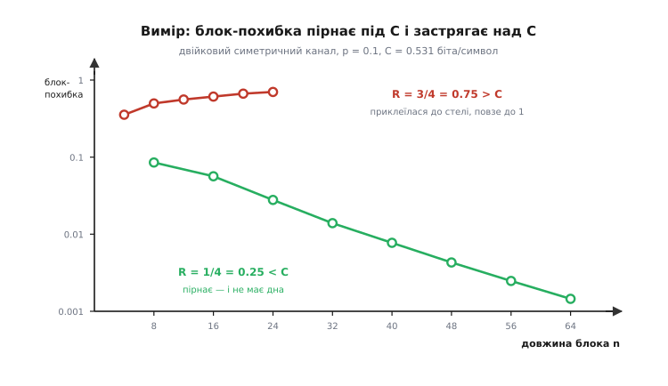
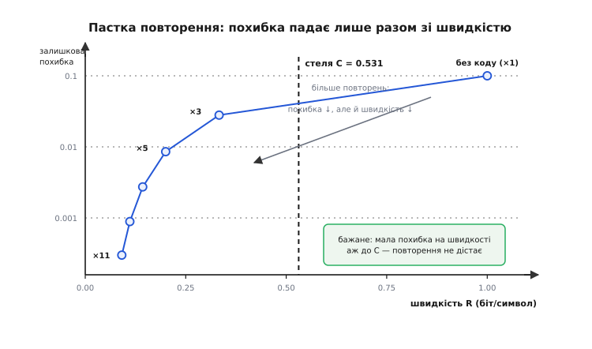

# ⚙️ Поріг на екрані: симулятор, що впирається в стіну C

> Число 0.531 треба або побачити, або не вірити в нього. Зберемо найменший чесний дослід, у якому стіна на C проявляється сама: випадковий код, декодер найближчого сусіда, канал, що перевертає кожен десятий біт. Далі — самі виміряні числа: під стелею похибка пірнає на два порядки й не має дна, над стелею повзе до одиниці, а повторення стоїть рівною лінією й не рушає. Наприкінці — чому цей симулятор упирається в експоненційну стіну рівно там, де стає найцікавіше, і чому це не вада коду, а той самий клопіт, що тримав інженерів сорок п'ять років.

## Задача: змусити стіну проявитися самій

Канал перевертає кожен десятий біт. Теорія обіцяє 0.531 біта корисного вантажу на кожен переданий символ — і похибку, що прямує до нуля. Поруч стоїть потрійне повторення: воно везе 0.333 біта й помиляється 28 разів на тисячу. Обіцянка краща за повторення не в чомусь одному, а **водночас** і швидкістю, і надійністю. Так виглядає безкоштовний обід, а безкоштовних обідів не буває.

Обід не безкоштовний — платня схована в довжині блока. Але «платня в довжині» легко сказати й важко відчути: ніщо в цій фразі не підказує, чи то платня в десять символів, чи в десять тисяч. Дослід має відповісти саме на це — цифрою, яку видно.

Якщо теорія правдива, симулятор мусить показати три різні поведінки, і жодну з них не можна підробити налаштуванням. Нижче C похибка мусить падати **без дна**: хоч якого малого числа ти досяг, довший блок дасть ще менше. Вище C їй мало застрягнути — вона мусить поповзти вгору, до одиниці, бо простір уже не вміщує стільки роз'єднаних слів. А повторення мусить лишитися **рівною лінією**: воно бореться з шумом посимвольно, довжина блока йому нічого не дає, і жодне збільшення n його не зрушить. Три криві, що поводяться геть по-різному в одному й тому ж каналі, — оце і є поріг, побачений на очі.

## Три рішення, що роблять дослід чесним

Канал беремо найпростіший — [двійковий симетричний](topic:math-information/binary-symmetric-channel): кожен біт незалежно перевертається з імовірністю p, інакше проходить цілим; нічого, крім p, у ньому немає. Він потрібен тут як лабораторний щур: його пропускну здатність знають точно, тож вимір є з чим звіряти.

Перше рішення — **книга кодових слів випадкова**, буквально `rng.integers(0, 2, ...)`. Спокуса взяти «хороший» код велика, але тоді дослід поміряє винахідливість того, хто його добирав. Доведення Шеннона говорить про **середнє по випадкових кодах**; беручи навмання, ми міряємо рівно те, що він довів, а не свою вправність.

Друге — **декодер грубої сили**: прийнятий блок порівнюємо з усіма M словами книги й беремо найближче за [відстанню Геммінга](topic:com-modulation/hamming-distance) (кількість позицій, у яких два блоки різняться). Для двійкового симетричного каналу при p < 0.5 найближче слово і є найправдоподібнішим: кожен зайвий перевернутий біт домножує ймовірність на p/(1−p) < 1, тож що менше розбіжностей, то ймовірніша гіпотеза. Це найсильніший можливий декодер — за ним не сховається жодна недороблена евристика. Якщо похибка велика, винен код, а не декодер.

Третє — **швидкість фіксована, росте n**. Саме це вісь твердження: не «менше помилок ціною темпу», а «той самий темп, довший блок». Тому в кожному прогоні кількість інформаційних бітів k = R·n мусить бути цілою — інакше коду просто не існує, і будь-яка крива «при R = 0.7 і n = 8» намальована пальцем, бо k = 5.6 біта не буває.

## Відстань Геммінга через скалярний добуток

Наївно рахувати відстані — це M·n порівнянь на кожен прийнятий блок, вкладеними циклами Python, тобто вічність. Але відстань Геммінга — це переодягнений скалярний добуток. Перепишімо біти 0/1 як −1/+1. Тоді кожна позиція, де блоки збігаються, дає в добуток +1, а кожна, де різняться, −1:

```
для векторів із ±1:  ⟨x, y⟩ = (збіги) − (розбіжності) = (n − d) − d = n − 2d

звідси:              d = (n − ⟨x, y⟩) / 2
```

Відстань спадає рівно тоді, коли добуток росте, тож **найближче слово = слово з найбільшим скалярним добутком**, і ділити на 2 не треба взагалі. А скалярні добутки «кожен прийнятий блок × кожне слово книги» — це один добуток матриць, який BLAS зробить на всіх ядрах з векторними інструкціями. Груба сила лишається грубою, але виконує її бібліотека, вилизана до останнього такту.

Точність тут задарма: усі проміжні суми — цілі числа, за модулем не більші за n, а float32 тримає цілі точно аж до 2²⁴. Жодного накопичення похибки, скільки б BLAS не переставляв доданки.

## Симулятор

Ядро — шістдесят рядків без жодної залежності, крім NumPy:

```python
# bsc_threshold.py — поріг Шеннона на власні очі
import numpy as np
from math import comb

_POP = np.array([bin(i).count("1") for i in range(256)], dtype=np.uint8)

def popcount(a):
    """Кількість одиничних бітів — побайтово через таблицю (numpy < 2.0 не має bitwise_count)."""
    a = np.asarray(a, dtype=np.uint32)
    return (_POP[a & 0xFF].astype(np.int64) + _POP[(a >> 8) & 0xFF]
            + _POP[(a >> 16) & 0xFF] + _POP[(a >> 24) & 0xFF])

def h2(p):
    """Двійкова ентропія, біт."""
    if p <= 0.0 or p >= 1.0:
        return 0.0
    return -p * np.log2(p) - (1 - p) * np.log2(1 - p)

def capacity(p):
    return 1.0 - h2(p)

def random_codebook(k, n, rng):
    """M = 2^k слів довжини n, кинутих навмання — саме той ансамбль, про який теорема."""
    return rng.integers(0, 2, size=(1 << k, n), dtype=np.int8)

def repetition_codebook(r):
    """Повторний код як книга з двох слів: 000… і 111…"""
    return np.array([[0] * r, [1] * r], dtype=np.int8)

def simulate(book, p, trials, rng, chunk=64):
    """Ганяє книгу крізь BSC. Декодер — найближчий сусід (він же ML).
    Повертає: (кількість блокових похибок, частка блокових, частка бітових)."""
    M, n = book.shape
    k = int(round(np.log2(M)))
    pm = 2 * book.astype(np.float32) - 1          # книга у ±1, рахуємо один раз
    blk = 0
    bit = 0
    for s in range(0, trials, chunk):             # пачками — інакше t×M не влізе в пам'ять
        t = min(chunk, trials - s)
        msg = rng.integers(0, M, size=t)
        noise = (rng.random((t, n)) < p).astype(np.int8)
        recv = book[msg] ^ noise                  # канал: незалежний переворот кожного біта
        corr = (2 * recv.astype(np.float32) - 1) @ pm.T    # t×M скалярних добутків
        guess = np.argmax(corr, axis=1)           # max добуток = min відстань
        blk += int((guess != msg).sum())
        bit += int(popcount(guess ^ msg).sum())   # біти повідомлення = двійковий запис індексу
    return blk, blk / trials, bit / (trials * k)

def rep_ber(r, p):
    """Точна залишкова похибка мажоритарного повторення ×r: хвіст біноміального розподілу."""
    return sum(comb(r, j) * p**j * (1 - p)**(r - j) for j in range((r + 1) // 2, r + 1))
```

Повідомлення — це просто **індекс** слова в книзі, тому бітові похибки лічаться без жодного окремого кодера: `guess ^ msg` дає різницю двійкових записів індексів, а `popcount` — скільки біт повідомлення поїхало. Драйвер лишається тривіальним:

```python
def sweep(title, plan, p):
    print(f"\n=== {title}")
    print("    n    k        M     R   P_block   помилок/спроб        BER")
    for n, k, T in plan:
        rng = np.random.default_rng(900 + n)      # свій сид на рядок — рядок відтворний окремо
        cnt, pb, ber = simulate(random_codebook(k, n, rng), p, T, rng)
        print(f"  {n:3d}  {k:3d}  {1<<k:7d}  {k/n:.3f}  {pb:.6f}  {cnt:6d}/{T:<7d}  {ber:.6f}")

p = 0.1
print(f"p = {p}   H(p) = {h2(p):.4f}   C = 1 - H(p) = {capacity(p):.4f} біта/символ")
print(f"повторення x3: R = {1/3:.3f}, BER = {rep_ber(3,p):.5f} (незмінна)")
print(f"повторення x5: R = {1/5:.3f}, BER = {rep_ber(5,p):.5f} (незмінна)")

sweep("A. R = 1/4 = 0.250 < C: похибка падає",
      [(8,2,40000),(16,4,40000),(24,6,40000),(32,8,40000),
       (40,10,40000),(48,12,40000),(56,14,40000),(64,16,40000)], p)
sweep("B. R = 3/4 = 0.750 > C: похибка росте до 1",
      [(4,3,20000),(8,6,20000),(12,9,20000),(16,12,20000),(20,15,20000),(24,18,20000)], p)
sweep("C. R = 1/5 = 0.200 < C: дуель із повторенням x5 (BER 0.00856)",
      [(10,2,40000),(20,4,40000),(30,6,40000),(40,8,100000),
       (50,10,200000),(60,12,400000),(70,14,400000)], p)
```

## Спершу — самоперевірка

Симулятор, якого не звіряли з відомою відповіддю, міряє твої помилки, а не канал. На щастя, одну відповідь ми знаємо **точно**: мажоритарне повторення ×r помиляється рівно тоді, коли шум перевернув більшість із r копій, а це хвіст біноміального розподілу — закрита формула, без жодної симуляції. Пропустимо повторний код крізь той самий `simulate`, що й усе інше:

```
повторення ×3: виміряно 0.02813   формула 0.02800
повторення ×5: виміряно 0.00831   формула 0.00856
повторення ×7: виміряно 0.00273   формула 0.00273
```

Збіг до третьої значущої цифри — при 400 000 спроб на рядок саме такого розкиду й чекаємо. Отже, канал перевертає біти правильно, декодер справді бере найближче слово, а лічильник похибок лічить те, що треба. Тільки після цього має сенс дивитися на числа, яких ніхто не знає наперед.

> 🔧 **Навіщо це.** Повторний код тут — не суперник, а **еталон**. Він єдиний у всьому досліді має точну формулу, тож служить пробним тілом: якщо симулятор відтворює 0.028 на коді ×3, значить, помилки в наступних таблицях — властивість каналу, а не твого коду. Ставити такий еталон у кожен вимірювальний конвеєр дешевше, ніж потім гадати, чому крива дивна: без нього «несподіваний результат» і «баг» виглядають однаково.

## A: нижче C похибка не має дна

Швидкість R = 1/4 = 0.25 — вдвічі менша за стелю C = 0.531. Тримаємо її сталою й розтягуємо блок:

```
    n    k        M     R   P_block   помилок/спроб        BER
    8    2        4  0.250  0.085125    3405/40000    0.072663
   16    4       16  0.250  0.056400    2256/40000    0.031181
   24    6       64  0.250  0.027800    1112/40000    0.013763
   32    8      256  0.250  0.013900     556/40000    0.007009
   40   10     1024  0.250  0.007725     309/40000    0.003960
   48   12     4096  0.250  0.004300     172/40000    0.002115
   56   14    16384  0.250  0.002475      99/40000    0.001236
   64   16    65536  0.250  0.001450      58/40000    0.000722
```

Швидкість у стовпчику R не ворухнулася жодного разу, а похибка впала в п'ятдесят вісім разів. Дна не видно: кожні наступні вісім символів ділять її приблизно навпіл, і ніщо в таблиці не натякає, що падіння от-от спиниться. Саме це й означає «як завгодно мала похибка при сталій швидкості» — не якесь конкретне мале число, а **відсутність підлоги**.

## B: вище C похибка повзе до одиниці

Тепер R = 3/4 = 0.75 — вище за стелю. Наївне очікування: буде «приблизно як раніше, тільки гірше». Реальність інша:

```
    n    k        M     R   P_block   помилок/спроб        BER
    4    3        8  0.750  0.354350    7087/20000    0.186633
    8    6       64  0.750  0.497600    9952/20000    0.241975
   12    9      512  0.750  0.558400   11168/20000    0.279889
   16   12     4096  0.750  0.610250   12205/20000    0.305871
   20   15    32768  0.750  0.666200   13324/20000    0.335450
   24   18   262144  0.750  0.701050   14021/20000    0.351992
```

Крива йде **в інший бік**. Довший блок — гірше, і монотонно: 0.354 → 0.701. Довжина блока, що під стелею була ліками, над стелею стала отрутою. Це не насичення й не «застрягла похибка» — це блокова похибка, яка повзе до одиниці: при R > C майже кожен довгий блок буде прийнято хибно. Хмари слів налазять одна на одну, і що довший блок, то надійніше вони перекриваються.

Бітова похибка тим часом суне до 0.5 — до чистого підкидання монети. Обернена частина теореми ставить їй підлогу: при R = 0.75 частка хибних біт не може бути меншою за δ, де H(δ) ≥ 1 − C/R = 0.292, тобто δ ≥ 0.0513. Виміряні 0.352 цю підлогу поважають із великим запасом — випадковий код над стелею не просто не досягає межі, він від неї страшенно далеко. Але напрямок руху сумнівів не лишає.


*Ті самі числа на логарифмічній осі. Одна крива пірнає, друга повзе вгору — і між ними немає нічого проміжного: обидві живуть в одному каналі, з однаковим шумом, і різняться лише швидкістю. Оце і є поріг, знятий приладом.*

## C: дуель на однаковій швидкості

Дві попередні таблиці показали поріг, але не відповіли на найпряміше запитання: а **при тій самій швидкості** блоковий код справді кращий за повторення — чи то лише асимптотична казка?

Порівняння чесне тільки за однакової швидкості. Повторення ×5 везе рівно 1/5 біта на символ і помиляється на 0.00856 — незмінно, при будь-якій довжині повідомлення. Ставимо проти нього випадковий код тієї самої швидкості 1/5:

```
    n    k        M     R   P_block   помилок/спроб        BER
   10    2        4  0.200  0.064025    2561/40000    0.058275
   20    4       16  0.200  0.013050     522/40000    0.007544
   30    6       64  0.200  0.006925     277/40000    0.003333
   40    8      256  0.200  0.002960     296/100000   0.001459
   50   10     1024  0.200  0.000965     193/200000   0.000449
   60   12     4096  0.200  0.000340     136/400000   0.000170
   70   14    16384  0.200  0.000138      55/400000   0.000067
```

При n = 10 випадковий код **програє** з розгромом: 0.058 проти 0.00856, всемеро гірше. Десь між n = 10 і n = 20 криві перетинаються, а далі повторення лишається позаду назавжди: при n = 70 бітова похибка 0.000067 проти 0.00856 — **у 128 разів менша за тієї самої швидкості 1/5**.

Ось де схована платня. Блоковий код не «кращий» сам собою — на коротких блоках він відверто гірший, бо кидати слова навмання в тісний простір безглуздо. Він стає кращим, коли простір досить великий, щоб випадкові слова розійшлися далеко одне від одного. Довжина блока — не технічна дрібниця, а те єдине, що взагалі купує перевагу.


*Точний біноміальний хвіст для повторення ×1, ×3, ×5, ×7, ×9, ×11. Траєкторія тікає вниз-і-ліворуч: кожен крок до меншої похибки оплачено швидкістю. Правий-нижній кут — мала похибка при швидкості аж до C — для повторення недосяжний у принципі, і саме його теорема оголошує заселеним.*

Тепер видно ціну наївності повністю. Повторення ×3 стоїть на швидкості 0.333 із похибкою 0.028 і, щоб її збити, мусить сповзати ліворуч — до 0.2, до 0.143, до 0.091. Стеля ж C = 0.531 лежить **праворуч** від усіх його точок. Повторення не просто не дотягує до межі — воно рухається від неї геть.

## Швидке ядро на C++

NumPy добіг до n = 70 за десятки секунд, і далі впирається: BLAS множить float32, тобто витрачає ціле число з плаваючою комою на кожен **один** біт. А біти люблять пакуватися — у 64-бітному слові їх поміщається шістдесят чотири, і `popcount` порівнює всі шістдесят чотири за одну інструкцію. Це вже не оптимізація на відсотки, а інша розмірність задачі, і тут доречна мова, що дає дістатися до машинного слова без посередників:

```cpp
// bsc.cpp — те саме, але книга спакована в 64-бітні слова
// збірка:  g++ -O3 -march=native -std=c++20 bsc.cpp -o bsc
#include <bit>
#include <cstdint>
#include <cstdio>
#include <random>
#include <vector>

int main() {
    const int n = 70, k = 14;                 // R = k/n = 0.2
    const double p = 0.1;
    const int trials = 400000;
    const size_t M = size_t(1) << k;
    const int W = (n + 63) / 64;              // машинних слів на кодове слово

    std::mt19937_64 rng(900 + n);
    std::bernoulli_distribution flip(p), coin(0.5);

    // книга: M випадкових слів; біти за межами n лишаються нулями в ОБОХ
    // операндах XOR, тож у відстань не потрапляють
    std::vector<uint64_t> book(M * W, 0);
    for (size_t m = 0; m < M; ++m)
        for (int i = 0; i < n; ++i)
            if (coin(rng)) book[m * W + i / 64] |= uint64_t(1) << (i % 64);

    std::uniform_int_distribution<size_t> pick(0, M - 1);
    std::vector<uint64_t> recv(W);
    long long errors = 0;

    for (int t = 0; t < trials; ++t) {
        size_t msg = pick(rng);
        for (int w = 0; w < W; ++w) recv[w] = book[msg * W + w];
        for (int i = 0; i < n; ++i)
            if (flip(rng)) recv[i / 64] ^= uint64_t(1) << (i % 64);

        int best = n + 1;
        size_t guess = 0;
        for (size_t m = 0; m < M; ++m) {       // груба сила, але 64 біти за такт
            int d = 0;
            for (int w = 0; w < W; ++w)
                d += std::popcount(recv[w] ^ book[m * W + w]);
            if (d < best) { best = d; guess = m; }
        }
        errors += (guess != msg);
    }
    std::printf("n=%d k=%d M=%zu R=%.3f  P_block=%.6f  (%lld/%d)\n",
                n, k, M, double(k) / n, double(errors) / trials, errors, trials);
}
```

Генератор випадкових чисел тут інший, ніж у NumPy, тож і сама вибірка інша: числа мусять збігтися **статистично**, а не побітово. Якщо ж вони розійдуться помітно більше, ніж дозволяє лічильник похибок у дужках, — це не «інший сид», а привід шукати помилку в одному з двох.

## Складність: стіна 2^(nR)

Декодування коштує M·n = 2^(nR)·n операцій **на кожен блок**, і в цьому показнику n сидить у степені. Ось що це означає для найцікавішої швидкості R = 1/2:

```
R = 1/2:   n = 20  →  M = 2¹⁰ ≈ 10³        мить
           n = 40  →  M = 2²⁰ ≈ 10⁶        відчутно
           n = 60  →  M = 2³⁰ ≈ 10⁹        години
           n = 100 →  M = 2⁵⁰ ≈ 10¹⁵       ніколи
```

Ось чому в таблицях вище стоїть R = 1/4, а не R = 1/2, ближче до стелі: при R = 1/4 довжина n = 64 коштує лише M = 2¹⁶ слів, а при R = 1/2 та сама довжина коштувала б 2³² — у шістдесят п'ять тисяч разів дорожче за прогін.

Іронія жорстока: **чим ближче до C, тим цікавіше — і тим неможливіше порахувати**. Швидкість падіння похибки задає показник випадкового кодування E_r(R) — похибка йде як 2^(−n·E_r(R)):

```
E₀(ρ) = ρ − (1+ρ)·log₂[ (1−p)^(1/(1+ρ)) + p^(1/(1+ρ)) ]
E_r(R) = max E₀(ρ) − ρ·R        по ρ ∈ [0, 1]

p = 0.1  (C = 0.531):
  E_r(1/5) = 0.1223      E_r(1/4) = 0.0820
  E_r(1/3) = 0.0368      E_r(0.4) = 0.0151
```

Показник тане, щойно швидкість підповзає до стелі, — і тане катастрофічно. При R = 0.4 він уже 0.0151, тож щоб побачити скромну похибку 0.01, потрібен блок n ≈ 440, а це книга з 2¹⁷⁶ слів. Не «довго» — фізично неможливо, у Всесвіті стільки не набереться. Наш дослід міг показати падіння лише тому, що тримався далеко від C, де показник ще товстий.

Теорію можна й перевірити. Виміряний нахил кривої A в середині (n = 32 → 48) — 0.106 біта на символ, на хвості (n = 56 → 64) — 0.0964; передбачена асимптотика — 0.0820. Числа одного порядку, і локальний нахил сповзає до теоретичного зі зростанням n, як і має: E_r — це нахил на нескінченності, а не обіцянка для n = 64. На найкоротших блоках нахил узагалі стрибає (на n = 8 → 16 він 0.074), і це не парадокс, а нагадування, що показник нічого не винен коротким блокам.

## Пастки

**Дублікати кодових слів.** При R = 3/4 і n = 20 книга має 2¹⁵ = 32 768 слів, а всього різних блоків існує 2²⁰ ≈ 1.05 млн. За парадоксом днів народження очікуємо ≈ M²/2/2ⁿ = 512 пар-збігів — і симулятор дає 481 втрачене слово з 32 768. При n = 24, k = 18 — очікувано 2048, фактично 2067. Це **не баг**: ансамбль Шеннона справді кидає слова незалежно, тобто з поверненням, і зіткнення — частина того, чому середня похибка над стелею така кепська. Двом однаковим словам жоден декодер не зарадить. У дослідах під стелею (n = 64, k = 16 і n = 70, k = 14) дублікатів немає жодного — простір достатньо просторий.

**Нічия й вибір найменшого індексу.** `np.argmax` при рівних відстанях бере **перший** максимум, тобто слово з меншим індексом. Здається несправедливим: якщо слова i < j збіглися, то j програє завжди. Але по ансамблю це чесно — індекси у випадковій книзі не несуть жодної інформації, тож i та j симетричні: перевага меншому індексу дає в середньому те саме, що й підкидання монети. Небезпека в іншому: щойно ти заміниш випадкову книгу на **структурований** код, індекси перестануть бути порожніми ярликами, і таке розв'язання нічиїх почне тихо брехати. Тоді нічию треба ламати чесно.

**Блокова похибка — не бітова.** Змішати їх — найлегший спосіб отримати нісенітницю: 0.028 у повторення це **бітова** частка, а P_block у таблицях — частка **блоків**. Зв'язок між ними для випадкового коду простий: помилившись, декодер вибирає хибний індекс, майже рівномірний серед решти, тож псується приблизно половина бітів повідомлення:

```
BER / P_block ≈ 2^(k−1) / (2^k − 1) → 0.5

k = 4:  прогноз 0.5333   вимір 0.5529
k = 8:  прогноз 0.5020   вимір 0.5042
k = 16: прогноз 0.5000   вимір 0.4979
```

Але на найменшому k = 2 прогноз 0.667 проти виміряних 0.854: коли повідомлень усього чотири, «хибний індекс» — надто грубе поняття, щоб про нього говорити середніми. Формула ловить суть із k = 4, не раніше.

**Рідкісні події коштують спроб.** Рядок n = 70 дав 55 похибок на 400 000 спроб. Відносна невизначеність — приблизно 1/√55 ≈ 13 %, і це вже межа розумного: щоб побачити 0.00001, треба мільйони прогонів. Тому в таблицях стоїть **лічильник похибок**, а не тільки частка: 0.000138 із трьох похибок і 0.000138 із трьохсот — різні за вагою твердження, а виглядають однаково. Правило просте: менше ніж 30 похибок у клітинці — це ще не вимір.

**Пам'ять.** Книга — це M·n байтів, і при M = 2¹⁸ та n = 24 це вже 6 МБ, а матриця добутків `t×M` за пачки в 64 блоки — ще 67 МБ float32. Звідси `chunk`: без розбиття на пачки програма падає не через логіку, а через `MemoryError`.

**Найглибша пастка — те, чого дослід не доводить.** Цей симулятор не збудував жодного придатного коду. Він перебирає всі 2^(nR) слів на кожен блок, бо у випадковій книзі немає **структури**, за яку можна зачепитися: єдиний спосіб знайти найближче слово — оглянути всі. Тому й таблиці обриваються на n = 70, а не на n = 7000, де похибка була б справді мізерною. Це і є становище самого Шеннона: доведено, що добрий код існує, але не сказано, де копати, а перебір скарбу не варт. Практичні коди — як [LDPC](topic:com-modulation/ldpc), розріджені перевірки парності яких декодуються поширенням віри замість перебору, — купують декодовність саме структурою: вони відмовляються від повної випадковості рівно настільки, щоб лишитися майже такими ж добрими, але стати доступними. Порожній правий-нижній кут із фігури заселили аж через сорок п'ять років — і зайшли туди не грубою силою, а хитрістю.
