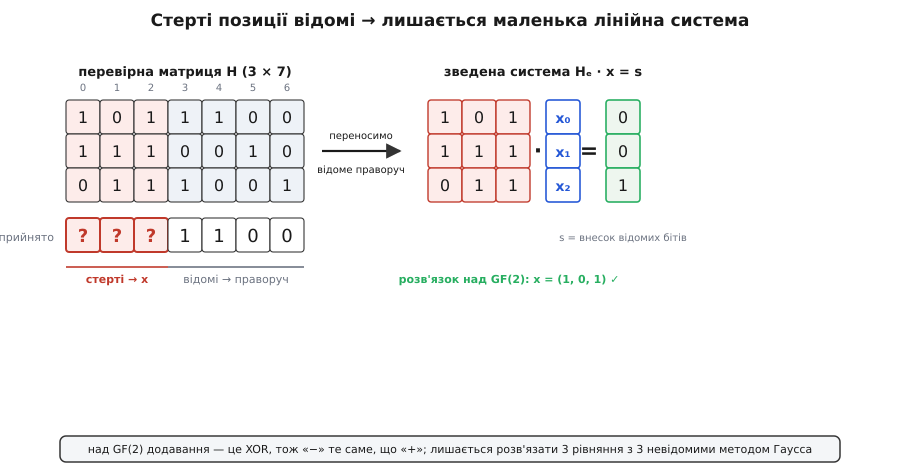
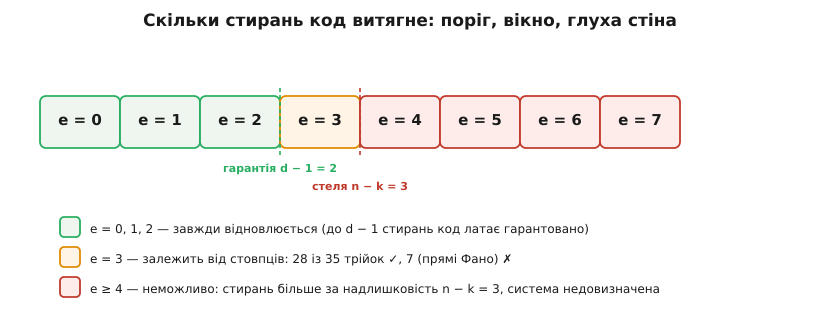

# ⚙️ Латання стирань: відновлення як лінійна система над GF(2)

Коли канал стирає символи, а не спотворює їх, приймач знає **адресу** кожної діри — і саме це перетворює відновлення з важкої задачі декодування на просту: розв'язати лінійну систему, невідомі якої — рівно стерті символи. Тут ми будуємо таку систему з нуля, розв'язуємо її над полем із двох елементів і знаходимо межу, за якою метод упирається в стіну.

Домовмося про модель у коді. Стирання — це заміна символа на позначку «немає», яку зручно подати як `None`; усе інше проходить незмінним.

```python
import random

def erasure_channel(word, p, rng):
    """Кожен символ незалежно стирається (стає None) з імовірністю p."""
    return [b if rng.random() >= p else None for b in word]
```

Уся сила методу тримається на одному: `None` стоїть на **відомій** позиції. Спотворений канал сховав би підміну серед правильних на вигляд символів, і довелося б відповідати на два питання — де і що. Тут кожна втрата підписана, тож перше питання відпадає, а лишається саме те, що розв'язується лінійною алгеброю.

## Найпростіший важіль: одне стирання і парність

Почнімо з коду, що додає єдиний [біт парності](root:com-modulation/parity-bit) — зайвий біт, підібраний так, щоб число одиниць у слові було парним. Якщо потім стирається рівно один біт, його відновлюють однією дією: він мусить бути таким, щоб парність зійшлася знову, тобто дорівнює XOR усіх уцілілих бітів.

```python
def parity_encode(data):
    """Додати біт парності: сумарне число одиниць стає парним."""
    return data + [sum(data) % 2]

def recover_one_erasure(received):
    """Рівно одне None. Стертий біт = XOR решти (щоб знову було парно)."""
    i = received.index(None)
    received[i] = 0
    for b in received:
        if b is not None:
            received[i] ^= b
    return received
```

Чому саме XOR решти? Умова парності — це одне лінійне рівняння: сума всіх бітів за модулем 2 дорівнює нулю. Один невідомий доданок у рівнянні `x₀ ⊕ x₁ ⊕ … ⊕ xₙ₋₁ = 0` знаходиться однозначно перенесенням решти на другий бік. Парність — це вже вся ідея методу, тільки в мініатюрі: одне рівняння, одна невідома. Лишається побачити її в повний зріст.

## Загальний закон: перевірна матриця розпадається на дві частини

Візьмімо [лінійний код](root:com-modulation/linearity-as-code-property) — такий, де множина припустимих слів задана лінійно: кодове слово c є будь-яким вектором, що обнуляє **перевірну матрицю** H, тобто H · cᵀ = 0. Кожен рядок H — одна перевірка на парність над певною підмножиною позицій; для коду з n символів і k інформаційних таких перевірок рівно n − k, і це число — уся надлишковість коду.

Зробімо тепер із цим те саме, що з одним бітом парності, тільки для всіх перевірок разом. Розіб'ємо стовпці H на дві групи — над стертими позиціями і над відомими:

```
перевірка коду:    H · cᵀ = 0
розбити стовпці:   Σ(стерті) H[:,j]·xⱼ  ⊕  Σ(відомі) H[:,j]·cⱼ  =  0
перенести відоме:  Hₑ · x = s,   де s = Σ(відомі) H[:,j]·cⱼ
```

Уся ліва частина після переносу — це стовпці H над стертими позиціями (позначмо цю підматрицю Hₑ), помножені на вектор невідомих x, самих стертих символів. Уся права частина s — відомий вектор: внесок уцілілих бітів, який ми просто рахуємо. Над [полем GF(2)](root:math-algebra/finite-fields) — двома елементами 0 і 1, де додавання є XOR, — переносити доданок ліворуч чи праворуч однаково, тож знаку «−» тут не буває: віднімання й додавання злилися в одну операцію.



*Стерті позиції відомі, тож з усієї перевірної матриці лишається маленька система Hₑ · x = s: невідомі — самі стерті символи, права частина — внесок уцілілих бітів.*

З n − k перевірок і e стертих символів вийшла система з (n − k) рівнянь і e невідомих над GF(2). Її розмір не залежить від довжини слова — лише від того, скільки символів випало.

## Розв'язання над GF(2): виключення Гаусса

Систему Hₑ · x = s розв'язують звичайним [виключенням Гаусса](root:math-algebra/gauss-elimination), тільки вся арифметика — за модулем 2: додавання рядків є XOR, а множити ні на що не треба, бо коефіцієнти лише 0 або 1. Це робить код коротким і, що важливіше, **точним**: над GF(2) немає ні округлень, ні втрати значущості, тож і вибору опорного елемента «заради стійкості» не існує — опорний потрібен лише ненульовий.

```python
def solve_gf2(A, b):
    """Розв'язати A·x = b над GF(2). Повертає x або None, якщо розв'язок не єдиний."""
    A = [row[:] for row in A]
    b = b[:]
    m = len(A)
    n = len(A[0]) if m else 0
    where = [-1] * n                 # рядок-опора для кожного стовпця
    row = 0
    for col in range(n):
        piv = next((r for r in range(row, m) if A[r][col]), None)
        if piv is None:              # у цьому стовпці немає опори → вільна змінна
            continue
        A[row], A[piv] = A[piv], A[row]
        b[row], b[piv] = b[piv], b[row]
        where[col] = row
        for r in range(m):           # обнулити стовпець в усіх інших рядках
            if r != row and A[r][col]:
                A[r] = [a ^ p for a, p in zip(A[r], A[row])]
                b[r] ^= b[row]
        row += 1
    if any(w == -1 for w in where):  # лишилася вільна змінна → розв'язок не єдиний
        return None
    for r in range(row, m):          # рядок «0 = 1» → суперечність
        if b[r]:
            return None
    x = [0] * n
    for col in range(n):
        x[col] = b[where[col]]
    return x
```

Обгортка збирає Hₑ і s із перевірної матриці та прийнятого слова, викликає розв'язувач і вписує знайдені біти на їхні місця:

```python
def recover(H, received):
    """Відновити стерті (None) символи лінійного коду з перевірною матрицею H."""
    erased = [j for j, v in enumerate(received) if v is None]
    known  = [j for j, v in enumerate(received) if v is not None]
    A = [[H[r][j] for j in erased] for r in range(len(H))]                 # Hₑ
    s = [sum(H[r][j] * received[j] for j in known) % 2 for r in range(len(H))]
    x = solve_gf2(A, s)
    if x is None:
        return None                  # стерто більше, ніж код здатен витягти
    out = list(received)
    for idx, j in enumerate(erased):
        out[j] = x[idx]
    return out
```

Перевірмо на [коді Геммінга(7,4)](root:com-modulation/hamming-code) — семибітних словах із чотирма інформаційними бітами; його перевірна матриця має три рядки, тобто надлишковість n − k = 3.

**Слово 1 0 1 1 → кодове 1 0 1 1 1 0 0; стерто позиції 0, 1, 2.**

```
прийнято:   ? ? ? 1 1 0 0

  Hₑ (стовпці 0,1,2)        s (внесок відомих)
      1 0 1                        0
      1 1 1        · x  =          0
      0 1 1                        1

виключення Гаусса над GF(2)  →  x = (1, 0, 1)
відновлено:  1 0 1 1 1 0 0                     ✓
```

Три стерті біти повернулися точно, бо три стовпці Hₑ виявилися лінійно незалежними, і система мала єдиний розв'язок.

## Стіна: коли розв'язок не єдиний

Метод працює рівно доти, доки стовпці Hₑ лінійно незалежні. А незалежність можлива лише коли стовпців не більше, ніж рядків: щойно стертих символів стає більше за надлишковість (e > n − k), невідомих більше за рівняння, якийсь стовпець лишається без опори — це вільна змінна, і `solve_gf2` чесно повертає `None`. Дір більше, ніж перевірок, — відновлювати нема з чого, і це видно як [неповний ранг](root:math-algebra/matrix-rank) підматриці Hₑ.

Тонший бік: навіть e ≤ n − k ще не гарантує успіху. Якщо саме ті стовпці, що стоять над стертими позиціями, залежні — сума кількох з них дорівнює нулю, — система вироджена, не витративши всієї надлишковості. Тому загальну гарантію формулюють через [мінімальну відстань](root:com-modulation/hamming-distance) коду d: будь-які d − 1 стирань відновлюються завжди, бо в коді з відстанню d кожні d − 1 стовпців перевірної матриці незалежні; за цією межею — як пощастить зі стовпцями.

Код Геммінга(7,4) має d = 3, тож гарантовано латає d − 1 = 2 стирання. Три стирання — вже лотерея:

```
стерто {0,1,2}   → 1 0 1 1 1 0 0     ✓   стовпці H₀, H₁, H₂ незалежні
стерто {0,1,3}   → неможливо              H₀ ⊕ H₁ = H₃  (стовпці залежні)
стерто {0,1,2,3} → неможливо              4 стирання > надлишковість 3
```

Трійка {0,1,3} провалюється не через кількість — стирань лише три, стільки ж, скільки й надлишковості, — а через те, що стовпець над позицією 3 є сумою двох інших. Таких «поганих» трійок у Геммінга(7,4) рівно сім: це сім прямих площини Фано, проєктивної площини над GF(2), сімом точкам якої й відповідають сім ненульових стовпців H. Усього трійок 35, тож 28 із них відновлюються, а 7 — ні.



*Число стирань e ділить долю слова на три смуги: до d − 1 код латає завжди, у вікні (d − 1, n − k] — залежно від того, які саме стовпці стерто, за n − k — ніколи.*

## Скільки слів урятовано

Складімо все докупи: проженімо тисячі кодових слів крізь канал і порахуймо, яка частка відновилася точно.

```python
G = [[1,0,0,0, 1,1,0],
     [0,1,0,0, 0,1,1],
     [0,0,1,0, 1,1,1],
     [0,0,0,1, 1,0,1]]
H = [[1,0,1,1, 1,0,0],
     [1,1,1,0, 0,1,0],
     [0,1,1,1, 0,0,1]]

def encode(msg):
    return [sum(msg[i] * G[i][j] for i in range(4)) % 2 for j in range(7)]

rng = random.Random(7)
c = encode([1, 0, 1, 1])                      # 1 0 1 1 1 0 0
for p in (0.1, 0.3, 0.5):
    ok = sum(recover(H, erasure_channel(c, p, rng)) == c for _ in range(20000))
    print(f"p = {p}:  відновлено {ok / 20000:.3f}")
```

```
p = 0.1 :  відновлено 0.993        (закрита форма: 0.9927)
p = 0.3 :  відновлено 0.829        (0.8286)
p = 0.5 :  відновлено 0.445        (0.4453)
```

Для порівняння: без жодного коду семибітне слово «виживає» тільки коли не стерто жодного біта, тобто з імовірністю (1 − p)⁷ — це 0.478, 0.082 і 0.008 відповідно. Три біти надлишковості піднімають шанс при p = 0.3 з восьми відсотків до вісімдесяти трьох. І кожне «неможливо» вище — не мовчазна помилка, а чесна відмова: код або повертає правильне слово, або каже, що не може, — ніколи не вгадує.

## Складність і підводні камені

Уся вартість — це побудова s і виключення Гаусса. Права частина коштує O((n − k)·n) операцій XOR; виключення на матриці (n − k)×e — O((n − k)²·e) бітових операцій. Жоден із доданків не залежить від того, як влаштована решта коду: відновлення за стиранням — дешева лінійна алгебра, тоді як виправлення прихованих помилок, де ще треба **знайти** позиції, коштує помітно більше. Саме тому інженери воліють спершу перетворити помилку на стирання й латати вже його.

Кілька місць, де легко спіткнутися:

- **Перевірка на виродженість — не опційна.** Якщо викинути гілку з `None` і сліпо дописати біти, на недовизначеній системі код поверне *якесь* слово — правдоподібне й неправильне. Відмова мусить бути явною: краще чесне «не можу», ніж тихо хибний біт.
- **Точність задарма.** Над GF(2) немає округлень, тож, на відміну від виключення Гаусса над дійсними числами, не потрібні ні вибір опорного «за величиною», ні оцінка [числа обумовленості](root:math-numeric/condition-number) — опорний елемент шукають лише ненульовий. Арифметика точна за побудовою.
- **Метод довіряє вцілілим символам.** Якщо якийсь «неушкоджений» символ насправді тихо перекинувся (це вже помилка, а не стирання), відновлене слово буде впевнено хибним — модель стирання цього не ловить. Тому системи спершу перетворюють помилки на стирання: [контрольна сума](root:com-modulation/checksums) не сходиться → пакет відкидають → на його місці постає чесний «?».
- **Слово-паралелізм.** Для довгих кодів кожен рядок Hₑ пакують у машинні слова, і XOR рядків стає XOR-ом кількох 64-бітних слів — прискорення в десятки разів без жодної зміни логіки.
- **Той самий метод у більшому полі.** Над GF(2ᵐ) заміна XOR на арифметику поля перетворює цей самий розв'язувач на декодер стирань [Ріда–Соломона](root:com-modulation/reed-solomon): стерті стовпці утворюють систему, яку так само розв'язують виключенням. Двійковий випадок — лише найпростіший приклад однієї й тієї самої ідеї.
