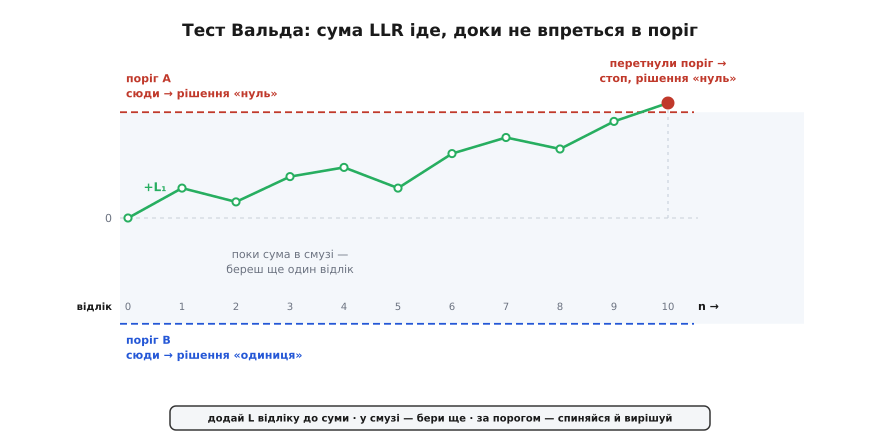
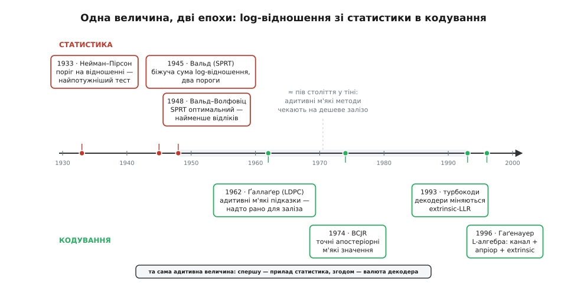

# 📜 Від перевірки гіпотез до декодера: як народилося логарифмічне відношення

Логарифмічне відношення правдоподібностей ніхто не вигадував для радіо. Воно прийшло в кодування вже готовим — зі статистики 1930–40-х років, де було відповіддю відразу на два питання, які на око не мають спільного: «який із можливих тестів найкращий?» і «як мало даних мені треба, щоб вирішити напевно?». Обидві відповіді виявилися тим самим об'єктом — відношенням правдоподібностей, — а в його логарифмі схована та адитивність, на якій за півстоліття виросло все м'яке декодування. Ця вставка про те, як цей об'єкт народжувався, хто його виточив і чому радіотехніка зрештою прийшла по нього до математиків.

## Найпотужніший тест: Нейман і Пірсон, 1933

Перш ніж питати «найкращий тест», треба було домовитися, що взагалі означає «тест». До кінця 1920-х перевірка гіпотез була радше набором рецептів: Роналд Фішер давав рівень значущості (p-значення) — імовірність побачити такі чи ще крайніші дані, якби нульова гіпотеза була правдива, — але не казав, яку саме статистику брати й що робити з альтернативою. Бракувало самої постановки задачі як задачі вибору.

Її дали двоє. Єжи Нейман (Jerzy Spława-Neyman) — поляк, народжений 1894 року в Бендерах у Бессарабії (тоді Російська імперія, нині Молдова), у польській шляхетській родині; на математика він вивчився в Харкові. Іґон Пірсон (Egon Pearson) — англієць, син Карла Пірсона, того самого, чиїм ім'ям звуть коефіцієнт кореляції. У спільній праці 1933 року «On the Problem of the Most Efficient Tests of Statistical Hypotheses» вони переписали перевірку гіпотез як рішення між двома гіпотезами — нульовою H₀ й альтернативною H₁ — і побачили, що помилок буває рівно два роди: відкинути H₀, коли вона правдива (помилка першого роду, ймовірність α), і не відкинути її, коли насправді має місце H₁ (помилка другого роду, ймовірність β). «Сила» тесту (power) — це 1 − β, шанс упіймати H₁, коли вона таки правдива.

Тепер «найкращий» нарешті має сенс: серед усіх тестів, що тримають α не вищим за домовлену межу, взяти той, у якого β найменше — тобто сила найбільша. І лема Неймана–Пірсона дає відповідь одним рядком: найпотужніший тест порівнює відношення правдоподібностей із порогом.

```
прийняти H₁, якщо   P(дані | H₁) / P(дані | H₀)  >  поріг
```

Тут правдоподібність гіпотези — це ймовірність побачити саме ці дані, якби гіпотеза була правдива; яка з двох стоїть у чисельнику — питання домовленості, важить, що розрізняє їх саме відношення. Жодна інша статистика не б'є його — воно і є оптимальний розрізнювач двох гіпотез. Ось звідки родом ідея, що саме відношення правдоподібностей несе всю потрібну для рішення інформацію: це її свідоцтво про народження, видане 1933 року. Робилося це, до речі, проти спротиву Фішера, який до кінця життя вважав їхню «поведінкову» рамку з двома помилками чужою духові наукового висновку — суперечка задокументована й тліє в підручниках досі. І варто одразу відзначити межу результату: він про фіксований наперед обсяг даних. Зібрали n відліків, порахували відношення, порівняли з порогом. Скільки саме брати відліків — лема не питає. Саме за це вхопився наступний актор.

## Накопичувати свідчення: Вальд і послідовний тест

Фіксований обсяг даних — марнотратство, і кожен практик це відчуває. Якщо перші ж кілька відліків кричать «H₀ явно хибна», безглуздо добивати заплановану сотню; а якщо все на межі — сотні може й забракнути. Цю саму думку у воєнні роки хтось мусив перетворити на математику.

Поштовх прийшов із випробувань боєприпасів. У Statistical Research Group (статистичній дослідній групі) при Колумбійському університеті — статистичному штабі американських військових — Мілтон Фрідман і Аллен Волліс (W. Allen Wallis) зіткнулися із зауваженням досвідченого артилериста: майстер часто вже по кількох сотнях пострілів бачить, що нова партія набоїв або явно гірша, або явно краща за очікувану, тож решта запланованих пострілів — просто викинуті набої. Фрідман і Волліс задачі не подужали й переказали її Абрахамові Вальду.

Вальд (Abraham Wald) — угорський математик єврейського походження, народжений 1902 року в Коложварі (Kolozsvár, Австро-Угорщина; після Першої світової місто відійшло Румунії й стало Клужем). Ортодоксальна родина не пускала його до школи по суботах, тож початкову й середню освіту він здобув удома; згодом учився у Відні, а 1938-го, коли аншлюс зробив Австрію небезпечною для єврея, Гарольд Готеллінг запросив його до Колумбійського університету. Там воєнна задача про набої й лягла йому на стіл.

Розв'язок Вальда — послідовний тест на відношенні правдоподібностей (sequential probability ratio test, SPRT). Замість фіксувати обсяг наперед, він тримає біжучу суму: після кожного відліку додає до неї логарифм відношення правдоподібностей цього відліку — саме логарифм, бо для незалежних відліків відношення перемножуються, а логарифми через те додаються. Поки сума блукає у смузі між двома порогами — рішення нема, береш наступний відлік. Щойно вона перетнула верхній поріг — приймаєш одну гіпотезу; впала за нижній — другу. А самі пороги виставлені так, щоб витримати задані наперед α і β.



*Прилад Вальда: кожен відлік додає своє L до суми; поки сума в смузі нерішучості — тест бере ще один відлік; перетин верхнього порога дає рішення «нуль», нижнього — «одиниця». Обсяг вибірки не фіксований наперед — його диктує сам сигнал.*

Придивімося, що це таке. «Додай логарифм відношення чергового відліку до суми й дивись, чи не перетнула вона поріг» — це буквально та сама арифметика, якою через півстоліття житиме м'який декодер: одне знакове число, до якого додаєш кожне нове свідчення. Вальд не просто виписав адитивність — він зробив із неї працюючий прилад, що заощаджує дані. Свій результат він виклав у закритому звіті ще у вересні 1943-го; воєнна цінність методу була така, що його засекретили, і до відкритої публікації він дійшов лише 1945 року, а окремою книжкою «Sequential Analysis» — 1947-го.

> 🔧 **Навіщо це для зв'язку.** Прилад Вальда — це кістяк м'якого декодера, тільки на півстоліття раніше. Накопичувальний декодер згорткового коду чи ітеративний декодер робить рівно те саме: тримає для кожного біта біжуче L-значення й додає до нього кожне нове свідчення — з каналу, від сусідніх бітів, з попередньої ітерації. «Скільки свідчень зібрати» так само диктує сам сигнал: на чистому каналі впевненість набігає за кілька кроків, на шумному — треба більше.

## Печатка оптимальності: Вальд і Волфовіц, 1948

Лишалося довести, що SPRT не просто зручний, а найкращий. Нейман і Пірсон показали оптимальність відношення за фіксованого обсягу; Вальд разом із Джейкобом Волфовіцем (Jacob Wolfowitz) — американським математиком, народженим 1910 року у Варшаві (тоді підросійська Польща) в єврейській родині й привезеним до США десятилітнім — 1948 року довели двоїсту оптимальність: серед усіх тестів, хоч послідовних, хоч із фіксованим обсягом, із тими самими ймовірностями помилок α і β послідовний тест на відношенні правдоподібностей у середньому потребує найменше відліків.

Обидва краї тепер зійшлися на тому самому об'єкті. Зафіксуй дані — відношення правдоподібностей дає найпотужніший тест. Зафіксуй потрібну певність — те саме відношення, накопичуване логарифмом, доводить до неї найшвидше. Не дивно, що на практиці SPRT часто вдвічі ощадливіший за тест із наперед заданим обсягом; для воєнного контролю якості це означало вдвічі менше розстріляних набоїв на ту саму гарантію.

## Довга тінь і друге народження в кодуванні

А потім ця величина надовго залягла. Її домом була статистика — контроль якості, клінічні випробування, — і в теорію зв'язку вона не поспішала. Тим часом Клод Шеннон 1948-го показав, що в кожного каналу є межа, нижче якої можна передавати як завгодно надійно: це [теорема кодування каналу](topic:math-information/channel-coding-theorem) — канал має скінченну ємність, і при швидкості нижче за неї існують коди з як завгодно малою похибкою, тільки теорема не каже, як їх декодувати. Гонитва за цією межею й привела кодування назад до логарифма відношення — бо, щоб дотягтися до Шеннона, декодер мусить нести не биті, а довіру до них.

Показово, як довго доводилося чекати на залізо. Роберт Ґаллаґер ще 1962 року (з дисертації 1960-го) описав [коди з розрідженою перевіркою парності](topic:com-modulation/ldpc) — LDPC: біти пов'язані небагатьма рівняннями парності, а декодер ганяє м'які ймовірнісні підказки графом цих рівнянь, аж поки вони не узгодяться. Ідея була наскрізь адитивна й м'яка — і на тридцять років забута, бо тодішні машини такого декодера не тягли. Схожа доля спіткала точний м'який декодер: 1974 року Лаліт Бал, Джон Кок, Фредерік Єлінек (Frederick Jelinek — чех, що втік із комуністичної Чехословаччини до США) і Йозеф Равів опублікували алгоритм, який згодом назвуть їхніми ініціалами — BCJR. Він рахує для кожного біта точну апостеріорну ймовірність на решітці коду — тобто м'який вихід, а не просто найімовірнішу послідовність, як її дає [алгоритм Вітербі](topic:com-modulation/viterbi-algorithm): той знаходить один найправдоподібніший шлях решіткою й видає тверді біти, тоді як BCJR зважує всі шляхи й дає для кожного біта міру довіри. BCJR теж був надто дорогий для свого часу й майже двадцять років пролежав у шухляді.

Розбудив усе 1993 рік. Французи Клод Берру і Ален Ґлав'є разом із Пуньєю Тхітімайшимою (тайським аспірантом Берру) показали [турбокоди](topic:com-modulation/turbo-codes): два простих коди на спільних даних, а їхні декодери по черзі обмінюються м'якими підказками, і з кожним колом обміну спільна певність росте, підбираючись до межі Шеннона. Ключ був у тому, ЩО саме передавати між декодерами: не тверде рішення, а «зовнішнє» (extrinsic) L-значення — рівно ту нову довіру, яку один декодер додав понад те, що вже знав другий. Успіх турбокодів миттю воскресив і LDPC (їх наново відкрили Девід Маккей та Радфорд Ніл у середині 1990-х), і BCJR як їхній робочий двигун.

Останній штрих — назвати річ на ім'я. Йоахім Гаґенауер із колегами 1996 року звів це в «алгебру логарифмічних відношень» (log-likelihood algebra): будь-який м'який декодер приймає L-значення й видає L-значення, а той вихід розкладається в суму трьох доданків — того, що дав канал, того, що було відомо апріорі, і зовнішнього внеску, який передається далі по колу. Порівняйте із приладом Вальда: та сама сума логарифмів відношення, тільки замість «взяти ще відлік» тут «узяти ще підказку від сусіда». Величина, виточена, щоб економити набої на полігоні, стала розмінною монетою декодерів, що доганяють Шеннона.



*Над віссю — статистика (Нейман–Пірсон, Вальд, Вальд–Волфовіц), під віссю — кодування (LDPC, BCJR, турбокоди, L-алгебра). Між ними — довга тінь: адитивні м'які методи чекали, доки подешевшає обчислення.*

## Одне питання під трьома масками

Варто відступити на крок і побачити, чому та сама величина щоразу спрацьовувала. Питання 1933 року «який тест найпотужніший?», питання 1943-го «як мало набоїв розстріляти?» і питання 1993-го «як дотягтися до межі Шеннона?» — це, по суті, одне питання: як оптимально скласти незалежні свідчення про двійковий вибір. У нього одна природна координата — логарифм відношення правдоподібностей, — і в ній «додати ще одне свідчення» завжди коштує одне додавання. Радіотехніка не винаходила цієї координати; вона впізнала в ній інструмент, який статистика виточила на два покоління раніше.
