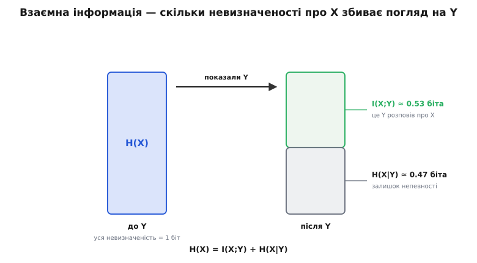
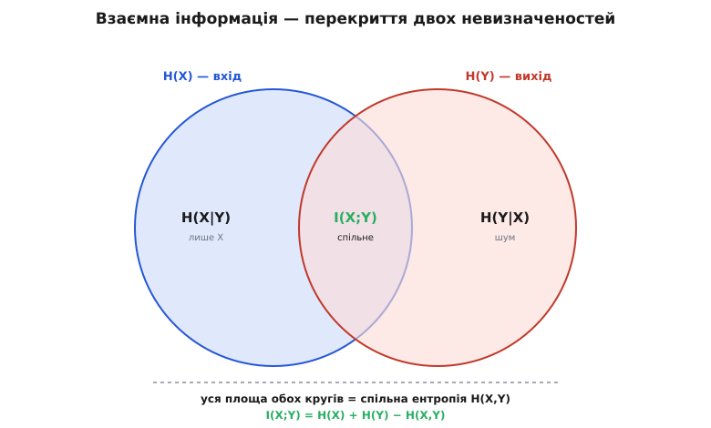
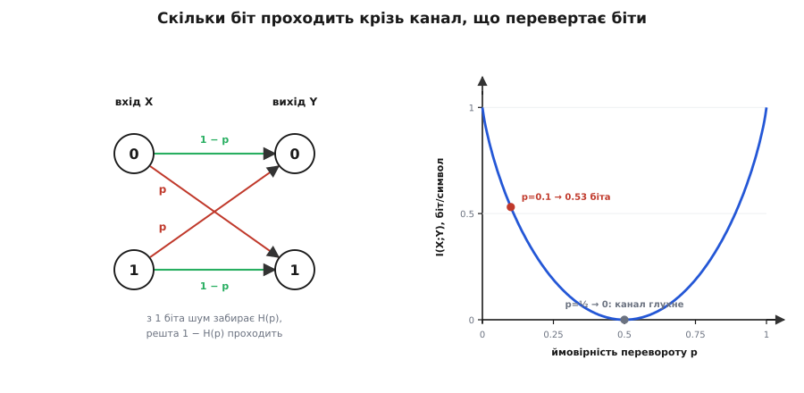

# Взаємна інформація

<preknowlist>
- [Ентропія Шеннона](topic:math-information/shannon-entropy) — H як міра невизначеності джерела в бітах; несподіванка події I = log₂(1/p) і чому передбачуване не несе інформації.
- [Імовірність як міра непевності](topic:math-probability/probability-basics) — спільна ймовірність p(x,y) двох подій разом, окремі ймовірності p(x) і p(y) кожної, і що означає незалежність.
- [Логарифми](topic:math-analysis/logarithms) — log₂ як кількість двійкових запитань; чому log(a·b) = log a + log b.
</preknowlist>

Ентропія міряє невизначеність одного джерела — скільки в ньому непередбачуваного, коли дивишся на нього самого. Та зв'язок — це завжди **двоє**: на одному кінці відправляють символ X, на другому приймають Y, а поміж них — канал із шумом, що псує частину переданого. Приймач ніколи не бачить X напряму; він бачить лише Y і мусить **здогадатися**, що ж було послано. Тому головне питання зв'язку — не «яка невизначеність X» і не «яка невизначеність Y», а зовсім інше: **скільки погляд на Y розповідає про X?** Скільки бітів того, що відправили, справді пережили канал і дають себе відновити з прийнятого?

Оцю величину — «скільки одна випадкова річ каже про іншу» — і називають **взаємною інформацією** (англ. *mutual information* — спільна, обопільна). Вона стоїть у самому серці теорії зв'язку, бо саме її, а не ентропію, максимізують, щоб дістати пропускну здатність каналу. Розберімо, звідки вона береться, — від простої думки про підказку, що зменшує непевність.

### Підказка, що зменшує невизначеність

Уяви, що ти маєш угадати переданий біт X, поки що нічого не бачачи. Якщо нулі й одиниці рівноймовірні, твоя невизначеність — рівно один біт: ентропія `H(X) = 1`. Тепер тобі показують вихід каналу Y. Він не ідеальний — шум міг перевернути біт, — але це вже **не ніщо**: побачивши Y, ти здогадуєшся про X куди впевненіше, ніж наосліп. Питання лише — **наскільки** впевненіше.

Щоб це виміряти, потрібна величина, яка каже, скільки невизначеності про X **лишається** після того, як Y уже відомий. Її звуть [умовною ентропією](topic:math-information/conditional-entropy) `H(X|Y)` (читається «ентропія X за умови Y»): це середня непевність щодо X, коли приймач тримає Y у руках. Якщо канал ідеальний, Y точно вказує на X — залишкова невизначеність нульова, `H(X|Y) = 0`. Якщо канал — суцільний шум і Y нічого не підказує, залишок дорівнює всій вихідній невизначеності, `H(X|Y) = H(X)`.

Тоді те, що Y **розповів** про X, — це просто наскільки впала невизначеність: скільки її було мінус скільки лишилося.

```
I(X;Y) = H(X) − H(X|Y)
       (було)   (лишилось)
```

Оце й є взаємна інформація: **скорочення непевності про X завдяки знанню Y**. Була невизначеність `H(X)`; побачивши Y, ти позбувся частини її — і рівно ця збита частина є інформацією, яку Y несе про X. Ідеальний канал не лишає залишку, тож віддає всі `H(X)` бітів; глухий шумовий канал не збиває нічого, тож віддає нуль. Усе реальне — між цими краями.


*Взаємна інформація як скорочення невизначеності. Ліворуч — уся невизначеність про переданий символ, H(X). Праворуч, коли приймач уже бачить вихід Y, лишається тільки залишок H(X|Y) — те, чого Y так і не прояснив. Різниця між ними, I(X;Y), — це біти, які Y насправді розповів про X: рівно вони й пройшли каналом.*

### Взаємність — і чому вона дивує

Ту саму думку можна почати з іншого кінця. Спитаймо навпаки: скільки X розповідає про Y? Тоді за тим самим міркуванням це `H(Y) − H(Y|X)` — вихідна невизначеність виходу мінус те, що лишається про Y, коли вхід відомий. І тут ховається зовсім не очевидний факт: обидва підрахунки дають **те саме число**.

```
I(X;Y) = H(X) − H(X|Y) = H(Y) − H(Y|X)
```

Скільки Y каже про X — рівно стільки ж, скільки X каже про Y. Інформація тут **обопільна**, її не можна поділити на «джерело» й «приймача»: вона належить парі, зв'язку між двома величинами, а не котрійсь із них окремо. Саме через цю симетрію величину й назвали **взаємною**: вона нічия поодинці й спільна для двох. (Сам Шеннон 1948 року називав її сухіше — «швидкість передавання»; звичну нам назву *mutual information* пізніше запровадив [Роберт Фано](topic:math-information/mutual-information/hist-naming.md), і за нею стоїть акуратна думка про те, що інформація завжди є інформацією **про** щось.)

### Дві шапки, що налягають одна на одну

Симетрію легше побачити картинкою. Намалюймо невизначеність X як один круг, а невизначеність Y — як другий. Що вони спільного? Рівно ту частину, де знання одного прояснює інше, — **перекриття** двох кругів. Це перекриття і є взаємна інформація.


*Взаємна інформація як перекриття. Лівий круг — невизначеність входу H(X), правий — виходу H(Y). Спільна лінза посередині, I(X;Y), — те, що вони знають одне про одного. Лівий місяць, H(X|Y), — невизначеність X, якої Y так і не прояснив; правий, H(Y|X), — те у Y, чого не пояснює X (для каналу це власне шум). Уся зафарбована площа — спільна ентропія H(X,Y), невизначеність пари як цілого.*

Уся зафарбована площа — це невизначеність **пари** `(X, Y)`, узятої за один складений символ; її звуть спільною ентропією `H(X,Y)` — просто ентропія від X і Y разом. Тепер порахуймо площу об'єднання так, як завжди рахують площу двох кругів, що налягають: додай обидва й **відніми перекриття, яке інакше порахував би двічі**. Звідси третій — і найгарніший — вираз для взаємної інформації:

```
I(X;Y) = H(X) + H(Y) − H(X,Y)
```

Читається просто: якби X і Y не мали між собою нічого спільного, невизначеність пари дорівнювала б сумі окремих, `H(X) + H(Y)`. Наскільки пара **менш** невизначена за цю суму — рівно настільки величини зав'язані одна на одну, і рівно стільки біт вони поділяють. Спільність **заощаджує** невизначеність: те, що X і Y знають одне про одного, не треба тримати двічі.

### Формула: відстань від незалежності

Три записи вище — через ентропії — гарні для інтуїції, але саму взаємну інформацію можна дістати й безпосередньо з імовірностей, і цей запис відкриває її глибший зміст:

```
I(X;Y) = Σ p(x, y) · log₂[ p(x, y) / (p(x)·p(y)) ]

         (сума по всіх парах символів x входу та y виходу)
```

Щоб її прочитати, згадаймо, що означає **незалежність**. Якби X і Y геть не впливали одне на одного, шанс побачити їх разом був би простим добутком окремих шансів: `p(x,y) = p(x)·p(y)`. Тоді дріб під логарифмом усюди дорівнював би одиниці, `log₂1 = 0`, і вся сума склала б **нуль** — незалежні величини не кажуть одна про одну нічого, і взаємна інформація це чесно ловить. А якщо якісь пари `(x, y)` трапляються **частіше**, ніж передбачив би добуток (справжнє `p(x,y)` більше за `p(x)·p(y)`), — це і є слід залежності, і логарифм відношення додає до суми додатний внесок. Отже, взаємна інформація міряє, **наскільки спільний розподіл відхилився від незалежності**: як далеко справжня картина `p(x,y)` від тієї, що була б, коли б величини нічого не значили одна для одної.

Ця «відстань від незалежності» — не образ, а точна річ: сума в формулі є [розбіжністю Кульбака–Лейблера](topic:math-information/kl-divergence) між справжнім спільним розподілом `p(x,y)` і добутком окремих `p(x)·p(y)`. Саме тому взаємна інформація ніколи не буває від'ємною й дорівнює нулю **тільки** для незалежних величин: розподіл не може лежати «менш ніж на нульовій відстані» від самого себе. (Звідки всі три записи через ентропії зводяться до цього одного, чому сума ніколи не від'ємна й як звідси випливають головні властивості — виводить [математична вставка](topic:math-information/mutual-information/math-mi-identities.md).)

> 🔧 **Навіщо це.** Форма «відстань від незалежності» робить взаємну інформацію універсальним **вимірником зв'язності** — куди чеснішим за звичну кореляцію. Кореляція бачить лише прямолінійну залежність і сліпне на кривій; взаємна інформація ловить **будь-яку** — і нелінійну теж, — бо питає не «чи ростуть разом», а «чи спільний розподіл узагалі відрізняється від незалежного». Тому нею відбирають найінформативніші ознаки в машинному навчанні, суміщають медичні знімки, шукають приховані залежності в даних давачів. Нуль означає справжню незалежність, а не просто відсутність прямої лінії.

### Скільки її буває

У взаємної інформації є прості й строгі береги. Вона **ніколи не від'ємна**: погляд на Y не може зробити тебе непевнішим щодо X, ніж ти був наосліп, — у середньому підказка або допомагає, або не змінює нічого, але не шкодить. Знизу її дно — нуль, і сягає вона його рівно тоді, коли X і Y незалежні.

Згори її тримає власна невизначеність кожної з величин: `I(X;Y) ≤ H(X)` і водночас `I(X;Y) ≤ H(Y)`. Це очевидно з картинки — перекриття не буває більшим за менший із двох кругів. По суті: з Y годі витягти про X більше бітів, ніж їх у самому X було, — не можна дізнатися про монету більше за один біт, хоч скільки на неї дивись. А коли взяти взаємну інформацію величини **із самою собою**, перекриття збігається з усім кругом: `I(X;X) = H(X)`. Величина знає про себе геть усе — тому ентропію інколи й звуть власною інформацією.

### Порахуймо руками: канал, що перевертає біти

Оживімо все на найпростішій моделі шуму — [двійковому симетричному каналі](topic:math-information/binary-symmetric-channel): кожен біт незалежно перевертається з імовірністю `p`, інакше проходить цілим. Хай на вхід ідуть рівноймовірні нулі й одиниці, а канал псує кожен десятий біт (`p = 0.1`). Скільки біт про вхід несе кожен прийнятий символ?

Тут найзручніше йти від виходу: `I(X;Y) = H(Y) − H(Y|X)`. Коли вхід X **уже відомий**, єдине, що лишається невідомим у виході Y, — чи перевернувся біт цього разу; а це подія з імовірністю `p`, тобто невизначеність рівно `H(p)` — двійкова ентропія шуму. Вихід же при рівноймовірному вході теж рівноймовірний, тож `H(Y) = 1`.

**Канал: рівноймовірний вхід, ймовірність перевороту `p = 0.1`.** Обчислимо шумовий залишок і взаємну інформацію:

```
H(Y)   = 1 біт                            (вихід рівноймовірний)

H(Y|X) = H(p) = −0.1·log₂0.1 − 0.9·log₂0.9   (лишилась тільки «чи перевернувся?»)
       = 0.1·3.322 + 0.9·0.152
       = 0.332 + 0.137  =  0.469 біта

I(X;Y) = H(Y) − H(Y|X)
       = 1 − 0.469
       =  0.531 біта на символ
```

Отже, попри те що кожен десятий біт приходить перевернутим, кожен прийнятий символ несе про переданий **0.531 біта** справжньої інформації. Шум украв не весь біт, а лише свою частку `H(p) = 0.469`; решта надійно **пройшла**. За симетрією те саме дасть і рахунок від входу, `H(X) − H(X|Y)`, — залишкова невизначеність про X після погляду на Y теж виходить рівно `H(p)`.


*Ліворуч — сам канал: біт проходить із імовірністю 1−p або перевертається з p. З одного біта «місця» на символ шум забирає H(p) невизначеності, а решта, I = 1 − H(p), лишається надійною. Праворуч — як ця частка тане зі зростанням шуму: при p=0 крізь канал проходить цілий біт, при p=½ вихід стає монеткою, незалежною від входу, і взаємна інформація падає до нуля — канал глухне.*

### Навіщо це — межа каналу

Тепер видно, чому саме взаємна інформація, а не ентропія, — головна величина зв'язку. Пропускна здатність каналу означена так: це **найбільша взаємна інформація**, яку можна вичавити між входом і виходом, перебравши всі способи розподілити вхідні символи:

```
C = max I(X;Y)
    p(x)
```

Тобто інженер вільний обирати, як **годувати** канал (які символи й з якими частотами слати), і шукає той вхідний розподіл, за якого вихід розповідає про вхід **найбільше**. Це максимальне число бітів на символ і є ємність `C` — та сама стеля з [теореми Шеннона про кодування каналу](topic:math-information/channel-coding-theorem), нижче за яку зв'язок можна зробити майже безпомилковим. Для двійкового симетричного каналу максимум досягається якраз на рівноймовірному вході — тому пораховані щойно `0.531 біта` є не просто взаємною інформацією за одного вибору входу, а **самою ємністю** цього каналу, `C = 1 − H(p)`.

> 🔧 **Навіщо це.** Ланцюжок «взаємна інформація → її максимум → ємність» — це місток від абстрактних імовірностей до конкретної цифри в бюджеті лінії. Виміряй або змоделюй, як твій канал спотворює символи (матриця переходів «що послав → що прийняв»), полічи взаємну інформацію й підніми її по вхідному розподілу — дістанеш `C`, граничну швидкість без помилок. Це працює не лише для радіо: та сама величина ставить стелю для комірки [флеш-пам'яті](topic:hw-arch/ecc-ram-flash), що плутає рівні заряду, для оптичного каналу, для будь-якого зашумленого зв'язку. Взаємна інформація — це лічильник того, скільки правди проходить крізь ненадійний носій.

Порахувати взаємну інформацію та її максимум на реальних даних — окрема практична задача: як оцінити її з вибірки спостережень і як чисельно знайти ємність каналу з відомою матрицею переходів — показує [код-проєкт](topic:math-information/mutual-information/proj-estimate-mutual-information.md).

### Підсумок

Ентропія міряє невизначеність однієї величини; **взаємна інформація** `I(X;Y)` міряє, скільки одна величина каже про іншу, — біти, спільні для двох. Її природно читати як **скорочення невизначеності**: `I(X;Y) = H(X) − H(X|Y)` — наскільки погляд на Y збиває непевність щодо X. Підрахунок від будь-якого кінця дає те саме число (`= H(Y) − H(Y|X)`), тож інформація тут обопільна — звідси й назва. Геометрично це **перекриття** двох кругів невизначеності, `I(X;Y) = H(X) + H(Y) − H(X,Y)`, а прямо з імовірностей — **відстань спільного розподілу від незалежності**, `Σ p(x,y)·log₂[p(x,y)/(p(x)·p(y))]`, тобто розбіжність Кульбака–Лейблера між `p(x,y)` і `p(x)·p(y)`. Тому вона ніколи не від'ємна, дорівнює нулю лише для незалежних величин і не перевищує власної ентропії жодної з них. Головний її сенс у зв'язку — ємність: `C = max I(X;Y)` по вхідному розподілу, гранична швидкість надійної передачі. Для каналу, що перевертає кожен десятий біт, це `1 − H(0.1) ≈ 0.531` біта на символ — рівно стільки правди проходить крізь шум.

---
