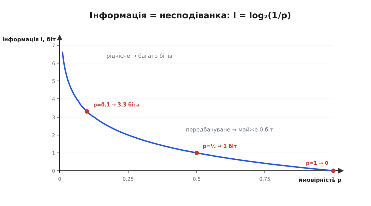
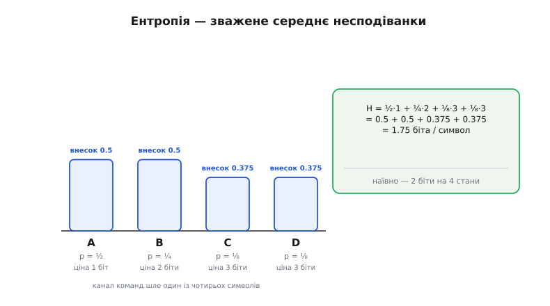
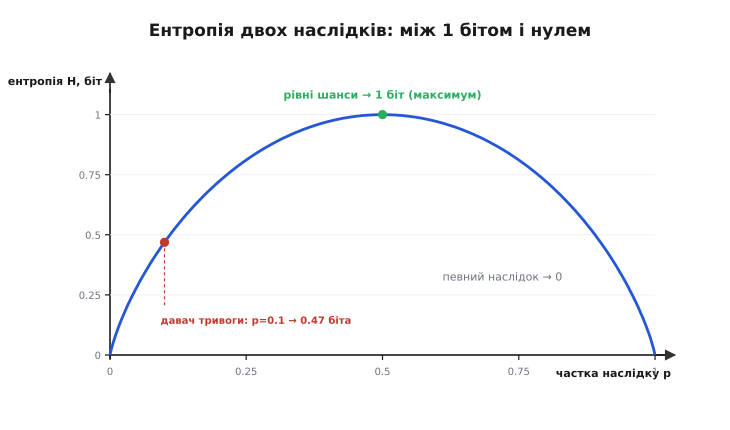
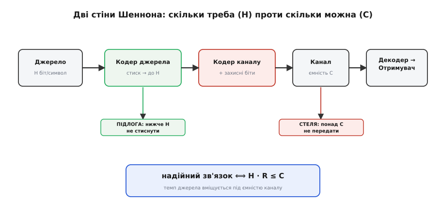

# Ентропія Шеннона

<preknowlist>
- [Імовірність як міра непевності](topic:math-probability/probability-basics) — що таке ймовірність події `p` (число від 0 до 1) і як читати «шанс, що трапиться саме це».
- [Логарифми](topic:math-analysis/logarithms) — логарифм як обернене до піднесення в степінь; `log₂x` питає, у який степінь звести двійку, щоб дістати `x`.
</preknowlist>

Перш ніж щось передати каналом, інженер мусить знати одну річ: **скільки** там узагалі є що передавати. Не скільки літер у повідомленні й не скільки байтів займе файл — а скільки в ньому справжнього **змісту**, який приймач не зможе відтворити сам. Бо те, що приймач і так передбачить, слати немає сенсу: канал витратиться намарно. Уся інформація, варта передавання, — це рівно те, що на дальньому боці **не вгадується наперед**.

Цю думку, якщо довести її до числа, породжує одну з двох головних величин усієї теорії зв'язку. 1948 року **Клод Шеннон** (*Claude Shannon*) у статті «Математична теорія зв'язку» показав, що інформацію можна зміряти точно — у бітах, — і що в кожного джерела є своя **ентропія**: середня кількість інформації на символ. Це те неусувне дно, нижче за яке повідомлення не стиснути й менше за яке каналом не передати, хоч би яка була техніка. Розберімо, звідки воно береться, — від однієї-єдиної події.

### Інформація — це несподіванка

Уяви прогноз погоди для міста в пустелі, де сонце світить триста днів на рік. «Завтра ясно» — цей прогноз не каже майже нічого: ти й так це знав, він **передбачуваний**. Але якщо одного дня надійде «завтра сніг» — оце новина: подія рідкісна, малоймовірна, і саме тому важка змістом. Виходить дивна на позір річ: інформація живе не в самих словах, а в тому, **наскільки подія могла б виявитися іншою**. Те, що мусило статися, нового не повідомляє.

Звідси проста вимога до міри. Що рідкісніша подія (менша її ймовірність `p`), то більше вона важить, коли таки стається; що частіша — то менше. Несподіванку події Шеннон виміряв так:

```
I = log₂(1 / p)   бітів
```

Прочитаймо формулу очима. Подія, якої чекаєш напевно (`p = 1`), коштує `log₂1 = 0` бітів — нуль, бо вона нічого не додає до вже відомого. Подія «орел чи решка» (`p = ½`) коштує `log₂2 = 1` біт — рівно одну чесну відповідь «так чи ні». Рідкісна подія — одна на тисячу (`p = 0.001`) — коштує `log₂1000 ≈ 10` бітів: багато, бо сильно дивує.

Чому саме **логарифм**, а не якась інша спадна функція? Тут ховається глибока причина, а не зручність запису. Візьми дві **незалежні** події — скажімо, два окремі давачі, кожен зі своєю новиною. Імовірність, що обидва покажуть саме те, що показали, — це добуток їхніх імовірностей (`p₁ · p₂`). А інформація від двох незалежних новин має просто **додаватися**: передати дві окремі речі — це передати одну плюс другу, не більше й не менше. Єдина функція, що перетворює множення ймовірностей на **додавання** інформації, — логарифм, бо `log(p₁·p₂) = log p₁ + log p₂`. Саме ця вимога адитивності й змушує міру бути логарифмічною; ніщо інше не підійде. (Чому з тих самих кількох простих вимог логарифм випливає **однозначно** — розгортає [математична вставка](topic:math-information/shannon-entropy/math-entropy-axioms.md), що виводить формулу з аксіом на міру інформації.)


*Інформація однієї події. Що ймовірніша подія (p ближче до 1), то менше бітів вона несе: при p=1 — рівно нуль. Що рідкісніша (p мале), то різкіше росте ціна. Подія з рівними шансами (p=½) коштує один біт — одну відповідь «так чи ні».*

Гарна перевірка інтуїції: щоб угадати задумане число від 1 до 1000 запитаннями «так/ні», треба десь **десять** запитань — рівно `log₂1000`. Несподіванка в бітах — це і є кількість двійкових запитань, щоб дізнатися, що ж сталося. Тому й одиниця зветься **біт** (*bit*, від *binary digit* — «двійкова цифра»; саме слово 1947 року підказав Шеннонів колега Джон Тʼюкі). Один біт — це несподіванка події з імовірністю рівно ½, тобто одна розв'язана двоїстість «так чи ні».

### Ентропія — середня несподіванка джерела

Несподіванка `I` — про одну подію. Та джерело зв'язку сипле символи знову й знову: літери тексту, відліки звуку, стани давача, коди команд. Важить тоді не несподіванка окремого символу, а **середня** несподіванка на символ — скільки бітів джерело виробляє за один свій крок у середньому. Її Шеннон і назвав **ентропією** (*entropy* — назву взято з термодинаміки, де вона теж міряє невпорядкованість):

```
H = Σ pᵢ · log₂(1 / pᵢ) = − Σ pᵢ · log₂(pᵢ)   бітів на символ
```

За громіздким записом — проста дія. Кожен символ `i` трапляється з частотою `pᵢ` і, коли трапляється, несе `log₂(1/pᵢ)` бітів несподіванки. Помнож одне на одне й додай по всіх символах — дістанеш **середню вагу одного символу в бітах**. Часті символи (велике `pᵢ`) додають до суми мало, бо й несподіванка їхня мала; рідкісні за раз важать багато, зате самих їх мало. Ентропія зважує те й те чесно.

Оце `H` і є **інформаційний темп джерела** на один символ. Помнож його на те, скільки символів джерело видає за секунду, — і дістанеш темп у бітах за секунду: рівно стільки інформації доведеться проштовхнути каналом, ні бітом більше в ідеалі.


*Ентропія — зважене середнє несподіванки. Канал команд шле один із чотирьох символів; частий коштує мало бітів, рідкісний — багато. Внесок символу — його частота на його ціну; сума внесків по всіх символах дає середню вагу символу H = 1.75 біта, менше за наївні 2 біти на чотири стани.*

> 🔧 **Навіщо це.** Ентропія — це чесна оцінка «скільки каналу насправді треба». Прикинувши ентропію того, що шле твій пристрій (кодів команд, рівнів АЦП, статусів телеметрії), ти ще до вибору схеми знаєш нижню межу потрібної швидкості. Якщо ентропія близька до наївного розміру — джерело майже без надлишку, тиснути марно; якщо набагато менша — величезний простір і для стиснення, і для економії ефіру. Те саме число підказує, чи влізе потік у вузьку радіолінію: порівняй `H` на секунду з тим, що тягне канал.

### Порахуймо руками: майже завжди мовчазна тривога

Щоб формула ожила, візьмімо реальне джерело зв'язку — лінію тривоги. Давач раз на секунду доповідає один із двох станів: «спокійно» майже завжди й «тривога» зрідка. Хай на кожні десять доповідей дев'ять — «спокійно»:

**Джерело: `p(спокійно) = 0.9`, `p(тривога) = 0.1`.** Ціна кожного стану й ентропія:

```
ціна «спокійно»: log₂(1/0.9) = 0.152 біта
ціна «тривога» : log₂(1/0.1) = 3.322 біта

H = 0.9 · 0.152 + 0.1 · 3.322
  = 0.137 + 0.332
  = 0.469 біта на символ
```

Наївно кожну доповідь «так/ні» кодують одним бітом — 1 біт на символ. Ентропія ж каже: справжньої інформації тут менш ніж **пів біта**. Тобто розумний код здатен ужати цей потік більш ніж удвічі — і це не хитрість, а факт про саме джерело: лінія, що майже завжди мовчить, майже нічого не повідомляє. Якщо давач шле 1000 доповідей за секунду, наївно це 1000 біт/с, а по-справжньому — лише близько **470 біт/с**; решту з'їдав би надлишок. Ось чому телеметрію, де більшість значень передбачувані, вигідно стискати перед відправкою: платиш ефіром рівно за несподіванки.

Протилежний край — коли передбачити не можна нічого. Для `N` **рівноймовірних** символів ентропія дорівнює рівно `log₂N`: чесна монета — `log₂2 = 1` біт, симетричний кубик на вісім граней — `log₂8 = 3` біти, байт, у якому всі 256 значень однаково ймовірні, — цілих `log₂256 = 8` бітів, і стиснути його ніяк. Це стеля; усе реальне лежить нижче за неї.

### Межі: найбільше й найменше

В ентропії є дві межі, і між ними живе вся інформатика зв'язку. Вона **найбільша**, коли всі наслідки рівноймовірні: передбачити нічого, кожен символ — повна несподіванка. І падає до **нуля**, коли один наслідок майже певний: тоді джерело передбачуване наскрізь, слати від нього нема чого.


*Ентропія джерела з двох наслідків залежно від їхньої рівності. Найвища (рівно 1 біт) там, де шанси рівні: максимум непередбачуваності. До країв падає до нуля: коли один наслідок майже певний, джерело віщуване й справжньої інформації в ньому майже немає — саме таким був наш мовчазний давач тривоги.*

Ця крива пояснює головне правило зв'язку: **чим передбачуваніше джерело, тим менше каналу воно потребує**. Рівномірний потік з `N` станів жере всі `log₂N` бітів і не тиснеться. Щойно частоти стають нерівними — а в природних даних вони завжди нерівні (частий пробіл і рідкісне «щ», спокій і зрідка тривога), — ентропія падає нижче за `log₂N`, і саме цей розрив між наївним `log₂N` і справжнім `H` вирізає стиснення. Ентропія — точна міра того, **скільки в джерелі непередбачуваного**, тобто скільки в ньому власне змісту.

### Дві стіни Шеннона: скільки треба проти скільки можна

Тепер найголовніше — заради чого ентропію в зв'язку й рахують. У будь-якій передачі стикаються **дві** непорушні величини, і кожна — стіна.

Перша стіна — сама ентропія `H`. Шеннонова [теорема про кодування джерела](topic:math-information/source-coding-theorem) каже: будь-який спосіб стиснути дані **без втрат** мусить у середньому витратити **щонайменше `H` бітів на символ**. Підійти до `H` згори можна як завгодно близько, опуститися нижче — ніколи; спробуєш — неминуче злипнуться два різні повідомлення, тобто з'явиться втрата. Отже `H` — це **підлога**: скільки бітів на символ ти зобов'язаний передати, хоч як майстерно пакуй.

Друга стіна — [пропускна здатність каналу `C`](topic:math-information/bandwidth-capacity): скільки бітів за секунду канал з даною смугою й даним шумом здатен пронести **без помилок**. Це **стеля**: понад `C` надійного зв'язку не буває за жодних хитрощів.

І ось як вони сходяться. Джерело виробляє `H` бітів на символ; хай воно видає `R` символів за секунду — тоді його інформаційний темп є `H · R` бітів за секунду. Надійна передача можлива тоді й лише тоді, коли цей темп **уміщується під стелею каналу**:

```
H · R   ≤   C
(темп джерела, біт/с)   (ємність каналу, біт/с)
```

Якщо джерело виробляє менше, ніж канал тягне, — існує кодування, що донесе все майже без помилок. Якщо більше — частина змісту неминуче загубиться, скільки потужності не додавай. Ця умова — суть [теореми про кодування каналу](topic:math-information/channel-coding-theorem), другого стовпа Шеннонової теорії.


*Дві межі однієї передачі. Кодер джерела вичавлює надлишок, тиснучи потік до підлоги — ентропії H (нижче не можна). Кодер каналу навпаки додає **керований** надлишок — захисні біти, щоб пережити шум, — не перетнувши стелі C (вище не можна). Надійний зв'язок є тоді, коли темп джерела H·R уміщується під ємністю C.*

Тут відкривається дивовижна симетрія, що тримає всю цифрову передачу. **Стиснення** й **завадостійке кодування** — дві протилежні дії з тим самим словом «надлишок». Кодер джерела надлишок **прибирає**, підганяючи потік упритул до `H`, щоб не слати зайвого. Кодер каналу натомість надлишок **додає** — але вже розумний, розрахований, — щоб з тих бітів можна було відновити повідомлення, потовчене шумом. Спершу викидаємо випадкову зайвину, тоді доливаємо навмисну. Шеннон довів, що ці дві роботи можна робити **окремо** й нічого при цьому не втратити, — і саме тому в кожному пристрої зв'язку є свій «стискач» (від ZIP до кодека відео) і свій «захисник» (від біта парності до [кодів, що витягли знімки з Вояджера](topic:com-modulation/reed-solomon)).

> 🔧 **Навіщо це.** Дві стіни — це кошторис будь-якої лінії ще до паяння. Порахуй `H · R` свого джерела (скільки біт/с воно справді виробляє) і `C` свого каналу (скільки він тягне). Темп менший за ємність — задача розв'язна, лишається знайти кодування. Темп більший — жодна антена не врятує: треба або стиснути джерело (зменшити `H`, викинувши надлишок чи огрубивши дані), або розширити канал (підняти `C` смугою чи сигнал-шумом). Число вирішує суперечку «чи взагалі можливо» ще до того, як обрано модуляцію.

### Ім'я, що прийшло з термодинаміки

Формула `H = −∑ p·log₂p` має двійника, старшого на добрих півстоліття. У статистичній фізиці **Джозая Віллард Ґіббс** (*Josiah Willard Gibbs*) ще наприкінці XIX століття записав ентропію системи як `S = −k·∑ pᵢ·ln pᵢ` — той самий вислів із точністю до сталої й основи логарифма, де `pᵢ` — імовірність мікростану. Саме цей збіг форми й підказав назву. За переказом, коли Шеннон вагався, як назвати свою величину, **Джон фон Нейман** (*John von Neumann*) порадив: клич її ентропією — по-перше, та сама функція вже зветься так у фізиці; по-друге, «ніхто до пуття не знає, що таке ентропія, тож у суперечці ти завжди матимеш перевагу». Історія знаменита, хоч сам Шеннон її прямо не підтверджував, — тож тримаймо її як **правдоподібний переказ**, а не задокументований факт. (Повний родовід імені — від Клаузіуса, що вигадав слово 1865-го, через Больцмана й Ґіббса до Шеннона — у [окремій вставці](topic:math-information/shannon-entropy/hist-entropy-name.md).)

Головне ж не в назві, а в тому, що зробив із цим Шеннон: він перетворив розпливчасте «інформація» на **точну, вимірювану величину** й довів, що в неї є непорушні межі. Відтоді ентропія джерела й ємність каналу стали двома координатами, у яких мислять усю передачу — від дозвонного модема до зв'язку з марсоходом.

---
